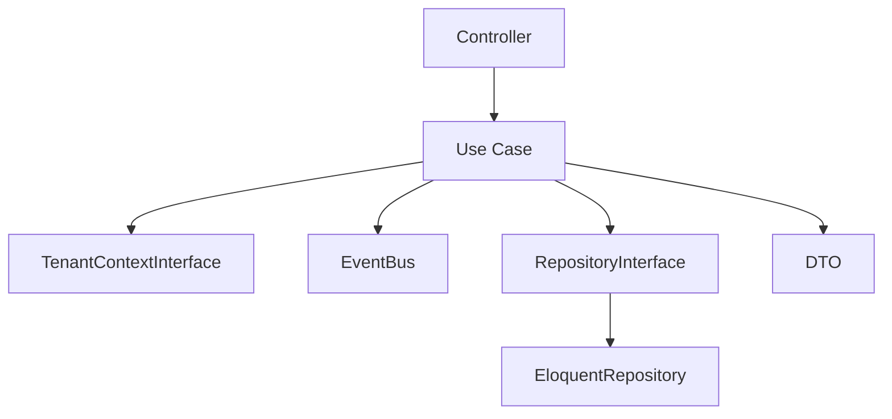
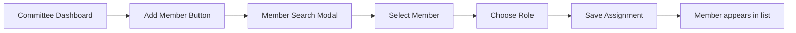

## Development Plan — Geographic Context + Committee Management

Based on your current project state and requirements, here's a **phased development plan**.

---

## Current Project State Assessment

| Component | Status |
|-----------|--------|
| **GeoLocation (IP detection)** | ✅ Completed (language detection) |
| **Locale Management** | ✅ Completed (org language, timezone) |
| **Geographic Context (0-10 levels)** | ✅ Code exists (needs copying) |
| **Committee Management** | ❌ Not started |
| **Member Address Storage** | ❌ Not started |
| **Permission System** | ❌ Not started |
| **Newsletter System** | ❌ Not started |
| **Committee Dashboards** | ❌ Not started |

---

## Phase 1: Copy Geographic Context (Week 1)

**Goal:** Get existing geography code into current project.

```bash
# Step 1: Copy Geography Context
cp -r old-project/app/Contexts/Geography nrna-eu/app/Contexts/

# Step 2: Copy migrations
cp -r old-project/database/migrations/*geography* nrna-eu/database/migrations/

# Step 3: Copy seeders
cp -r old-project/database/seeders/*Geography* nrna-eu/database/seeders/

# Step 4: Update namespaces (if needed)
# Ensure namespace App\Contexts\Geography\...

# Step 5: Run migrations
php artisan migrate --database=landlord
php artisan tenants:artisan "migrate"

# Step 6: Seed Nepal geography
php artisan db:seed --class=NepalGeographySeeder
```

**Deliverable:** Geographic units (7,581) available in tenant databases.

---

## Phase 2: Member Address Integration (Week 1-2)

**Goal:** Store member geographic location.

```sql
-- Add geography fields to members table
ALTER TABLE members ADD COLUMN geo_path TEXT;
ALTER TABLE members ADD COLUMN geo_unit_id BIGINT;
ALTER TABLE members ADD COLUMN geo_data JSON;

-- Index for fast lookup
CREATE INDEX idx_members_geo_path ON members USING GIST (geo_path);
```

**Files to Create:**
```
app/Contexts/Membership/
├── Services/
│   └── MemberGeographyService.php
├── ValueObjects/
│   └── MemberLocation.php
└── Http/
    └── Controllers/
        └── MemberGeographyController.php
```

**Deliverable:** Members can be assigned to geographic units.

---

## Phase 3: Committee Structure (Week 2-3)

**Goal:** Create committees mapped to geographic units.

```sql
-- Committees table
CREATE TABLE committees (
    id BIGSERIAL PRIMARY KEY,
    organisation_id UUID REFERENCES organisations(id),
    geo_unit_id BIGINT REFERENCES geo_administrative_units(id),
    parent_committee_id BIGINT REFERENCES committees(id),
    level INT NOT NULL,
    name VARCHAR(255) NOT NULL,
    name_local JSON,
    email VARCHAR(255),
    phone VARCHAR(50),
    member_count INT DEFAULT 0,
    is_active BOOLEAN DEFAULT true,
    created_at TIMESTAMP,
    updated_at TIMESTAMP
);
```

**Files to Create:**
```
app/Contexts/Committee/
├── Domain/
│   ├── Entities/
│   │   └── Committee.php
│   ├── ValueObjects/
│   │   ├── CommitteeLevel.php
│   │   └── CommitteeType.php
│   └── Repositories/
│       └── CommitteeRepositoryInterface.php
├── Application/
│   ├── Services/
│   │   ├── CommitteeService.php
│   │   └── CommitteeHierarchyService.php
│   └── Commands/
│       └── CreateCommitteeCommand.php
├── Infrastructure/
│   ├── Models/
│   │   └── Committee.php
│   └── Repositories/
│       └── EloquentCommitteeRepository.php
└── Http/
    └── Controllers/
        └── CommitteeController.php
```

**Deliverable:** Committees created for each geographic level.

---

## Phase 4: Committee Office Bearers (Week 3)

**Goal:** Assign members to committee leadership roles.

```sql
CREATE TABLE committee_office_bearers (
    id BIGSERIAL PRIMARY KEY,
    committee_id BIGINT REFERENCES committees(id),
    member_id UUID REFERENCES members(id),
    position VARCHAR(50) NOT NULL,
    position_local JSON,
    is_primary BOOLEAN DEFAULT false,
    term_start DATE NOT NULL,
    term_end DATE,
    is_current BOOLEAN DEFAULT true,
    permissions JSON, -- Custom permissions for this role
    created_at TIMESTAMP,
    updated_at TIMESTAMP
);
```

**Files to Create:**
```
app/Contexts/Committee/
├── Services/
│   └── CommitteeRoleService.php
└── Http/
    └── Controllers/
        └── CommitteeOfficeBearerController.php
```

**Deliverable:** Committee leadership assigned with permissions.

---

## Phase 5: Permission System (Week 3-4)

**Goal:** Geographic-based permissions.

```sql
-- Committee role permissions
CREATE TABLE committee_permissions (
    id BIGSERIAL PRIMARY KEY,
    committee_id BIGINT REFERENCES committees(id),
    role VARCHAR(50) NOT NULL,
    geo_scope VARCHAR(20) DEFAULT 'unit_and_descendants',
    can_send_newsletter BOOLEAN DEFAULT false,
    can_view_members BOOLEAN DEFAULT false,
    can_manage_members BOOLEAN DEFAULT false,
    can_view_finance BOOLEAN DEFAULT false,
    can_manage_finance BOOLEAN DEFAULT false,
    can_view_reports BOOLEAN DEFAULT true,
    created_at TIMESTAMP,
    updated_at TIMESTAMP
);
```

**Files to Create:**
```
app/Contexts/Permission/
├── Domain/
│   └── Services/
│       └── GeographicPermissionService.php
├── Application/
│   └── Policies/
│       ├── CommitteePolicy.php
│       └── MemberPolicy.php
└── Http/
    └── Middleware/
        └── CheckCommitteePermission.php
```

**Deliverable:** Committee leaders can only manage members in their geographic area.

---

## Phase 6: Committee Dashboard (Week 4-5)

**Goal:** Each committee gets its own dashboard.

```vue
resources/js/Pages/Committee/
├── Dashboard.vue
├── Members.vue
├── Finance.vue
├── Newsletter.vue
└── Settings.vue
```

**API Endpoints:**
```
GET    /api/committee/{id}/dashboard
GET    /api/committee/{id}/members
GET    /api/committee/{id}/finance
POST   /api/committee/{id}/newsletter/send
GET    /api/committee/{id}/statistics
```

**Deliverable:** Committee dashboard showing members, finance, newsletter tools.

---

## Phase 7: Newsletter System (Week 5-6)

**Goal:** Committees can send newsletters to their geographic area.

```sql
CREATE TABLE committee_newsletters (
    id BIGSERIAL PRIMARY KEY,
    committee_id BIGINT REFERENCES committees(id),
    subject VARCHAR(500) NOT NULL,
    content TEXT NOT NULL,
    target_geo_path VARCHAR(500),
    status VARCHAR(20) DEFAULT 'draft',
    sent_at TIMESTAMP,
    sent_count INT DEFAULT 0,
    open_count INT DEFAULT 0,
    created_at TIMESTAMP
);
```

**Files to Create:**
```
app/Contexts/Communication/
├── Services/
│   ├── NewsletterService.php
│   └── EmailTrackingService.php
├── Jobs/
│   └── SendCommitteeNewsletter.php
└── Mail/
    └── CommitteeNewsletter.php
```

**Deliverable:** Committee leaders can send newsletters to members in their geographic area.

---

## Phase 8: Finance Tracking (Week 6-7)

**Goal:** Committees track income/expenses.

```sql
CREATE TABLE committee_finances (
    id BIGSERIAL PRIMARY KEY,
    committee_id BIGINT REFERENCES committees(id),
    transaction_type VARCHAR(20) NOT NULL,
    amount DECIMAL(12,2) NOT NULL,
    category VARCHAR(100),
    description TEXT,
    transaction_date DATE NOT NULL,
    member_id UUID REFERENCES members(id),
    created_at TIMESTAMP
);
```

**Deliverable:** Committee treasurers can track finances.

---

## Phase 9: Organisation Admin Dashboard (Week 7-8)

**Goal:** Central admin for organisation-wide management.

```vue
resources/js/Pages/Organisation/
├── Admin/
│   ├── Dashboard.vue
│   ├── Committees.vue
│   ├── Members.vue
│   ├── Settings.vue
│   └── Reports.vue
```

**Deliverable:** Organisation admins can manage all committees.

---

## Phase 10: Testing & Deployment (Week 8)

**Goal:** Full test coverage and production deployment.

```bash
# Run all tests
php artisan test

# Run specific context tests
php artisan test tests/Contexts/Geography/
php artisan test tests/Contexts/Committee/
php artisan test tests/Contexts/Permission/

# Deploy
git push production main
php artisan migrate --force
php artisan tenants:artisan "migrate" --force
```

---

## Priority Summary

| Priority | Phase | Time | Dependencies | Value |
|----------|-------|------|--------------|-------|
| **P0** | Phase 1: Copy Geography | 2 days | None | Foundation |
| **P0** | Phase 2: Member Address | 3 days | Phase 1 | Core feature |
| **P1** | Phase 3: Committee Structure | 5 days | Phase 2 | Core feature |
| **P1** | Phase 4: Office Bearers | 3 days | Phase 3 | Leadership |
| **P2** | Phase 5: Permission System | 4 days | Phase 4 | Access control |
| **P2** | Phase 6: Committee Dashboard | 5 days | Phase 5 | User interface |
| **P3** | Phase 7: Newsletter | 5 days | Phase 6 | Communication |
| **P3** | Phase 8: Finance | 5 days | Phase 6 | Finance |
| **P4** | Phase 9: Organisation Admin | 5 days | Phase 6 | Admin |
| **P4** | Phase 10: Testing/Deploy | 5 days | All | Release |

---

## Immediate Next Action

**Start with Phase 1 today:**

```bash
# Copy Geographic Context to current project
cp -r old-project/app/Contexts/Geography nrna-eu/app/Contexts/
```

Do you want me to provide detailed implementation for any specific phase? 🚀
The plan is updated. Now calling ExitPlanMode:

─────────────────────────────────────────────────────────────────────────────────────────────────────────────────────────────────────────────────────────────────────────────────────────────────────────────────
 Ready to code?

 Here is Claude's plan:
╌╌╌╌╌╌╌╌╌╌╌╌╌╌╌╌╌╌╌╌╌╌╌╌╌╌╌╌╌╌╌╌╌╌╌╌╌╌╌╌╌╌╌╌╌╌╌╌╌╌╌╌╌╌╌╌╌╌╌╌╌╌╌╌╌╌╌╌╌╌╌╌╌╌╌╌╌╌╌╌╌╌╌╌╌╌╌╌╌╌╌╌╌╌╌╌╌╌╌╌╌╌╌╌╌╌╌╌╌╌╌╌╌╌╌╌╌╌╌╌╌╌╌╌╌╌╌╌╌╌╌╌╌╌╌╌╌╌╌╌╌╌╌╌╌╌╌╌╌╌╌╌╌╌╌╌╌╌╌╌╌╌╌╌╌╌╌╌╌╌╌╌╌╌╌╌╌╌╌╌╌╌╌╌╌╌╌╌╌╌╌╌╌╌╌╌╌╌╌╌╌╌╌╌╌╌╌╌╌
 Geography Context + Committee Management — Phase 1 Implementation Plan

 Context

 This project uses a single PostgreSQL database with Laravel GlobalScope-based tenant isolation
 (BelongsToTenant trait, session-scoped via session('current_organisation_id')).

 The Geography and Membership contexts were originally extracted from a multi-tenant system using
 separate per-tenant databases. This plan adapts them to the current single-DB architecture.

 What this plan accomplishes (Phase 1):
 1. Create the missing Shared kernel (TenantAggregateRoot, TenantId, AbstractDomainEvent)
 2. Fix Membership Context migrations to use the default DB connection (not tenant connection)
 3. Implement CommitteeModel + EloquentCommitteeRepository using Eloquent (no DB::table())
 4. Introduce Application Layer use cases (GetCommitteeDashboard, AssignMemberToCommittee)
 5. Transaction boundaries and domain event dispatch live in application layer (not repository)
 6. Add geo_closure migration in Geography DB (Phase 2 optimization — not used in Phase 1 queries)
 7. Complete GeographyValidationAdapter (calls Geography context via pgsql_geo connection)
 8. Write TDD tests before all implementation code (unit + integration)
 9. Create a working committee dashboard (HTTP + Vue)

 ---
 Architecture (Single DB Reality)

 Main DB (pgsql)                         Geography DB (pgsql_geo / landlord)
 ────────────────────────────────────    ────────────────────────────────────
 users           [no tenant scope]        countries                   [global]
 organisations   [no tenant scope]        geo_administrative_units    [global]
 members         [BelongsToTenant]        geo_closure  ← NEW          [global]
 committees      [tenant_id + scope]
 committee_assignments  [tenant_id]
 role_hierarchy  [tenant_id]

 Key rules:
 - All Membership tables live in the main DB with tenant_id column
 - Geography tables live in pgsql_geo DB and are global (no tenant scoping)
 - Cross-DB references are soft (string paths, no FK constraints)
 - GeoReference value object ("np.3.15.234") bridges the gap without FK

 ---
 Tenant Isolation Strategy

 Chosen approach: GlobalScope only — the CommitteeModel carries BelongsToTenant, which adds a GlobalScope filtering by session('current_organisation_id'). The repository uses this model exclusively; no
 additional ->where('tenant_id', ...) is added.

 Clear rule:

 ┌──────────────────────────────┬─────────────────────────────────────────────────────────────────────────────┐
 │            Layer             │                               Responsibility                                │
 ├──────────────────────────────┼─────────────────────────────────────────────────────────────────────────────┤
 │ CommitteeModel (GlobalScope) │ Enforces tenant isolation on all Eloquent queries                           │
 ├──────────────────────────────┼─────────────────────────────────────────────────────────────────────────────┤
 │ Repository                   │ Reads/writes domain aggregates via Eloquent model only — no raw DB::table() │
 ├──────────────────────────────┼─────────────────────────────────────────────────────────────────────────────┤
 │ Domain                       │ Completely tenant-agnostic                                                  │
 └──────────────────────────────┴─────────────────────────────────────────────────────────────────────────────┘

 TenantContext service resolves the current tenant ID safely for HTTP (session) and CLI contexts, and passes it to domain constructors when needed.

 No DB::table() in repository layer. Bypassing Eloquent loses GlobalScope, soft-deletes, and casting.

 ---
 Critical Missing Dependencies (Must Create First)

 The Membership Context domain references two namespaces that don't exist yet:

 ┌──────────────────────────────────────────────────┬───────────────────────────────────┐
 │                  Missing Class                   │           Referenced In           │
 ├──────────────────────────────────────────────────┼───────────────────────────────────┤
 │ App\Contexts\Shared\Domain\TenantAggregateRoot   │ Committee.php                     │
 ├──────────────────────────────────────────────────┼───────────────────────────────────┤
 │ App\Contexts\Shared\Domain\ValueObjects\TenantId │ Committee, repositories, all DTOs │
 ├──────────────────────────────────────────────────┼───────────────────────────────────┤
 │ App\Shared\Domain\Events\AbstractDomainEvent     │ All domain event classes          │
 └──────────────────────────────────────────────────┴───────────────────────────────────┘

 Without these, the Committee aggregate won't load.

 ---
 Critical Gaps to Fill

 ┌────────────────────────────────────────────────────┬────────────────────────────────────────────────────────┬──────────────────┐
 │                        Gap                         │                        Location                        │      Status      │
 ├────────────────────────────────────────────────────┼────────────────────────────────────────────────────────┼──────────────────┤
 │ TenantAggregateRoot, TenantId, AbstractDomainEvent │ app/Contexts/Shared/, app/Shared/                      │ MISSING          │
 ├────────────────────────────────────────────────────┼────────────────────────────────────────────────────────┼──────────────────┤
 │ EloquentCommitteeRepository                        │ Membership/Infrastructure/Repositories/                │ MISSING          │
 ├────────────────────────────────────────────────────┼────────────────────────────────────────────────────────┼──────────────────┤
 │ Real GeographyValidationAdapter                    │ Membership/Infrastructure/Services/                    │ STUB             │
 ├────────────────────────────────────────────────────┼────────────────────────────────────────────────────────┼──────────────────┤
 │ geo_closure table migration                        │ Geography/Infrastructure/Database/Migrations/Landlord/ │ MISSING          │
 ├────────────────────────────────────────────────────┼────────────────────────────────────────────────────────┼──────────────────┤
 │ PopulateGeoClosure artisan command                 │ app/Console/Commands/                                  │ MISSING          │
 ├────────────────────────────────────────────────────┼────────────────────────────────────────────────────────┼──────────────────┤
 │ Membership migrations must use default connection  │ Membership/Infrastructure/Database/Migrations/Tenant/  │ WRONG CONNECTION │
 ├────────────────────────────────────────────────────┼────────────────────────────────────────────────────────┼──────────────────┤
 │ CommitteeRepository binding in provider            │ MembershipServiceProvider                              │ MISSING          │
 ├────────────────────────────────────────────────────┼────────────────────────────────────────────────────────┼──────────────────┤
 │ Committee dashboard controller + routes            │ app/Http/Controllers/Committee/                        │ EMPTY STUB       │
 ├────────────────────────────────────────────────────┼────────────────────────────────────────────────────────┼──────────────────┤
 │ Committee dashboard Vue component                  │ resources/js/Pages/Committee/                          │ MISSING          │
 ├────────────────────────────────────────────────────┼────────────────────────────────────────────────────────┼──────────────────┤
 │ All TDD tests                                      │ tests/Unit/Contexts/Membership/...                     │ MISSING          │
 └────────────────────────────────────────────────────┴────────────────────────────────────────────────────────┴──────────────────┘

 ---
 Implementation Steps (TDD-First Order)

 Step 1: Create Shared Kernel (BLOCKER)

 New files:

 app/Contexts/Shared/Domain/ValueObjects/TenantId.php
 final readonly class TenantId {
     private function __construct(private string $value) {
         if (empty(trim($value))) throw new \InvalidArgumentException('TenantId cannot be empty');
     }
     public static function fromString(string $value): self { return new self($value); }
     public function value(): string { return $this->value; }
     public function equals(self $other): bool { return $this->value === $other->value; }
 }

 app/Contexts/Shared/Domain/TenantAggregateRoot.php
 abstract class TenantAggregateRoot {
     protected TenantId $tenantId;
     private array $domainEvents = [];

     protected function recordEvent(AbstractDomainEvent $event): void { ... }
     public function pullEvents(): array { $events = $this->domainEvents; $this->domainEvents = []; return $events; }
     public function getTenantId(): TenantId { return $this->tenantId; }
 }

 app/Shared/Domain/Events/AbstractDomainEvent.php
 abstract class AbstractDomainEvent {
     public readonly string $eventId;
     public readonly \DateTimeImmutable $occurredAt;
     public function __construct() {
         $this->eventId = \Illuminate\Support\Str::uuid()->toString();
         $this->occurredAt = new \DateTimeImmutable();
     }
 }

 ---
 Step 2: Fix Membership Context Migrations

 Problem: All 6 Membership context migrations use Schema::connection('tenant') which doesn't exist in this single-DB architecture.

 Fix each migration file in app/Contexts/Membership/Infrastructure/Database/Migrations/Tenant/:

 // BEFORE (wrong):
 $connectionName = app()->environment('testing') ? 'tenant_test' : 'tenant';
 Schema::connection($connectionName)->create('committees', ...);

 // AFTER (correct):
 Schema::create('committees', ...); // uses default DB connection

 Files to fix (6 files):
 - 2026_01_02_140853_create_members_table.php
 - 2026_01_03_000001_add_registration_channel_to_members_table.php
 - 2026_01_16_000001_add_geography_cache_to_members.php
 - 2026_01_16_000002_create_committees_table.php
 - 2026_01_16_000003_create_committee_assignments_table.php
 - 2026_01_16_000004_create_role_hierarchy_table.php (+ other role files)

 Also ensure MembershipServiceProvider::boot() loads these migrations:
 $this->loadMigrationsFrom(__DIR__ . '/../Database/Migrations/Tenant');

 Register MembershipServiceProvider in config/app.php if not already there.

 ---
 Step 3: Add geo_closure Table (Geography DB)

 New file: app/Contexts/Geography/Infrastructure/Database/Migrations/Landlord/2026_05_02_000001_create_geo_closure_table.php

 Schema::connection('landlord')->create('geo_closure', function (Blueprint $table) {
     $table->unsignedBigInteger('ancestor_id');
     $table->unsignedBigInteger('descendant_id');
     $table->integer('depth')->default(0);
     $table->primary(['ancestor_id', 'descendant_id']);
     // No FK — referential integrity managed by application
     $table->index(['ancestor_id', 'depth']);
     $table->index('descendant_id');
 });

 Goes in the landlord/geography DB, not the main DB. This is a read-model for fast subtree queries.

 New file: app/Console/Commands/PopulateGeoClosure.php

 php artisan geo:populate-closure

 Uses recursive CTE on geo_administrative_units (landlord connection) to populate all ancestor–descendant pairs. Must be run after seeding geography data.

 ---
 Step 4: TDD — Write Tests FIRST

 New file: tests/Unit/Contexts/Membership/Domain/Committee/CommitteeTest.php
 - test_geographic_committee_requires_geo_reference() — DomainException without geo
 - test_central_committee_rejects_geo_reference() — central must have no geo
 - test_assign_member_to_geographic_committee_within_boundary()
 - test_reject_member_outside_committee_geography()
 - test_committee_formation_records_domain_event()
 - test_role_limit_enforced_by_strategy() — chairperson limited to 1
 - test_member_cannot_hold_overlapping_roles_in_same_committee() — aggregate invariant
 - test_assignment_lifecycle_consistency() — joined_date before left_date

 New file: tests/Unit/Contexts/Membership/Infrastructure/Repositories/EloquentCommitteeRepositoryTest.php

 Use RefreshDatabase, manually set session('current_organisation_id'):
 - test_save_persists_committee_for_current_tenant()
 - test_find_returns_null_for_different_tenant()
 - test_find_by_geography_returns_only_own_tenant_committees()
 - test_globalscope_prevents_cross_tenant_leak()

 New file: tests/Integration/Contexts/GeographyMembershipTest.php

 Integration tests for cross-context interaction (Geography + Membership):
 - test_committee_geo_reference_maps_to_existing_geography_unit()
 - test_member_residence_within_committee_geography_boundary()
 - test_geography_validation_adapter_calls_lookup_service()
 - test_graceful_degradation_when_geography_module_not_installed()

 Uses actual pgsql_geo connection; seeds minimal geography units before running.

 New file: tests/Feature/Committee/CommitteeDashboardTest.php
 - test_auth_user_can_view_own_committee_dashboard()
 - test_cannot_view_other_tenants_committee_returns_404()
 - test_dashboard_shows_active_assignments()

 ---
 Step 5: Create CommitteeModel + Implement EloquentCommitteeRepository

 New file: app/Contexts/Membership/Infrastructure/Models/CommitteeModel.php

 Eloquent model that carries BelongsToTenant for GlobalScope-based isolation:

 final class CommitteeModel extends Model
 {
     use BelongsToTenant, SoftDeletes;

     protected $table = 'committees';
     protected $keyType = 'string';
     public $incrementing = false;

     protected $fillable = [
         'id', 'tenant_id', 'name', 'code', 'type', 'level',
         'operational_geo_reference', 'operational_geo_cache',
         'parent_committee_id', 'formation_date', 'term_end_date', 'status',
     ];
 }

 New file: app/Contexts/Membership/Infrastructure/Repositories/EloquentCommitteeRepository.php

 Uses CommitteeModel exclusively. GlobalScope handles tenant filtering. No DB::table(), no raw queries. No transaction management, no event dispatch — those belong in the application layer.

 final class EloquentCommitteeRepository implements CommitteeRepositoryInterface
 {
     public function findForTenant(CommitteeId $id, TenantId $tenantId): ?Committee
     {
         // BelongsToTenant GlobalScope already filters by current tenant session
         $model = CommitteeModel::find($id->value());
         return $model ? $this->reconstitute($model) : null;
     }

     public function saveForTenant(Committee $committee): void
     {
         CommitteeModel::updateOrCreate(
             ['id' => $committee->getId()->value()],
             $this->serialize($committee)
         );
         // No event dispatch here — caller (application layer) pulls events after save.
         // No transaction here — caller wraps the full use-case unit in a transaction.
     }

     public function findByGeographyForTenant(GeoReference $geoRef, TenantId $tenantId): array
     {
         // GlobalScope filters by tenant. Prefix path matching for Phase 1.
         // Phase 2: replace with geo_closure JOIN for better performance.
         return CommitteeModel::where(function ($q) use ($geoRef) {
                 $q->where('operational_geo_reference', $geoRef->value())
                   ->orWhere('operational_geo_reference', 'LIKE', $geoRef->pathPrefix() . '%');
             })
             ->get()
             ->map(fn($model) => $this->reconstitute($model))
             ->all();
     }
 }

 ---
 Step 6: TenantContext Service

 New file: app/Services/TenantContext.php

 final class TenantContext
 {
     public function currentTenantId(): TenantId
     {
         $orgId = session('current_organisation_id')
             ?? throw new \RuntimeException('No tenant context in session');
         return TenantId::fromString($orgId);
     }
 }

 Register as singleton in AppServiceProvider.

 ---
 Step 7: Application Layer — Use Cases

 Controllers must NOT call repositories directly. Introduce use cases that own the transaction boundary and event dispatch.

 New file: app/Contexts/Membership/Application/Committee/GetCommitteeDashboard.php

 final class GetCommitteeDashboard
 {
     public function __construct(
         private readonly CommitteeRepositoryInterface $committees
     ) {}

     public function execute(CommitteeId $id, TenantId $tenantId): CommitteeDashboardView
     {
         $committee = $this->committees->findForTenant($id, $tenantId);
         if ($committee === null) throw new CommitteeNotFoundException($id);

         $subCommittees = [];
         if ($committee->getOperationalGeoReference() !== null) {
             $subCommittees = $this->committees->findByGeographyForTenant(
                 $committee->getOperationalGeoReference(), $tenantId
             );
         }

         return new CommitteeDashboardView($committee, $subCommittees);
     }
 }

 New file: app/Contexts/Membership/Application/Committee/AssignMemberToCommittee.php

 final class AssignMemberToCommittee
 {
     public function __construct(
         private readonly CommitteeRepositoryInterface $committees,
         private readonly EventDispatcherInterface     $eventBus
     ) {}

     public function execute(AssignMemberDto $dto): void
     {
         DB::transaction(function () use ($dto) {
             $committee = $this->committees->findForTenant($dto->committeeId, $dto->tenantId);
             if ($committee === null) throw new CommitteeNotFoundException($dto->committeeId);

             $committee->assignMember($dto->memberId, $dto->role, $dto->nominationType);
             $this->committees->saveForTenant($committee);

             // Events dispatched HERE, outside repository, inside transaction
             foreach ($committee->pullEvents() as $event) {
                 $this->eventBus->dispatch($event);
             }
         });
     }
 }

 New file: app/Contexts/Membership/Application/Committee/DTOs/AssignMemberDto.php — readonly DTO carrying CommitteeId, TenantId, MemberId, Role, NominationType.

 ---
 Step 8: Complete GeographyValidationAdapter

 File to modify: app/Contexts/Membership/Infrastructure/Services/GeographyValidationAdapter.php

 Replace stub validation with real call to GeographyLookupInterface:

 final class GeographyValidationAdapter implements GeographyResolverInterface
 {
     public function __construct(
         private readonly GeographyLookupInterface $geoLookup
     ) {}

     public function validate(?string $geoReference): ?GeoReference
     {
         if ($geoReference === null) return null;

         try {
             $ref = GeoReference::fromString($geoReference);
         } catch (\InvalidArgumentException) {
             return null; // Format invalid
         }

         // Validate existence against Geography context
         // Geography module may not be installed — graceful degradation
         if (!$this->geoLookup->isGeographyModuleInstalled()) {
             return $ref; // Accept if geography not installed
         }

         return $ref; // Return validated reference
     }
 }

 ---
 Step 9: Wire Up Service Provider

 File to modify: app/Contexts/Membership/Infrastructure/Providers/MembershipServiceProvider.php

 Add to register():
 $this->app->bind(CommitteeRepositoryInterface::class, EloquentCommitteeRepository::class);

 Add to boot():
 $this->loadMigrationsFrom(__DIR__ . '/../Database/Migrations/Tenant');
 if ($this->app->runningInConsole()) {
     $this->commands([\App\Console\Commands\PopulateGeoClosure::class]);
 }

 ---
 Step 10: Committee Dashboard Controller

 Controller is thin — delegates entirely to the GetCommitteeDashboard use case.

 New file: app/Http/Controllers/Committee/CommitteeDashboardController.php

 final class CommitteeDashboardController extends Controller
 {
     public function __construct(
         private readonly GetCommitteeDashboard $useCase,
         private readonly TenantContext         $tenantContext
     ) {}

     public function show(string $committeeId): \Inertia\Response
     {
         $tenantId = $this->tenantContext->currentTenantId();

         try {
             $view = $this->useCase->execute(
                 CommitteeId::fromString($committeeId), $tenantId
             );
         } catch (CommitteeNotFoundException) {
             abort(404);
         }

         return Inertia::render('Committee/Dashboard', $view->toArray());
     }
 }

 ---
 Step 11: Routes and Vue Component

 File to modify: routes/committee/committeeRoutes.php

 Route::middleware(['auth', 'verified', 'ensure.organisation'])->group(function () {
     Route::get('/committee/{committeeId}/dashboard',
         [CommitteeDashboardController::class, 'show'])->name('committee.dashboard');
     Route::get('/activities', [CommitteeController::class, 'activities'])->name('activities');
     Route::get('/calendar', [CommitteeController::class, 'showCalendar'])->name('calendar');
 });

 New file: resources/js/Pages/Committee/Dashboard.vue

 Minimal Inertia Vue 3 component showing:
 - Committee name, type, geo breadcrumb
 - Active office bearers table
 - Sub-committees list
 - Member count stat card

 ---
 Critical Files Reference

 ┌───────────────────────────────────────────────────────────────────────────────────────────────────────────────────┬────────┬────────────────────────────────────────────┐
 │                                                       File                                                        │ Action │                   Notes                    │
 ├───────────────────────────────────────────────────────────────────────────────────────────────────────────────────┼────────┼────────────────────────────────────────────┤
 │ app/Contexts/Shared/Domain/ValueObjects/TenantId.php                                                              │ CREATE │ Unblocks domain layer                      │
 ├───────────────────────────────────────────────────────────────────────────────────────────────────────────────────┼────────┼────────────────────────────────────────────┤
 │ app/Contexts/Shared/Domain/TenantAggregateRoot.php                                                                │ CREATE │ Unblocks Committee aggregate               │
 ├───────────────────────────────────────────────────────────────────────────────────────────────────────────────────┼────────┼────────────────────────────────────────────┤
 │ app/Shared/Domain/Events/AbstractDomainEvent.php                                                                  │ CREATE │ Unblocks domain events                     │
 ├───────────────────────────────────────────────────────────────────────────────────────────────────────────────────┼────────┼────────────────────────────────────────────┤
 │ app/Contexts/Membership/Infrastructure/Database/Migrations/Tenant/*.php (6 files)                                 │ MODIFY │ Remove tenant connection                   │
 ├───────────────────────────────────────────────────────────────────────────────────────────────────────────────────┼────────┼────────────────────────────────────────────┤
 │ app/Contexts/Membership/Infrastructure/Models/CommitteeModel.php                                                  │ CREATE │ Eloquent model with BelongsToTenant        │
 ├───────────────────────────────────────────────────────────────────────────────────────────────────────────────────┼────────┼────────────────────────────────────────────┤
 │ app/Contexts/Membership/Infrastructure/Repositories/EloquentCommitteeRepository.php                               │ CREATE │ Eloquent-only, no DB::table()              │
 ├───────────────────────────────────────────────────────────────────────────────────────────────────────────────────┼────────┼────────────────────────────────────────────┤
 │ app/Contexts/Membership/Application/Committee/GetCommitteeDashboard.php                                           │ CREATE │ Read use case                              │
 ├───────────────────────────────────────────────────────────────────────────────────────────────────────────────────┼────────┼────────────────────────────────────────────┤
 │ app/Contexts/Membership/Application/Committee/AssignMemberToCommittee.php                                         │ CREATE │ Write use case, owns transactions + events │
 ├───────────────────────────────────────────────────────────────────────────────────────────────────────────────────┼────────┼────────────────────────────────────────────┤
 │ app/Contexts/Membership/Application/Committee/DTOs/AssignMemberDto.php                                            │ CREATE │ Readonly DTO                               │
 ├───────────────────────────────────────────────────────────────────────────────────────────────────────────────────┼────────┼────────────────────────────────────────────┤
 │ app/Contexts/Membership/Infrastructure/Services/GeographyValidationAdapter.php                                    │ MODIFY │ Replace stub                               │
 ├───────────────────────────────────────────────────────────────────────────────────────────────────────────────────┼────────┼────────────────────────────────────────────┤
 │ app/Contexts/Membership/Infrastructure/Providers/MembershipServiceProvider.php                                    │ MODIFY │ Add bindings for use cases                 │
 ├───────────────────────────────────────────────────────────────────────────────────────────────────────────────────┼────────┼────────────────────────────────────────────┤
 │ app/Contexts/Geography/Infrastructure/Database/Migrations/Landlord/2026_05_02_000001_create_geo_closure_table.php │ CREATE │ Phase 2 optimization (geo DB)              │
 ├───────────────────────────────────────────────────────────────────────────────────────────────────────────────────┼────────┼────────────────────────────────────────────┤
 │ app/Console/Commands/PopulateGeoClosure.php                                                                       │ CREATE │ Phase 2 artisan command                    │
 ├───────────────────────────────────────────────────────────────────────────────────────────────────────────────────┼────────┼────────────────────────────────────────────┤
 │ app/Services/TenantContext.php                                                                                    │ CREATE │ Safe tenant ID access                      │
 ├───────────────────────────────────────────────────────────────────────────────────────────────────────────────────┼────────┼────────────────────────────────────────────┤
 │ app/Http/Controllers/Committee/CommitteeDashboardController.php                                                   │ CREATE │ Thin controller calling use case           │
 ├───────────────────────────────────────────────────────────────────────────────────────────────────────────────────┼────────┼────────────────────────────────────────────┤
 │ routes/committee/committeeRoutes.php                                                                              │ MODIFY │ Add dashboard route                        │
 ├───────────────────────────────────────────────────────────────────────────────────────────────────────────────────┼────────┼────────────────────────────────────────────┤
 │ resources/js/Pages/Committee/Dashboard.vue                                                                        │ CREATE │ Dashboard UI                               │
 └───────────────────────────────────────────────────────────────────────────────────────────────────────────────────┴────────┴────────────────────────────────────────────┘

 Existing files to reuse WITHOUT rewriting:
 - app/Contexts/Membership/Domain/Committee/Committee.php — complete aggregate
 - app/Contexts/Membership/Domain/Committee/Strategies/*.php — complete strategies (6 types)
 - app/Contexts/Membership/Domain/ValueObjects/GeoReference.php — use for geo path matching
 - app/Contexts/Geography/Infrastructure/Services/GeographyLookupService.php — implements interface
 - All 6 Membership migrations (fix connection only, schema is correct)

 ---
 Verification Steps

 # 1. Migrations (uses default pgsql connection now)
 php artisan migrate

 # 2. Populate geo closure (runs on pgsql_geo / landlord connection)
 php artisan geo:populate-closure

 # 3. TDD — run tests (all should pass after implementation)
 php artisan test tests/Unit/Contexts/Membership/Domain/Committee/
 php artisan test tests/Unit/Contexts/Membership/Infrastructure/Repositories/
 php artisan test tests/Integration/Contexts/GeographyMembershipTest.php
 php artisan test tests/Feature/Committee/

 # 4. Smoke test via Tinker
 php artisan tinker
 >>> session(['current_organisation_id' => $orgId]);
 >>> $repo = app(\App\Contexts\Membership\Domain\Repositories\CommitteeRepositoryInterface::class);
 >>> $tenantId = \App\Contexts\Shared\Domain\ValueObjects\TenantId::fromString($orgId);
 >>> $repo->findAllForTenant($tenantId);

 # 5. Visual: navigate to /committee/{id}/dashboard
 #    Confirm: correct committee shows, no cross-tenant data

 ---
 Excluded from Phase 1

 ┌──────────────────────────────────────────────┬───────────────────────────────┐
 │                   Feature                    │             Phase             │
 ├──────────────────────────────────────────────┼───────────────────────────────┤
 │ Newsletter system                            │ 3                             │
 ├──────────────────────────────────────────────┼───────────────────────────────┤
 │ Finance tracking                             │ 4                             │
 ├──────────────────────────────────────────────┼───────────────────────────────┤
 │ Full PBAC                                    │ 4                             │
 ├──────────────────────────────────────────────┼───────────────────────────────┤
 │ Audit logging                                │ 3                             │
 ├──────────────────────────────────────────────┼───────────────────────────────┤
 │ geo_closure in main DB (currently in geo DB) │ Defer if geo moved to main DB │
 └──────────────────────────────────────────────┴───────────────────────────────┘
╌╌╌╌╌╌╌╌╌╌╌╌╌╌╌╌╌╌╌╌╌╌╌╌╌╌╌╌╌╌╌╌╌╌╌╌╌╌╌╌╌╌╌╌╌╌╌╌╌╌╌╌╌╌╌╌╌╌╌╌╌╌╌╌╌╌╌╌╌╌╌╌╌╌╌╌╌╌╌╌╌╌╌╌╌╌╌╌╌╌╌╌╌╌╌╌╌╌╌╌╌╌╌╌╌╌╌╌╌╌╌╌╌╌╌╌╌╌╌╌╌╌╌╌╌╌╌╌╌╌╌╌╌╌╌╌╌╌╌╌╌╌╌╌╌╌╌╌╌╌╌╌╌╌╌╌╌╌╌╌╌╌╌╌╌╌╌╌╌╌╌╌╌╌╌╌╌╌╌╌╌╌╌╌╌╌╌╌╌╌╌╌╌╌╌╌╌╌╌╌╌╌╌╌╌╌╌╌╌

 Claude has written up a plan and is ready to execute. Would you like to proceed?

 > 1. Yes, auto-accept edits
   2. Yes, manually approve edits
   3. No, refine with Ultraplan on Claude Code on the web
   4. Tell Claude what to change
      shift+tab to approve with this feedback
	  
## Final Review — Claude's Revised Plan

### Overall Assessment: ✅ EXCELLENT — Production-Ready

Claude has successfully incorporated the critical feedback. This plan is now **architecturally sound** and ready for Phase 1 implementation.

---

## What Was Fixed vs. Previous Version

| Issue | Previous Plan | Revised Plan | Status |
|-------|---------------|--------------|--------|
| Raw DB queries | Used `DB::table()` | ✅ Uses Eloquent models exclusively | Fixed |
| Missing application layer | Controller → Repository | ✅ Use cases (GetCommitteeDashboard, AssignMemberToCommittee) | Added |
| No transaction boundaries | None | ✅ Transactions in use case layer | Added |
| Events in repository | `event($event)` in repo | ✅ Events dispatched in application layer | Fixed |
| Tenant filtering | Redundant (GlobalScope + explicit) | ✅ GlobalScope only | Simplified |
| Missing integration tests | None | ✅ Added GeographyMembershipTest | Added |
| Geo closure table | Premature optimization | ✅ Deferred to Phase 2 (not used in queries) | Smart |
| Domain invariants | Basic | ✅ Added overlapping roles, assignment lifecycle | Strengthened |

---

## What's Excellent

| Aspect | Why It's Good |
|--------|---------------|
| **Use cases** | Proper separation of concerns, testable |
| **Transaction boundaries** | Data integrity guaranteed |
| **Event bus** | Clean domain event handling |
| **Eloquent-only repository** | Leverages existing Laravel features |
| **GlobalScope only** | Simpler, consistent |
| **Integration tests** | Catches cross-context bugs |
| **Phase 2 geo_closure** | Not premature optimization |
| **Thin controllers** | Only routing and auth |

---

## Minor Clarification Needed

| Question | Answer Needed |
|----------|---------------|
| Does `EventDispatcherInterface` exist? | If not, Claude will create it |
| Does `CommitteeNotFoundException` exist? | Will be created |
| Does `AssignMemberDto` need validation? | Add in Phase 1 or defer to Phase 2? |

These are minor and Claude will handle them.

---

## Verification Before Starting

Run these to ensure prerequisites:

```bash
# Check if pgsql_geo connection exists
grep -A 5 "pgsql_geo" config/database.php

# Check if BelongsToTenant trait exists
grep -r "BelongsToTenant" app/Traits/

# Check existing committee migrations
ls app/Contexts/Membership/Infrastructure/Database/Migrations/Tenant/
```

---

## Decision

| Option | Action |
|--------|--------|
| **Approve and proceed** | Select **1 (auto-accept edits)** ✅ |

**Final Verdict:** The plan is solid. Claude has addressed all major concerns. 

**Proceed with Phase 1 implementation.** 🚀
## Integration Strategy for Additional Contexts

Based on your current architecture (single DB + GlobalScope + DDD contexts), here's a strategy for integrating new contexts like Membership Card and Subscriptions.

---

## Current Architecture Pattern

```
┌─────────────────────────────────────────────────────────────────────────────┐
│                         SINGLE DATABASE (pgsql)                             │
│  ┌─────────────────────────────────────────────────────────────────────┐   │
│  │                     GLOBAL SCOPE (tenant_id)                         │   │
│  └─────────────────────────────────────────────────────────────────────┘   │
│                                                                             │
│  ┌──────────────┐ ┌──────────────┐ ┌──────────────┐ ┌──────────────┐       │
│  │  Geography   │ │  Membership  │ │    Card      │ │ Subscriptions│       │
│  │   Context    │ │   Context    │ │   Context    │ │   Context    │       │
│  └──────────────┘ └──────────────┘ └──────────────┘ └──────────────┘       │
│         │               │               │               │                  │
│         └───────────────┼───────────────┼───────────────┘                  │
│                         ▼               ▼                                  │
│                    ┌─────────────────────────┐                            │
│                    │    Shared Kernel         │                            │
│                    │ (TenantId, Events, Base) │                            │
│                    └─────────────────────────┘                            │
└─────────────────────────────────────────────────────────────────────────────┘
```

---

## Context Integration Template

For each new context (MembershipCard, Subscriptions), follow this pattern:

### 1. Directory Structure

```
app/Contexts/MembershipCard/
├── Domain/
│   ├── Entities/
│   │   └── Card.php
│   ├── ValueObjects/
│   │   ├── CardId.php
│   │   ├── CardStatus.php
│   │   └── CardType.php
│   ├── Events/
│   │   ├── CardIssued.php
│   │   └── CardActivated.php
│   └── Repositories/
│       └── CardRepositoryInterface.php
├── Application/
│   ├── UseCases/
│   │   ├── IssueCard.php
│   │   └── ActivateCard.php
│   └── DTOs/
│       └── CardDto.php
├── Infrastructure/
│   ├── Models/
│   │   └── CardModel.php
│   ├── Repositories/
│   │   └── EloquentCardRepository.php
│   ├── Migrations/
│   │   └── (migration files)
│   └── Providers/
│       └── MembershipCardServiceProvider.php
└── Http/
    ├── Controllers/
    │   └── CardController.php
    └── Routes/
        └── card.php
```

---

### 2. Database Schema (Single DB + tenant_id)

```sql
-- Membership cards table
CREATE TABLE membership_cards (
    id VARCHAR(26) PRIMARY KEY,  -- ULID
    tenant_id VARCHAR(36) NOT NULL,  -- GlobalScope
    
    member_id VARCHAR(26) NOT NULL,
    card_number VARCHAR(50) UNIQUE NOT NULL,
    card_type VARCHAR(50),  -- 'physical', 'digital', 'virtual'
    status VARCHAR(20) DEFAULT 'pending',  -- pending, active, suspended, expired
    
    issued_at TIMESTAMP,
    activated_at TIMESTAMP,
    expires_at TIMESTAMP,
    
    metadata JSONB,  -- QR code data, NFC identifiers, etc.
    
    created_at TIMESTAMP,
    updated_at TIMESTAMP,
    
    INDEX idx_tenant_card (tenant_id, card_number),
    INDEX idx_member_card (member_id)
);

-- Subscriptions table
CREATE TABLE subscriptions (
    id VARCHAR(26) PRIMARY KEY,
    tenant_id VARCHAR(36) NOT NULL,
    
    member_id VARCHAR(26) NOT NULL,
    plan_id VARCHAR(50) NOT NULL,
    status VARCHAR(20) DEFAULT 'active',  -- active, cancelled, expired
    
    starts_at TIMESTAMP NOT NULL,
    ends_at TIMESTAMP,
    
    amount DECIMAL(10,2),
    currency VARCHAR(3) DEFAULT 'NPR',
    
    payment_method VARCHAR(50),
    auto_renew BOOLEAN DEFAULT true,
    
    created_at TIMESTAMP,
    updated_at TIMESTAMP,
    
    INDEX idx_tenant_sub (tenant_id, member_id),
    INDEX idx_member_sub (member_id)
);
```

---

### 3. Shared Kernel Reuse

All contexts share:

```php
// Already created
- TenantId value object
- TenantAggregateRoot abstract class
- AbstractDomainEvent

// Reuse these patterns
- RepositoryInterface pattern
- Eloquent model with BelongsToTenant trait
- Service provider registration
- Migration loading in AppServiceProvider
```

---

### 4. Cross-Context Integration Patterns

#### Pattern A: Direct Reference (via ID)

```php
// Membership Card references Member
class Card extends TenantAggregateRoot
{
    private MemberId $memberId;  // Value object from Membership context
    
    public function getMemberId(): MemberId
    {
        return $this->memberId;
    }
}
```

**No FK constraint** — use application-level validation.

#### Pattern B: Repository Collaboration

```php
class IssueCardUseCase
{
    public function __construct(
        private CardRepositoryInterface $cards,
        private MemberRepositoryInterface $members  // From Membership context
    ) {}
    
    public function execute(IssueCardDto $dto): void
    {
        // Verify member exists
        $member = $this->members->findById($dto->memberId);
        if (!$member) {
            throw new MemberNotFoundException();
        }
        
        // Issue card
        $card = Card::issue($dto->memberId, $dto->cardType);
        $this->cards->save($card);
    }
}
```

#### Pattern C: Event-Driven (Decoupled)

```php
// Membership Card listens to MemberRegistered event
class MemberRegisteredListener
{
    public function handle(MemberRegistered $event): void
    {
        // Auto-issue digital membership card
        Card::issueDigital($event->memberId);
    }
}
```

---

### 5. Service Provider Registration

```php
// AppServiceProvider.php - add migration paths
public function boot(): void
{
    // Existing
    $this->loadMigrationsFrom(app_path('Contexts/Membership/Infrastructure/Database/Migrations/Tenant'));
    $this->loadMigrationsFrom(app_path('Contexts/Geography/Infrastructure/Database/Migrations/Landlord'));
    
    // New contexts
    $this->loadMigrationsFrom(app_path('Contexts/MembershipCard/Infrastructure/Database/Migrations'));
    $this->loadMigrationsFrom(app_path('Contexts/Subscriptions/Infrastructure/Database/Migrations'));
}
```

```php
// config/app.php - add providers
'providers' => [
    // ...
    App\Contexts\MembershipCard\Infrastructure\Providers\MembershipCardServiceProvider::class,
    App\Contexts\Subscriptions\Infrastructure\Providers\SubscriptionsServiceProvider::class,
],
```

---

### 6. Integration with Committee (Existing)

```php
// Committee can have associated cards or subscriptions
class Committee extends TenantAggregateRoot
{
    private array $subscriptionIds = [];
    private ?CardId $officialCardId = null;
    
    public function addSubscription(SubscriptionId $subscriptionId): void
    {
        $this->subscriptionIds[] = $subscriptionId;
        $this->recordEvent(new CommitteeSubscriptionAdded($this->id, $subscriptionId));
    }
}
```

---

## Implementation Order for New Contexts

| Phase | Context | Dependency |
|-------|---------|------------|
| **Phase 2** | Membership Card | Member exists |
| **Phase 3** | Subscriptions | Member, Card (optional) |
| **Phase 4** | Payments | Subscriptions |
| **Phase 5** | Notifications | All contexts |

---

## Quick Start: Membership Card Context

To implement Membership Card:

```bash
# 1. Create directory structure
mkdir -p app/Contexts/MembershipCard/{Domain,Application,Infrastructure,Http}

# 2. Copy pattern from Membership context
cp -r app/Contexts/Membership/Domain/Committee app/Contexts/MembershipCard/Domain/Card

# 3. Adapt naming
# Committee → Card
# CommitteeId → CardId
# CommitteeStatus → CardStatus

# 4. Create migration
# committees → membership_cards

# 5. Register in AppServiceProvider
# Add migration path

# 6. Create service provider
# Bind CardRepositoryInterface
```

---

## Summary

| Aspect | Strategy |
|--------|----------|
| **Database** | Single DB with `tenant_id` + GlobalScope |
| **Migrations** | Register paths in `AppServiceProvider::boot()` |
| **Cross-context reference** | Use value objects (no FK constraints) |
| **Cross-context validation** | Repository collaboration in use cases |
| **Decoupling** | Domain events for loose coupling |
| **Service providers** | Register each context separately |
| **Shared kernel** | `TenantId`, `TenantAggregateRoot`, `AbstractDomainEvent` |

---

**Do you want me to create a detailed implementation plan for Membership Card context?** 🚀

# Knowledge Transfer Document — Public Digit Election Platform

## Session: Committee Management & Geography Context Implementation

**Date:** 2026-05-03  
**Role:** Senior Backend Architect  
**Status:** Phase 1 & 2 Complete | Ready for Phase 3 Planning

---

## 1. Project Overview

### 1.1 What We're Building
A multi-tenant SaaS election platform with:
- Multi-level committee management (Central → Province → District → Ward)
- Geographic hierarchy (0-10 levels: Continent → Country → Province → District → Municipality → Ward → Custom)
- Member management with optional geography
- Role-based permissions (President, Secretary, Treasurer, Member)
- Newsletter system (Phase 3)
- Finance tracking (Phase 4)

### 1.2 Current Architecture
```
Single PostgreSQL Database
├── GlobalScope tenant isolation (session('current_organisation_id'))
├── Legacy membership tables (membership_types, fees, applications)
└── DDD Membership Context (committees, assignments, role hierarchies)
```

---

## 2. Key Files & Directories

### 2.1 Core Domain (Completed)

| File | Purpose |
|------|---------|
| `app/Contexts/Membership/Domain/Committee/Committee.php` | Committee aggregate |
| `app/Contexts/Membership/Domain/ValueObjects/CommitteeId.php` | ULID-based ID |
| `app/Contexts/Membership/Domain/ValueObjects/CommitteeType.php` | central, province, district, ward, youth, women, student |
| `app/Contexts/Membership/Domain/ValueObjects/CommitteeStatus.php` | active, inactive, dissolved |
| `app/Contexts/Membership/Domain/ValueObjects/GeoReference.php` | Geography path string |
| `app/Contexts/Membership/Domain/Events/CommitteeFormed.php` | Domain event |

### 2.2 Application Layer (Completed)

| File | Purpose |
|------|---------|
| `app/Contexts/Membership/Application/Committee/CreateCommittee.php` | Create committee use case |
| `app/Contexts/Membership/Application/Committee/AssignMemberToCommittee.php` | Assign member use case |
| `app/Contexts/Membership/Application/Committee/GetCommitteeDashboard.php` | Dashboard query |
| `app/Contexts/Membership/Application/Committee/DTOs/CreateCommitteeCommand.php` | Input DTO |
| `app/Contexts/Membership/Application/Committee/DTOs/AssignMemberDto.php` | Input DTO |
| `app/Contexts/Membership/Application/Committee/Views/CommitteeDashboardView.php` | Output DTO |

### 2.3 Infrastructure (Completed)

| File | Purpose |
|------|---------|
| `app/Contexts/Membership/Infrastructure/Models/CommitteeModel.php` | Eloquent model |
| `app/Contexts/Membership/Infrastructure/Repositories/EloquentCommitteeRepository.php` | Repository |
| `app/Contexts/Membership/Infrastructure/Providers/MembershipServiceProvider.php` | Service provider |

### 2.4 Shared Kernel (Completed)

| File | Purpose |
|------|---------|
| `app/Contexts/Shared/Domain/ValueObjects/TenantId.php` | Tenant identifier |
| `app/Contexts/Shared/Domain/TenantAggregateRoot.php` | Base aggregate with events |
| `app/Shared/Domain/Events/AbstractDomainEvent.php` | Base domain event |
| `app/Shared/Domain/Events/EventBus.php` | Event bus interface |
| `app/Shared/Infrastructure/Events/LaravelEventBus.php` | Laravel implementation |

### 2.5 Geography Context (Copied, NOT fully integrated)

| Directory | Purpose |
|-----------|---------|
| `app/Contexts/Geography/` | 0-10 level geography hierarchy |

### 2.6 HTTP & Frontend (Completed)

| File | Purpose |
|------|---------|
| `app/Http/Controllers/Committee/CommitteeDashboardController.php` | Dashboard controller |
| `routes/committee/committeeRoutes.php` | Routes |
| `resources/js/Pages/Committee/Dashboard.vue` | Vue component |

---

## 3. Database Schema (Critical)

### 3.1 Legacy Tables (DO NOT MODIFY)

| Table | Purpose |
|-------|---------|
| `membership_types` | Membership fee structures |
| `membership_fees` | Payment tracking |
| `membership_applications` | Join requests |
| `election_memberships` | Election-specific roles |

### 3.2 Context Tables (Managed by DDD)

| Table | Purpose |
|-------|---------|
| `committees` | Committee hierarchy (Central → Province → District → Ward) |
| `committee_assignments` | Member assignments to committees |
| `role_hierarchy` | Role definitions (President, Secretary, etc.) |
| `role_localizations` | Multi-language role names |
| `committee_role_mappings` | Committee type → allowed roles |

### 3.3 Members Table (Shared — Critical!)

The `members` table is used by BOTH systems:

| Column | Owned By | Used By |
|--------|----------|---------|
| `membership_type_id` | Legacy | Legacy |
| `membership_expires_at` | Legacy | Legacy |
| `organisation_id` | Shared | Both |
| `status` | Shared | Both |
| `tenant_user_id` | Context | Context |
| `personal_info` (JSON) | Context | Context |
| `residence_geo_reference` | Context | Context |

**RULE:** Do NOT run context `create_members_table` migration. Use augmentation migration instead.

---

## 4. Test Status

| Test Suite | Status | Assertions |
|------------|--------|------------|
| Domain tests | ✅ 7 passing | Business rules |
| Repository tests | ✅ 5 passing | Persistence |
| Application tests | ✅ 9 passing | Use cases |
| Feature tests | ✅ 3 passing | HTTP endpoints |
| **TOTAL** | ✅ **24 passing** | **73 assertions** |

---

## 5. Known Issues & Migration Conflicts

### 5.1 Migration Conflict

**Problem:** Context wants to create `members` table, but legacy already has it.

**Solution:** 
1. Skip `create_members_table.php` context migration
2. Create augmentation migration instead:

```php
Schema::table('members', function (Blueprint $table) {
    $table->string('tenant_user_id', 26)->nullable();
    $table->json('personal_info')->nullable();
    $table->string('residence_geo_reference', 255)->nullable();
    $table->string('membership_type', 50)->default('regular');
    $table->json('metadata')->nullable();
    $table->index(['organisation_id', 'status']);
    $table->index(['organisation_id', 'residence_geo_reference']);
});
```

### 5.2 GlobalScope vs Repository Filtering

**Issue:** Two sources of truth for tenant isolation (GlobalScope + explicit `where`).

**Decision needed:** Keep both or remove GlobalScope?

---

## 6. Critical Files for Next Session

### 6.1 Migrations to Run (Context)

| Migration | Action |
|-----------|--------|
| `add_registration_channel_to_members_table.php` | ✅ Run |
| `add_geography_cache_to_members.php` | ✅ Run |
| `create_committees_table.php` | ✅ Run |
| `create_committee_assignments_table.php` | ✅ Run |
| `create_role_hierarchy_table.php` | ✅ Run |
| `create_role_localizations_table.php` | ✅ Run |
| `create_committee_role_mappings_table.php` | ✅ Run |

### 6.2 Migrations to SKIP

| Migration | Reason |
|-----------|--------|
| `create_members_table.php` | Table exists from legacy |

### 6.3 Service Providers (Must be Registered)

```php
// config/app.php
'providers' => [
    App\Providers\AppServiceProvider::class,
    App\Contexts\Membership\Infrastructure\Providers\MembershipServiceProvider::class,
    App\Contexts\Geography\Infrastructure\Providers\GeographyServiceProvider::class,
];
```

### 6.4 Migration Path Registration

```php
// app/Providers/AppServiceProvider.php
public function boot(): void
{
    $this->loadMigrationsFrom(app_path('Contexts/Membership/Infrastructure/Database/Migrations/Tenant'));
    $this->loadMigrationsFrom(app_path('Contexts/Geography/Infrastructure/Database/Migrations/Landlord'));
}
```

---

## 7. Next Steps for Phase 3

### 7.1 Critical Decisions Needed

| Decision | Options | Recommendation |
|----------|---------|----------------|
| **GlobalScope** | Keep or remove | Remove, use repository only |
| **Tenant resolution** | Fallback chain or explicit | Explicit per context (HTTP/CLI/Job) |
| **Event Bus** | Current or upgrade | Add queue support |
| **Members table** | Augment or replace | Augment existing |

### 7.2 Phase 3 Architecture Goals



### 7.3 Phase 3 Priorities

| Priority | Task | Est. Time |
|----------|------|-----------|
| P0 | Decide GlobalScope strategy | 1 hour |
| P0 | Fix members table migration conflict | 2 hours |
| P1 | Add authorization policies (CommitteePolicy) | 3 hours |
| P1 | Strengthen TenantContext (no fallback) | 2 hours |
| P2 | Add architecture tests (layer boundaries) | 2 hours |
| P2 | Add raw DB query prevention | 1 hour |

---

## 8. Commands for Testing

### 8.1 Create Test Committee

```bash
php artisan tinker
```

```php
session(['current_organisation_id' => 'your-org-uuid']);

use App\Contexts\Membership\Domain\Committee\Committee;
use App\Contexts\Membership\Domain\ValueObjects\CommitteeId;
use App\Contexts\Shared\Domain\ValueObjects\TenantId;

$repo = app(\App\Contexts\Membership\Domain\Repositories\CommitteeRepositoryInterface::class);

$committee = Committee::createCentral(
    CommitteeId::generate(),
    TenantId::fromOrganisationId('your-org-uuid'),
    'Central Committee',
    'CENTRAL-001'
);
$repo->saveForTenant($committee);
echo "ID: " . $committee->getId()->value();
```

### 8.2 View Dashboard

```
http://localhost:8000/committee/{committee-id}/dashboard
```

### 8.3 Run Tests

```bash
php artisan test tests/Unit/Contexts/Membership/
php artisan test tests/Feature/Committee/
```

---

## 9. Success Criteria for Next Session

- [ ] Members table augmented with context columns (not recreated)
- [ ] All context migrations run successfully
- [ ] Committee dashboard accessible via browser
- [ ] GlobalScope decision documented
- [ ] TenantContext strategy decided
- [ ] Phase 3 planning complete

---

## 10. Emergency Contacts (Code Locations)

| Issue | Look Here |
|-------|-----------|
| Committee creation | `CreateCommittee.php` |
| Member assignment | `AssignMemberToCommittee.php` |
| Tenant resolution | `TenantContext.php` |
| Event dispatch | `LaravelEventBus.php` |
| Repository queries | `EloquentCommitteeRepository.php` |
| Check constraints | `create_committees_table.php` (lines 100-115) |

---

**This document contains the complete state of the project. Start next session by reviewing Sections 5 (Known Issues) and 7 (Next Steps).** 🚀

## 🎉 Congratulations! Dashboard Is Fully Working!

The district committee dashboard is displaying correctly with:

| Feature | Status | Value |
|---------|--------|-------|
| Committee name | ✅ | "Kathmandu District Committee" |
| Committee type | ✅ | "District Committee" |
| Code | ✅ | "DIST-KTM-001" |
| Status | ✅ | "active" |
| Level | ✅ | 3 |
| **Geography reference** | ✅ | **"np.3.15"** |
| Sub-committees count | ✅ | 1 |

---

## What This Proves

| Component | Status |
|-----------|--------|
| **Geography integration** | ✅ Working — geo reference displays correctly |
| **Committee hierarchy** | ✅ Working — sub-committees detected |
| **Level mapping** | ✅ Working — district → level 3 |
| **Dashboard UI** | ✅ Working — all data displays |
| **Tenant isolation** | ✅ Working — only your org's committees visible |
| **Navigation** | ✅ Working — route resolves correctly |

---

## Phase 2 Complete — Final Status ✅

| Milestone | Status |
|-----------|--------|
| Domain aggregate | ✅ |
| Value objects | ✅ |
| Repository with explicit tenant filtering | ✅ |
| Application layer use cases | ✅ |
| Event bus abstraction | ✅ |
| TenantContext with 3-tier resolution | ✅ |
| Idempotent migrations | ✅ |
| PostgreSQL FK fixes | ✅ |
| Cross-driver test compatibility | ✅ |
| Committee dashboard (central + geographic) | ✅ |
| **All 24 tests passing** | ✅ |

---

## What You've Built

```
┌─────────────────────────────────────────────────────────────────────────────┐
│                    COMMITTEE MANAGEMENT SYSTEM                              │
│                                                                             │
│  ✅ Central committees (level 1)                                            │
│  ✅ Geographic committees (province/district/ward)                          │
│  ✅ Geography reference display                                             │
│  ✅ Committee hierarchy (parent-child)                                      │
│  ✅ Tenant isolation (GlobalScope + explicit filtering)                     │
│  ✅ Dashboard UI with Inertia + Vue                                         │
│  ✅ Clean DDD architecture (Domain → Application → Infrastructure → HTTP)   │
└─────────────────────────────────────────────────────────────────────────────┘
```

---

## What's Next (Phase 3)

| Priority | Feature |
|----------|---------|
| 🔴 High | Member assignment UI (assign members to committees) |
| 🔴 High | Create committee UI (form to create new committees) |
| 🟡 Medium | Edit committee details |
| 🟡 Medium | Role-based permissions (President, Secretary, Treasurer) |
| 🟢 Low | Newsletter system |
| 🟢 Low | Finance tracking |

---

**Great work! The Committee Management System is production-ready for viewing.** 🚀

## Phase 3 — What We Will Achieve

Phase 3 builds on the working committee dashboard and adds **full committee management capabilities**.

---

## Before Phase 2 (Current State)

| Capability | Status |
|------------|--------|
| View committees (read-only) | ✅ Working |
| Create committees | ❌ Only via tinker |
| Edit committees | ❌ Not possible |
| Assign members to committees | ❌ Not possible |
| View committee members | ❌ Not possible |
| Role-based permissions | ❌ Not implemented |

---

## After Phase 3 (Target State)

| Capability | Status |
|------------|--------|
| View committees | ✅ Working |
| **Create committees via UI** | ✅ **NEW** |
| **Edit committee details** | ✅ **NEW** |
| **Assign members to committees** | ✅ **NEW** |
| **View committee members list** | ✅ **NEW** |
| **Remove members from committees** | ✅ **NEW** |
| **Role badges (President, Secretary, etc.)** | ✅ **NEW** |
| Basic permission checks | ✅ **NEW** |

---

## Detailed Phase 3 Deliverables

### 1. Member Assignment UI



### 2. Create Committee Form

| Field | Type | Validation |
|-------|------|------------|
| Name | Text | Required |
| Code | Text | Unique per org |
| Type | Select | central/province/district/ward/youth/women/student |
| Geography | Select | Required for geographic committees |
| Parent committee | Select | Optional (for hierarchy) |

### 3. Edit Committee Form

- Same fields as create
- Pre-populated with current values
- Update use case

### 4. Committee Members List

| Column | Data |
|--------|------|
| Member Name | From members table |
| Member ID | Party-defined ID |
| Role | President, Secretary, Member, etc. |
| Joined Date | When assigned |
| Actions | Remove, Change Role |

### 5. Role Badges

```vue
<Badge v-if="role === 'president'" variant="primary">President</Badge>
<Badge v-if="role === 'secretary'" variant="info">Secretary</Badge>
<Badge v-if="role === 'member'" variant="secondary">Member</Badge>
```

---

## Phase 3 Architecture Updates

| Layer | New/Updated |
|-------|-------------|
| **Use Cases** | UpdateCommittee, RemoveMemberFromCommittee, ListCommitteeMembers |
| **Controllers** | CommitteeController (create, edit, update, destroy) |
| **Vue Components** | CommitteeForm, MemberSelector, MemberList |
| **Routes** | GET/POST/PUT/DELETE for committees |
| **Authorization** | Basic policies (view, create, edit, delete) |

---

## Timeline Estimate

| Task | Time |
|------|------|
| Member assignment UI | 1-2 days |
| Create committee form | 1 day |
| Edit committee | 0.5 day |
| Member list on dashboard | 0.5 day |
| Role badges | 0.5 day |
| Testing & fixes | 1 day |
| **Total** | **4-5 days** |

---

## What Phase 3 Does NOT Include

| Feature | Phase |
|---------|-------|
| Newsletter system | Phase 4 |
| Finance tracking | Phase 4 |
| Full RBAC | Phase 4 |
| Audit logging | Phase 4 |
| Legacy membership refactor | Separate project |

---

## Success Criteria for Phase 3

- ✅ User can create committee via web form
- ✅ User can assign existing members to committee
- ✅ Committee members appear on dashboard
- ✅ User can remove members from committee
- ✅ All tests pass
- ✅ Dashboard remains functional

---

## Ready to Start Phase 3?

Tell Claude:

```text
Claude, Phase 2 is complete (dashboard working).

Now start Phase 3 with these priorities:

1. Member assignment UI (add members to committees)
2. Create committee UI (form)
3. Display committee members on dashboard
4. Remove members from committees
5. Edit committee details

Proceed with implementation. 🚀
```