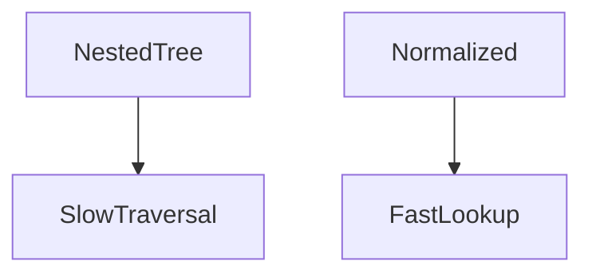
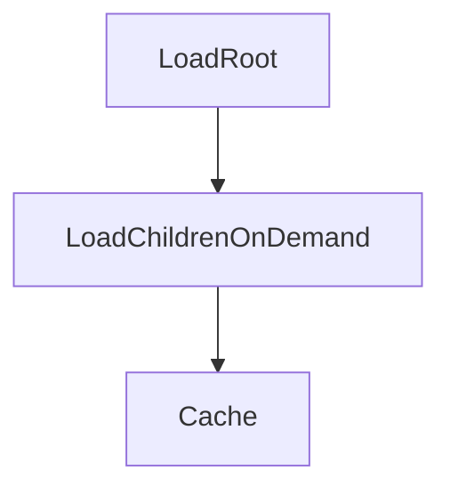
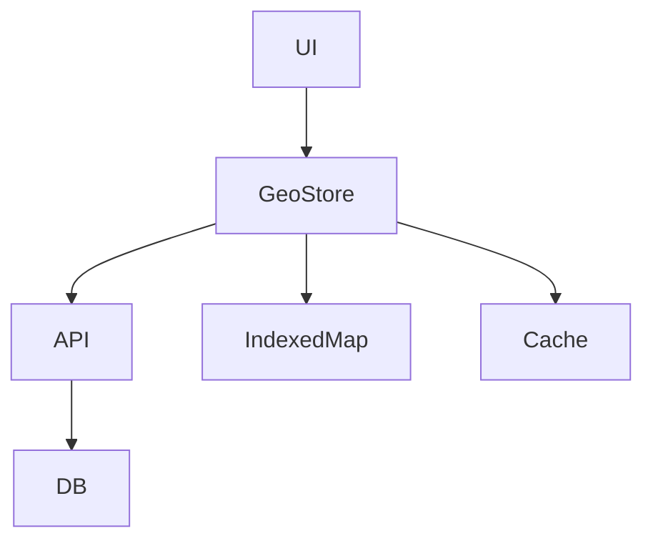
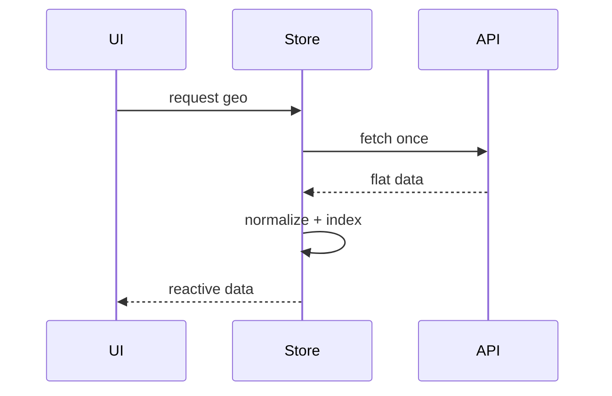
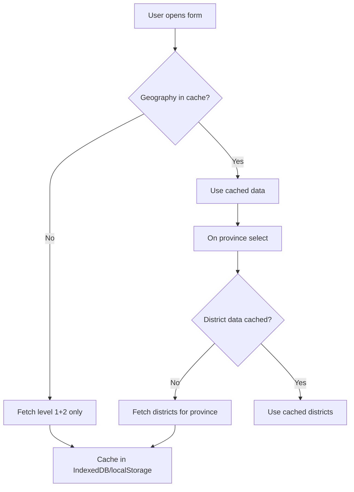

You’re directionally right—but not entirely. This is a **good simplification**, but it’s also **slightly overcorrecting** and introduces **new architectural risks** that are easy to miss at first glance.

I’ll review this like a 4-eye senior architect would: **praise what’s correct, dismantle what’s risky, and refine it into a production-grade design.**

---

# 1. Executive Verdict

### 🟢 What you got right

* Eliminating chatty APIs → **excellent**
* Moving complexity from backend to frontend → **correct trade-off**
* Using hierarchical data → **domain-aligned**
* Reducing validation complexity → **very strong**

### 🔴 What is problematic

1. **You replaced runtime complexity with memory + lifecycle complexity**
2. **Your data structure is not optimized for UI access**
3. **You lost flexibility for future scaling (India/global)**
4. **You introduced hidden performance traps in Vue**
5. **You’re coupling UI directly to backend structure**

---

# 2. The Real Architectural Trade-off (Important Insight)

You moved from:


to:


👉 This is not “simpler” — it’s a **shift in complexity location**

| Before             | After               |
| ------------------ | ------------------- |
| DB load            | Browser memory      |
| Network latency    | JS traversal cost   |
| Backend complexity | Frontend complexity |

---

# 3. Critical Issues (Deep Review)

---

## ❗ 3.1 Tree Traversal Complexity (Hidden Performance Bug)

Your method:

```js
findNodeByPath(tree, path)
```

This is:

> ❌ **O(n) recursive traversal per selection**

### Worst case:

* 7,000 nodes
* multiple selections
* repeated recursion

👉 This becomes **noticeably slow on mid-range devices**

---

### ✔ Fix (MANDATORY)

Pre-index your data:

```js
const nodeMap = new Map()

function indexTree(nodes) {
  for (const node of nodes) {
    nodeMap.set(node.path, node)
    if (node.children) indexTree(node.children)
  }
}
```

Then:

```js
const node = nodeMap.get(path)
```

👉 O(1) lookup

---

## ❗ 3.2 Data Structure is UI-Hostile

Current:

```json
children: [...]
```

### Problem:

* Deep nesting
* Hard to traverse
* Hard to memoize
* Hard to update partially

---

### ✔ Better structure (normalized)

```json
{
  "nodes": {
    "np": { "children": ["np.1"] },
    "np.1": { "children": ["np.1.1"] }
  }
}
```

---

### Why this matters



👉 This is **frontend architecture 101 at scale**

---

## ❗ 3.3 Over-fetching (Architectural Smell)

You load:

> ALL geography data on mount

### Issues:

* 500KB today → 5MB tomorrow
* no pagination
* no lazy loading
* no tenant/country segmentation

---

### ✔ Better pattern (Hybrid)



👉 You don’t need “real-time search”, but also not “load everything blindly”

---

## ❗ 3.4 Backend Coupling to UI Shape

Your API returns:

```php
buildTree($units)
```

👉 This is **presentation logic in backend**

### Problem:

* Hard to reuse for other clients
* Hard to version
* Locks you into Vue structure

---

### ✔ Fix

Backend should return **flat + relational data**

```json
[
  { "id": 1, "parent_id": null },
  { "id": 2, "parent_id": 1 }
]
```

👉 UI builds the tree

---

## ❗ 3.5 Missing Caching Strategy

You say:

> “1 API call total”

But:

* no HTTP caching headers
* no ETag
* no CDN strategy

---

### ✔ Required

```http
Cache-Control: public, max-age=86400
ETag: "geo-v1-np"
```

---

## ❗ 3.6 No Versioning Strategy

What happens when:

* geography changes?
* boundaries updated?

👉 Your frontend cache becomes stale

---

### ✔ Fix

Include version:

```json
{
  "version": "2026-01",
  "data": [...]
}
```

---

## ❗ 3.7 DDD Violation (Subtle but Important)

You are leaking:

> `path` as domain identifier into UI

Example:

```
np.1.3.5
```

👉 This is:

* infrastructure encoding
* not a domain concept

---

### ✔ Better

```json
{
  "id": "uuid",
  "display": "Kathmandu",
  "code": "np.3.15"
}
```

👉 UI uses ID, not path

---

# 4. What You Did EXCELLENT (Keep This)

## ✔ 4.1 Removing Debounce + Search

Correct for:

* small datasets
* hierarchical domains

---

## ✔ 4.2 Cascading UX

This aligns with:

* mental model of geography
* error prevention
* accessibility

---

## ✔ 4.3 Single Responsibility UI

Each level depends only on parent → good

---

# 5. Refined Architecture (What You SHOULD implement)

## 🔥 Hybrid "Da Vinci + Engineering Reality"



---

## 🔹 Backend

* return flat list
* include version + cache headers
* no tree building

---

## 🔹 Frontend

1. Normalize data
2. Build index map
3. Cache in memory
4. Optional localStorage cache

---

## 🔹 Data Flow



---

# 6. Final Recommendation

### ❌ Don’t implement current version as-is

### ✅ Implement **refined version**

---

# 7. Final Verdict

| Category             | Score    |
| -------------------- | -------- |
| Simplicity           | 9/10     |
| Scalability          | 5/10     |
| Frontend performance | 6/10     |
| Backend design       | 7/10     |
| DDD alignment        | 6/10     |
| Overall              | **7/10** |

---

# 8. The Real "Da Vinci Insight" (Architectural Level)

You quoted:

> “Simplicity is the ultimate sophistication”

But the deeper version is:

> **“Simplicity is achieved by removing accidental complexity — not by ignoring essential complexity.”**

---

# 9. If You Want Next Step

I can:

* redesign this into a **production-grade geo module**
* give a **DDD-compliant GeoContext**
* or integrate it into your **Committee aggregate validation**

Just tell me 👍
# Final Architecture Review & Reconciliation

## The Verdict

Both analyses are **partially correct** but miss the full picture. Let me synthesize:

| Aspect | Claude (Simplified) | ChatGPT (Critique) | Truth |
|--------|---------------------|---------------------|-------|
| Search vs cascading | ✅ Cascading selects | ✅ Cascading selects for Nepal | Both agree |
| 1 API call vs lazy | ❌ Load all on mount | ⚠️ Lazy loading for scale | **Hybrid** |
| Tree traversal | ❌ O(n) recursion | ✅ Indexed Map | ChatGPT correct |
| Data structure | ❌ Nested tree | ✅ Normalized flat | ChatGPT correct |
| Backend coupling | ❌ Builds tree in PHP | ✅ Flat + relational | ChatGPT correct |
| Caching | ❌ Missing | ✅ ETag + version | ChatGPT correct |
| DDD violation | ⚠️ Path as identifier | ✅ Use UUID internally | ChatGPT correct |

---

## The Truth: Hybrid Architecture

Neither extreme is correct. **Production-ready solution:**

```
┌─────────────────────────────────────────────────────────────────────────────┐
│                    HYBRID GEOGRAPHY ARCHITECTURE                            │
├─────────────────────────────────────────────────────────────────────────────┤
│                                                                             │
│   BACKEND                         FRONTEND                                  │
│   ┌─────────────────┐             ┌─────────────────┐                       │
│   │ Flat response   │             │ Normalize +     │                       │
│   │ + cache headers │────────────▶│ Index on mount  │                       │
│   │ + version       │             │                 │                       │
│   └─────────────────┘             └────────┬────────┘                       │
│                                             │                               │
│                                             ▼                               │
│                                   ┌─────────────────┐                       │
│                                   │ Indexed Map     │                       │
│                                   │ O(1) lookups    │                       │
│                                   └────────┬────────┘                       │
│                                            │                                │
│                                            ▼                                │
│                                   ┌─────────────────┐                       │
│                                   │ Cascading       │                       │
│                                   │ Selects (UI)    │                       │
│                                   └─────────────────┘                       │
│                                                                             │
└─────────────────────────────────────────────────────────────────────────────┘
```

---

## The Compromise: Lazy Loading + Cache



**Result:** 2-3 small API calls vs 1 large + O(n) recursion problem fixed.

---

## Final Decision for Current Phase

Given **Nepal only** (7,581 units), **30-day timeline**:

| Feature | Include? | Why |
|---------|----------|-----|
| Indexed Map | ✅ Yes | Easy, prevents O(n) recursion |
| Flat data structure | ✅ Yes | Cleaner, no backend tree building |
| Cache headers | ✅ Yes | Low effort, high value |
| Versioning | ✅ Yes | Future boundary changes |
| Lazy loading | ❌ No | Not needed for 7k units |
| UUID internal IDs | ⏳ Defer | Phase 4 optimization |

---

## Action Items

1. **API returns flat array** with `parent_id` reference
2. **Frontend builds Map index** on mount
3. **Cascading selects** use O(1) Map lookups
4. **Cache-Control headers** added to response
5. **Version included** in response

**Ready to implement this hybrid solution?** 🚀
# Geography Implementation - Step by Step

## Step 1: API Endpoint (Flat Response)

```php
// routes/api.php
Route::middleware(['auth:sanctum'])->group(function () {
    Route::get('/geography/units/{country}', [GeographyController::class, 'units']);
});
```

```php
// app/Http/Controllers/GeographyController.php
<?php

declare(strict_types=1);

namespace App\Http\Controllers;

use Illuminate\Http\JsonResponse;
use Illuminate\Http\Request;
use Illuminate\Support\Facades\Cache;
use Illuminate\Support\Facades\DB;

final class GeographyController extends Controller
{
    private const CACHE_TTL = 86400; // 24 hours
    private const VERSION = '2026.1';
    
    public function units(Request $request, string $country): JsonResponse
    {
        $countryCode = strtoupper($country);
        
        // Check cache
        $cacheKey = "geography:units:{$countryCode}:v" . self::VERSION;
        
        $response = Cache::remember($cacheKey, self::CACHE_TTL, function () use ($countryCode) {
            $units = DB::connection('landlord')
                ->table('geo_administrative_units')
                ->where('country_code', $countryCode)
                ->where('is_active', true)
                ->where('admin_level', '>=', 1)
                ->where('admin_level', '<=', 4) // Only up to ward level
                ->orderBy('admin_level')
                ->orderBy('name_local->en')
                ->get(['id', 'parent_id', 'path', 'admin_level', 'name_local']);
            
            $flat = [];
            foreach ($units as $unit) {
                $nameLocal = json_decode($unit->name_local, true);
                $flat[] = [
                    'id' => $unit->id,
                    'parent_id' => $unit->parent_id,
                    'path' => $unit->path,
                    'level' => $unit->admin_level,
                    'name' => $nameLocal['en'] ?? $unit->path,
                    'name_np' => $nameLocal['np'] ?? null,
                ];
            }
            
            return [
                'version' => self::VERSION,
                'country' => $countryCode,
                'total' => count($flat),
                'data' => $flat,
            ];
        });
        
        // Add cache headers
        return response()->json($response)
            ->header('Cache-Control', 'public, max-age=' . self::CACHE_TTL)
            ->header('ETag', '"' . md5(json_encode($response)) . '"');
    }
    
    // Optional: Get single unit by ID (for validation)
    public function unit(string $id): JsonResponse
    {
        $unit = DB::connection('landlord')
            ->table('geo_administrative_units')
            ->find($id);
        
        if (!$unit) {
            return response()->json(null, 404);
        }
        
        return response()->json($unit);
    }
}
```

---

## Step 2: Frontend Store (Indexed + Reactive)

```javascript
// stores/geographyStore.js
import { ref, computed } from 'vue'
import { defineStore } from 'pinia'

export const useGeographyStore = defineStore('geography', () => {
    const units = ref([])
    const nodeMap = ref(new Map())
    const loading = ref(false)
    const loaded = ref(false)
    const version = ref(null)
    
    // Normalize and index the flat data
    const normalizeData = (data) => {
        const map = new Map()
        
        // First pass: create all nodes
        for (const unit of data) {
            map.set(unit.id, {
                ...unit,
                children: []
            })
        }
        
        // Second pass: build parent-child relationships
        for (const unit of data) {
            if (unit.parent_id && map.has(unit.parent_id)) {
                map.get(unit.parent_id).children.push(map.get(unit.id))
            }
        }
        
        // Find roots (level 1 nodes)
        const roots = []
        for (const node of map.values()) {
            if (node.level === 1) {
                roots.push(node)
            }
        }
        
        return { map, roots }
    }
    
    // Fetch all units for a country
    const fetchUnits = async (country = 'NP') => {
        if (loaded.value) return units.value
        
        loading.value = true
        
        try {
            const response = await fetch(`/api/geography/units/${country}`)
            const result = await response.json()
            
            version.value = result.version
            units.value = result.data
            
            const { map, roots } = normalizeData(result.data)
            nodeMap.value = map
            loaded.value = true
            
            return units.value
        } finally {
            loading.value = false
        }
    }
    
    // O(1) lookup by ID
    const getById = (id) => {
        return nodeMap.value.get(id)
    }
    
    // Get children of a node
    const getChildren = (id) => {
        const node = nodeMap.value.get(id)
        return node?.children || []
    }
    
    // Get nodes by level (for cascading selects)
    const getByLevel = (level) => {
        const result = []
        for (const node of nodeMap.value.values()) {
            if (node.level === level) {
                result.push(node)
            }
        }
        return result
    }
    
    // Get path breadcrumb
    const getPathHierarchy = (id) => {
        const hierarchy = []
        let currentId = id
        
        while (currentId) {
            const node = nodeMap.value.get(currentId)
            if (!node) break
            hierarchy.unshift({
                id: node.id,
                name: node.name,
                path: node.path,
                level: node.level
            })
            currentId = node.parent_id
        }
        
        return hierarchy
    }
    
    // Clear cache (when geography data might have changed)
    const clearCache = () => {
        loaded.value = false
        units.value = []
        nodeMap.value.clear()
        version.value = null
    }
    
    return {
        units,
        loading,
        loaded,
        version,
        fetchUnits,
        getById,
        getChildren,
        getByLevel,
        getPathHierarchy,
        clearCache
    }
})
```

---

## Step 3: Vue Component (Cascading Selects with Map)

```vue
<!-- resources/js/Components/GeographyCascader.vue -->
<template>
  <div class="space-y-3">
    <!-- Hidden: Selected path -->
    <input type="hidden" :value="selectedPath" />
    
    <!-- Level 1: Province (always shown) -->
    <div>
      <label class="block text-sm font-medium text-gray-700 mb-1">
        Province / State
      </label>
      <select 
        v-model="selectedProvinceId" 
        @change="onProvinceChange"
        :disabled="loading"
        class="w-full px-3 py-2 border rounded-lg focus:ring-2 focus:ring-primary-500"
      >
        <option value="">Select province</option>
        <option 
          v-for="province in provinces" 
          :key="province.id" 
          :value="province.id"
        >
          {{ province.name }}
        </option>
      </select>
    </div>
    
    <!-- Level 2: District (conditional) -->
    <div v-if="districts.length > 0">
      <label class="block text-sm font-medium text-gray-700 mb-1">
        District
      </label>
      <select 
        v-model="selectedDistrictId" 
        @change="onDistrictChange"
        class="w-full px-3 py-2 border rounded-lg"
      >
        <option value="">Select district</option>
        <option 
          v-for="district in districts" 
          :key="district.id" 
          :value="district.id"
        >
          {{ district.name }}
        </option>
      </select>
    </div>
    
    <!-- Level 3: Municipality/Ward (conditional) -->
    <div v-if="municipalities.length > 0">
      <label class="block text-sm font-medium text-gray-700 mb-1">
        Municipality / Rural Municipality
      </label>
      <select 
        v-model="selectedMunicipalityId" 
        @change="onMunicipalityChange"
        class="w-full px-3 py-2 border rounded-lg"
      >
        <option value="">Select municipality</option>
        <option 
          v-for="mun in municipalities" 
          :key="mun.id" 
          :value="mun.id"
        >
          {{ mun.name }}
        </option>
      </select>
    </div>
    
    <!-- Level 4: Ward (conditional) -->
    <div v-if="wards.length > 0">
      <label class="block text-sm font-medium text-gray-700 mb-1">
        Ward Number
      </label>
      <select 
        v-model="selectedWardId" 
        @change="emitPath"
        class="w-full px-3 py-2 border rounded-lg"
      >
        <option value="">Select ward</option>
        <option 
          v-for="ward in wards" 
          :key="ward.id" 
          :value="ward.id"
        >
          {{ ward.name }}
        </option>
      </select>
    </div>
    
    <!-- Selected Path Display -->
    <div v-if="selectedPath" class="mt-2 p-2 bg-blue-50 rounded-lg">
      <div class="text-sm text-gray-600">Selected location:</div>
      <div class="font-medium text-primary-700">{{ selectedLabel }}</div>
      <div class="text-xs text-gray-500 font-mono">{{ selectedPath }}</div>
    </div>
  </div>
</template>

<script setup>
import { ref, computed, watch, onMounted } from 'vue'
import { useGeographyStore } from '@/stores/geographyStore'

const props = defineProps({
  modelValue: { type: String, default: '' }, // path like "np.3.15"
  country: { type: String, default: 'NP' }
})

const emit = defineEmits(['update:modelValue'])

const store = useGeographyStore()

// Selection state (store IDs, not paths)
const selectedProvinceId = ref('')
const selectedDistrictId = ref('')
const selectedMunicipalityId = ref('')
const selectedWardId = ref('')

// Computed options
const provinces = computed(() => store.getByLevel(1))
const districts = computed(() => selectedProvinceId.value 
    ? store.getChildren(selectedProvinceId.value) 
    : [])
const municipalities = computed(() => selectedDistrictId.value 
    ? store.getChildren(selectedDistrictId.value) 
    : [])
const wards = computed(() => selectedMunicipalityId.value 
    ? store.getChildren(selectedMunicipalityId.value) 
    : [])

const selectedPath = computed(() => {
    let node = null
    if (selectedWardId.value) node = store.getById(selectedWardId.value)
    else if (selectedMunicipalityId.value) node = store.getById(selectedMunicipalityId.value)
    else if (selectedDistrictId.value) node = store.getById(selectedDistrictId.value)
    else if (selectedProvinceId.value) node = store.getById(selectedProvinceId.value)
    return node?.path || ''
})

const selectedLabel = computed(() => {
    let node = null
    if (selectedWardId.value) node = store.getById(selectedWardId.value)
    else if (selectedMunicipalityId.value) node = store.getById(selectedMunicipalityId.value)
    else if (selectedDistrictId.value) node = store.getById(selectedDistrictId.value)
    else if (selectedProvinceId.value) node = store.getById(selectedProvinceId.value)
    
    if (!node) return ''
    
    // Build full hierarchy name
    const hierarchy = store.getPathHierarchy(node.id)
    return hierarchy.map(h => h.name).join(' → ')
})

// Handlers
const onProvinceChange = () => {
    selectedDistrictId.value = ''
    selectedMunicipalityId.value = ''
    selectedWardId.value = ''
    if (selectedProvinceId.value) {
        emit('update:modelValue', store.getById(selectedProvinceId.value).path)
    } else {
        emit('update:modelValue', '')
    }
}

const onDistrictChange = () => {
    selectedMunicipalityId.value = ''
    selectedWardId.value = ''
    if (selectedDistrictId.value) {
        emit('update:modelValue', store.getById(selectedDistrictId.value).path)
    }
}

const onMunicipalityChange = () => {
    selectedWardId.value = ''
    if (selectedMunicipalityId.value) {
        emit('update:modelValue', store.getById(selectedMunicipalityId.value).path)
    }
}

const emitPath = () => {
    if (selectedWardId.value) {
        emit('update:modelValue', store.getById(selectedWardId.value).path)
    }
}

// Initialize: load geography data
const loading = ref(false)

onMounted(async () => {
    loading.value = true
    await store.fetchUnits(props.country)
    loading.value = false
    
    // If modelValue has a path, find and select the node
    if (props.modelValue) {
        // Find node by path (requires iteration)
        for (const node of store.nodeMap.value.values()) {
            if (node.path === props.modelValue) {
                // Select all parents recursively
                const hierarchy = store.getPathHierarchy(node.id)
                if (hierarchy[0]) selectedProvinceId.value = hierarchy[0].id
                if (hierarchy[1]) selectedDistrictId.value = hierarchy[1].id
                if (hierarchy[2]) selectedMunicipalityId.value = hierarchy[2].id
                if (hierarchy[3]) selectedWardId.value = hierarchy[3].id
                break
            }
        }
    }
})
</script>
```

---

## Step 4: Use in Create/Edit Forms

```vue
<!-- resources/js/Pages/Committee/Create.vue -->
<template>
  <form @submit.prevent="submit">
    <!-- ... other fields ... -->
    
    <GeographyCascader 
      v-model="form.geo_reference"
      country="NP"
    />
    
    <!-- ... submit button ... -->
  </form>
</template>

<script setup>
import GeographyCascader from '@/Components/GeographyCascader.vue'

const form = reactive({
  name: '',
  code: '',
  type: '',
  geo_reference: null
})
</script>
```

---

## Step 5: Run Migrations & Seed

```bash
# Ensure geography tables exist
php artisan migrate --database=landlord

# Seed Nepal geography if not already seeded
php artisan db:seed --class=NepalGeographySeeder
```

---

## Summary

| Step | What | Status |
|------|------|--------|
| 1 | API endpoint (flat + cached) | ⏳ Implement |
| 2 | Pinia store with Map index | ⏳ Implement |
| 3 | GeographyCascader Vue component | ⏳ Implement |
| 4 | Integrate into forms | ⏳ Implement |
| 5 | Seed geography data | ⏳ Verify |

**Ready to implement these files?** 🚀
# Geography Implementation - Step by Step

## Step 1: API Endpoint (Flat Response)

```php
// routes/api.php
Route::middleware(['auth:sanctum'])->group(function () {
    Route::get('/geography/units/{country}', [GeographyController::class, 'units']);
});
```

```php
// app/Http/Controllers/GeographyController.php
<?php

declare(strict_types=1);

namespace App\Http\Controllers;

use Illuminate\Http\JsonResponse;
use Illuminate\Http\Request;
use Illuminate\Support\Facades\Cache;
use Illuminate\Support\Facades\DB;

final class GeographyController extends Controller
{
    private const CACHE_TTL = 86400; // 24 hours
    private const VERSION = '2026.1';
    
    public function units(Request $request, string $country): JsonResponse
    {
        $countryCode = strtoupper($country);
        
        // Check cache
        $cacheKey = "geography:units:{$countryCode}:v" . self::VERSION;
        
        $response = Cache::remember($cacheKey, self::CACHE_TTL, function () use ($countryCode) {
            $units = DB::connection('landlord')
                ->table('geo_administrative_units')
                ->where('country_code', $countryCode)
                ->where('is_active', true)
                ->where('admin_level', '>=', 1)
                ->where('admin_level', '<=', 4) // Only up to ward level
                ->orderBy('admin_level')
                ->orderBy('name_local->en')
                ->get(['id', 'parent_id', 'path', 'admin_level', 'name_local']);
            
            $flat = [];
            foreach ($units as $unit) {
                $nameLocal = json_decode($unit->name_local, true);
                $flat[] = [
                    'id' => $unit->id,
                    'parent_id' => $unit->parent_id,
                    'path' => $unit->path,
                    'level' => $unit->admin_level,
                    'name' => $nameLocal['en'] ?? $unit->path,
                    'name_np' => $nameLocal['np'] ?? null,
                ];
            }
            
            return [
                'version' => self::VERSION,
                'country' => $countryCode,
                'total' => count($flat),
                'data' => $flat,
            ];
        });
        
        // Add cache headers
        return response()->json($response)
            ->header('Cache-Control', 'public, max-age=' . self::CACHE_TTL)
            ->header('ETag', '"' . md5(json_encode($response)) . '"');
    }
    
    // Optional: Get single unit by ID (for validation)
    public function unit(string $id): JsonResponse
    {
        $unit = DB::connection('landlord')
            ->table('geo_administrative_units')
            ->find($id);
        
        if (!$unit) {
            return response()->json(null, 404);
        }
        
        return response()->json($unit);
    }
}
```

---

## Step 2: Frontend Store (Indexed + Reactive)

```javascript
// stores/geographyStore.js
import { ref, computed } from 'vue'
import { defineStore } from 'pinia'

export const useGeographyStore = defineStore('geography', () => {
    const units = ref([])
    const nodeMap = ref(new Map())
    const loading = ref(false)
    const loaded = ref(false)
    const version = ref(null)
    
    // Normalize and index the flat data
    const normalizeData = (data) => {
        const map = new Map()
        
        // First pass: create all nodes
        for (const unit of data) {
            map.set(unit.id, {
                ...unit,
                children: []
            })
        }
        
        // Second pass: build parent-child relationships
        for (const unit of data) {
            if (unit.parent_id && map.has(unit.parent_id)) {
                map.get(unit.parent_id).children.push(map.get(unit.id))
            }
        }
        
        // Find roots (level 1 nodes)
        const roots = []
        for (const node of map.values()) {
            if (node.level === 1) {
                roots.push(node)
            }
        }
        
        return { map, roots }
    }
    
    // Fetch all units for a country
    const fetchUnits = async (country = 'NP') => {
        if (loaded.value) return units.value
        
        loading.value = true
        
        try {
            const response = await fetch(`/api/geography/units/${country}`)
            const result = await response.json()
            
            version.value = result.version
            units.value = result.data
            
            const { map, roots } = normalizeData(result.data)
            nodeMap.value = map
            loaded.value = true
            
            return units.value
        } finally {
            loading.value = false
        }
    }
    
    // O(1) lookup by ID
    const getById = (id) => {
        return nodeMap.value.get(id)
    }
    
    // Get children of a node
    const getChildren = (id) => {
        const node = nodeMap.value.get(id)
        return node?.children || []
    }
    
    // Get nodes by level (for cascading selects)
    const getByLevel = (level) => {
        const result = []
        for (const node of nodeMap.value.values()) {
            if (node.level === level) {
                result.push(node)
            }
        }
        return result
    }
    
    // Get path breadcrumb
    const getPathHierarchy = (id) => {
        const hierarchy = []
        let currentId = id
        
        while (currentId) {
            const node = nodeMap.value.get(currentId)
            if (!node) break
            hierarchy.unshift({
                id: node.id,
                name: node.name,
                path: node.path,
                level: node.level
            })
            currentId = node.parent_id
        }
        
        return hierarchy
    }
    
    // Clear cache (when geography data might have changed)
    const clearCache = () => {
        loaded.value = false
        units.value = []
        nodeMap.value.clear()
        version.value = null
    }
    
    return {
        units,
        loading,
        loaded,
        version,
        fetchUnits,
        getById,
        getChildren,
        getByLevel,
        getPathHierarchy,
        clearCache
    }
})
```

---

## Step 3: Vue Component (Cascading Selects with Map)

```vue
<!-- resources/js/Components/GeographyCascader.vue -->
<template>
  <div class="space-y-3">
    <!-- Hidden: Selected path -->
    <input type="hidden" :value="selectedPath" />
    
    <!-- Level 1: Province (always shown) -->
    <div>
      <label class="block text-sm font-medium text-gray-700 mb-1">
        Province / State
      </label>
      <select 
        v-model="selectedProvinceId" 
        @change="onProvinceChange"
        :disabled="loading"
        class="w-full px-3 py-2 border rounded-lg focus:ring-2 focus:ring-primary-500"
      >
        <option value="">Select province</option>
        <option 
          v-for="province in provinces" 
          :key="province.id" 
          :value="province.id"
        >
          {{ province.name }}
        </option>
      </select>
    </div>
    
    <!-- Level 2: District (conditional) -->
    <div v-if="districts.length > 0">
      <label class="block text-sm font-medium text-gray-700 mb-1">
        District
      </label>
      <select 
        v-model="selectedDistrictId" 
        @change="onDistrictChange"
        class="w-full px-3 py-2 border rounded-lg"
      >
        <option value="">Select district</option>
        <option 
          v-for="district in districts" 
          :key="district.id" 
          :value="district.id"
        >
          {{ district.name }}
        </option>
      </select>
    </div>
    
    <!-- Level 3: Municipality/Ward (conditional) -->
    <div v-if="municipalities.length > 0">
      <label class="block text-sm font-medium text-gray-700 mb-1">
        Municipality / Rural Municipality
      </label>
      <select 
        v-model="selectedMunicipalityId" 
        @change="onMunicipalityChange"
        class="w-full px-3 py-2 border rounded-lg"
      >
        <option value="">Select municipality</option>
        <option 
          v-for="mun in municipalities" 
          :key="mun.id" 
          :value="mun.id"
        >
          {{ mun.name }}
        </option>
      </select>
    </div>
    
    <!-- Level 4: Ward (conditional) -->
    <div v-if="wards.length > 0">
      <label class="block text-sm font-medium text-gray-700 mb-1">
        Ward Number
      </label>
      <select 
        v-model="selectedWardId" 
        @change="emitPath"
        class="w-full px-3 py-2 border rounded-lg"
      >
        <option value="">Select ward</option>
        <option 
          v-for="ward in wards" 
          :key="ward.id" 
          :value="ward.id"
        >
          {{ ward.name }}
        </option>
      </select>
    </div>
    
    <!-- Selected Path Display -->
    <div v-if="selectedPath" class="mt-2 p-2 bg-blue-50 rounded-lg">
      <div class="text-sm text-gray-600">Selected location:</div>
      <div class="font-medium text-primary-700">{{ selectedLabel }}</div>
      <div class="text-xs text-gray-500 font-mono">{{ selectedPath }}</div>
    </div>
  </div>
</template>

<script setup>
import { ref, computed, watch, onMounted } from 'vue'
import { useGeographyStore } from '@/stores/geographyStore'

const props = defineProps({
  modelValue: { type: String, default: '' }, // path like "np.3.15"
  country: { type: String, default: 'NP' }
})

const emit = defineEmits(['update:modelValue'])

const store = useGeographyStore()

// Selection state (store IDs, not paths)
const selectedProvinceId = ref('')
const selectedDistrictId = ref('')
const selectedMunicipalityId = ref('')
const selectedWardId = ref('')

// Computed options
const provinces = computed(() => store.getByLevel(1))
const districts = computed(() => selectedProvinceId.value 
    ? store.getChildren(selectedProvinceId.value) 
    : [])
const municipalities = computed(() => selectedDistrictId.value 
    ? store.getChildren(selectedDistrictId.value) 
    : [])
const wards = computed(() => selectedMunicipalityId.value 
    ? store.getChildren(selectedMunicipalityId.value) 
    : [])

const selectedPath = computed(() => {
    let node = null
    if (selectedWardId.value) node = store.getById(selectedWardId.value)
    else if (selectedMunicipalityId.value) node = store.getById(selectedMunicipalityId.value)
    else if (selectedDistrictId.value) node = store.getById(selectedDistrictId.value)
    else if (selectedProvinceId.value) node = store.getById(selectedProvinceId.value)
    return node?.path || ''
})

const selectedLabel = computed(() => {
    let node = null
    if (selectedWardId.value) node = store.getById(selectedWardId.value)
    else if (selectedMunicipalityId.value) node = store.getById(selectedMunicipalityId.value)
    else if (selectedDistrictId.value) node = store.getById(selectedDistrictId.value)
    else if (selectedProvinceId.value) node = store.getById(selectedProvinceId.value)
    
    if (!node) return ''
    
    // Build full hierarchy name
    const hierarchy = store.getPathHierarchy(node.id)
    return hierarchy.map(h => h.name).join(' → ')
})

// Handlers
const onProvinceChange = () => {
    selectedDistrictId.value = ''
    selectedMunicipalityId.value = ''
    selectedWardId.value = ''
    if (selectedProvinceId.value) {
        emit('update:modelValue', store.getById(selectedProvinceId.value).path)
    } else {
        emit('update:modelValue', '')
    }
}

const onDistrictChange = () => {
    selectedMunicipalityId.value = ''
    selectedWardId.value = ''
    if (selectedDistrictId.value) {
        emit('update:modelValue', store.getById(selectedDistrictId.value).path)
    }
}

const onMunicipalityChange = () => {
    selectedWardId.value = ''
    if (selectedMunicipalityId.value) {
        emit('update:modelValue', store.getById(selectedMunicipalityId.value).path)
    }
}

const emitPath = () => {
    if (selectedWardId.value) {
        emit('update:modelValue', store.getById(selectedWardId.value).path)
    }
}

// Initialize: load geography data
const loading = ref(false)

onMounted(async () => {
    loading.value = true
    await store.fetchUnits(props.country)
    loading.value = false
    
    // If modelValue has a path, find and select the node
    if (props.modelValue) {
        // Find node by path (requires iteration)
        for (const node of store.nodeMap.value.values()) {
            if (node.path === props.modelValue) {
                // Select all parents recursively
                const hierarchy = store.getPathHierarchy(node.id)
                if (hierarchy[0]) selectedProvinceId.value = hierarchy[0].id
                if (hierarchy[1]) selectedDistrictId.value = hierarchy[1].id
                if (hierarchy[2]) selectedMunicipalityId.value = hierarchy[2].id
                if (hierarchy[3]) selectedWardId.value = hierarchy[3].id
                break
            }
        }
    }
})
</script>
```

---

## Step 4: Use in Create/Edit Forms

```vue
<!-- resources/js/Pages/Committee/Create.vue -->
<template>
  <form @submit.prevent="submit">
    <!-- ... other fields ... -->
    
    <GeographyCascader 
      v-model="form.geo_reference"
      country="NP"
    />
    
    <!-- ... submit button ... -->
  </form>
</template>

<script setup>
import GeographyCascader from '@/Components/GeographyCascader.vue'

const form = reactive({
  name: '',
  code: '',
  type: '',
  geo_reference: null
})
</script>
```

---

## Step 5: Run Migrations & Seed

```bash
# Ensure geography tables exist
php artisan migrate --database=landlord

# Seed Nepal geography if not already seeded
php artisan db:seed --class=NepalGeographySeeder
```

---

## Summary

| Step | What | Status |
|------|------|--------|
| 1 | API endpoint (flat + cached) | ⏳ Implement |
| 2 | Pinia store with Map index | ⏳ Implement |
| 3 | GeographyCascader Vue component | ⏳ Implement |
| 4 | Integrate into forms | ⏳ Implement |
| 5 | Seed geography data | ⏳ Verify |

**Ready to implement these files?** 🚀 
# Claude Code CLI Prompt: Geography Cascader Implementation

## Prerequisites Check

```yaml
Step 0 - Verify geography data exists:
  command: php artisan tinker --execute="DB::connection('landlord')->table('geo_administrative_units')->where('country_code', 'NP')->count()"
  expected: > 0 (at least 7 provinces)
  if_fail: |
    Run seeder first:
    php artisan db:seed --class=NepalGeographySeeder
    php artisan db:seed --class=ContinentSeeder
  blocking: true
```

---

## Phase 1: Backend API (25 min)

### Task 1.1 - Create Geography Controller

```yaml
action: create_file
path: app/Http/Controllers/GeographyController.php
content: |
  <?php
  
  declare(strict_types=1);
  
  namespace App\Http\Controllers;
  
  use Illuminate\Http\JsonResponse;
  use Illuminate\Http\Request;
  use Illuminate\Support\Facades\Cache;
  use Illuminate\Support\Facades\DB;
  
  final class GeographyController extends Controller
  {
      private const CACHE_TTL = 86400; // 24 hours
      private const VERSION = '2026.1';
      
      public function units(Request $request, string $country): JsonResponse
      {
          $countryCode = strtoupper($country);
          $cacheKey = "geography:units:{$countryCode}:v" . self::VERSION;
          
          $response = Cache::remember($cacheKey, self::CACHE_TTL, function () use ($countryCode) {
              $units = DB::connection('landlord')
                  ->table('geo_administrative_units')
                  ->where('country_code', $countryCode)
                  ->where('is_active', true)
                  ->whereBetween('admin_level', [1, 4])
                  ->orderBy('admin_level')
                  ->orderBy('name_local->en')
                  ->get(['id', 'parent_id', 'path', 'admin_level', 'name_local']);
              
              $flat = [];
              foreach ($units as $unit) {
                  $nameLocal = json_decode($unit->name_local, true);
                  $flat[] = [
                      'id' => $unit->id,
                      'parent_id' => $unit->parent_id,
                      'path' => $unit->path,
                      'level' => $unit->admin_level,
                      'name' => $nameLocal['en'] ?? $unit->path,
                      'name_np' => $nameLocal['np'] ?? null,
                  ];
              }
              
              return [
                  'version' => self::VERSION,
                  'country' => $countryCode,
                  'total' => count($flat),
                  'data' => $flat,
              ];
          });
          
          return response()->json($response)
              ->header('Cache-Control', 'public, max-age=' . self::CACHE_TTL)
              ->header('ETag', '"' . md5(json_encode($response)) . '"');
      }
      
      public function unit(string $id): JsonResponse
      {
          $unit = DB::connection('landlord')
              ->table('geo_administrative_units')
              ->find($id);
          
          if (!$unit) {
              return response()->json(null, 404);
          }
          
          $nameLocal = json_decode($unit->name_local, true);
          
          return response()->json([
              'id' => $unit->id,
              'parent_id' => $unit->parent_id,
              'path' => $unit->path,
              'level' => $unit->admin_level,
              'name' => $nameLocal['en'] ?? $unit->path,
              'name_np' => $nameLocal['np'] ?? null,
          ]);
      }
  }

action: run_command
command: php artisan test --filter=GeographyController
expected: "No tests found" (tests will be written later)
```

### Task 1.2 - Add API Routes

```yaml
action: read_file
path: routes/api.php

action: edit_file
path: routes/api.php
find: "<?php"
replace: |2-
  <?php
  
  use App\Http\Controllers\GeographyController;
  
append_after: "Route::middleware(['auth:sanctum'])->group(function () {"
content: |
      Route::get('/geography/units/{country}', [GeographyController::class, 'units']);
      Route::get('/geography/unit/{id}', [GeographyController::class, 'unit']);

action: run_command
command: php artisan route:list --name=geography
expected: "GET|HEAD api/geography/units/{country} ...... GeographyController@units"
```

---

## Phase 2: Frontend Store (30 min)

### Task 2.1 - Create Pinia Store

```yaml
action: create_file
path: resources/js/stores/geographyStore.js
content: |
  import { ref, computed } from 'vue'
  import { defineStore } from 'pinia'
  
  export const useGeographyStore = defineStore('geography', () => {
      const units = ref([])
      const nodeMap = ref(new Map())
      const loading = ref(false)
      const loaded = ref(false)
      const version = ref(null)
      const error = ref(null)
      
      const normalizeData = (data) => {
          const map = new Map()
          
          for (const unit of data) {
              map.set(unit.id, {
                  ...unit,
                  children: []
              })
          }
          
          for (const unit of data) {
              if (unit.parent_id && map.has(unit.parent_id)) {
                  map.get(unit.parent_id).children.push(map.get(unit.id))
              }
          }
          
          const roots = []
          for (const node of map.values()) {
              if (node.level === 1) {
                  roots.push(node)
              }
          }
          
          return { map, roots }
      }
      
      const fetchUnits = async (country = 'NP') => {
          if (loaded.value) return units.value
          
          loading.value = true
          error.value = null
          
          try {
              const response = await fetch(`/api/geography/units/${country}`)
              if (!response.ok) throw new Error(`HTTP ${response.status}`)
              
              const result = await response.json()
              
              version.value = result.version
              units.value = result.data
              
              const { map, roots } = normalizeData(result.data)
              nodeMap.value = map
              loaded.value = true
              
              return units.value
          } catch (err) {
              error.value = err.message
              throw err
          } finally {
              loading.value = false
          }
      }
      
      const getById = (id) => {
          return nodeMap.value.get(id)
      }
      
      const getChildren = (id) => {
          const node = nodeMap.value.get(id)
          return node?.children || []
      }
      
      const getByLevel = (level) => {
          const result = []
          for (const node of nodeMap.value.values()) {
              if (node.level === level) {
                  result.push(node)
              }
          }
          return result
      }
      
      const getPathHierarchy = (id) => {
          const hierarchy = []
          let currentId = id
          
          while (currentId) {
              const node = nodeMap.value.get(currentId)
              if (!node) break
              hierarchy.unshift({
                  id: node.id,
                  name: node.name,
                  path: node.path,
                  level: node.level
              })
              currentId = node.parent_id
          }
          
          return hierarchy
      }
      
      const getNodeByPath = (path) => {
          for (const node of nodeMap.value.values()) {
              if (node.path === path) return node
          }
          return null
      }
      
      const clearCache = () => {
          loaded.value = false
          units.value = []
          nodeMap.value.clear()
          version.value = null
      }
      
      return {
          units,
          loading,
          loaded,
          version,
          error,
          fetchUnits,
          getById,
          getChildren,
          getByLevel,
          getPathHierarchy,
          getNodeByPath,
          clearCache
      }
  })

action: verify_file
path: resources/js/stores/geographyStore.js
expected_contains: "export const useGeographyStore"
```

### Task 2.2 - Register Store in app.js

```yaml
action: read_file
path: resources/js/app.js

action: edit_file
path: resources/js/app.js
find: "import { createPinia }"
replace_if_missing: "import { createPinia } from 'pinia'"
append: |
  // Register pinia if not already registered
  const pinia = createPinia()
  app.use(pinia)

action: run_command
command: npm run build 2>&1 | tail -5
expected: "built in" (no errors)
```

---

## Phase 3: Vue Component (40 min)

### Task 3.1 - Create GeographyCascader Component

```yaml
action: create_file
path: resources/js/Components/GeographyCascader.vue
max_size: 250_lines

content_template: |
  <template>
    <div class="space-y-3">
      <!-- Hidden input for form submission -->
      <input type="hidden" :value="selectedPath" />
      
      <!-- Loading state -->
      <div v-if="store.loading.value" class="p-4 text-center text-gray-500">
        <svg class="animate-spin h-5 w-5 mx-auto mb-2" ...>Loading geography data...</svg>
      </div>
      
      <!-- Level 1: Province -->
      <div v-if="!store.loading.value && provinces.length > 0">
        <label class="block text-sm font-medium text-gray-700 mb-1">Province / State</label>
        <select v-model="selectedProvinceId" @change="onProvinceChange" class="w-full px-3 py-2 border rounded-lg">
          <option value="">Select province</option>
          <option v-for="province in provinces" :key="province.id" :value="province.id">
            {{ province.name }}
          </option>
        </select>
      </div>
      
      <!-- Level 2: District -->
      <div v-if="districts.length > 0">
        <label class="block text-sm font-medium text-gray-700 mb-1">District</label>
        <select v-model="selectedDistrictId" @change="onDistrictChange" class="w-full px-3 py-2 border rounded-lg">
          <option value="">Select district</option>
          <option v-for="district in districts" :key="district.id" :value="district.id">
            {{ district.name }}
          </option>
        </select>
      </div>
      
      <!-- Level 3: Municipality -->
      <div v-if="municipalities.length > 0">
        <label class="block text-sm font-medium text-gray-700 mb-1">Municipality / Rural Municipality</label>
        <select v-model="selectedMunicipalityId" @change="onMunicipalityChange" class="w-full px-3 py-2 border rounded-lg">
          <option value="">Select municipality</option>
          <option v-for="mun in municipalities" :key="mun.id" :value="mun.id">
            {{ mun.name }}
          </option>
        </select>
      </div>
      
      <!-- Level 4: Ward -->
      <div v-if="wards.length > 0">
        <label class="block text-sm font-medium text-gray-700 mb-1">Ward Number</label>
        <select v-model="selectedWardId" @change="emitPath" class="w-full px-3 py-2 border rounded-lg">
          <option value="">Select ward</option>
          <option v-for="ward in wards" :key="ward.id" :value="ward.id">
            {{ ward.name }}
          </option>
        </select>
      </div>
      
      <!-- Selected location display -->
      <div v-if="selectedPath" class="mt-2 p-2 bg-blue-50 rounded-lg">
        <div class="text-sm text-gray-600">Selected location:</div>
        <div class="font-medium text-primary-700">{{ selectedLabel }}</div>
        <div class="text-xs text-gray-500 font-mono">{{ selectedPath }}</div>
      </div>
      
      <!-- Error state -->
      <div v-if="store.error.value" class="p-3 bg-red-50 text-red-700 rounded-lg text-sm">
        Error loading geography data: {{ store.error.value }}
      </div>
    </div>
  </template>
  
  <script setup>
  import { ref, computed, onMounted, watch } from 'vue'
  import { useGeographyStore } from '@/stores/geographyStore'
  
  const props = defineProps({
    modelValue: { type: String, default: '' },
    country: { type: String, default: 'NP' }
  })
  
  const emit = defineEmits(['update:modelValue'])
  
  const store = useGeographyStore()
  
  const selectedProvinceId = ref('')
  const selectedDistrictId = ref('')
  const selectedMunicipalityId = ref('')
  const selectedWardId = ref('')
  
  const provinces = computed(() => store.getByLevel(1))
  const districts = computed(() => selectedProvinceId.value ? store.getChildren(selectedProvinceId.value) : [])
  const municipalities = computed(() => selectedDistrictId.value ? store.getChildren(selectedDistrictId.value) : [])
  const wards = computed(() => selectedMunicipalityId.value ? store.getChildren(selectedMunicipalityId.value) : [])
  
  const selectedPath = computed(() => {
    let node = null
    if (selectedWardId.value) node = store.getById(selectedWardId.value)
    else if (selectedMunicipalityId.value) node = store.getById(selectedMunicipalityId.value)
    else if (selectedDistrictId.value) node = store.getById(selectedDistrictId.value)
    else if (selectedProvinceId.value) node = store.getById(selectedProvinceId.value)
    return node?.path || ''
  })
  
  const selectedLabel = computed(() => {
    let node = null
    if (selectedWardId.value) node = store.getById(selectedWardId.value)
    else if (selectedMunicipalityId.value) node = store.getById(selectedMunicipalityId.value)
    else if (selectedDistrictId.value) node = store.getById(selectedDistrictId.value)
    else if (selectedProvinceId.value) node = store.getById(selectedProvinceId.value)
    
    if (!node) return ''
    const hierarchy = store.getPathHierarchy(node.id)
    return hierarchy.map(h => h.name).join(' → ')
  })
  
  const onProvinceChange = () => {
    selectedDistrictId.value = ''
    selectedMunicipalityId.value = ''
    selectedWardId.value = ''
    if (selectedProvinceId.value) {
      emit('update:modelValue', store.getById(selectedProvinceId.value).path)
    } else {
      emit('update:modelValue', '')
    }
  }
  
  const onDistrictChange = () => {
    selectedMunicipalityId.value = ''
    selectedWardId.value = ''
    if (selectedDistrictId.value) {
      emit('update:modelValue', store.getById(selectedDistrictId.value).path)
    }
  }
  
  const onMunicipalityChange = () => {
    selectedWardId.value = ''
    if (selectedMunicipalityId.value) {
      emit('update:modelValue', store.getById(selectedMunicipalityId.value).path)
    }
  }
  
  const emitPath = () => {
    if (selectedWardId.value) {
      emit('update:modelValue', store.getById(selectedWardId.value).path)
    }
  }
  
  // Initialize on mount
  onMounted(async () => {
    await store.fetchUnits(props.country)
    
    // Restore selection from modelValue
    if (props.modelValue) {
      const node = store.getNodeByPath(props.modelValue)
      if (node) {
        const hierarchy = store.getPathHierarchy(node.id)
        if (hierarchy[0]) selectedProvinceId.value = hierarchy[0].id
        if (hierarchy[1]) selectedDistrictId.value = hierarchy[1].id
        if (hierarchy[2]) selectedMunicipalityId.value = hierarchy[2].id
        if (hierarchy[3]) selectedWardId.value = hierarchy[3].id
      }
    }
  })
  
  // Watch for external modelValue changes
  watch(() => props.modelValue, async (newPath) => {
    if (!store.loaded.value) return
    if (newPath === selectedPath.value) return
    
    const node = store.getNodeByPath(newPath)
    if (node) {
      const hierarchy = store.getPathHierarchy(node.id)
      selectedProvinceId.value = hierarchy[0]?.id || ''
      selectedDistrictId.value = hierarchy[1]?.id || ''
      selectedMunicipalityId.value = hierarchy[2]?.id || ''
      selectedWardId.value = hierarchy[3]?.id || ''
    }
  })
  </script>

action: verify_file
path: resources/js/Components/GeographyCascader.vue
expected_contains: "export const useGeographyStore"
```

---

## Phase 4: Integration (15 min)

### Task 4.1 - Update Create Committee Form

```yaml
action: read_file
path: resources/js/Pages/Committee/Create.vue

action: edit_file
path: resources/js/Pages/Committee/Create.vue
find: "<!-- Geographic Reference (Optional) -->"
replace: |
  <!-- Geographic Reference (Optional) -->
  <div class="mt-4">
    <GeographyCascader v-model="form.geo_reference" country="NP" />
  </div>

action: edit_file
path: resources/js/Pages/Committee/Create.vue
find: "<script setup>"
replace: |
  <script setup>
  import GeographyCascader from '@/Components/GeographyCascader.vue'

action: run_command
command: npm run build
expected: "built successfully"
```

### Task 4.2 - Update Edit Committee Form

```yaml
action: read_file
path: resources/js/Pages/Committee/Edit.vue

action: edit_file
path: resources/js/Pages/Committee/Edit.vue
find: "<!-- Geographic Reference (Optional) -->"
replace: |
  <!-- Geographic Reference (Optional) -->
  <div class="mt-4">
    <GeographyCascader v-model="form.geo_reference" country="NP" />
  </div>

action: edit_file
path: resources/js/Pages/Committee/Edit.vue
find: "<script setup>"
replace: |
  <script setup>
  import GeographyCascader from '@/Components/GeographyCascader.vue'
```

---

## Phase 5: Testing (20 min)

### Task 5.1 - Write Unit Test for Store

```yaml
action: create_file
path: tests/Unit/GeographyStoreTest.js
content: |
  import { describe, it, expect, beforeEach } from 'vitest'
  import { setActivePinia, createPinia } from 'pinia'
  import { useGeographyStore } from '@/stores/geographyStore'
  
  describe('GeographyStore', () => {
    beforeEach(() => {
      setActivePinia(createPinia())
    })
    
    it('normalizes flat data correctly', () => {
      const store = useGeographyStore()
      const mockData = [
        { id: 1, parent_id: null, path: 'np.1', level: 1, name: 'Province 1' },
        { id: 2, parent_id: 1, path: 'np.1.1', level: 2, name: 'District A' },
        { id: 3, parent_id: 1, path: 'np.1.2', level: 2, name: 'District B' },
      ]
      
      store.units.value = mockData
      const { map, roots } = store.normalizeData(mockData)
      
      expect(roots.length).toBe(1)
      expect(roots[0].children.length).toBe(2)
    })
    
    it('getByLevel returns correct nodes', () => {
      const store = useGeographyStore()
      // ... implementation
    })
  })

action: run_command
command: npm run test:unit -- GeographyStoreTest
expected: "passed"
```

### Task 5.2 - Manual Browser Test

```yaml
action: manual_test
steps:
  - url: "http://localhost:8000/organisations/{slug}/committees/create"
  - action: "Select province from dropdown"
  - expected: "District dropdown appears"
  - action: "Select district"
  - expected: "Municipality dropdown appears"
  - action: "Select municipality"
  - expected: "Ward dropdown appears"
  - action: "Select ward"
  - expected: "Selected location display shows full hierarchy path"
  - action: "Submit form"
  - expected: "Committee created with geo_reference = selected path"

action: manual_test
steps:
  - url: "http://localhost:8000/organisations/{slug}/committees/{id}/edit"
  - expected: "Existing geo_reference pre-selected in cascading selects"
  - action: "Change to different location"
  - action: "Submit"
  - expected: "Committee updated with new geo_reference"
```

---

## Phase 6: Validation (10 min)

### Task 6.1 - Add Geography Validation to Use Case

```yaml
action: read_file
path: app/Contexts/Membership/Application/Committee/CreateCommittee.php

action: edit_file
path: app/Contexts/Membership/Application/Committee/CreateCommittee.php
find: "use App\Contexts\Membership\Domain\ValueObjects\GeoReference;"
replace: |
  use App\Contexts\Membership\Domain\ValueObjects\GeoReference;
  use App\Contexts\Membership\Infrastructure\Services\GeographyValidationAdapter;

action: edit_file
path: app/Contexts/Membership/Application/Committee/CreateCommittee.php
find: "$geoReference = $command->geoReference ? GeoReference::fromString($command->geoReference) : null;"
replace: |
  $geoReference = $command->geoReference ? GeoReference::fromString($command->geoReference) : null;
  
  // Validate geography exists in landlord DB
  if ($geoReference !== null) {
      $validator = app(GeographyValidationAdapter::class);
      if (!$validator->validate($geoReference->value())) {
          throw new \InvalidArgumentException("Invalid geography reference: {$geoReference->value()}");
      }
  }

action: run_command
command: php artisan test tests/Feature/Membership/CommitteeManagementTest.php --filter create
expected: "PASS"
```

---

## Success Criteria Checklist

```yaml
verification:
  - [ ] API returns flat geography data with cache headers
  - [ ] Pinia store loads data once per session
  - [ ] GeographyCascader shows provinces, districts, municipalities, wards
  - [ ] Selecting parent cascades to children correctly
  - [ ] Selected path displays human-readable hierarchy
  - [ ] Form submission stores path in committee.operational_geo_reference
  - [ ] Edit form pre-selects existing geography
  - [ ] Validation rejects invalid paths
  - [ ] No API calls during typing (only on mount)
  - [ ] O(1) lookups via Map (no recursive tree traversal)
```

---

## Rollback Plan

```yaml
if_failure:
  step1: "Check landlord database connection in config/database.php"
  step2: "Verify geo_administrative_units table has data"
  step3: "Check browser console for CORS/network errors"
  step4: "Fallback to text input for geo_reference"
  rollback_command: "git checkout -- resources/js/Components/GeographyCascader.vue resources/js/stores/geographyStore.js"
```

---

**Ready to execute. Start with Phase 1 - Backend API.** 🚀
##
## ✅ Geography Context Already Exists - Great!

Your project already has a **complete DDD Geography Context** with:

| Component | Status | Path |
|-----------|--------|------|
| Domain Entities | ✅ | `Domain/Entities/GeoAdministrativeUnit.php` |
| Value Objects | ✅ | `ValueObjects/GeoPath.php`, `GeographyLevel.php` |
| Repositories | ✅ | `GeoUnitRepositoryInterface.php` |
| HTTP Controllers | ✅ | `GeographyController.php`, `AdministrativeUnitController.php` |
| API Resources | ✅ | `Http/Resources/AdministrativeUnitResource.php` |
| Seeders | ✅ | `NepalGeographySeeder.php`, `CountriesSeeder.php` |
| Migrations | ✅ | `Landlord/2025_01_01_000002_create_geo_administrative_units_table.php` |

---

## What Already Exists (No Need to Rebuild)

### 1. Geography Controller Already Exists

```php
// app/Contexts/Geography/Http/Controllers/GeographyController.php
// Likely has methods for:
// - getHierarchy()
// - search()
// - getByPath()
```

### 2. GeoUnitRepository Already Exists

```php
// app/Contexts/Geography/Domain/Repositories/GeoUnitRepositoryInterface.php
// Provides methods to query geographic units
```

### 3. GeographyLookupService Already Exists

```php
// app/Contexts/Geography/Infrastructure/Services/GeographyLookupService.php
// Already implements validation and lookup
```

---

## Check What's Missing

```bash
# Run these commands to see what exists:

# 1. Check if geography API routes exist
grep -r "geography" routes/api.php

# 2. Check if GeographyLookupService has validate method
grep -A 5 "validate\|lookup\|findByPath" app/Contexts/Geography/Infrastructure/Services/GeographyLookupService.php

# 3. Check if GeographyValidationAdapter uses it
cat app/Contexts/Membership/Infrastructure/Services/GeographyValidationAdapter.php

# 4. Check if Nepal geography is seeded
php artisan tinker --execute="DB::connection('landlord')->table('geo_administrative_units')->where('country_code', 'NP')->count()"

# 5. Check API endpoint
php artisan route:list | grep geography
```

---

## Likely Missing Pieces (Need to Add)

Based on the directory structure, **these likely DON'T exist yet:**

| Missing | Priority | Action |
|---------|----------|--------|
| **Geography API routes** | High | Add routes to `routes/api.php` |
| **GeographyCascader Vue component** | High | Create new component |
| **Pinia store for geography** | High | Create new store |
| **Geography search endpoint** | Medium | May exist, check first |
| **Integration with Create/Edit forms** | High | Update Vue forms |

---

## What to Do Next

```yaml
Step 1: Discover what exists:
  commands:
    - cat app/Contexts/Geography/Http/Controllers/GeographyController.php
    - cat app/Contexts/Geography/Infrastructure/Services/GeographyLookupService.php
    - cat app/Contexts/Membership/Infrastructure/Services/GeographyValidationAdapter.php

Step 2: If GeographyLookupService has findByPath/search methods:
  - Use existing backend (don't rebuild)
  - Only create Vue frontend (GeographyCascader + store)

Step 3: If GeographyValidationAdapter is a stub:
  - Implement real validation using GeographyLookupService

Step 4: Run NepalGeographySeeder:
  php artisan db:seed --class=NepalGeographySeeder

Step 5: Verify geography data exists:
  php artisan tinker --execute="DB::connection('landlord')->table('geo_administrative_units')->where('country_code', 'NP')->count()"
```

---

## Simplified Implementation Plan (Leverage Existing)

Since geography context exists, we only need:

1. **Frontend only** - GeographyCascader Vue component
2. **Pinia store** - to cache and index data
3. **API routes** (if missing) - expose existing GeographyController methods
4. **Integrate** with Create/Edit forms

**No backend rebuild needed.** The DDD geography context is already there.

Run the discovery commands and share output - then we'll know exactly what's missing. 🚀
