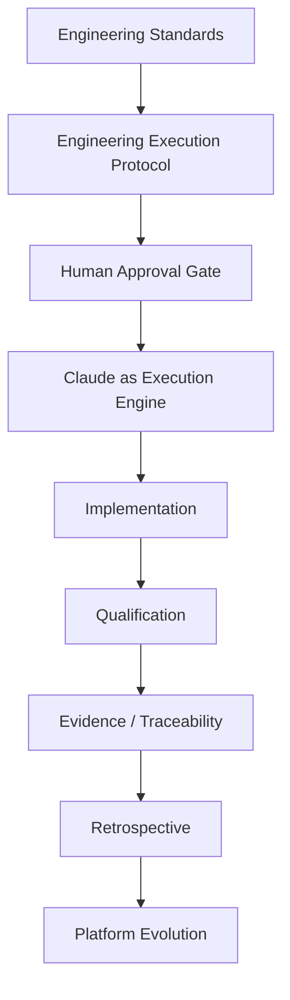

I agree with the **direction**, but I would not approve it exactly as written. There is one architectural issue that is important enough to correct before it becomes part of the platform. The uploaded document reflects the same overall idea. 

## What I approve

### 1. Project work should feed engineering

This is exactly right.

One of the biggest strengths of your platform is that **engineering evolves from real engineering work**, not from brainstorming.

The flow

```text
Project Work
    ↓
Observation
    ↓
Evidence
    ↓
Promotion
    ↓
Engineering
```

is, in my opinion, the correct philosophy.

---

### 2. ES-006 is the right place

I also agree that this belongs under Engineering Knowledge Governance.

Not under:

* EEP
* Runtime
* Qualification

Knowledge governance is responsible for deciding whether observations deserve promotion.

That is consistent.

---

### 3. The Promotion Ladder

I also agree with

```text
Research
↓

Pilot
↓

Qualification
↓

Engineering
```

This is now becoming one of the fundamental laws of your platform.

---

# Where I disagree

This sentence is too strong:

> **"Can Claude check every time if we can generalize and extract an AI architecture rule? Yes — the platform is now designed to do exactly this."**

I would **not** make that mandatory.

Instead I would define it as a **standing engineering question**.

The engineer should ask:

> **Did this work produce reusable engineering knowledge?**

That is different.

Why?

Because if you ask

> Can we create a new rule?

on every ticket, people naturally start looking for rules.

Instead ask

> Did we discover reusable knowledge?

Most tickets will honestly answer:

> No.

And that is perfectly fine.

---

# I would change the workflow

Instead of

```text
Observe

↓

Classify

↓

Promote
```

I would insert a missing step.

```text
Observe

↓

Evaluate Reuse Potential

↓

Classify

↓

Promote
```

Because not every observation deserves classification.

Many observations are simply local implementation details.

---

# The biggest refinement

I think you're actually discovering something deeper.

The platform should **not** look for:

> Rules

It should look for:

> Knowledge that may deserve promotion.

Sometimes that becomes

* a Pattern Card

Sometimes

* a Developer Guide

Sometimes

* an Engineering Standard

Sometimes

* a Qualification improvement

Sometimes

* nothing.

So I would make the first decision:

```text
Did this work produce reusable knowledge?
```

Only if the answer is "yes" do you continue.

---

# This changes DetermineArtifactType()

I would actually split it.

Today:

```text
DetermineArtifactType()
```

I would evolve it into:

```text
DetermineReusePotential()

↓

DetermineArtifactType()
```

Because first you decide

> Is there anything worth keeping?

Only then do you ask

> What kind of thing is it?

That separation makes the model cleaner.

---

# One more important refinement

I would also **avoid saying "AI architecture rule."**

The platform is broader than AI.

Instead:

> **engineering knowledge**

or

> **engineering capability**

or

> **engineering standard**

depending on what emerges.

Otherwise the platform slowly becomes AI-centric again, which you've spent months removing.

---

# The architecture I would adopt

I would write it like this:

```text
Project Work
      │
      ▼
Observe
      │
      ▼
Determine Reuse Potential
      │
      ├──────────────► No
      │                  │
      │                  ▼
      │              Continue Work
      │
      ▼
Determine Artifact Type
      │
      ├── Pattern Card
      ├── Guide
      ├── Qualification Improvement
      ├── Candidate Standard
      └── Research
      │
      ▼
Promotion Ladder
      │
      ▼
Qualification
      │
      ▼
Engineering
```

Notice something important:

The platform is **not looking for standards**.

It is looking for **reusable engineering knowledge**.

Standards are only one possible destination.

---

## Final verdict

I would **approve this idea with one architectural amendment**:

> **Change the objective from "extract rules" to "discover reusable engineering knowledge."**

Everything else—the Pattern Cards, Promotion Ladder, ES-006 governance, Decision Model, and ARB ratification—then becomes the mechanism for deciding **what that reusable knowledge should become**.

Ironically, that refinement is also consistent with your newest constitutional principle:

> **Knowledge exists only to satisfy Knowledge Needs. Documentation is merely one possible representation.**

The platform should therefore seek **knowledge first**, and let the appropriate representation (pattern, guide, standard, qualification improvement, or no artifact at all) emerge from the evidence.

 This is the right way to close the loop: **verification by execution, not assertion.**

  To verify that the execution loop is actually encoded and that all rules are triggered correctly, we need a **fresh session** that starts from zero and attempts to navigate the entire lifecycle — from a new work item through to the next step.

  Here are the **prompt instructions for Claude** to perform this verification.

  ---

  # Prompt Instructions for Claude — Engineering Platform Execution Loop Verification

  ---

  ## Role

  You are acting as the **Chief Architect** for the PublicDigit Engineering Platform.

  The Engineering Platform is complete, ratified, and declared STABLE.

  Your task is to **verify that the execution loop is correctly encoded and that all rules trigger as designed.**

  This is **not** a design task. This is **operational verification** — proving that the platform behaves as specified.

  ---

  ## The Execution Loop to Verify

  ```
  New work item arrives
      ↓
  DetermineConcern()
      ↓
  DetermineApplicableStandards()
      ↓
  EP-01 Plan First
      ↓
  ARB Review
      ↓
  Implementation
      ↓
  Verification
      ↓
  EP-02 Completion Review
      ↓
  DetermineReusePotential()
      ↓
  If Yes → DetermineArtifactType() → DeterminePromotionPath()
      ↓
  Ask for Next Step
      ↓
  ARB decides next step
  ```

  ---

  ## Verification Protocol

  You will perform the verification by **simulating a new work item** in a fresh session.

  **Do not** modify the architecture.
  **Do not** create new standards.
  **Do not** write code.

  **Only** traverse the execution loop and verify that each step triggers the correct rule.

  ---

  ## Step 1: Simulate a New Work Item

  Start with a new work item. For example:

  > "A developer has raised a question about how to structure a new developer guide for the Project Knowledge context."

  **At this point, the following should trigger:**

  | Trigger | Expected Rule |
  |---------|---------------|
  | `DetermineConcern()` | ES-005.1 — Product, Engineering, or Runtime? |
  | `DetermineApplicableStandards()` | STANDARDS_INDEX — Which ES apply? |

  **Verification:** Confirm that the Decision Model is consulted and that the correct standards are identified.

  ---

  ## Step 2: Plan the Work (EP-01)

  The work proceeds to planning.

  | Trigger | Expected Rule |
  |---------|---------------|
  | `EP-01 Plan First` | ES-002 — Every implementation slice starts with a plan. |
  | `EP-01-Light` (if below-IDD) | ES-002 — Lightweight plan for small changes. |

  **Verification:** Confirm that a plan is produced and that the correct EP-01 form is used.

  ---

  ## Step 3: ARB Review (Governance Gate)

  The plan is submitted for ARB review.

  | Trigger | Expected Rule |
  |---------|---------------|
  | `ES-001.2 Documents Record Governance` | Governance decisions are made by the ARB, not by the AI. |
  | `ES-001.1 Rule Parsimony` | No new rules are created unless necessary. |

  **Verification:** Confirm that the ARB review is the governance gate and that no rule is created without evidence.

  ---

  ## Step 4: Implementation (EEP)

  The plan is approved and implementation begins.

  | Trigger | Expected Rule |
  |---------|---------------|
  | `ES-002 Engineering Execution` | Work follows the EEP: Plan → Independent Review → Approval → Implementation → Verification → Report → Decide. |
  | `ES-002.1 Implementation-First Default` | Implementation is the default; architecture changes require evidence. |

  **Verification:** Confirm that the EEP is followed and that no architecture changes are made without evidence.

  ---

  ## Step 5: Verification (ES-003)

  The implementation is verified.

  | Trigger | Expected Rule |
  |---------|---------------|
  | `ES-003.1 Qualification Lifecycle` | Findings are reported, not fixed in-run. |
  | `ES-003.2 Score-Persistence Stop` | Numeric scores are not persisted. |
  | `ES-003.3 Measurement Conventions` | Configuration is recorded with the result. |

  **Verification:** Confirm that the qualification lifecycle is followed and that no numeric scores are persisted.

  ---

  ## Step 6: Completion Review (EP-02)

  The implementation is reviewed.

  | Trigger | Expected Rule |
  |---------|---------------|
  | `EP-02 Completion Review` | Every implementation ends with a report: changes, evidence, commits, risks, next action. |
  | `ES-004.1 Retrospectives Recommend` | Retrospectives recommend; they never declare. |
  | `ES-004.2 Record Conventions` | Durable IDs are used; dated filenames are avoided. |

  **Verification:** Confirm that the EP-02 report is produced and that it follows the record conventions.

  ---

  ## Step 7: Determine Reuse Potential

  The completion review asks the harvest question.

  | Trigger | Expected Rule |
  |---------|---------------|
  | `DetermineReusePotential()` | ES-006.4 — Did this work reveal reusable engineering knowledge? |
  | `No` → Continue work (common case). |
  | `Yes` → DetermineArtifactType(). |

  **Verification:** Confirm that the harvest question is asked and that **"No" is a valid, healthy outcome.**

  ---

  ## Step 8: If Yes → Determine Artifact Type

  If knowledge is revealed, the artifact type is determined.

  | Trigger | Expected Rule |
  |---------|---------------|
  | `DetermineArtifactType()` | ES-004, ES-006 — Is it a pattern card, guide, qualification improvement, candidate standard, or research? |

  **Verification:** Confirm that the artifact type is determined correctly.

  ---

  ## Step 9: If Candidate Standard → Determine Promotion Path

  If a candidate standard is identified, the promotion path begins.

  | Trigger | Expected Rule |
  |---------|---------------|
  | `DeterminePromotionPath()` | ES-006.1 — Research → Pilot → Qualification → Promotion. |

  **Verification:** Confirm that the promotion ladder is followed and that nothing is promoted without evidence.

  ---

  ## Step 10: Ask for Next Step

  The EP-02 report ends with a recommendation.

  | Trigger | Expected Rule |
  |---------|---------------|
  | `EP-02 report ends with "Recommended next action"` | The ARB decides the next step. |
  | `Ask for Next Step` | The loop continues by design. |

  **Verification:** Confirm that the EP-02 report ends with a recommended next action and that the ARB decides the next step.

  ---

  ## Deliverable: Verification Report

  Produce a **Verification Report** that answers:

  | Question | Answer |
  |----------|--------|
  | Did `DetermineConcern()` trigger correctly? | Yes / No / Partial |
  | Did `DetermineApplicableStandards()` trigger correctly? | Yes / No / Partial |
  | Did `EP-01 Plan First` trigger correctly? | Yes / No / Partial |
  | Did `ARB Review` trigger correctly? | Yes / No / Partial |
  | Did `Implementation` follow the EEP? | Yes / No / Partial |
  | Did `Verification` follow ES-003? | Yes / No / Partial |
  | Did `EP-02 Completion Review` produce the expected report? | Yes / No / Partial |
  | Did `DetermineReusePotential()` trigger correctly? | Yes / No / Partial |
  | Did `DetermineArtifactType()` trigger correctly (if applicable)? | Yes / No / Partial |
  | Did `DeterminePromotionPath()` trigger correctly (if applicable)? | Yes / No / Partial |
  | Did `Ask for Next Step` trigger correctly? | Yes / No / Partial |

  ---

  ## The One Rule That Must Hold Throughout

  > **The architecture never executes. The Engineer consults it.**

  At every step, confirm that the Engineer consults the Decision Model and the standards — **not** the other way around.

  ---

  ## Summary

  | Phase | Action |
  |-------|--------|
  | 1 | Simulate a new work item. |
  | 2 | Step through the execution loop. |
  | 3 | For each step, confirm the correct rule triggers. |
  | 4 | Produce a Verification Report with PASS/WARN/FAIL. |
  | 5 | STOP — await ARB review. |

  The execution loop is encoded. The verification will prove it.
  Your assessment is coherent: the article-style **orchestration product** has not been fully built, but the **engineering governance platform** and execution discipline largely have been. That distinction is important, because your system is evidence-driven and avoids speculative domain modeling until repeated use justifies it. [preprints](https://www.preprints.org/manuscript/202605.1737)

## What is implemented

Your summary shows that the following are effectively in place: domain-first engineering, the brainstorm→plan→review→implement→report loop, mandatory approval gates, traceability, governance rules, context management, and “planner before coder” discipline. In other words, the platform already behaves like a governed engineering system rather than a free-form agent runtime. [ithub.global.ssl.fastly](https://ithub.global.ssl.fastly.net/DimitriGeelen/agentic-engineering-framework)

## What is not implemented

The parts that remain intentionally deferred are the ones that would turn this into a full autonomous workflow product: explicit aggregates like `TaskIntent` and `ExecutionRun`, a dedicated workflow engine, machine-oriented JSON artifacts, and a separate human review UI. That is not a weakness; it is consistent with your rule not to generalize before evidence. [arxiv](https://arxiv.org/html/2510.13857v1)

## Refined architecture view

I would redraw your architecture as a **governance-first engineering stack** rather than an orchestration platform. The key flow is: standards → EEP → human approval → Claude execution → qualification → evidence → retrospective → platform evolution. Claude is then one controlled execution engine inside that stack, not the stack itself. [tacticaledgeai](https://www.tacticaledgeai.com/solutions/agent-governance/)



## The real distinction

The article’s model assumes that planning, execution, and review will later become separate software components. Your model instead treats those as **governance behaviors** enforced through protocol, artifacts, and review discipline, which is more conservative and better aligned with your evidence-first approach. That means your current architecture is not missing pieces so much as it is deliberately stopping short of an unnecessary platform abstraction. [herbertograca](https://herbertograca.com/2017/11/16/explicit-architecture-01-ddd-hexagonal-onion-clean-cqrs-how-i-put-it-all-together/)

## Design implication

If you later observe stable repetition across multiple agents, multiple runtimes, or multiple execution styles, then the deferred concepts may become real domain objects. Until then, keeping markdown artifacts, human review in chat, and protocol-based governance is the right move because it minimizes speculative complexity. [preprints](https://www.preprints.org/manuscript/202605.1737)

If useful, I can now convert this into a **formal architecture memo** with:
- bounded contexts,
- rules/invariants,
- C4 diagrams,
- and a decision log showing what is intentionally deferred versus implemented.
