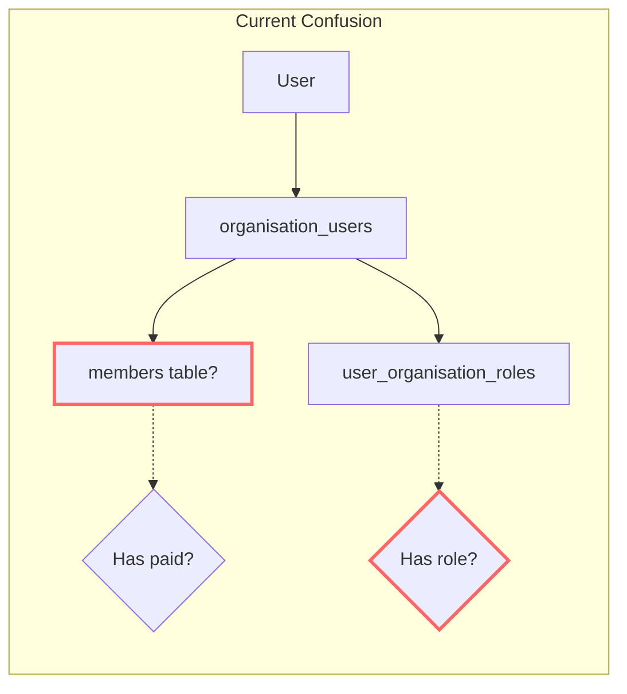
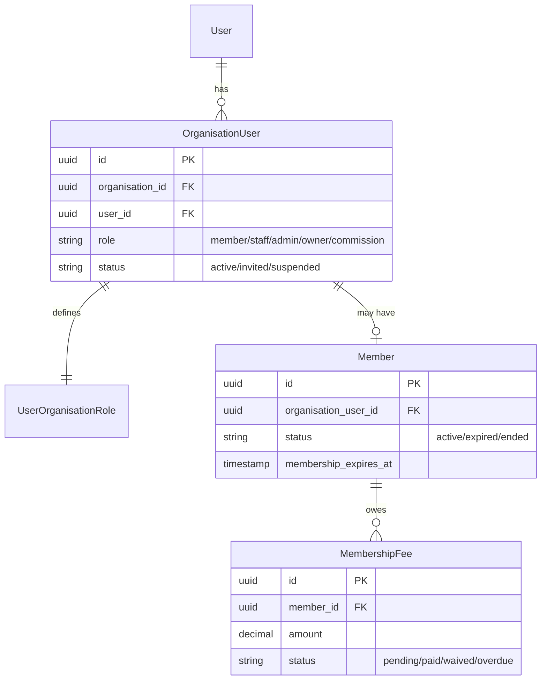
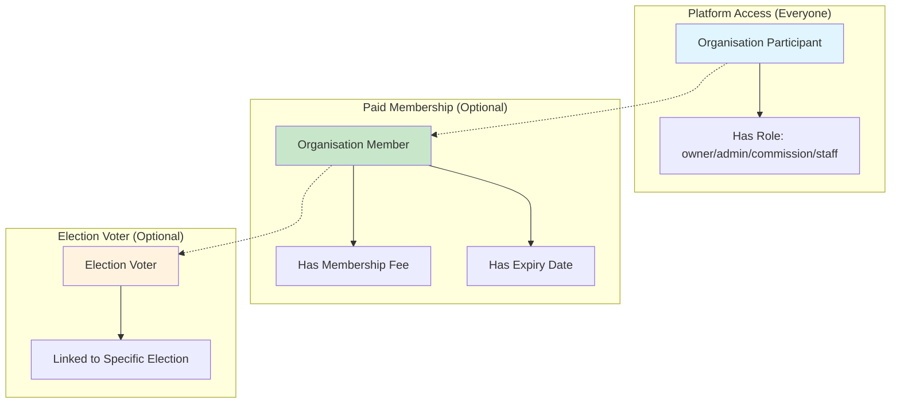

# 🏛️ **Senior Software Architect: Analysis of Paid vs. Non-Paid Membership**

## **Executive Summary**

You've identified a **critical domain distinction** that many systems get wrong. The current architecture has **two separate concepts** that are being partially conflated, leading to confusion. Let me analyze and propose the correct architecture.

---

## 📊 **Current State Analysis**

### **The Two Concepts**

| Concept | Table | Purpose | Has Paid Dues? |
|---------|-------|---------|----------------|
| **Organisation Participant** | `organisation_users` + `user_organisation_roles` | Platform access, roles, permissions | ❌ No |
| **Formal Member** | `members` + `membership_fees` | Paid membership with expiry, benefits | ✅ Yes |

### **The Problem**



**The issue:** The `/members/` list likely shows **everyone in `organisation_users`** regardless of whether they have a formal `members` record. This conflates "platform users with roles" with "paid members."

---

## ✅ **Correct Architecture: Separation of Concerns**

### **Domain Model**



### **Key Principle**

> **Being an "organisation user" is NOT the same as being a "paid member."**

| Scenario | OrganisationUser | Member | Correct? |
|----------|-----------------|--------|----------|
| Election Commissioner (staff) | ✅ Yes (role=commission) | ❌ No | ✅ Correct |
| Volunteer with platform access | ✅ Yes (role=staff) | ❌ No | ✅ Correct |
| Paid annual member | ✅ Yes (role=member) | ✅ Yes | ✅ Correct |
| Lifetime member | ✅ Yes (role=member) | ✅ Yes (expires_at=null) | ✅ Correct |
| Board member (unpaid) | ✅ Yes (role=board) | ❌ No | ✅ Correct |

---

## 🎯 **Recommended Architecture Improvements**

### **1. Clarify the Member List**

**Current Problem:** `/members/` shows all `organisation_users`, not just `members`.

**Fix:** The member list should ONLY show formal members:

```php
// MemberController@index - CORRECT
public function index(Organisation $organisation)
{
    $members = Member::where('organisation_id', $organisation->id)
        ->with('organisationUser.user')
        ->paginate(20);
    
    return Inertia::render('Organisations/Members/Index', [
        'members' => $members,  // Only formal members
    ]);
}
```

**If you need a "People with Platform Access" list:** Create a separate endpoint:

```php
// OrganisationUserController@index - NEW
public function index(Organisation $organisation)
{
    $participants = OrganisationUser::where('organisation_id', $organisation->id)
        ->with('user', 'member')
        ->paginate(20);
    
    return Inertia::render('Organisations/Participants/Index', [
        'participants' => $participants,  // Everyone with platform access
    ]);
}
```

---

### **2. Add `is_paid_member` Attribute to User Model**

```php
// app/Models/User.php
public function isPaidMember(Organisation $organisation): bool
{
    return Member::where('organisation_id', $organisation->id)
        ->whereHas('organisationUser', fn($q) => $q->where('user_id', $this->id))
        ->where('status', 'active')
        ->where(function($q) {
            $q->whereNull('membership_expires_at')
              ->orWhere('membership_expires_at', '>', now());
        })
        ->exists();
}

public function getRoleIn(Organisation $organisation): ?string
{
    return UserOrganisationRole::where('user_id', $this->id)
        ->where('organisation_id', $organisation->id)
        ->value('role');
}
```

---

### **3. Update Dashboard to Show Both Concepts**

```vue
<!-- Dashboard/Index.vue - Enhanced for clarity -->
<template>
    <!-- Role badge (platform access) -->
    <div class="mb-4">
        <span class="text-xs text-slate-400">Platform Role:</span>
        <span :class="roleBadgeClass" class="ml-2 px-2 py-0.5 rounded-full text-xs font-medium">
            {{ roleLabel }}
        </span>
    </div>
    
    <!-- Membership status (paid membership) -->
    <div v-if="memberSelf" class="mb-6">
        <div class="flex items-center gap-2">
            <span class="text-xs text-slate-400">Membership Status:</span>
            <span v-if="memberSelf.has_membership" 
                  :class="memberSelf.status === 'active' ? 'bg-green-100 text-green-800' : 'bg-red-100 text-red-800'"
                  class="px-2 py-0.5 rounded-full text-xs font-medium">
                {{ memberSelf.status }}
            </span>
            <span v-else class="text-xs text-amber-600 bg-amber-50 px-2 py-0.5 rounded-full">
                No paid membership
            </span>
        </div>
        <p v-if="!memberSelf.has_membership" class="text-xs text-slate-500 mt-1">
            You have platform access but are not a paid member. 
            <a :href="route('organisations.membership.apply', organisation.slug)" class="text-purple-600 hover:underline">
                Apply for paid membership →
            </a>
        </p>
    </div>
</template>
```

---

### **4. Add Staff/Commissioner Onboarding Flow**

**For non-paid roles (staff, election commissioners):**

```php
// OrganisationUserController.php - NEW
public function inviteStaff(Request $request, Organisation $organisation)
{
    $validated = $request->validate([
        'email' => 'required|email',
        'role' => 'required|in:staff,commission,admin',
    ]);
    
    // Create organisation user WITHOUT member record
    $orgUser = OrganisationUser::create([
        'id' => (string) Str::uuid(),
        'organisation_id' => $organisation->id,
        'user_id' => $user->id,
        'role' => $validated['role'],
        'status' => 'active',
    ]);
    
    // Create role assignment
    UserOrganisationRole::create([
        'organisation_id' => $organisation->id,
        'user_id' => $user->id,
        'role' => $validated['role'],
    ]);
    
    // NO member record created
    // NO membership_fee created
}
```

---

### **5. Database Schema Improvements**

```sql
-- Add column to clarify member type
ALTER TABLE members ADD COLUMN member_type ENUM('paid', 'honorary', 'lifetime', 'staff') DEFAULT 'paid';

-- Add column to track membership source
ALTER TABLE members ADD COLUMN source ENUM('application', 'admin_created', 'import', 'staff_role') DEFAULT 'application';

-- Add notes for non-paid members
ALTER TABLE members ADD COLUMN notes text NULL;

-- Create view for clarity
CREATE VIEW v_organisation_participants AS
SELECT 
    ou.id,
    ou.organisation_id,
    ou.user_id,
    u.name,
    u.email,
    uor.role as platform_role,
    CASE WHEN m.id IS NOT NULL THEN 'yes' ELSE 'no' END as has_paid_membership,
    m.status as membership_status,
    m.membership_expires_at
FROM organisation_users ou
JOIN users u ON u.id = ou.user_id
LEFT JOIN user_organisation_roles uor ON uor.organisation_id = ou.organisation_id AND uor.user_id = ou.user_id
LEFT JOIN members m ON m.organisation_user_id = ou.id;
```

---

## 📋 **Implementation Plan**

### **Phase 1: Immediate Fixes (Today)**

| Task | File | Change |
|------|------|--------|
| Fix member list | `MemberController@index` | Only show `members` table, not `organisation_users` |
| Add clarity to dashboard | `Dashboard/Index.vue` | Show both platform role AND membership status |
| Add apply link for non-members | `Dashboard/Index.vue` | "Apply for paid membership" CTA |

### **Phase 2: Separate Lists (This Week)**

| Task | File | Change |
|------|------|--------|
| Create participants list | `OrganisationUserController` | Show all platform users |
| Add staff onboarding | `OrganisationUserController@inviteStaff` | Create org user without member record |
| Update navigation | Sidebar | Separate "Members" vs "Platform Users" |

### **Phase 3: Role-Based Membership Requirements (Next Sprint)**

| Task | Description |
|------|-------------|
| Election eligibility | Require paid membership for voting (except commission) |
| Staff access | Platform access without paid membership |
| Honorary members | Members without fees (waived automatically) |

---

## 🎯 **Decision: Which is Correct?**

### **For Niraj's Case:**

| If Niraj is... | Should he have Member record? | Action |
|----------------|-------------------------------|--------|
| **Election Commissioner (staff)** | ❌ No | Remove from members table, keep in organisation_users |
| **Paid annual member** | ✅ Yes | Create member record with expiry and fee |
| **Honorary lifetime member** | ✅ Yes | Create member record with member_type='honorary', fees waived |

### **Recommended Approach:**

```php
// Determine Niraj's status
$orgUser = OrganisationUser::where('user_id', $niraj->id)
    ->where('organisation_id', $org->id)
    ->first();

$hasMemberRecord = Member::where('organisation_user_id', $orgUser->id)->exists();

if ($orgUser->role === 'commission' && !$hasMemberRecord) {
    // Niraj is a commissioner without paid membership - CORRECT
    // Dashboard should show: "Platform role: Commission | No paid membership"
} elseif ($orgUser->role === 'member' && !$hasMemberRecord) {
    // Niraj has member role but no member record - INCONSISTENT
    // Need to create member record or change role
}
```

---

## ✅ **Final Architecture Summary**

| Component | Current | Recommended |
|-----------|---------|-------------|
| **Member list** | Shows all org users | ✅ Shows only paid members |
| **Dashboard clarity** | Shows "not a member" | ✅ Shows both role + membership status |
| **Staff/Commissioner** | Mixed with members | ✅ Separate onboarding, no member record |
| **Voting eligibility** | Based on role only | ✅ Requires paid membership (except commission) |
| **Fee tracking** | Only for members | ✅ Only for members with `member_type='paid'` |

---

**Would you like me to implement these fixes in the following order:**

1. **Fix the member list** (MemberController)
2. **Update dashboard** to show both concepts
3. **Add staff onboarding** flow
4. **Create participants list** separate from members

This will resolve the confusion and create a clean separation between **platform users** and **paid members**. 🚀
# 🏛️ **Senior Software Architect: Clear Separation of Concepts**

## **Executive Summary**

You're absolutely right. The current naming is **ambiguous and conflates different concepts**. Let me propose a **clear, consistent architecture** with distinct names, routes, and responsibilities.

---

## 📊 **Current Confusion vs. Proposed Clarity**

### **The Three Distinct Concepts**

| Concept | Current Name | Problem | Proposed Name |
|---------|--------------|---------|----------------|
| **Platform access** | `organisation_users` | Sounds like "members" | `organisation_participants` |
| **Paid membership** | `members` | Too generic | `organisation_members` |
| **Election voter** | `election_memberships` | Clear enough | `election_voters` (keep) |

---

## 🎯 **Proposed Architecture**

### **Clear Hierarchy**



### **Rules**

| Layer | Purpose | Required For | Created By |
|-------|---------|--------------|------------|
| **Participant** | Platform access | Everyone with any role | Admin invitation or application approval |
| **Member** | Paid benefits, voting rights | Voting, member-only content | Membership application approval |
| **Voter** | Election participation | Voting in specific election | Admin assignment or automatic (if member) |

---

## 📁 **Renamed Tables**

### **Migration: Rename Tables**

```php
// 2026_04_04_000001_rename_membership_tables.php
Schema::rename('organisation_users', 'organisation_participants');
Schema::rename('members', 'organisation_members');
Schema::rename('membership_applications', 'member_applications');
Schema::rename('membership_fees', 'member_fees');
Schema::rename('membership_renewals', 'member_renewals');
Schema::rename('membership_types', 'member_types');

// Update foreign keys
Schema::table('organisation_members', function (Blueprint $table) {
    $table->renameColumn('organisation_user_id', 'organisation_participant_id');
});

Schema::table('member_fees', function (Blueprint $table) {
    $table->renameColumn('member_id', 'organisation_member_id');
});

Schema::table('member_renewals', function (Blueprint $table) {
    $table->renameColumn('member_id', 'organisation_member_id');
});
```

---

## 🗺️ **New Route Structure**

### **Clear, Semantic Routes**

```php
// routes/organisations.php

// ============================================
// 1. ORGANISATION PARTICIPANTS (Platform Access)
// ============================================
Route::prefix('/participants')->name('organisations.participants.')->group(function () {
    // List all people with platform access
    Route::get('/', [ParticipantController::class, 'index'])->name('index');
    
    // Invite new participant (staff, commissioner, admin)
    Route::post('/invite', [ParticipantController::class, 'invite'])->name('invite');
    
    // Manage participant roles
    Route::patch('/{participant}/role', [ParticipantController::class, 'updateRole'])->name('update-role');
    
    // Remove platform access
    Route::delete('/{participant}', [ParticipantController::class, 'destroy'])->name('remove');
});

// ============================================
// 2. ORGANISATION MEMBERS (Paid Membership)
// ============================================
Route::prefix('/members')->name('organisations.members.')->group(function () {
    // List only paid members
    Route::get('/', [MemberController::class, 'index'])->name('index');
    
    // Member details
    Route::get('/{member}', [MemberController::class, 'show'])->name('show');
    
    // Member fees
    Route::get('/{member}/fees', [MemberFeeController::class, 'index'])->name('fees.index');
    Route::post('/{member}/fees/{fee}/pay', [MemberFeeController::class, 'pay'])->name('fees.pay');
    Route::post('/{member}/fees/{fee}/waive', [MemberFeeController::class, 'waive'])->name('fees.waive');
    
    // Member renewal
    Route::post('/{member}/renew', [MemberRenewalController::class, 'store'])->name('renew');
    
    // Member applications (for pending applications)
    Route::get('/applications', [MemberApplicationController::class, 'index'])->name('applications.index');
    Route::get('/applications/{application}', [MemberApplicationController::class, 'show'])->name('applications.show');
    Route::patch('/applications/{application}/approve', [MemberApplicationController::class, 'approve'])->name('applications.approve');
    Route::patch('/applications/{application}/reject', [MemberApplicationController::class, 'reject'])->name('applications.reject');
});

// ============================================
// 3. PUBLIC MEMBERSHIP APPLICATION
// ============================================
Route::prefix('/membership')->name('organisations.membership.')->group(function () {
    // Public application form (no auth required)
    Route::get('/apply', [MemberApplicationController::class, 'create'])->name('apply');
    Route::post('/apply', [MemberApplicationController::class, 'store'])->name('apply.store');
});

// ============================================
// 4. MEMBER TYPES (Admin only)
// ============================================
Route::prefix('/member-types')->name('organisations.member-types.')->group(function () {
    Route::get('/', [MemberTypeController::class, 'index'])->name('index');
    Route::post('/', [MemberTypeController::class, 'store'])->name('store');
    Route::put('/{type}', [MemberTypeController::class, 'update'])->name('update');
    Route::delete('/{type}', [MemberTypeController::class, 'destroy'])->name('destroy');
});

// ============================================
// 5. MEMBERSHIP DASHBOARD (Role-based)
// ============================================
Route::get('/membership-dashboard', [MembershipDashboardController::class, 'index'])
    ->name('organisations.membership.dashboard');
```

---

## 📊 **Clear Model Hierarchy**

### **New Model Structure**

```php
// app/Models/OrganisationParticipant.php
class OrganisationParticipant extends Model
{
    use HasUuids, SoftDeletes;
    
    protected $table = 'organisation_participants';
    
    public function user(): BelongsTo
    {
        return $this->belongsTo(User::class);
    }
    
    public function organisation(): BelongsTo
    {
        return $this->belongsTo(Organisation::class);
    }
    
    public function roles(): HasMany
    {
        return $this->hasMany(UserOrganisationRole::class, 'organisation_id', 'organisation_id')
            ->where('user_id', $this->user_id);
    }
    
    public function member(): HasOne
    {
        return $this->hasOne(OrganisationMember::class, 'organisation_participant_id');
    }
    
    public function isPaidMember(): bool
    {
        return $this->member && $this->member->status === 'active';
    }
    
    public function hasPlatformAccess(): bool
    {
        return true; // All participants have platform access
    }
}

// app/Models/OrganisationMember.php
class OrganisationMember extends Model
{
    use HasUuids, SoftDeletes;
    
    protected $table = 'organisation_members';
    
    public function participant(): BelongsTo
    {
        return $this->belongsTo(OrganisationParticipant::class, 'organisation_participant_id');
    }
    
    public function user(): BelongsTo
    {
        return $this->hasOneThrough(User::class, OrganisationParticipant::class, 
            'id', 'id', 'organisation_participant_id', 'user_id');
    }
    
    public function fees(): HasMany
    {
        return $this->hasMany(MemberFee::class, 'organisation_member_id');
    }
    
    public function renewals(): HasMany
    {
        return $this->hasMany(MemberRenewal::class, 'organisation_member_id');
    }
    
    public function isActive(): bool
    {
        return $this->status === 'active' && 
            ($this->membership_expires_at === null || 
             $this->membership_expires_at->isFuture());
    }
    
    public function hasPaidFees(): bool
    {
        return $this->fees()->where('status', 'paid')->exists();
    }
}
```

---

## 🎯 **Clear Business Rules**

### **Rule Matrix**

| Action | Requires Participant | Requires Member | Requires Voter |
|--------|---------------------|-----------------|----------------|
| **Login to platform** | ✅ Yes | ❌ No | ❌ No |
| **View public content** | ❌ No | ❌ No | ❌ No |
| **Access member-only content** | ✅ Yes | ✅ Yes | ❌ No |
| **Apply for membership** | ✅ Yes | ❌ No | ❌ No |
| **Vote in elections** | ✅ Yes | ✅ Yes | ✅ Yes |
| **Stand for election** | ✅ Yes | ✅ Yes | ❌ No |
| **Administer elections** | ✅ Yes | ❌ No (commission role) | ❌ No |
| **Manage organisation** | ✅ Yes (owner/admin role) | ❌ No | ❌ No |

---

## 📋 **Controller Renaming**

| Old Controller | New Controller | Responsibility |
|----------------|----------------|----------------|
| `MemberController` | `OrganisationMemberController` | Paid member management |
| `MemberFeeController` | `MemberFeeController` | Member fee tracking |
| `MemberRenewalController` | `MemberRenewalController` | Member renewal |
| `MembershipApplicationController` | `MemberApplicationController` | Membership applications |
| `MembershipTypeController` | `MemberTypeController` | Member type definitions |
| `MembershipDashboardController` | `MembershipDashboardController` | Combined dashboard |

**New Controller:**
```php
// app/Http/Controllers/Organisations/ParticipantController.php
class ParticipantController extends Controller
{
    // Manage platform access (all roles)
    public function index(Organisation $organisation) // List all participants
    public function invite(Organisation $organisation) // Invite new participant
    public function updateRole(Organisation $organisation, OrganisationParticipant $participant)
    public function destroy(Organisation $organisation, OrganisationParticipant $participant)
}
```

---

## 🎨 **UI/UX Improvements**

### **Dashboard Clarity**

```vue
<!-- Dashboard/Index.vue -->
<template>
    <!-- Platform Role (Everyone) -->
    <div class="bg-blue-50 border border-blue-200 rounded-lg p-4 mb-6">
        <div class="flex items-center gap-2">
            <svg class="w-5 h-5 text-blue-600" fill="none" stroke="currentColor" viewBox="0 0 24 24">
                <path stroke-linecap="round" stroke-linejoin="round" stroke-width="2" 
                      d="M5.121 17.804A13.937 13.937 0 0112 16c2.5 0 4.847.655 6.879 1.804M15 10a3 3 0 11-6 0 3 3 0 016 0z"/>
            </svg>
            <span class="text-sm font-semibold text-blue-800">Platform Access:</span>
            <span class="text-sm text-blue-700">{{ roleLabel }}</span>
            <span class="text-xs text-blue-600 ml-2">(You can access this platform)</span>
        </div>
    </div>
    
    <!-- Paid Membership Status (Optional) -->
    <div class="bg-white rounded-xl shadow-sm border border-slate-200 p-5 mb-6">
        <div class="flex items-center justify-between flex-wrap gap-3">
            <div>
                <div class="flex items-center gap-2">
                    <svg class="w-5 h-5 text-green-600" fill="none" stroke="currentColor" viewBox="0 0 24 24">
                        <path stroke-linecap="round" stroke-linejoin="round" stroke-width="2" 
                              d="M9 12l2 2 4-4m5.618-4.016A11.955 11.955 0 0112 2.944a11.955 11.955 0 01-8.618 3.04A12.02 12.02 0 003 9c0 5.591 3.824 10.29 9 11.622 5.176-1.332 9-6.03 9-11.622 0-1.042-.133-2.052-.382-3.016z"/>
                    </svg>
                    <span class="text-sm font-semibold text-green-800">Paid Membership:</span>
                    <span v-if="memberSelf?.has_membership" 
                          class="px-2 py-0.5 rounded-full text-xs font-medium bg-green-100 text-green-800">
                        Active
                    </span>
                    <span v-else class="px-2 py-0.5 rounded-full text-xs font-medium bg-gray-100 text-gray-600">
                        None
                    </span>
                </div>
                <p class="text-xs text-slate-500 mt-1 ml-7">
                    <span v-if="memberSelf?.has_membership">
                        Your paid membership expires on {{ formatDate(memberSelf.expires_at) }}
                    </span>
                    <span v-else>
                        You don't have a paid membership. 
                        <a :href="route('organisations.membership.apply', organisation.slug)" 
                           class="text-purple-600 hover:underline">
                            Apply for membership →
                        </a>
                    </span>
                </p>
            </div>
            
            <!-- Show different CTAs based on status -->
            <a v-if="!memberSelf?.has_membership && role !== 'commission'"
               :href="route('organisations.membership.apply', organisation.slug)"
               class="px-4 py-2 bg-purple-600 text-white rounded-lg text-sm hover:bg-purple-700">
                Become a Member
            </a>
        </div>
    </div>
    
    <!-- Rest of dashboard... -->
</template>
```

---

## 📊 **Migration Plan**

### **Phase 1: Database Renaming (Low Risk)**
```bash
# Create migration to rename tables
php artisan make:migration rename_membership_tables_for_clarity

# Update models to use new table names
# Update foreign key references
```

### **Phase 2: Controller Restructuring (Medium Risk)**
```bash
# Create ParticipantController
# Update MemberController to only show paid members
# Update routes
```

### **Phase 3: UI Updates (Low Risk)**
```bash
# Update dashboard to show both concepts
# Update navigation menu
# Create separate participants list page
```

---

## ✅ **Benefits of This Architecture**

| Aspect | Before | After |
|--------|--------|-------|
| **Clarity** | "Member" means two things | Clear: Participant vs Member |
| **Routes** | Confusing `/members` | Clear: `/participants` and `/members` |
| **Elections** | Voter eligibility unclear | Clear: Must be paid member |
| **Staff** | Treated as members | Separate: Participants without membership |
| **Reporting** | Mixed data | Clean separation |

---

## 🚀 **Implementation Priority**

1. ✅ **Rename tables** (migration) - 2 hours
2. ✅ **Update models** and relationships - 2 hours
3. ✅ **Create ParticipantController** - 3 hours
4. ✅ **Update MemberController** (paid members only) - 2 hours
5. ✅ **Update dashboard** for clarity - 2 hours
6. ✅ **Update navigation** and routes - 1 hour
7. ✅ **Update tests** - 3 hours

**Total: ~15 hours** for complete separation.

---

**Would you like me to start with the migration to rename the tables for clarity?** 🚀
