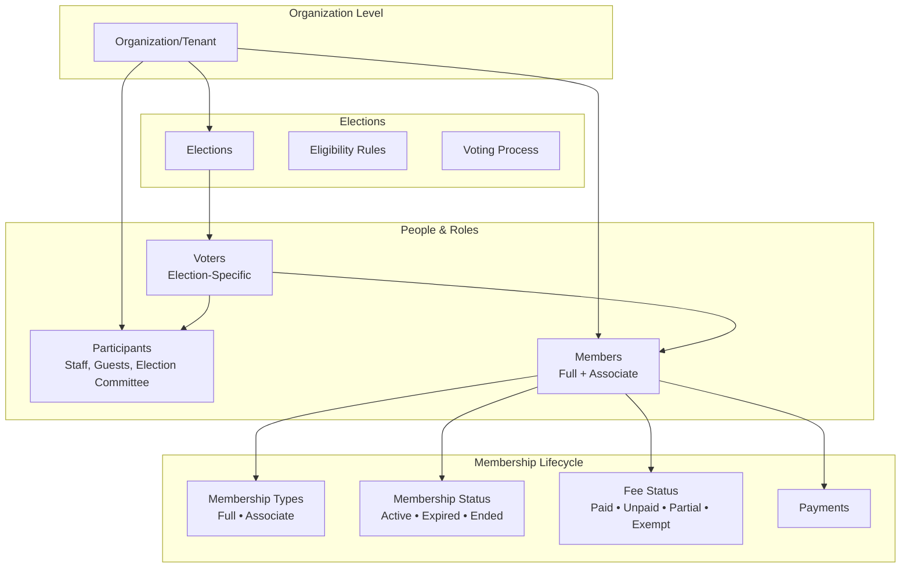
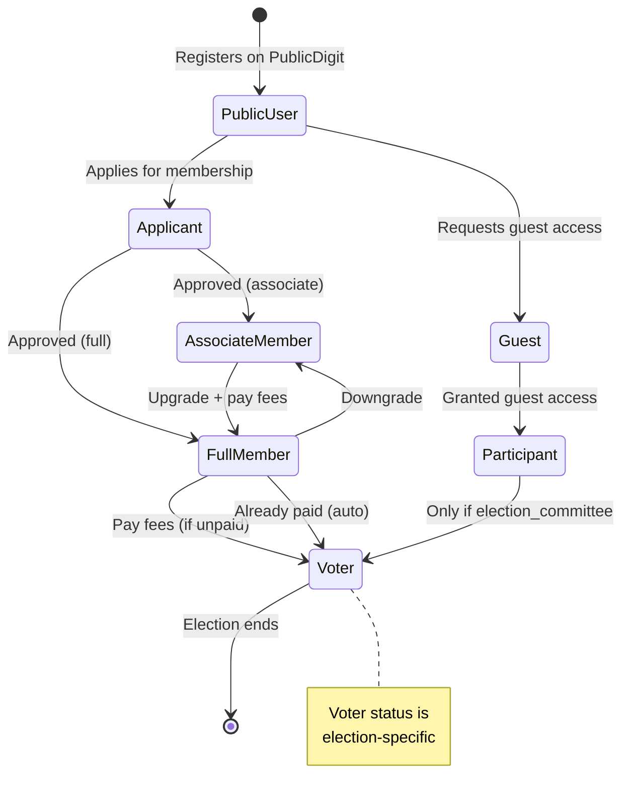

# Claude CLI Prompt for Code Analysis & Implementation Plan

## 📋 Complete Analysis & Planning Prompt

Copy and paste this into Claude CLI:

```markdown
## Context
I'm building a multi-tenant organisation management system with:
- Laravel 10/11 backend + Inertia.js + Vue 3 frontend
- Organisations have: Members (Full/Associate), Participants (Staff/Guest/Election Committee), Elections with scoped voters

## Already Implemented (Based on our conversation)

### Database Migrations ✅
- `add_fees_status_to_members_table.php` (paid/unpaid/partial/exempt)
- `add_grants_voting_rights_to_membership_types_table.php` (boolean)
- `create_organisation_participants_table.php` (staff/guest/election_committee)

### Models ✅
- `Member.php` - has `getVotingRightsAttribute()` and `canVoteInElection()`
- `MembershipType.php` - has `scopeFullMember()`, `scopeAssociateMember()`
- `OrganisationParticipant.php` - full model with scopes and `isExpired()`
- `Organisation.php` - added relationships: participants(), staff(), guests(), electionCommittee()

### Factories ✅
- `MemberFactory.php` - includes fees_status
- `MembershipTypeFactory.php` - with fullMember() and associateMember() states

### Tests ✅
- 93 tests passing for Membership domain

## Missing/To Develop

### 1. Election System (0% complete)
- [ ] Election model and migrations
- [ ] ElectionVoter model (election-scoped voter registration)
- [ ] Election creation/management UI
- [ ] Voting eligibility logic using existing `canVoteInElection()`
- [ ] Ballot/Candidate models
- [ ] Vote casting mechanism
- [ ] Results calculation

### 2. Upload/Import System (0% complete)
- [ ] Excel import for Participants (staff/guest/election_committee)
- [ ] Excel import for Full Members
- [ ] Excel import for Associate Members
- [ ] Template download endpoints
- [ ] Validation rules for each type
- [ ] Bulk import jobs with notifications

### 3. Payment & Fee Management (0% complete)
- [ ] Payments table and model
- [ ] Fee calculation service
- [ ] Payment gateway integration (Stripe/PayPal)
- [ ] Invoice generation
- [ ] Automatic fee_status updates after payment
- [ ] Overdue fee reminders

### 4. Membership Lifecycle (Partial - 40%)
- [x] Basic status (active/expired/ended)
- [x] fees_status (paid/unpaid/partial/exempt)
- [x] voting rights calculation
- [ ] Membership renewal workflow
- [ ] Expiry notification system
- [ ] Automated status changes (expired → ended)
- [ ] Membership application approval flow

### 5. UI Components (30% complete)
- [x] Basic dashboard structure
- [ ] Voter eligibility UI with action buttons
- [ ] Fee payment UI
- [ ] Election voting interface
- [ ] Upload modal components
- [ ] Real-time status indicators

### 6. User Onboarding for Non-Members (0% complete)
- [ ] "No relationship" state UI
- [ ] Membership application form
- [ ] Guest access request
- [ ] Upgrade from Associate to Full Member flow

### 7. API Endpoints (10% complete)
- [ ] REST endpoints for all missing features
- [ ] Webhook handlers for payments
- [ ] Export functionality (voter lists, results)

## Task for Claude CLI

Please analyze the existing codebase in `/var/www/nrna-eu` and create:

### Phase 1: Code Analysis Report
1. List all existing files in:
   - `app/Models/`
   - `app/Http/Controllers/`
   - `database/migrations/`
   - `resources/js/Pages/`
   - `routes/`

2. Identify which of the missing features already have partial implementations

3. Find any inconsistencies between the database schema and models

### Phase 2: Priority Implementation Plan
Create a detailed plan with these priorities:

**P0 - Must have for MVP:**
- Election system (basic: create election, register voters, cast vote)
- Membership application/approval flow
- Fee payment (basic: record payment, update fees_status)

**P1 - Important:**
- Excel upload for Members and Participants
- Renewal notifications
- Voter eligibility UI

**P2 - Nice to have:**
- Advanced election types (weighted voting, ranked choice)
- Automated payment reminders
- Dashboard analytics

### Phase 3: Technical Specifications
For EACH missing feature, provide:
- Files to create/modify
- Database schema changes needed
- Service classes required
- API endpoints (method, URL, request/response)
- Vue components needed
- Testing strategy

### Phase 4: Estimated Timeline
Break down by feature with hours/days:
- Setup/configuration
- Backend implementation
- Frontend implementation
- Testing
- Integration

### Output Format
Provide output as:
1. **Executive Summary** (1 paragraph)
2. **Current State Report** (table format)
3. **Implementation Roadmap** (by priority with checkboxes)
4. **Detailed Specifications** (for top 3 features)
5. **Risk Assessment** (potential issues and mitigations)
6. **Next Actions** (concrete steps to start)

## Additional Context
- Team size: 1 developer (me)
- Deadline: 4 weeks for MVP
- Dependencies: Laravel Excel, Cashier (Stripe), Laravel Notifications
- Testing: PHPUnit for backend, Vitest for frontend (if exists)

Start by scanning the codebase, then provide the analysis and plan.
```

---

## 🎯 Quick Implementation Checklist (For Your Reference)

### Immediate Next Steps (Today/Tomorrow)

```bash
# 1. Run the analysis (use the prompt above)
# 2. Create Election migration
php artisan make:migration create_elections_table
php artisan make:migration create_election_voters_table
php artisan make:migration create_candidates_table
php artisan make:migration create_votes_table

# 3. Create Election models
php artisan make:model Election -m
php artisan make:model ElectionVoter -m
php artisan make:model Candidate -m
php artisan make:model Vote -m

# 4. Install required packages
composer require maatwebsite/excel
composer require laravel/cashier
npm install vue-excel-editor xlsx

# 5. Create import jobs
php artisan make:job ImportParticipants
php artisan make:job ImportMembers
```

### Week 1 Focus
- ✅ Complete Election system (basic)
- ✅ Build voter registration
- ✅ Create voting interface

### Week 2 Focus  
- ✅ Excel upload for all types
- ✅ Payment recording system
- ✅ Membership application flow

### Week 3 Focus
- ✅ UI components for all features
- ✅ Notification system
- ✅ Dashboard improvements

### Week 4 Focus
- ✅ Testing & bug fixes
- ✅ Documentation
- ✅ Deployment

---

## 🚀 Kickoff Command

Run this in Claude CLI:

```bash
# Navigate to project
cd /var/www/nrna-eu

# Start analysis with the prompt above
claude analyze --prompt "Complete analysis and implementation plan for missing features" --output plan.md
```

This will give you a complete roadmap to finish the remaining 60-70% of the system!

# Complete Operations Picture for Your Multi-Tenant System

Let me give you a **clear, comprehensive view** of how all these pieces work together.

## 🏗️ Core Architecture Diagram



---

## 1️⃣ Organisation Participants

### What They Are
**Temporary or functional roles** - not formal members with voting rights.

| Type | Duration | Purpose | Example |
|------|----------|---------|---------|
| **Staff** | Long-term | Day-to-day operations | Admin, Coordinator |
| **Guest** | Temporary | Event participation | Workshop attendee |
| **Election Committee** | Election period | Run elections | Vote counter, Observer |

### Operations

```php
// Add staff member
OrganisationParticipant::create([
    'organisation_id' => $org->id,
    'user_id' => $user->id,
    'participant_type' => 'staff',
    'role' => 'election_coordinator',
    'permissions' => ['manage_elections', 'view_reports']
]);

// Add guest (with expiry)
OrganisationParticipant::create([
    'organisation_id' => $org->id,
    'user_id' => $guest->id,
    'participant_type' => 'guest',
    'expires_at' => now()->addDays(7),
    'permissions' => ['view_public_data']
]);

// Add election committee member
OrganisationParticipant::create([
    'organisation_id' => $org->id,
    'user_id' => $member->id,
    'participant_type' => 'election_committee',
    'role' => 'vote_validator'
]);
```

### Excel Upload Format
```csv
email,participant_type,role,expires_at,permissions
john@example.com,staff,election_coordinator,,{"manage_elections":true}
jane@example.com,guest,observer,2026-04-12,{"view_only":true}
```

---

## 2️⃣ Members (Active & General - Two Types)

### The Two Member Types

| Type | Voting Rights | Fee Required | Benefits |
|------|--------------|--------------|----------|
| **Full Member** | ✅ Full voting rights | Yes | Vote, hold office, benefits |
| **Associate Member** | ⚠️ Voice only (no vote) | Yes (reduced) | Observe, participate in discussions |

### Membership Status Flow

```php
// Status values
const STATUS_ACTIVE = 'active';    // Current member
const STATUS_EXPIRED = 'expired';  // Past expiry date
const STATUS_ENDED = 'ended';      // Voluntarily ended

// Fee status values  
const FEES_PAID = 'paid';          // Fully paid
const FEES_UNPAID = 'unpaid';      // Nothing paid
const FEES_PARTIAL = 'partial';    // Partially paid
const FEES_EXEMPT = 'exempt';      // Fee waiver
```

### Voting Rights Logic (Already Implemented ✅)

```php
// Full Member + Paid/Exempt = FULL voting rights
// Full Member + Partial = VOICE only
// Associate Member + Any = VOICE only (capped)
// Any + Unpaid/Expired = NO rights
```

---

## 3️⃣ Elections

### Election Lifecycle

```
DRAFT → REGISTRATION → ACTIVE → CLOSED → ARCHIVED
```

### Election Structure

```php
Election::create([
    'organisation_id' => $org->id,
    'name' => 'Board Election 2026',
    'type' => 'board_members',  // board, referendum, general
    'status' => 'draft',
    'registration_start' => '2026-04-01',
    'registration_end' => '2026-04-15',
    'voting_start' => '2026-04-20',
    'voting_end' => '2026-04-25',
    'is_anonymous' => true,
    'voting_system' => 'one_member_one_vote',  // or 'weighted'
]);
```

### Available Operations

```php
// Create election
POST /organisations/{slug}/elections

// Register voters (bulk)
POST /elections/{id}/voters/register

// Vote
POST /elections/{id}/vote

// View results (after closing)
GET /elections/{id}/results
```

---

## 4️⃣ Election-Scoped Voters

### Voter Registration Rules

Voters must be **explicitly registered** for each election, not automatic.

```php
// Who can be a voter?
✅ Full Members with paid fees (voting_rights = 'full')
✅ Associate Members (voice only - cannot vote)
✅ Election Committee members (for admin elections)
❌ Guests (never)
❌ Expired members (never)
```

### Register Voters for Election

```php
// Register eligible members for election
$eligibleMembers = Member::where('organisation_id', $org->id)
    ->where('status', 'active')
    ->where('fees_status', 'paid')
    ->whereHas('membershipType', fn($q) => $q->where('grants_voting_rights', true))
    ->get();

foreach ($eligibleMembers as $member) {
    ElectionVoter::create([
        'election_id' => $election->id,
        'user_id' => $member->user_id,
        'voter_type' => 'member',
        'verified_at' => now(),
    ]);
}
```

### Excel Upload for Voters

```csv
email,election_id,voter_type,verified_at
member@org.com,550e8400,member,2026-04-01
committee@org.com,550e8400,committee,2026-04-01
```

---

## 5️⃣ Upload Participants or Members via Excel

### Complete Upload Flow

```php
// 1. Prepare Excel template download
GET /organisations/{slug}/templates/participants
GET /organisations/{slug}/templates/members

// 2. Upload file
POST /organisations/{slug}/import/participants
POST /organisations/{slug}/import/members

// 3. Validate & process
// - Validate emails exist/not exist
// - Check for duplicates
// - Apply default values
// - Send notifications
```

### Member Excel Template Example

| email | membership_type | status | fees_status | joined_at | expires_at |
|-------|----------------|--------|-------------|-----------|------------|
| a@org.com | full_member | active | paid | 2026-01-01 | 2026-12-31 |
| b@org.com | associate | active | unpaid | 2026-01-15 | 2026-12-31 |

### Participant Excel Template

| email | participant_type | role | expires_at | permissions |
|-------|-----------------|------|------------|-------------|
| staff@org.com | staff | admin | | {"manage_all":true} |
| guest@event.com | guest | observer | 2026-04-10 | {"view":true} |

### Implementation Helper

```php
// app/Imports/MembersImport.php
class MembersImport implements ToModel, WithValidation
{
    public function model(array $row)
    {
        $user = User::where('email', $row[0])->first();
        $type = MembershipType::where('slug', $row[1])->first();
        
        return new Member([
            'user_id' => $user->id,
            'organisation_id' => $this->organisationId,
            'membership_type_id' => $type->id,
            'status' => $row[2],
            'fees_status' => $row[3],
            'joined_at' => $row[4],
            'membership_expires_at' => $row[5],
        ]);
    }
}
```

---

## 6️⃣ Membership Start & Valid Until

### Duration Calculation

```php
// When member joins
$member = Member::create([
    'joined_at' => now(),
    'membership_expires_at' => now()->addDays($type->duration_months * 30),
]);

// Renewal
function renewMember(Member $member): Member
{
    // Extend expiry by membership type duration
    $newExpiry = max(
        $member->membership_expires_at,
        now()
    )->addDays($member->membershipType->duration_months * 30);
    
    $member->update([
        'membership_expires_at' => $newExpiry,
        'status' => 'active',
        'last_renewed_at' => now(),
    ]);
    
    return $member;
}
```

### Expiry Monitoring

```php
// Daily job to check expiring members
$expiringSoon = Member::where('status', 'active')
    ->whereBetween('membership_expires_at', [now(), now()->addDays(30)])
    ->get();

// Send renewal reminders
foreach ($expiringSoon as $member) {
    Notification::send($member->user, new MembershipExpiringNotification($member));
}
```

---

## 7️⃣ Payment & Due Amount

### Fee Structure

```php
// MembershipType has base fee
$fullMemberFee = MembershipType::where('grants_voting_rights', true)->first()->fee_amount; // €100
$associateFee = MembershipType::where('grants_voting_rights', false)->first()->fee_amount; // €50
```

### Payment Tracking

```php
// Member's fee status determines voting rights
$member->fees_status = 'paid';     // Full voting rights (if Full Member)
$member->fees_status = 'partial';  // Voice only
$member->fees_status = 'unpaid';   // No rights

// Calculate due amount
function getOutstandingFees(Member $member): float
{
    $totalFee = $member->membershipType->fee_amount;
    $paid = Payment::where('member_id', $member->id)->sum('amount');
    
    return max(0, $totalFee - $paid);
}
```

### Payment Operations

```php
// Record payment
POST /organisations/{slug}/members/{member_id}/payments
{
    "amount": 100.00,
    "payment_date": "2026-04-05",
    "payment_method": "credit_card",
    "reference": "PAY-12345"
}

// Update fee status automatically after payment
function updateFeeStatus(Member $member): void
{
    $outstanding = getOutstandingFees($member);
    
    if ($outstanding <= 0) {
        $member->fees_status = 'paid';
    } elseif ($outstanding < $member->membershipType->fee_amount) {
        $member->fees_status = 'partial';
    } else {
        $member->fees_status = 'unpaid';
    }
    
    $member->save();
}
```

---

## 🔄 Complete Workflow Examples

### Workflow 1: New Member Joins

```
1. User applies (form submission)
2. Admin approves application
3. Member record created:
   - joined_at = today
   - expires_at = today + 1 year
   - fees_status = 'unpaid'
4. Invoice generated
5. User pays fee
6. Payment recorded → fees_status = 'paid'
7. Voting rights granted (if Full Member)
```

### Workflow 2: Election Process

```
1. Admin creates election
2. Admin sets dates: registration, voting
3. Admin uploads voter list (Excel)
   OR system auto-registers eligible members
4. Registered voters receive notifications
5. Voting period opens
6. Members vote (one per person)
7. Voting period closes
8. Results published
```

### Workflow 3: Bulk Import Members

```
1. Download Excel template
2. Fill with member data (email, type, dates)
3. Upload file
4. System validates:
   - Emails exist in users table
   - Membership types exist
   - No duplicate members
5. Preview shows: 50 success, 3 errors
6. Confirm import
7. Members created, notifications sent
```

---

## 📊 Quick Reference Table

| Operation | Who Can Do It | Where | How |
|-----------|--------------|-------|-----|
| Add staff | Owner/Admin | Participants page | Form or Excel |
| Add guest | Owner/Admin | Participants page | Form with expiry |
| Add election committee | Owner/Admin | Participants page | Form |
| Register member | Admin via application | Applications page | Approve application |
| Upload members via Excel | Owner/Admin | Members page | Excel import |
| Upload participants via Excel | Owner/Admin | Participants page | Excel import |
| Create election | Owner/Admin | Elections page | Form |
| Register voters | Election committee | Election page | Excel or auto |
| Vote | Registered voter | Voting page | Online ballot |
| Pay fees | Member | My Fees page | Payment gateway |
| Renew membership | Member | My Dashboard | Payment |

---

## 🎯 Key Takeaways

1. **Participants** = Functional roles (staff, guests, election committee)
2. **Members** = Formal membership with two types (Full/Associate)
3. **Voters** = Registered per election (subset of members + committee)
4. **Excel uploads** = Bulk operations for all entity types
5. **Fee status** = Primary driver of voting rights
6. **Expiry date** = Determines membership validity

This is your complete operations picture! Need me to elaborate on any specific workflow?
# Full Member vs Associate Member: Complete Breakdown

## 📊 Core Differences Table

| Aspect | Full Member | Associate Member |
|--------|-------------|------------------|
| **Voting Rights** | ✅ **Full** (can vote on all matters) | ❌ **None** (voice only) |
| **Hold Office** | ✅ Eligible for board positions | ❌ Cannot hold elected office |
| **Fee Amount** | Higher (e.g., €100/year) | Lower (e.g., €50/year) |
| **Benefits Access** | Full benefits package | Limited/observer benefits |
| **Membership Status** | Active member | Observer/affiliate |
| **Purpose** | Full participation | Engagement without commitment |

---

## 🎯 Voting Rights Comparison

Based on your **implemented logic**:

```php
// Full Member + Paid fees = "full" voting rights
// Full Member + Partial fees = "voice_only"  
// Associate Member + Any fees = "voice_only" (capped)
```

### Voting Rights Matrix

| Member Type | Fee Status | Voting Rights | Can Vote? | Can Speak? |
|-------------|------------|---------------|-----------|------------|
| **Full** | Paid/Exempt | `full` | ✅ Yes | ✅ Yes |
| **Full** | Partial | `voice_only` | ❌ No | ✅ Yes |
| **Full** | Unpaid | `none` | ❌ No | ❌ No |
| **Associate** | Paid/Exempt | `voice_only` | ❌ No | ✅ Yes |
| **Associate** | Partial/Unpaid | `none` | ❌ No | ❌ No |

---

## 💼 Real-World Examples

### Full Member Example
```php
// John is a Full Member with paid fees
Member::create([
    'user_id' => $john->id,
    'membership_type_id' => $fullMemberType->id,  // grants_voting_rights = true
    'fees_status' => 'paid',
    'status' => 'active'
]);

// John can:
// ✅ Vote in elections
// ✅ Run for board positions  
// ✅ Access member-only resources
// ✅ Propose motions
// ✅ Receive full newsletter
```

### Associate Member Example
```php
// Maria is an Associate Member (observer)
Member::create([
    'user_id' => $maria->id,
    'membership_type_id' => $associateType->id,  // grants_voting_rights = false
    'fees_status' => 'paid',
    'status' => 'active'
]);

// Maria can:
// ❌ NOT vote in elections
// ❌ NOT hold office
// ✅ Attend meetings (as observer)
// ✅ Speak in discussions (voice only)
// ✅ Receive associate newsletter
// ✅ Pay reduced fees
```

---

## 🏢 When to Use Each Type

### Full Member - Best For:
- Active participants who want decision-making power
- Long-term committed members
- Those who pay full fees
- Candidates for leadership roles

### Associate Member - Best For:
- New members testing engagement
- Students/reduced income members
- International members (remote participation)
- Organizations wanting observer status
- Members who only want basic benefits

---

## 💰 Financial Implications

```php
// Fee structure example
$fullMemberFee = 100.00;      // EUR/year
$associateFee = 50.00;        // EUR/year (50% discount)

// Payment tracking
$fullMember->fees_status = 'paid';   // Full voting rights
$associate->fees_status = 'paid';    // Still no voting rights (capped)
```

---

## 🔄 Upgrade/Downgrade Path

```php
// Associate → Full Member (requires application & higher fee)
function upgradeToFull(AssociateMember $associate): FullMember
{
    // 1. Submit upgrade application
    // 2. Pay difference (€50)
    // 3. Approve by board
    // 4. Update membership type
    $associate->update([
        'membership_type_id' => $fullMemberType->id,
        'fees_status' => 'paid'  // Reset after payment
    ]);
    
    return $associate->fresh();
}

// Full → Associate (downgrade, reduced fee)
function downgradeToAssociate(FullMember $full): AssociateMember
{
    $full->update([
        'membership_type_id' => $associateType->id,
        'fees_status' => 'paid',  // Recalculate based on new fee
    ]);
    
    return $full->fresh();
}
```

---

## 🗳️ Election Participation Example

```php
// Election eligibility check
class Election
{
    public function canVote(User $user): bool
    {
        $member = $user->getMemberFor($this->organisation);
        
        if (!$member) return false;
        
        // Full Member with paid fees = can vote
        // Everything else = cannot vote
        return $member->voting_rights === 'full';
    }
}

// Usage in election
$election = Election::find(1);

foreach ($allMembers as $member) {
    if ($election->canVote($member->user)) {
        // Register as voter (Full Members only)
        ElectionVoter::create([
            'election_id' => $election->id,
            'user_id' => $member->user_id
        ]);
    }
}
```

---

## 📈 Strategic Purpose

| Aspect | Full Member | Associate Member |
|--------|-------------|------------------|
| **Governance** | Decision-maker | Observer |
| **Revenue** | Primary source | Secondary source |
| **Engagement** | High commitment | Low barrier entry |
| **Retention** | Long-term | Trial/conversion path |
| **Voting Power** | 1 vote per member | 0 votes |

---

## 🎯 Key Takeaway

The **only difference** that matters in your code is:

```php
// Full Member = grants_voting_rights = true
// Associate Member = grants_voting_rights = false

// This drives everything:
// - Voting rights calculation
// - Election eligibility  
// - Office holding ability
// - Fee amounts (by convention, not enforced by code)
```

**Bottom Line:** Associate members are **observers with voice** (can speak, can't vote). Full members are **active participants** (can speak AND vote).
# Yes - You Can Upload All Three Separately

Based on your architecture, here's how each upload works:

## 📋 Three Separate Upload Flows

| Entity | Upload Endpoint | Target Table | Excel Template |
|--------|----------------|--------------|----------------|
| **Participants** | `/organisations/{slug}/import/participants` | `organisation_participants` | staff, guests, election committee |
| **Full Members** | `/organisations/{slug}/import/members/full` | `members` (type = full) | Full Member specific |
| **Associate Members** | `/organisations/{slug}/import/members/associate` | `members` (type = associate) | Associate Member specific |

---

## 1️⃣ Participants Upload (Staff, Guests, Election Committee)

### Excel Template Structure

```csv
email,participant_type,role,expires_at,permissions
john@org.com,staff,election_coordinator,,{"manage_elections":true}
jane@org.com,guest,observer,2026-04-30,{"view_only":true}
bob@org.com,election_committee,validator,2026-05-15,{"validate_votes":true}
```

### Implementation

```php
// app/Imports/ParticipantsImport.php
class ParticipantsImport implements ToModel, WithValidation
{
    public function model(array $row)
    {
        $user = User::where('email', $row[0])->firstOrFail();
        
        return new OrganisationParticipant([
            'organisation_id' => $this->organisationId,
            'user_id' => $user->id,
            'participant_type' => $row[1], // staff, guest, election_committee
            'role' => $row[2],
            'expires_at' => $row[3] ?: null,
            'permissions' => json_decode($row[4] ?? '{}', true),
            'assigned_at' => now(),
        ]);
    }
    
    public function rules(): array
    {
        return [
            '0' => 'required|email|exists:users,email',
            '1' => 'required|in:staff,guest,election_committee',
            '2' => 'nullable|string',
            '3' => 'nullable|date',
            '4' => 'nullable|json',
        ];
    }
}
```

---

## 2️⃣ Full Members Upload (With Voting Rights)

### Excel Template

```csv
email,joined_at,expires_at,fees_status,membership_number
voting@org.com,2026-01-01,2026-12-31,paid,FM-1001
active@org.com,2026-02-15,2027-02-14,exempt,FM-1002
```

### Implementation

```php
// app/Imports/FullMembersImport.php
class FullMembersImport implements ToModel, WithValidation
{
    public function model(array $row)
    {
        $user = User::where('email', $row[0])->firstOrFail();
        $fullMemberType = MembershipType::where('grants_voting_rights', true)
            ->where('organisation_id', $this->organisationId)
            ->firstOrFail();
        
        return new Member([
            'organisation_id' => $this->organisationId,
            'user_id' => $user->id,
            'membership_type_id' => $fullMemberType->id,
            'membership_number' => $row[4] ?? 'FM-' . uniqid(),
            'status' => 'active',
            'fees_status' => $row[3] ?? 'unpaid',
            'joined_at' => $row[1] ?? now(),
            'membership_expires_at' => $row[2] ?? null,
        ]);
    }
    
    public function rules(): array
    {
        return [
            '0' => 'required|email|exists:users,email',
            '1' => 'required|date',
            '2' => 'nullable|date|after:joined_at',
            '3' => 'required|in:paid,unpaid,partial,exempt',
            '4' => 'nullable|string|unique:members,membership_number',
        ];
    }
}
```

---

## 3️⃣ Associate Members Upload (No Voting Rights)

### Excel Template

```csv
email,joined_at,expires_at,fees_status,membership_number
observer@org.com,2026-03-01,2026-12-31,paid,AM-2001
guest-member@org.com,2026-04-01,2027-03-31,exempt,AM-2002
```

### Implementation

```php
// app/Imports/AssociateMembersImport.php
class AssociateMembersImport implements ToModel, WithValidation
{
    public function model(array $row)
    {
        $user = User::where('email', $row[0])->firstOrFail();
        $associateType = MembershipType::where('grants_voting_rights', false)
            ->where('organisation_id', $this->organisationId)
            ->firstOrFail();
        
        return new Member([
            'organisation_id' => $this->organisationId,
            'user_id' => $user->id,
            'membership_type_id' => $associateType->id,
            'membership_number' => $row[4] ?? 'AM-' . uniqid(),
            'status' => 'active',
            'fees_status' => $row[3] ?? 'unpaid',
            'joined_at' => $row[1] ?? now(),
            'membership_expires_at' => $row[2] ?? null,
        ]);
    }
}
```

---

## 🎯 Combined Controller Methods

```php
// app/Http/Controllers/OrganisationImportController.php
class OrganisationImportController extends Controller
{
    // Upload participants (staff, guests, election committee)
    public function importParticipants(Request $request, Organisation $organisation)
    {
        $request->validate([
            'file' => 'required|file|mimes:xlsx,csv'
        ]);
        
        $import = new ParticipantsImport($organisation->id);
        Excel::import($import, $request->file('file'));
        
        return back()->with('success', 'Participants imported successfully');
    }
    
    // Upload full members only
    public function importFullMembers(Request $request, Organisation $organisation)
    {
        $request->validate([
            'file' => 'required|file|mimes:xlsx,csv'
        ]);
        
        $import = new FullMembersImport($organisation->id);
        Excel::import($import, $request->file('file'));
        
        return back()->with('success', 'Full members imported successfully');
    }
    
    // Upload associate members only
    public function importAssociateMembers(Request $request, Organisation $organisation)
    {
        $request->validate([
            'file' => 'required|file|mimes:xlsx,csv'
        ]);
        
        $import = new AssociateMembersImport($organisation->id);
        Excel::import($import, $request->file('file'));
        
        return back()->with('success', 'Associate members imported successfully');
    }
}
```

---

## 🚦 Route Definitions

```php
// routes/web.php
Route::prefix('organisations/{organisation}/import')->group(function () {
    // Participants
    Route::post('/participants', [OrganisationImportController::class, 'importParticipants'])
        ->name('organisations.import.participants');
    
    // Full Members
    Route::post('/members/full', [OrganisationImportController::class, 'importFullMembers'])
        ->name('organisations.import.members.full');
    
    // Associate Members
    Route::post('/members/associate', [OrganisationImportController::class, 'importAssociateMembers'])
        ->name('organisations.import.members.associate');
    
    // Download templates
    Route::get('/template/participants', [OrganisationImportController::class, 'downloadParticipantsTemplate']);
    Route::get('/template/members/full', [OrganisationImportController::class, 'downloadFullMembersTemplate']);
    Route::get('/template/members/associate', [OrganisationImportController::class, 'downloadAssociateMembersTemplate']);
});
```

---

## 📥 Template Download Methods

```php
public function downloadParticipantsTemplate()
{
    $headers = ['email', 'participant_type', 'role', 'expires_at', 'permissions'];
    $example = [
        ['staff@org.com', 'staff', 'admin', '', '{"manage":true}'],
        ['guest@org.com', 'guest', 'observer', '2026-12-31', '{"view":true}'],
    ];
    
    return Excel::download(new GenericExport($headers, $example), 'participants_template.xlsx');
}

public function downloadFullMembersTemplate()
{
    $headers = ['email', 'joined_at', 'expires_at', 'fees_status', 'membership_number'];
    $example = [
        ['member@org.com', '2026-01-01', '2026-12-31', 'paid', 'FM-001'],
    ];
    
    return Excel::download(new GenericExport($headers, $example), 'full_members_template.xlsx');
}

public function downloadAssociateMembersTemplate()
{
    $headers = ['email', 'joined_at', 'expires_at', 'fees_status', 'membership_number'];
    $example = [
        ['associate@org.com', '2026-01-01', '2026-12-31', 'paid', 'AM-001'],
    ];
    
    return Excel::download(new GenericExport($headers, $example), 'associate_members_template.xlsx');
}
```

---

## 🎨 UI Implementation (Vue Component)

```vue
<template>
  <div class="space-y-6">
    <!-- Participants Upload -->
    <div class="border rounded-lg p-4">
      <h3>Upload Participants (Staff, Guests, Election Committee)</h3>
      <input type="file" @change="uploadParticipants" accept=".xlsx,.csv" />
      <a :href="route('organisations.import.template.participants', organisation.slug)">
        Download Template
      </a>
    </div>

    <!-- Full Members Upload -->
    <div class="border rounded-lg p-4 bg-green-50">
      <h3>Upload Full Members (With Voting Rights)</h3>
      <input type="file" @change="uploadFullMembers" accept=".xlsx,.csv" />
      <a :href="route('organisations.import.template.members.full', organisation.slug)">
        Download Template
      </a>
    </div>

    <!-- Associate Members Upload -->
    <div class="border rounded-lg p-4 bg-blue-50">
      <h3>Upload Associate Members (Observers, No Vote)</h3>
      <input type="file" @change="uploadAssociateMembers" accept=".xlsx,.csv" />
      <a :href="route('organisations.import.template.members.associate', organisation.slug)">
        Download Template
      </a>
    </div>
  </div>
</template>

<script setup>
const uploadParticipants = (event) => {
  const formData = new FormData();
  formData.append('file', event.target.files[0]);
  
  axios.post(route('organisations.import.participants', props.organisation.slug), formData)
    .then(() => alert('Participants uploaded successfully'))
    .catch(error => alert('Error: ' + error.response.data.message));
};

// Similar for uploadFullMembers and uploadAssociateMembers
</script>
```

---

## ✅ Summary

| Can Upload | Separate File | Different Template | Different Logic |
|------------|---------------|-------------------|-----------------|
| **Participants** | ✅ Yes | ✅ Yes | ✅ Yes (staff/guest/committee) |
| **Full Members** | ✅ Yes | ✅ Yes | ✅ Yes (grants_voting_rights=true) |
| **Associate Members** | ✅ Yes | ✅ Yes | ✅ Yes (grants_voting_rights=false) |

**Yes - you can upload each independently with their own Excel templates and validation rules!**
# Excellent Questions! Here's How Your System Should Handle These Edge Cases

## Case 1: Person is Already a Participant or Member, But Not a Voter

### Current State Analysis
Based on your voting rights logic:

```php
// Voting rights are DERIVED from membership type + fees status
// NOT a separate assignment

$member->voting_rights = 'full'  // Full Member + Paid
$member->voting_rights = 'voice_only'  // Associate OR Full with partial fees
$member->voting_rights = 'none'  // Unpaid or expired
```

### Scenario Matrix

| Current Role | Wants to Vote? | Action Required | System Behavior |
|--------------|----------------|-----------------|-----------------|
| **Participant (Staff/Guest/Committee)** | Yes | Must become **Full Member** with paid fees | Create member record with full_member type |
| **Participant (Election Committee)** | Yes (for admin elections) | Special permission via election settings | Add to election voter list directly |
| **Associate Member** | Yes | Upgrade to **Full Member** + pay fees | Change membership_type_id + update fees_status |
| **Full Member with unpaid fees** | Yes | Pay outstanding fees | Update fees_status to 'paid' |
| **Full Member with partial fees** | Yes (full rights) | Pay remaining balance | Update fees_status to 'paid' |

### Implementation

```php
// Check if person can become voter
class VoterEligibilityService
{
    public function canBecomeVoter(User $user, Organisation $organisation, ?Election $election = null): array
    {
        $member = $user->getMemberFor($organisation);
        
        // Already a voter?
        if ($election && $election->voters()->where('user_id', $user->id)->exists()) {
            return ['eligible' => false, 'reason' => 'Already registered as voter'];
        }
        
        // Case 1: Is a participant (staff/guest/committee)
        $participant = $organisation->participants()->where('user_id', $user->id)->first();
        if ($participant && !$member) {
            if ($participant->participant_type === 'election_committee') {
                return ['eligible' => true, 'action' => 'register_voter', 'type' => 'committee'];
            }
            return ['eligible' => false, 'reason' => 'Must become a full member first', 'action' => 'apply_membership'];
        }
        
        // Case 2: Is a member but wrong type
        if ($member && $member->membershipType->grants_voting_rights === false) {
            return ['eligible' => false, 'reason' => 'Associate members cannot vote. Upgrade to Full Member', 'action' => 'upgrade_membership'];
        }
        
        // Case 3: Full member but fees not paid
        if ($member && $member->voting_rights !== 'full') {
            return ['eligible' => false, 'reason' => "Fees status: {$member->fees_status}", 'action' => 'pay_fees'];
        }
        
        // Case 4: Eligible!
        if ($member && $member->voting_rights === 'full') {
            return ['eligible' => true, 'action' => 'register_voter'];
        }
        
        return ['eligible' => false, 'reason' => 'No membership found', 'action' => 'apply_membership'];
    }
}
```

### UI Handling

```vue
<template>
  <div v-if="!canVote">
    <div class="bg-yellow-50 border border-yellow-200 rounded-lg p-4">
      <h3>You cannot vote in this election</h3>
      <p>{{ eligibility.reason }}</p>
      
      <!-- Action buttons based on eligibility -->
      <button v-if="eligibility.action === 'apply_membership'" 
              @click="applyForMembership"
              class="btn-primary">
        Apply for Membership
      </button>
      
      <button v-if="eligibility.action === 'upgrade_membership'"
              @click="upgradeToFullMember"
              class="btn-primary">
        Upgrade to Full Member
      </button>
      
      <button v-if="eligibility.action === 'pay_fees'"
              @click="payFees"
              class="btn-primary">
        Pay Outstanding Fees (€{{ outstandingAmount }})
      </button>
      
      <button v-if="eligibility.action === 'register_voter' && eligibility.type === 'committee'"
              @click="registerAsVoter"
              class="btn-primary">
        Register as Election Voter
      </button>
    </div>
  </div>
</template>
```

---

## Case 2: User Exists on PublicDigit But Does NOT Belong to Organisation

### Current State
- User is authenticated on platform
- Has NO relationship to the organisation (no member, no participant record)

### What They Can/Cannot Do

| Action | Allowed? | How to Enable |
|--------|----------|---------------|
| View public organisation info | ✅ Yes | Public access |
| Apply for membership | ✅ Yes | Submit application form |
| Become participant (staff/guest) | ❌ No | Must be invited by admin |
| Vote in elections | ❌ No | Must become member first |
| View member-only content | ❌ No | No membership |

### Implementation

```php
// Check user's relationship to organisation
class OrganisationAccessService
{
    public function getUserStatus(User $user, Organisation $organisation): array
    {
        $member = $user->getMemberFor($organisation);
        $participant = $organisation->participants()->where('user_id', $user->id)->first();
        
        if ($member) {
            return [
                'has_relationship' => true,
                'type' => 'member',
                'membership_type' => $member->membershipType->name,
                'voting_rights' => $member->voting_rights,
                'can_vote' => $member->voting_rights === 'full'
            ];
        }
        
        if ($participant) {
            return [
                'has_relationship' => true,
                'type' => 'participant',
                'participant_type' => $participant->participant_type,
                'can_vote' => $participant->participant_type === 'election_committee'
            ];
        }
        
        return [
            'has_relationship' => false,
            'type' => 'none',
            'can_vote' => false,
            'can_apply' => true  // Can apply for membership
        ];
    }
}
```

### UI for Non-Member User

```vue
<template>
  <div v-if="!userStatus.has_relationship">
    <!-- Hero Section for Non-Members -->
    <div class="bg-gradient-to-r from-purple-50 to-blue-50 rounded-xl p-8 text-center">
      <h2>Welcome to {{ organisation.name }}</h2>
      <p>You're not yet a member of this organisation</p>
      
      <div class="grid md:grid-cols-2 gap-6 mt-8">
        <!-- Option 1: Apply for Membership -->
        <div class="bg-white rounded-lg p-6 shadow-sm">
          <h3>Apply for Membership</h3>
          <p>Become a full or associate member</p>
          <button @click="applyMembership" class="btn-primary mt-4">
            Apply Now →
          </button>
        </div>
        
        <!-- Option 2: Request Guest Access -->
        <div class="bg-white rounded-lg p-6 shadow-sm">
          <h3>Request Guest Access</h3>
          <p>Temporary access for events</p>
          <button @click="requestGuestAccess" class="btn-secondary mt-4">
            Request Access →
          </button>
        </div>
      </div>
      
      <!-- Public Information -->
      <div class="mt-8 text-left">
        <h3>About This Organisation</h3>
        <p>{{ organisation.description }}</p>
        
        <h4 class="mt-4">Membership Benefits</h4>
        <ul>
          <li>✓ Full members: Vote in elections</li>
          <li>✓ Associate members: Observer status</li>
          <li>✓ Access to member resources</li>
        </ul>
      </div>
    </div>
  </div>
</template>

<script setup>
const applyMembership = () => {
  // Redirect to membership application
  router.get(route('organisations.membership.apply', organisation.slug));
};

const requestGuestAccess = () => {
  // Create guest participant record
  axios.post(route('organisations.guest.request', organisation.slug), {
    reason: 'Event attendance',
    requested_duration: 7 // days
  });
};
</script>
```

---

## 🔄 Complete State Transition Diagram



---

## 📊 Database Query Examples

### Find all users who CAN vote in election

```php
// Get eligible voters for election
$eligibleVoters = User::whereHas('members', function($q) use ($organisation) {
    $q->where('organisation_id', $organisation->id)
      ->where('status', 'active')
      ->where('fees_status', 'paid')
      ->whereHas('membershipType', function($t) {
          $t->where('grants_voting_rights', true);
      });
})->orWhereHas('participants', function($q) use ($organisation) {
    $q->where('organisation_id', $organisation->id)
      ->where('participant_type', 'election_committee');
})->get();
```

### Find users who are members but CANNOT vote

```php
$nonVotingMembers = Member::where('organisation_id', $organisation->id)
    ->where('status', 'active')
    ->where(function($q) {
        $q->where('fees_status', '!=', 'paid')
          ->orWhereHas('membershipType', function($t) {
              $t->where('grants_voting_rights', false);
          });
    })
    ->with('user')
    ->get();

// Send reminders to pay fees or upgrade
foreach ($nonVotingMembers as $member) {
    if ($member->fees_status !== 'paid') {
        // Send fee payment reminder
    } elseif (!$member->membershipType->grants_voting_rights) {
        // Send upgrade invitation
    }
}
```

---

## 🎯 Summary Table

| User State | Can View Org? | Can Apply? | Can Vote? | Action Needed |
|------------|---------------|------------|-----------|---------------|
| **No relationship** | ✅ Public info | ✅ Yes | ❌ No | Apply for membership |
| **Guest participant** | ✅ Limited | ✅ Yes | ❌ No | Upgrade to member |
| **Staff participant** | ✅ Full | N/A | ❌ No (unless committee) | N/A |
| **Election Committee** | ✅ Full | N/A | ✅ Yes (admin elections) | Auto-register for elections |
| **Associate Member** | ✅ Member area | N/A | ❌ No | Upgrade to full member |
| **Full Member (unpaid)** | ✅ Member area | N/A | ❌ No | Pay fees |
| **Full Member (paid)** | ✅ Member area | N/A | ✅ Yes | Already voter |

**Key Insight:** Voter status is a **transient state** derived from membership + fees, not a permanent role. Users flow between states based on their actions (pay fees, upgrade, etc.).
/*-