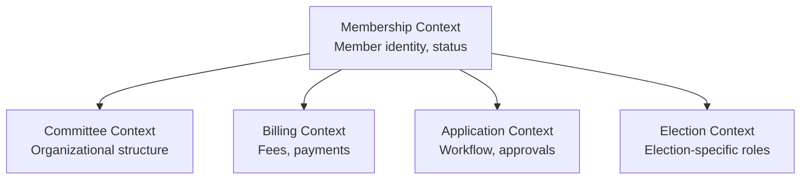
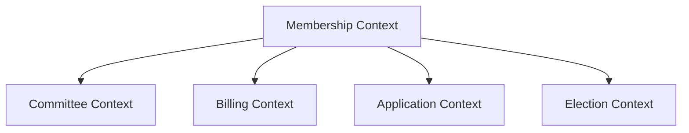
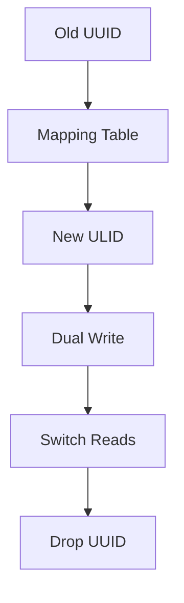
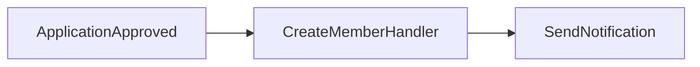
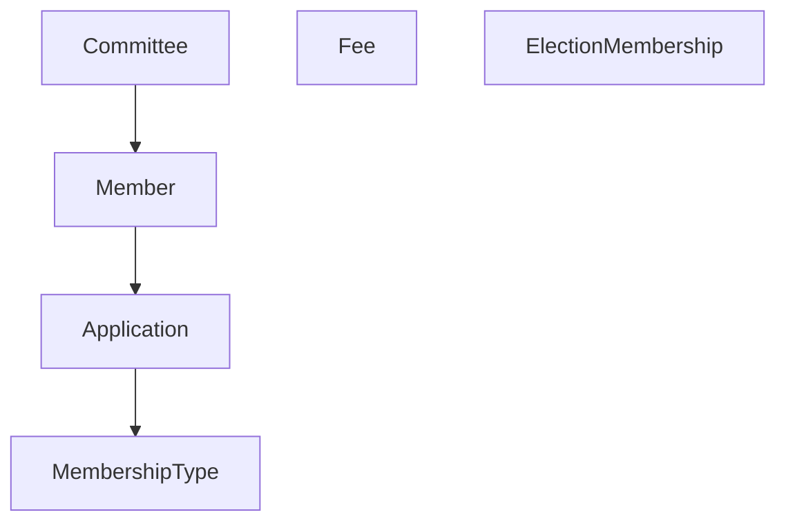

## Membership Context — Target Architecture After Refactor

After moving legacy membership code into the DDD context, this will be the complete structure.

---

## Current vs Target

| Aspect | Current (Legacy + Context) | Target (Unified DDD Context) |
|--------|---------------------------|------------------------------|
| **Members table** | Legacy (UUID) + context columns | Unified (ULID) with migration |
| **Membership types** | Legacy table | Domain entity |
| **Membership fees** | Legacy table | Domain entity |
| **Membership applications** | Legacy table | Domain entity |
| **Election memberships** | Legacy table | Domain entity |
| **Committees** | DDD context | DDD context |
| **Office bearers** | DDD context | DDD context |

---

## Target Folder Structure

```
app/Contexts/Membership/
├── Domain/
│   ├── Member/
│   │   ├── Member.php (Aggregate Root)
│   │   ├── MemberId.php (ULID)
│   │   ├── MemberStatus.php (active, inactive, suspended, archived)
│   │   └── Events/
│   │       ├── MemberRegistered.php
│   │       ├── MemberActivated.php
│   │       └── MemberSuspended.php
│   │
│   ├── Committee/ (EXISTING)
│   │   ├── Committee.php
│   │   ├── CommitteeId.php
│   │   ├── CommitteeType.php
│   │   ├── CommitteeStatus.php
│   │   └── Events/
│   │       ├── CommitteeFormed.php
│   │       ├── CommitteeMemberAssigned.php
│   │       └── CommitteeMemberRemoved.php
│   │
│   ├── MembershipType/
│   │   ├── MembershipType.php
│   │   ├── MembershipTypeId.php
│   │   ├── FeeStructure.php (Value Object)
│   │   └── Duration.php (Value Object)
│   │
│   ├── MembershipApplication/
│   │   ├── Application.php
│   │   ├── ApplicationId.php
│   │   ├── ApplicationStatus.php
│   │   └── Events/
│   │       ├── ApplicationSubmitted.php
│   │       ├── ApplicationApproved.php
│   │       └── ApplicationRejected.php
│   │
│   ├── MembershipFee/
│   │   ├── Fee.php
│   │   ├── FeeId.php
│   │   ├── FeeStatus.php
│   │   └── Events/
│   │       ├── FeePaid.php
│   │       └── FeeOverdue.php
│   │
│   ├── ElectionMembership/
│   │   ├── ElectionMembership.php
│   │   ├── ElectionRole.php (voter, candidate, observer, admin)
│   │   └── Events/
│   │       └── ElectionMembershipGranted.php
│   │
│   └── Shared/
│       ├── ValueObjects/
│       │   ├── Email.php
│       │   ├── PhoneNumber.php
│       │   ├── Address.php
│       │   └── PersonalInfo.php (JSON)
│       └── Repositories/
│           ├── MemberRepositoryInterface.php
│           ├── CommitteeRepositoryInterface.php (EXISTING)
│           └── MembershipTypeRepositoryInterface.php
│
├── Application/
│   ├── Member/
│   │   ├── RegisterMember.php (Use Case)
│   │   ├── ActivateMember.php
│   │   ├── SuspendMember.php
│   │   └── DTOs/
│   │       ├── RegisterMemberCommand.php
│   │       └── MemberDTO.php
│   │
│   ├── Committee/ (EXISTING + NEW)
│   │   ├── CreateCommittee.php
│   │   ├── UpdateCommittee.php
│   │   ├── AssignMemberToCommittee.php
│   │   ├── RemoveMemberFromCommittee.php
│   │   ├── GetCommitteeDashboard.php
│   │   └── DTOs/
│   │       ├── CreateCommitteeCommand.php
│   │       └── CommitteeDashboardView.php
│   │
│   ├── MembershipType/
│   │   ├── CreateMembershipType.php
│   │   ├── UpdateMembershipType.php
│   │   └── DTOs/
│   │       └── MembershipTypeDTO.php
│   │
│   └── MembershipApplication/
│       ├── SubmitApplication.php
│       ├── ApproveApplication.php
│       └── DTOs/
│           └── ApplicationDTO.php
│
├── Infrastructure/
│   ├── Models/
│   │   ├── MemberModel.php (Eloquent)
│   │   ├── CommitteeModel.php (EXISTING)
│   │   ├── MembershipTypeModel.php
│   │   ├── MembershipApplicationModel.php
│   │   ├── MembershipFeeModel.php
│   │   └── ElectionMembershipModel.php
│   │
│   ├── Repositories/
│   │   ├── EloquentMemberRepository.php
│   │   ├── EloquentCommitteeRepository.php (EXISTING)
│   │   ├── EloquentMembershipTypeRepository.php
│   │   └── EloquentApplicationRepository.php
│   │
│   ├── Database/
│   │   └── Migrations/
│   │       ├── Tenant/
│   │       │   ├── 2026_01_02_140853_create_members_table.php (REFACTORED)
│   │       │   ├── 2026_01_16_000002_create_committees_table.php (EXISTING)
│   │       │   ├── 2026_01_16_000003_create_committee_assignments_table.php (EXISTING)
│   │       │   ├── 2026_XX_XX_XXXXXX_create_membership_types_table.php (NEW)
│   │       │   ├── 2026_XX_XX_XXXXXX_create_membership_applications_table.php (NEW)
│   │       │   ├── 2026_XX_XX_XXXXXX_create_membership_fees_table.php (NEW)
│   │       │   └── 2026_XX_XX_XXXXXX_create_election_memberships_table.php (NEW)
│   │       └── Seeders/
│   │           └── MembershipDataSeeder.php
│   │
│   └── Providers/
│       └── MembershipServiceProvider.php (UPDATED)
│
└── Http/
    ├── Controllers/
    │   ├── MemberController.php
    │   ├── CommitteeController.php (EXISTING)
    │   ├── MembershipTypeController.php
    │   └── ApplicationController.php
    │
    └── Routes/
        ├── member.php
        ├── committee.php (EXISTING)
        ├── membership_type.php
        └── application.php
```

---

## Database Schema After Refactor

### Members Table (Unified)

```sql
CREATE TABLE members (
    id VARCHAR(26) PRIMARY KEY,           -- ULID (changed from UUID)
    organisation_id VARCHAR(36) NOT NULL, -- Tenant
    member_id VARCHAR(50) NULL,           -- Party-defined ID
    tenant_user_id VARCHAR(26) NOT NULL,  -- Link to user
    
    -- Personal info (JSON)
    personal_info JSON NOT NULL,          -- {full_name, email, phone}
    
    -- Membership
    membership_type_id VARCHAR(26) NULL,  -- FK to membership_types
    status VARCHAR(20) DEFAULT 'active',
    joined_at DATE NOT NULL,
    
    -- Geography (optional)
    residence_geo_reference VARCHAR(255) NULL,
    residence_geo_cache JSONB NULL,
    
    -- Audit
    created_at TIMESTAMP,
    updated_at TIMESTAMP,
    deleted_at TIMESTAMP NULL,
    
    -- Indexes
    INDEX idx_organisation_status (organisation_id, status),
    INDEX idx_member_id (organisation_id, member_id)
);
```

### Migration Strategy

| Phase | Action |
|-------|--------|
| **Phase 1** | Add new columns to existing members table (id remains UUID) |
| **Phase 2** | Create new tables (membership_types, applications, fees) |
| **Phase 3** | Dual-write to both old and new structure |
| **Phase 4** | Migrate data from UUID to ULID with mapping table |
| **Phase 5** | Switch to new members table, drop legacy |

---

## Key Design Decisions

| Decision | Rationale |
|----------|-----------|
| **Keep ULID for all new IDs** | Temporal ordering, sortable, URL-friendly |
| **Membership types as aggregate** | Independent lifecycle, versionable fee structures |
| **Applications as aggregate** | Workflow state machine (draft → submitted → approved/rejected) |
| **Fees as separate aggregate** | Payment tracking independent of membership |
| **Election memberships as aggregate** | Election-specific roles, not general membership |

---

## Tell Claude

```text
Claude, here is the target architecture for the complete Membership Context refactor.

Current status:
- Committee sub-context is complete (Phase 2)
- Legacy membership tables (membership_types, fees, applications, election_memberships) exist

Refactor plan:
1. Do NOT touch legacy tables yet
2. Phase 3 first (committee UI features)
3. Then design migration strategy for membership tables

Proceed with Phase 3. 🚀
```
## ChatGPT Analysis — Critical Review of Target Architecture

### Overall Assessment: ✅ Excellent — This Is High-Quality, Actionable Feedback

ChatGPT correctly identifies **real risks** in the target architecture that would cause problems at scale.

---

## What ChatGPT Gets Right ✅

| Issue | Severity | Why It Matters |
|-------|----------|----------------|
| **"One context to rule them all"** | 🔴 High | Membership, Committees, Fees, Applications, Election — different subdomains |
| **Member aggregate will become too big** | 🔴 High | Loading everything becomes impossible |
| **ULID migration underspecified** | 🔴 High | FK breakage, data inconsistency, downtime |
| **Missing anti-corruption layer** | 🟡 Medium | Tight coupling between aggregates |
| **Personal info JSON schema risk** | 🟡 Medium | No validation, hard to query |
| **Missing cross-aggregate orchestration** | 🟡 Medium | Approve Application → Create Member not modeled |
| **Missing domain policies** | 🟡 Medium | Who can approve applications? |
| **Missing event-driven integration** | 🟡 Medium | Events defined but not handled |
| **No read model separation** | 🟢 Low | Query layer needed |

---

## The Core Problem: Bounded Context Boundaries

| Current Plan | Better Approach |
|--------------|-----------------|
| One giant Membership Context | Separate contexts: Membership, Committee, Billing, Application, Election |

**Principle:** Different subdomains evolve at different speeds. Fees change frequently; Member identity changes rarely.

---

## Revised Context Boundaries



---

## Critical Fixes Needed Before Implementation

| Priority | Fix |
|----------|-----|
| 🔴 P0 | **Define clear aggregate boundaries** — Member should NOT own fees, applications, election roles |
| 🔴 P0 | **ULID migration with mapping table** — Not just "Phase 4" |
| 🔴 P0 | **Feature flags** for gradual rollout |
| 🟡 P1 | **Personal info as JSONB + extracted columns** |
| 🟡 P1 | **Event handling flow** — not just event definitions |
| 🟡 P1 | **Read model separation** — Query layer |
| 🟢 P2 | **Architecture tests** — enforce boundaries |

---

## Revised Migration Strategy

| Phase | Action | Risk |
|-------|--------|------|
| Phase 1 | Add new columns to legacy members | Low |
| Phase 2 | Create new tables (membership_types, fees, applications) | Medium |
| Phase 3 | **Dual write** + feature flags | Medium |
| Phase 4 | **Mapping table** for UUID → ULID | High |
| Phase 5 | Switch reads gradually | Medium |
| Phase 6 | Remove legacy columns | Low |

---

## Simplified Aggregate Design

| Aggregate | Owns | Does NOT Own |
|-----------|------|--------------|
| **Member** | id, personal info, status | fees, applications, committee roles |
| **Committee** | structure, members, office bearers | member billing |
| **MembershipType** | fee structure, duration rules | member instances |
| **Application** | workflow, approval status | payment |
| **Fee** | payment records, due dates | member identity |

---

## What to Tell Claude

```text
Claude, ChatGPT's analysis is excellent. The target architecture needs refinement before implementation.

Critical fixes required:

1. **Keep contexts separate** — Membership, Committee, Billing, Application, Election
2. **Member aggregate must stay lean** — Delegate fees to Billing, applications to Application
3. **ULID migration plan** — Use mapping table, not direct conversion
4. **Feature flags** for gradual rollout
5. **Anti-corruption layer** between contexts
6. **Event handling flow** — not just definitions

Do NOT proceed with the current unified Membership Context plan.

Let's refine the architecture first. 🚀
```
chatgpt's plan: 
Short answer: **it’s a strong strategic direction, but not yet a safe execution plan**.
You’re very close to a production-grade DDD context—but a few decisions will create **migration risk, aggregate bloat, and boundary violations** if left as-is.

I’ll walk you through this like an architecture review.

---

# 🧠 1. High-Level Evaluation

## ✅ What is solid

* Clear **bounded context: Membership**
* Good separation: **Domain / Application / Infrastructure**
* Correct use of:

  * Aggregates
  * Value Objects
  * Domain Events
* Migration strategy acknowledges **legacy coexistence** (very important)
* Introduction of **ULID** is forward-looking

👉 This is **senior-level structure** already.

---

# 🔥 2. Critical Architectural Issues (Must Fix)

## 2.1 ❗ “One Context to Rule Them All” → Risk of God Context

You are putting everything into:

```
Membership Context
├── Member
├── Committee
├── MembershipType
├── Fees
├── Applications
├── ElectionMembership
```

👉 This is **too much responsibility for one bounded context**.

---

## Why this is dangerous

You are mixing **different subdomains**:

| Subdomain          | Nature                   |
| ------------------ | ------------------------ |
| Member             | Core identity            |
| Committee          | Organizational structure |
| Fees               | Financial                |
| Applications       | Workflow                 |
| ElectionMembership | Election domain          |

👉 These evolve at different speeds.

---

## ✅ Better Model (DDD-aligned)



---

## Recommendation

At minimum:

* Keep **Membership Context**
* Extract later:

  * `Billing` (fees)
  * `Election`
  * `Application`

👉 For now: OK to keep together, but design with **future split in mind**

---

## 2.2 ❗ Member Aggregate Will Become Too Big

```php
Member (Aggregate Root)
```

With:

* personal info
* membership type
* fees
* applications
* committees
* election roles

👉 This will become a **God Aggregate**

---

## Problem

* Hard to load
* Hard to scale
* Violates aggregate rules

---

## ✅ Fix

Keep Member **lean**:

```php
Member
- id
- personal info
- status
- tenant
```

Everything else:

| Concern         | Where                        |
| --------------- | ---------------------------- |
| MembershipType  | separate aggregate           |
| Fees            | separate aggregate           |
| Applications    | separate aggregate           |
| Committee roles | Committee aggregate          |
| Election roles  | ElectionMembership aggregate |

👉 Member should NOT control everything.

---

## 2.3 ❗ ULID Migration Strategy is Underspecified

You wrote:

> Phase 4: Migrate UUID → ULID

👉 This is **not trivial**.

---

## Risks

* FK breakage
* data inconsistency
* downtime

---

## ✅ Required Pattern

Use **mapping table**:

```sql
member_id_mapping (
    uuid CHAR(36),
    ulid CHAR(26)
)
```

---

## Migration Flow



---

## 2.4 ❗ Missing Anti-Corruption Layer (Again)

You still assume:

```php
membership_type_id → direct FK
```

👉 This tightly couples aggregates.

---

## ✅ Better

Use:

```php
MembershipTypeId (Value Object)
```

And resolve via repository.

---

## 2.5 ❗ Personal Info JSON → Hidden Schema Risk

```sql
personal_info JSON
```

---

## Problem

* No validation at DB level
* Hard to query
* Hard to index

---

## ✅ Better Hybrid Model

```sql
personal_info JSONB
+ extracted columns:
- email
- phone
```

---

# ⚠️ 3. Structural Weaknesses

## 3.1 Application Layer Missing Cross-Aggregate Orchestration

Example:

> Approve Application → Create Member → Assign MembershipType

👉 This is **not modeled yet**

---

## You need:

```php
ApproveApplicationUseCase
```

that coordinates:

* Application aggregate
* Member aggregate
* MembershipType

---

## 3.2 Missing Domain Policies (Important)

You mention roles but not:

* who can approve applications?
* who can assign roles?

👉 This belongs to:

```php
Policy / Specification pattern
```

---

## 3.3 Missing Event-Driven Integration

You defined events but not:

* where they go
* how they are handled

---

## Required:



---

## 3.4 No Read Model Separation

Dashboard:

```php
CommitteeDashboardView
```

👉 Good—but not enough.

---

## Better

Introduce:

* Query layer (read models)
* Possibly projections

---

# ✅ 4. What is Very Good (Keep It)

### ✔ Folder structure

Clean and scalable

### ✔ Use cases per feature

Aligned with DDD

### ✔ Domain events

Correct approach

### ✔ Migration phases

You are thinking in production terms

---

# 🚀 5. Improved Version (Refined Plan)

## 5.1 Context Refinement

Keep:

```
Membership Context
```

But internally structure as:

```
Membership/
├── Core (Member)
├── Committee
├── Application
├── Billing (Fees)
├── Election (bridge only)
```

---

## 5.2 Aggregate Boundaries



---

## 5.3 Migration Strategy (Improved)

| Phase   | Improvement                |
| ------- | -------------------------- |
| Phase 1 | Add columns (✔ good)       |
| Phase 2 | Add new tables             |
| Phase 3 | Dual write + feature flags |
| Phase 4 | Introduce mapping table    |
| Phase 5 | Switch reads gradually     |
| Phase 6 | Remove legacy              |

---

## 5.4 Add Feature Flags

Critical for safe rollout:

```php
if (Feature::enabled('new_membership')) {
   // new logic
} else {
   // legacy
}
```

---

## 5.5 Add Architecture Tests

Examples:

```php
test_member_does_not_depend_on_fee()
test_application_cannot_access_infrastructure()
```

---

# 🧭 6. Final Verdict

## Is it a good plan?

👉 **Yes — strategically strong**
👉 **No — not yet safe for execution without refinement**

---

## Maturity Assessment

| Area               | Level |
| ------------------ | ----- |
| DDD Structure      | ⭐⭐⭐⭐⭐ |
| Migration Strategy | ⭐⭐⭐⭐  |
| Context Boundaries | ⭐⭐⭐   |
| Scalability        | ⭐⭐⭐   |
| Risk Management    | ⭐⭐⭐   |

---

# 🧠 Final Architectural Advice

> “Don’t optimize for structure alone—optimize for change.”

Right now:

* Structure = strong
* Changeability = not fully safe yet

---

# 🔥 What I Recommend You Do Next

Before coding:

1. ✅ Define **aggregate boundaries clearly**
2. ✅ Introduce **MemberGateway / Anti-corruption**
3. ✅ Fix **ULID migration with mapping**
4. ✅ Add **TenantContext properly (explicit)**
5. ✅ Plan **event handling flow**

---

If you want, next I can:

* Design **complete migration scripts (UUID → ULID safe version)**
* Model **ApproveApplication orchestration (DDD correct)**
* Define **aggregate invariants for each entity**
* Create **architecture test suite**

Just tell me where to go deeper.
