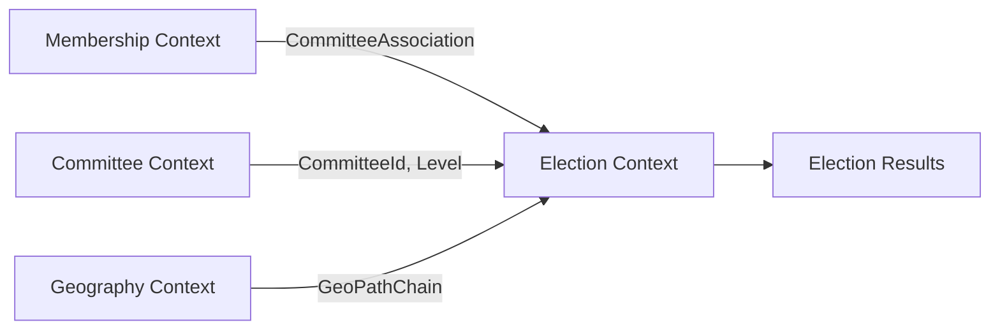
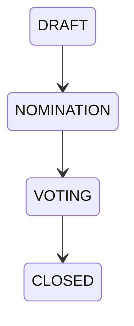
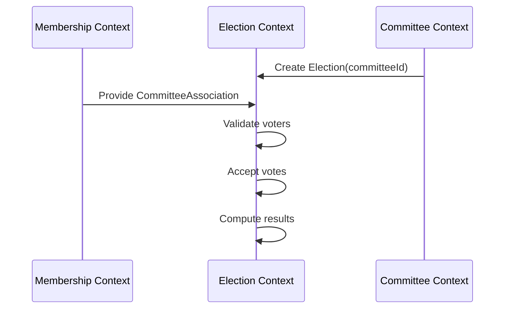

This is the right conceptual alignment — but there is one important architectural correction before you extend it further.

---

# 🧠 1. Core Correction: You are mixing two bounded contexts

Right now you are implicitly merging:

```
Membership Context
    + Committee Context
        + Election Context
```

The voting rule you described belongs to **Election domain**, not Membership.

---

## Why this matters

If you embed:

```php
CommitteeAssociation::exists(...)
```

directly inside voting logic, you create:

* tight coupling between Election → Membership persistence model
* hidden dependency on membership schema
* future migration pain (very likely in governance systems)

---

# 🧩 2. Correct Domain Relationship

You actually have this structure:

```
MEMBERSHIP CONTEXT
    CommitteeApplication
    CommitteeAssociation   ← authority source

ELECTION CONTEXT
    Vote
    Election
    VotingEligibilityPolicy  ← consumer of membership state
```

---

# 🧠 3. Proper Design: Introduce a Port

Instead of querying `CommitteeAssociation` directly in voting logic:

## Define a port in Election context:

```php
interface VotingEligibilityPort
{
    public function isEligibleToVote(
        MemberId $memberId,
        CommitteeId $committeeId
    ): bool;
}
```

---

## Infrastructure adapter (Membership context):

```php
final class CommitteeAssociationVotingAdapter implements VotingEligibilityPort
{
    public function isEligibleToVote(MemberId $memberId, CommitteeId $committeeId): bool
    {
        return CommitteeAssociation::query()
            ->where('member_id', $memberId->value())
            ->where('committee_id', $committeeId->value())
            ->where('status', MembershipStatus::ACTIVE)
            ->exists();
    }
}
```

---

## Election domain usage:

```php
if (!$votingEligibility->isEligibleToVote($voterId, $committeeId)) {
    throw new NotEligibleToVote();
}
```

---

# 🧠 4. What This Gives You (Important)

## You gain:

### ✔ Clean DDD boundaries

Election doesn’t know membership schema

### ✔ Replaceable rules

You can later change:

* geo-based voting
* weighted voting
* proxy voting
* eligibility windows

without touching membership

### ✔ Policy-driven governance evolution

This is critical for your system (you are building governance engine, not CRUD)

---

# 🧠 5. Important Insight: Association ≠ Voting Rights

You currently assume:

```
CommitteeAssociation = voting eligibility
```

But in governance systems this often evolves into:

| Concept            | Meaning                                       |
| ------------------ | --------------------------------------------- |
| Association        | administrative/structural membership          |
| Voting Eligibility | temporal + rule-based permission              |
| Voting Rights      | may depend on role, tenure, or election cycle |

---

## Future-proof model (important)

You will likely need:

```
CommitteeAssociation (base membership)
    ↓
VotingEligibilityPolicy (rule engine)
    ↓
VotingRightSnapshot (cached projection)
```

---

# 🧠 6. Should this be Phase 4?

## Answer: ❌ Not yet as part of Membership Application system

Because:

* Membership system ends at **Association creation**
* Election system consumes that state

---

## Correct layering:

### Phase 4 (Membership system)

```
✔ Application approval
✔ CommitteeAssociation creation
✔ membership lifecycle
```

### Separate Phase (Election system)

```
✔ VotingEligibilityPort
✔ VoteController integration
✔ Election rules
```

---

# 🧠 7. Where your thinking is already strong

You correctly identified:

* association is the gate
* eligibility is required before voting
* committee context drives election rights

That is exactly the right abstraction direction.

---

# 🧠 Final Recommendation

## Do this:

### 1. Keep Membership system focused:

> “Who is a member of what committee?”

### 2. Keep Election system focused:

> “Who is allowed to vote right now?”

### 3. Connect them via a port (NOT direct DB access)

---

# 🚀 Verdict

✔ Direction is correct
⚠ But coupling Election → Membership must be avoided
✔ Introduce VotingEligibilityPort as boundary
❌ Do NOT extend Membership system into voting logic

---

If you want next step, I can design:

* full **Election bounded context model (DDD)**
* voting eligibility policy engine (geo + role + tenure)
* or integration sequence diagram between Membership ↔ Election

This is where your system becomes truly “governance-grade.”
Below is a **clean DDD bounded context model for Elections** aligned with your existing architecture (Committees, Membership, Geo hierarchy, CommitteeAssociation, and eligibility rules).

This is designed to plug directly into your current system without breaking your governance matrix model.

---

# 🗳️ Election Bounded Context (DDD Model)

## 1. 🧭 Bounded Context Purpose

The **Election Context** is responsible for:

* Running elections inside a committee
* Managing candidates and nominations
* Enforcing voter eligibility
* Collecting and counting votes
* Producing election results (officers / mandates)

It does **NOT** manage:

* Membership creation (Membership Context)
* Committee structure (Committee Context)
* Geo rules (Geography Context)

It only **consumes decisions** from those contexts.

---

# 2. 🧩 Context Map (Integration View)



---

# 3. 🧱 Core Aggregates

## 3.1 Election (Aggregate Root)

Represents a single election cycle within a committee.

### Responsibility

* Define election scope
* Manage lifecycle
* Hold candidates
* Trigger voting phase

### Structure

```php
Election
├── ElectionId
├── CommitteeId
├── ElectionType (LOCAL | REGIONAL | NATIONAL | CENTRAL)
├── Status (DRAFT | NOMINATION | VOTING | CLOSED)
├── StartAt / EndAt
├── Positions[]
└── Candidates[]
```

---

### Lifecycle



---

## 3.2 Candidate (Entity inside Election)

```php
Candidate
├── CandidateId
├── MemberId
├── PositionId
├── NominatedAt
├── IsValid
```

---

## 3.3 Vote (Entity or Value Object depending scale)

```php
Vote
├── VoteId
├── ElectionId
├── VoterId (MemberId)
├── CandidateId
├── CastAt
```

---

## 3.4 ElectionResult (Domain Projection / Value Object)

```php
ElectionResult
├── ElectionId
├── Winners[]
├── VoteCounts[]
└── GeneratedAt
```

---

# 4. 🧠 Domain Rules (Core Invariants)

## Rule 1 — Voting eligibility (CRITICAL)

```text
Member can vote ONLY IF:
CommitteeAssociation exists AND status = ACTIVE
AND committee matches election committee
```

```php
CommitteeAssociationRepository::exists(
    memberId,
    committeeId,
    status = ACTIVE
)
```

---

## Rule 2 — Candidacy eligibility

A member can become candidate if:

* Has ACTIVE CommitteeAssociation
* OR is explicitly nominated (exception rule)
* Must belong to same committee OR parent committee (configurable)

---

## Rule 3 — One vote per election per member

```text
UNIQUE(memberId, electionId)
```

---

## Rule 4 — Election scope is committee-bound

```text
Election belongs to exactly ONE committee
```

No cross-committee elections.

---

## Rule 5 — Geo hierarchy restriction (important in your system)

```text
Election inherits committee GeoPathChain
BUT does NOT compute geo logic itself
```

It only consumes:

* Committee.geoPathChain
* MembershipContext decisions

---

# 5. 🧭 Domain Services

## 5.1 VoteEligibilityService

```php
class VoteEligibilityService
{
    public function canVote(MemberId $memberId, Election $election): bool;
}
```

Internally depends on:

* CommitteeAssociationRepository
* Membership status
* Election committee

---

## 5.2 CandidateSelectionPolicy

```php
class CandidateSelectionPolicy
{
    public function canStand(MemberId $memberId, Election $election): bool;
}
```

---

## 5.3 ElectionResultCalculator

Pure domain service:

```php
class ElectionResultCalculator
{
    public function calculate(Election $election): ElectionResult;
}
```

---

# 6. 📦 Value Objects

## ElectionId

* ULID

## ElectionType

```php
enum ElectionType: string
{
    case LOCAL = 'local';
    case REGIONAL = 'regional';
    case NATIONAL = 'national';
    case CENTRAL = 'central';
}
```

---

## ElectionStatus

```php
enum ElectionStatus: string
{
    case DRAFT = 'draft';
    case NOMINATION = 'nomination';
    case VOTING = 'voting';
    case CLOSED = 'closed';
}
```

---

## PositionId

Represents role inside committee:

* Chairperson
* Secretary
* Treasurer

---

# 7. 🧩 Aggregates Interaction

## Key Flow



---

# 8. 🔐 Critical Integration Point (Your System)

Your system already has:

### ✔ CommitteeAssociation

This becomes:

> 🔑 PRIMARY voter eligibility source

---

### ✔ GeoPathChain

Used ONLY for:

* eligibility validation at membership time
* NOT in election logic

---

# 9. 🧠 Bounded Context Boundaries (Important)

| Context    | Responsibility         |
| ---------- | ---------------------- |
| Membership | who belongs where      |
| Committee  | structure + governance |
| Geography  | hierarchy + geo paths  |
| Election   | voting + results       |

👉 Election must NEVER:

* compute geo hierarchy
* decide membership
* modify committees

---

# 10. 🧪 Suggested Aggregate Root Design

## Election Aggregate Root responsibilities

```php
class Election
{
    public function openNomination(): void;
    public function startVoting(): void;
    public function castVote(Vote $vote): void;
    public function close(): void;
}
```

Enforces:

* status transitions
* voting rules
* invariants

---

# 11. 🚀 Key Design Insight (Very Important in your system)

Your **CommitteeAssociation becomes the pivot table of democracy**

```
MembershipApplication → CommitteeAssociation → Election participation
```

So your full governance chain becomes:

```text
Geo Unit → Committee → Membership → Association → Election → Vote → Result
```

---

# If you want next step

I can help you design:

### 🔥 Option A

Election Aggregate + TDD test suite (like your membership system)

### 🔥 Option B

Vote casting domain model (with anti-fraud + uniqueness rules)

### 🔥 Option C

Full integration: CommitteeEligibility + ElectionEligibility unified policy layer

Just tell me which direction you want.
