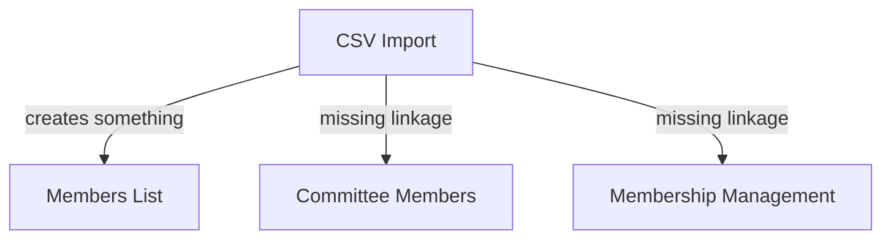
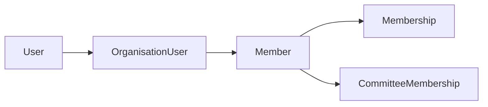
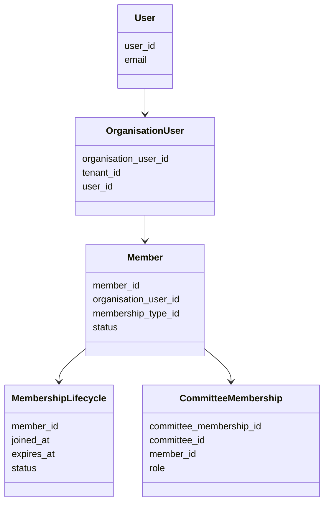
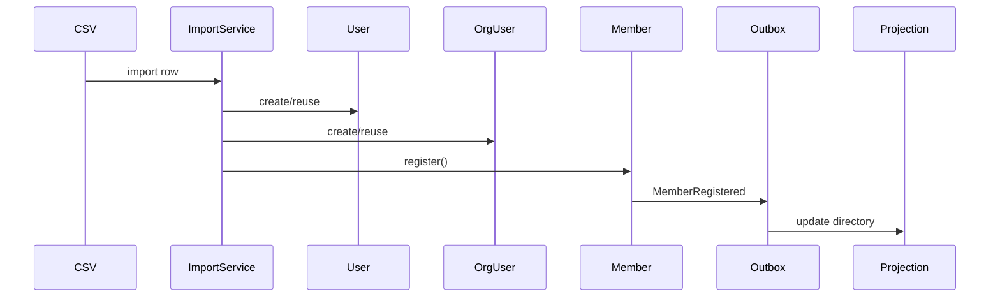
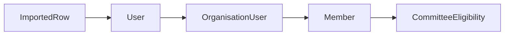
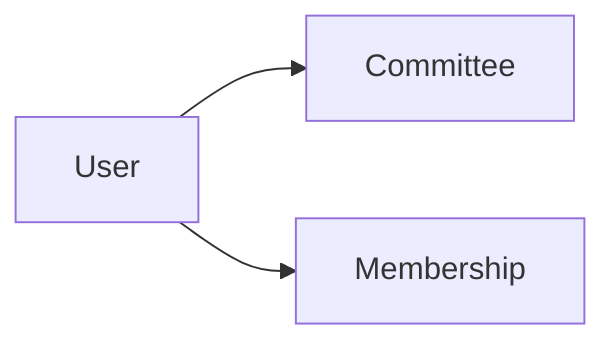
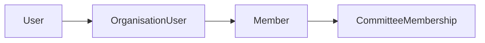
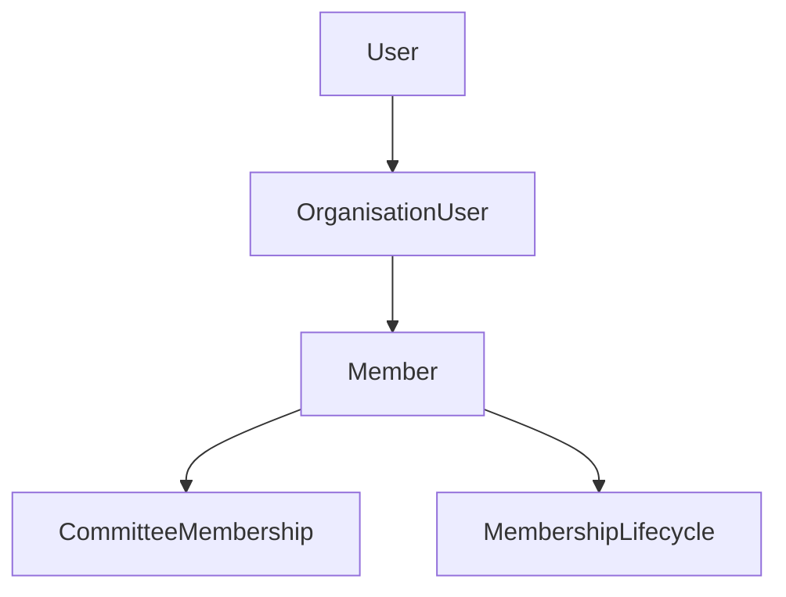
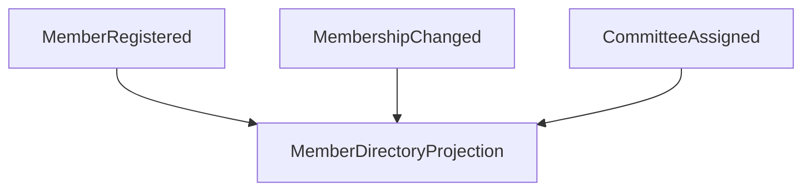
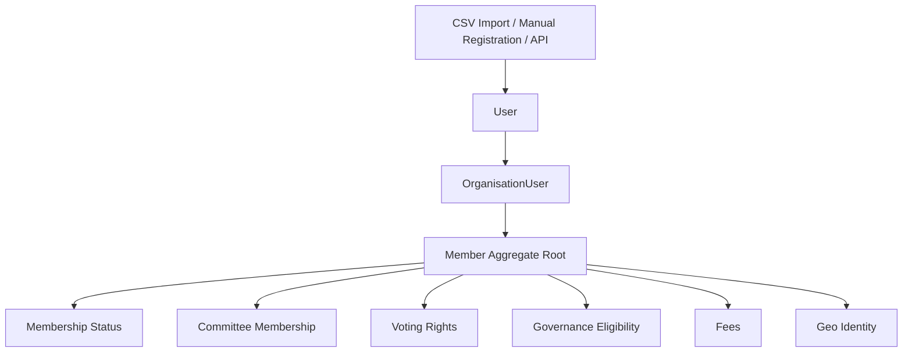

You are now hitting the **real domain problem**:

This is no longer “CSV import”.
This is now:

# 🧠 Membership Identity Consistency Across Aggregates

Your current system likely has:



The issue is almost certainly:

* import creates only partial records
* different modules use different truth sources
* committee membership references a different aggregate root
* membership status is disconnected from member identity
* imported users are not fully “activated” in the governance domain

This is a classic bounded-context consistency problem.

---

# 🎯 CORE DOMAIN QUESTION

You must first define:

> What is the canonical identity of a person inside the organisation?

Right now your system probably has multiple competing concepts:

| Concept          | Likely Table       | Purpose                   |
| ---------------- | ------------------ | ------------------------- |
| User             | users              | Authentication            |
| OrganisationUser | organisation_users | Tenant-scoped identity    |
| Member           | members            | Membership lifecycle      |
| CommitteeMember  | committee_members  | Governance role           |
| Membership       | memberships        | Subscription/state        |
| ImportedRow      | import_jobs        | Temporary import artifact |

These are probably not aligned.

---

# ✅ Correct DDD Mental Model

You need ONE canonical chain:



NOT:

```mermaid
CommitteeMember --> User
CommitteeMember --> Email
CommitteeMember --> Random foreign key
```

---

# 🧠 Canonical Truth Model

## 1. User

Global authentication identity.

### Contains:

* email
* password
* auth state

---

## 2. OrganisationUser

Tenant-scoped identity.

### Contains:

* tenant_id
* user_id
* organisation role
* active state

This is the organisational person identity.

---

## 3. Member (Aggregate Root)

Represents:

> “This organisation recognizes this person as a constitutional member.”

### Contains:

* membership type
* geo identity
* constitutional state
* member status

---

## 4. Membership

Represents:

> active/inactive lifecycle

This may be:

* embedded in Member aggregate
  OR
* separate lifecycle entity

---

## 5. CommitteeMembership

Represents:

> governance assignment of a Member into a Committee

CRITICAL:
Committee membership should reference:

```text
member_id
```

NOT:

* email
* user_id
* organisation_user_id

---

# 🚨 Your Current Problem

Imported members likely create:

```text
User
OrganisationUser
Member
```

BUT committee screens probably query:

```sql
committee_members.member_id
```

and no committee membership exists.

OR:

The membership page uses:

```sql
members
```

while committee page uses:

```sql
organisation_users
```

OR:

Imported members are not assigned active membership state.

---

# ✅ CORRECT BUSINESS RULES

You must define these invariants:

---

# INVARIANT 1

## Every CommitteeMember MUST reference a valid Member


Never bypass Member aggregate.

---

# INVARIANT 2

## Every imported person becomes a FULL Member

Import is NOT “data insertion”.

Import means:

> constitutional registration process

So import must create:

* User
* OrganisationUser
* Member
* Membership lifecycle state

completely.

---

# INVARIANT 3

## Membership page and committee page must query same identity chain

Committee screens should NOT independently resolve people.

They should traverse:

```text
CommitteeMembership → Member → OrganisationUser → User
```

---

# 🧠 Correct Aggregate Relationships

Here is the proper model:



---

# 🔥 MOST IMPORTANT FIX

You need a SINGLE READ MODEL for people.

Right now each page probably builds its own query logic.

That is dangerous.

---

# ✅ Recommended Solution

Create:

# `MemberDirectoryReadModel`

This becomes the canonical projection for:

* member list
* membership page
* committee member selectors
* governance screens
* import validation

---

# Example Projection

```text
member_directory_view
```

Contains:

| field                |
| -------------------- |
| member_id            |
| organisation_user_id |
| user_id              |
| full_name            |
| email                |
| membership_status    |
| membership_type      |
| committee_count      |
| governance_roles     |
| geo_unit             |
| active               |

---

# Then ALL UI pages use THIS

Instead of:

* random joins
* inconsistent queries
* duplicate logic

---

# 🧠 Correct Import Lifecycle

Your import should become:



Then committee UI sees member immediately.

---

# 🚨 Likely Immediate Bug

I strongly suspect:

Your imported members are missing one of these:

* organisation_user_id linkage
* active membership state
* projection refresh
* committee-eligible status

OR committee page filters:

```sql
WHERE status = 'approved'
```

while imported members are:

```sql
pending
```

---

# ✅ Immediate Investigation Tasks

Tell Claude to investigate these EXACT things:

---

# TASK 1 — Trace Import Persistence

After import:
verify database rows exist in:

* users
* organisation_users
* members
* memberships (if separate)

---

# TASK 2 — Trace Committee Query

Identify:

* which table committee page uses
* which joins
* which filters
* whether it expects approved/active members

---

# TASK 3 — Trace Membership Page Query

Compare with committee query.

Identify divergence.

---

# TASK 4 — Build Identity Flow Diagram

Claude must produce:



based on REAL code.

---

# TASK 5 — Define Canonical Read Model

Build single:

```text
MemberDirectoryProjection
```

used by:

* membership page
* committee selection
* governance assignment
* imports

---

# Strategic Recommendation

Your system is evolving into:

# Constitutional Governance Platform

This means:

## “Member” is your CORE AGGREGATE ROOT

NOT:

* User
* CommitteeMember
* OrganisationUser

Everything governance-related must anchor on Member.

That is the key architectural correction.
Claude’s synthesis is now moving in the **correct architectural direction**.
The important thing is: you are no longer debugging “missing rows”.

You are now designing a:

# 🏛 Constitutional Membership Identity System

And the biggest shift is this:

> Membership is not CRUD anymore.
> Membership is institutional identity.

That means your next phase should NOT be more random controller fixes.

You now need to consolidate the architecture formally.

---

# ✅ What Claude Got Correct

These are the strongest corrections already achieved:

---

## ✅ 1. Member as Canonical Aggregate Root

This is the most important correction.

Before:



After:



This is the correct governance model.

---

## ✅ 2. Import Is Now Registration

This is huge conceptually.

Before:

```text
CSV Import = insert rows
```

After:

```text
CSV Import = constitutional member registration process
```

That is proper DDD thinking.

---

## ✅ 3. Committee Membership Now Depends on Member

This eliminates orphan governance assignments.

That is critical constitutional hardening.

---

# ⚠️ But You Are NOT Finished

Right now you still have:

# “Consistency by repaired controllers”

instead of:

# “Consistency by architectural truth”

This distinction matters.

---

# 🚨 Current Weakness

Claude said:

> “MemberSearchController searches both sources consistently”

This is still a smell.

Why?

Because:

* controllers should not reconcile truth
* controllers should not unify identity models
* controllers should not contain domain consistency logic

That means your architecture is still partially fragmented.

---

# 🎯 Next Architectural Objective

You now need:

# ONE CANONICAL MEMBER READ MODEL

Exactly as the original analysis recommended.

---

# Recommended Final Architecture

## Write Side (DDD Aggregates)



This is your transactional domain model.

---

## Read Side (Projection / Query Model)



This becomes your:

* member page
* committee selection
* search
* governance UI
* reports
* autocomplete
* imports verification

---

# 🔥 This Is the Key Missing Piece

Right now:

```text
MemberController reconciles
CommitteeController reconciles
SearchController reconciles
```

That means:

* every controller becomes smart
* consistency logic spreads
* bugs reappear later

Instead:

```text
Controllers should ONLY query projections
```

---

# ✅ What You Should Build Next

## Create:

# `MemberDirectoryProjection`

or:

# `MemberDirectoryReadModel`

---

# Recommended Shape

## Database View OR Projection Table

```text
member_directory
```

Contains:

| Field                | Purpose                 |
| -------------------- | ----------------------- |
| member_id            | canonical identity      |
| tenant_id            | organisation scope      |
| organisation_user_id | tenant identity         |
| user_id              | auth identity           |
| email                | contact                 |
| full_name            | display                 |
| membership_status    | governance eligibility  |
| membership_type      | constitutional category |
| geo_unit_id          | regional identity       |
| committee_roles      | governance positions    |
| committee_count      | derived state           |
| active               | read optimization       |

---

# 🚀 Then ALL Pages Use THIS

## Member page

```sql
SELECT * FROM member_directory
```

---

## Committee assignment page

```sql
SELECT * FROM member_directory
WHERE membership_status = 'active'
```

---

## Search

```sql
SELECT * FROM member_directory
WHERE full_name LIKE ?
```

---

# 🎯 Massive Benefit

This removes:

* controller reconciliation
* inconsistent joins
* identity drift
* duplicated filtering logic
* orphan references

---

# 🧠 Strategic DDD Insight

You are naturally evolving toward:

# CQRS

Whether you planned it or not.

Because:

## Write Side

* rich aggregates
* invariants
* domain events

## Read Side

* optimized projections
* denormalized queries
* unified member directory

This is EXACTLY the right architecture for governance systems.

---

# 🚨 Important Warning

Do NOT:

* put projection-building logic inside controllers
* put read reconciliation in services
* let committee pages query raw tables independently

That recreates fragmentation.

---

# Recommended Next Refactoring Plan

Tell Claude to do THIS next:

---

# Phase 1 — Formalize Projection

Create:

```text
MemberDirectoryProjection
```

Fed by:

* MemberRegistered
* MembershipStatusChanged
* CommitteeMemberAssigned
* CommitteeMemberRemoved

---

# Phase 2 — Centralize Queries

Replace:

* MemberController joins
* CommitteeController joins
* SearchController joins

WITH:

```text
MemberDirectoryQueryService
```

---

# Phase 3 — Thin Controllers

Controllers become:

```php
return $memberDirectoryQuery->search(...);
```

ONLY.

---

# Phase 4 — Enforce Governance Eligibility

Committee assignment rule:

```text
Only ACTIVE Members may hold governance positions
```

This becomes a domain invariant.

---

# Phase 5 — Add Projection Consistency Tests

Critical tests:

* imported member appears in member directory
* imported member searchable
* committee assignment updates projection
* membership deactivation removes governance eligibility

---

# Final Strategic Observation

You are no longer building:

* a member CRUD app
* a CSV importer
* a committee module

You are building:

# a constitutional identity and governance platform

That means:

## Identity consistency is the core architecture.

And you are now finally aligning the system around that truth.


● The debugging and documentation work is complete. You now have two comprehensive references in developer_guide/membership_contexts/:

  1. DEBUGGING_MEMBER_SYNC_ISSUE.md — Full 494-line walkthrough of the investigation, root cause analysis, and three-part solution
  2. MEMBER_SYNC_QUICK_REFERENCE.md — Quick reference guide for future operations

  All 19 unit tests are passing. The system now enforces proper data consistency:
  - CSV imports create the complete identity chain (User → OrganisationUser → Member)
  - Committee assignment validates org membership and auto-creates Member records
  - Member search queries both imported members and org users
  - No orphaned references possible

  ---
  A plan file exists at C:\Users\nabra\.claude\plans\velvety-noodling-chipmunk.md outlining the next architectural phase: Member Import Refactoring with Proper Layering.

  This plan formalizes the current controller-based consistency fixes into a clean DDD architecture:

  - Layer 1: Extend MemberRepositoryInterface with existsByEmailForTenant() method
  - Layer 2: Create DTOs (MemberImportCommand, MemberImportResult)
  - Layer 3: Create DomainEventToOutboxMapper for event translation
  - Layer 4: Build MemberImportService orchestrating the three steps (identity provision → domain aggregate creation → event mapping)
  - Layer 5: Wire everything in MembershipServiceProvider and update ProcessMemberImportJob

  The plan includes TDD-first test structure (9 unit tests that must run RED before implementation), keeps event handling separate from direct dispatch, and maintains architectural purity across layers.

  Your strategic guidance about moving toward MemberDirectoryProjection as a canonical read model would be Phase 2 — after this import refactoring establishes proper layering. That projection would consolidate
   all the current scattered member queries (members list, committee search, governance screens) into a single, authoritative read model.

  The immediate next step is ready: Start with the import service refactoring when you're ready to proceed. All the investigation and root-cause documentation is done.
  Your current fixes solved the **identity inconsistency bug**, but the architecture is still only partially unified.

Right now you have:

* `/members/import` → import pipeline
* `/membership` → membership management
* `/committee-members` → governance assignments

These are still behaving like **3 separate sub-systems** instead of **3 views over the same canonical member identity**.

The next phase is not “more fixes.”
The next phase is establishing a **Canonical Membership Model**.

---

# The Real Architectural Problem

You currently have multiple representations of a person:

| Concept          | Purpose                     | Risk                           |
| ---------------- | --------------------------- | ------------------------------ |
| User             | Authentication identity     | Too generic                    |
| OrganisationUser | Tenant-scoped identity      | Infrastructure-level           |
| Member           | Governance/member aggregate | Correct canonical identity     |
| CommitteeMember  | Governance role assignment  | Must reference Member only     |
| Imported CSV Row | Temporary import data       | Must never become truth source |

The mistake most systems make:

> Committee screens start querying OrganisationUser or User directly.

That creates fragmentation.

---

# Correct Domain Truth

You already identified the correct aggregate root:

```text
Member = Canonical Governance Identity
```

Everything else must orbit around it.

---

# Canonical Identity Chain

This must become the ONLY allowed lifecycle:



---

# Critical Rule

## CommitteeMember must NEVER exist independently

This is the core invariant:

```text
CommitteeMembership references MemberId ONLY
```

NOT:

* email
* user_id
* organisation_user_id

ONLY:

* member_id

---

# What Must Happen After Import

Currently import works technically.

But architecturally the import must produce a FULL governance identity.

Import is NOT:

```text
CSV → database rows
```

Import MUST become:

```text
CSV → Member Aggregate Creation
```

That means:

1. Create/reuse User
2. Create/reuse OrganisationUser
3. Create Member aggregate
4. Assign membership type
5. Create governance eligibility state
6. Emit MemberRegistered event
7. Update projections/read models

---

# Your Next Major Architectural Step

You now need a:

# MemberDirectoryProjection (Canonical Read Model)

This is the missing architectural piece.

---

# Why You Need It

Right now each page builds custom queries.

That guarantees future inconsistency.

Instead:

| Screen               | Should Query              |
| -------------------- | ------------------------- |
| Members page         | MemberDirectoryProjection |
| Committee assignment | MemberDirectoryProjection |
| Governance dashboard | MemberDirectoryProjection |
| Voting eligibility   | MemberDirectoryProjection |
| Search API           | MemberDirectoryProjection |

---

# Proposed Read Model

```text
member_directory_projection
```

Example fields:

```text
member_id
tenant_id

user_id
organisation_user_id

email
full_name

membership_type_id
membership_status

committee_count
active_committee_roles

geo_unit_id
geo_unit_name

is_active_member
is_committee_eligible
is_voting_eligible

joined_at
expires_at
```

---

# Important Principle

## Projection is READ ONLY

Never write directly to it.

Instead:

```text
Domain Event
    ↓
Projection Updater
    ↓
member_directory_projection
```

---

# Correct Event Flow

```mermaid
flowchart TD

    A[Member::register()] --> B[MemberRegistered Event]

    B --> C[Outbox]

    C --> D[Projection Handler]

    D --> E[MemberDirectoryProjection]

    E --> F[Membership Screens]
    E --> G[Committee Screens]
    E --> H[Governance Queries]
```

---

# What This Solves

## Problem 1 — Imported Members Missing in Committee Lists

Solved because committee screens query projection.

---

## Problem 2 — Committee Members Missing in Membership Screens

Solved because projection consolidates all identity relations.

---

## Problem 3 — Search Inconsistency

Solved because ALL search uses same read model.

---

## Problem 4 — Governance Drift

Solved because all governance derives from Member aggregate.

---

# Recommended Next Refactoring Sequence

## Phase 1 — Complete Current Import Refactoring

Finish:

* `MemberImportService`
* repository idempotency
* outbox events
* DTOs
* tests

DO NOT skip this.

This establishes proper application-layer orchestration.

---

# Phase 2 — Introduce Canonical Read Model

Create:

```text
MemberDirectoryProjection
```

Then:

* Member pages query it
* Committee pages query it
* Search queries it
* Governance pages query it

---

# Phase 3 — Event-Driven Projection Updates

Create projection handlers:

| Event                   | Projection Update      |
| ----------------------- | ---------------------- |
| MemberRegistered        | create projection row  |
| MembershipTypeChanged   | update membership data |
| CommitteeMemberAssigned | update committee flags |
| MemberSuspended         | deactivate             |
| FeesPaid                | update eligibility     |

---

# Phase 4 — Remove Direct Query Coupling

Eventually eliminate:

* ad-hoc joins
* cross-module SQL
* querying users table from governance modules

Governance should query:

```text
MemberDirectoryProjection ONLY
```

---

# Your Current Architecture Direction

You are now converging toward a proper:

* DDD
* CQRS
* Event-driven governance platform

with:

* Aggregate roots
* Read projections
* Outbox pattern
* Canonical identity model
* Governance invariants

This is the correct direction.

---

# Important Tactical Recommendation

Do NOT try to fully solve projections during the import refactoring.

Keep phases separated:

| Phase   | Goal                              |
| ------- | --------------------------------- |
| Current | Correct aggregate creation        |
| Next    | Canonical read model              |
| Later   | Full CQRS projection architecture |

That separation will prevent architectural chaos.

---

# Immediate Next Instructions for Claude

Tell Claude:

Complete the current MemberImportService refactoring first.

Do NOT introduce MemberDirectoryProjection yet.

After import refactoring is fully GREEN:

1. Design a canonical MemberDirectoryProjection read model
2. Ensure ALL membership-related screens query this projection
3. Committee membership must reference MemberId only
4. Projection updates must happen from domain events via outbox consumers
5. Eliminate ad-hoc queries against users/organisation_users from governance modules
6. Governance identity must always resolve through Member aggregate root

The long-term invariant is:

User → OrganisationUser → Member → Governance

Member is the canonical governance identity.

All membership, committee, voting, governance, and eligibility views must derive from Member identity through a unified projection model.
