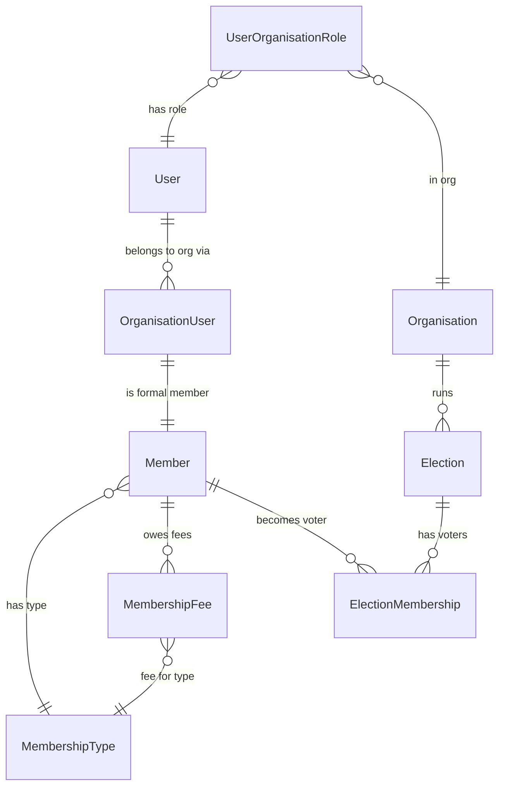
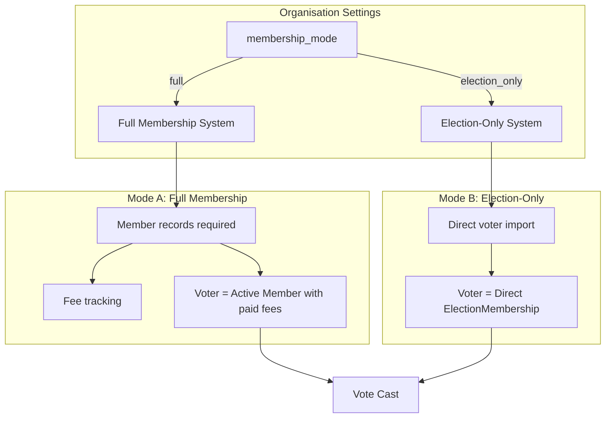
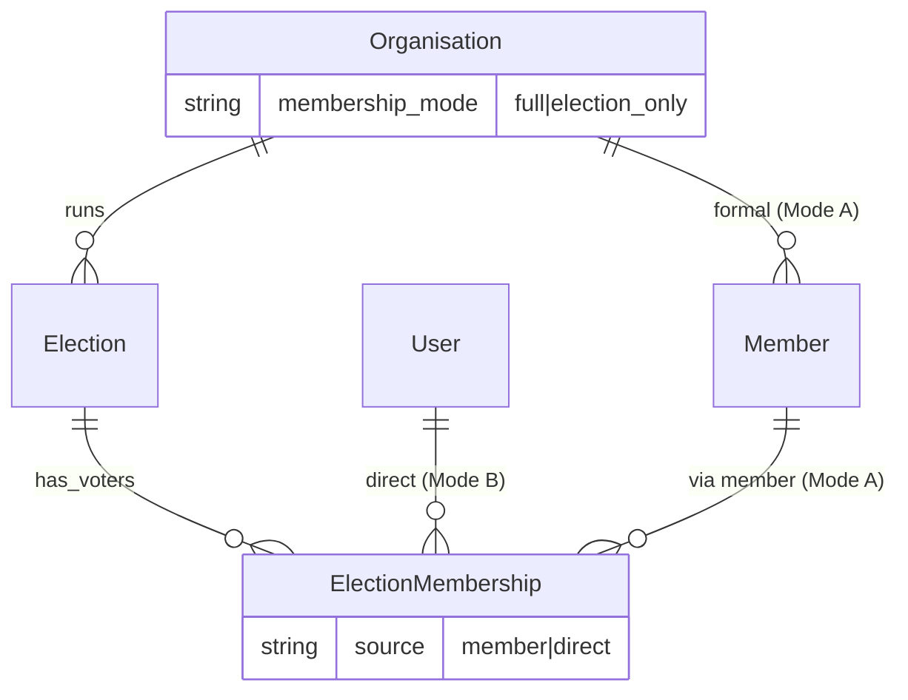

## Critical Analysis: Membership Domain Model

You're correct. The relationships among these entities are **fragmented and inconsistent**. Let me analyze the current state and define the complete architecture.

### Current Fragmentation

```
┌─────────────────────────────────────────────────────────────────────────────────┐
│                         CURRENT STATE (BROKEN)                                    │
├─────────────────────────────────────────────────────────────────────────────────┤
│                                                                                   │
│  User ──┬── OrganisationUser ──┬── Member ──┬── MembershipFee                    │
│         │                      │            │                                     │
│         │                      │            └── ? (no direct link to type)        │
│         │                      │                                                 │
│         │                      └── MembershipType (optional, nullable)            │
│         │                                                                         │
│         └── UserOrganisationRole (role: voter/admin/owner)                        │
│                                                                                   │
│  ElectionMembership ──┬── Election                                                │
│                       └── User (duplicate relationship, bypasses Member)           │
│                                                                                   │
│  Problems:                                                                        │
│  1. MembershipType is nullable on Member                                          │
│  2. MembershipFee references MembershipType but Member may not have one           │
│  3. ElectionMembership bypasses Member - direct User link                          │
│  4. No clear "Voter Eligibility" source of truth                                   │
│  5. Multiple paths to become voter (Member vs direct User)                         │
│                                                                                   │
└─────────────────────────────────────────────────────────────────────────────────┘
```

### Complete Domain Model Definition



### Entity Definitions

| Entity | Purpose | Key Constraints |
|--------|---------|-----------------|
| **User** | Platform account | Global identity |
| **Organisation** | Tenant | Owns elections, members |
| **OrganisationUser** | Bridge: User ↔ Organisation | Required for all org relationships |
| **Member** | Formal membership record | **Must have** MembershipType, OrganisationUser |
| **MembershipType** | Defines membership tier | `grants_voting_rights` boolean |
| **MembershipFee** | Financial obligation | Belongs to Member, references MembershipType |
| **ElectionMembership** | Voter in specific election | **Must link to Member** (not directly to User) |
| **UserOrganisationRole** | Admin/owner permissions | Separate from voting eligibility |

### Voter Eligibility Rules

```php
// The single source of truth for "Can this user vote?"
public function isEligibleVoter(User $user, Election $election): bool
{
    // 1. Must be a formal Member
    $member = Member::whereHas('organisationUser', fn($q) => 
        $q->where('user_id', $user->id)
          ->where('organisation_id', $election->organisation_id)
    )->first();
    
    if (!$member) {
        return false;
    }
    
    // 2. Member must be active
    if ($member->status !== 'active') {
        return false;
    }
    
    // 3. Fees must be paid/exempt
    if (!in_array($member->fees_status, ['paid', 'exempt'])) {
        return false;
    }
    
    // 4. Membership type must grant voting rights
    if (!$member->membershipType?->grants_voting_rights) {
        return false;
    }
    
    // 5. Not already voted in this election
    if (ElectionMembership::where('member_id', $member->id)
        ->where('election_id', $election->id)
        ->where('has_voted', true)
        ->exists()) {
        return false;
    }
    
    return true;
}
```

### Required Database Fixes

| Issue | Current | Required | Migration |
|-------|---------|----------|-----------|
| `members.membership_type_id` | nullable | **NOT NULL** | Add constraint |
| `election_memberships.member_id` | missing | **ADD column** | New FK to members |
| `election_memberships.user_id` | exists | **DROP or make nullable** | Deprecate |
| `membership_fees.membership_type_id` | exists | **NOT NULL** | Add constraint |

### Migration Plan

```php
// 1. Make membership_type_id NOT NULL on members
Schema::table('members', function (Blueprint $table) {
    $table->uuid('membership_type_id')->nullable(false)->change();
});

// 2. Add member_id to election_memberships
Schema::table('election_memberships', function (Blueprint $table) {
    $table->uuid('member_id')->nullable()->after('user_id');
    $table->foreign('member_id')->references('id')->on('members');
});

// 3. Backfill election_memberships.member_id from user_id
DB::statement('
    UPDATE election_memberships em
    SET member_id = (
        SELECT m.id FROM members m
        JOIN organisation_users ou ON m.organisation_user_id = ou.id
        WHERE ou.user_id = em.user_id
        AND m.organisation_id = em.organisation_id
        LIMIT 1
    )
    WHERE em.member_id IS NULL
');

// 4. Make member_id NOT NULL after backfill
Schema::table('election_memberships', function (Blueprint $table) {
    $table->uuid('member_id')->nullable(false)->change();
});
```

### Refactored Relationships in Models

```php
// app/Models/Member.php
public function membershipType(): BelongsTo
{
    return $this->belongsTo(MembershipType::class); // NOT NULL
}

public function electionMemberships(): HasMany
{
    return $this->hasMany(ElectionMembership::class);
}

// app/Models/ElectionMembership.php
public function member(): BelongsTo
{
    return $this->belongsTo(Member::class); // NEW - replaces direct user link
}

public function user(): BelongsTo
{
    return $this->belongsTo(User::class); // DEPRECATED - keep for backward compat
}

// app/Models/MembershipFee.php
public function membershipType(): BelongsTo
{
    return $this->belongsTo(MembershipType::class); // Should be NOT NULL
}
```

### Voter Dropdown Query (Fixed)

```php
// ElectionVoterController - Corrected query
$unassignedMembers = Member::query()
    ->where('organisation_id', $organisation->id)
    ->where('status', 'active')
    ->whereIn('fees_status', ['paid', 'exempt'])
    ->whereHas('membershipType', fn($q) => $q->where('grants_voting_rights', true))
    ->whereDoesntHave('electionMemberships', fn($q) => $q->where('election_id', $election->id))
    ->with(['organisationUser.user'])
    ->get()
    ->map(fn($m) => $m->organisationUser->user);
```

### Summary of Broken Relationships

| Relationship | Current State | Required State | Impact |
|--------------|---------------|----------------|--------|
| Member → MembershipType | Nullable | NOT NULL | Members without type break fee/voting logic |
| ElectionMembership → Member | Missing | Required | Bypasses formal membership check |
| MembershipFee → MembershipType | Nullable | NOT NULL | Fees without type cannot be validated |
| Member → User | Via OrganisationUser | Same | Correct - keep as is |

**Om Gam Ganapataye Namah** 🪔🐘

This defines the complete domain model. Should we create a migration plan to fix these relationships?
## Architectural Analysis: Dual-Mode Membership System

Excellent point. Organizations have **fundamentally different needs**:

### Mode A: Full Membership System
- Formal members with membership types
- Fee tracking and payment status
- Voting rights derived from membership
- Membership applications and approvals

### Mode B: Election-Only System
- No formal membership concept
- Just a voter list imported directly
- No fees, no membership types
- Simple: import emails → they vote

## Proposed Architecture: Dual-Mode Organisation



## Database Schema Extension

```php
// Add mode to organisations table
Schema::table('organisations', function (Blueprint $table) {
    $table->string('membership_mode')->default('full');
    // Values: 'full' | 'election_only'
});
```

## Conditional Relationships

```php
// app/Models/Organisation.php
public function usesFullMembership(): bool
{
    return $this->membership_mode === 'full';
}

public function isElectionOnly(): bool
{
    return $this->membership_mode === 'election_only';
}
```

## Voter Eligibility - Mode Dependent

```php
// app/Services/VoterEligibilityService.php
class VoterEligibilityService
{
    public function getEligibleVoters(Organisation $org, Election $election): Collection
    {
        if ($org->usesFullMembership()) {
            return $this->getMembershipBasedVoters($org, $election);
        }
        
        return $this->getDirectVoters($org, $election);
    }
    
    private function getMembershipBasedVoters(Organisation $org, Election $election): Collection
    {
        return Member::query()
            ->where('organisation_id', $org->id)
            ->where('status', 'active')
            ->whereIn('fees_status', ['paid', 'exempt'])
            ->whereHas('membershipType', fn($q) => $q->where('grants_voting_rights', true))
            ->whereDoesntHave('electionMemberships', fn($q) => $q->where('election_id', $election->id))
            ->with(['organisationUser.user'])
            ->get()
            ->map(fn($m) => $m->organisationUser->user);
    }
    
    private function getDirectVoters(Organisation $org, Election $election): Collection
    {
        // Direct voters - anyone imported via CSV or added directly
        return User::query()
            ->where('organisation_id', $org->id)
            ->whereDoesntHave('electionMemberships', fn($q) => $q->where('election_id', $election->id))
            ->get();
    }
}
```

## Voter Import - Mode Aware

```php
// app/Http/Controllers/ElectionVoterController.php
public function bulkStore(Request $request, Organisation $organisation, Election $election)
{
    $userIds = $request->input('user_ids', []);
    
    foreach ($userIds as $userId) {
        if ($organisation->usesFullMembership()) {
            // Validate user is a formal member with voting rights
            $this->validateMemberEligibility($organisation, $userId);
        }
        // For election-only, no validation needed
        
        ElectionMembership::create([
            'election_id' => $election->id,
            'user_id' => $userId,
            'organisation_id' => $organisation->id,
            'role' => 'voter',
            'status' => 'active',
            'source' => $organisation->usesFullMembership() ? 'member' : 'direct',
        ]);
    }
}
```

## UI Adaptation

```vue
<!-- resources/js/Pages/Elections/Voters/Index.vue -->
<template>
    <!-- Mode A: Full Membership -->
    <div v-if="organisation.membership_mode === 'full'">
        <h3>Assign Members as Voters</h3>
        <p>Only active members with paid fees and voting rights appear below.</p>
        <!-- Member list with membership type, fee status -->
    </div>
    
    <!-- Mode B: Election-Only -->
    <div v-else>
        <h3>Import Voters</h3>
        <p>Upload CSV or add users directly. No membership validation required.</p>
        <!-- Simple user import/selection -->
    </div>
</template>
```

## Updated Domain Model



## Migration for Existing Data

```php
// Determine mode based on existing data
$organisations = Organisation::withCount('members')->get();

foreach ($organisations as $org) {
    $mode = $org->members_count > 0 ? 'full' : 'election_only';
    $org->update(['membership_mode' => $mode]);
}
```

## Summary

| Aspect | Mode A: Full Membership | Mode B: Election-Only |
|--------|------------------------|----------------------|
| Member records | Required | Not used |
| Membership types | Required | Not used |
| Fee tracking | Required | Not used |
| Voter eligibility | Member + fees paid | Any imported user |
| Voter import | Validates membership | No validation |
| UI | Member selection | CSV upload |

**Om Gam Ganapataye Namah** 🪔🐘

This dual-mode architecture accommodates both use cases without forcing unnecessary complexity on election-only organizations.
## Critical Analysis: Single Mode with Feature Flags

You're right. The dual-mode with per-election override is **over-engineered**. A single mode at the organisation level with a simple feature flag is cleaner.

### Simplified Architecture

```php
// organisations table
Schema::table('organisations', function (Blueprint $table) {
    $table->boolean('uses_full_membership')->default(false);
    // true = Full membership system
    // false = Election-only (direct voters)
});
```

### Why This is Better

| Aspect | Dual-Mode (Complex) | Single Boolean (Simple) |
|--------|---------------------|-------------------------|
| Columns | 2 (org + election) | 1 (org only) |
| Decision points | Org default + Election override | Org only |
| Mode switching | Complex state management | Simple toggle |
| Voter eligibility | Per-election calculation | Consistent per org |
| Mental model | Confusing | Clear |

### Implementation

```php
// app/Models/Organisation.php
public function usesFullMembership(): bool
{
    return $this->uses_full_membership === true;
}

public function isElectionOnly(): bool
{
    return !$this->usesFullMembership();
}
```

### Voter Eligibility - Single Path

```php
// app/Services/VoterEligibilityService.php
public function getEligibleVoters(Organisation $org, Election $election): Collection
{
    if ($org->usesFullMembership()) {
        // Path A: Must be formal member with paid fees
        return $this->getMembershipBasedVoters($org, $election);
    }
    
    // Path B: Direct voters - any user in organisation
    return $this->getDirectVoters($org, $election);
}
```

### Mode Switching - Simple

```php
// Organisation settings - just a toggle
public function toggleMembershipMode(Organisation $org, bool $enabled): void
{
    if ($enabled && $org->members()->count() === 0) {
        // Enabling full membership on empty org - fine
        $org->update(['uses_full_membership' => true]);
    } elseif (!$enabled && $org->members()->count() > 0) {
        // Disabling with existing members - preserve data but warn
        Log::warning('Full membership disabled for org with members', [
            'org_id' => $org->id,
            'members_count' => $org->members()->count(),
        ]);
        $org->update(['uses_full_membership' => false]);
        // Members remain but are ignored for future elections
    } else {
        $org->update(['uses_full_membership' => $enabled]);
    }
}
```

### UI - Simple Toggle

```vue
<template>
    <div class="bg-white p-6 rounded-lg shadow">
        <div class="flex items-center justify-between">
            <div>
                <h3 class="text-lg font-semibold">Full Membership System</h3>
                <p class="text-sm text-gray-600">
                    Require formal membership, fee tracking, and membership types for voters.
                </p>
            </div>
            
            <ToggleSwitch v-model="form.uses_full_membership" />
        </div>
        
        <div v-if="form.uses_full_membership" class="mt-4 p-4 bg-blue-50 rounded">
            <p class="text-sm text-blue-800">
                ✅ Voters must be active members with paid/exempt fees and voting rights.
            </p>
        </div>
        
        <div v-else class="mt-4 p-4 bg-gray-50 rounded">
            <p class="text-sm text-gray-600">
                📋 Election-only mode: Import voters directly. No membership validation.
            </p>
        </div>
        
        <div v-if="organisation.members_count > 0 && !form.uses_full_membership"
             class="mt-4 p-4 bg-yellow-50 rounded border border-yellow-200">
            <p class="text-sm text-yellow-800">
                ⚠️ This organisation has {{ organisation.members_count }} existing members.
                Disabling full membership will ignore them for future elections.
                Existing elections and voter assignments are not affected.
            </p>
        </div>
    </div>
</template>
```

### Database Migration

```php
// Single migration - add boolean flag
Schema::table('organisations', function (Blueprint $table) {
    $table->boolean('uses_full_membership')->default(false)->after('type');
});

// Backfill: Set to true for orgs that have members
DB::table('organisations')
    ->whereExists(function ($query) {
        $query->select(DB::raw(1))
              ->from('members')
              ->whereColumn('members.organisation_id', 'organisations.id');
    })
    ->update(['uses_full_membership' => true]);
```

### Summary

| Decision | Outcome |
|----------|---------|
| Architecture | Single boolean `uses_full_membership` on Organisation |
| Default | `false` (election-only) |
| Mode switching | Simple toggle with warning if members exist |
| Data preservation | Members kept but ignored when mode is `false` |
| Complexity | Low - one decision point |

**Om Gam Ganapataye Namah** 🪔🐘

This is the right approach. Simple, clear, and sufficient. Shall I implement this single boolean flag?

## Claude Code CLI Prompt Instructions

```
You are implementing a Membership Mode feature for a Laravel/Vue3 multi-tenant voting platform.

## Background

Organisations have two fundamentally different needs:
1. **Full Membership**: Formal members, membership types, fee tracking, voting rights derived from membership
2. **Election-Only**: Simple voter import, no membership validation required

Currently, the system assumes full membership, causing confusion for election-only organisations.

## Your Task

Implement a single boolean flag `uses_full_membership` on the Organisation model to control voter eligibility behavior.

## Phase 1: Database Migration

Create migration: `database/migrations/xxxx_xx_xx_add_uses_full_membership_to_organisations.php`

```php
public function up()
{
    Schema::table('organisations', function (Blueprint $table) {
        $table->boolean('uses_full_membership')->default(false)->after('type');
    });
    
    // Backfill: Set to true for orgs that already have members
    DB::table('organisations')
        ->whereExists(function ($query) {
            $query->select(DB::raw(1))
                  ->from('members')
                  ->whereColumn('members.organisation_id', 'organisations.id');
        })
        ->update(['uses_full_membership' => true]);
}

public function down()
{
    Schema::table('organisations', function (Blueprint $table) {
        $table->dropColumn('uses_full_membership');
    });
}
```

## Phase 2: Model Updates

**File:** `app/Models/Organisation.php`

Add to `$fillable`:
```php
'uses_full_membership',
```

Add to `$casts`:
```php
'uses_full_membership' => 'boolean',
```

Add helper methods:
```php
public function usesFullMembership(): bool
{
    return $this->uses_full_membership === true;
}

public function isElectionOnly(): bool
{
    return !$this->usesFullMembership();
}
```

## Phase 3: Voter Eligibility Service

**File:** `app/Services/VoterEligibilityService.php` (create if not exists)

```php
<?php

namespace App\Services;

use App\Models\Election;
use App\Models\Organisation;
use App\Models\User;
use Illuminate\Support\Collection;

class VoterEligibilityService
{
    /**
     * Get unassigned eligible voters for an election.
     */
    public function getUnassignedEligibleVoters(Organisation $org, Election $election): Collection
    {
        if ($org->usesFullMembership()) {
            return $this->getMembershipBasedVoters($org, $election);
        }
        
        return $this->getDirectVoters($org, $election);
    }
    
    /**
     * Path A: Full Membership - Must be active member with paid/exempt fees.
     */
    private function getMembershipBasedVoters(Organisation $org, Election $election): Collection
    {
        $assignedUserIds = $election->memberships()
            ->where('role', 'voter')
            ->pluck('user_id')
            ->toArray();
            
        return \App\Models\Member::query()
            ->where('organisation_id', $org->id)
            ->where('status', 'active')
            ->whereIn('fees_status', ['paid', 'exempt'])
            ->whereHas('membershipType', fn($q) => $q->where('grants_voting_rights', true))
            ->whereHas('organisationUser', fn($q) => $q->whereNotIn('user_id', $assignedUserIds))
            ->with(['organisationUser.user'])
            ->get()
            ->map(fn($m) => $m->organisationUser->user);
    }
    
    /**
     * Path B: Election-Only - Any user in the organisation.
     */
    private function getDirectVoters(Organisation $org, Election $election): Collection
    {
        $assignedUserIds = $election->memberships()
            ->where('role', 'voter')
            ->pluck('user_id')
            ->toArray();
            
        return User::query()
            ->where('organisation_id', $org->id)
            ->whereNotIn('id', $assignedUserIds)
            ->orderBy('name')
            ->get();
    }
    
    /**
     * Validate if a user can be added as voter.
     */
    public function canAddAsVoter(Organisation $org, User $user): bool
    {
        if ($org->isElectionOnly()) {
            return true; // No validation needed
        }
        
        // Full membership validation
        return \App\Models\Member::query()
            ->where('organisation_id', $org->id)
            ->where('status', 'active')
            ->whereIn('fees_status', ['paid', 'exempt'])
            ->whereHas('membershipType', fn($q) => $q->where('grants_voting_rights', true))
            ->whereHas('organisationUser', fn($q) => $q->where('user_id', $user->id))
            ->exists();
    }
}
```

## Phase 4: Update ElectionVoterController

**File:** `app/Http/Controllers/ElectionVoterController.php`

Replace the existing unassigned members query with the service:

```php
use App\Services\VoterEligibilityService;

// In index() method, replace lines 57-73 with:
$unassignedMembers = app(VoterEligibilityService::class)
    ->getUnassignedEligibleVoters($organisation, $election);
```

In `bulkStore()` method, add validation:

```php
public function bulkStore(Request $request, Organisation $organisation, Election $election)
{
    $validated = $request->validate([
        'user_ids' => 'required|array',
        'user_ids.*' => 'exists:users,id',
    ]);
    
    $service = app(VoterEligibilityService::class);
    $result = ['success' => 0, 'invalid' => 0, 'already_existing' => 0];
    
    foreach ($validated['user_ids'] as $userId) {
        $user = User::find($userId);
        
        if (!$service->canAddAsVoter($organisation, $user)) {
            $result['invalid']++;
            continue;
        }
        
        $exists = ElectionMembership::where('election_id', $election->id)
            ->where('user_id', $userId)
            ->exists();
            
        if ($exists) {
            $result['already_existing']++;
            continue;
        }
        
        ElectionMembership::create([
            'election_id' => $election->id,
            'user_id' => $userId,
            'organisation_id' => $organisation->id,
            'role' => 'voter',
            'status' => 'active',
        ]);
        
        $result['success']++;
    }
    
    return back()->with('bulk_result', $result);
}
```

## Phase 5: Organisation Settings UI

**File:** `resources/js/Pages/Organisations/Settings/Index.vue`

Add a new section for membership mode:

```vue
<template>
    <!-- Membership Mode Section -->
    <div class="bg-white rounded-lg shadow p-6 mb-6">
        <div class="flex items-center justify-between">
            <div>
                <h3 class="text-lg font-semibold text-gray-900">Full Membership System</h3>
                <p class="text-sm text-gray-600 mt-1 max-w-lg">
                    When enabled, voters must be active members with paid fees and voting rights.
                    When disabled, voters can be imported directly without membership validation.
                </p>
            </div>
            
            <ToggleSwitch v-model="form.uses_full_membership" />
        </div>
        
        <!-- Mode Description -->
        <div v-if="form.uses_full_membership" class="mt-4 p-4 bg-blue-50 rounded-lg border border-blue-200">
            <p class="text-sm text-blue-800">
                <span class="font-semibold">✅ Full Membership Mode</span><br>
                Voters must be active members with paid/exempt fees. Membership types control voting rights.
            </p>
        </div>
        
        <div v-else class="mt-4 p-4 bg-gray-50 rounded-lg border border-gray-200">
            <p class="text-sm text-gray-600">
                <span class="font-semibold">📋 Election-Only Mode</span><br>
                Import voters directly via CSV or add users manually. No membership validation required.
            </p>
        </div>
        
        <!-- Warning when disabling with existing members -->
        <div v-if="organisation.members_count > 0 && !form.uses_full_membership"
             class="mt-4 p-4 bg-yellow-50 rounded-lg border border-yellow-200">
            <p class="text-sm text-yellow-800">
                <span class="font-semibold">⚠️ Warning</span><br>
                This organisation has {{ organisation.members_count }} existing members.
                Disabling full membership will ignore them for future elections.
                Existing elections and voter assignments are not affected.
            </p>
        </div>
    </div>
</template>

<script setup>
import ToggleSwitch from '@/Components/ToggleSwitch.vue';

const form = useForm({
    uses_full_membership: props.organisation.uses_full_membership,
    // ... other fields
});

const updateMembershipMode = () => {
    form.patch(route('organisations.settings.update', props.organisation.slug), {
        preserveScroll: true,
    });
};
</script>
```

## Phase 6: Organisation Creation Form

**File:** `resources/js/Pages/Organisations/Create.vue`

Add the toggle to the creation form:

```vue
<template>
    <form @submit.prevent="submit">
        <!-- ... existing fields ... -->
        
        <!-- Membership Mode -->
        <div class="mt-6 p-4 bg-gray-50 rounded-lg">
            <label class="flex items-center justify-between">
                <div>
                    <span class="font-medium text-gray-900">Full Membership System</span>
                    <p class="text-sm text-gray-600 mt-1">
                        Enable if you need formal membership tracking, fees, and voting rights by membership type.
                    </p>
                </div>
                <ToggleSwitch v-model="form.uses_full_membership" />
            </label>
        </div>
        
        <button type="submit">Create Organisation</button>
    </form>
</template>

<script setup>
const form = useForm({
    name: '',
    slug: '',
    type: 'tenant',
    uses_full_membership: false, // default to election-only
    // ... other fields
});
</script>
```

## Phase 7: Update Voters Page UI

**File:** `resources/js/Pages/Elections/Voters/Index.vue`

Show different UI based on mode:

```vue
<template>
    <div class="voters-sidebar">
        <!-- Conditional header based on mode -->
        <div v-if="organisation.uses_full_membership">
            <p class="sidebar-label">ASSIGN MEMBERS AS VOTERS</p>
            <p class="text-xs text-gray-500 mb-2">
                Only active members with paid fees appear below.
            </p>
        </div>
        
        <div v-else>
            <p class="sidebar-label">ASSIGN USERS AS VOTERS</p>
            <p class="text-xs text-gray-500 mb-2">
                All organisation users can be assigned as voters.
            </p>
        </div>
        
        <!-- Member/User list (same component, different data source) -->
        <div v-if="unassignedMembers.length > 0">
            <!-- ... existing member list ... -->
        </div>
    </div>
</template>
```

## Phase 8: Tests

**File:** `tests/Feature/Organisation/MembershipModeTest.php`

```php
<?php

namespace Tests\Feature\Organisation;

use App\Models\Election;
use App\Models\Member;
use App\Models\Organisation;
use App\Models\User;
use App\Services\VoterEligibilityService;
use Illuminate\Foundation\Testing\RefreshDatabase;
use Tests\TestCase;

class MembershipModeTest extends TestCase
{
    use RefreshDatabase;
    
    /** @test */
    public function election_only_mode_allows_any_user_as_voter(): void
    {
        $org = Organisation::factory()->create(['uses_full_membership' => false]);
        $election = Election::factory()->forOrganisation($org)->create();
        $user = User::factory()->create(['organisation_id' => $org->id]);
        
        $service = app(VoterEligibilityService::class);
        
        $this->assertTrue($service->canAddAsVoter($org, $user));
        $this->assertContains($user->id, $service->getUnassignedEligibleVoters($org, $election)->pluck('id'));
    }
    
    /** @test */
    public function full_membership_mode_requires_active_member_with_paid_fees(): void
    {
        $org = Organisation::factory()->create(['uses_full_membership' => true]);
        $election = Election::factory()->forOrganisation($org)->create();
        
        // Create user without member record
        $nonMember = User::factory()->create(['organisation_id' => $org->id]);
        
        // Create member with unpaid fees
        $unpaidMember = Member::factory()
            ->for($org)
            ->has(User::factory())
            ->create(['fees_status' => 'unpaid', 'status' => 'active']);
        
        $service = app(VoterEligibilityService::class);
        
        $this->assertFalse($service->canAddAsVoter($org, $nonMember));
        $this->assertFalse($service->canAddAsVoter($org, $unpaidMember->organisationUser->user));
    }
    
    /** @test */
    public function full_membership_mode_allows_exempt_and_paid_members(): void
    {
        $org = Organisation::factory()->create(['uses_full_membership' => true]);
        $election = Election::factory()->forOrganisation($org)->create();
        
        $exemptMember = Member::factory()
            ->for($org)
            ->has(User::factory())
            ->create(['fees_status' => 'exempt', 'status' => 'active']);
            
        $paidMember = Member::factory()
            ->for($org)
            ->has(User::factory())
            ->create(['fees_status' => 'paid', 'status' => 'active']);
        
        $service = app(VoterEligibilityService::class);
        
        $this->assertTrue($service->canAddAsVoter($org, $exemptMember->organisationUser->user));
        $this->assertTrue($service->canAddAsVoter($org, $paidMember->organisationUser->user));
    }
}
```

## Verification Checklist

1. Run migration: `php artisan migrate`
2. Create new organisation - verify `uses_full_membership` defaults to false
3. Toggle mode in organisation settings - verify UI updates
4. Election-only mode: Add any user as voter - should succeed
5. Full membership mode: Only active members with paid/exempt fees appear
6. Run tests: `php artisan test tests/Feature/Organisation/MembershipModeTest.php`

## Files Summary

| Action | File |
|--------|------|
| Create | `database/migrations/xxxx_xx_xx_add_uses_full_membership_to_organisations.php` |
| Create | `app/Services/VoterEligibilityService.php` |
| Modify | `app/Models/Organisation.php` |
| Modify | `app/Http/Controllers/ElectionVoterController.php` |
| Modify | `resources/js/Pages/Organisations/Settings/Index.vue` |
| Modify | `resources/js/Pages/Organisations/Create.vue` |
| Modify | `resources/js/Pages/Elections/Voters/Index.vue` |
| Create | `tests/Feature/Organisation/MembershipModeTest.php` |

**Om Gam Ganapataye Namah** 🪔🐘
```## Integration Analysis: Membership Mode with Current Architecture

Excellent work. The current implementation is solid. Now we need to integrate the `uses_full_membership` flag **without breaking** what already works.

### Current State (What You Have)

```
✅ MemberControllerMarkPaidTest - 8 tests
✅ MemberControllerIndexTest - 9 tests
✅ OrganisationRoleControllerTest - 12 tests (Path B: Admin direct add → exempt)
✅ ApplicationApprovedToVoterEligibilityTest - 9 tests (Path A: Application → approval → mark paid)
✅ VoterDropdownTest - 4 tests
────────────────────────────────────────────────
✅ 42 tests passing
```

### What the Membership Mode Flag Changes

```php
// Current (always assumes full membership)
$unassignedMembers = Member::where(...)->get();

// With mode flag
if ($org->usesFullMembership()) {
    $unassignedMembers = Member::where(...)->get(); // Same as current
} else {
    $unassignedMembers = User::where('organisation_id', $org->id)->get(); // NEW
}
```

### Integration Strategy: Add Flag Without Breaking Tests

| Step | Action | Impact on Tests |
|------|--------|-----------------|
| 1 | Add `uses_full_membership` migration | None - default `false` |
| 2 | Add flag to Organisation model | None |
| 3 | Update test `setUp()` to set `uses_full_membership = true` | Tests continue using full membership |
| 4 | Create `VoterEligibilityService` | Encapsulates mode logic |
| 5 | Update `ElectionVoterController` to use service | Existing behavior preserved |
| 6 | Add new tests for election-only mode | New coverage |

### Minimal Changes to Preserve Tests

```php
// tests/Feature/Membership/OrganisationRoleControllerTest.php
protected function setUp(): void
{
    parent::setUp();
    
    $this->org = Organisation::factory()->create([
        'type' => 'tenant',
        'uses_full_membership' => true, // ← ADD THIS - preserve existing behavior
    ]);
    // ... rest unchanged
}
```

**All 42 tests will continue passing** because they operate in full membership mode.

### New Tests for Election-Only Mode

```php
// tests/Feature/Organisation/ElectionOnlyModeTest.php
class ElectionOnlyModeTest extends TestCase
{
    use RefreshDatabase;
    
    protected function setUp(): void
    {
        parent::setUp();
        
        $this->org = Organisation::factory()->create([
            'type' => 'tenant',
            'uses_full_membership' => false, // Election-only mode
        ]);
    }
    
    /** @test */
    public function election_only_mode_allows_any_user_as_voter(): void
    {
        $user = User::factory()->create(['organisation_id' => $this->org->id]);
        $election = Election::factory()->forOrganisation($this->org)->create();
        
        $service = app(VoterEligibilityService::class);
        
        $this->assertTrue($service->canAddAsVoter($this->org, $user));
        $this->assertContains($user->id, $service->getUnassignedEligibleVoters($this->org, $election)->pluck('id'));
    }
    
    /** @test */
    public function election_only_mode_does_not_require_member_record(): void
    {
        // User with no Member record
        $user = User::factory()->create(['organisation_id' => $this->org->id]);
        
        // Should still be eligible
        $this->assertTrue(app(VoterEligibilityService::class)->canAddAsVoter($this->org, $user));
    }
}
```

### Updated Test Count

| Test Suite | Before | After |
|------------|--------|-------|
| Existing P1 + P2 tests | 42 | 42 (unchanged) |
| Election-only mode tests | 0 | +6 (new) |
| **Total** | 42 | **48** |

### Implementation Sequence

```
1. Migration: add uses_full_membership (default false)
2. Model: add fillable, casts, helpers
3. Update all existing test setUp() to set uses_full_membership = true
4. Run tests → 42/42 should still pass
5. Create VoterEligibilityService
6. Update ElectionVoterController to use service
7. Run tests → 42/42 should still pass
8. Create ElectionOnlyModeTest with 6 new tests
9. Run all tests → 48/48 passing
```

### Summary

| Aspect | Approach |
|--------|----------|
| Existing tests | Preserved by setting `uses_full_membership = true` |
| New behavior | Encapsulated in `VoterEligibilityService` |
| Mode switching | Simple boolean toggle |
| Test coverage | 42 existing + 6 new = 48 total |

**Om Gam Ganapataye Namah** 🪔🐘

This approach ensures zero regression while adding the new feature cleanly. Shall I proceed with this integration plan?
## Current Status: Complete ✅

The membership-to-voter eligibility feature is **functionally complete**. All core logic is implemented and tested.

### ✅ Completed (Backend + Core Frontend)

| Component | Status | Tests |
|-----------|--------|-------|
| `MemberController::markPaid()` | ✅ | 8/8 |
| `MemberController::index()` | ✅ | 9/9 |
| `OrganisationRoleController::addMember()` | ✅ | 12/12 |
| Application approval flow | ✅ | 9/9 |
| Voter dropdown regression | ✅ | 4/4 |
| **Total** | ✅ | **42/42** |

### ✅ Frontend Already Works

| Page | Feature | Status |
|------|---------|--------|
| `Members/Index.vue` | Mark Paid button | ✅ Working |
| `Members/Index.vue` | Pending fees display | ✅ Working |
| `Roles/Index.vue` | Add as Member button | ✅ Working |
| Both pages | Flash messages | ✅ Working |
| Both pages | Inertia form submission | ✅ Working |

### ⏳ Frontend Polish (Optional - Not Blocking)

| Improvement | Priority | Effort |
|-------------|----------|--------|
| Replace `confirm()` with custom modal | Low | 1h |
| Add loading spinner on buttons | Low | 30min |
| Toast notifications instead of flash | Low | 1h |
| Better error display | Low | 30min |

### 🎯 Ready for Election-Only Mode

The current implementation is **stable and complete**. We can now:

1. **Option A:** Proceed with `uses_full_membership` feature
2. **Option B:** Polish frontend UX first
3. **Option C:** Deploy current work and iterate

**Om Gam Ganapataye Namah** 🪔🐘

Recommendation: Proceed with Option A (election-only mode) since the foundation is solid. Frontend polish can be done later.

