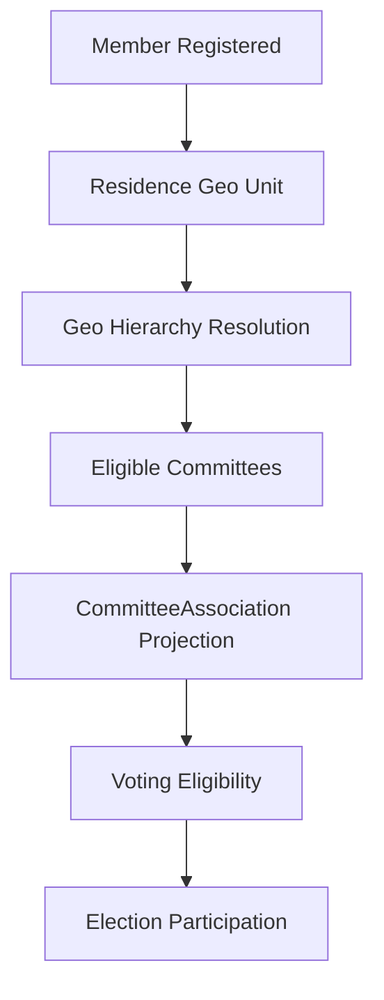
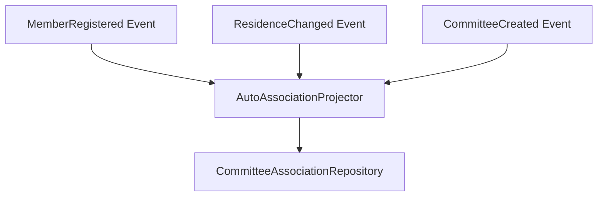
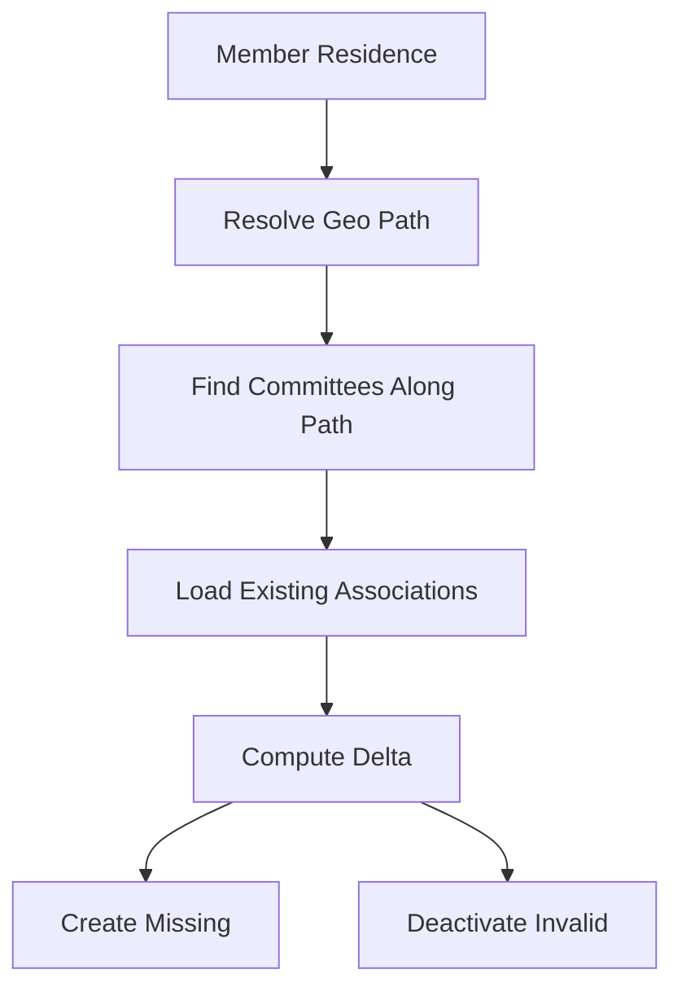

Your assessment is correct. The system is currently missing the **membership projection layer** that converts:

```text
Organisation Membership
    + Residence Geo Unit
        ↓
Committee Associations
        ↓
Voting Eligibility
```

Right now the architecture already has:

* command-side governance workflow ✅
* committee association model ✅
* election infrastructure ✅

But the **read-side synchronization mechanism** is missing.

---

# 🧠 Architectural Interpretation

You are no longer building just a CRUD membership module.

You are building a:

> **Geo-governed political association engine**

That means:



The missing piece is:

# 🚨 Committee Association Projection

---

# ✅ Recommended Next Priority Order

I strongly recommend adjusting your order slightly.

| Priority | Feature                                 | Reason                 |
| -------- | --------------------------------------- | ---------------------- |
| 1        | Auto-Association Projector              | Core projection engine |
| 2        | CommitteeAssociation Repository Queries | Needed by Elections    |
| 3        | Voting Eligibility Integration          | Security-critical      |
| 4        | Admin Manual Assignment                 | Governance override    |
| 5        | Member Dashboard                        | Read model             |
| 6        | Committee Dashboard                     | Read model             |
| 7        | HTTP/UI Improvements                    | UX layer               |
| 8        | Eloquent extraction                     | Architecture cleanup   |

---

# 🏛️ Critical Architectural Insight

Your system now has **two different truths**:

| Truth Type                 | Owner                 |
| -------------------------- | --------------------- |
| Governance workflow truth  | MembershipApplication |
| Participation/Voting truth | CommitteeAssociation  |

This is excellent DDD separation.

The next phase should preserve that separation.

---

# 🚨 IMPORTANT: Auto-Association Must Be a Projection

Do NOT implement this as:

```php
MemberRegisteredHandler {
   directly create associations
}
```

That creates hidden coupling.

Instead:

# Correct Model



---

# 🧩 Recommended New Bounded Context Responsibility

| Context                | Responsibility             |
| ---------------------- | -------------------------- |
| Membership             | applications, associations |
| Geography              | geo hierarchy              |
| Governance             | committee structure        |
| Elections              | voting                     |
| Projection/Integration | synchronization            |

You are beginning to need an explicit:

# 🔷 Integration / Projection Layer

---

# ✅ Recommended Design

# 1. New Domain Service

```text
CommitteeAssociationProjectionService
```

Responsibility:

```text
Given a member residence
Determine all eligible committees
Synchronize associations
```

---

# 2. Trigger Events

Projection should react to:

| Event                  | Why                       |
| ---------------------- | ------------------------- |
| MemberRegistered       | initial sync              |
| MemberResidenceChanged | re-sync                   |
| CommitteeCreated       | backfill eligible members |
| CommitteeGeoChanged    | re-evaluate               |
| MembershipApproved     | manual association        |

---

# 3. Projection Algorithm



This is essentially a:

# 🔷 Synchronization Aggregate

NOT a simple CRUD handler.

---

# 🚨 VERY IMPORTANT POLICY DECISION

You must decide now:

# Does residence imply automatic voting rights?

Two possible models:

| Model                 | Meaning                                    |
| --------------------- | ------------------------------------------ |
| Automatic association | residence alone grants participation       |
| Application-required  | residence only grants eligibility to apply |

This changes EVERYTHING.

---

# Based on your current system:

Your architecture currently implies:

```text
Application approval
    creates
CommitteeAssociation
```

Meaning:

# 🚨 Voting rights currently require approval

Therefore:

## Auto-association may violate your governance model.

---

# 🧠 This Is The Critical Governance Question

You must decide:

## Option A — Democratic Approval Model

```text
Member applies
    ↓
Committee reviews
    ↓
Association created
    ↓
Voting rights granted
```

Residence only determines ELIGIBILITY.

### Pros

* controlled governance
* fraud prevention
* explicit participation

### Cons

* more administration

---

## Option B — Automatic Civic Membership Model

```text
Residence determines committee membership automatically
```

### Pros

* scalable
* no approval bottleneck

### Cons

* less governance control

---

# ⚠️ Current Architecture Contradiction

Right now your roadmap says:

```text
Auto-association is bridge to voting
```

BUT your implemented domain says:

```text
Approval creates association
```

These are different constitutional models.

---

# 🚨 Recommendation

Given your existing design:

# KEEP APPLICATION APPROVAL AS THE SOURCE OF VOTING RIGHTS

Meaning:

## Residence should NOT auto-create active associations.

Instead:

# Better Model

```text
Residence
    ↓
Creates EligibilityProjection
    ↓
Member may apply
    ↓
Approval creates Association
    ↓
Voting rights enabled
```

---

# 🏛️ Revised Model

| Concept               | Meaning                |
| --------------------- | ---------------------- |
| Geo eligibility       | "may participate"      |
| MembershipApplication | request                |
| CommitteeAssociation  | approved participation |
| Election eligibility  | active association     |

---

# ✨ This is MUCH cleaner constitutionally

Because:

```text
Eligibility ≠ Participation
Participation ≠ Voting
Voting ≠ Leadership
```

This is advanced governance modeling.

---

# 🔥 Therefore My Recommendation Is:

## DO NOT build automatic association yet.

Instead build:

# ✅ Eligibility Projection System

```text
Member
    ↓
Eligible Committees
```

Then:

```text
Apply → Review → Association
```

---

# Suggested Immediate Next Step

## Priority 1 (revised)

# EligibleCommitteeProjection

Example:

```php
EligibleCommitteeFinder::forMember(MemberId)
```

returns:

```php
EligibleCommittee[]
```

based on geo hierarchy.

---

Then UI shows:

```text
You are eligible to apply for:
- Berlin Local Committee
- Germany National Committee
- Europe Regional Committee
- ICC
```

---

# Then Later

Approved applications create:

```text
CommitteeAssociation
```

which Elections uses.

---

# Final Architectural Verdict

## Your current DDD model is already correct.

The risky part is the proposed auto-association shortcut.

If you preserve:

```text
Eligibility → Application → Approval → Association → Voting
```

your governance system remains constitutionally coherent, auditable, and secure.

That is the stronger long-term architecture.
