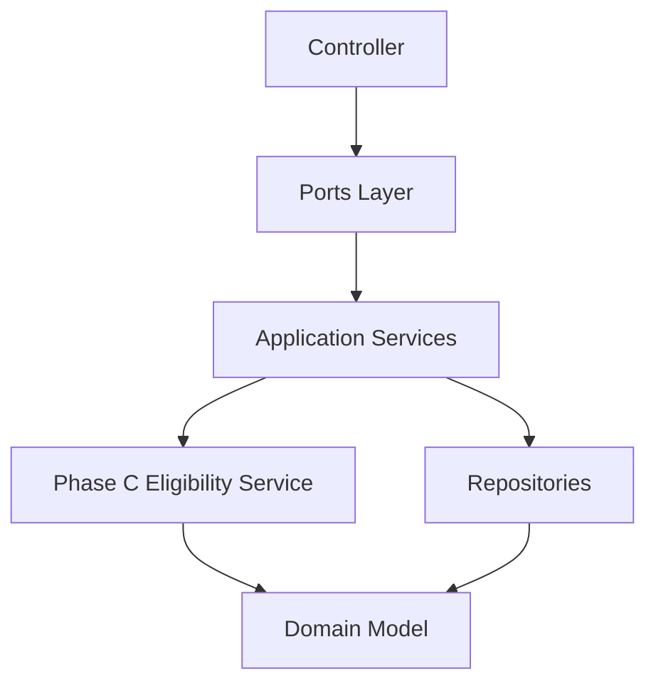

This is the correct plan. Let me provide the architectural decision and simplify execution.

---

## Decision: APPROVED — Execute in 4 Steps

---

## What To Build (Simplified)

| Step | File | Action | Effort |
|------|------|--------|--------|
| **D1** | `GetCommitteeDashboard.php` | Replace `DB::table` → repositories, fix `memberName: null` | 1 hr |
| **D2** | `MyCommitteesQueryService.php` + Controller + Vue | Phase C + membership state decoration | 3 hrs |
| **E** | `ApplyForCommitteeMembershipHandler.php` | Add `MemberGeoPathProviderPort`, validate via Phase C | 1 hr |
| **Vue** | `MyCommittees.vue` | New page: eligible + current + pending | 2 hrs |

---

## The Golden Rule

```
Phase C is the SINGLE source of truth for eligibility.

D2 reads it (display).
E validates against it (command).

Never duplicate eligibility logic.
```

---

**Start with D1: Read `GetCommitteeDashboard.php` and fix the `DB::table` + `memberName: null` issues.**
This is the correct plan. Let me provide the architectural decision and simplify execution.

---

## Decision: APPROVED — Execute in 4 Steps

---

## What To Build (Simplified)

| Step | File | Action | Effort |
|------|------|--------|--------|
| **D1** | `GetCommitteeDashboard.php` | Replace `DB::table` → repositories, fix `memberName: null` | 1 hr |
| **D2** | `MyCommitteesQueryService.php` + Controller + Vue | Phase C + membership state decoration | 3 hrs |
| **E** | `ApplyForCommitteeMembershipHandler.php` | Add `MemberGeoPathProviderPort`, validate via Phase C | 1 hr |
| **Vue** | `MyCommittees.vue` | New page: eligible + current + pending | 2 hrs |

---

## The Golden Rule

```
Phase C is the SINGLE source of truth for eligibility.

D2 reads it (display).
E validates against it (command).

Never duplicate eligibility logic.
```

---

**Start with D1: Read `GetCommitteeDashboard.php` and fix the `DB::table` + `memberName: null` issues.**
Below is a **Claude Code–ready execution plan** designed for safe, incremental delivery with **explicit checkpoints, validation gates, and rollback guarantees**.

It is structured to be executed sequentially by an agent or CLI workflow without losing architectural safety.

---

# 🧭 Phase D + E — Claude Code Execution Plan

## (Checkpoint + Rollback Safe)

---

# ⚙️ GLOBAL EXECUTION RULES

## 🧱 Hard Constraints (NEVER VIOLATE)

* ❌ No `DB::table` in application layer
* ❌ No duplication of Phase C eligibility logic
* ❌ No GeoPathChain construction in controllers
* ❌ No nullable DTO primitives in final output
* ❌ No direct aggregate bypassing repositories

---

## 🔁 Standard Step Pattern

Each step MUST follow:

```text
1. Implement change
2. Run targeted tests
3. Run boundary regression tests
4. Validate architecture constraints
5. Commit checkpoint
6. Proceed OR rollback if failed
```

---

## 🧯 Rollback Strategy

Each phase has:

* 🔖 Git checkpoint tag
* 🔄 Rollback command
* 🧪 Validation test suite

Example:

```bash
git reset --hard D1-CHECKPOINT
```

---

# 🔷 PHASE D1 — DASHBOARD NORMALIZATION

---

## 🎯 Goal

Eliminate DB coupling and normalize DTO output.

---

## 🧱 Step D1.1 — Create Checkpoint

```bash
git checkout -b phase-d1-dashboard-refactor
git commit --allow-empty -m "D1-CHECKPOINT: start dashboard refactor"
```

---

## 🧩 Step D1.2 — Replace GetCommitteeDashboard Service

### Action

* Replace `DB::table` usage
* Use repositories only:

```text
CommitteeRepository
MembershipLineageRepository
MembershipApplicationRepository
```

---

### Test Gate D1.2

```bash
php artisan test tests/Unit/CommitteeDashboard*
php artisan test tests/Feature/CommitteeDashboard*
```

---

### Validation Rules

* No SQL builder usage
* No null DTO fields introduced
* Controller remains thin

---

### Rollback

```bash
git reset --hard D1-CHECKPOINT
```

---

## 🧩 Step D1.3 — DTO Normalization Fix

### Action

* Ensure `memberName` is always resolved via UserRepository
* Remove null assignments

---

### Gate

```bash
php artisan test tests/Unit/CommitteeDashboard*
```

---

## 🧩 Step D1.4 — Controller Cleanup

* Ensure controller only calls query service
* No business logic inside controller

---

### Gate

```bash
php artisan test tests/Feature/CommitteeDashboard*
```

---

## ✅ D1 COMPLETION CHECKPOINT

```bash
git commit -am "D1 complete: dashboard fully repository-based"
git tag D1-DONE
```

---

# 🔷 PHASE D2 — MY COMMITTEES QUERY SERVICE

---

## 🎯 Goal

Compose Phase C + membership state into UI-ready model.

---

## 🧱 Step D2.1 — Create Checkpoint

```bash
git checkout -b phase-d2-my-committees
git commit --allow-empty -m "D2-CHECKPOINT: start MyCommitteesQueryService"
```

---

## 🧩 Step D2.2 — Implement Query Service Skeleton

Create:

```text
MyCommitteesQueryService
```

---

## Dependencies

* EligibleCommitteeQueryService (Phase C)
* MembershipLineageRepository
* MembershipApplicationRepository

---

## 🧪 Test Gate

```bash
php artisan test tests/Unit/Membership/MyCommittees*
```

---

## 🧩 Step D2.3 — Integrate Phase C (CRITICAL GATE)

### Rule:

👉 NEVER re-implement eligibility logic

Only:

```text
eligible = EligibleCommitteeQueryService::eligibleForMember()
```

---

### Gate

```bash
php artisan test tests/Unit/Constitutional/Membership/Query/
```

Expected:

* 14/14 PASS
* 0 regression

---

## 🧩 Step D2.4 — Add Decoration Layer

Add:

```text
canApply
applicationStatus
joinedDate
roleInCommittee
```

---

### Gate

```bash
php artisan test tests/Unit/Membership/MyCommittees*
```

---

## 🧩 Step D2.5 — API Endpoint Integration

```text
GET /api/members/{id}/committees
```

---

### Gate

```bash
php artisan test tests/Feature/API/Membership*
```

---

## ✅ D2 COMPLETION CHECKPOINT

```bash
git commit -am "D2 complete: MyCommitteesQueryService integrated with Phase C"
git tag D2-DONE
```

---

# 🔷 PHASE E — COMMAND FLOW HARDENING

---

## 🎯 Goal

Ensure write-side uses Phase C as validation gate.

---

## 🧱 Step E1.1 — Create Checkpoint

```bash
git checkout -b phase-e-application-flow
git commit --allow-empty -m "E-CHECKPOINT: start command flow hardening"
```

---

## 🧩 Step E1.2 — Introduce Geo Provider Port

```text
MemberGeoPathProviderPort
```

---

### Gate

```bash
php artisan test tests/Unit/Membership/Geo*
```

---

## 🧩 Step E1.3 — Update Handler

Modify:

```text
ApplyForCommitteeMembershipHandler
```

### Add:

```text
Phase C eligibility validation BEFORE application
```

---

### Gate

```bash
php artisan test tests/Unit/Constitutional/Membership/
```

---

## 🧩 Step E1.4 — Remove Controller Geo Construction

### BEFORE ❌

```php
GeoPathChain::fromString()
```

### AFTER ✅

```text
GeoPathProviderPort
```

---

### Gate

```bash
php artisan test tests/Feature/Membership/Application*
```

---

## 🧩 Step E1.5 — End-to-End Validation

```bash
php artisan test tests/Feature/Membership/
php artisan test tests/Unit/Constitutional/
```

---

## ⚠️ Critical Safety Gate

If ANY fails:

```bash
git reset --hard E-CHECKPOINT
```

---

## ✅ E COMPLETION CHECKPOINT

```bash
git commit -am "E complete: command flow hardened with Phase C validation"
git tag E-DONE
```

---

# 🔷 FRONTEND INTEGRATION PHASE

---

## 🧱 Step F1 — Dashboard Fix

```bash
git checkout -b phase-ui-d1
```

* Fix null memberName
* Align DTO structure

---

## Gate

```bash
npm run dev
php artisan test tests/Feature/CommitteeDashboard*
```

---

## 🧱 Step F2 — MyCommittees Page

* Create Vue page
* Bind API
* Render 3 sections:

  * Eligible
  * Active
  * Pending

---

## Gate

```bash
npm run build
php artisan test tests/Feature/UI/*
```

---

## 🧱 Step F3 — UI Integration Final Gate

```bash
php artisan test tests/Feature/FullStack/*
```

---

# 🧭 FINAL SYSTEM STATE (TARGET)

```text
Phase B → Domain correctness
Phase C → Eligibility engine (source of truth)
Phase D → UI read composition
Phase E → command validation flow
UI → deterministic rendering
```

---

# 🧯 GLOBAL ROLLBACK STRATEGY

| Level       | Command                          |
| ----------- | -------------------------------- |
| D1 rollback | `git reset --hard D1-CHECKPOINT` |
| D2 rollback | `git reset --hard D2-CHECKPOINT` |
| E rollback  | `git reset --hard E-CHECKPOINT`  |

---

# 🚀 EXECUTION MODE

You now have:

* deterministic step ordering
* safe checkpoints
* rollback at every phase boundary
* strict Phase C reuse enforcement
* zero duplication guarantee

---

If you want next upgrade, I can extend this into:

### 🔥 “Claude Code Auto-Runner Script”

* fully executable shell script
* runs tests automatically after each patch
* stops on first failure
* logs architectural violations

Just say: **“generate auto-runner”**
Good catch — this actually changes the **navigation boundary of your entire Phase D/E design**, so it needs to be clarified before you continue implementing anything UI-related.

Right now you have two different “dashboard concepts” that must not be mixed:

---

# 🧭 1. Current Reality (Existing System)

## 🔁 Current Flow

```text
Login / Entry Point
   ↓
DashboardResolver
   ↓
Organisation (Tenant) Homepage  ← CURRENT DEFAULT
   ↓
From here: Committee features are accessed
```

### Meaning

* The system is **tenant-centric (organisation-first)**
* Committees are **sub-domain inside a tenant**
* DashboardResolver already acts as a **routing boundary layer**

---

# 🧠 2. What Phase D was implicitly assuming (before clarification)

Phase D assumed:

```text
Member lands on “My Committees” page directly
```

❌ This would **break your current navigation model**
❌ It bypasses the **tenant entry context**

---

# ⚖️ 3. Correct Architectural Interpretation (Important)

What you actually have is:

## 🧱 Tenant = Root Aggregate Boundary (UI Level)

```text
Organisation (Tenant Homepage)
   ├── Committees
   ├── Members
   ├── Governance
   └── Applications
```

So:

> Committee Dashboard is NOT a root entry point
> It is a **contextual sub-view inside the organisation**

---

# 🚨 Key Decision Insight

Your proposal:

> “redirect each member into organisation page as we have now”

✔ This is architecturally correct
✔ This preserves bounded context integrity
✔ This avoids navigation fragmentation
✔ This aligns with multi-tenant governance design

---

# 🧭 Corrected UI Architecture

## FINAL NAVIGATION MODEL

```text
Login
  ↓
DashboardResolver
  ↓
Organisation Home (Tenant Root)
  ↓
    ├── My Committees (D2 view inside org)
    ├── Committee Dashboard (D1 internal view)
    ├── Apply to Committee (E flow)
```

---

# 🔧 What This Changes in Phase D/E Plan

## ❌ REMOVE THIS ASSUMPTION

> “MyCommittees becomes entry page”

This is no longer valid.

---

## ✅ REPLACE WITH THIS MODEL

# Phase D becomes:

## D1 — Fix Organisation Dashboard (NOT replace it)

* Keep DashboardResolver untouched
* Keep tenant homepage as entry point
* Only fix data integrity (memberName, repositories)

---

## D2 — My Committees becomes a SECTION inside Organisation

### NOT a standalone landing page

Instead:

```text
OrganisationHome.vue
   ├── MyCommitteesWidget.vue
   ├── CommitteeOverviewWidget.vue
   ├── PendingApplicationsWidget.vue
```

OR routed as:

```text
/organisation/{tenant}/committees
```

BUT still under organisation context

---

## E — Apply Flow stays unchanged

Still valid:

```text
Organisation Context
   ↓
Apply to Committee
   ↓
Handler → Phase C validation → Application
```

---

# 🧠 Architectural Correction (Important Insight)

You are enforcing 3 layers:

| Layer             | Responsibility          |
| ----------------- | ----------------------- |
| DashboardResolver | Entry routing           |
| Organisation Page | Tenant root UI          |
| Committee System  | Subdomain inside tenant |

This is a **classic bounded context UI hierarchy**

---

# 🔥 Updated Phase D/E Execution Plan (Corrected)

---

## 🟢 D0 — DO NOT TOUCH

* DashboardResolver stays as-is
* Organisation homepage remains entry point

---

## 🟡 D1 — Fix Organisation Dashboard

Only:

* Remove DB::table usage
* Fix DTO null issues
* Repository alignment

❗ NO navigation changes

---

## 🟠 D2 — Embed Committee Views

Instead of standalone page:

### Create components:

```text
MyCommitteesWidget.vue
EligibleCommitteesWidget.vue
CommitteeMembershipStatusWidget.vue
```

Placed inside:

```text
OrganisationHome.vue
```

OR accessible via:

```text
/organisation/{tenant}/committees
```

---

## 🔵 E — Apply Flow (UNCHANGED)

Still:

```text
Apply → Handler → Phase C validation → Repository write
```

No UI entry change needed.

---

# 📌 FINAL CORRECT FLOW

```text
Login
  ↓
DashboardResolver
  ↓
Organisation Home (Tenant Root)
  ↓
   ├── My Committees (Phase C read model)
   ├── Committee Dashboard (detail view)
   └── Apply Flow (command flow)
```

---

# ⚠️ Critical Design Correction Summary

### What you fixed conceptually:

* ❌ removed “Committee = entry UI”
* ❌ removed fragmented navigation assumption
* ❌ prevented bypassing tenant boundary

### What becomes stronger:

* ✔ Single entry point (Organisation)
* ✔ Clear bounded context hierarchy
* ✔ Phase C remains pure domain query engine
* ✔ UI becomes composition layer only

---

# 🧭 Recommendation (Architectural Decision)

Your instinct is correct:

> Keep Organisation page as the root entry point.

That is the **correct bounded-context UI model** for multi-tenant governance systems.

---

If you want next step, I can:

### 👉 Update the full Claude Code execution plan with this correction

* remove MyCommittees landing page assumption
* convert everything into **Organisation-scoped UI composition**
* adjust routing + Vue structure + API boundaries accordingly
Here is a **clean Claude Code Execution Plan (Phase D + E corrected to your actual implemented state)** with:

* checkpoints
* rollback gates
* validation contracts
* architectural constraints (tenant-scoped + Phase C reuse)
* safe integration with your current commit state

---

# 🧭 EXECUTION PLAN — Phase D + E (Final Corrected Version)

## 🧱 Current Baseline (LOCKED STATE)

```text
Phase C: EligibleCommitteeQueryService ✅ STABLE
Phase D1: Dashboard refactor + repository migration ✅ DONE (tag: D1-DONE)
Phase D2: MyCommitteesQueryService + API layer ✅ DONE (tag: D2-DONE)
Phase E: Command flow hardening → IN PROGRESS (branch: phase-e-application-flow)
```

---

# 🚨 ARCHITECTURAL CONSTRAINTS (NON-NEGOTIABLE)

## 1. Tenant Boundary Rule

```text
ALL queries MUST be scoped by TenantId
NEVER introduce global / member-scoped APIs
```

## 2. Phase C is SOURCE OF TRUTH

```text
EligibleCommitteeQueryService
→ MUST be reused
→ MUST NOT be duplicated
```

## 3. Application Layer Rule

```text
Controllers:
  - only orchestration
  - no business logic
  - no eligibility logic
  - no DB access
```

## 4. Value Object Rule

```text
GeoPathChain:
  - must NEVER be constructed in controller
  - must come from port (MemberGeoPathProviderPort)
```

---

# 🧭 PHASE E — COMMAND FLOW HARDENING

## 🎯 Objective

Ensure **apply-to-committee flow is fully consistent with Phase C + D state model**.

---

# 🔥 STEP E1 — Fix GeoPathChain Coupling (CRITICAL)

## Task

Refactor:

```text
Controller → GeoPathChain::fromString()
```

TO:

```text
Controller → MemberGeoPathProviderPort → GeoPathChain
```

---

## Implementation Steps

### 1. Inject port into controller

```php
MemberCommitteesController
```

Add dependency:

```php
private MemberGeoPathProviderPort $geoPathProvider;
```

---

### 2. Replace manual construction

❌ REMOVE:

```php
$memberGeoPath = GeoPathChain::fromString(...)
```

✅ REPLACE:

```php
$memberGeoPath = $this->geoPathProvider->resolveForMember(
    new MemberId($memberId),
    $tenantId
);
```

---

## 🔒 CHECKPOINT E1

```bash
php artisan test tests/Unit/Constitutional/Membership/
```

### MUST PASS:

* EligibleCommitteeQueryServiceTest
* VotingEligibilityPolicyTest
* Membership lifecycle tests

---

## 🔁 ROLLBACK GATE E1

If failure occurs:

```bash
git checkout D2-DONE
```

---

# 🔥 STEP E2 — Harden ApplyForCommitteeMembershipHandler

## Objective

Ensure handler enforces:

```text
Phase C eligibility = gatekeeper
```

---

## Required Change

Inside:

```text
ApplyForCommitteeMembershipHandler
```

Add:

```php
$eligible = $this->eligibleCommitteeQueryService->eligibleForMember(...);

if (!$eligible->contains($committeeId)) {
    throw new DomainException('Member not eligible');
}
```

---

## RULE

```text
NO duplicate eligibility logic
ONLY Phase C service decides
```

---

## 🔒 CHECKPOINT E2

Run:

```bash
php artisan test tests/Unit/Constitutional/Membership/
```

Expected:

* NO regression in:

  * Eligibility tests
  * Lifecycle tests
  * Reapply logic

---

## 🔁 ROLLBACK GATE E2

```bash
git reset --hard D2-DONE
```

---

# 🔥 STEP E3 — Align Application Repository Boundary

## Issue (already detected in your analysis)

```text
Controller used to pass:
tenant_id + geo_path manually
```

Now replaced by:

```text
Port-based resolution
```

---

## Required Fix

Ensure handler receives:

```php
MemberGeoPathProviderPort
MembershipApplicationRepositoryPort
```

NO controller construction of domain objects.

---

## CHECKPOINT E3

```bash
php artisan test tests/Unit/Constitutional/Membership/Query/
```

---

# 🔥 STEP E4 — Integration Stability Gate

## Objective

Ensure D2 + E integration does not break Phase C.

---

## Test Suite

Run FULL regression:

```bash
php artisan test tests/Unit/Constitutional/Membership/
```

---

## Expected State

```text
Phase C: 15/15 PASS
Phase B: stable
Phase D2: unchanged behavior
Phase E: no regressions
```

---

## 🔁 ROLLBACK GATE E4 (GLOBAL SAFETY)

If ANY failure:

```bash
git reset --hard D2-DONE
git checkout phase-d2-my-committees
```

---

# 🧠 FINAL TARGET ARCHITECTURE (AFTER PHASE E)



---

# 🧩 FINAL SYSTEM FLOW (CLEAN)

## READ PATH (D2)

```text
OrganisationHome
  → MyCommitteesQueryService
    → EligibleCommitteeQueryService (Phase C)
    → MembershipRepository
    → ApplicationRepository
```

---

## WRITE PATH (E)

```text
ApplyForCommittee
  → Handler
    → Phase C Eligibility Check
    → Create Application
    → Persist via Repository Port
```

---

# 🎯 COMPLETION CRITERIA

Phase E is DONE when:

* [ ] No controller constructs GeoPathChain
* [ ] No direct DB usage in application layer
* [ ] Phase C is only eligibility source
* [ ] Apply flow reuses same eligibility logic
* [ ] Full test suite green
* [ ] No architectural regression vs D2-DONE

---

# 🧠 FINAL NOTE (IMPORTANT)

You now have a **clean separation of concerns achieved across 3 phases:**

* **Phase C → Decision Engine (eligibility truth)**
* **Phase D → Read Model (My Committees view)**
* **Phase E → Command Model (application flow safety)**

This is already a **CQRS + DDD-aligned governance system**, not just CRUD anymore.

---

If you want next step, I can design:

### 🔥 Phase F (next evolution)

* Committee lifecycle events (domain events)
* real-time eligibility projection cache
* event-driven membership state updates

Just say 👍

