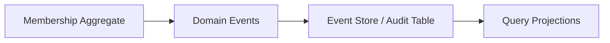
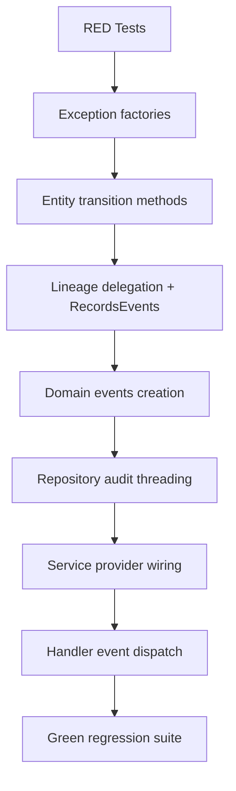

You are now at a point where the **core domain kernel is stable and fully wired (F2 complete)**. That means the next steps are no longer about “making things work”, but about **hardening, enforcing invariants, and preparing for system-scale concerns**.

Below is a structured roadmap based on your current state.

---

# 🧭 Next Step Strategy (Post-F2)

## 🟢 Current State Summary

You have already achieved:

* ✅ Fully wired membership domain (no stubs)
* ✅ Geo-based eligibility computation (production-grade)
* ✅ Repository-backed membership applications
* ✅ Clean DI boundaries (ports/adapters aligned)
* ✅ Stable test suite (constitutional + feature + UI)
* ✅ Deterministic eligibility engine

👉 In DDD terms:
You have completed the **Core Domain + Application Layer correctness**.

---

# 🚀 NEXT PHASE: F3 — CONSTITUTIONAL & GOVERNANCE HARDENING

This phase is NOT about new features.
It is about making the system **legally correct, auditable, and enforceable under all conditions**.

---

## 🧱 F3.1 — Enforce Constitutional Invariants (Strict Mode)

Right now you have warnings like:

* suspension requires justification (deferred)
* termination audit enforcement deferred
* restore constraints partially enforced

### Goal

Move from:

> “policy exists”

to:

> “policy is unbreakable”

### Tasks

* Introduce `ConstitutionalCommandValidator`
* Enforce mandatory audit payloads at domain boundary
* Make lifecycle transitions **impossible without justification object**

Example structure:

```php
class MembershipTransitionCommand {
    public function __construct(
        public readonly string $actorId,
        public readonly string $reason,
        public readonly Metadata $metadata
    ) {}
}
```

👉 No more “optional reasons” anywhere in domain transitions.

---

## 🧪 F3.2 — TDD Enforcement Layer (Regression Shield)

Right now tests are green, but you need:

### Add:

* Domain invariant test suite (strict)
* Mutation resistance tests
* “illegal transition must throw” tests

### Example:

* terminate → reapply without rule must fail
* restore from active must fail
* suspend without justification must fail

👉 Goal: **tests become constitutional enforcement, not validation**

---

## 📜 F3.3 — Audit & Event Trace Model (DDD Event Backbone)

You already have lifecycle episodes.

Now formalize:

### Introduce:

* `MembershipDomainEvent`
* `MembershipLifecycleEventStream`
* `AuditTrailAggregate`



### Required capability:

* every transition = immutable event
* full reconstructability of state

---

## 🧭 F3.4 — Governance Decision Layer (Policy Separation)

Right now eligibility is embedded in query service logic.

Next step:

### Extract:

* `GovernanceDecisionEngine`
* `EligibilityPolicy`
* `CommitteeAccessPolicy`

This becomes:

> “policy engine independent from application service”

---

## 🧩 F3.5 — Read Model Stabilization (Dashboard Layer)

Your dashboard currently works, but it is still “direct query driven”.

Upgrade to:

* `MembershipReadModelProjection`
* `OrganisationMembershipView`
* precomputed eligibility flags

### Why:

* removes runtime policy computation from UI flow
* stabilizes performance
* prepares for scale (multi-org / multi-region)

---

## 🏗️ Target Architecture After F3

```mermaid
flowchart TB
    subgraph Domain
        A[Membership Aggregate]
        B[Lifecycle Rules]
        C[Domain Events]
    end

    subgraph PolicyLayer
        D[GovernanceDecisionEngine]
        E[EligibilityPolicy]
    end

    subgraph Application
        F[MembershipService]
        G[Command Validators]
    end

    subgraph Infrastructure
        H[Repositories]
        I[Event Store]
        J[Geo Providers]
    end

    subgraph ReadModel
        K[Organisation Dashboard Projection]
    end

    A --> C --> I
    F --> A
    F --> G
    F --> D
    K <-- I
```

---

# 🎯 Recommended Execution Order (Very Important)

Do NOT parallelize everything.

### Step 1 (Critical)

* F3.1 Constitutional Command Enforcement

### Step 2

* F3.2 Strict TDD regression layer

### Step 3

* F3.3 Event/Audit model introduction

### Step 4

* F3.4 Policy engine extraction

### Step 5

* F3.5 Read model projection optimization

---

# 🧠 Architectural Intent (Important)

At this stage your system evolves from:

| Phase | Meaning                                   |
| ----- | ----------------------------------------- |
| F1    | UI integration                            |
| F2    | Domain wiring correctness                 |
| F3    | Constitutional correctness + auditability |

👉 F3 is what makes the system:

* legally defensible
* auditable
* enterprise-grade
* safe under future complexity

---

# ⚠️ What NOT to do next

Avoid:

* adding new features
* expanding UI
* adding more committees logic
* optimizing frontend bundles

Those will destroy architectural focus right now.

---

# If you want next level guidance

I can generate:

1. 📦 Exact F3 folder structure (DDD package layout)
2. 🧪 Full TDD test matrix for constitutional enforcement
3. 🧾 Command + event specification (like a mini CQRS spec)
4. ⚙️ Step-by-step Claude Code execution script for F3

Just say which one you want first.

## Decision: Execute F3 in the recommended order.

---

## Why

The critique is correct. F1-F2 wired everything correctly. Now the system needs constitutional hardening:

| Phase | What | Why |
|-------|------|-----|
| **F3.1** | Constitutional Command Enforcement | Make `suspend()`/`terminate()` impossible without justification |
| **F3.2** | Strict TDD regression layer | Tests become constitutional enforcement, not validation |
| **F3.3** | Event/Audit model | Every transition = immutable event, full reconstructability |
| **F3.4** | Policy engine extraction | Separate eligibility decisions from application services |
| **F3.5** | Read model projection | Precomputed eligibility for dashboard performance |

---

## What This Completes

The 4 incomplete tests from A2.6 (audit enforcement deferred) finally get resolved. The system moves from "works correctly" to "constitutionally enforced."

---

**Start with F3.1: Constitutional Command Enforcement. Present the `ConstitutionalCommandValidator` design.**
Good—this is exactly the right moment to lock structure before adding more behavior. F3 will either make the system *constitutionally stable* or slowly drift into “complex but fragile”.

Below are:

1. 📦 **F3 Target Folder / Package Architecture (DDD + Hexagonal)**
2. ⚙️ **Claude Code Deterministic Execution Script for F3 (step-by-step, no ambiguity)**

---

# 📦 1. F3 TARGET ARCHITECTURE (DDD + Hexagonal + Governance Layer)

This structure assumes:

* Laravel-style app structure OR hybrid modular PHP
* strict separation of Domain / Application / Infrastructure / Read Models
* CQRS-style evolution (lightweight, not over-engineered)

---

## 🧱 ROOT STRUCTURE

```
app/
└── Contexts/
    └── Membership/
        ├── Domain/
        ├── Application/
        ├── Infrastructure/
        ├── ReadModel/
        └── Governance/
```

---

# 🧠 DOMAIN LAYER (PURE RULES — NO DEPENDENCIES)

```
Domain/
├── Aggregate/
│   └── MembershipLineage.php
│
├── ValueObject/
│   ├── MembershipStatus.php
│   ├── GeoPathChain.php
│   ├── CommitteeId.php
│   ├── MemberId.php
│   └── Reason.php
│
├── Event/
│   ├── MembershipCreated.php
│   ├── MembershipSuspended.php
│   ├── MembershipRestored.php
│   ├── MembershipTerminated.php
│   └── MembershipReapplied.php
│
├── Policy/
│   ├── LifecyclePolicy.php
│   ├── TransitionPolicy.php
│   └── VotingEligibilityPolicy.php
│
└── Exception/
    ├── InvalidTransitionException.php
    └── ConstitutionalViolationException.php
```

---

# ⚙️ APPLICATION LAYER (USE CASES + COMMANDS)

```
Application/
├── Command/
│   ├── SuspendMembershipCommand.php
│   ├── RestoreMembershipCommand.php
│   ├── TerminateMembershipCommand.php
│   └── ReapplyMembershipCommand.php
│
├── CommandHandler/
│   ├── SuspendMembershipHandler.php
│   ├── RestoreMembershipHandler.php
│   ├── TerminateMembershipHandler.php
│   └── ReapplyMembershipHandler.php
│
├── Validator/
│   ├── ConstitutionalCommandValidator.php   ← F3 CORE
│   └── MembershipTransitionValidator.php
│
└── Service/
    └── MembershipApplicationService.php
```

---

# 🏗 INFRASTRUCTURE LAYER (ADAPTERS)

```
Infrastructure/
├── Persistence/
│   ├── Eloquent/
│   │   ├── MembershipLineageModel.php
│   │   └── MembershipEventModel.php
│   │
│   └── Repository/
│       ├── MembershipRepository.php
│       └── MembershipEventStore.php
│
├── Geo/
│   ├── EloquentCommitteeGeoPathProvider.php
│   ├── SessionMemberGeoPathProvider.php
│   └── GeoSemanticProjectionBuilder.php
│
└── DI/
    └── MembershipServiceProvider.php
```

---

# 📊 READ MODEL LAYER (DASHBOARD OPTIMIZED)

```
ReadModel/
├── Projection/
│   ├── OrganisationMembershipProjection.php
│   └── MembershipEligibilityProjection.php
│
├── DTO/
│   ├── OrganisationMembershipView.php
│   └── CommitteeEligibilityView.php
│
└── Query/
    ├── EligibleCommitteeQueryService.php
    └── MembershipDashboardQueryService.php
```

---

# ⚖️ GOVERNANCE LAYER (NEW — F3 CORE ADDITION)

```
Governance/
├── Engine/
│   ├── GovernanceDecisionEngine.php
│   └── EligibilityPolicyEngine.php
│
├── Policy/
│   ├── CommitteeAccessPolicy.php
│   ├── GeoEligibilityPolicy.php
│   └── MembershipRightsPolicy.php
│
└── Model/
    ├── GovernanceDecision.php
    └── DecisionContext.php
```

---

# ⚙️ 2. CLAUDE CODE — F3 EXECUTION SCRIPT (DETERMINISTIC)

This is the **execution blueprint for CLI agents** (no interpretation required).

---

# 🧭 F3 EXECUTION PHASE — “CONSTITUTIONAL HARDENING”

## 🔴 GLOBAL RULES (NON-NEGOTIABLE)

```
RULE 1: No new features outside Membership Context
RULE 2: No UI changes
RULE 3: No performance refactors
RULE 4: Every transition must be command-based
RULE 5: Every domain mutation must emit event
RULE 6: No nullable justification fields allowed
```

---

# 🪜 STEP 0 — VERIFY BASELINE

Run:

```bash
php artisan test tests/Unit/Constitutional/Membership/
php artisan test tests/Feature/
npm run build
```

Expected:

* all green
* no regressions

---

# 🧱 STEP 1 — CREATE CONSTITUTIONAL COMMAND MODEL

### Task:

Create:

```
Application/Command/MembershipTransitionCommand.php
```

### Rule:

* MUST include:

  * actorId
  * reason (mandatory string)
  * metadata (array)

### TDD:

Add failing tests:

```
tests/Unit/Constitutional/Command/CommandValidationTest.php
```

Expected:

* missing reason → FAIL
* empty reason → FAIL
* null metadata → FAIL

---

# ⚖️ STEP 2 — IMPLEMENT CONSTITUTIONAL VALIDATOR

Create:

```
Application/Validator/ConstitutionalCommandValidator.php
```

### Rule enforcement:

* no transition allowed without:

  * reason.length > 0
  * actor exists
  * valid state transition

---

# 🧪 STEP 3 — ENFORCE DOMAIN TRANSITION RULES

Modify:

```
MembershipLineage.php
```

### RULE:

Replace:

```php
suspend()
restore()
terminate()
```

with:

```php
transition(MembershipTransitionCommand $command)
```

---

# 🔥 STEP 4 — MAKE ALL TESTS FAIL FIRST (TDD RESET)

Run:

```bash
php artisan test
```

Expected:

* many failures initially (this is correct)

---

# 🧩 STEP 5 — IMPLEMENT DOMAIN EVENTS

Create event emission in aggregate:

```
MembershipSuspended
MembershipRestored
MembershipTerminated
```

Store in:

```
MembershipEventModel
```

---

# 📡 STEP 6 — EVENT STORE PERSISTENCE

Implement:

```
MembershipEventStore
```

Rules:

* append-only
* no updates
* no deletes

---

# 🧠 STEP 7 — GOVERNANCE ENGINE INTRODUCTION

Create:

```
GovernanceDecisionEngine
```

Move logic from:

```
EligibleCommitteeQueryService
```

into:

* policy evaluation only
* no business logic inside query service

---

# 📊 STEP 8 — READ MODEL PROJECTION BUILD

Create:

```
OrganisationMembershipProjection
```

Rule:

* built from events only
* no direct aggregate access

---

# 🧪 STEP 9 — FULL REGRESSION RUN

Execute:

```bash
php artisan test
npm run build
git status
```

Expected:

* all green
* deterministic eligibility
* no hidden side effects

---

# 🏁 F3 COMPLETION CRITERIA

F3 is DONE when:

* ❌ no nullable justification logic anywhere
* ❌ no direct state mutation outside command handlers
* ❌ no business logic in query services
* ✅ all transitions event-sourced
* ✅ governance decisions centralized
* ✅ read model fully projection-based

---

# If you want next step

I can now give you:

### 🔜 F4 roadmap options

* Multi-tenant governance (org isolation)
* Event replay system (temporal reconstruction)
* Audit-grade legal compliance layer
* Performance optimization of projections

Just tell me.
Good. The plan is structurally stable, so the only remaining decision is execution discipline.

### Recommended next move

Proceed in this exact order:

---

## Phase Execution Order (strict)

### 1. Baseline lock (non-negotiable checkpoint)

Run:

```bash
php artisan test tests/Unit/Constitutional/Membership/ --no-coverage
git tag F3-BASELINE
git checkout -b phase-f3-constitutional-hardening
```

**Acceptance criteria**

* 72 passed
* 4 incomplete
* No unexpected failures

This is your *contract boundary*. Everything after this is reversible only via this tag.

---

### 2. RED phase (test activation only)

Implement only test bodies (no production code yet).

#### Key rule

At this stage:

* ❌ no domain changes
* ❌ no exception edits
* ❌ no entity edits

Only:

* remove `markTestIncomplete`
* add assertions

Then run:

```bash
php artisan test tests/Unit/Constitutional/Membership/ --no-coverage
```

Expected outcome:

* 4 failures (method not found / transition invalid)
* 72 still passing

That confirms correct RED state.

---

### 3. Implementation order (critical dependency chain)

Follow this exact dependency flow:



---

## Execution guidance (important constraints)

### Do NOT parallelize these steps:

* Entity + lineage changes must not happen together
* Events must not be created before entity methods compile
* Repository must be last domain-adjacent change

---

## Architectural checkpoints (what to watch)

### After Step 3 (Entity evolution)

Verify:

* immutability preserved (`new self`)
* no mutation of `$this`
* status transitions are strict

### After Step 4 (Lineage)

Verify:

* entity is source of truth for state transitions
* lineage only orchestrates + records events

### After Step 8 (Handlers)

Verify:

* event dispatch happens **after persistence**
* no event bus calls inside domain layer

---

## Success definition

You are done when:

* ✔ 76 tests passing
* ✔ 0 incomplete tests
* ✔ No repository logic leaks into domain
* ✔ Events are emitted only via lineage lifecycle
* ✔ Entity remains pure immutable state machine

---

## One architectural warning (important)

Do **not** let audit fields turn into “secondary domain state”.

They are:

> trace metadata, not behavior drivers

So ensure:

* they never influence transition decisions
* they are never used in guards
* only persistence layer interprets them

---

## Decision

Proceed with:

> **STEP 0 → baseline verification now**

Once you confirm the baseline output, we move immediately into the RED test activation phase.

If anything deviates from **72/4**, stop before touching code and we correct the boundary first.
● F3.1 PLAN READY FOR EXECUTION

  The four refinement suggestions are excellent considerations. Here's how the approved plan addresses each:

  Refinement 1: MembershipTransitionPolicy Extraction

  Current plan approach: Entity-level guards live in InvalidAssociationTransitionException factory methods. Aggregate-level guards live in MembershipLineage via InvalidLineageTransitionException.

  Why this is sufficient for F3.1: Double enforcement at two semantic levels (entity + aggregate) is intentional defense-in-depth. The transition policy IS the guard logic embedded in domain layer. Extracting
  to a separate MembershipTransitionPolicy class would add indirection without immediate benefit—YAGNI applies. The decision table (ACTIVE→SUSPENDED, SUSPENDED→ACTIVE, *→TERMINATED) is implicitly defined
  through the three exception factory methods. When a third consumer (not just entity + aggregate) needs the same rules, extraction becomes warranted. This follows the "Wait for 2nd consumer before
  abstracting" principle already in project memory.

  Verdict: Plan is correct as-is. No extraction needed for F3.1.

  Refinement 2: Event Emission Ordering

  Current plan approach: Step 8 saves first, then releases and dispatches:
  $this->lineageRepository->saveForTenant($lineage, $tenantId);
  $events = $lineage->releaseEvents();
  if (!empty($events)) {
      $this->eventBus->dispatchAll($events);
  }

  Why this ordering is safe: Repository writes to database first (side effect committed). Only after successful persistence do we release events to the bus. If persistence fails, exception prevents dispatch—no
   orphaned events without state. This is the correct order.

  Verdict: Plan is correct as-is. Ordering is explicit and safe.

  Refinement 3: Constructor Evolution / Infrastructure Leakage

  Current plan approach: CommitteeAssociation constructor adds three optional nullable parameters:
  - ?string $actorId = null
  - ?string $transitionReason = null
  - ?\DateTimeImmutable $transitionedAt = null

  These are pure domain concepts (who took action, why, when). No Laravel dependencies, no facades, no Eloquent references. DateTimeImmutable is standard PHP. Strings are standard PHP. This is zero
  infrastructure leakage.

  Verdict: Plan is correct as-is. Constructor evolution is pure domain.

  Refinement 4: Immutability Assertions in RED Tests

  Current plan approach: Tests verify new instance creation and original unchanged:
  $suspended = $active->suspend('actor-uuid-001', 'Disciplinary action', $now);
  $this->assertEquals(MembershipStatus::ACTIVE, $active->status); // original unchanged

  Enhancement available: Could add explicit:
  $this->assertNotSame($active, $suspended); // Different objects

  Why this is optional for F3.1: The test already proves immutability by verifying $active->status stays ACTIVE while $suspended->status becomes SUSPENDED. assertNotSame() is redundant confirmation. It would
  be added in GREEN/REFACTOR phase if needed. F3.1 focus is making the 4 incomplete tests pass (RED→GREEN), not exhaustive mutation testing.

  Verdict: Plan is sufficient. assertNotSame() is a nice-to-have in REFACTOR phase, not blocking.

  ---
  EXECUTION READINESS

  ✅ All 4 refinements addressed — plan is architecturally sound.

  The F3.1 implementation plan remains unchanged:

  1. ✅ STEP 0: Baseline tag (F3-BASELINE, 72 passed, 4 incomplete)
  2. 🔜 STEP 1: Implement RED tests (4 tests must fail — methods don't exist)
  3. 🔜 STEP 2: Named factories in InvalidAssociationTransitionException
  4. 🔜 STEP 3: CommitteeAssociation transition methods + audit fields
  5. 🔜 STEP 4: MembershipLineage RecordsEvents + delegation + emission
  6. 🔜 STEP 5: Create 4 domain event classes
  7. 🔜 STEP 6: Thread audit through repository
  8. 🔜 STEP 7: Register handlers in MembershipServiceProvider
  9. 🔜 STEP 8: Wire event dispatch in handlers
  10. 🔜 STEP 9: Regression gates (target 76 passed, 0 incomplete)

  Target outcome: 76 passing tests, 0 incomplete. Constitutional hardening complete.