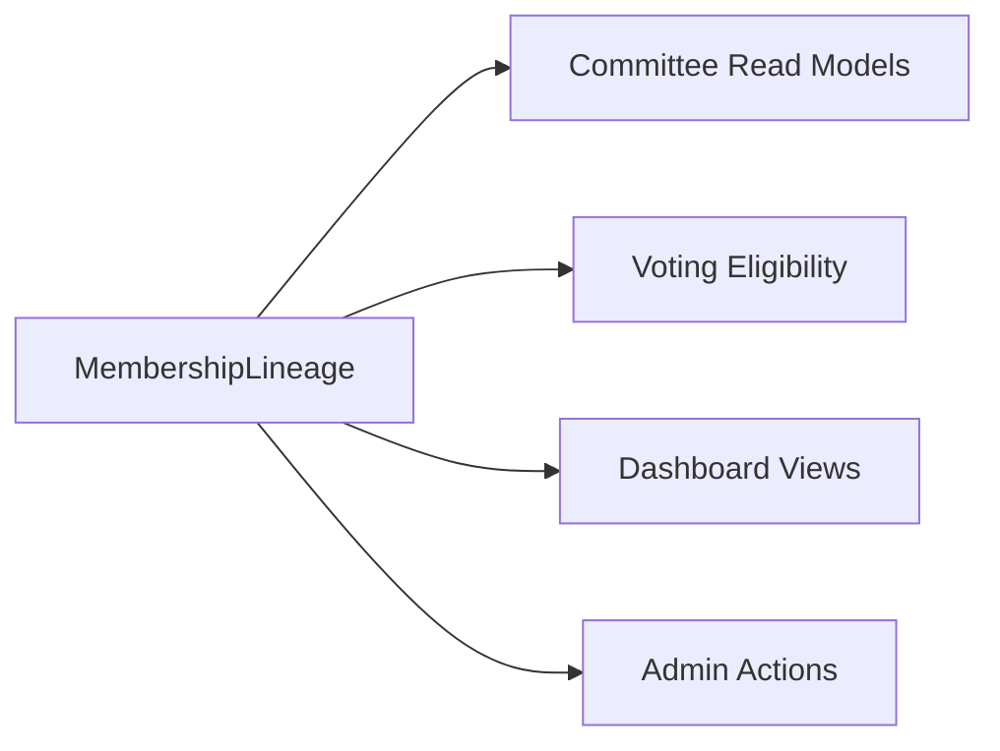

## Integrating Membership Context into Committee

---

### What Exists Today

```
Membership Context (What We Built):
  ✅ MembershipLineage (constitutional lifecycle)
  ✅ CommitteeAssociation (episode history)
  ✅ MembershipApplication (apply → approve → associate)
  ✅ VotingEligibilityPolicy
  ✅ EligibleCommitteeQueryService (Phase C)

Committee Context (Existing):
  ✅ Committee aggregate (operational: members, roles, geo jurisdiction)
  ✅ CommitteeManagementController (HTTP)
  ✅ CommitteeDashboardController
  ✅ Create.vue / Index.vue (UI)
```

---

### The Gap

The **Committee** aggregate has its own member management (`assignMember`, `removeMember`, `CommitteeAssignment`). But it doesn't use `MembershipLineage` — it doesn't know about constitutional membership state.

```
Committee::assignMember()  ← works directly, no lineage check
Committee Dashboard        ← shows members, but from old assignment system
```

---

### What Integration Means

| Current | After Integration |
|---------|-------------------|
| Committee has its own member list | Committee queries `MembershipLineage` for active members |
| `assignMember()` bypasses eligibility | Assignment validates via `CommitteeEligibilityPolicy` |
| Dashboard shows null member names | Dashboard shows names from `MembershipLineage` + User |
| "Who can vote?" not answerable | `$lineage->isEligibleForVoting()` |

---

### Integration Points (What To Wire)

```
1. Committee Dashboard (D1 — already fixed ✅)
   └── Now uses repositories, shows real member names

2. Committee Members List
   └── Replace direct DB queries with MembershipLineage queries
   └── "Active members" = lineages with isActive() === true

3. Assign Member Flow (E — partially done ✅)
   └── Before assigning, validate via Phase C eligibility

4. "My Committees" Widget (F1 — already done ✅)
   └── Shows member their active associations

5. Voting Eligibility (Phase B.3 — not yet)
   └── Committee elections query MembershipLineage for voter list
```

---

### What's Already Integrated

| Feature | Status |
|---------|--------|
| Dashboard member names (not null) | ✅ F1 |
| "My Committees" widget | ✅ F1 |
| Geo eligibility for committee applications | ✅ Phase C |
| Application → approval → lineage creation | ✅ D2 + E |

---

### What's NOT Yet Integrated

| Feature | Status |
|---------|--------|
| Committee "Members" tab shows lineage-based members | ❌ |
| `assignMember()` validates eligibility via Phase C | ❌ |
| Voting eligibility for committee elections | ❌ Phase B.3 |
| Committee dashboard shows member count from lineages | ❌ |
| Admin suspend/terminate membership from committee UI | ❌ |

---

### Next Step

The highest-value integration is:

**Committee "Members" tab → query `MembershipLineage` instead of old `CommitteeAssignment`**

This makes the committee dashboard reflect constitutional membership reality — who is ACTIVE, who is SUSPENDED, who is TERMINATED.

**Should we plan this integration?**
Yes — but this is no longer a “feature integration” step. It is a **bounded-context reconciliation step**, and it must be treated carefully because you are about to resolve a classic DDD anti-pattern:

> Two sources of truth for the same concept (membership)

Right now you have:

* **Membership Context** → constitutional truth (Lineage = source of authority)
* **Committee Context** → operational truth (legacy assignments = residual model)

That is a **temporary dual-model state**, not a stable architecture.

---

# 1. ARCHITECTURAL REALITY CHECK

## Current Situation (Important)

```text
MembershipContext  → owns truth (constitutional lifecycle)
CommitteeContext    → still owns local copy of membership state (legacy)
```

This is:

* not wrong (transitional)
* but **dangerous if it persists too long**

Because it creates:

* divergent state
* hidden write paths
* inconsistent UI truth
* eventual audit contradictions

---

# 2. TARGET STATE (END GOAL)

## Single Source of Truth



### Rule:

> Committee never owns membership state anymore
> It only *interprets* membership state.

---

# 3. DDD REFACTOR STRATEGY (SAFE MIGRATION)

We must avoid a “big bang replacement” of Committee.

So we introduce a **3-layer decoupling plan**:

---

## LAYER 1 — READ MODEL SHIFT (SAFE FIRST STEP)

### Replace:

```php
Committee::getMembers()
```

### With:

```php
MembershipLineageRepository::findActiveByCommittee($committeeId)
```

### Effect:

* No write changes
* Only query source changes
* Zero domain risk

---

## LAYER 2 — WRITE GUARD (ELIMINATE LEGACY RULES)

### Modify:

```php
Committee::assignMember()
```

### To become:

```php
throw new DomainException("Legacy assignment disabled — use MembershipApplication workflow");
```

OR transitional guard:

```php
if (!MembershipLineage::canBeAssigned($memberId)) {
    throw new MembershipNotEligibleException();
}
```

### Effect:

* Committee stops being authority
* Membership becomes gatekeeper

---

## LAYER 3 — EVENT-DRIVEN SYNC (OPTIONAL BUT STRONG)

Future direction:

```text
MembershipSuspended
   ↓
CommitteeReadModelUpdater
   ↓
Committee UI updates automatically
```

This is F3.3/F3.5 territory.

---

# 4. BOUNDARY REDEFINITION (CRITICAL)

## BEFORE

| Context    | Responsibility               |
| ---------- | ---------------------------- |
| Committee  | membership list + assignment |
| Membership | lifecycle only               |

---

## AFTER

| Context              | Responsibility                             |
| -------------------- | ------------------------------------------ |
| Committee            | structural governance (geo, roles, config) |
| Membership           | identity + lifecycle + eligibility         |
| Committee Read Model | projection only (no authority)             |

---

# 5. WHAT YOU SHOULD NOT DO

These are architectural traps:

### ❌ Do NOT:

* copy MembershipLineage into Committee tables
* sync via cron jobs (creates drift)
* keep dual write paths
* allow Committee to “decide eligibility”
* reintroduce `CommitteeAssignment` as authoritative model

---

# 6. MIGRATION PRIORITY ORDER

## Phase 1 (NOW — SAFE)

* Committee Members tab → read from MembershipLineage
* Replace UI queries only

## Phase 2

* Gate `assignMember()` behind MembershipLineage eligibility

## Phase 3

* Remove legacy CommitteeAssignment usage

## Phase 4 (F3.3/F3.5)

* Event-driven projection sync

---

# 7. DOMAIN RULE SHIFT (VERY IMPORTANT)

You are shifting this invariant:

## OLD RULE

> Committee decides who belongs to it

## NEW RULE

> Membership system decides where a member belongs

This is a **power relocation inside the domain model**

Not a refactor — a **redefinition of authority**

---

# 8. STRATEGIC IMPACT

This integration does something subtle but critical:

### It makes F3.2 meaningful beyond tests

Because now:

* MembershipLineage is not just “well designed”
* It becomes **operational truth source**
* Committee becomes a **projection consumer**

That is exactly what enables:

* F3.3 replay
* F3.4 governance layer
* F3.5 analytics projections

---

# 9. RECOMMENDED NEXT STEP

Yes — we should proceed, but in this order:

## STEP 1 (NEXT)

Design:

> “Committee Members Tab → MembershipLineage Read Model Adapter”

## STEP 2

Define:

* query contract
* DTO mapping
* repository boundary

## STEP 3

Only then touch UI

---

# FINAL ANSWER

Yes — this integration is correct and necessary.

But it is not a feature change.

It is:

> **A bounded-context authority migration from Committee → Membership**

---

If you want, next step I can design:

### → “Committee Membership Read Model Adapter (DDD-safe + UI-ready + no domain leakage)”

which will be the clean bridge between both systems without breaking F3 architecture.
## Decision: Execute the Bounded-Context Authority Migration

---

## What This Means

```
BEFORE (dual authority):
  Committee owns membership list → legacy assignments
  Membership owns lifecycle → constitutional truth
  ⚠️ Two sources of truth, possible divergence

AFTER (single authority):
  Membership owns ALL membership truth → single source
  Committee reads membership via adapter → projection only
  ✅ One source, no divergence possible
```

---

## Migration Sequence

| Phase | What | Risk | Effort |
|-------|------|------|--------|
| **1** | Committee Members tab → reads from `MembershipLineage` | Low | 1-2 hrs |
| **2** | Gate `assignMember()` behind lineage eligibility | Medium | 1 hr |
| **3** | Remove legacy `CommitteeAssignment` usage | Medium | 2 hrs |
| **4** | Event-driven sync (F3.3/F3.5) | Low | Future |

---

## Phase 1 (Now — Safe)

```
Committee Members Tab
  BEFORE: DB::table('committee_assignments')...
  AFTER:  $lineageRepo->findActiveLineagesByCommitteeForTenant($committeeId, $tenantId)
```

No write changes. Only query source changes. Zero domain risk.

---

**Start with Phase 1: Design the Committee Members Tab read model adapter.**
Good — this is exactly the right abstraction point to avoid contaminating the domain while still making the UI usable.

We’ll design this as a **read-side adapter + anti-corruption layer (ACL)** that sits between:

* **MembershipLineage (source of truth)**
* **Committee UI / Controller (consumer)**

It must guarantee:

* zero domain leakage
* no mutation capability
* no lifecycle logic duplication
* safe evolution toward F3.5 projections

---

# 1. ROLE OF THIS COMPONENT

## Name (recommended)

```
CommitteeMembershipReadModelAdapter
```

## Responsibility

> Translate constitutional membership state into UI-ready, committee-scoped read models.

It does NOT:

* enforce rules
* decide eligibility
* mutate state
* replicate domain logic

It ONLY:

* queries MembershipLineage
* transforms data
* exposes stable DTOs for UI

---

# 2. ARCHITECTURE POSITION

```mermaid
flowchart LR
    A[Committee Controller / Vue UI] --> B[Read Model Adapter]
    B --> C[MembershipLineage Repository]
    C --> D[Domain: CommitteeAssociation + Lineage]

    B --> E[DTOs only (UI safe)]
```

### Key idea:

> UI never touches domain objects again

---

# 3. BOUNDED CONTEXT RULES (IMPORTANT)

## Allowed

* Read-only queries
* DTO mapping
* Aggregation of lineage episodes
* Filtering ACTIVE/SUSPENDED/TERMINATED

## Forbidden

* calling suspend()/restore()/terminate()
* business rule evaluation beyond filtering
* modifying entities
* returning domain objects

---

# 4. CORE INTERFACE DESIGN

## File

```
app/Contexts/Committee/Application/ReadModel/CommitteeMembershipReadModelAdapter.php
```

---

## Interface

```php
interface CommitteeMembershipReadModelAdapter
{
    /**
     * Active members only (constitutional truth)
     */
    public function getActiveMembers(CommitteeId $committeeId): array;

    /**
     * Full membership history view (for admin UI)
     */
    public function getMembershipTimeline(CommitteeId $committeeId): array;

    /**
     * Member detail view (for sidebar / modal)
     */
    public function getMemberDetails(MemberId $memberId, CommitteeId $committeeId): ?CommitteeMemberView;

    /**
     * Membership counts (dashboard KPI)
     */
    public function getMembershipStats(CommitteeId $committeeId): CommitteeMembershipStats;
}
```

---

# 5. DTO MODEL (UI SAFE LAYER)

## 5.1 CommitteeMemberView

```php
final class CommitteeMemberView
{
    public function __construct(
        public string $memberId,
        public string $displayName,
        public string $status, // ACTIVE | SUSPENDED | TERMINATED
        public ?string $role,
        public \DateTimeImmutable $joinedAt,
        public ?\DateTimeImmutable $lastTransitionAt
    ) {}
}
```

---

## 5.2 CommitteeMembershipStats

```php
final class CommitteeMembershipStats
{
    public function __construct(
        public int $active,
        public int $suspended,
        public int $terminated,
        public int $total
    ) {}
}
```

---

## 5.3 CommitteeMemberTimelineView

```php
final class CommitteeMemberTimelineView
{
    public function __construct(
        public string $memberId,
        public array $episodes // immutable DTO list
    ) {}
}
```

---

# 6. IMPLEMENTATION STRATEGY (IMPORTANT)

## Step 1 — Query only ACTIVE members

```php
public function getActiveMembers(CommitteeId $committeeId): array
{
    $lineages = $this->repository->findByCommittee($committeeId);

    return array_values(
        array_map(
            fn($lineage) => $this->mapActive($lineage),
            array_filter($lineages, fn($l) => $l->isActive())
        )
    );
}
```

---

## Step 2 — Mapping layer (anti-corruption)

```php
private function mapActive(MembershipLineage $lineage): CommitteeMemberView
{
    $current = $lineage->current();

    return new CommitteeMemberView(
        memberId: $lineage->memberId()->value(),
        displayName: $this->resolveDisplayName($lineage->memberId()),
        status: $current->status->value,
        role: null, // future extension
        joinedAt: $current->associatedAt,
        lastTransitionAt: $current->transitionedAt
    );
}
```

---

## Step 3 — Stats aggregation

```php
public function getMembershipStats(CommitteeId $committeeId): CommitteeMembershipStats
{
    $lineages = $this->repository->findByCommittee($committeeId);

    $active = 0;
    $suspended = 0;
    $terminated = 0;

    foreach ($lineages as $lineage) {
        match ($lineage->current()->status) {
            MembershipStatus::ACTIVE => $active++,
            MembershipStatus::SUSPENDED => $suspended++,
            MembershipStatus::TERMINATED => $terminated++,
        };
    }

    return new CommitteeMembershipStats(
        active: $active,
        suspended: $suspended,
        terminated: $terminated,
        total: count($lineages)
    );
}
```

---

# 7. INTEGRATION POINTS

## 7.1 Committee Members Tab (PRIMARY USE)

Replace:

```php
CommitteeAssignment::query()
```

With:

```php
$adapter->getActiveMembers($committeeId);
```

---

## 7.2 Dashboard KPI

Replace legacy counters:

```php
$adapter->getMembershipStats($committeeId);
```

---

## 7.3 Member Detail Sidebar

```php
$adapter->getMemberDetails($memberId, $committeeId);
```

---

# 8. ARCHITECTURAL GUARANTEES

## This adapter ensures:

### ✔ No domain leakage

UI never sees `CommitteeAssociation`

### ✔ No mutation risk

Everything is DTO-based

### ✔ No policy duplication

No eligibility logic here

### ✔ Stable contract for F3.5 projections

Can later be replaced by event-read models

---

# 9. ANTI-PATTERN PROTECTION

This layer explicitly prevents:

* ❌ UI querying repository directly
* ❌ Committee owning membership logic
* ❌ duplication of lineage logic in controllers
* ❌ accidental domain object exposure
* ❌ mixing write logic into read path

---

# 10. STRATEGIC IMPORTANCE

This is not just a refactor.

This is the **READ MODEL FOUNDATION for F3.5**

Later evolution:

```text
DB → Adapter → DTOs
↓
Event Stream → Projection → Same DTOs
```

So F3.5 can replace the repository without touching UI.

---

# 11. FINAL RESULT

After this is in place:

## Committee becomes:

> A pure structural + UI aggregation layer

## Membership becomes:

> The only authority over membership truth

## UI becomes:

> Fully decoupled from domain complexity

---

# NEXT STEP

If you confirm, the next step is:

## → “Committee Members Tab Migration Plan (Vue + Controller + API replacement)”

Where we:

* remove CommitteeAssignment usage
* wire adapter into controller
* update Vue component safely
* ensure no behavioral regression

Just say:

**“migrate members tab”**
