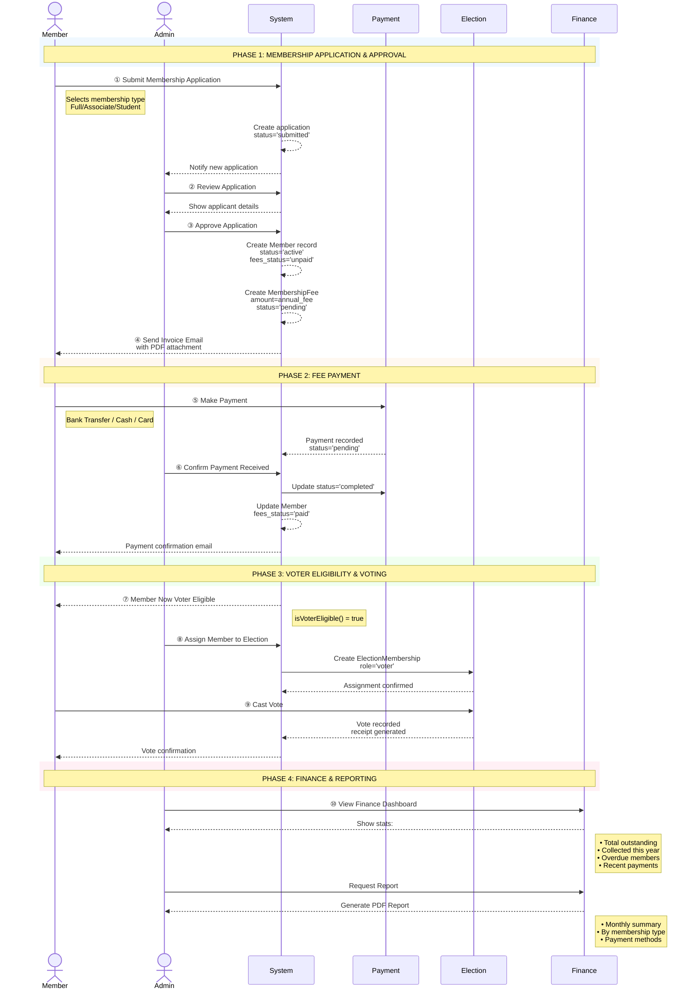
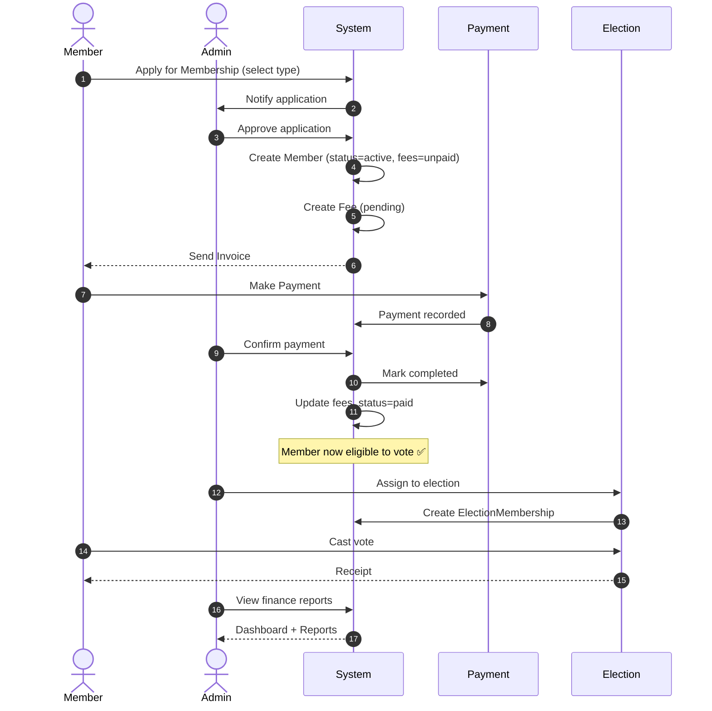
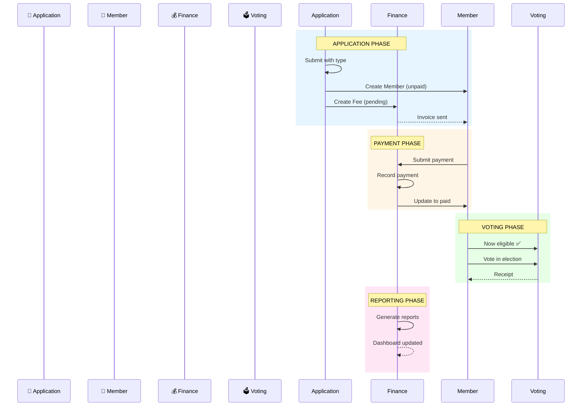

## Architecture: Full Membership with Finance Integration

### Current State: Election-Only Mode ✅

```
Election-Only Mode (Active)
├── CSV Import → Auto-create users
├── Direct voter assignment
└── No membership/finance validation
```

### Full Membership Mode with Finance

```
┌─────────────────────────────────────────────────────────────────────────────────┐
│                    FULL MEMBERSHIP WITH FINANCE SYSTEM                             │
├─────────────────────────────────────────────────────────────────────────────────┤
│                                                                                   │
│  ┌─────────────┐    ┌─────────────┐    ┌─────────────┐    ┌─────────────────────┐│
│  │   MEMBER    │───▶│     FEE     │───▶│   PAYMENT   │───▶│  VOTER ELIGIBILITY  ││
│  │  Application │    │  Assessment │    │  Processing │    │                     ││
│  └─────────────┘    └─────────────┘    └─────────────┘    └─────────────────────┘│
│                                                                                   │
│  Time: Application → Approval → Fee → Payment → Eligible → Vote                    │
│                                                                                   │
└─────────────────────────────────────────────────────────────────────────────────┘
```

### Phase 1: Enhanced Member Model

```php
// app/Models/Member.php
class Member extends Model
{
    protected $fillable = [
        'organisation_id',
        'organisation_user_id',
        'membership_type_id',
        'status',              // active, pending, expired, suspended
        'fees_status',         // unpaid, paid, exempt, overdue
        'joined_at',
        'expires_at',
        'membership_number',
    ];
    
    protected $casts = [
        'joined_at' => 'datetime',
        'expires_at' => 'datetime',
    ];
    
    // Relationships
    public function fees(): HasMany
    {
        return $this->hasMany(MembershipFee::class);
    }
    
    public function payments(): HasMany
    {
        return $this->hasMany(MembershipPayment::class);
    }
    
    public function outstandingBalance(): float
    {
        return $this->fees()
            ->where('status', 'pending')
            ->sum('amount');
    }
    
    public function isVoterEligible(): bool
    {
        return $this->status === 'active' 
            && in_array($this->fees_status, ['paid', 'exempt'])
            && ($this->expires_at === null || $this->expires_at->isFuture());
    }
}
```

### Phase 2: Fee Management System

```php
// database/migrations/create_membership_fees_table.php
Schema::create('membership_fees', function (Blueprint $table) {
    $table->uuid('id')->primary();
    $table->uuid('member_id');
    $table->uuid('organisation_id');
    $table->uuid('membership_type_id');
    $table->decimal('amount', 10, 2);
    $table->string('currency')->default('EUR');
    $table->string('description');
    $table->date('due_date');
    $table->string('status')->default('pending'); // pending, paid, waived, overdue
    $table->uuid('invoice_number')->unique();
    $table->timestamps();
    
    $table->foreign('member_id')->references('id')->on('members')->cascadeOnDelete();
});

// database/migrations/create_membership_payments_table.php
Schema::create('membership_payments', function (Blueprint $table) {
    $table->uuid('id')->primary();
    $table->uuid('member_id');
    $table->uuid('fee_id')->nullable();
    $table->decimal('amount', 10, 2);
    $table->string('currency')->default('EUR');
    $table->string('payment_method'); // bank_transfer, cash, stripe, paypal
    $table->string('transaction_id')->nullable();
    $table->string('status')->default('pending'); // pending, completed, failed, refunded
    $table->text('notes')->nullable();
    $table->uuid('recorded_by');
    $table->timestamp('paid_at')->nullable();
    $table->timestamps();
    
    $table->foreign('member_id')->references('id')->on('members')->cascadeOnDelete();
    $table->foreign('recorded_by')->references('id')->on('users');
});
```

### Phase 3: Finance Dashboard

```php
// app/Http/Controllers/FinanceController.php
class FinanceController extends Controller
{
    public function dashboard(Organisation $organisation)
    {
        $stats = [
            'total_members' => $organisation->members()->count(),
            'active_members' => $organisation->members()->where('status', 'active')->count(),
            'total_outstanding' => $organisation->members()
                ->join('membership_fees', 'members.id', '=', 'membership_fees.member_id')
                ->where('membership_fees.status', 'pending')
                ->sum('membership_fees.amount'),
            'collected_this_year' => $organisation->membershipPayments()
                ->whereYear('paid_at', now()->year)
                ->sum('amount'),
            'overdue_members' => $organisation->members()
                ->where('fees_status', 'overdue')
                ->count(),
        ];
        
        $recentPayments = $organisation->membershipPayments()
            ->with(['member.organisationUser.user'])
            ->latest()
            ->limit(10)
            ->get();
            
        $upcomingRenewals = $organisation->members()
            ->where('expires_at', '<=', now()->addDays(30))
            ->where('expires_at', '>', now())
            ->with(['organisationUser.user'])
            ->get();
        
        return Inertia::render('Finance/Dashboard', [
            'organisation' => $organisation,
            'stats' => $stats,
            'recentPayments' => $recentPayments,
            'upcomingRenewals' => $upcomingRenewals,
        ]);
    }
}
```

### Phase 4: Voter Eligibility Integration

```php
// app/Services/VoterEligibilityService.php (Enhanced)
class VoterEligibilityService
{
    public function isEligibleVoter(Organisation $org, User $user): bool
    {
        // Election-Only Mode
        if ($org->isElectionOnly()) {
            return OrganisationUser::where('organisation_id', $org->id)
                ->where('user_id', $user->id)
                ->where('status', 'active')
                ->exists();
        }
        
        // Full Membership Mode with Finance Validation
        $member = Member::where('organisation_id', $org->id)
            ->whereHas('organisationUser', fn($q) => $q->where('user_id', $user->id))
            ->first();
            
        if (!$member) {
            return false;
        }
        
        // Validate membership status
        if ($member->status !== 'active') {
            return false;
        }
        
        // Validate fees status
        if (!in_array($member->fees_status, ['paid', 'exempt'])) {
            return false;
        }
        
        // Validate membership not expired
        if ($member->expires_at && $member->expires_at->isPast()) {
            return false;
        }
        
        return true;
    }
}
```

### Phase 5: Invoice Generation

```php
// app/Services/InvoiceService.php
class InvoiceService
{
    public function generateForMember(Member $member, MembershipFee $fee): string
    {
        $invoiceNumber = sprintf(
            'INV-%s-%04d',
            now()->format('Ymd'),
            $member->id
        );
        
        $pdf = PDF::loadView('invoices.membership-fee', [
            'member' => $member,
            'fee' => $fee,
            'invoiceNumber' => $invoiceNumber,
            'organisation' => $member->organisation,
        ]);
        
        $path = "invoices/{$member->organisation_id}/{$invoiceNumber}.pdf";
        Storage::put($path, $pdf->output());
        
        $fee->update(['invoice_number' => $invoiceNumber]);
        
        return $path;
    }
    
    public function sendInvoice(Member $member, MembershipFee $fee): void
    {
        $path = $this->generateForMember($member, $fee);
        
        Mail::to($member->organisationUser->user->email)
            ->send(new MembershipInvoiceMail($member, $fee, $path));
            
        $fee->update(['invoice_sent_at' => now()]);
    }
}
```

### Phase 6: Automated Fee Scheduling

```php
// app/Jobs/GenerateAnnualMembershipFees.php
class GenerateAnnualMembershipFees implements ShouldQueue
{
    public function handle(): void
    {
        $members = Member::where('status', 'active')
            ->where('expires_at', '<=', now()->addDays(30))
            ->where('expires_at', '>', now()->subDays(7))
            ->get();
            
        foreach ($members as $member) {
            $existingFee = MembershipFee::where('member_id', $member->id)
                ->where('status', 'pending')
                ->whereYear('created_at', now()->year)
                ->exists();
                
            if (!$existingFee) {
                $fee = MembershipFee::create([
                    'member_id' => $member->id,
                    'organisation_id' => $member->organisation_id,
                    'membership_type_id' => $member->membership_type_id,
                    'amount' => $member->membershipType->annual_fee,
                    'description' => "Annual Membership Fee " . now()->year,
                    'due_date' => now()->addDays(30),
                    'status' => 'pending',
                ]);
                
                app(InvoiceService::class)->sendInvoice($member, $fee);
            }
        }
    }
}
```

### Phase 7: Finance Reports

```php
// app/Services/FinanceReportService.php
class FinanceReportService
{
    public function generateReport(Organisation $org, string $period): array
    {
        $startDate = match($period) {
            'this_month' => now()->startOfMonth(),
            'last_month' => now()->subMonth()->startOfMonth(),
            'this_year' => now()->startOfYear(),
            'last_year' => now()->subYear()->startOfYear(),
            default => now()->startOfMonth(),
        };
        
        $endDate = match($period) {
            'this_month' => now()->endOfMonth(),
            'last_month' => now()->subMonth()->endOfMonth(),
            'this_year' => now()->endOfYear(),
            'last_year' => now()->subYear()->endOfYear(),
            default => now()->endOfMonth(),
        };
        
        return [
            'period' => $period,
            'total_collected' => MembershipPayment::where('organisation_id', $org->id)
                ->whereBetween('paid_at', [$startDate, $endDate])
                ->where('status', 'completed')
                ->sum('amount'),
            'by_payment_method' => MembershipPayment::where('organisation_id', $org->id)
                ->whereBetween('paid_at', [$startDate, $endDate])
                ->where('status', 'completed')
                ->groupBy('payment_method')
                ->selectRaw('payment_method, SUM(amount) as total')
                ->get(),
            'new_members' => Member::where('organisation_id', $org->id)
                ->whereBetween('joined_at', [$startDate, $endDate])
                ->count(),
            'renewals' => MembershipPayment::where('organisation_id', $org->id)
                ->whereBetween('paid_at', [$startDate, $endDate])
                ->whereHas('fee', fn($q) => $q->where('description', 'like', '%Renewal%'))
                ->count(),
            'outstanding_balance' => MembershipFee::where('organisation_id', $org->id)
                ->where('status', 'pending')
                ->sum('amount'),
        ];
    }
}
```

### Summary

| Phase | Component | Purpose |
|-------|-----------|---------|
| 1 | Enhanced Member Model | Member status, fees_status, expiry |
| 2 | Fee & Payment Tables | Track fees and payments |
| 3 | Finance Dashboard | Overview of financial health |
| 4 | Voter Eligibility | Integrate finance with voting |
| 5 | Invoice Generation | PDF invoices for members |
| 6 | Automated Fee Scheduling | Annual renewal fees |
| 7 | Finance Reports | Period-based financial reports |

**Om Gam Ganapataye Namah** 🪔🐘

Shall we start with Phase 1: Enhanced Member Model?
## Full Membership Working Sequence

### Sequence Diagram

```
┌─────────────────────────────────────────────────────────────────────────────────────────────────────────────┐
│                              FULL MEMBERSHIP WITH FINANCE — COMPLETE WORKFLOW                                   │
├─────────────────────────────────────────────────────────────────────────────────────────────────────────────┤
│                                                                                                               │
│  ┌────────┐   ┌─────────┐   ┌────────┐   ┌─────────┐   ┌────────┐   ┌─────────┐   ┌────────┐   ┌──────────┐  │
│  │ MEMBER │   │  ADMIN  │   │ SYSTEM │   │ PAYMENT │   │ MEMBER │   │ ELECTION│   │ VOTING │   │ FINANCE  │  │
│  └───┬────┘   └────┬────┘   └───┬────┘   └────┬────┘   └───┬────┘   └────┬────┘   └───┬────┘   └────┬─────┘  │
│      │             │             │             │             │             │             │             │         │
│  ════╪═════════════╪═════════════╪═════════════╪═════════════╪═════════════╪═════════════╪═════════════╪═════════╡
│      │             │             │             │             │             │             │             │         │
│  ①   │ Apply for   │             │             │             │             │             │             │         │
│ ────▶│ Membership  │             │             │             │             │             │             │         │
│      │             │             │             │             │             │             │             │         │
│      │             │  ② Review   │             │             │             │             │             │         │
│      │             │◀────────────│             │             │             │             │             │         │
│      │             │  Application│             │             │             │             │             │         │
│      │             │             │             │             │             │             │             │         │
│      │             │  ③ Approve  │             │             │             │             │             │         │
│      │             │────────────▶│             │             │             │             │             │         │
│      │             │             │  Create     │             │             │             │             │         │
│      │             │             │  Member     │             │             │             │             │         │
│      │             │             │  + Fee      │             │             │             │             │         │
│      │             │             │             │             │             │             │             │         │
│      │  ④ Invoice  │             │             │             │             │             │             │         │
│      │◀────────────┼─────────────┼─────────────┼─────────────┼─────────────┼─────────────┼─────────────┼────────│
│      │  Sent       │             │             │             │             │             │             │         │
│      │             │             │             │             │             │             │             │         │
│      │  ⑤ Make     │             │             │             │             │             │             │         │
│ ────▶│  Payment    │             │────────────▶│             │             │             │             │         │
│      │             │             │             │  Process    │             │             │             │         │
│      │             │             │             │  Payment    │             │             │             │         │
│      │             │             │             │             │             │             │             │         │
│      │             │  ⑥ Payment  │             │             │             │             │             │         │
│      │             │◀────────────┼─────────────┼─────────────┼─────────────┼─────────────┼─────────────┼────────│
│      │             │  Recorded   │             │  Completed  │             │             │             │         │
│      │             │             │────────────▶│             │             │             │             │         │
│      │             │             │  Update     │             │             │             │             │         │
│      │             │             │  fees_status│             │             │             │             │         │
│      │             │             │  = 'paid'   │             │             │             │             │         │
│      │             │             │             │             │             │             │             │         │
│      │  ⑦ Member   │             │             │             │             │             │             │         │
│      │◀────────────┼─────────────┼─────────────┼─────────────┼─────────────┼─────────────┼─────────────┼────────│
│      │  Now Voter  │             │             │             │             │             │             │         │
│      │  Eligible   │             │             │             │             │             │             │         │
│      │             │             │             │             │             │             │             │         │
│      │             │  ⑧ Assign   │             │             │             │             │             │         │
│      │             │────────────▶│             │             │             │             │             │         │
│      │             │  to Election│────────────▶│             │             │────────────▶│             │         │
│      │             │             │             │             │             │             │             │         │
│      │  ⑨ Vote     │             │             │             │             │             │             │         │
│ ────┼─────────────┼─────────────┼─────────────┼─────────────┼─────────────┼─────────────┼────────────▶│         │
│      │             │             │             │             │             │             │  Cast Ballot│         │
│      │             │             │             │             │             │             │             │         │
│      │             │  ⑩ Finance  │             │             │             │             │             │         │
│      │             │◀────────────┼─────────────┼─────────────┼─────────────┼─────────────┼─────────────┼────────│
│      │             │  Dashboard  │             │             │             │             │             │         │
│      │             │  + Reports  │────────────▶│             │             │             │────────────▶│         │
│      │             │             │             │             │             │             │             │         │
│      ▼             ▼             ▼             ▼             ▼             ▼             ▼             ▼         │
│                                                                                                               │
└─────────────────────────────────────────────────────────────────────────────────────────────────────────────┘
```

### Detailed Step Description

| Step | Actor | Action | System Response |
|------|-------|--------|-----------------|
| ① | Member | Applies for membership via public form | Creates `membership_application` with status='submitted' |
| ② | Admin | Reviews application in dashboard | Views applicant details, documents |
| ③ | Admin | Approves application | Creates `Member` record (status='active', fees_status='unpaid'), creates `MembershipFee` (status='pending') |
| ④ | System | Sends invoice email | Generates PDF invoice, emails to member |
| ⑤ | Member | Makes payment (bank transfer/cash/card) | Payment recorded as 'pending' |
| ⑥ | Admin | Confirms payment received | Updates `MembershipPayment` status='completed', updates `Member.fees_status='paid'` |
| ⑦ | System | Member becomes voter-eligible | `isVoterEligible()` returns true |
| ⑧ | Admin | Assigns member to election | Creates `ElectionMembership` record |
| ⑨ | Member | Votes in election | Ballot submitted, vote recorded |
| ⑩ | Admin | Views finance dashboard | See outstanding fees, collected amounts, reports |

---

## Do We Need Membership Type for an Application?

### Yes, Membership Type is Required

| Reason | Explanation |
|--------|-------------|
| **Fee Amount** | Each membership type has different annual fee |
| **Voting Rights** | Some types grant voting, others don't (`grants_voting_rights`) |
| **Approval Flow** | Some types require approval, others auto-approve (`requires_approval`) |
| **Duration** | Different validity periods (1 year, 2 years, lifetime) |
| **Benefits** | Different member benefits per type |

### Membership Type Model

```php
// app/Models/MembershipType.php
class MembershipType extends Model
{
    protected $fillable = [
        'organisation_id',
        'name',                    // "Full Member", "Associate", "Student"
        'description',
        'annual_fee',              // 50.00
        'currency',                // EUR
        'validity_months',         // 12
        'grants_voting_rights',    // true
        'requires_approval',       // true
        'is_public',               // true (visible on application form)
        'max_members',             // null = unlimited
        'settings',                // JSON: additional benefits
    ];
    
    protected $casts = [
        'annual_fee' => 'decimal:2',
        'grants_voting_rights' => 'boolean',
        'requires_approval' => 'boolean',
        'is_public' => 'boolean',
        'settings' => 'array',
    ];
}
```

### Application Form with Type Selection

```
┌─────────────────────────────────────────────────────────────────────────────────┐
│                         MEMBERSHIP APPLICATION                                    │
├─────────────────────────────────────────────────────────────────────────────────┤
│                                                                                   │
│  Personal Information                                                             │
│  ┌─────────────────────────────────────────────────────────────────────────────┐ │
│  │  Name: [________________]  Email: [________________]                         │ │
│  └─────────────────────────────────────────────────────────────────────────────┘ │
│                                                                                   │
│  Select Membership Type                                                           │
│  ┌─────────────────────────────────────────────────────────────────────────────┐ │
│  │                                                                              │ │
│  │  ○ Full Member — €50/year                                                    │ │
│  │    • Full voting rights                                                      │ │
│  │    • Access to all elections                                                 │ │
│  │    • Annual renewal                                                          │ │
│  │                                                                              │ │
│  │  ○ Associate Member — €25/year                                               │ │
│  │    • Limited voting (certain elections only)                                 │ │
│  │    • Newsletter access                                                       │ │
│  │                                                                              │ │
│  │  ○ Student Member — €15/year                                                 │ │
│  │    • Full voting rights                                                      │ │
│  │    • Valid student ID required                                               │ │
│  │                                                                              │ │
│  └─────────────────────────────────────────────────────────────────────────────┘ │
│                                                                                   │
│  [Submit Application]                                                             │
│                                                                                   │
└─────────────────────────────────────────────────────────────────────────────────┘
```

### Application Processing Based on Type

```php
// app/Http/Controllers/MembershipApplicationController.php
public function store(Request $request, Organisation $organisation)
{
    $validated = $request->validate([
        'membership_type_id' => 'required|exists:membership_types,id',
        // ... other fields
    ]);
    
    $membershipType = MembershipType::find($validated['membership_type_id']);
    
    $application = MembershipApplication::create([
        ...$validated,
        'organisation_id' => $organisation->id,
        'status' => $membershipType->requires_approval ? 'submitted' : 'approved',
    ]);
    
    // Auto-approve if type doesn't require approval
    if (!$membershipType->requires_approval) {
        $this->approveApplication($application);
    }
    
    return redirect()->back()->with('success', 'Application submitted.');
}
```

### Summary: Membership Type is Essential

| Aspect | With Membership Type | Without |
|--------|---------------------|---------|
| Fee calculation | ✅ Automatic based on type | ❌ Manual per member |
| Voting rights | ✅ Type-based | ❌ Manual per member |
| Approval workflow | ✅ Configurable per type | ❌ One-size-fits-all |
| Reporting | ✅ Group by type | ❌ No categorization |
| Renewals | ✅ Type-specific | ❌ Manual tracking |

**Om Gam Ganapataye Namah** 🪔🐘

Yes, membership type is required for proper fee calculation and voting rights management.
## Mermaid Sequence Diagram



## Alternative: Compact Vertical Sequence



## Phase-Based Swimlane Diagram



**Om Gam Ganapataye Namah** 🪔🐘
