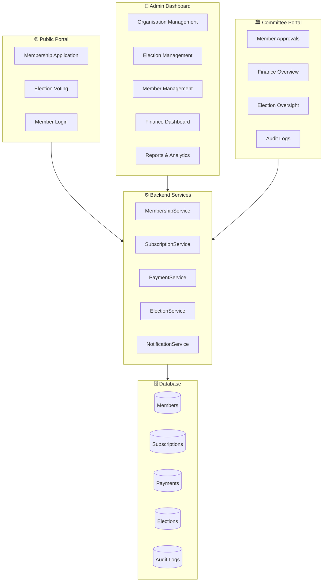
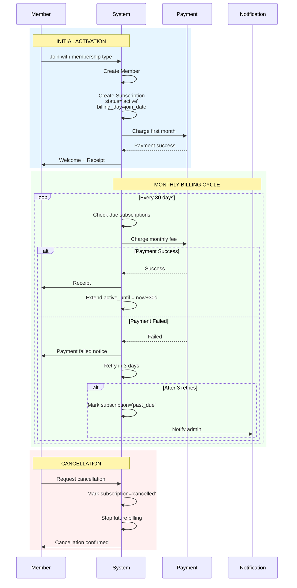
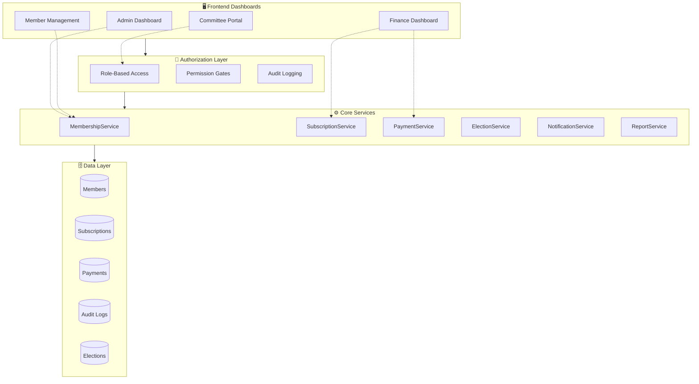

## Complete Architecture Review: Full Membership System

### System Overview



---

## Phase 1: Frontend Dashboards

### 1.1 Admin Dashboard

```
┌─────────────────────────────────────────────────────────────────────────────────┐
│                         ADMIN DASHBOARD — Overview                                 │
├─────────────────────────────────────────────────────────────────────────────────┤
│                                                                                   │
│  ┌──────────────┐ ┌──────────────┐ ┌──────────────┐ ┌──────────────┐             │
│  │ Total Members│ │ Active       │ │ Pending Fees │ │ Monthly      │             │
│  │     1,234    │ │    987       │ │   €4,560     │ │ Revenue €8.2K│             │
│  └──────────────┘ └──────────────┘ └──────────────┘ └──────────────┘             │
│                                                                                   │
│  ┌─────────────────────────────────────┐ ┌─────────────────────────────────────┐  │
│  │ 📈 Membership Growth (Last 6 Months) │ │ 🥧 Members by Type                   │  │
│  │                                     │ │                                     │  │
│  │        ╱╲                           │ │   ○ Full: 65%                       │  │
│  │       ╱  ╲      ╱╲                 │ │   ○ Associate: 20%                  │  │
│  │      ╱    ╲    ╱  ╲                │ │   ○ Student: 12%                    │  │
│  │     ╱      ╲  ╱    ╲               │ │   ○ Honorary: 3%                    │  │
│  │    ╱        ╲╱      ╲              │ │                                     │  │
│  │  Jan Feb Mar Apr May Jun            │ │                                     │  │
│  └─────────────────────────────────────┘ └─────────────────────────────────────┘  │
│                                                                                   │
│  ┌─────────────────────────────────────────────────────────────────────────────┐ │
│  │ 🔔 Recent Activities                                                          │ │
│  │ • John Doe renewed membership — 5 min ago                                    │ │
│  │ • New application from Jane Smith — 1 hour ago                               │ │
│  │ • Payment received €50 from Robert Klein — 2 hours ago                       │ │
│  │ • Election "Annual Meeting 2026" started — 1 day ago                         │ │
│  └─────────────────────────────────────────────────────────────────────────────┘ │
│                                                                                   │
│  ┌─────────────────────────────────┐ ┌─────────────────────────────────────────┐  │
│  │ ⚡ Quick Actions                 │ │ 📋 Upcoming Renewals (Next 30 days)     │  │
│  │                                 │ │                                         │  │
│  │ [ + Add Member ]                │ │ • Maria Schmidt — Apr 20 (€50)          │  │
│  │ [ 📊 Generate Report ]          │ │ • Hans Müller — Apr 22 (€75)            │  │
│  │ [ 📧 Send Newsletter ]          │ │ • Anna Weber — Apr 25 (€50)             │  │
│  │ [ 🗳️ Create Election ]           │ │ • 12 more...                            │  │
│  └─────────────────────────────────┘ └─────────────────────────────────────────┘  │
│                                                                                   │
└─────────────────────────────────────────────────────────────────────────────────┘
```

### 1.2 Finance Dashboard

```
┌─────────────────────────────────────────────────────────────────────────────────┐
│                         FINANCE DASHBOARD                                          │
├─────────────────────────────────────────────────────────────────────────────────┤
│                                                                                   │
│  Period: [This Month ▼]  [This Year ▼]  [Custom ▼]                               │
│                                                                                   │
│  ┌──────────────────┐ ┌──────────────────┐ ┌──────────────────┐ ┌──────────────┐ │
│  │ Total Revenue    │ │ Outstanding      │ │ Overdue          │ │ Avg per       │ │
│  │ (This Month)     │ │ Balance          │ │ Payments         │ │ Member        │ │
│  │                  │ │                  │ │                  │ │               │ │
│  │    €12,450       │ │    €3,280        │ │    €890          │ │    €42.50     │ │
│  │    ↑ 12%         │ │    ↓ 5%          │ │    ↑ 2%          │ │    → 0%       │ │
│  └──────────────────┘ └──────────────────┘ └──────────────────┘ └──────────────┘ │
│                                                                                   │
│  ┌─────────────────────────────────────────────────────────────────────────────┐ │
│  │ 📊 Revenue Trend (Last 12 Months)                                             │ │
│  │                                                                              │ │
│  │  15K ┤                    ╱╲                                                  │ │
│  │  12K ┤        ╱╲         ╱  ╲       ╱╲                                      │ │
│  │   9K ┤       ╱  ╲   ╱╲  ╱    ╲     ╱  ╲    ╱╲                              │ │
│  │   6K ┤   ╱╲ ╱    ╲ ╱  ╲╱      ╲   ╱    ╲  ╱  ╲                             │ │
│  │   3K ┤  ╱  ╱      ╲╱              ╲╱      ╲╱    ╲                            │ │
│  │      └──────────────────────────────────────────────────────────────────────┤ │
│  │        Jan Feb Mar Apr May Jun Jul Aug Sep Oct Nov Dec                        │ │
│  └─────────────────────────────────────────────────────────────────────────────┘ │
│                                                                                   │
│  ┌─────────────────────────────────┐ ┌─────────────────────────────────────────┐  │
│  │ 💳 Payment Methods Breakdown     │ │ 📋 Pending Payments (Requires Action)    │  │
│  │                                 │ │                                         │  │
│  │ ████████████░░░░ Bank 45%       │ │ • Peter Wagner — €50 (3 days overdue)    │  │
│  │ ████████░░░░░░░░ Cash 30%       │ │ • Lisa Klein — €75 (due today)           │  │
│  │ ████░░░░░░░░░░░░ Card 15%       │ │ • Thomas Braun — €50 (due tomorrow)      │  │
│  │ ██░░░░░░░░░░░░░░ Other 10%      │ │                                         │  │
│  └─────────────────────────────────┘ └─────────────────────────────────────────┘  │
│                                                                                   │
│  [ 📥 Export CSV ]  [ 📄 Generate Invoice ]  [ 📧 Send Reminders ]                │
│                                                                                   │
└─────────────────────────────────────────────────────────────────────────────────┘
```

### 1.3 Member Management Dashboard

```
┌─────────────────────────────────────────────────────────────────────────────────┐
│                         MEMBER MANAGEMENT                                          │
├─────────────────────────────────────────────────────────────────────────────────┤
│                                                                                   │
│  🔍 Search: [________________]  Filter: [All Statuses ▼]  [All Types ▼]          │
│                                                                                   │
│  ┌─────────────────────────────────────────────────────────────────────────────┐ │
│  │ Name            │ Type      │ Status   │ Fee Status │ Expires    │ Actions    │ │
│  ├─────────────────┼───────────┼──────────┼────────────┼────────────┼────────────┤ │
│  │ John Doe        │ Full      │ 🟢 Active│ 💚 Paid    │ Dec 2026   │ [···]     │ │
│  │ j***@email.com  │           │          │            │            │            │ │
│  ├─────────────────┼───────────┼──────────┼────────────┼────────────┼────────────┤ │
│  │ Maria Schmidt   │ Full      │ 🟡 Pending│ 🔴 Unpaid  │ —          │ [···]     │ │
│  │ m***@email.com  │           │ Approval │            │            │            │ │
│  ├─────────────────┼───────────┼──────────┼────────────┼────────────┼────────────┤ │
│  │ Hans Müller     │ Associate │ 🟢 Active│ 🧡 Overdue │ Mar 2026   │ [···]     │ │
│  │ h***@email.com  │           │          │            │            │            │ │
│  ├─────────────────┼───────────┼──────────┼────────────┼────────────┼────────────┤ │
│  │ Anna Weber      │ Student   │ 🔴 Expired│ 💚 Paid    │ Jan 2026   │ [···]     │ │
│  │ a***@email.com  │           │          │            │            │            │ │
│  └─────────────────────────────────────────────────────────────────────────────┘ │
│                                                                                   │
│  Page 1 of 25  [←] [→]                                                           │
│                                                                                   │
│  [ + Add Member ]  [ 📧 Bulk Email ]  [ 📊 Export ]                               │
│                                                                                   │
└─────────────────────────────────────────────────────────────────────────────────┘
```

---

## Phase 2: Monthly Subscription System (Unlimited)

### 2.1 Subscription Model



### 2.2 Subscription Database Schema

```php
// database/migrations/create_subscriptions_table.php
Schema::create('subscriptions', function (Blueprint $table) {
    $table->uuid('id')->primary();
    $table->uuid('member_id');
    $table->uuid('organisation_id');
    $table->uuid('membership_type_id');
    
    // Subscription details
    $table->decimal('monthly_fee', 10, 2);
    $table->string('currency')->default('EUR');
    $table->unsignedTinyInteger('billing_day'); // 1-28 (day of month)
    
    // Status tracking
    $table->string('status')->default('active');
    // active, past_due, cancelled, paused
    
    // Dates
    $table->timestamp('started_at');
    $table->timestamp('active_until'); // Current paid-through date
    $table->timestamp('cancelled_at')->nullable();
    $table->timestamp('next_billing_at');
    
    // Payment tracking
    $table->unsignedInteger('consecutive_failures')->default(0);
    $table->timestamp('last_payment_at')->nullable();
    $table->string('last_payment_status')->nullable();
    
    $table->timestamps();
    
    $table->foreign('member_id')->references('id')->on('members')->cascadeOnDelete();
    $table->index(['status', 'next_billing_at']);
});

// Subscription payment history
Schema::create('subscription_payments', function (Blueprint $table) {
    $table->uuid('id')->primary();
    $table->uuid('subscription_id');
    $table->uuid('member_id');
    $table->decimal('amount', 10, 2);
    $table->string('currency')->default('EUR');
    $table->string('status'); // success, failed, refunded
    $table->string('payment_method');
    $table->string('transaction_id')->nullable();
    $table->text('failure_reason')->nullable();
    $table->timestamp('billed_at');
    $table->timestamps();
    
    $table->foreign('subscription_id')->references('id')->on('subscriptions');
});
```

### 2.3 Subscription Service

```php
// app/Services/SubscriptionService.php
class SubscriptionService
{
    private const RETRY_ATTEMPTS = 3;
    private const RETRY_DELAY_DAYS = 3;
    
    public function processDailyBilling(): void
    {
        $dueSubscriptions = Subscription::where('status', 'active')
            ->where('next_billing_at', '<=', now())
            ->where('active_until', '<=', now())
            ->get();
            
        foreach ($dueSubscriptions as $subscription) {
            $this->billSubscription($subscription);
        }
    }
    
    private function billSubscription(Subscription $subscription): void
    {
        try {
            $payment = $this->processPayment($subscription);
            
            if ($payment->successful) {
                $subscription->update([
                    'active_until' => now()->addDays(30),
                    'next_billing_at' => now()->addDays(30),
                    'consecutive_failures' => 0,
                    'last_payment_at' => now(),
                    'last_payment_status' => 'success',
                ]);
                
                $subscription->member->update(['fees_status' => 'paid']);
                
                SubscriptionPayment::create([
                    'subscription_id' => $subscription->id,
                    'member_id' => $subscription->member_id,
                    'amount' => $subscription->monthly_fee,
                    'status' => 'success',
                    'payment_method' => $subscription->payment_method,
                    'transaction_id' => $payment->transaction_id,
                    'billed_at' => now(),
                ]);
                
                // Send receipt
                SendSubscriptionReceipt::dispatch($subscription, $payment);
            }
        } catch (PaymentFailedException $e) {
            $this->handlePaymentFailure($subscription, $e);
        }
    }
    
    private function handlePaymentFailure(Subscription $subscription, PaymentFailedException $e): void
    {
        $failures = $subscription->consecutive_failures + 1;
        
        SubscriptionPayment::create([
            'subscription_id' => $subscription->id,
            'member_id' => $subscription->member_id,
            'amount' => $subscription->monthly_fee,
            'status' => 'failed',
            'failure_reason' => $e->getMessage(),
            'billed_at' => now(),
        ]);
        
        if ($failures >= self::RETRY_ATTEMPTS) {
            $subscription->update([
                'status' => 'past_due',
                'consecutive_failures' => $failures,
                'next_billing_at' => null,
            ]);
            
            $subscription->member->update(['fees_status' => 'overdue']);
            
            // Notify admin
            NotifyAdminOfFailedSubscription::dispatch($subscription);
        } else {
            $subscription->update([
                'consecutive_failures' => $failures,
                'next_billing_at' => now()->addDays(self::RETRY_DELAY_DAYS),
            ]);
            
            // Notify member
            SendPaymentFailedNotice::dispatch($subscription);
        }
    }
}
```

---

## Phase 3: Membership Management Committee

### 3.1 Committee Roles & Permissions

```php
// app/Models/UserOrganisationRole.php - Extended
class UserOrganisationRole extends Model
{
    // Existing roles: owner, admin, member
    // NEW committee roles:
    public const ROLE_FINANCE_OFFICER = 'finance_officer';
    public const ROLE_MEMBERSHIP_SECRETARY = 'membership_secretary';
    public const ROLE_ELECTION_COMMISSIONER = 'election_commissioner';
    public const ROLE_AUDITOR = 'auditor';
    
    public const COMMITTEE_ROLES = [
        self::ROLE_FINANCE_OFFICER,
        self::ROLE_MEMBERSHIP_SECRETARY,
        self::ROLE_ELECTION_COMMISSIONER,
        self::ROLE_AUDITOR,
    ];
}
```

### 3.2 Permission Matrix

| Permission | Owner | Admin | Finance Officer | Membership Secretary | Election Commissioner | Auditor |
|------------|-------|-------|-----------------|----------------------|----------------------|---------|
| View Dashboard | ✅ | ✅ | ✅ | ✅ | ✅ | ✅ |
| Manage Members | ✅ | ✅ | ❌ | ✅ | ❌ | ❌ |
| Approve Applications | ✅ | ✅ | ❌ | ✅ | ❌ | ❌ |
| View Finance | ✅ | ✅ | ✅ | ❌ | ❌ | ✅ |
| Process Payments | ✅ | ✅ | ✅ | ❌ | ❌ | ❌ |
| Export Reports | ✅ | ✅ | ✅ | ✅ | ✅ | ✅ |
| Manage Elections | ✅ | ✅ | ❌ | ❌ | ✅ | ❌ |
| View Audit Logs | ✅ | ✅ | ❌ | ❌ | ❌ | ✅ |
| Manage Committee | ✅ | ❌ | ❌ | ❌ | ❌ | ❌ |

### 3.3 Committee Dashboard

```
┌─────────────────────────────────────────────────────────────────────────────────┐
│                    MEMBERSHIP COMMITTEE DASHBOARD                                  │
│                    Namaste Nepal GmbH — Finance Officer View                        │
├─────────────────────────────────────────────────────────────────────────────────┤
│                                                                                   │
│  Welcome, Finance Officer!                                                        │
│                                                                                   │
│  ┌──────────────────┐ ┌──────────────────┐ ┌──────────────────┐ ┌──────────────┐ │
│  │ Monthly Revenue  │ │ Outstanding      │ │ Overdue          │ │ Pending       │ │
│  │                  │ │ Balance          │ │ Subscriptions    │ │ Approvals     │ │
│  │    €12,450       │ │    €3,280        │ │    23 members    │ │     5         │ │
│  └──────────────────┘ └──────────────────┘ └──────────────────┘ └──────────────┘ │
│                                                                                   │
│  ┌─────────────────────────────────────────────────────────────────────────────┐ │
│  │ 📋 Your Tasks                                                                 │ │
│  │                                                                              │ │
│  │ • 3 pending payment confirmations                                            │ │
│  │ • Monthly finance report due in 5 days                                       │ │
│  │ • 12 subscription renewals this week                                         │ │
│  │ • Review overdue accounts (23 members)                                       │ │
│  └─────────────────────────────────────────────────────────────────────────────┘ │
│                                                                                   │
│  ┌─────────────────────────────────────────────────────────────────────────────┐ │
│  │ 💰 Recent Transactions (Last 7 Days)                                          │ │
│  │                                                                              │ │
│  │ Date       │ Member           │ Amount │ Method     │ Status                 │ │
│  │────────────┼──────────────────┼────────┼────────────┼────────────────────────│ │
│  │ Apr 15     │ John Doe         │ €50    │ Bank       │ ✅ Completed           │ │
│  │ Apr 15     │ Maria Schmidt    │ €50    │ Cash       │ ⏳ Pending             │ │
│  │ Apr 14     │ Hans Müller      │ €25    │ Bank       │ ✅ Completed           │ │
│  │ Apr 14     │ Anna Weber       │ €15    │ Card       │ ✅ Completed           │ │
│  └─────────────────────────────────────────────────────────────────────────────┘ │
│                                                                                   │
│  [ 📊 Generate Report ]  [ 💳 Record Payment ]  [ 📧 Send Reminders ]            │
│                                                                                   │
└─────────────────────────────────────────────────────────────────────────────────┘
```

### 3.4 Audit Log for Committee Actions

```php
// app/Models/AuditLog.php
class AuditLog extends Model
{
    protected $fillable = [
        'organisation_id',
        'user_id',
        'action',           // 'member.approved', 'payment.recorded', 'subscription.cancelled'
        'entity_type',      // 'Member', 'Subscription', 'Payment'
        'entity_id',
        'old_values',
        'new_values',
        'ip_address',
        'user_agent',
    ];
    
    protected $casts = [
        'old_values' => 'array',
        'new_values' => 'array',
    ];
}

// Log every committee action
class AuditLogger
{
    public static function log(string $action, $entity, array $oldValues = [], array $newValues = []): void
    {
        AuditLog::create([
            'organisation_id' => session('current_organisation_id'),
            'user_id' => auth()->id(),
            'action' => $action,
            'entity_type' => get_class($entity),
            'entity_id' => $entity->id,
            'old_values' => $oldValues,
            'new_values' => $newValues,
            'ip_address' => request()->ip(),
            'user_agent' => request()->userAgent(),
        ]);
    }
}
```

---

## Complete Architecture Summary



### Implementation Phases

| Phase | Deliverable | Timeline |
|-------|-------------|----------|
| 1 | Admin & Finance Dashboards | Week 1-2 |
| 2 | Monthly Subscription System | Week 2-3 |
| 3 | Committee Roles & Permissions | Week 3-4 |
| 4 | Audit Logging | Week 4 |
| 5 | Reports & Analytics | Week 5 |
| 6 | Testing & Deployment | Week 6 |

**Om Gam Ganapataye Namah** 🪔🐘