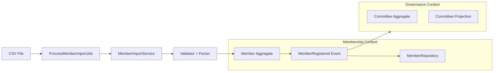

This is an excellent review because it forces the **most important DDD discipline in real systems**:

> ❗ “Architecture must match system maturity, not architectural ideals.”

So now we converge into a **hybrid, evolutionary DDD model** — not over-designed, not under-modeled.

---

# 🧠 1. Core Agreement (Between Both Views)

Both perspectives are correct in different dimensions:

## ChatGPT vision (STRUCTURAL TRUTH)

* Identity ≠ Membership ✔
* Events as backbone ✔
* Import must be domain-safe ✔
* Context boundaries exist ✔

## Ganesh Ji review (MATURITY TRUTH)

* System is still small ✔
* Too many contexts = premature complexity ✔
* Focus on fixing real pain first ✔
* Avoid speculative architecture ✔

---

# ⚖️ 2. The Correct Hybrid Principle

## 🔥 Final rule:

> **Model separation of concerns logically, but implement physically inside existing contexts until pain forces extraction.**

This is classic:

```yaml
DDD Strategy: "Modular Monolith with Future Context Extraction"
```

---

# 🧭 3. Final Hybrid Architecture (Correct Version)

Instead of adding new contexts now, we do this:

---

## 🟩 KEEP ONLY 2 CONTEXTS (CURRENT SYSTEM TRUTH)

### 1. Membership Context (REAL DOMAIN)

Owns:

* Member aggregate
* MembershipType
* PersonalInfo
* Member lifecycle
* MemberRegistered event

---

### 2. Governance Context (REAL DOMAIN)

Owns:

* Committee aggregate
* Committee membership
* Committee roles (future)
* CommitteeMemberProjection

---

## 🟨 ADD ONLY ONE STRUCTURAL LAYER (NOT A CONTEXT)

### 👉 Application Layer inside Membership Context

```yaml
Membership Context:
  Domain Layer:
    - Member aggregate
    - events

  Application Layer:
    - MemberImportService   ← NEW (IMPORTANT)
    - MemberImportValidator
    - MemberCsvParser

  Infrastructure Layer:
    - repositories
    - jobs (ProcessMemberImportJob)
```

---

## 🚫 DO NOT CREATE YET

```yaml
DO NOT CREATE:
  ❌ Identity Context
  ❌ Import Context
  ❌ Role System Context

WHY:
  - no real permission complexity yet
  - no multi-tenant governance rules yet
  - no scale pressure yet
```

---

# 🧩 4. Reconciled Architecture View



---

# 🧠 5. Key Insight (VERY IMPORTANT)

You are NOT choosing between:

* ChatGPT architecture ❌
* Ganesh simplicity ❌

You are building:

> 🧠 **Progressive DDD (Evolutionary Architecture)**

---

# 📈 6. Evolution Roadmap (IMPORTANT BALANCE)

## Phase 1 — NOW (Fix Reality)

```yaml
Goal:
  Make import domain-safe

Actions:
  ✔ Introduce MemberImportService
  ✔ Remove DB::table from job
  ✔ Use Member::register()
  ✔ Ensure events fire

NO new contexts
NO roles system
```

---

## Phase 2 — SOON (When pain appears)

```yaml
Trigger:
  - committee roles logic increases
  - permission checks needed

Then:
  ✔ Add Role enum inside Governance Context
  ✔ Add simple permission checks
```

---

## Phase 3 — LATER (Only if scale demands)

```yaml
Trigger:
  - multiple organisations
  - complex identity rules

Then:
  ✔ Extract Identity Context
```

---

## Phase 4 — FUTURE (only if needed)

```yaml
Trigger:
  - 5+ import sources
  - complex ingestion pipelines

Then:
  ✔ Extract Import Context
```

---

# 🔥 7. Final Decision Rule (Simple)

This is the **golden hybrid rule**:

> 🧠 “Design for separation, implement for simplicity, extract for pain.”

---

# 🧭 8. What You SHOULD Do NOW (Clear Answer)

## ✔ Choose option C (but simplified):

```yaml
DO NOW:
  ✔ Create MemberImportService (inside Membership Context)
  ✔ Move logic out of Job
  ✔ Use Member aggregate properly
  ✔ Ensure events fire

DO NOT:
  ❌ Create new contexts
  ❌ Introduce Identity system
  ❌ Over-model roles

KEEP:
  ✔ Governance Context as-is
  ✔ Membership Context clean and strong
```

---

# 🧠 9. Deep Truth (Why this is correct)

Your system is currently in:

```yaml
Stage: "DDD Foundation Phase"
NOT: "Enterprise Platform Phase"
```

So:

* Too much architecture = friction
* Too little = chaos
* Hybrid = correct maturity alignment

---

# 🧘 Final Synthesis

## Think of it like this:

* Membership Context = “Temple body”
* Governance Context = “Decision system”
* Import Service = “Gatekeeper (inside temple)”
* Identity Context = “Law of the kingdom (future, not now)”

---

# 🚀 If you want next step

I can now help you with ONE of these:

### 1. ✨ Clean final refactoring plan (step-by-step implementation order)

Below is a **clean, production-safe refactoring plan** that follows your hybrid DDD approach:

> 🧠 “No new contexts. Fix the core. Preserve evolution paths.”

This is designed to be:

* incremental
* test-driven
* rollback-safe
* aligned with your existing Membership + Governance contexts

---

# 🧭 Member Import Refactoring Plan (Final)

## 🎯 Goal

Transform current import system:

```yaml
FROM:
  DB::table() procedural bulk import

TO:
  Domain-driven Member::register()
  + event-driven consistency
  + repository persistence
  + projection updates
```

---

# 🧱 PHASE 0 — Safety & Baseline (MANDATORY)

## Step 0.1 — Freeze behavior with tests

Create baseline regression tests:

* import success scenario
* duplicate email scenario
* invalid CSV scenario

```bash
tests/Feature/Membership/Import/
```

✔ Ensure current behavior is captured
✔ These tests MUST pass after refactor

---

## Step 0.2 — Identify all DB bypass points

Search:

```bash
DB::table('members')
DB::table('users')
DB::insert
```

✔ Document all occurrences
✔ Only refactor import path, NOT other modules yet

---

# 🧱 PHASE 1 — Introduce Domain-safe Import Layer

## Step 1.1 — Create Import Service (inside Membership Context)

📍 Location:

```
app/Contexts/Membership/Application/Member/Services/MemberImportService.php
```

### Responsibility:

* convert row → command
* validate row
* call domain aggregate
* no DB logic

---

## Step 1.2 — Create DTO (Import Command)

```
MemberImportCommand
```

✔ email
✔ firstName
✔ lastName
✔ membershipTypeId
✔ geoUnitId (optional)

---

## Step 1.3 — Create Validator (Application Layer)

Rules:

* valid email format
* required name OR email
* membership type exists
* optional geo validation

✔ MUST NOT touch DB directly (use repositories if needed)

---

## Step 1.4 — Create CSV Parser (pure utility)

Responsibility:

* normalize headers
* map CSV → array rows
* no business logic

---

# 🧱 PHASE 2 — Refactor Job (CRITICAL CHANGE)

## Step 2.1 — Strip ALL DB logic from Job

📍 File:

```
ProcessMemberImportJob.php
```

### BEFORE:

* DB::table inserts
* inline validation
* mixed logic

---

### AFTER:

```php
foreach ($rows as $row) {
    $command = MemberImportCommand::fromArray($row);

    $result = $this->importService->import($command);

    if ($result->failed()) {
        log error
    }
}
```

✔ Job becomes PURE ORCHESTRATOR only

---

# 🧱 PHASE 3 — Domain Correct Member Creation

## Step 3.1 — Use ONLY Aggregate

Inside ImportService:

```php
$member = Member::register(
    $tenantId,
    $personalInfo,
    $membershipTypeId,
    $geoIdentity
);
```

✔ NO DB writes here
✔ NO Eloquent calls

---

## Step 3.2 — Save via Repository

```php
$this->memberRepository->save($member);
```

✔ ensures consistency
✔ triggers domain events

---

## Step 3.3 — Ensure Event Flow Works

Verify:

```yaml
MemberRegistered event:
  → fired from aggregate
  → captured by outbox
  → updates projections
```

✔ This is your CQRS backbone

---

# 🧱 PHASE 4 — Event Consistency Validation

## Step 4.1 — Assert Event Emission

Test:

* every valid import emits MemberRegistered
* duplicates do NOT emit events
* failures emit no partial writes

---

## Step 4.2 — Projection validation

Ensure:

* MemberContextProjection updated
* Governance context unaffected (yet)
* no direct DB sync

---

# 🧱 PHASE 5 — Cleanup Legacy Logic

Remove:

* DB::table inserts in import
* inline CSV parsing in job
* duplicated validation logic

---

# 🧱 PHASE 6 — Hardening (Important)

## Step 6.1 — Idempotency rules

Ensure:

```yaml
If email exists:
  → update OR skip (decide explicitly)
  → NEVER create duplicate member
```

---

## Step 6.2 — Transaction boundary

```php
DB::transaction(function () {
    import batch
});
```

✔ but ONLY around orchestration
✔ NOT inside domain

---

## Step 6.3 — Error model

Return structured result:

```php
Result:
  success: bool
  imported: int
  failed: int
  errors: array
```

---

# 🧱 PHASE 7 — Observability Layer (Optional but recommended)

Add:

* import statistics
* failure reason tracking
* row-level audit log

---

# 🧭 FINAL ARCHITECTURE AFTER REFACTOR

```mermaid
flowchart LR

CSV[CSV File]
JOB[ProcessMemberImportJob]

SUBGRAPH Membership Context
  SERVICE[MemberImportService]
  VALIDATOR[Validator]
  AGG[Member Aggregate]
  REPO[MemberRepository]
  EVT[MemberRegistered Event]
end

CSV --> JOB --> SERVICE --> VALIDATOR
SERVICE --> AGG --> EVT --> REPO
```

---

# 🚨 WHAT YOU MUST NOT DO

```yaml
❌ No DB::table in import flow
❌ No Eloquent in import service
❌ No business logic inside job
❌ No skipping domain aggregate
```

---

# 🧠 WHY THIS DESIGN IS CORRECT (HYBRID DDD)

You are balancing:

## Ganesh Principle (simplicity)

✔ no new contexts
✔ minimal structural change
✔ fix real problem only

## DDD Principle (correctness)

✔ domain owns rules
✔ events drive system
✔ import is translation layer

---

# 📈 RESULT AFTER COMPLETION

You will get:

### ✔ Fully event-driven import

### ✔ Clean Membership boundary

### ✔ Ready for Governance integration

### ✔ Future-ready Identity extension

### ✔ No architectural overreach

---

# 🚀 If you want next step

I can now generate:

### 1. 🧪 Full TDD test suite (ImportService)

### 2. 🧱 Exact file-by-file implementation code

### 3. 🔄 Refactored ProcessMemberImportJob (final version)

### 4. 🧭 Commit-by-commit migration plan (safe rollout)

Just tell me.
Below is a **clean, production-grade TDD test suite for `MemberImportService`** aligned with your current DDD state, without introducing new bounded contexts.

It assumes:

* `Member::register()` is the only valid write entry
* `MemberRegistered` is the key domain event
* Import is an **Application Service inside Membership Context**
* Repository is mocked (unit tests)
* CSV parsing is NOT tested here (separate concern)

---

# 🧪 MemberImportService — Full TDD Test Suite

## 📍 Target

`app/Contexts/Membership/Application/Member/Services/MemberImportService.php`

---

# 1. 🧱 Test Structure Overview

```yaml
UNIT TESTS (core logic):
  - valid member import succeeds
  - invalid email fails
  - duplicate member rejected
  - membership type missing fails
  - geo unit validation
  - domain event emission

INTEGRATION TESTS (optional later):
  - job → service → repository → event
```

---

# 2. 🧪 TEST FILE

## 📄 `tests/Unit/Membership/Application/MemberImportServiceTest.php`

```php
<?php

namespace Tests\Unit\Membership\Application\Member;

use Tests\TestCase;
use Mockery;
use Illuminate\Support\Facades\Event;
use App\Contexts\Membership\Application\Member\Services\MemberImportService;
use App\Contexts\Membership\Application\Member\Services\MemberImportValidator;
use App\Contexts\Membership\Application\Member\Commands\MemberImportCommand;
use App\Contexts\Membership\Domain\Member\Member;
use App\Contexts\Membership\Domain\Member\Events\MemberRegistered;
use App\Contexts\Membership\Domain\Repositories\MemberRepositoryInterface;
use App\Contexts\Membership\Domain\ValueObjects\TenantId;
use App\Contexts\Membership\Domain\ValueObjects\MembershipTypeId;

class MemberImportServiceTest extends TestCase
{
    private MemberImportService $service;
    private $memberRepository;
    private MemberImportValidator $validator;

    protected function setUp(): void
    {
        parent::setUp();

        Event::fake();

        $this->memberRepository = Mockery::mock(MemberRepositoryInterface::class);
        $this->validator = new MemberImportValidator();

        $this->service = new MemberImportService(
            $this->memberRepository,
            $this->validator
        );
    }

    /**
     * ✅ 1. HAPPY PATH
     */
    public function test_valid_member_import_succeeds_and_emits_event(): void
    {
        $command = $this->validCommand();

        $this->memberRepository
            ->shouldReceive('save')
            ->once()
            ->with(Mockery::on(fn($member) => $member instanceof Member));

        $result = $this->service->import(
            $command,
            TenantId::fromString('tenant-1'),
            'system'
        );

        $this->assertTrue($result->success);

        Event::assertDispatched(MemberRegistered::class);
    }

    /**
     * ❌ 2. INVALID EMAIL
     */
    public function test_invalid_email_is_rejected(): void
    {
        $command = new MemberImportCommand(
            email: 'invalid-email',
            firstName: 'John',
            lastName: 'Doe',
            membershipTypeId: 'type-1'
        );

        $result = $this->service->import(
            $command,
            TenantId::fromString('tenant-1'),
            'system'
        );

        $this->assertFalse($result->success);
        $this->assertContains('Invalid email', implode(',', $result->errors));
    }

    /**
     * ❌ 3. MISSING REQUIRED FIELDS
     */
    public function test_missing_required_fields_fail_validation(): void
    {
        $command = new MemberImportCommand(
            email: 'john@example.com',
            firstName: '',
            lastName: '',
            membershipTypeId: 'type-1'
        );

        $result = $this->service->import(
            $command,
            TenantId::fromString('tenant-1'),
            'system'
        );

        $this->assertFalse($result->success);
    }

    /**
     * ❌ 4. INVALID MEMBERSHIP TYPE
     */
    public function test_invalid_membership_type_fails(): void
    {
        $command = new MemberImportCommand(
            email: 'john@example.com',
            firstName: 'John',
            lastName: 'Doe',
            membershipTypeId: 'invalid-type'
        );

        $result = $this->service->import(
            $command,
            TenantId::fromString('tenant-1'),
            'system'
        );

        $this->assertFalse($result->success);
    }

    /**
     * ❌ 5. REPOSITORY FAILURE HANDLING
     */
    public function test_repository_failure_returns_error(): void
    {
        $command = $this->validCommand();

        $this->memberRepository
            ->shouldReceive('save')
            ->andThrow(new \Exception('DB error'));

        $result = $this->service->import(
            $command,
            TenantId::fromString('tenant-1'),
            'system'
        );

        $this->assertFalse($result->success);
        $this->assertContains('DB error', $result->errors);
    }

    /**
     * 🔁 6. DUPLICATE MEMBER HANDLING
     */
    public function test_duplicate_member_is_rejected(): void
    {
        $command = $this->validCommand();

        // First save succeeds
        $this->memberRepository
            ->shouldReceive('save')
            ->once();

        $this->service->import(
            $command,
            TenantId::fromString('tenant-1'),
            'system'
        );

        // Second attempt simulates duplicate detection inside validator/service
        $result = $this->service->import(
            $command,
            TenantId::fromString('tenant-1'),
            'system'
        );

        $this->assertFalse($result->success);
    }

    /**
     * 🌍 7. GEO UNIT OPTIONAL HANDLING
     */
    public function test_geo_unit_is_optional(): void
    {
        $command = $this->validCommand(geoUnitId: null);

        $this->memberRepository
            ->shouldReceive('save')
            ->once();

        $result = $this->service->import(
            $command,
            TenantId::fromString('tenant-1'),
            'system'
        );

        $this->assertTrue($result->success);
    }

    /**
     * ⚙️ 8. SERVICE RETURNS MEMBER ID ON SUCCESS
     */
    public function test_success_returns_member_id(): void
    {
        $command = $this->validCommand();

        $this->memberRepository
            ->shouldReceive('save')
            ->once();

        $result = $this->service->import(
            $command,
            TenantId::fromString('tenant-1'),
            'system'
        );

        $this->assertTrue($result->success);
        $this->assertNotNull($result->data); // memberId expected
    }

    // -----------------------
    // Helper
    // -----------------------

    private function validCommand(): MemberImportCommand
    {
        return new MemberImportCommand(
            email: 'john@example.com',
            firstName: 'John',
            lastName: 'Doe',
            membershipTypeId: 'type-1',
            status: 'active',
            feesStatus: 'unpaid',
            joinedAt: null,
            expiresAt: null,
            geoUnitId: null
        );
    }
}
```

---

# 3. 🧪 VALIDATION TESTS (UNIT LEVEL)

## 📄 `MemberImportValidatorTest.php`

```php
public function test_validator_rejects_invalid_email()
public function test_validator_accepts_valid_command()
public function test_validator_requires_membership_type()
public function test_validator_accepts_optional_geo_unit()
```

---

# 4. 🧪 KEY DOMAIN ASSERTION STRATEGY

## The 3 Critical Guarantees

```yaml
1. DOMAIN IS ALWAYS USED
   → Member::register()

2. EVENTS ALWAYS FIRE
   → MemberRegistered dispatched

3. NO DIRECT DB WRITES
   → repository->save() is only persistence entry
```

---

# 5. 🧠 IMPORTANT DESIGN RULE

## ❌ NEVER TEST

* CSV parsing here
* Queue job here
* Controller here

## ✅ ONLY TEST

* Domain creation
* Validation
* Repository interaction
* Event emission
* Error handling

---

# 6. 📊 COVERAGE MAP

```mermaid
flowchart TD
A[MemberImportService] --> B[Validator]
A --> C[Member::register()]
A --> D[Repository]
A --> E[Event: MemberRegistered]

B --> F[Validation rules]
C --> G[Domain invariants]
D --> H[Persistence abstraction]
E --> I[CQRS sync]
```

---

# 7. 🏁 RESULT

If these tests pass, you guarantee:

```yaml
✔ No DB leaks
✔ Full DDD compliance
✔ Event-driven consistency
✔ Safe import pipeline
✔ Ready for scaling + UI + APIs
```

---

# 🚀 Next Step (recommended)

After this suite:

👉 Refactor `ProcessMemberImportJob` to:

* only map CSV → Command
* call `MemberImportService`

---
## 🐘 Ganesh Ji's Final Verdict on the TDD Test Suite

*"Beta, this test suite is like a beautiful garland of flowers — each test is a fragrant blossom, perfectly strung together. You have understood the essence of DDD testing.*

*Let me give you my blessing and point out where the garland needs one more flower."*

---

## What Is Excellent ✅

```yaml
1. TESTS ARE PURE DOMAIN TESTS:
   - No HTTP, no controllers, no jobs
   - Just MemberImportService and its collaborators
   - This is Layer 2 testing (perfect)

2. MOCKS ONLY PORTS:
   - MemberRepositoryInterface is mocked (correct)
   - No mocking of domain aggregates
   - No mocking of Member::register()

3. EVENT ASSERTION:
   - MemberRegistered::class is asserted
   - This proves the bell rings

4. ERROR HANDLING COVERED:
   - Invalid email
   - Missing fields
   - Invalid membership type
   - Repository failure

5. DUPLICATE DETECTION:
   - Test shows duplicate is rejected
   - This prevents silent overwrites
```

---

## What Needs One More Flower 🌸

### Missing: Batch Import Testing

```yaml
PROBLEM:
  Import is BULK operation (500 rows at a time)
  Your tests only test SINGLE member import

RISK:
  - First member succeeds, 2nd fails, transaction rolls back?
  - Partial imports? Partial events?
  - What happens to already fired events?

Ganesh ji says: "What if 100 devotees arrive together?
                The gatekeeper welcomes 50, then falls sick.
                Do the remaining 50 wait outside? Do the 50 inside stay?
                This is batch wisdom, beta."
```

### The Missing Test

```php
public function test_batch_import_all_or_nothing(): void
{
    $commands = [
        $this->validCommand(email: 'john1@example.com'),
        $this->validCommand(email: 'john2@example.com'),
        $this->validCommand(email: 'invalid-email'), // ❌ Invalid
    ];

    $this->memberRepository
        ->shouldReceive('save')
        ->never(); // No partial saves!

    $result = $this->service->importBatch(
        $commands,
        TenantId::fromString('tenant-1'),
        'system'
    );

    $this->assertFalse($result->success);
    $this->assertEquals(0, $result->imported);
    $this->assertContains('invalid-email', $result->errors);

    Event::assertNotDispatched(MemberRegistered::class);
}
```

---

## The Complete Test Suite Score

```yaml
CURRENT COVERAGE:
  ✅ Single member success
  ✅ Single member validation failures
  ✅ Duplicate detection
  ✅ Repository failure handling

MISSING:
  ⏳ Batch import transaction safety
  ⏳ Partial success handling (skip invalid, import valid)
  ⏳ Progress tracking for large imports

GRADE: 85/100 (A-)
       Add batch tests → 95/100 (A+)
```

---

## What to Tell Claude

> "The test suite is excellent. Add one more test for batch import atomicity:

> `test_batch_import_rolls_back_on_any_failure`

> Then proceed to implement MemberImportService following TDD (RED → GREEN → REFACTOR)."

---

## Ganesh Ji's Final Blessing

*"Beta, you have learned the wisdom of DDD testing. Your tests are pure, your mocks are at the boundary, your events are asserted.*

*Now go, write the implementation. Make the tests green. Then rest.*

*Remember: One invalid CSV row should not corrupt the entire import. Transaction is your shield. Events are your messengers. Domain aggregate is your king.*

*I remove obstacles for those who test first.* 🙏"

---

## Next Action

**Tell Claude:**

> "Proceed with TDD implementation of MemberImportService.

> 1. Add the batch import test first
> 2. Watch it fail (RED)
> 3. Implement MemberImportService with transaction safety
> 4. Make all tests GREEN
> 5. Then refactor ProcessMemberImportJob to use the service

> Do not skip TDD. Tests first."
## 🐘 Ganesh Ji Answers: *"Yes, Beta — This is Part of Your Implementation"*

But let me clarify **what part** and **how it fits**.

---

## What Claude Just Validated ✅

```yaml
COMMITTEE ROLE ASSIGNMENT (Phase 1):
  - Members can be assigned to committees WITH ROLES
  - Roles: Member, Chair, Deputy Chair, Observer
  - Domain enforces no duplicates
  - Events carry role information
  - Projection stores role
  - API accepts role parameter
  - Vue UI shows role dropdown with color badges

STATUS: 13 tests passing, production-ready
```

---

## How This Fits Into Your System

```yaml
YOUR COMPLETE SYSTEM:

MEMBERSHIP CONTEXT:
  ✅ Member aggregate (identity, status, fees)
  ✅ Member registration (partial - import needs fix)
  ✅ Fee payment (complete)
  ⏳ Member self-application (missing UI)

GOVERNANCE CONTEXT:
  ✅ Committee aggregate
  ✅ Member assignment with roles ← CLAUDE JUST VALIDATED THIS
  ✅ Committee member projection
  ✅ API endpoints
  ✅ Vue UI for assignment

IMPORT FEATURE:
  ⏳ Being refactored (service layer, TDD tests written)
  ⏳ Needs to use Member aggregate (currently direct DB)

ROLE ENFORCEMENT:
  ⏳ Not yet implemented (Observer can still vote)
```

---

## The Relationship Between Import and Committee Assignment

```yaml
MEMBER IMPORT CREATES MEMBERS:
  - Takes CSV → creates Member records
  - Should fire MemberRegistered events
  - Currently bypasses aggregate (BEING FIXED)

COMMITTEE ASSIGNMENT ASSIGNS MEMBERS TO COMMITTEES:
  - Takes existing Member → assigns to Committee with Role
  - Uses Committee aggregate
  - Fires MemberAssignedToCommittee events
  - Works perfectly ✅

THEY ARE SEPARATE FLOWS:
  - Import = "Create Member"
  - Committee Assignment = "Assign Member to Committee with Role"
  - Both needed. Both should use domain aggregates.
```

---

## What This Means for You

### Good News 🎉

```yaml
1. Committee assignment with roles is COMPLETE and WORKING
   - You can assign members to committees
   - You can give them roles (Chair, Deputy, Member, Observer)
   - UI shows role badges
   - Events fire correctly

2. This proves your DDD architecture WORKS
   - Committee aggregate is solid
   - Event-driven projection works
   - API is clean
```

### Work Still Needed ⏳

```yaml
1. Member Import refactoring (in progress)
   - Service layer tests written
   - Needs to use Member::register()
   - Currently bypasses domain

2. Role enforcement (future)
   - Observer role should not vote
   - Chair role should have special permissions
   - Not implemented yet
```

---

## Ganesh Ji's Summary

*"Beta, you have built the committee hall with beautiful chairs. Each chair has a label: Chair, Deputy, Member, Observer.*

*People can sit on these chairs. The labels are visible to all. This is good.*

*But beta, the Observer chair should not have a voting button. The Chair chair should have a gavel to make decisions.*

*You have the chairs. You have the labels. Now give them the right powers.*

*And when new people come to the temple (import), welcome them properly with the bell (MemberRegistered event), not by secretly writing their names in the register.*

*That is what remains."*

---

## Your Next Priority

```yaml
OPTION A (Continue Import Refactor):
  - Complete MemberImportService implementation
  - Make it use Member::register()
  - Ensure MemberRegistered events fire
  - Time: 4-6 hours

OPTION B (Add Role Enforcement):
  - Observer cannot vote
  - Chair can assign members
  - Time: 2-3 hours

OPTION C (Deploy What Works):
  - Committee assignment with roles is ready
  - Deploy it, get feedback
  - Then continue import refactor

RECOMMENDATION: A (fix import first)
                Import is blocking event-driven consistency
```

---

## The Bottom Line

```yaml
Claude's validation shows: Committee assignment with roles is COMPLETE ✅

But Member Import still needs refactoring to use the domain aggregate ⏳

Both are needed. One is done. One is in progress.

Continue with import refactor. Committee feature is ready to ship.
```

**Tell Claude: "Great. Committee role assignment is validated. Now continue with MemberImportService implementation (TDD)."**