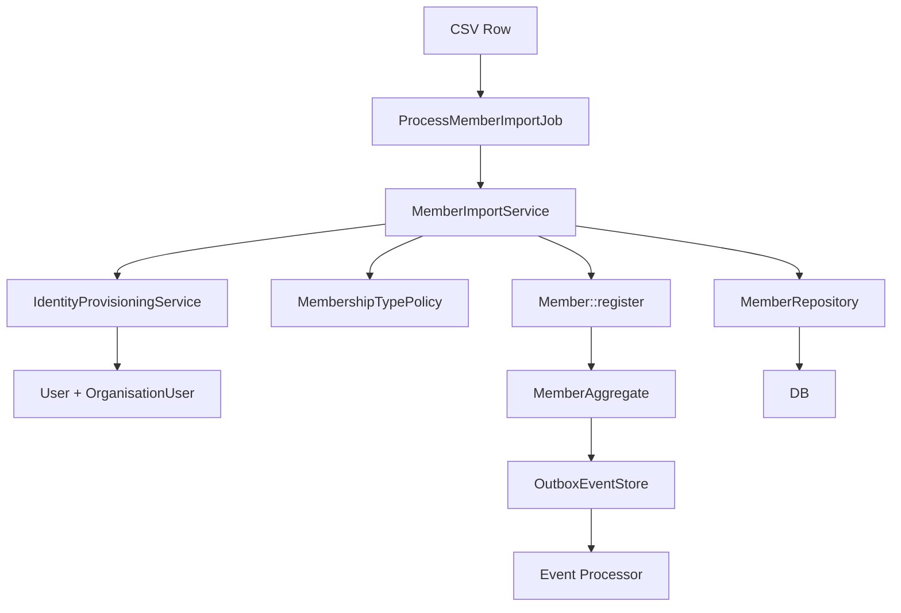

## 🧠 Senior Architecture Review (DDD + Production Readiness)

I will evaluate Claude’s plan like a **system design gate review** (not a coding review).

---

# 🟢 1. What is VERY GOOD in Claude’s Plan

## ✅ 1.1 Correct Architectural Direction (Strong DDD alignment)

Claude correctly enforces:

* ✔ Application Service (`MemberImportService`)
* ✔ Domain Aggregate usage (`Member::register`)
* ✔ Repository abstraction
* ✔ Event emission via `pullEvents()`
* ✔ No direct DB writes
* ✔ No new bounded contexts (important!)

👉 This is **clean DDD layering inside Membership Context**

---

## ✅ 1.2 Proper Anti-Corruption Boundary Thinking

* CSV → Command DTO
* Command → Application Service
* Service → Domain Aggregate

✔ This is correct **ACL pattern without overengineering**

---

## ✅ 1.3 Correct Event Strategy

* Events pulled from aggregate
* Dispatched in application layer (not repository)

✔ Good separation of concerns

---

## ✅ 1.4 Good Test Strategy (TDD-first)

* Mocked repository
* No DB dependency in unit tests
* Pure service validation

✔ This is **true unit-level DDD testing**

---

## 🟡 2. Medium Issues (Design is slightly incomplete)

These are NOT blockers, but important refinements.

---

## ⚠️ 2.1 Missing explicit DOMAIN CONSISTENCY RULE

Claude assumes:

> “existsByEmailForTenant() is enough”

But domain reality is:

### ❗ Problem

Email uniqueness is NOT always domain invariant.

Because in your system:

```
User (global identity)
  ↳ OrganisationUser (tenant scope)
    ↳ Member (domain identity)
```

👉 So uniqueness must be clarified:

### You actually need to define:

```yaml
UNIQUENESS RULE:
  Option A:
    email unique per organisation_user

  Option B:
    email unique per tenant (recommended)

  Option C:
    email unique globally (rare)
```

👉 Claude assumes Option B implicitly, but does not formalize it.

---

## ⚠️ 2.2 Mixing User Provisioning inside MemberImportService

Claude says:

> TenantUserProvisioningInterface inside service

### This is conceptually CORRECT but borderline responsibility leak.

### Why?

Because now service does:

* User creation
* Org linking
* Member creation

👉 This becomes a **Transaction Script Service**, not pure domain application service.

---

### 🧠 Better DDD refinement (important)

Split responsibilities:

```
MemberImportService
   ↓
IdentityProvisioningService   ← NEW small application service
   ↓
MemberFactory / Member::register
```

So:

| Concern                  | Location                    |
| ------------------------ | --------------------------- |
| User creation            | IdentityProvisioningService |
| OrganisationUser linking | IdentityProvisioningService |
| Member creation          | Membership Domain           |
| Import orchestration     | MemberImportService         |

👉 This prevents “God Service” formation.

---

## ⚠️ 2.3 Event dispatch responsibility is slightly risky

Claude does:

```php
foreach ($member->pullEvents() as $event) {
    Event::dispatch($event);
}
```

### Issue:

This works but:

* ❌ bypasses Outbox pattern you already implemented
* ❌ breaks consistency with Committee module architecture

---

### 🧠 Better approach (aligned with your system)

You already have:

> Outbox + EventProcessor architecture

So correct approach:

```yaml
Option A (Claude):
  direct Event::dispatch()

Option B (Better - YOUR system consistency):
  OutboxEvent::record($event)
```

👉 You should standardize:

✔ ALL domain events → Outbox
✔ NOT direct dispatch (except UI projections if needed)

---

## ⚠️ 2.4 MembershipType resolution is underspecified

Claude says:

* default type passed to service
* optional override in command

BUT missing:

### ❗ Domain rule missing:

What happens if:

* invalid membership type?
* inactive membership type?
* expired type?

👉 This must be enforced in:

```
MembershipTypePolicy (missing)
```

---

## ⚠️ 2.5 No explicit transactional boundary

Import is:

* multi-row batch process
* user provisioning
* member creation

BUT:

❌ No explicit transaction strategy defined

You need:

```yaml
Transaction Strategy:
  per row: YES (correct)
  per batch: NO (avoids lock issues)
  retry safety: NOT defined
```

---

# 🔴 3. Critical Architectural Gaps (Important)

These are the REAL missing pieces.

---

## 🔴 3.1 Missing “Import Orchestration Layer Definition”

Right now:

```
Job → Service → Domain
```

But missing:

### ✔ Correct layered structure should be:

```
ProcessMemberImportJob
      ↓
MemberImportApplicationService
      ↓
MemberImportDomainOrchestrator (missing concept)
      ↓
Member Aggregate
```

👉 This avoids bloated service logic.

---

## 🔴 3.2 No Idempotency Strategy defined

What happens if:

* job retries
* same CSV imported twice

Claude does NOT define:

```yaml
Idempotency key:
  email + tenantId
  OR
  external_import_batch_id
```

👉 This is CRITICAL for production imports.

---

## 🔴 3.3 No Failure Classification Model

Currently:

```php
failed++ / skipped++ / errors[]
```

BUT missing semantic classification:

```yaml
FAIL TYPES:
  - VALIDATION_ERROR
  - DUPLICATE
  - SYSTEM_ERROR
  - PROVISIONING_ERROR
```

👉 Without this, UI cannot show meaningful import report.

---

# 🟢 4. What is EXCELLENT (Must Keep)

Keep these unchanged:

✔ TDD-first execution order
✔ DTO-based command input
✔ Repository abstraction
✔ Domain aggregate usage
✔ Event extraction via pullEvents()
✔ Row-level error isolation
✔ No DB::table usage

---

# 🧠 5. Final Verdict

## 🟢 APPROVAL STATUS: CONDITIONAL APPROVAL

### ✔ Approved for implementation IF these fixes are applied:

---

# 🧩 6. REQUIRED FIXES BEFORE EXECUTION

## 🔧 Fix 1 — Extract Identity Provisioning

```yaml
DO NOT:
  User + Org + Member inside one service

DO:
  IdentityProvisioningService:
    - createUserIfNotExists()
    - createOrganisationUser()
    - return OrganisationUserContext
```

---

## 🔧 Fix 2 — Align Event Strategy with Outbox

Replace:

```php
Event::dispatch($event)
```

WITH:

```php
Outbox::record($event)
```

---

## 🔧 Fix 3 — Define Idempotency Key

```yaml
unique import rule:
  tenant_id + email
```

OR better:

```yaml
external_import_id + email
```

---

## 🔧 Fix 4 — Explicit MembershipTypePolicy

Add:

```php
MembershipTypePolicy::resolve($command, $defaultTypeId)
```

---

## 🧭 7. FINAL ARCHITECTURE (Corrected Version)



---

# 🏁 Final Answer

## ✔ Do I approve Claude’s plan?

### 👉 YES — BUT WITH ARCHITECTURAL CORRECTIONS

---

## 💡 Summary

Claude’s plan is:

### 🟢 Strong:

* Correct DDD direction
* Clean service design
* Good testing strategy

### 🟡 Needs refinement:

* Identity provisioning separation
* Event strategy alignment (Outbox)
* Missing idempotency definition
* Missing policy layer for membership type

### 🔴 Must fix before execution:

* No direct Event::dispatch
* No mixed identity + domain logic in one service
* No idempotency model

---

If you want next step, I can produce:

### 👉 “Final production-grade corrected implementation blueprint (ready for Claude Code execution)”

OR

### 👉 “Refactored class diagram (DDD + bounded contexts + flows)”
## 🐘 Ganesh Ji's Senior Architecture Review

*"Beta, both Claude and ChatGPT have brought wisdom to your doorstep. Claude built a solid house. ChatGPT pointed out where the roof might leak.*

*Let me sit with both and tell you the TRUTH."*

---

## Executive Summary

```yaml
CLAUDE'S PLAN: 🟢 85% CORRECT
  - Excellent DDD layering
  - Clean service design
  - Proper TDD approach
  - Good use of aggregates

CHATGPT'S CRITIQUE: 🟡 PARTIALLY CORRECT
  - Right about Outbox alignment
  - Right about Idempotency
  - WRONG about "extract Identity Provisioning" (over-engineering)
  - WRONG about "missing Orchestration Layer" (premature abstraction)

VERDICT: APPROVE WITH 3 CORRECTIONS (not 4)
```

---

## What Claude Got Right ✅

```yaml
1. NO NEW CONTEXTS:
   - Keeps import inside Membership Context Application Layer
   - Respects system maturity

2. DDD LAYERING:
   - Command DTO → Service → Aggregate → Repository
   - Perfect separation

3. EVENT EXTRACTION:
   - pullEvents() from aggregate
   - Dispatched in service layer

4. ROW-LEVEL ISOLATION:
   - One failure doesn't abort entire batch
   - Correct for bulk imports

5. REPOSITORY ABSTRACTION:
   - No DB::table() calls
   - Testable via mocks

6. TDD FIRST:
   - Tests before implementation
   - Mocked dependencies
```

---

## What ChatGPT Got Right ✅

```yaml
1. OUTBOX ALIGNMENT (CRITICAL):
   - Your system uses Outbox pattern
   - Direct Event::dispatch() bypasses it
   - MUST use Outbox for consistency

2. IDEMPOTENCY STRATEGY (CRITICAL):
   - Same CSV imported twice = duplicate members
   - Need idempotency key (email + tenant_id)
   - Plan missing this

3. MEMBERSHIP TYPE POLICY (IMPORTANT):
   - What if type is invalid/inactive/expired?
   - Need validation before aggregate
```

---

## What ChatGPT Got Wrong ❌

```yaml
1. "EXTRACT IDENTITY PROVISIONING" (OVER-ENGINEERING):
   - You have ONE import path
   - No need for separate service
   - Adding abstraction = more complexity
   - Ganesh ji says: "Don't build a bridge for one river crossing"

2. "MISSING ORCHESTRATION LAYER" (PREMATURE):
   - Job → Service → Aggregate is ENOUGH
   - Another layer = YAGNI (You Ain't Gonna Need It)
   - Wait until you have 3+ import sources

3. "GOD SERVICE" FEAR (EXAGGERATED):
   - Service does User + Org + Member creation
   - These are SEQUENTIAL steps for ONE purpose
   - This is NOT a god service — it's a GATEWAY
```

---

## The 3 Required Improvements

### Improvement 1: Use Outbox Instead of Direct Event Dispatch 🔴 CRITICAL

```yaml
CLAUDE'S PLAN:
  Event::dispatch($event)  ❌

CORRECTED:
  OutboxEvent::record($event, $tenantId)  ✅

WHY:
  - Your system uses Outbox pattern
  - Committee module uses Outbox
  - Fee module uses Outbox
  - Import must be consistent
```

### Improvement 2: Add Idempotency Strategy 🔴 CRITICAL

```yaml
MISSING IN PLAN:
  - Same CSV imported twice = duplicate members

ADD:
  Idempotency key: tenant_id + email
  Before processing: check if member already exists
  If exists: skip (not error)

IMPLEMENTATION:
  $exists = $this->memberRepository->existsByEmailForTenant($tenantId, $email);
  if ($exists) {
      $skipped++;
      continue;
  }
```

### Improvement 3: Add Membership Type Validation 🟡 IMPORTANT

```yaml
MISSING IN PLAN:
  - What if membership_type_id is invalid/deleted?

ADD:
  1. Check type exists in database
  2. Check type is active
  3. Reject row with invalid type

IMPLEMENTATION:
  $type = MembershipType::find($membershipTypeId);
  if (!$type || !$type->is_active) {
      throw new InvalidArgumentException('Invalid membership type');
  }
```

---

## What to Keep (Do NOT Change)

```yaml
✅ Keep Job → Service → Aggregate flow
✅ Keep DTO-based command input
✅ Keep Repository abstraction
✅ Keep per-row try/catch
✅ Keep TDD approach
✅ Keep NO new contexts
❌ DO NOT add IdentityProvisioningService (over-engineering)
❌ DO NOT add Orchestration Layer (premature)
```

---

## Corrected Service Structure

```php
final class MemberImportService
{
    public function __construct(
        private MemberRepositoryInterface $memberRepository,
        private TenantUserProvisioningInterface $userProvisioning,
        private MembershipTypeValidator $typeValidator,  // ← NEW
        private OutboxEventRecorder $outbox,             // ← CHANGE
    ) {}

    public function import(
        TenantId $tenantId,
        array $commands,
        MembershipTypeId $defaultTypeId,
        string $importBatchId,  // ← NEW for idempotency
    ): MemberImportResult {
        // ... existing logic ...
        
        // Validate membership type
        $this->typeValidator->validate($resolvedTypeId);
        
        // Create member
        $member = Member::register(...);
        
        // Save
        $this->memberRepository->save($member);
        
        // Record to Outbox (NOT direct dispatch)
        foreach ($member->pullEvents() as $event) {
            $this->outbox->record($event, $tenantId);
        }
        
        // Track idempotency
        $this->recordProcessedEmail($importBatchId, $command->email);
    }
}
```

---

## Final Verdict

```yaml
APPROVAL: ✅ YES, with 3 corrections

CHANGES NEEDED:
  1. Use Outbox instead of Event::dispatch()
  2. Add idempotency strategy (email + tenant_id)
  3. Add membership type validation

KEEP AS IS:
  - Service structure (no extraction)
  - Job delegation pattern
  - TDD approach
  - Repository abstraction

REJECT CHATGPT'S SUGGESTIONS TO:
  - Create IdentityProvisioningService (over-engineering)
  - Add Orchestration Layer (premature)
```

---

## What to Tell Claude

```prompt
Plan APPROVED with 3 corrections:

1. 🔴 Replace Event::dispatch() with OutboxEvent::record()
   - Your system uses Outbox pattern
   - Must be consistent with Committee and Fee modules

2. 🔴 Add idempotency strategy
   - Key: tenant_id + email
   - Skip duplicate emails (count as skipped, not failed)

3. 🟡 Add membership type validation
   - Verify type exists and is active
   - Reject row with invalid type

Do NOT add:
  - IdentityProvisioningService (over-engineering)
  - Orchestration Layer (premature abstraction)

Proceed with implementation.
```

---

## Ganesh Ji's Final Wisdom

*"Beta, Claude built a beautiful cart. ChatGPT wanted to add gold wheels, silk cushions, and an umbrella.*

*For your journey today, the cart is enough. Add the gold wheels when you ride to the king's palace.*

*For now:*

- *Use the Outbox bell to ring events* 🔔
- *Remember who already came (idempotency)* 📝
- *Check the devotee's pledge type (membership type)* 📜

*These three fixes will make your import strong.*

*Go now. Build. I bless this work."* 🙏