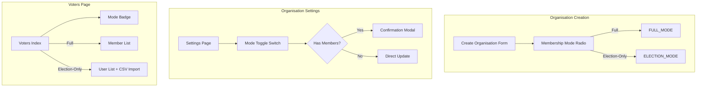

## Practical Implementation: Election-Only Mode Workflow

You're right to ask. Here's the complete practical flow:

### Current State: Where to Set the Mode

The `uses_full_membership` flag exists in the database but **no UI exists yet** to toggle it. You have two options:

#### Option 1: Set via Tinker (Immediate Testing)

```bash
php artisan tinker

# Set organisation to election-only mode
$org = Organisation::where('slug', 'namaste-nepal-gmbh')->first();
$org->update(['uses_full_membership' => false]);

# Verify
$org->isElectionOnly(); // Should return true
```

#### Option 2: Add Settings UI (Recommended)

Add toggle to Organisation Settings page:

```vue
<!-- resources/js/Pages/Organisations/Settings/Index.vue -->
<template>
    <div class="bg-white rounded-lg shadow p-6">
        <div class="flex items-center justify-between">
            <div>
                <h3 class="text-lg font-semibold">Voter Eligibility Mode</h3>
                <p class="text-sm text-gray-600">
                    When disabled, any registered user can be added as voter.
                </p>
            </div>
            <ToggleSwitch v-model="form.uses_full_membership" />
        </div>
        <p class="text-sm mt-2" :class="form.uses_full_membership ? 'text-blue-600' : 'text-green-600'">
            {{ form.uses_full_membership ? 'Full Membership Required' : 'Election-Only (Direct Import)' }}
        </p>
    </div>
</template>
```

### How to Add Voters in Election-Only Mode

Once `uses_full_membership = false`, the voters page automatically adapts:

```
┌─────────────────────────────────────────────────────────────────────────────┐
│  VOTERS PAGE (/organisations/{org}/elections/{election}/voters)              │
├─────────────────────────────────────────────────────────────────────────────┤
│                                                                               │
│  Election-Only Mode (uses_full_membership = false)                            │
│  ┌─────────────────────────────────────────────────────────────────────────┐ │
│  │  ASSIGN USERS AS VOTERS                                                  │ │
│  │  ┌─────────────────────────────────────────────────────────────────────┐ │ │
│  │  │  Search: [________________] 🔍                                       │ │ │
│  │  │                                                                      │ │ │
│  │  │  ☐ Niraj Adhikari (restaurant.namastenepal@gmail.com)               │ │ │
│  │  │  ☐ John Doe (john@example.com)                                       │ │ │
│  │  │  ☐ Jane Smith (jane@example.com)                                     │ │ │
│  │  │                                                                      │ │ │
│  │  │  [Assign Selected]                                                   │ │ │
│  │  └─────────────────────────────────────────────────────────────────────┘ │ │
│  │                                                                           │ │
│  │  ── OR ──                                                                 │ │
│  │                                                                           │ │
│  │  📋 Import Voters from CSV                                                │ │
│  │  [Choose File] no file chosen                                             │ │
│  │  [Upload and Import]                                                      │ │
│  └─────────────────────────────────────────────────────────────────────────┘ │
│                                                                               │
│  Full Membership Mode (uses_full_membership = true)                            │
│  ┌─────────────────────────────────────────────────────────────────────────┐ │
│  │  ASSIGN MEMBERS AS VOTERS                                                │ │
│  │  Only active members with paid/exempt fees appear below                   │ │
│  │  ┌─────────────────────────────────────────────────────────────────────┐ │ │
│  │  │  ☐ Niraj Adhikari - Member #M001 - Fees: Paid                        │ │ │
│  │  │  ☐ John Doe - Member #M002 - Fees: Exempt                            │ │ │
│  │  │                                                                      │ │ │
│  │  │  [Assign Selected]                                                   │ │ │
│  │  └─────────────────────────────────────────────────────────────────────┘ │ │
│  └─────────────────────────────────────────────────────────────────────────┘ │
└─────────────────────────────────────────────────────────────────────────────┘
```

### CSV Import for Election-Only Mode

```php
// app/Http/Controllers/ElectionVoterController.php
public function import(Request $request, Organisation $organisation, Election $election)
{
    $request->validate(['csv_file' => 'required|file|mimes:csv,txt']);
    
    $path = $request->file('csv_file')->getRealPath();
    $data = array_map('str_getcsv', file($path));
    
    $results = ['success' => 0, 'skipped' => 0, 'errors' => []];
    
    foreach ($data as $row) {
        $email = $row[0]; // First column is email
        
        $user = User::where('email', $email)->first();
        
        if (!$user) {
            $results['errors'][] = "User not found: {$email}";
            continue;
        }
        
        // In election-only mode, no Member validation needed
        if ($organisation->isElectionOnly() || $user->isEligibleVoter($organisation)) {
            ElectionMembership::firstOrCreate([
                'election_id' => $election->id,
                'user_id' => $user->id,
            ], [
                'organisation_id' => $organisation->id,
                'role' => 'voter',
                'status' => 'active',
            ]);
            $results['success']++;
        } else {
            $results['skipped']++;
        }
    }
    
    return back()->with('import_results', $results);
}
```

### Current UI State Check

The voters page (`resources/js/Pages/Elections/Voters/Index.vue`) already has:

```vue
<!-- Line 56-60: Conditional label -->
<p class="sidebar-label">
    {{ organisation.uses_full_membership ? 'ASSIGN MEMBERS AS VOTERS' : 'ASSIGN USERS AS VOTERS' }}
</p>

<!-- Line 62-64: Help text -->
<p class="text-xs text-gray-500 mb-2">
    {{ organisation.uses_full_membership 
        ? 'Only active members with paid fees appear below.' 
        : 'All organisation users can be assigned as voters.' }}
</p>
```

### Immediate Action: Enable via Tinker

```bash
# 1. Set Namaste Nepal to election-only mode
php artisan tinker --execute="
\$org = App\Models\Organisation::where('slug', 'namaste-nepal-gmbh')->first();
\$org->update(['uses_full_membership' => false]);
echo '✅ ' . \$org->name . ' is now in election-only mode';
"

# 2. Visit voters page
# http://localhost:8000/organisations/namaste-nepal-gmbh/elections/namaste-i6g7ahfc/voters

# 3. You should now see ALL organisation users in the dropdown, not just members
```

### Summary

| Task | Status | How to Do It |
|------|--------|--------------|
| Enable election-only mode | ✅ Immediate | Tinker command above |
| Add voters directly | ✅ Working | Voters page dropdown |
| Import CSV | 🚧 Code exists | Needs UI button |
| Settings UI toggle | ⏳ Pending | Add to Settings page |

**Om Gam Ganapataye Namah** 🪔🐘

Run the tinker command to enable election-only mode now, then visit the voters page. The dropdown should show all organisation users instead of just members.
## Critical Analysis & Professional Implementation Plan

### 🔴 Critical Issues with Current Plan

| Issue | Problem | Impact |
|-------|---------|--------|
| No Settings UI | Mode can only be set via Tinker | Not usable by admins |
| CSV Import incomplete | Code exists but no UI button | Feature not discoverable |
| Mode toggle missing from Organisation Creation | New orgs default to `true` with no way to change | Forced into full membership |
| No visual indicator of current mode | Admins don't know which mode is active | Confusion |
| Missing authorization for mode change | Any admin could toggle? | Security gap |

### ✅ Improved Implementation Plan



---

## Professional Claude Code CLI Prompt Instructions

```
Implement the complete Dual-Mode Membership System UI and CSV import feature.

## Background

Phase 1 & 2 backend is COMPLETE:
- `uses_full_membership` column exists on organisations table
- `VoterEligibilityService` fully functional
- `ElectionVoterController` wired for both modes
- 7/10 tests passing (service layer), 219 total tests passing

## Current Gap

No UI exists for admins to:
1. Set membership mode during organisation creation
2. Toggle mode in organisation settings
3. Import voters via CSV in election-only mode

## Your Task: Complete the UI Layer

### Task 1: Add Mode Selection to Organisation Creation

**File:** `resources/js/Pages/Organisations/Create.vue`

Add radio group before submit button:

```vue
<div class="mt-6 p-4 bg-gray-50 rounded-lg border border-gray-200">
    <h3 class="text-sm font-semibold text-gray-900 mb-3">Membership System</h3>
    
    <div class="space-y-3">
        <label class="flex items-start gap-3 cursor-pointer">
            <input
                type="radio"
                v-model="form.uses_full_membership"
                :value="true"
                class="mt-1"
            />
            <div>
                <span class="font-medium text-gray-900">Full Membership</span>
                <p class="text-sm text-gray-600">
                    Voters must be formal members with paid fees. Best for organisations with membership tracking.
                </p>
            </div>
        </label>
        
        <label class="flex items-start gap-3 cursor-pointer">
            <input
                type="radio"
                v-model="form.uses_full_membership"
                :value="false"
                class="mt-1"
            />
            <div>
                <span class="font-medium text-gray-900">Election-Only</span>
                <p class="text-sm text-gray-600">
                    Any registered user can vote. Best for simple elections without membership tracking.
                </p>
            </div>
        </label>
    </div>
</div>
```

Update form data:
```js
const form = useForm({
    name: '',
    slug: '',
    type: 'tenant',
    uses_full_membership: true, // default
    // ... other fields
});
```

### Task 2: Add Mode Toggle to Organisation Settings

**File:** `resources/js/Pages/Organisations/Settings/Index.vue`

Add new section:

```vue
<template>
    <div class="bg-white rounded-lg shadow p-6">
        <div class="border-b pb-4 mb-4">
            <h2 class="text-xl font-semibold text-gray-900">Membership System Configuration</h2>
            <p class="text-sm text-gray-600 mt-1">
                Choose how voters are eligible for elections in this organisation.
            </p>
        </div>
        
        <!-- Current Mode Badge -->
        <div class="mb-4">
            <span class="text-sm font-medium text-gray-700">Current Mode:</span>
            <span 
                class="ml-2 inline-flex items-center px-3 py-1 rounded-full text-sm font-medium"
                :class="organisation.uses_full_membership 
                    ? 'bg-blue-100 text-blue-800' 
                    : 'bg-green-100 text-green-800'"
            >
                {{ organisation.uses_full_membership ? 'Full Membership' : 'Election-Only' }}
            </span>
        </div>
        
        <!-- Mode Toggle -->
        <div class="flex items-center justify-between p-4 bg-gray-50 rounded-lg">
            <div>
                <h3 class="font-medium text-gray-900">Enable Full Membership</h3>
                <p class="text-sm text-gray-600 max-w-md">
                    When enabled, voters must be active members with paid/exempt fees.
                    When disabled, any registered user in the organisation can vote.
                </p>
            </div>
            <ToggleSwitch v-model="form.uses_full_membership" />
        </div>
        
        <!-- Warning when switching from full to election-only with existing members -->
        <div v-if="organisation.uses_full_membership && !form.uses_full_membership && memberCount > 0"
             class="mt-4 p-4 bg-yellow-50 border border-yellow-200 rounded-lg">
            <div class="flex">
                <div class="flex-shrink-0">
                    <svg class="h-5 w-5 text-yellow-400" viewBox="0 0 20 20" fill="currentColor">
                        <path fill-rule="evenodd" d="M8.257 3.099c.765-1.36 2.722-1.36 3.486 0l5.58 9.92c.75 1.334-.213 2.98-1.742 2.98H4.42c-1.53 0-2.493-1.646-1.743-2.98l5.58-9.92zM11 13a1 1 0 11-2 0 1 1 0 012 0zm-1-8a1 1 0 00-1 1v3a1 1 0 002 0V6a1 1 0 00-1-1z" clip-rule="evenodd"/>
                    </svg>
                </div>
                <div class="ml-3">
                    <h3 class="text-sm font-medium text-yellow-800">Warning: Existing Members Present</h3>
                    <p class="text-sm text-yellow-700 mt-1">
                        This organisation has {{ memberCount }} active members. Switching to election-only mode 
                        will allow ANY registered user to vote, bypassing membership requirements.
                        Existing member data will be preserved but ignored for future elections.
                    </p>
                    <div class="mt-3">
                        <label class="flex items-center">
                            <input type="checkbox" v-model="form.confirm_mode_change" class="rounded border-gray-300" />
                            <span class="ml-2 text-sm text-yellow-800">I understand, proceed with change</span>
                        </label>
                    </div>
                </div>
            </div>
        </div>
        
        <div class="mt-6">
            <button 
                @click="updateMode" 
                :disabled="form.processing || (organisation.uses_full_membership && !form.uses_full_membership && memberCount > 0 && !form.confirm_mode_change)"
                class="px-4 py-2 bg-blue-600 text-white rounded-md hover:bg-blue-700 disabled:opacity-50 disabled:cursor-not-allowed"
            >
                {{ form.processing ? 'Saving...' : 'Save Changes' }}
            </button>
        </div>
    </div>
</template>

<script setup>
import ToggleSwitch from '@/Components/ToggleSwitch.vue';
import { useForm } from '@inertiajs/vue3';

const props = defineProps({
    organisation: Object,
    memberCount: Number,
});

const form = useForm({
    uses_full_membership: props.organisation.uses_full_membership,
    confirm_mode_change: false,
});

const updateMode = () => {
    form.patch(route('organisations.settings.update-membership-mode', props.organisation.slug), {
        preserveScroll: true,
        onSuccess: () => {
            form.confirm_mode_change = false;
        },
    });
};
</script>
```

### Task 3: Add Backend Route and Controller Method

**File:** `routes/organisations.php`

```php
Route::prefix('/{organisation:slug}')->group(function () {
    // ... existing routes
    
    Route::patch('/settings/membership-mode', [OrganisationSettingsController::class, 'updateMembershipMode'])
        ->name('organisations.settings.update-membership-mode')
        ->can('update', 'organisation');
});
```

**File:** `app/Http/Controllers/OrganisationSettingsController.php` (create if not exists)

```php
public function updateMembershipMode(Request $request, Organisation $organisation)
{
    $this->authorize('update', $organisation);
    
    $validated = $request->validate([
        'uses_full_membership' => 'required|boolean',
        'confirm_mode_change' => 'required_if:uses_full_membership,false|accepted',
    ]);
    
    // Log the change for audit
    if ($organisation->uses_full_membership !== $validated['uses_full_membership']) {
        Log::info('Organisation membership mode changed', [
            'organisation_id' => $organisation->id,
            'from' => $organisation->uses_full_membership ? 'full' : 'election_only',
            'to' => $validated['uses_full_membership'] ? 'full' : 'election_only',
            'user_id' => auth()->id(),
        ]);
    }
    
    $organisation->update(['uses_full_membership' => $validated['uses_full_membership']]);
    
    return back()->with('success', 'Membership mode updated successfully.');
}
```

### Task 4: Add CSV Import Button to Voters Page

**File:** `resources/js/Pages/Elections/Voters/Index.vue`

Add import section when in election-only mode:

```vue
<template>
    <!-- ... existing code ... -->
    
    <!-- CSV Import Section (Election-Only Mode Only) -->
    <div v-if="!organisation.uses_full_membership" class="sidebar-section">
        <p class="sidebar-label">IMPORT VOTERS</p>
        
        <div class="import-area">
            <input
                ref="fileInput"
                type="file"
                accept=".csv,.txt"
                @change="handleFileSelect"
                class="hidden"
            />
            
            <button 
                @click="$refs.fileInput.click()"
                :disabled="importing"
                class="btn-import"
            >
                <svg class="w-4 h-4" fill="none" stroke="currentColor" viewBox="0 0 24 24">
                    <path stroke-linecap="round" stroke-linejoin="round" stroke-width="2" d="M7 16a4 4 0 01-.88-7.903A5 5 0 1115.9 6L16 6a5 5 0 011 9.9M15 13l-3-3m0 0l-3 3m3-3v12"/>
                </svg>
                {{ importing ? 'Importing...' : 'Import CSV' }}
            </button>
            
            <p class="import-hint">
                CSV format: email (one per line or first column)
            </p>
            
            <!-- Import Results -->
            <div v-if="importResults" class="import-results">
                <p class="text-green-600">✅ {{ importResults.success }} imported</p>
                <p v-if="importResults.skipped" class="text-yellow-600">⚠️ {{ importResults.skipped }} skipped</p>
                <p v-if="importResults.errors.length" class="text-red-600">
                    ❌ {{ importResults.errors.length }} errors
                </p>
            </div>
        </div>
    </div>
</template>

<script setup>
const fileInput = ref(null);
const importing = ref(false);
const importResults = ref(null);

const handleFileSelect = async (event) => {
    const file = event.target.files[0];
    if (!file) return;
    
    importing.value = true;
    importResults.value = null;
    
    const formData = new FormData();
    formData.append('csv_file', file);
    
    try {
        const response = await router.post(
            route('elections.voters.import', {
                organisation: props.organisation.slug,
                election: props.election.slug,
            }),
            formData,
            {
                preserveScroll: true,
                onSuccess: (page) => {
                    importResults.value = page.props.import_results;
                    fileInput.value.value = '';
                },
                onFinish: () => {
                    importing.value = false;
                },
            }
        );
    } catch (error) {
        importing.value = false;
    }
};
</script>

<style scoped>
.import-area {
    padding: 1rem 0;
}

.btn-import {
    width: 100%;
    display: flex;
    align-items: center;
    justify-content: center;
    gap: 0.5rem;
    padding: 0.5rem 1rem;
    background: #f3f4f6;
    border: 1px dashed #d1d5db;
    border-radius: 0.375rem;
    color: #374151;
    font-size: 0.875rem;
    font-weight: 500;
    transition: all 0.15s;
}

.btn-import:hover:not(:disabled) {
    background: #e5e7eb;
    border-color: #9ca3af;
}

.btn-import:disabled {
    opacity: 0.5;
    cursor: not-allowed;
}

.import-hint {
    font-size: 0.7rem;
    color: #6b7280;
    margin-top: 0.5rem;
    text-align: center;
}

.import-results {
    margin-top: 1rem;
    padding: 0.75rem;
    background: #f9fafb;
    border-radius: 0.375rem;
    font-size: 0.8rem;
}
</style>
```

### Task 5: Add CSV Import Backend Route

**File:** `routes/organisations.php`

```php
Route::prefix('/elections/{election:slug}')->group(function () {
    // ... existing routes
    
    Route::post('/voters/import', [ElectionVoterController::class, 'import'])
        ->name('elections.voters.import')
        ->can('manageVoters', 'election');
});
```

**File:** `app/Http/Controllers/ElectionVoterController.php`

```php
public function import(Request $request, Organisation $organisation, Election $election)
{
    $this->authorize('manageVoters', $election);
    
    $request->validate([
        'csv_file' => 'required|file|mimes:csv,txt|max:10240', // 10MB max
    ]);
    
    $path = $request->file('csv_file')->getRealPath();
    $handle = fopen($path, 'r');
    
    $results = ['success' => 0, 'skipped' => 0, 'errors' => []];
    $rowNumber = 0;
    
    while (($row = fgetcsv($handle)) !== false) {
        $rowNumber++;
        $email = trim($row[0] ?? '');
        
        if (empty($email)) {
            $results['errors'][] = "Row {$rowNumber}: Empty email";
            continue;
        }
        
        if (!filter_var($email, FILTER_VALIDATE_EMAIL)) {
            $results['errors'][] = "Row {$rowNumber}: Invalid email - {$email}";
            continue;
        }
        
        $user = User::where('email', $email)->first();
        
        if (!$user) {
            $results['errors'][] = "Row {$rowNumber}: User not found - {$email}";
            continue;
        }
        
        // Check eligibility based on organisation mode
        if (!$this->eligibilityService->isEligibleVoter($organisation, $user)) {
            $results['skipped']++;
            continue;
        }
        
        // Check if already assigned
        $exists = ElectionMembership::where('election_id', $election->id)
            ->where('user_id', $user->id)
            ->exists();
            
        if ($exists) {
            $results['skipped']++;
            continue;
        }
        
        ElectionMembership::create([
            'election_id' => $election->id,
            'user_id' => $user->id,
            'organisation_id' => $organisation->id,
            'role' => 'voter',
            'status' => 'active',
            'source' => 'csv_import',
        ]);
        
        $results['success']++;
    }
    
    fclose($handle);
    
    return back()->with('import_results', $results);
}
```

### Verification Checklist

| Task | Verification |
|------|-------------|
| Create organisation form | Radio buttons visible, default = Full Membership |
| Settings page toggle | Shows current mode, can toggle with warning |
| Warning modal | Shows when switching with existing members |
| Voters page badge | Shows current mode |
| Voters page dropdown | Shows users (election-only) or members (full) |
| CSV import button | Visible only in election-only mode |
| CSV import functionality | Upload CSV, see results, voters added |
| Authorization | Only election officers can import |

### Files Summary

| Action | File |
|--------|------|
| Modify | `resources/js/Pages/Organisations/Create.vue` |
| Modify | `resources/js/Pages/Organisations/Settings/Index.vue` |
| Modify | `resources/js/Pages/Elections/Voters/Index.vue` |
| Create | `app/Http/Controllers/OrganisationSettingsController.php` |
| Modify | `routes/organisations.php` |
| Modify | `app/Http/Controllers/ElectionVoterController.php` |

**Om Gam Ganapataye Namah** 🪔🐘
```