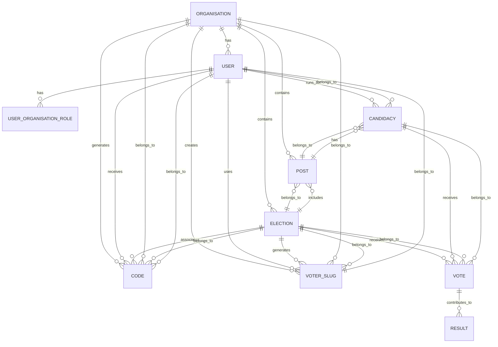

## ✅ **CRITICAL: Let's Redefine Model Relationships**

You're right - we need a **clean, authoritative model relationship document** before proceeding. Here's the complete picture:

---

# 📊 **COMPLETE MODEL RELATIONSHIP ARCHITECTURE**



---

## 🏛️ **SECTION 1: CORE MODELS**

### **1.1 Organisation Model** (The Tenant)

```php
// app/Models/Organisation.php

class Organisation extends Model
{
    use HasUuids, SoftDeletes;

    // === RELATIONSHIPS ===
    
    /**
     * Users belonging to this organisation (via pivot)
     * Source of truth: user_organisation_roles table
     */
    public function users()
    {
        return $this->belongsToMany(User::class, 'user_organisation_roles')
            ->withPivot('role', 'permissions')
            ->withTimestamps();
    }

    /**
     * All elections in this organisation
     */
    public function elections()
    {
        return $this->hasMany(Election::class);
    }

    /**
     * All posts (positions) in this organisation
     */
    public function posts()
    {
        return $this->hasMany(Post::class);
    }

    /**
     * All codes generated for this organisation
     */
    public function codes()
    {
        return $this->hasMany(Code::class);
    }

    /**
     * All voter slugs created for this organisation
     */
    public function voterSlugs()
    {
        return $this->hasMany(VoterSlug::class);
    }

    /**
     * Organisation roles pivot records
     */
    public function userOrganisationRoles()
    {
        return $this->hasMany(UserOrganisationRole::class);
    }

    // === BUSINESS LOGIC ===
    
    public function isPlatform(): bool
    {
        return $this->type === 'platform';
    }

    public function isTenant(): bool
    {
        return $this->type === 'tenant';
    }

    public static function getDefaultPlatform(): self
    {
        return Cache::remember('platform_organisation', 3600, function () {
            return static::where('type', 'platform')
                ->where('is_default', true)
                ->firstOrFail();
        });
    }
}
```

---

### **1.2 User Model** (Global Identity)

```php
// app/Models/User.php

class User extends Authenticatable
{
    use HasUuids, SoftDeletes, HasApiTokens, HasRoles, Notifiable;

    // === RELATIONSHIPS ===
    
    /**
     * Current active organisation context
     */
    public function currentOrganisation()
    {
        return $this->belongsTo(Organisation::class, 'organisation_id');
    }

    /**
     * ALL organisations this user belongs to (source of truth)
     */
    public function organisations()
    {
        return $this->belongsToMany(Organisation::class, 'user_organisation_roles')
            ->withPivot('role', 'permissions')
            ->withTimestamps();
    }

    /**
     * Pivot records for organisation membership
     */
    public function organisationRoles()
    {
        return $this->hasMany(UserOrganisationRole::class);
    }

    /**
     * Candidacies this user is running for
     */
    public function candidacies()
    {
        return $this->hasMany(Candidacy::class);
    }

    /**
     * Demo candidacies (if any)
     */
    public function demoCandidacies()
    {
        return $this->hasMany(DemoCandidacy::class);
    }

    /**
     * Voter slugs assigned to this user
     */
    public function voterSlugs()
    {
        return $this->hasMany(VoterSlug::class);
    }

    /**
     * Access codes assigned to this user
     */
    public function codes()
    {
        return $this->hasMany(Code::class);
    }

    // === MEMBERSHIP METHODS ===
    
    /**
     * Check if user belongs to specific organisation
     */
    public function belongsToOrganisation(string $organisationId): bool
    {
        return $this->organisationRoles()
            ->where('organisation_id', $organisationId)
            ->exists();
    }

    /**
     * Get user's role in specific organisation
     */
    public function getRoleInOrganisation(string $organisationId): ?string
    {
        return $this->organisationRoles()
            ->where('organisation_id', $organisationId)
            ->value('role');
    }

    /**
     * Check if user has any tenant organisations
     */
    public function hasTenantOrganisation(): bool
    {
        return $this->organisations()
            ->where('type', 'tenant')
            ->exists();
    }

    /**
     * Get organisation where user is owner
     */
    public function getOwnedOrganisation(): ?Organisation
    {
        return $this->organisations()
            ->wherePivot('role', 'owner')
            ->where('type', 'tenant')
            ->first();
    }

    /**
     * Switch current organisation context
     */
    public function switchToOrganisation(Organisation $organisation): void
    {
        if (!$this->belongsToOrganisation($organisation->id)) {
            throw new \Exception("Cannot switch to organisation you don't belong to");
        }

        $this->update(['organisation_id' => $organisation->id]);
        app(TenantContext::class)->setContext($this, $organisation);
    }
}
```

---

### **1.3 UserOrganisationRole Model** (Pivot)

```php
// app/Models/UserOrganisationRole.php

class UserOrganisationRole extends Model
{
    use HasUuids;

    protected $table = 'user_organisation_roles';

    protected $fillable = [
        'user_id',
        'organisation_id',
        'role',
        'permissions',
    ];

    protected $casts = [
        'permissions' => 'array',
    ];

    // === RELATIONSHIPS ===
    
    public function user()
    {
        return $this->belongsTo(User::class);
    }

    public function organisation()
    {
        return $this->belongsTo(Organisation::class);
    }

    // === SCOPES ===
    
    public function scopeWithRole($query, string $role)
    {
        return $query->where('role', $role);
    }
}
```

---

## 🗳️ **SECTION 2: ELECTION CORE**

### **2.1 Election Model**

```php
// app/Models/Election.php

class Election extends Model
{
    use HasUuids, SoftDeletes;

    protected $fillable = [
        'organisation_id',
        'name',
        'slug',
        'description',
        'type',           // 'demo' or 'real'
        'status',         // 'draft', 'active', 'completed', 'archived'
        'start_date',
        'end_date',
        'is_active',
        'settings',
    ];

    protected $casts = [
        'settings' => 'array',
        'start_date' => 'datetime',
        'end_date' => 'datetime',
        'is_active' => 'boolean',
    ];

    // === RELATIONSHIPS ===
    
    /**
     * Organisation that owns this election
     */
    public function organisation()
    {
        return $this->belongsTo(Organisation::class);
    }

    /**
     * Posts (positions) in this election
     */
    public function posts()
    {
        return $this->hasMany(Post::class);
    }

    /**
     * All candidacies across all posts in this election
     */
    public function candidacies()
    {
        return $this->hasManyThrough(
            Candidacy::class,
            Post::class,
            'election_id',  // Foreign key on posts
            'post_id',       // Foreign key on candidacies
            'id',            // Local key on elections
            'id'             // Local key on posts
        );
    }

    /**
     * Votes cast in this election
     */
    public function votes()
    {
        return $this->hasMany(Vote::class);
    }

    /**
     * Voter slugs generated for this election
     */
    public function voterSlugs()
    {
        return $this->hasMany(VoterSlug::class);
    }

    /**
     * Access codes for this election
     */
    public function codes()
    {
        return $this->hasMany(Code::class);
    }

    // === SCOPES ===
    
    public function scopeForOrganisation($query, string $organisationId)
    {
        return $query->where('organisation_id', $organisationId);
    }

    public function scopeActive($query)
    {
        return $query->where('status', 'active')
            ->where('start_date', '<=', now())
            ->where('end_date', '>=', now());
    }

    public function scopeDemo($query)
    {
        return $query->where('type', 'demo');
    }

    public function scopeReal($query)
    {
        return $query->where('type', 'real');
    }

    // === BUSINESS LOGIC ===
    
    public function isActive(): bool
    {
        return $this->status === 'active' 
            && $this->start_date <= now() 
            && $this->end_date >= now();
    }

    public function isDemo(): bool
    {
        return $this->type === 'demo';
    }

    public function isReal(): bool
    {
        return $this->type === 'real';
    }
}
```

---

### **2.2 Post Model** (Position/Seat)

```php
// app/Models/Post.php

class Post extends Model
{
    use HasUuids, SoftDeletes;

    protected $table = 'posts';

    protected $fillable = [
        'organisation_id',
        'election_id',
        'post_id',        // External ID reference
        'name',
        'nepali_name',
        'state_name',
        'required_number',
        'position_order',
        'is_national_wide',
    ];

    // === RELATIONSHIPS ===
    
    /**
     * Organisation that owns this post
     */
    public function organisation()
    {
        return $this->belongsTo(Organisation::class);
    }

    /**
     * Election this post belongs to
     */
    public function election()
    {
        return $this->belongsTo(Election::class);
    }

    /**
     * Candidacies for this post
     */
    public function candidacies()
    {
        return $this->hasMany(Candidacy::class, 'post_id', 'post_id');
    }

    // === SCOPES ===
    
    public function scopeForOrganisation($query, string $organisationId)
    {
        return $query->where('organisation_id', $organisationId);
    }

    public function scopeForElection($query, string $electionId)
    {
        return $query->where('election_id', $electionId);
    }
}
```

---

### **2.3 Candidacy Model**

```php
// app/Models/Candidacy.php

class Candidacy extends Model
{
    use HasUuids, SoftDeletes;

    protected $table = 'candidacies';

    protected $fillable = [
        'organisation_id',
        'election_id',
        'post_id',
        'user_id',
        'user_name',
        'platform',
        'status',          // 'approved', 'pending', 'rejected'
        'position_order',
        'candidacy_id',    // External reference
    ];

    // === RELATIONSHIPS ===
    
    /**
     * Organisation this candidacy belongs to
     */
    public function organisation()
    {
        return $this->belongsTo(Organisation::class);
    }

    /**
     * Election this candidacy is for
     */
    public function election()
    {
        return $this->belongsTo(Election::class);
    }

    /**
     * Post this candidacy is for
     */
    public function post()
    {
        return $this->belongsTo(Post::class, 'post_id', 'post_id');
    }

    /**
     * User who is the candidate
     */
    public function user()
    {
        return $this->belongsTo(User::class);
    }

    /**
     * Votes received by this candidate
     */
    public function votes()
    {
        return $this->hasMany(Vote::class);
    }

    // === SCOPES ===
    
    public function scopeForOrganisation($query, string $organisationId)
    {
        return $query->where('organisation_id', $organisationId);
    }

    public function scopeForElection($query, string $electionId)
    {
        return $query->where('election_id', $electionId);
    }

    public function scopeApproved($query)
    {
        return $query->where('status', 'approved');
    }

    // === BUSINESS LOGIC ===
    
    public function isApproved(): bool
    {
        return $this->status === 'approved';
    }
}
```

---

## 🔐 **SECTION 3: VOTING SYSTEM**

### **3.1 Code Model** (Access Codes)

```php
// app/Models/Code.php

class Code extends Model
{
    use HasUuids, SoftDeletes;

    protected $table = 'codes';

    protected $fillable = [
        'organisation_id',
        'election_id',
        'user_id',
        'code',
        'type',           // 'single', 'multi', 'demo'
        'is_used',
        'used_at',
        'expires_at',
        'max_uses',
        'current_uses',
    ];

    protected $casts = [
        'is_used' => 'boolean',
        'used_at' => 'datetime',
        'expires_at' => 'datetime',
        'max_uses' => 'integer',
        'current_uses' => 'integer',
    ];

    // === RELATIONSHIPS ===
    
    public function organisation()
    {
        return $this->belongsTo(Organisation::class);
    }

    public function election()
    {
        return $this->belongsTo(Election::class);
    }

    public function user()
    {
        return $this->belongsTo(User::class);
    }

    // === SCOPES ===
    
    public function scopeForOrganisation($query, string $organisationId)
    {
        return $query->where('organisation_id', $organisationId);
    }

    public function scopeForElection($query, string $electionId)
    {
        return $query->where('election_id', $electionId);
    }

    public function scopeUnused($query)
    {
        return $query->where('is_used', false)
            ->where(function($q) {
                $q->whereNull('expires_at')
                  ->orWhere('expires_at', '>', now());
            });
    }

    // === BUSINESS LOGIC ===
    
    public function isValid(): bool
    {
        if ($this->is_used) {
            return false;
        }

        if ($this->expires_at && $this->expires_at < now()) {
            return false;
        }

        if ($this->max_uses && $this->current_uses >= $this->max_uses) {
            return false;
        }

        return true;
    }

    public function markAsUsed(): void
    {
        $this->current_uses++;
        
        if ($this->max_uses && $this->current_uses >= $this->max_uses) {
            $this->is_used = true;
            $this->used_at = now();
        }
        
        $this->save();
    }
}
```

---

### **3.2 VoterSlug Model** (Voter Access)

```php
// app/Models/VoterSlug.php

class VoterSlug extends Model
{
    use HasUuids, SoftDeletes;

    protected $table = 'voter_slugs';

    protected $fillable = [
        'organisation_id',
        'election_id',
        'user_id',
        'slug',
        'is_active',
        'expires_at',
        'vote_completed_at',
        'metadata',
    ];

    protected $casts = [
        'metadata' => 'array',
        'is_active' => 'boolean',
        'expires_at' => 'datetime',
        'vote_completed_at' => 'datetime',
    ];

    // === RELATIONSHIPS ===
    
    public function organisation()
    {
        return $this->belongsTo(Organisation::class);
    }

    public function election()
    {
        return $this->belongsTo(Election::class);
    }

    public function user()
    {
        return $this->belongsTo(User::class);
    }

    public function vote()
    {
        return $this->hasOne(Vote::class, 'voter_slug_id');
    }

    // === SCOPES ===
    
    public function scopeForOrganisation($query, string $organisationId)
    {
        return $query->where('organisation_id', $organisationId);
    }

    public function scopeForElection($query, string $electionId)
    {
        return $query->where('election_id', $electionId);
    }

    public function scopeActive($query)
    {
        return $query->where('is_active', true)
            ->where('expires_at', '>', now())
            ->whereNull('vote_completed_at');
    }

    // === BUSINESS LOGIC ===
    
    public function isValid(): bool
    {
        return $this->is_active 
            && $this->expires_at > now() 
            && $this->vote_completed_at === null;
    }

    public function markAsCompleted(): void
    {
        $this->vote_completed_at = now();
        $this->is_active = false;
        $this->save();
    }
}
```

---

### **3.3 Vote Model** (Anonymous Vote)

```php
// app/Models/Vote.php

class Vote extends Model
{
    use HasUuids, SoftDeletes;

    protected $table = 'votes';

    protected $fillable = [
        'organisation_id',
        'election_id',
        'candidacy_id',
        'voter_slug_id',
        'encrypted_vote',
        'verification_token',
        'ip_address',
        'user_agent',
    ];

    protected $casts = [
        'encrypted_vote' => 'encrypted',
    ];

    // === RELATIONSHIPS ===
    
    /**
     * Organisation this vote belongs to
     */
    public function organisation()
    {
        return $this->belongsTo(Organisation::class);
    }

    /**
     * Election this vote is for
     */
    public function election()
    {
        return $this->belongsTo(Election::class);
    }

    /**
     * Candidate this vote is for
     */
    public function candidacy()
    {
        return $this->belongsTo(Candidacy::class);
    }

    /**
     * Voter slug used to cast this vote
     */
    public function voterSlug()
    {
        return $this->belongsTo(VoterSlug::class);
    }

    // === SCOPES ===
    
    public function scopeForOrganisation($query, string $organisationId)
    {
        return $query->where('organisation_id', $organisationId);
    }

    public function scopeForElection($query, string $electionId)
    {
        return $query->where('election_id', $electionId);
    }

    public function scopeForCandidacy($query, string $candidacyId)
    {
        return $query->where('candidacy_id', $candidacyId);
    }

    // === BUSINESS LOGIC ===
    
    public function verify(string $token): bool
    {
        return hash_equals($this->verification_token, hash('sha256', $token));
    }
}
```

---

### **3.4 Result Model** (Tabulation)

```php
// app/Models/Result.php

class Result extends Model
{
    use HasUuids, SoftDeletes;

    protected $table = 'results';

    protected $fillable = [
        'organisation_id',
        'election_id',
        'candidacy_id',
        'vote_id',
        'vote_count',
        'percentage',
        'rank',
        'is_winner',
    ];

    protected $casts = [
        'is_winner' => 'boolean',
        'vote_count' => 'integer',
        'percentage' => 'float',
        'rank' => 'integer',
    ];

    // === RELATIONSHIPS ===
    
    public function organisation()
    {
        return $this->belongsTo(Organisation::class);
    }

    public function election()
    {
        return $this->belongsTo(Election::class);
    }

    public function candidacy()
    {
        return $this->belongsTo(Candidacy::class);
    }

    public function vote()
    {
        return $this->belongsTo(Vote::class);
    }

    // === SCOPES ===
    
    public function scopeForOrganisation($query, string $organisationId)
    {
        return $query->where('organisation_id', $organisationId);
    }

    public function scopeForElection($query, string $electionId)
    {
        return $query->where('election_id', $electionId);
    }

    public function scopeWinners($query)
    {
        return $query->where('is_winner', true);
    }
}
```

---

## 🧪 **SECTION 4: DEMO MODELS**

### **4.1 Demo Models (Extend Base)**

```php
// app/Models/Demo/DemoElection.php
class DemoElection extends Election
{
    protected $table = 'demo_elections';
    
    // Same relationships as Election, but with demo_ prefix tables
}

// app/Models/Demo/DemoPost.php
class DemoPost extends Post
{
    protected $table = 'demo_posts';
    
    public function candidacies()
    {
        return $this->hasMany(DemoCandidacy::class, 'post_id', 'post_id');
    }
}

// app/Models/Demo/DemoCandidacy.php
class DemoCandidacy extends Candidacy
{
    protected $table = 'demo_candidacies';
    
    // Same relationships, but scoped to demo tables
}

// app/Models/Demo/DemoCode.php
class DemoCode extends Code
{
    protected $table = 'demo_codes';
}

// app/Models/Demo/DemoVote.php
class DemoVote extends Vote
{
    protected $table = 'demo_votes';
}

// app/Models/Demo/DemoVoterSlug.php
class DemoVoterSlug extends VoterSlug
{
    protected $table = 'demo_voter_slugs';
}
```

---

## 📊 **RELATIONSHIP SUMMARY TABLE**

| Model | Belongs To | Has Many | Has Many Through |
|-------|------------|----------|------------------|
| **Organisation** | - | User, Election, Post, Code, VoterSlug | - |
| **User** | Organisation (current) | Candidacy, VoterSlug, Code | - |
| **Election** | Organisation | Post, VoterSlug, Code | Candidacy (via Post) |
| **Post** | Organisation, Election | Candidacy | - |
| **Candidacy** | Organisation, Election, Post, User | Vote | - |
| **Code** | Organisation, Election, User | - | - |
| **VoterSlug** | Organisation, Election, User | Vote | - |
| **Vote** | Organisation, Election, Candidacy, VoterSlug | Result | - |
| **Result** | Organisation, Election, Candidacy, Vote | - | - |

---

## 🔑 **KEY DESIGN PRINCIPLES**

1. **ALL models belong to Organisation** - Every query must be scoped
2. **Pivot is source of truth** for user-organisation membership
3. **UUIDs everywhere** - No integer assumptions
4. **Soft deletes on all** - Audit trail preserved
5. **Demo tables mirror real tables** - Isolated testing
6. **Votes are anonymous** - No direct user_id in votes table
7. **VoterSlug links user to vote** - One-way, verifiable

---

## ✅ **This is your authoritative model reference.** Use it for all future development.