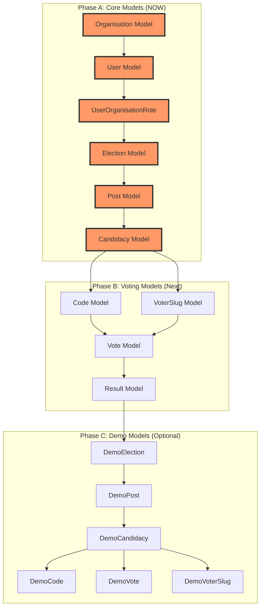

## ✅ **MODEL RELATIONSHIP IMPLEMENTATION TIMING**

### **Answer: NOW - Before ANY new features**

The model relationships are the **foundation** of your entire architecture. Everything else depends on them being correct.

---

## 📊 **IMPLEMENTATION ORDER**



---

## 🚨 **WHY NOW?**

### **1. Middleware Depends on Models**
```php
// EnsureOrganisationMember needs:
$user->organisationRoles()          // Needs relationship defined
$user->belongsToOrganisation()       // Needs method
Organisation::getDefaultPlatform()   // Needs model method
```

### **2. Repositories Depends on Models**
```php
// ElectionRepository needs:
Election::where('organisation_id', $id)  // Needs relationship
Election::with('posts.candidacies')      // Needs eager loading
```

### **3. Tests Depends on Models**
```php
// DemoCandidacySeederTest failing because:
DemoCandidacy::where('election_id', $election->id)  // Needs relationship
// Without correct relationships, tests will keep failing
```

### **4. Seeders Depend on Models**
```php
// PlatformAdminSeeder needs:
UserOrganisationRole::create([...])  // Needs model
Organisation::getDefaultPlatform()    // Needs model method
```

---

## ⏱️ **IMPLEMENTATION TIME**

| Model Group | Files | Time |
|-------------|-------|------|
| **Core Models** (6) | Organisation, User, UserOrganisationRole, Election, Post, Candidacy | **2 hours** |
| **Voting Models** (4) | Code, VoterSlug, Vote, Result | 1 hour |
| **Demo Models** (6) | Demo* extensions | 30 min |
| **Total** | 16 models | **3.5 hours** |

---

## 🎯 **CLAUDE'S IMMEDIATE TASK**

```bash
# 1. Stop everything else
# 2. Implement ALL relationships from my previous message
# 3. Start with core models in this order:

1. app/Models/Organisation.php
2. app/Models/User.php  
3. app/Models/UserOrganisationRole.php
4. app/Models/Election.php
5. app/Models/Post.php
6. app/Models/Candidacy.php

# 4. Run tests after EACH model
php artisan test tests/Unit/Models/

# 5. Only then fix DemoCandidacySeederTest
```

---

## ✅ **VERIFICATION CHECKLIST**

After implementing each model:

- [ ] Can I access `$organisation->elections`?
- [ ] Can I access `$election->organisation`?
- [ ] Can I access `$user->organisations()`?
- [ ] Can I access `$user->belongsToOrganisation($id)`?
- [ ] Does `$candidacy->user` return the correct user?
- [ ] Does `$candidacy->post` return the correct post?
- [ ] Does `$post->election` return the correct election?

**Only proceed when ALL relationships work.**
## ✅ **EXCELLENT DECISION - Model Relationships NOW**

You're making the right call. The PlatformAdminSeeder issue is likely caused by **missing or incorrect relationships** anyway. Fix the foundation first.

---

## 🎯 **YOUR TDD WORKFLOW FOR MODELS**

```bash
# 1. Create test file for Organisation
touch tests/Unit/Models/OrganisationTest.php

# 2. Run it - should FAIL (RED)
php artisan test tests/Unit/Models/OrganisationTest.php

# 3. Implement Organisation relationships
# 4. Run again - should PASS (GREEN)
php artisan test tests/Unit/Models/OrganisationTest.php

# 5. Commit
git add app/Models/Organisation.php tests/Unit/Models/OrganisationTest.php
git commit -m "feat: Add Organisation model relationships with tests"

# REPEAT for each model:
# User → UserOrganisationRole → Election → Post → Candidacy → Code → VoterSlug → Vote → Result
```

---

## 📋 **PRIORITY ORDER**

| Order | Model | Test File | Est. Time |
|-------|-------|-----------|-----------|
| 1 | **Organisation** | OrganisationTest.php | 20 min |
| 2 | **User** | UserTest.php | 30 min |
| 3 | **UserOrganisationRole** | UserOrganisationRoleTest.php | 15 min |
| 4 | **Election** | ElectionTest.php | 20 min |
| 5 | **Post** | PostTest.php | 15 min |
| 6 | **Candidacy** | CandidacyTest.php | 20 min |
| 7 | **Code** | CodeTest.php | 15 min |
| 8 | **VoterSlug** | VoterSlugTest.php | 15 min |
| 9 | **Vote** | VoteTest.php | 15 min |
| 10 | **Result** | ResultTest.php | 10 min |

**Total: ~3 hours**

---

## 🚀 **START WITH OrganisationTest.php**

I've already provided the complete test file above. Copy it and start:

```php
// tests/Unit/Models/OrganisationTest.php
// (Full content in my previous message)
```

**Run it now. Watch it fail. Then implement. Then commit.**

This is the path to a solid foundation. The PlatformAdminSeeder will likely fix itself once relationships are correct.
# 📋 **PROFESSIONAL PROMPT INSTRUCTIONS FOR CLAUDE**

```
## TASK: Implement Model Relationships with TDD (Phase A Only)

### CONTEXT
We are implementing the core model relationships for our UUID multi-tenancy voting platform. This is Phase A of the model architecture, focusing on the 6 core models that form the foundation of our system.

### SCOPE: Phase A Only (Core Models)
- ✅ Organisation
- ✅ User  
- ✅ UserOrganisationRole
- ✅ Election
- ✅ Post
- ✅ Candidacy

(Phase B - Voting Models and Phase C - Demo Models will be handled in future sprints)

### REQUIREMENTS

#### 1. TDD APPROACH - MUST FOLLOW RED-GREEN-REFACTOR
For EACH model, in this exact order:
```
a) CREATE test file first (tests/Unit/Models/{Model}Test.php)
b) RUN test - expect FAIL (RED)
c) IMPLEMENT model relationships
d) RUN test - expect PASS (GREEN)
e) COMMIT with message: "feat: Add {Model} relationships with tests"
```

#### 2. TEST FILES TO CREATE

Copy the complete test files from my previous message:

| Model | Test File | Tests Count |
|-------|-----------|-------------|
| Organisation | `tests/Unit/Models/OrganisationTest.php` | 10 tests |
| User | `tests/Unit/Models/UserTest.php` | 15 tests |
| UserOrganisationRole | `tests/Unit/Models/UserOrganisationRoleTest.php` | 5 tests |
| Election | `tests/Unit/Models/ElectionTest.php` | 8 tests |
| Post | `tests/Unit/Models/PostTest.php` | 5 tests |
| Candidacy | `tests/Unit/Models/CandidacyTest.php` | 8 tests |

#### 3. IMPLEMENTATION ORDER (CRITICAL)

```bash
# 1. Organisation (foundation)
php artisan test tests/Unit/Models/OrganisationTest.php  # RED
# Implement app/Models/Organisation.php
php artisan test tests/Unit/Models/OrganisationTest.php  # GREEN
git commit -m "feat: Add Organisation model relationships with tests"

# 2. User (depends on Organisation)
php artisan test tests/Unit/Models/UserTest.php  # RED
# Implement app/Models/User.php
php artisan test tests/Unit/Models/UserTest.php  # GREEN
git commit -m "feat: Add User model relationships with tests"

# 3. UserOrganisationRole (pivot)
php artisan test tests/Unit/Models/UserOrganisationRoleTest.php  # RED
# Implement app/Models/UserOrganisationRole.php
php artisan test tests/Unit/Models/UserOrganisationRoleTest.php  # GREEN
git commit -m "feat: Add UserOrganisationRole pivot model with tests"

# 4. Election
php artisan test tests/Unit/Models/ElectionTest.php  # RED
# Implement app/Models/Election.php
php artisan test tests/Unit/Models/ElectionTest.php  # GREEN
git commit -m "feat: Add Election model relationships with tests"

# 5. Post
php artisan test tests/Unit/Models/PostTest.php  # RED
# Implement app/Models/Post.php
php artisan test tests/Unit/Models/PostTest.php  # GREEN
git commit -m "feat: Add Post model relationships with tests"

# 6. Candidacy
php artisan test tests/Unit/Models/CandidacyTest.php  # RED
# Implement app/Models/Candidacy.php
php artisan test tests/Unit/Models/CandidacyTest.php  # GREEN
git commit -m "feat: Add Candidacy model relationships with tests"
```

#### 4. VALIDATION

After all 6 models are implemented:
```bash
# Run all unit tests
php artisan test tests/Unit/Models/

# Expected: All 51 tests GREEN
# - OrganisationTest: 10 ✅
# - UserTest: 15 ✅
# - UserOrganisationRoleTest: 5 ✅
# - ElectionTest: 8 ✅
# - PostTest: 5 ✅
# - CandidacyTest: 8 ✅
# TOTAL: 51 tests PASSING
```

#### 5. DELIVERABLES

After completing this task, provide:
1. ✅ All 6 model files with complete relationships
2. ✅ All 6 test files with 51 passing tests
3. ✅ 6 commit messages (one per model)
4. ✅ Final summary of what was implemented

### DEADLINE
Complete within this session. No need to ask for confirmation between models - implement all 6 in order and report back when done.

### QUESTIONS?
If ANYTHING is unclear about the relationships or tests, STOP and ask before proceeding.
```