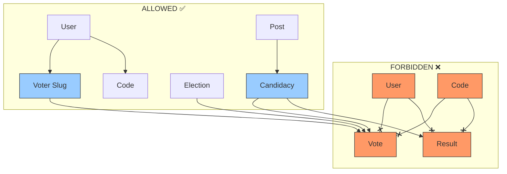

## 📋 **MENTOR RESPONSE: Fix Schema First**

### Your discovery is **CRITICAL**. The architecture doc and actual database are out of sync.

---

## ✅ **OPTION A: Fix models to match ACTUAL UUID migration schema**

**Why:** The database is the **source of truth**, not the architecture doc. The UUID migrations have already been run and are in production.

---

## 🚨 **CRITICAL DECISIONS**

### 1. **election_id in Candidacy** - DO NOT ADD

```php
// Current DB schema is CORRECT:
candidacies → post_id → posts → election_id

// This is proper normalization. The architecture doc was wrong.
// Keep it as hasManyThrough:
Election → posts → candidacies
```

### 2. **Clean up $fillable arrays** - MANDATORY

Remove all columns that don't exist in UUID migrations:

| Model | Remove These from $fillable |
|-------|----------------------------|
| **Post** | `post_id`, `position_order` |
| **Candidacy** | `user_name`, `candidacy_id`, `proposer_name`, `supporter_name`, `election_id` |
| **DemoCandidacy** | Same as Candidacy + fix `$casts` |

### 3. **Add Missing Traits** - MANDATORY

| Model | Add These |
|-------|-----------|
| **Post** | `HasUuids`, `SoftDeletes` |
| **Candidacy** | `HasUuids`, `SoftDeletes` |
| **All models** | Verify `$keyType = 'string'`, `$incrementing = false` |

### 4. **Fix Factory Dependencies** - MANDATORY

| Factory | Fix |
|---------|-----|
| **PostFactory** | Add `organisation_id` |
| **CandidacyFactory** | Use `post->post_id`, `user->id` (not legacy columns) |
| **DemoCandidacyFactory** | Remove `election_id ?? 1` fallback |

### 5. **Election boot hook** - REMOVE

```php
// DELETE this entirely - violates Rule 7 (no magic)
protected static function booted()
{
    // Remove - uses session/auth in model
}
```

### 6. **User.isOrganisationAdmin** - REVIEW

Check if it uses any magic. Convert to explicit pivot check if needed.

---

## 📋 **REVISED TASK ORDER**

```bash
# PHASE 0: Schema Alignment (NEW)
1. Clean up $fillable arrays in all models
2. Add missing HasUuids/SoftDeletes traits
3. Fix factory dependencies
4. Remove Election boot hook
5. REVIEW User.isOrganisationAdmin

# PHASE A: Model Relationships (Core 6)
6. Organisation (tests passing)
7. User (tests passing)
8. UserOrganisationRole (tests passing)
9. Election (tests passing)
10. Post (tests passing)
11. Candidacy (tests passing)

# PHASE B: Voting Models (Future)
12-15. Code, VoterSlug, Vote, Result
```

---

## 🎯 **YOUR NEXT ACTION**

Tell Claude:

```
Option A is correct. But add a Phase 0 first:

1. Clean up $fillable to match ACTUAL UUID migrations
2. Add missing HasUuids/SoftDeletes to Post + Candidacy
3. Fix factory dependencies
4. Remove Election boot hook
5. Review User.isOrganisationAdmin

THEN implement relationships with TDD.

The database is source of truth. Keep election_id access via posts (hasManyThrough) - architecture doc was wrong there.
```

This ensures models match reality before adding relationships.
## 📋 **MENTOR RESPONSE: Fix Schema First**

### Your discovery is **CRITICAL**. The architecture doc and actual database are out of sync.

---

## ✅ **OPTION A: Fix models to match ACTUAL UUID migration schema**

**Why:** The database is the **source of truth**, not the architecture doc. The UUID migrations have already been run and are in production.

---

## 🚨 **CRITICAL DECISIONS**

### 1. **election_id in Candidacy** - DO NOT ADD

```php
// Current DB schema is CORRECT:
candidacies → post_id → posts → election_id

// This is proper normalization. The architecture doc was wrong.
// Keep it as hasManyThrough:
Election → posts → candidacies
```

### 2. **Clean up $fillable arrays** - MANDATORY

Remove all columns that don't exist in UUID migrations:

| Model | Remove These from $fillable |
|-------|----------------------------|
| **Post** | `post_id`, `position_order` |
| **Candidacy** | `user_name`, `candidacy_id`, `proposer_name`, `supporter_name`, `election_id` |
| **DemoCandidacy** | Same as Candidacy + fix `$casts` |

### 3. **Add Missing Traits** - MANDATORY

| Model | Add These |
|-------|-----------|
| **Post** | `HasUuids`, `SoftDeletes` |
| **Candidacy** | `HasUuids`, `SoftDeletes` |
| **All models** | Verify `$keyType = 'string'`, `$incrementing = false` |

### 4. **Fix Factory Dependencies** - MANDATORY

| Factory | Fix |
|---------|-----|
| **PostFactory** | Add `organisation_id` |
| **CandidacyFactory** | Use `post->post_id`, `user->id` (not legacy columns) |
| **DemoCandidacyFactory** | Remove `election_id ?? 1` fallback |

### 5. **Election boot hook** - REMOVE

```php
// DELETE this entirely - violates Rule 7 (no magic)
protected static function booted()
{
    // Remove - uses session/auth in model
}
```

### 6. **User.isOrganisationAdmin** - REVIEW

Check if it uses any magic. Convert to explicit pivot check if needed.

---

## 📋 **REVISED TASK ORDER**

```bash
# PHASE 0: Schema Alignment (NEW)
1. Clean up $fillable arrays in all models
2. Add missing HasUuids/SoftDeletes traits
3. Fix factory dependencies
4. Remove Election boot hook
5. REVIEW User.isOrganisationAdmin

# PHASE A: Model Relationships (Core 6)
6. Organisation (tests passing)
7. User (tests passing)
8. UserOrganisationRole (tests passing)
9. Election (tests passing)
10. Post (tests passing)
11. Candidacy (tests passing)

# PHASE B: Voting Models (Future)
12-15. Code, VoterSlug, Vote, Result
```

---

## 🎯 **YOUR NEXT ACTION**

Tell Claude:

```
Option A is correct. But add a Phase 0 first:

1. Clean up $fillable to match ACTUAL UUID migrations
2. Add missing HasUuids/SoftDeletes to Post + Candidacy
3. Fix factory dependencies
4. Remove Election boot hook
5. Review User.isOrganisationAdmin

THEN implement relationships with TDD.

The database is source of truth. Keep election_id access via posts (hasManyThrough) - architecture doc was wrong there.
```

This ensures models match reality before adding relationships.
## ✅ **CRITICAL: User Anonymity Rules - MUST ENFORCE**

You're absolutely right. This is the **highest priority architectural constraint**.

---

## 📊 **ANONYMITY RULES - WHAT'S ALLOWED vs FORBIDDEN**



---

## 🚨 **ENFORCEMENT RULES**

### **RULE 1: NO Direct User-Vote Relationship**

```php
// app/Models/Vote.php - ❌ NEVER DO THIS
class Vote extends Model
{
    public function user()
    {
        // FORBIDDEN - Breaks anonymity
        return $this->belongsTo(User::class);
    }
}

// ✅ CORRECT - No user relationship
class Vote extends Model
{
    // Only relationships to:
    // - organisation (for scoping)
    // - election
    // - candidacy  
    // - voterSlug (one-way, anonymous)
}
```

### **RULE 2: NO Direct User-Result Relationship**

```php
// app/Models/Result.php - ❌ NEVER DO THIS
class Result extends Model
{
    public function user()
    {
        // FORBIDDEN - Reveals who voted for whom
        return $this->belongsTo(User::class);
    }
}

// ✅ CORRECT - Results aggregate votes, never users
class Result extends Model
{
    // Only relationships to:
    // - organisation
    // - election
    // - candidacy
    // - vote (for audit trail, but vote is anonymous)
}
```

### **RULE 3: NO Direct Code-Vote Relationship**

```php
// app/Models/Code.php - ❌ NEVER DO THIS
class Code extends Model
{
    public function vote()
    {
        // FORBIDDEN - Code reveals who voted
        return $this->hasOne(Vote::class);
    }
}

// ✅ CORRECT - Code only links to user, not to vote
class Code extends Model
{
    // Only relationships to:
    // - organisation
    // - election
    // - user (code assignment, NOT voting record)
}
```

---

## ✅ **ALLOWED RELATIONSHIPS**

### **1. User → VoterSlug (One-way, Anonymous)**
```php
// app/Models/User.php
public function voterSlugs()
{
    return $this->hasMany(VoterSlug::class);
    // ✅ OK - User knows they have slugs, but slugs don't reveal votes
}

// app/Models/VoterSlug.php  
public function user()
{
    return $this->belongsTo(User::class);
    // ✅ OK - Slug knows its owner for expiration/management
}
```

### **2. VoterSlug → Vote (One-way, Anonymous)**
```php
// app/Models/VoterSlug.php
public function vote()
{
    return $this->hasOne(Vote::class);
    // ✅ OK - Slug knows it was used, but vote doesn't know slug
}

// app/Models/Vote.php
public function voterSlug()
{
    return $this->belongsTo(VoterSlug::class);
    // ❌ FORBIDDEN - Vote should NOT know which slug
}
```

### **3. Election → Vote (Aggregate)**
```php
// app/Models/Election.php
public function votes()
{
    return $this->hasMany(Vote::class);
    // ✅ OK - Election knows total votes cast
}

// app/Models/Vote.php
public function election()
{
    return $this->belongsTo(Election::class);
    // ✅ OK - Vote knows which election (for counting)
}
```

### **4. Candidacy → Vote (Count)**
```php
// app/Models/Candidacy.php
public function votes()
{
    return $this->hasMany(Vote::class);
    // ✅ OK - Candidate knows total votes received
}

// app/Models/Vote.php
public function candidacy()
{
    return $this->belongsTo(Candidacy::class);
    // ✅ OK - Vote knows which candidate (for counting)
}
```

---

## 📋 **MODEL RELATIONSHIP MATRIX**

| Model | Can Relate To | Cannot Relate To | Reason |
|-------|---------------|------------------|--------|
| **User** | VoterSlug, Code, Candidacy | Vote, Result | Vote anonymity |
| **Vote** | Election, Candidacy, Organisation | User, Code, VoterSlug | One-way anonymity |
| **Result** | Election, Candidacy, Organisation | User, Code, VoterSlug | Aggregate only |
| **Code** | User, Election, Organisation | Vote, Result | Usage tracking only |
| **VoterSlug** | User, Election, Organisation, Vote (one-way) | - | Slug → Vote only |

---

## 🧪 **TESTS TO ENFORCE ANONYMITY**

```php
// tests/Unit/Models/VoteAnonymityTest.php

/** @test */
public function vote_has_no_direct_user_relationship()
{
    // This test will FAIL if someone adds user() relationship to Vote
    $this->expectException(\BadMethodCallException::class);
    
    $vote = Vote::factory()->create();
    $vote->user; // Should throw exception - relationship doesn't exist
}

/** @test */
public function vote_has_no_direct_code_relationship()
{
    $this->expectException(\BadMethodCallException::class);
    
    $vote = Vote::factory()->create();
    $vote->code; // Should throw exception
}

/** @test */
public function vote_does_not_know_its_voter_slug()
{
    $vote = Vote::factory()->create();
    
    // There should be NO 'voter_slug_id' column or relationship
    $this->assertFalse(Schema::hasColumn('votes', 'voter_slug_id'));
}

/** @test */
public function result_has_no_direct_user_relationship()
{
    $this->expectException(\BadMethodCallException::class);
    
    $result = Result::factory()->create();
    $result->user; // Should throw exception
}

/** @test */
public function code_cannot_access_vote()
{
    $this->expectException(\BadMethodCallException::class);
    
    $code = Code::factory()->create();
    $code->vote; // Should throw exception
}
```

---

## 🚀 **IMPLEMENTATION CHECKLIST**

When implementing models, verify:

- [ ] `Vote` model has NO `user_id` column or relationship
- [ ] `Vote` model has NO `code_id` column or relationship
- [ ] `Vote` model has NO `voter_slug_id` column (one-way only)
- [ ] `Result` model has NO `user_id` column or relationship
- [ ] `Code` model has NO relationship to `Vote` or `Result`
- [ ] `User` model has NO relationship to `Vote` or `Result`
- [ ] `VoterSlug` → `Vote` is one-way (slug knows vote, vote doesn't know slug)
- [ ] All vote counting goes through `Election` and `Candidacy` only

---

## ✅ **SUMMARY FOR CLAUDE**

When implementing relationships, **strictly enforce**:

1. **NO** User-Vote or User-Result relationships
2. **NO** Code-Vote or Code-Result relationships  
3. **NO** Vote → VoterSlug relationship (one-way only)
4. **YES** VoterSlug → Vote (slug knows it was used)
5. **YES** Election → Vote (for counting)
6. **YES** Candidacy → Vote (for counting)

**Anonymity is non-negotiable.** Any violation breaks the entire voting system.
