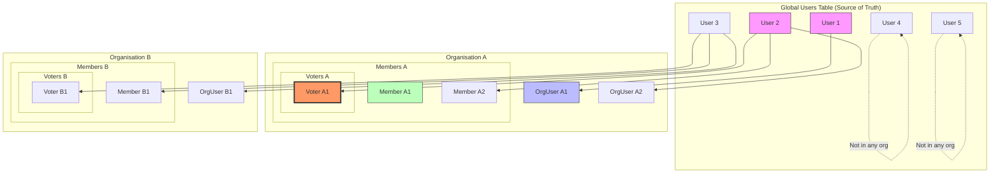
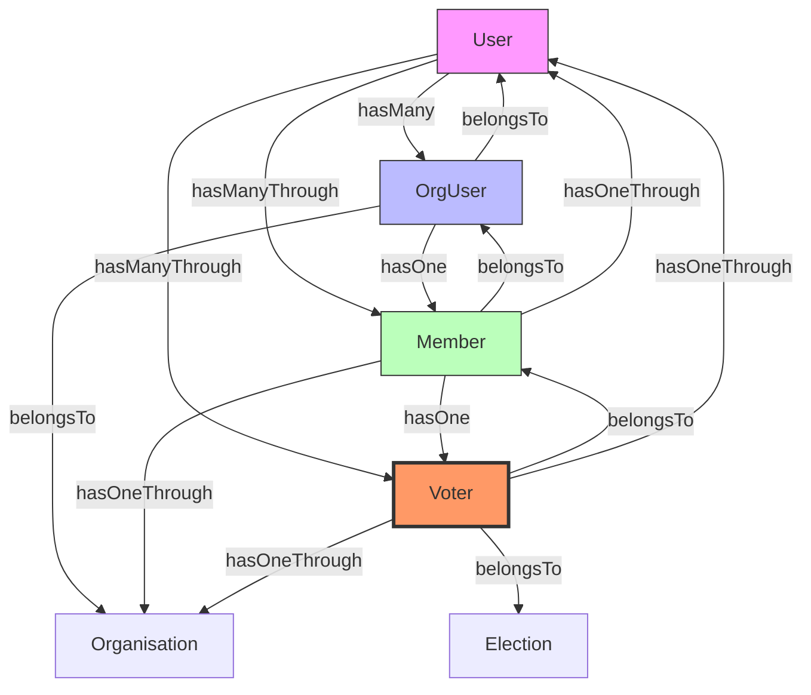

## 📊 **COMPLETE USER HIERARCHY ARCHITECTURE**

### This is an excellent domain-driven design! Here's the complete implementation:

---

## 🏛️ **USER HIERARCHY VISUALIZATION**



---

## 📋 **DATABASE SCHEMA**

```sql
-- ============================================
-- 1. GLOBAL USERS TABLE (Source of Truth)
-- ============================================
CREATE TABLE users (
    id UUID PRIMARY KEY,
    email VARCHAR(255) UNIQUE NOT NULL,
    password VARCHAR(255) NOT NULL,
    name VARCHAR(255) NOT NULL,
    created_at TIMESTAMP NULL,
    updated_at TIMESTAMP NULL,
    deleted_at TIMESTAMP NULL
);

-- ============================================
-- 2. ORGANISATION MEMBERSHIP PIVOT (OrgUsers)
-- ============================================
CREATE TABLE organisation_users (
    id UUID PRIMARY KEY,
    organisation_id UUID NOT NULL,
    user_id UUID NOT NULL,
    status ENUM('active', 'inactive', 'suspended') DEFAULT 'active',
    joined_at TIMESTAMP NULL,
    created_at TIMESTAMP NULL,
    updated_at TIMESTAMP NULL,
    deleted_at TIMESTAMP NULL,
    
    FOREIGN KEY (organisation_id) REFERENCES organisations(id) ON DELETE CASCADE,
    FOREIGN KEY (user_id) REFERENCES users(id) ON DELETE CASCADE,
    UNIQUE KEY unique_org_user (organisation_id, user_id),
    
    INDEX idx_org_user_lookup (organisation_id, user_id),
    INDEX idx_user_org_lookup (user_id, organisation_id)
);

-- ============================================
-- 3. MEMBERS TABLE (OrgUsers with member role)
-- ============================================
CREATE TABLE members (
    id UUID PRIMARY KEY,
    organisation_user_id UUID NOT NULL UNIQUE,
    membership_number VARCHAR(100) NULL,
    joined_at TIMESTAMP NULL,
    membership_status ENUM('active', 'expired', 'suspended') DEFAULT 'active',
    created_at TIMESTAMP NULL,
    updated_at TIMESTAMP NULL,
    deleted_at TIMESTAMP NULL,
    
    FOREIGN KEY (organisation_user_id) REFERENCES organisation_users(id) ON DELETE CASCADE,
    
    INDEX idx_member_status (membership_status),
    INDEX idx_org_member_lookup (organisation_user_id)  -- Links back to org via organisation_users
);

-- ============================================
-- 4. VOTERS TABLE (Members who can vote)
-- ============================================
CREATE TABLE voters (
    id UUID PRIMARY KEY,
    member_id UUID NOT NULL UNIQUE,
    election_id UUID NOT NULL,
    voter_number VARCHAR(100) NULL,
    has_voted BOOLEAN DEFAULT FALSE,
    voted_at TIMESTAMP NULL,
    voter_status ENUM('eligible', 'voted', 'ineligible') DEFAULT 'eligible',
    created_at TIMESTAMP NULL,
    updated_at TIMESTAMP NULL,
    deleted_at TIMESTAMP NULL,
    
    FOREIGN KEY (member_id) REFERENCES members(id) ON DELETE CASCADE,
    FOREIGN KEY (election_id) REFERENCES elections(id) ON DELETE CASCADE,
    
    -- One member can only be a voter once per election
    UNIQUE KEY unique_member_election (member_id, election_id),
    
    INDEX idx_voter_status (voter_status),
    INDEX idx_election_voters (election_id, voter_status),
    INDEX idx_member_voter (member_id)  -- Fast lookup
);
```

---

## 🧠 **MODEL HIERARCHY**

### **1. User Model (Global)**

```php
// app/Models/User.php

class User extends Authenticatable
{
    use HasFactory, HasUuids, SoftDeletes;
    
    // === RELATIONSHIPS ===
    
    public function organisationUsers()
    {
        return $this->hasMany(OrganisationUser::class);
    }
    
    public function organisations()
    {
        return $this->belongsToMany(Organisation::class, 'organisation_users')
            ->withPivot('status', 'joined_at')
            ->withTimestamps();
    }
    
    public function members()
    {
        return $this->hasManyThrough(
            Member::class,
            OrganisationUser::class,
            'user_id',      // FK on organisation_users
            'organisation_user_id', // FK on members
            'id',           // Local key on users
            'id'            // Local key on organisation_users
        );
    }
    
    public function voters()
    {
        return $this->hasManyThrough(
            Voter::class,
            OrganisationUser::class,
            'user_id',
            'member_id',    // This is a bit complex - voters access through members
            'id',
            'id'
        )->whereHas('member', function ($q) {
            // Ensure we only get voters through valid members
        });
    }
    
    // === HELPER METHODS ===
    
    public function isOrgUser(string $organisationId): bool
    {
        return $this->organisationUsers()
            ->where('organisation_id', $organisationId)
            ->exists();
    }
    
    public function isMember(string $organisationId): bool
    {
        return $this->members()
            ->whereHas('organisationUser', function ($q) use ($organisationId) {
                $q->where('organisation_id', $organisationId);
            })
            ->exists();
    }
    
    public function isVoter(string $organisationId, string $electionId): bool
    {
        return $this->voters()
            ->where('election_id', $electionId)
            ->whereHas('member.organisationUser', function ($q) use ($organisationId) {
                $q->where('organisation_id', $organisationId);
            })
            ->exists();
    }
}
```

### **2. OrganisationUser Model (OrgUser)**

```php
// app/Models/OrganisationUser.php

class OrganisationUser extends Model
{
    use HasFactory, HasUuids, SoftDeletes, BelongsToTenant;
    
    protected $table = 'organisation_users';
    
    protected $fillable = [
        'organisation_id',
        'user_id',
        'status',
        'joined_at',
    ];
    
    protected $casts = [
        'joined_at' => 'datetime',
    ];
    
    // === RELATIONSHIPS ===
    
    public function organisation()
    {
        return $this->belongsTo(Organisation::class);
    }
    
    public function user()
    {
        return $this->belongsTo(User::class);
    }
    
    public function member()
    {
        return $this->hasOne(Member::class, 'organisation_user_id');
    }
    
    // === SCOPES ===
    
    public function scopeActive($query)
    {
        return $query->where('status', 'active');
    }
    
    // === BUSINESS LOGIC ===
    
    public function isActive(): bool
    {
        return $this->status === 'active';
    }
    
    public function makeMember(array $data = []): Member
    {
        if ($this->member) {
            throw new \Exception('User is already a member');
        }
        
        return $this->member()->create([
            'membership_number' => $data['membership_number'] ?? null,
            'joined_at' => $data['joined_at'] ?? now(),
        ]);
    }
}
```

### **3. Member Model**

```php
// app/Models/Member.php

class Member extends Model
{
    use HasFactory, HasUuids, SoftDeletes, BelongsToTenant;
    
    protected $table = 'members';
    
    protected $fillable = [
        'organisation_user_id',
        'membership_number',
        'joined_at',
        'membership_status',
    ];
    
    protected $casts = [
        'joined_at' => 'datetime',
    ];
    
    // === RELATIONSHIPS ===
    
    public function organisationUser()
    {
        return $this->belongsTo(OrganisationUser::class);
    }
    
    public function user()
    {
        return $this->hasOneThrough(
            User::class,
            OrganisationUser::class,
            'id',           // FK on organisation_users
            'id',           // FK on users
            'organisation_user_id', // Local key on members
            'user_id'       // Local key on organisation_users
        );
    }
    
    public function organisation()
    {
        return $this->hasOneThrough(
            Organisation::class,
            OrganisationUser::class,
            'id',           // FK on organisation_users
            'id',           // FK on organisations
            'organisation_user_id', // Local key on members
            'organisation_id' // Local key on organisation_users
        );
    }
    
    public function voter()
    {
        return $this->hasOne(Voter::class, 'member_id');
    }
    
    // === SCOPES ===
    
    public function scopeActive($query)
    {
        return $query->where('membership_status', 'active');
    }
    
    // === BUSINESS LOGIC ===
    
    public function isActive(): bool
    {
        return $this->membership_status === 'active';
    }
    
    public function makeVoter(Election $election, array $data = []): Voter
    {
        if ($this->voter) {
            throw new \Exception('Member is already a voter');
        }
        
        return Voter::create([
            'member_id' => $this->id,
            'election_id' => $election->id,
            'voter_number' => $data['voter_number'] ?? null,
            'voter_status' => 'eligible',
        ]);
    }
}
```

### **4. Voter Model**

```php
// app/Models/Voter.php

class Voter extends Model
{
    use HasFactory, HasUuids, SoftDeletes, BelongsToTenant;
    
    protected $table = 'voters';
    
    protected $fillable = [
        'member_id',
        'election_id',
        'voter_number',
        'has_voted',
        'voted_at',
        'voter_status',
    ];
    
    protected $casts = [
        'has_voted' => 'boolean',
        'voted_at' => 'datetime',
    ];
    
    // === RELATIONSHIPS ===
    
    public function member()
    {
        return $this->belongsTo(Member::class);
    }
    
    public function user()
    {
        return $this->hasOneThrough(
            User::class,
            Member::class,
            'id',           // FK on members
            'id',           // FK on users
            'member_id',    // Local key on voters
            'user_id'       // Local key on members
        )->via('organisationUser');
    }
    
    public function organisation()
    {
        return $this->hasOneThrough(
            Organisation::class,
            Member::class,
            'id',
            'id',
            'member_id',
            'organisation_id'
        )->via('organisationUser');
    }
    
    public function election()
    {
        return $this->belongsTo(Election::class);
    }
    
    public function vote()
    {
        return $this->hasOne(Vote::class, 'voter_slug_id'); // or whatever links
    }
    
    // === SCOPES ===
    
    public function scopeEligible($query)
    {
        return $query->where('voter_status', 'eligible')
            ->where('has_voted', false);
    }
    
    public function scopeForElection($query, string $electionId)
    {
        return $query->where('election_id', $electionId);
    }
    
    // === BUSINESS LOGIC ===
    
    public function markAsVoted(): void
    {
        $this->has_voted = true;
        $this->voted_at = now();
        $this->voter_status = 'voted';
        $this->save();
    }
    
    public function canVote(): bool
    {
        return $this->voter_status === 'eligible' && !$this->has_voted;
    }
}
```

---

## 📊 **RELATIONSHIP SUMMARY**



---

## ✅ **HIERARCHY RULES ENFORCED**

| Level | Prerequisite | Table | Uniqueness |
|-------|--------------|-------|------------|
| **User** | None | `users` | Global (email) |
| **OrgUser** | Must have User + Org | `organisation_users` | Unique per (org, user) |
| **Member** | Must have OrgUser | `members` | One per OrgUser |
| **Voter** | Must have Member + Election | `voters` | Unique per (member, election) |

---

## 🎯 **KEY BENEFITS**

1. **Clear separation of concerns** - Each level has specific responsibilities
2. **Data integrity** - Foreign keys enforce the hierarchy
3. **Flexibility** - Can have OrgUsers who aren't Members, Members who aren't Voters
4. **Audit trail** - Each level has its own timestamps and status
5. **Organisation isolation** - All levels have `organisation_id` via relationships

This architecture gives you complete control over user progression through your system while maintaining data integrity and organisation isolation.