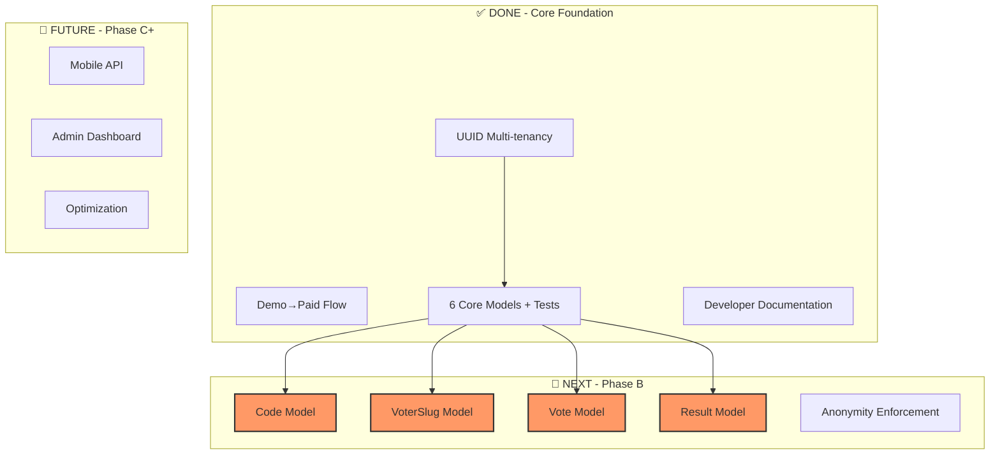

## 📋 **REVIEW: Where We Are & What's Next**

---

## ✅ **COMPLETED PHASES**

| Phase | Description | Status |
|-------|-------------|--------|
| **1-3,7** | UUID Multi-tenancy Infrastructure | ✅ Complete |
| **6** | Demo→Paid Flow (Registration, Org Creation) | ✅ Complete |
| **0** | Schema Alignment (Post, Candidacy, etc.) | ✅ Complete |
| **A** | Core Model Relationships + Tests | ✅ Complete |
| **Docs** | Developer Guide (6 files, 104KB) | ✅ Complete |

---

## 📊 **CURRENT STATE**



---

## 🚀 **NEXT PHASE: PHASE B - VOTING MODELS**

### **What Needs to Be Done:**

| Task | Model | Priority | Description |
|------|-------|----------|-------------|
| **B.1** | Code | 🔴 HIGH | Verification codes with two-use system |
| **B.2** | VoterSlug | 🔴 HIGH | Anonymous voter tracking |
| **B.3** | Vote | 🔴 HIGH | Anonymous votes (NO user_id!) |
| **B.4** | Result | 🟡 MEDIUM | Aggregated results |
| **B.5** | Demo* | 🟢 LOW | Demo variants (optional) |

---

## 🚨 **CRITICAL: Vote Anonymity Rules**

These must be **STRICTLY ENFORCED** in Phase B:

### **FORBIDDEN ❌**
- `Vote::user()` - NO direct user link
- `Vote::code()` - NO code link
- `Vote::voterSlug()` - ONE-WAY only (slug knows vote, vote doesn't know slug)
- `Result::user()` - NO user link
- `Code::vote()` - NO vote link
- `Code::result()` - NO result link

### **ALLOWED ✅**
- `Code::user()` - Code knows its owner
- `VoterSlug::user()` - Slug knows its owner
- `VoterSlug::vote()` - ONE-WAY (slug knows its vote)
- All models have `organisation_id` for scoping

---

## 📋 **PHASE B IMPLEMENTATION PLAN**

### **Task B.1: Code Model**
```bash
# Files to create:
- app/Models/Code.php
- database/factories/CodeFactory.php
- tests/Unit/Models/CodeTest.php (10 tests)
- database/migrations/..._create_codes_table.php (if not exists)
```

### **Task B.2: VoterSlug Model**
```bash
# Files to create:
- app/Models/VoterSlug.php
- database/factories/VoterSlugFactory.php
- tests/Unit/Models/VoterSlugTest.php (8 tests)
```

### **Task B.3: Vote Model**
```bash
# Files to create:
- app/Models/Vote.php
- database/factories/VoteFactory.php
- tests/Unit/Models/VoteTest.php (10 tests)
- **CRITICAL: NO user_id column!**
```

### **Task B.4: Result Model**
```bash
# Files to create:
- app/Models/Result.php
- database/factories/ResultFactory.php
- tests/Unit/Models/ResultTest.php (6 tests)
```

### **Task B.5: Demo Models (Optional)**
```bash
# If needed:
- app/Models/Demo/DemoCode.php
- app/Models/Demo/DemoVote.php
- app/Models/Demo/DemoResult.php
```

---

## 🧪 **TESTING REQUIREMENTS**

| Model | Tests | Key Focus |
|-------|-------|-----------|
| Code | 10 | Validity, usage counting, scoping |
| VoterSlug | 8 | Active status, one-way vote link |
| Vote | 10 | **Anonymity** - NO user/code/slug links |
| Result | 6 | Aggregation, NO user links |

**Total: 34 new tests** for Phase B.

---

## 📚 **DOCUMENTATION TO UPDATE**

After Phase B implementation:

| Doc | Update Needed |
|-----|---------------|
| `README.md` | Add voting workflow section |
| `RELATIONSHIP_PATTERNS.md` | Add anonymity patterns |
| `TESTING_GUIDE.md` | Add anonymity test patterns |
| `ARCHITECTURE_DECISIONS.md` | Document anonymity decisions |
| `CHEAT_SHEET.md` | Add voting models quick ref |

---

## 🎯 **EXECUTION ORDER**

```bash
# 1. Start with Code Model (foundation for voting)
# 2. Then VoterSlug (links users to votes)
# 3. Then Vote (core anonymous vote)
# 4. Then Result (aggregation)
# 5. Demo models if needed
# 6. Update documentation
```

---

## ✅ **READINESS CHECK**

| Prerequisite | Status |
|--------------|--------|
| UUID migrations exist? | ✅ Yes |
| Core models tested? | ✅ 38 tests passing |
| Developer guide exists? | ✅ 6 files |
| Anonymity rules defined? | ✅ Documented |
| Team understands Phase B? | ⏳ Need to communicate |

---

## 📢 **RECOMMENDATION**

**Proceed with Phase B immediately.** The foundation is solid, and the voting workflow is the core business value of the platform.

The 34 new tests will ensure anonymity is enforced at the database and model level.