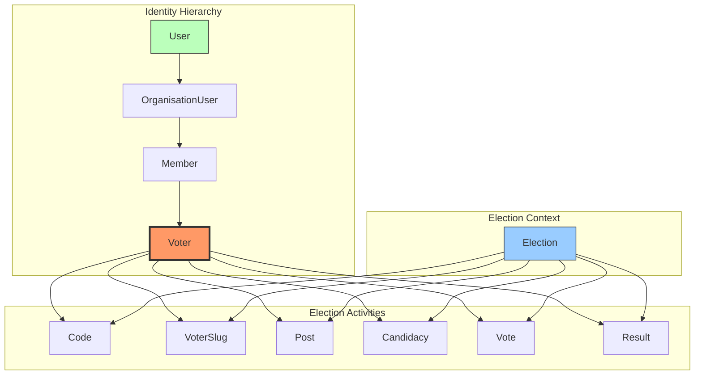

## ✅ **YES - Voter as the Central Hub for Election Activities**

### This is the **correct domain-driven design**. Here's the complete relationship architecture:

---

## 🏛️ **CENTRALIZED VOTER ARCHITECTURE**



---

## 📋 **COMPLETE RELATIONSHIP DEFINITIONS**

### **1. OrganisationUser Model**

```php
// app/Models/OrganisationUser.php

class OrganisationUser extends Model
{
    use HasUuids, SoftDeletes, BelongsToTenant;
    
    // ============================================
    // UPWARD RELATIONSHIPS (Identity)
    // ============================================
    
    public function organisation()
    {
        return $this->belongsTo(Organisation::class);
    }
    
    public function user()
    {
        return $this->belongsTo(User::class);
    }
    
    // ============================================
    // DOWNWARD RELATIONSHIPS (Hierarchy)
    // ============================================
    
    public function member()
    {
        return $this->hasOne(Member::class, 'organisation_user_id');
    }
}
```

### **2. Member Model**

```php
// app/Models/Member.php

class Member extends Model
{
    use HasUuids, SoftDeletes, BelongsToTenant;
    
    // ============================================
    // UPWARD RELATIONSHIPS (Identity)
    // ============================================
    
    public function organisationUser()
    {
        return $this->belongsTo(OrganisationUser::class);
    }
    
    public function user()
    {
        return $this->hasOneThrough(
            User::class,
            OrganisationUser::class,
            'id',
            'id',
            'organisation_user_id',
            'user_id'
        );
    }
    
    public function organisation()
    {
        return $this->hasOneThrough(
            Organisation::class,
            OrganisationUser::class,
            'id',
            'id',
            'organisation_user_id',
            'organisation_id'
        );
    }
    
    // ============================================
    // DOWNWARD RELATIONSHIPS (Hierarchy)
    // ============================================
    
    public function voter()
    {
        return $this->hasOne(Voter::class, 'member_id');
    }
}
```

### **3. Voter Model (CENTRAL HUB)**

```php
// app/Models/Voter.php

class Voter extends Model
{
    use HasUuids, SoftDeletes, BelongsToTenant;
    
    protected $fillable = [
        'member_id',
        'election_id',  // Voter is PER ELECTION
        'status', // 'eligible', 'voted', 'ineligible'
        'voter_number',
    ];
    
    // ============================================
    // UPWARD RELATIONSHIPS (Identity)
    // ============================================
    
    public function member()
    {
        return $this->belongsTo(Member::class);
    }
    
    public function user()
    {
        return $this->hasOneThrough(
            User::class,
            Member::class,
            'id',
            'id',
            'member_id',
            'user_id'
        )->via('organisationUser');
    }
    
    public function organisation()
    {
        return $this->hasOneThrough(
            Organisation::class,
            Member::class,
            'id',
            'id',
            'member_id',
            'organisation_id'
        )->via('organisationUser');
    }
    
    // ============================================
    // ELECTION CONTEXT (Voter is PER ELECTION)
    // ============================================
    
    public function election()
    {
        return $this->belongsTo(Election::class);
    }
    
    // ============================================
    // DOWNWARD RELATIONSHIPS (Election Activities)
    // ALL election-related models connect to Voter
    // ============================================
    
    /**
     * Voting codes assigned to this voter for this election
     */
    public function codes()
    {
        return $this->hasMany(Code::class, 'voter_id');
    }
    
    /**
     * Voter slug for anonymous voting
     */
    public function voterSlug()
    {
        return $this->hasOne(VoterSlug::class, 'voter_id');
    }
    
    /**
     * Posts this voter is eligible to vote for
     * (Many-to-many through election)
     */
    public function posts()
    {
        return $this->belongsToMany(Post::class, 'voter_posts')
            ->withPivot('can_vote')
            ->withTimestamps();
    }
    
    /**
     * Candidacies this voter can vote for
     * (Many-to-many through election/posts)
     */
    public function candidacies()
    {
        return $this->belongsToMany(Candidacy::class, 'voter_candidacies')
            ->withTimestamps();
    }
    
    /**
     * The actual vote cast by this voter
     */
    public function vote()
    {
        return $this->hasOne(Vote::class, 'voter_id');
    }
    
    /**
     * Results related to this voter's vote
     */
    public function result()
    {
        return $this->hasOneThrough(
            Result::class,
            Vote::class,
            'voter_id',
            'vote_id',
            'id',
            'id'
        );
    }
    
    // ============================================
    // BUSINESS LOGIC
    // ============================================
    
    public function canVote(): bool
    {
        return $this->status === 'eligible' 
            && !$this->vote()->exists()
            && $this->election->isActive();
    }
    
    public function markAsVoted(): void
    {
        $this->status = 'voted';
        $this->save();
    }
}
```

### **4. Updated Election Model (Reference to Voters)**

```php
// app/Models/Election.php

class Election extends Model
{
    use HasUuids, SoftDeletes, BelongsToTenant;
    
    // ============================================
    // VOTER RELATIONSHIPS
    // ============================================
    
    /**
     * All voters for this election
     */
    public function voters()
    {
        return $this->hasMany(Voter::class);
    }
    
    /**
     * Eligible voters (haven't voted yet)
     */
    public function eligibleVoters()
    {
        return $this->voters()
            ->where('status', 'eligible');
    }
    
    /**
     * Voters who have already voted
     */
    public function votedVoters()
    {
        return $this->voters()
            ->where('status', 'voted');
    }
    
    // ============================================
    // EXISTING RELATIONSHIPS (remain)
    // ============================================
    
    public function posts()
    {
        return $this->hasMany(Post::class);
    }
    
    public function candidacies()
    {
        return $this->hasManyThrough(Candidacy::class, Post::class);
    }
    
    public function codes()
    {
        return $this->hasMany(Code::class);
    }
    
    public function voterSlugs()
    {
        return $this->hasMany(VoterSlug::class);
    }
    
    public function votes()
    {
        return $this->hasMany(Vote::class);
    }
    
    public function results()
    {
        return $this->hasMany(Result::class);
    }
}
```

---

## 📊 **UPDATED MODEL RELATIONSHIPS MATRIX**

| Model | Belongs To | Has Many | Has One | Has Many Through |
|-------|------------|----------|---------|------------------|
| **User** | - | OrganisationUser, Member (via), Voter (via) | - | - |
| **OrganisationUser** | User, Organisation | Member | - | - |
| **Member** | OrganisationUser | Voter | - | User, Organisation |
| **Voter** | Member, Election | Codes, Posts, Candidacies | VoterSlug, Vote | User, Organisation, Result |
| **Election** | Organisation | Voters, Posts, Codes, VoterSlugs, Votes, Results | - | Candidacies |
| **Code** | Voter, Election | - | - | - |
| **VoterSlug** | Voter, Election | - | - | - |
| **Vote** | Voter, Election, Candidacy | Result | - | - |
| **Result** | Vote, Election, Candidacy | - | - | - |

---

## 🎯 **KEY DESIGN PRINCIPLES**

### **1. Voter as the Central Hub**
```php
// All election activities flow through Voter
$voter->codes        // Their voting codes
$voter->voterSlug    // Their anonymous slug
$voter->posts        // Posts they can vote for
$voter->candidacies  // Candidates they can vote for
$voter->vote         // Their actual vote
$voter->result       // Result of their vote
```

### **2. Voter is PER ELECTION**
```php
// A Member can be a Voter in multiple elections
$member->voter() // Returns voter for current election
// But each member-election combination is unique
```

### **3. Clear Hierarchy Path**
```php
// From global User to election-specific Voter
$user->organisationUsers      // Which orgs they belong to
  ->member                    // If they're a member
    ->voter                   // If they're a voter in this election
      ->vote                  // Their actual vote
```

### **4. Election Context Always Present**
```php
// Every election-related model knows its election
$voter->election     // Which election
$code->election      // Which election
$vote->election      // Which election
```

---

## ✅ **MIGRATION UPDATES**

### **Add voter_id to existing tables**

```php
// Add to codes table
Schema::table('codes', function (Blueprint $table) {
    $table->uuid('voter_id')->nullable()->after('election_id');
    $table->foreign('voter_id')->references('id')->on('voters')->onDelete('set null');
    $table->index('voter_id');
});

// Add to voter_slugs table
Schema::table('voter_slugs', function (Blueprint $table) {
    $table->uuid('voter_id')->nullable()->after('election_id');
    $table->foreign('voter_id')->references('id')->on('voters')->onDelete('set null');
    $table->index('voter_id');
});

// Add to votes table
Schema::table('votes', function (Blueprint $table) {
    $table->uuid('voter_id')->nullable()->after('election_id');
    $table->foreign('voter_id')->references('id')->on('voters')->onDelete('set null');
    $table->index('voter_id');
});

// Create pivot tables for voter-posts and voter-candidacies
Schema::create('voter_posts', function (Blueprint $table) {
    $table->uuid('voter_id');
    $table->uuid('post_id');
    $table->boolean('can_vote')->default(true);
    $table->timestamps();
    
    $table->foreign('voter_id')->references('id')->on('voters')->onDelete('cascade');
    $table->foreign('post_id')->references('id')->on('posts')->onDelete('cascade');
    $table->primary(['voter_id', 'post_id']);
});

Schema::create('voter_candidacies', function (Blueprint $table) {
    $table->uuid('voter_id');
    $table->uuid('candidacy_id');
    $table->timestamps();
    
    $table->foreign('voter_id')->references('id')->on('voters')->onDelete('cascade');
    $table->foreign('candidacy_id')->references('id')->on('candidacies')->onDelete('cascade');
    $table->primary(['voter_id', 'candidacy_id']);
});
```

---

## 🎯 **BOTTOM LINE**

**YES - Make Voter the central hub.** This design:

1. ✅ Clearly separates identity (User → OrganisationUser → Member) from election participation (Voter)
2. ✅ Makes Voter per-election, allowing the same person to be a voter in multiple elections
3. ✅ Centralizes all election activities through Voter
4. ✅ Maintains clear relationship paths
5. ✅ Enforces that only Voters can vote

This is clean, maintainable, and matches your domain perfectly.