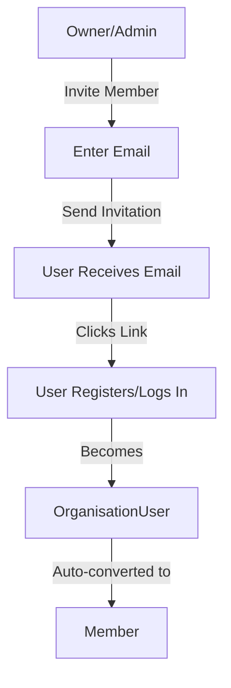
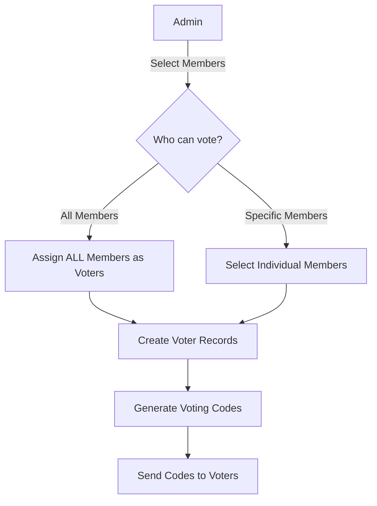
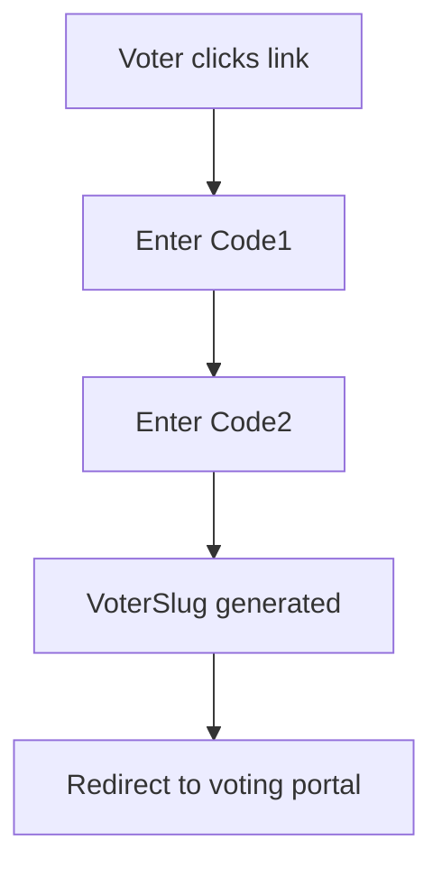
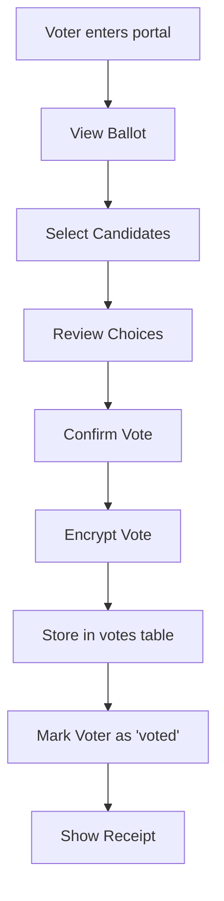
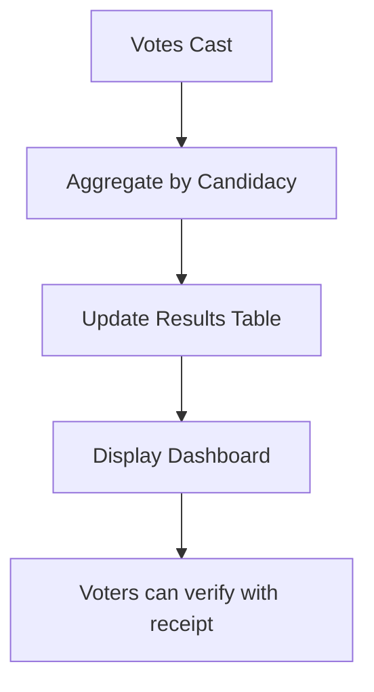

## 📋 **BUSINESS PROCESS: From User Registration to Voting**

### Complete step-by-step flow for an organisation to run an election

---

## 🏁 **PHASE 1: USER ACQUISITION & ONBOARDING**

### **Step 1: User Registers on PublicDigit**


**What happens:**
- User creates account with email/password
- System creates `User` record (global identity)
- User automatically added to Platform Organisation as `OrganisationUser` with role 'member'
- Verification email sent

**Technical:**
```php
$user = User::create([...]);
$platformOrg = Organisation::getPlatformOrganisation();

$orgUser = OrganisationUser::create([
    'user_id' => $user->id,
    'organisation_id' => $platformOrg->id,
    'status' => 'active'
]);
```

---

### **Step 2: Email Verification**
```
User clicks verification link
    ↓
Email verified (email_verified_at = now)
    ↓
DashboardResolver routes to /dashboard/welcome
```

---

## 🏢 **PHASE 2: ORGANISATION CREATION**

### **Step 3: User Creates Their Organisation**
```mermaid
graph TD
    A[User clicks "Create Organisation"] --> B[Fill Organisation Details]
    B -->|Name, Email, Address| C[Organisation Created]
    C --> D[User becomes OWNER]
    D --> E[Demo data auto-generated]
    E --> F[Redirect to Organisation Dashboard]
```

**What happens:**
- User fills organisation details
- System creates `Organisation` record with type='tenant'
- User is added as `OrganisationUser` with role='owner'
- User becomes `Member` automatically
- Demo election data is generated
- User's current context switches to new organisation

**Technical:**
```php
// In OrganisationController@store
DB::transaction(function () use ($request, $user) {
    // 1. Create organisation
    $org = Organisation::create([
        'name' => $request->name,
        'type' => 'tenant',
        'slug' => Str::slug($request->name),
    ]);
    
    // 2. Add user as OrganisationUser
    $orgUser = OrganisationUser::create([
        'user_id' => $user->id,
        'organisation_id' => $org->id,
        'status' => 'active',
        'joined_at' => now(),
    ]);
    
    // 3. Make them a Member
    $member = Member::create([
        'organisation_user_id' => $orgUser->id,
        'membership_number' => 'M' . uniqid(),
        'joined_at' => now(),
    ]);
    
    // 4. Generate demo data
    $this->generateDemoElection($org, $member);
    
    // 5. Switch context to new org
    session(['current_organisation_id' => $org->id]);
});
```

---

### **Step 4: Demo Election Experience**
```
Organisation Dashboard
    ↓
Shows demo election with sample data
    ↓
User can explore:
    - Demo posts (President, VP, Secretary)
    - Demo candidates (3 per post)
    - Demo voting process
    - Demo results
```

---

## 👥 **PHASE 3: MEMBER MANAGEMENT**

### **Step 5: Add Organisation Members**


**What happens:**
- Owner invites existing users or new users
- Invited user receives email with magic link
- User registers (if new) or logs in (if existing)
- System creates `OrganisationUser` record
- Auto-converts to `Member` with default settings

**Technical:**
```php
// Invitation process
public function inviteMember(Request $request, Organisation $org)
{
    $email = $request->email;
    $user = User::firstOrCreate(['email' => $email]);
    
    // Send invitation
    
    // When user accepts:
    $orgUser = OrganisationUser::firstOrCreate([
        'user_id' => $user->id,
        'organisation_id' => $org->id,
        'status' => 'active',
    ]);
    
    // Auto-convert to Member
    if (!$orgUser->member) {
        Member::create([
            'organisation_user_id' => $orgUser->id,
            'membership_number' => 'M' . uniqid(),
            'joined_at' => now(),
        ]);
    }
}
```

---

## 🗳️ **PHASE 4: ELECTION SETUP**

### **Step 6: Create an Election**
```mermaid
graph LR
    A[Owner/Admin] -->|Click "New Election"| B[Election Form]
    B -->|Name, Dates, Type| C[Election Created]
    C --> D[Add Posts/Positions]
    D --> E[Add Candidates]
    E --> F[Activate Election]
```

**What happens:**
- Admin creates election with name, dates, type (real/demo)
- System creates `Election` record
- Admin defines posts (positions) for the election
- Admin adds candidates to each post
- Election status set to 'active' when ready

**Technical:**
```php
$election = Election::create([
    'organisation_id' => $org->id,
    'name' => '2026 Board Election',
    'start_date' => '2026-06-01',
    'end_date' => '2026-06-15',
    'status' => 'draft',
]);

// Add posts
$post1 = Post::create([
    'organisation_id' => $org->id,
    'election_id' => $election->id,
    'name' => 'President',
    'required_number' => 1,
]);

// Add candidates
$candidate = Candidacy::create([
    'organisation_id' => $org->id,
    'election_id' => $election->id,
    'post_id' => $post1->id,
    'user_id' => $candidateUser->id,
    'name' => 'John Doe',
    'status' => 'approved',
]);
```

---

### **Step 7: Assign Voters to Election**


**What happens:**
- Admin selects which members can vote in this election
- For each selected member, system creates a `Voter` record
- `Voter` is linked to the member and election
- Unique voting codes generated for each voter
- Codes sent to voters via email/SMS

**Technical:**
```php
// Assign a member as voter for this election
public function assignVoter(Member $member, Election $election)
{
    // Check if already a voter
    if ($member->voter()->where('election_id', $election->id)->exists()) {
        throw new Exception('Already a voter');
    }
    
    // Create voter record
    $voter = Voter::create([
        'member_id' => $member->id,
        'election_id' => $election->id,
        'status' => 'eligible',
        'voter_number' => 'V' . uniqid(),
    ]);
    
    // Generate voting codes
    Code::create([
        'voter_id' => $voter->id,
        'election_id' => $election->id,
        'code1' => Str::random(8),
        'code2' => Str::random(8),
        'type' => 'voting',
    ]);
    
    // Create voter slug for anonymous voting
    VoterSlug::create([
        'voter_id' => $voter->id,
        'election_id' => $election->id,
        'slug' => Str::uuid(),
    ]);
    
    return $voter;
}
```

---

## 📧 **PHASE 5: VOTER NOTIFICATION**

### **Step 8: Voter Receives Access**
```
Voter receives email with:
    - Election details
    - Voting portal link
    - Code1 (first factor)
    - Code2 (second factor)
    - Instructions

OR via SMS for mobile voters
```

---

## 🗳️ **PHASE 6: VOTING PROCESS**

### **Step 9: Voter Authenticates**


**What happens:**
- Voter accesses unique voting link
- Enters both codes for 2-factor authentication
- System validates codes against `Code` model
- On success, creates/activates `VoterSlug`
- Voter redirected to anonymous voting session

**Technical:**
```php
// In VoteController@authenticate
public function authenticate(Request $request)
{
    $code = Code::where('code1', $request->code1)
        ->where('code2', $request->code2)
        ->where('is_used', false)
        ->first();
    
    if (!$code) {
        return back()->withErrors('Invalid codes');
    }
    
    $voter = $code->voter;
    
    // Check if voter is eligible
    if (!$voter->canVote()) {
        return back()->withErrors('Not eligible to vote');
    }
    
    // Create voter slug for anonymous session
    $slug = VoterSlug::create([
        'voter_id' => $voter->id,
        'election_id' => $voter->election_id,
        'slug' => Str::uuid(),
        'expires_at' => now()->addHours(24),
    ]);
    
    // Mark codes as used
    $code->markAsUsed();
    
    return redirect()->route('vote.portal', $slug->slug);
}
```

---

### **Step 10: Vote Casting**


**Technical:**
```php
public function castVote(Request $request, VoterSlug $slug)
{
    $voter = $slug->voter;
    
    // Verify still eligible
    if (!$voter->canVote()) {
        abort(403, 'Already voted');
    }
    
    // Create encrypted vote
    $vote = Vote::create([
        'voter_id' => $voter->id,
        'election_id' => $voter->election_id,
        'candidacy_id' => $request->candidacy_id,
        'encrypted_vote' => encrypt($request->choices),
        'verification_token' => Str::random(32),
    ]);
    
    // Mark voter as voted
    $voter->markAsVoted();
    
    // Mark slug as used
    $slug->markAsCompleted();
    
    return response()->json([
        'receipt' => $vote->verification_token,
        'message' => 'Vote recorded successfully'
    ]);
}
```

---

## 📊 **PHASE 7: RESULTS & VERIFICATION**

### **Step 11: Real-time Results**


### **Step 12: Vote Verification**
```
Voter enters receipt code at /verify
    ↓
System looks up vote by verification_token
    ↓
Shows: "Your vote for [Candidate] was counted"
    ↓
No user identity revealed
```

---

## 📈 **COMPLETE DATA FLOW SUMMARY**

| Step | Action | Models Involved |
|------|--------|-----------------|
| 1 | User registers | `User` |
| 2 | Creates organisation | `Organisation`, `OrganisationUser`, `Member` |
| 3 | Invites members | `OrganisationUser`, `Member` |
| 4 | Creates election | `Election`, `Post` |
| 5 | Adds candidates | `Candidacy` |
| 6 | Assigns voters | `Voter` (links `Member` to `Election`) |
| 7 | Generates codes | `Code` (linked to `Voter`) |
| 8 | Voter authenticates | `Code`, `VoterSlug` |
| 9 | Casts vote | `Vote` (linked to `Voter`) |
| 10 | Records result | `Result` |

---

## ✅ **KEY BUSINESS RULES ENFORCED**

1. 🔒 **Only Members can become Voters**
2. 🔒 **Only Voters can vote** (checked via `Voter::canVote()`)
3. 🔒 **One vote per voter per election** (unique constraint)
4. 🔒 **Two-factor authentication** via codes
5. 🔒 **Anonymous voting** via `VoterSlug`
6. 🔒 **Verifiable** via receipt tokens
7. 🔒 **Organisation isolation** at all levels

This complete flow ensures **security, anonymity, and integrity** throughout the entire election lifecycle.