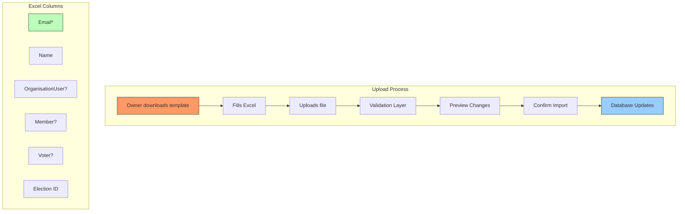

## ✅ **YES - Excel Import/Export for Organisation User Management**

### Here's a complete implementation for Excel-based user management:

---

## 📊 **EXCEL IMPORT ARCHITECTURE**



---

## 📋 **EXCEL TEMPLATE STRUCTURE**

### **Template: `organisation_user_template.xlsx`**

| email | name | is_org_user | is_member | is_voter | election_id |
|-------|------|-------------|-----------|----------|-------------|
| john@example.com | John Doe | YES | YES | YES | elec-123 |
| jane@example.com | Jane Smith | YES | YES | NO | - |
| bob@example.com | Bob Wilson | YES | NO | NO | - |
| alice@example.com | Alice Brown | NO | - | - | - |

**Column Rules:**
- `email` - Required, unique identifier
- `name` - Required for new users
- `is_org_user` - YES/NO, must be YES to proceed
- `is_member` - YES/NO, requires is_org_user=YES
- `is_voter` - YES/NO, requires is_member=YES
- `election_id` - Required if is_voter=YES

---

## 🏗️ **IMPLEMENTATION**

### **1. Create Import/Export Service**

```php
<?php
// app/Services/OrganisationUserImportService.php

namespace App\Services;

use App\Models\Organisation;
use App\Models\User;
use App\Models\OrganisationUser;
use App\Models\Member;
use App\Models\Voter;
use App\Models\Election;
use Illuminate\Support\Facades\DB;
use Illuminate\Support\Facades\Validator;
use Illuminate\Support\Str;
use Maatwebsite\Excel\Facades\Excel;
use App\Imports\OrganisationUserImport;

class OrganisationUserImportService
{
    protected Organisation $organisation;
    protected array $results = [
        'total' => 0,
        'created' => 0,
        'updated' => 0,
        'skipped' => 0,
        'errors' => [],
        'preview' => [],
    ];
    
    public function __construct(Organisation $organisation)
    {
        $this->organisation = $organisation;
    }
    
    /**
     * Download template for organisation users
     */
    public function downloadTemplate()
    {
        $headers = [
            'email',
            'name',
            'is_org_user',
            'is_member',
            'is_voter',
            'election_id',
        ];
        
        $sampleData = [
            [
                'john@example.com',
                'John Doe',
                'YES',
                'YES',
                'YES',
                $this->organisation->elections()->first()?->id ?? 'elec-123',
            ],
            [
                'jane@example.com',
                'Jane Smith',
                'YES',
                'YES',
                'NO',
                '',
            ],
        ];
        
        return Excel::download(
            new class($headers, $sampleData) implements \Maatwebsite\Excel\Concerns\FromArray {
                use \Maatwebsite\Excel\Concerns\WithHeadings;
                
                protected $data;
                
                public function __construct($headers, $data)
                {
                    $this->headings = $headers;
                    $this->data = $data;
                }
                
                public function array(): array
                {
                    return $this->data;
                }
                
                public function headings(): array
                {
                    return $this->headings;
                }
            },
            'organisation_user_template.xlsx'
        );
    }
    
    /**
     * Preview import (validate without saving)
     */
    public function preview($file): array
    {
        $rows = Excel::toArray(new OrganisationUserImport, $file)[0] ?? [];
        array_shift($rows); // Remove headers
        
        $preview = [];
        foreach ($rows as $index => $row) {
            $validation = $this->validateRow($row, $index + 2);
            
            $preview[] = [
                'row' => $index + 2,
                'email' => $row[0] ?? '',
                'name' => $row[1] ?? '',
                'is_org_user' => $row[2] ?? 'NO',
                'is_member' => $row[3] ?? 'NO',
                'is_voter' => $row[4] ?? 'NO',
                'election_id' => $row[5] ?? '',
                'status' => $validation['valid'] ? '✅ Valid' : '❌ Invalid',
                'errors' => $validation['errors'],
                'action' => $this->determineAction($row[0] ?? ''),
            ];
        }
        
        return $preview;
    }
    
    /**
     * Process import (save to database)
     */
    public function import($file): array
    {
        DB::beginTransaction();
        
        try {
            $rows = Excel::toArray(new OrganisationUserImport, $file)[0] ?? [];
            array_shift($rows); // Remove headers
            
            foreach ($rows as $index => $row) {
                $this->results['total']++;
                
                // Validate row
                $validation = $this->validateRow($row, $index + 2);
                if (!$validation['valid']) {
                    $this->results['errors'][] = [
                        'row' => $index + 2,
                        'errors' => $validation['errors'],
                    ];
                    $this->results['skipped']++;
                    continue;
                }
                
                // Process row
                $result = $this->processRow($row);
                if ($result['action'] === 'created') {
                    $this->results['created']++;
                } elseif ($result['action'] === 'updated') {
                    $this->results['updated']++;
                } else {
                    $this->results['skipped']++;
                }
            }
            
            DB::commit();
            
            return $this->results;
            
        } catch (\Exception $e) {
            DB::rollBack();
            throw $e;
        }
    }
    
    /**
     * Validate a single row
     */
    protected function validateRow(array $row, int $rowNumber): array
    {
        $errors = [];
        
        // Required fields
        if (empty($row[0])) {
            $errors[] = 'Email is required';
        } elseif (!filter_var($row[0], FILTER_VALIDATE_EMAIL)) {
            $errors[] = 'Invalid email format';
        }
        
        // Check org user flag
        $isOrgUser = strtoupper($row[2] ?? 'NO') === 'YES';
        if (!$isOrgUser) {
            // If not org user, skip further validation
            return ['valid' => true, 'errors' => []];
        }
        
        // Name required for org users
        if (empty($row[1])) {
            $errors[] = 'Name is required for organisation users';
        }
        
        // Member validation
        $isMember = strtoupper($row[3] ?? 'NO') === 'YES';
        if ($isMember) {
            // Member-specific validation
        }
        
        // Voter validation
        $isVoter = strtoupper($row[4] ?? 'NO') === 'YES';
        if ($isVoter) {
            if (!$isMember) {
                $errors[] = 'Cannot be voter without being member first';
            }
            
            $electionId = $row[5] ?? '';
            if (empty($electionId)) {
                $errors[] = 'Election ID required for voters';
            } else {
                $election = Election::where('organisation_id', $this->organisation->id)
                    ->where('id', $electionId)
                    ->exists();
                    
                if (!$election) {
                    $errors[] = 'Election not found in this organisation';
                }
            }
        }
        
        return [
            'valid' => empty($errors),
            'errors' => $errors,
        ];
    }
    
    /**
     * Process a single row
     */
    protected function processRow(array $row): array
    {
        $email = $row[0];
        $name = $row[1];
        $isOrgUser = strtoupper($row[2] ?? 'NO') === 'YES';
        $isMember = strtoupper($row[3] ?? 'NO') === 'YES';
        $isVoter = strtoupper($row[4] ?? 'NO') === 'YES';
        $electionId = $row[5] ?? null;
        
        // Find or create user
        $user = User::firstOrCreate(
            ['email' => $email],
            [
                'name' => $name,
                'password' => bcrypt(Str::random(40)), // Random password, will be reset
            ]
        );
        
        $action = $user->wasRecentlyCreated ? 'created' : 'updated';
        
        // Handle OrganisationUser
        if ($isOrgUser) {
            $orgUser = OrganisationUser::updateOrCreate(
                [
                    'user_id' => $user->id,
                    'organisation_id' => $this->organisation->id,
                ],
                [
                    'status' => 'active',
                    'joined_at' => now(),
                ]
            );
            
            // Handle Member
            if ($isMember) {
                $member = Member::updateOrCreate(
                    ['organisation_user_id' => $orgUser->id],
                    [
                        'membership_number' => 'M' . uniqid(),
                        'joined_at' => now(),
                        'membership_status' => 'active',
                    ]
                );
                
                // Handle Voter
                if ($isVoter && $electionId) {
                    Voter::updateOrCreate(
                        [
                            'member_id' => $member->id,
                            'election_id' => $electionId,
                        ],
                        [
                            'status' => 'eligible',
                            'voter_number' => 'V' . uniqid(),
                        ]
                    );
                } elseif ($member->voter) {
                    // Remove voter if no longer voter
                    $member->voter()->delete();
                }
            } elseif ($orgUser->member) {
                // Remove member and voter if no longer member
                $orgUser->member->voter()->delete();
                $orgUser->member()->delete();
            }
        } elseif ($orgUser = OrganisationUser::where('user_id', $user->id)
            ->where('organisation_id', $this->organisation->id)
            ->first()) {
            // Remove user from organisation
            $orgUser->member?->voter()?->delete();
            $orgUser->member?->delete();
            $orgUser->delete();
        }
        
        return ['action' => $action];
    }
    
    /**
     * Determine what action would be taken
     */
    protected function determineAction(string $email): string
    {
        $user = User::where('email', $email)->first();
        
        if (!$user) {
            return '🆕 New User + OrganisationUser';
        }
        
        $orgUser = OrganisationUser::where('user_id', $user->id)
            ->where('organisation_id', $this->organisation->id)
            ->first();
            
        if (!$orgUser) {
            return '🔄 Existing User + New OrganisationUser';
        }
        
        return '📝 Update Existing';
    }
}
```

---

### **2. Create Import Controller**

```php
<?php
// app/Http/Controllers/OrganisationUserImportController.php

namespace App\Http\Controllers;

use App\Services\OrganisationUserImportService;
use App\Models\Organisation;
use Illuminate\Http\Request;
use Inertia\Inertia;

class OrganisationUserImportController extends Controller
{
    protected OrganisationUserImportService $importService;
    
    public function __construct()
    {
        $this->middleware(['auth', 'verified', 'ensure.organisation.member']);
        $this->middleware('can:manage,organisation');
    }
    
    /**
     * Show import page
     */
    public function index(Organisation $organisation)
    {
        return Inertia::render('Organisations/Users/Import', [
            'organisation' => $organisation->only(['id', 'name', 'slug']),
            'elections' => $organisation->elections()
                ->where('status', 'active')
                ->get(['id', 'name']),
        ]);
    }
    
    /**
     * Download template
     */
    public function template(Organisation $organisation)
    {
        $service = new OrganisationUserImportService($organisation);
        return $service->downloadTemplate();
    }
    
    /**
     * Preview import
     */
    public function preview(Request $request, Organisation $organisation)
    {
        $request->validate([
            'file' => 'required|file|mimes:xlsx,xls,csv|max:10240',
        ]);
        
        $service = new OrganisationUserImportService($organisation);
        $preview = $service->preview($request->file('file'));
        
        return Inertia::render('Organisations/Users/ImportPreview', [
            'organisation' => $organisation,
            'preview' => $preview,
            'stats' => [
                'total' => count($preview),
                'valid' => collect($preview)->where('status', '✅ Valid')->count(),
                'invalid' => collect($preview)->where('status', '❌ Invalid')->count(),
            ],
        ]);
    }
    
    /**
     * Process import
     */
    public function import(Request $request, Organisation $organisation)
    {
        $request->validate([
            'file' => 'required|file|mimes:xlsx,xls,csv|max:10240',
            'confirmed' => 'required|boolean|accepted',
        ]);
        
        $service = new OrganisationUserImportService($organisation);
        $results = $service->import($request->file('file'));
        
        return redirect()
            ->route('organisations.users.index', $organisation->slug)
            ->with('success', "Import completed: {$results['created']} created, {$results['updated']} updated, {$results['skipped']} skipped");
    }
    
    /**
     * Export current users
     */
    public function export(Organisation $organisation)
    {
        // Get all organisation users with their status
        $users = OrganisationUser::where('organisation_id', $organisation->id)
            ->with(['user', 'member.voter'])
            ->get()
            ->map(function ($orgUser) {
                return [
                    $orgUser->user->email,
                    $orgUser->user->name,
                    'YES',
                    $orgUser->member ? 'YES' : 'NO',
                    $orgUser->member?->voter ? 'YES' : 'NO',
                    $orgUser->member?->voter?->election_id ?? '',
                ];
            })
            ->toArray();
        
        $headers = ['email', 'name', 'is_org_user', 'is_member', 'is_voter', 'election_id'];
        array_unshift($users, $headers);
        
        return Excel::download(
            new class($users) implements \Maatwebsite\Excel\Concerns\FromArray {
                public function array(): array
                {
                    return $users;
                }
            },
            "organisation_{$organisation->slug}_users.xlsx"
        );
    }
}
```

---

### **3. Create Import Class**

```php
<?php
// app/Imports/OrganisationUserImport.php

namespace App\Imports;

use Maatwebsite\Excel\Concerns\WithHeadingRow;

class OrganisationUserImport implements WithHeadingRow
{
    public function headingRow(): int
    {
        return 1;
    }
}
```

---

### **4. Add Routes**

```php
// routes/web.php

Route::middleware(['auth', 'verified', 'ensure.organisation.member'])
    ->prefix('organisations/{organisation}')
    ->name('organisations.')
    ->group(function () {
        
        // User management
        Route::get('/users', [UserController::class, 'index'])->name('users.index');
        
        // Import/Export routes
        Route::prefix('users/import')
            ->name('users.import.')
            ->group(function () {
                Route::get('/', [OrganisationUserImportController::class, 'index'])->name('index');
                Route::get('/template', [OrganisationUserImportController::class, 'template'])->name('template');
                Route::post('/preview', [OrganisationUserImportController::class, 'preview'])->name('preview');
                Route::post('/process', [OrganisationUserImportController::class, 'import'])->name('process');
            });
        
        Route::get('/users/export', [OrganisationUserImportController::class, 'export'])->name('users.export');
    });
```

---

### **5. Create Vue Component for Import**

```vue
<!-- resources/js/Pages/Organisations/Users/Import.vue -->

<template>
  <Layout>
    <Head title="Import Users" />
    
    <div class="max-w-4xl mx-auto py-8">
      <h1 class="text-2xl font-bold mb-6">Import Organisation Users</h1>
      
      <!-- Step 1: Download Template -->
      <div class="bg-white rounded-lg shadow p-6 mb-6">
        <h2 class="text-lg font-semibold mb-4">Step 1: Download Template</h2>
        <p class="text-gray-600 mb-4">
          Download the Excel template and fill in your user data.
        </p>
        <a 
          :href="route('organisations.users.import.template', organisation.slug)"
          class="inline-flex items-center px-4 py-2 bg-blue-600 text-white rounded hover:bg-blue-700"
        >
          <DownloadIcon class="w-4 h-4 mr-2" />
          Download Template
        </a>
      </div>
      
      <!-- Step 2: Upload File -->
      <div class="bg-white rounded-lg shadow p-6 mb-6">
        <h2 class="text-lg font-semibold mb-4">Step 2: Upload Your File</h2>
        
        <form @submit.prevent="preview">
          <div class="mb-4">
            <label class="block text-sm font-medium text-gray-700 mb-2">
              Excel/CSV File
            </label>
            <input
              type="file"
              ref="fileInput"
              accept=".xlsx,.xls,.csv"
              @change="handleFileChange"
              class="block w-full text-sm text-gray-500 file:mr-4 file:py-2 file:px-4 file:rounded file:border-0 file:text-sm file:font-semibold file:bg-blue-50 file:text-blue-700 hover:file:bg-blue-100"
            />
            <p class="text-xs text-gray-500 mt-1">
              Max file size: 10MB. Supported formats: .xlsx, .xls, .csv
            </p>
          </div>
          
          <button
            type="submit"
            :disabled="!file"
            class="px-4 py-2 bg-green-600 text-white rounded hover:bg-green-700 disabled:opacity-50"
          >
            Preview Import
          </button>
        </form>
      </div>
      
      <!-- Preview Results -->
      <div v-if="preview" class="bg-white rounded-lg shadow p-6">
        <h2 class="text-lg font-semibold mb-4">Preview Results</h2>
        
        <div class="grid grid-cols-3 gap-4 mb-6">
          <div class="bg-blue-50 p-4 rounded">
            <div class="text-2xl font-bold">{{ stats.total }}</div>
            <div class="text-sm text-gray-600">Total Rows</div>
          </div>
          <div class="bg-green-50 p-4 rounded">
            <div class="text-2xl font-bold">{{ stats.valid }}</div>
            <div class="text-sm text-gray-600">Valid</div>
          </div>
          <div class="bg-red-50 p-4 rounded">
            <div class="text-2xl font-bold">{{ stats.invalid }}</div>
            <div class="text-sm text-gray-600">Invalid</div>
          </div>
        </div>
        
        <div class="overflow-x-auto mb-6">
          <table class="min-w-full divide-y divide-gray-200">
            <thead class="bg-gray-50">
              <tr>
                <th class="px-6 py-3 text-left text-xs font-medium text-gray-500 uppercase">Row</th>
                <th class="px-6 py-3 text-left text-xs font-medium text-gray-500 uppercase">Email</th>
                <th class="px-6 py-3 text-left text-xs font-medium text-gray-500 uppercase">Name</th>
                <th class="px-6 py-3 text-left text-xs font-medium text-gray-500 uppercase">Org User</th>
                <th class="px-6 py-3 text-left text-xs font-medium text-gray-500 uppercase">Member</th>
                <th class="px-6 py-3 text-left text-xs font-medium text-gray-500 uppercase">Voter</th>
                <th class="px-6 py-3 text-left text-xs font-medium text-gray-500 uppercase">Status</th>
                <th class="px-6 py-3 text-left text-xs font-medium text-gray-500 uppercase">Action</th>
              </tr>
            </thead>
            <tbody class="bg-white divide-y divide-gray-200">
              <tr v-for="row in preview" :key="row.row">
                <td class="px-6 py-4 whitespace-nowrap">{{ row.row }}</td>
                <td class="px-6 py-4 whitespace-nowrap">{{ row.email }}</td>
                <td class="px-6 py-4 whitespace-nowrap">{{ row.name }}</td>
                <td class="px-6 py-4 whitespace-nowrap">{{ row.is_org_user }}</td>
                <td class="px-6 py-4 whitespace-nowrap">{{ row.is_member }}</td>
                <td class="px-6 py-4 whitespace-nowrap">{{ row.is_voter }}</td>
                <td class="px-6 py-4 whitespace-nowrap">
                  <span :class="row.status.includes('Valid') ? 'text-green-600' : 'text-red-600'">
                    {{ row.status }}
                  </span>
                </td>
                <td class="px-6 py-4 whitespace-nowrap">{{ row.action }}</td>
              </tr>
            </tbody>
          </table>
        </div>
        
        <form @submit.prevent="processImport">
          <div class="flex items-center mb-4">
            <input
              type="checkbox"
              id="confirm"
              v-model="confirmed"
              class="h-4 w-4 text-blue-600 rounded border-gray-300"
            />
            <label for="confirm" class="ml-2 text-sm text-gray-700">
              I confirm that I want to import these {{ stats.valid }} valid records
            </label>
          </div>
          
          <button
            type="submit"
            :disabled="!confirmed || processing"
            class="px-4 py-2 bg-green-600 text-white rounded hover:bg-green-700 disabled:opacity-50"
          >
            {{ processing ? 'Processing...' : 'Confirm Import' }}
          </button>
        </form>
      </div>
    </div>
  </Layout>
</template>

<script setup>
import { ref } from 'vue'
import { router } from '@inertiajs/vue3'
import Layout from '@/Layouts/AuthenticatedLayout.vue'
import { Head } from '@inertiajs/vue3'
import { DownloadIcon } from '@heroicons/vue/outline'

const props = defineProps({
  organisation: Object,
  elections: Array,
})

const file = ref(null)
const preview = ref(null)
const stats = ref(null)
const confirmed = ref(false)
const processing = ref(false)

function handleFileChange(event) {
  file.value = event.target.files[0]
}

async function preview() {
  if (!file.value) return
  
  const formData = new FormData()
  formData.append('file', file.value)
  
  const response = await fetch(route('organisations.users.import.preview', props.organisation.slug), {
    method: 'POST',
    body: formData,
    headers: {
      'X-CSRF-TOKEN': document.querySelector('meta[name="csrf-token"]').content,
    },
  })
  
  const data = await response.json()
  preview.value = data.preview
  stats.value = data.stats
}

async function processImport() {
  if (!file.value || !confirmed.value) return
  
  processing.value = true
  
  const formData = new FormData()
  formData.append('file', file.value)
  formData.append('confirmed', '1')
  
  router.post(
    route('organisations.users.import.process', props.organisation.slug),
    formData,
    {
      onSuccess: () => {
        processing.value = false
      },
      onError: () => {
        processing.value = false
      },
    }
  )
}
</script>
```

---

## 📦 **REQUIRED PACKAGES**

```bash
composer require maatwebsite/excel
```

Add to `config/app.php`:
```php
'providers' => [
    Maatwebsite\Excel\ExcelServiceProvider::class,
],
'aliases' => [
    'Excel' => Maatwebsite\Excel\Facades\Excel::class,
],
```

---

## ✅ **FEATURES SUMMARY**

| Feature | Description |
|---------|-------------|
| **Template Download** | Pre-formatted Excel with headers and sample data |
| **File Upload** | Supports .xlsx, .xls, .csv up to 10MB |
| **Preview Mode** | Validate without saving, show errors |
| **Bulk Operations** | Create/update users, org users, members, voters |
| **Hierarchy Enforcement** | Member requires OrgUser, Voter requires Member |
| **Election Assignment** | Assign voters to specific elections |
| **Export Current Data** | Download current user structure |

This gives organisation owners complete control over user management via simple Excel uploads! 🚀