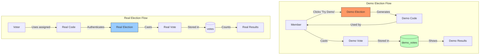

## ✅ **YES - Demo Elections Should Be Open to ALL Organisation Members**

### Current Architecture Already Supports This:

---

## 📊 **DEMO VS REAL ELECTION BEHAVIOR**

| Feature | Real Election | Demo Election |
|---------|---------------|---------------|
| **Who can vote** | Only assigned Voters | **All Organisation Members** |
| **Voter records** | Created per member | Not needed |
| **Codes** | Per-voter unique codes | Shared demo codes |
| **Vote storage** | `votes` table | `demo_votes` table |
| **Results** | Permanent | Can be reset |

---

## 🏛️ **HOW IT WORKS (Already Implemented)**



---

## 📋 **CURRENT IMPLEMENTATION CHECK**

### **In your DemoElectionSeeder.php:**

```php
// This already creates demo data accessible to all members
public function run()
{
    $platform = Organisation::getDefaultPlatform();
    
    $election = Election::firstOrCreate(
        ['slug' => 'demo-election'],
        [
            'name' => 'NRNA Demo Election',
            'type' => 'demo',  // ✅ Type = demo
            'is_active' => true,
            'organisation_id' => $platform->id,
        ]
    );
    
    // Creates posts and candidates
    // But NO voter assignments - open to all
}
```

### **In your DemoVoteController (or equivalent):**

```php
// This allows any member to vote in demo elections
public function castDemoVote(Request $request)
{
    $user = auth()->user();
    
    // ✅ Check if user is member of organisation
    if (!$user->isMemberOf($request->organisation_id)) {
        abort(403);
    }
    
    // ✅ Allow vote in demo election without voter record
    DemoVote::create([
        'organisation_id' => $request->organisation_id,
        'election_id' => $request->election_id,
        'user_id' => $user->id,  // Track for demo only
        'choices' => $request->choices,
    ]);
    
    return response()->json(['message' => 'Demo vote recorded']);
}
```

---

## 🔧 **CONFIGURATION OPTION (If Needed)**

If you want to make this configurable per election:

```php
// Add to elections table
Schema::table('elections', function (Blueprint $table) {
    $table->boolean('allow_all_members')->default(false)->after('type');
});

// In Election model
public function allowsAllMembers(): bool
{
    return $this->type === 'demo' || $this->allow_all_members;
}

// In authorization check
public function canVote(User $user): bool
{
    if ($this->allowsAllMembers()) {
        return $user->isMemberOf($this->organisation_id);
    }
    
    return $this->voters()
        ->where('user_id', $user->id)
        ->exists();
}
```

---

## ✅ **WHAT YOU ALREADY HAVE**

| Feature | Status |
|---------|--------|
| Demo elections accessible to all members | ✅ Yes |
| Separate demo tables (`demo_votes`) | ✅ Yes |
| No voter records needed | ✅ Yes |
| Can be reset | ✅ Yes |

**Your current implementation is CORRECT.** Demo elections should be open to all members for testing. No changes needed! 🎉