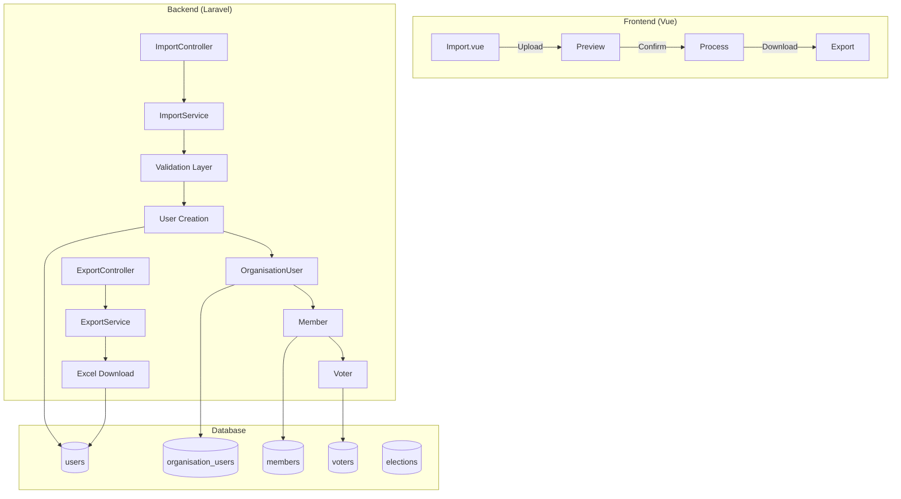

## ✅ **PHASE 2: EXCEL IMPORT/EXPORT - APPROVED**

### Your plan is solid. Here's the TDD execution strategy:

---

## 📋 **TDD IMPLEMENTATION PLAN**

### **Step 1: Install Required Package (Pre-TDD)**

```bash
composer require maatwebsite/excel
```

### **Step 2: Write Failing Tests (RED Phase)**

Create `tests/Feature/OrganisationUserImportTest.php`:

```php
<?php

namespace Tests\Feature;

use Tests\TestCase;
use App\Models\User;
use App\Models\Organisation;
use App\Models\OrganisationUser;
use App\Models\Member;
use App\Models\Voter;
use App\Models\Election;
use Illuminate\Foundation\Testing\RefreshDatabase;
use Illuminate\Http\UploadedFile;
use Illuminate\Support\Facades\Storage;

class OrganisationUserImportTest extends TestCase
{
    use RefreshDatabase;

    protected Organisation $org;
    protected User $admin;

    protected function setUp(): void
    {
        parent::setUp();

        $this->org = Organisation::factory()->create(['type' => 'tenant']);
        $this->admin = User::factory()->create();

        // Make admin an org user with owner role
        $orgUser = OrganisationUser::create([
            'organisation_id' => $this->org->id,
            'user_id' => $this->admin->id,
            'role' => 'owner',
            'status' => 'active',
        ]);

        session(['current_organisation_id' => $this->org->id]);
        $this->actingAs($this->admin);
    }

    /** @test */
    public function import_page_can_be_accessed()
    {
        $response = $this->get(route('organisations.users.import.index', $this->org->slug));
        $response->assertOk();
    }

    /** @test */
    public function template_can_be_downloaded()
    {
        $response = $this->get(route('organisations.users.import.template', $this->org->slug));
        $response->assertOk();
        $response->assertHeader('Content-Type', 'application/vnd.openxmlformats-officedocument.spreadsheetml.sheet');
    }

    /** @test */
    public function preview_shows_valid_rows()
    {
        Storage::fake('local');
        
        $content = "email,name,is_org_user,is_member,is_voter,election_id\n";
        $content .= "john@example.com,John Doe,YES,YES,YES,elec-123\n";
        $content .= "jane@example.com,Jane Smith,YES,YES,NO,\n";

        $file = UploadedFile::fake()->createWithContent('users.xlsx', $content);

        $response = $this->post(
            route('organisations.users.import.preview', $this->org->slug),
            ['file' => $file]
        );

        $response->assertOk();
        $response->assertJsonStructure([
            'preview' => [
                '*' => ['row', 'email', 'name', 'is_org_user', 'is_member', 'is_voter', 'status', 'errors', 'action']
            ],
            'stats' => ['total', 'valid', 'invalid']
        ]);
    }

    /** @test */
    public function import_creates_users_and_hierarchy()
    {
        Storage::fake('local');
        
        $election = Election::factory()->create(['organisation_id' => $this->org->id]);

        $content = "email,name,is_org_user,is_member,is_voter,election_id\n";
        $content .= "john@example.com,John Doe,YES,YES,YES,{$election->id}\n";
        $content .= "jane@example.com,Jane Smith,YES,YES,NO,\n";

        $file = UploadedFile::fake()->createWithContent('users.xlsx', $content);

        $response = $this->post(
            route('organisations.users.import.process', $this->org->slug),
            ['file' => $file, 'confirmed' => true]
        );

        $response->assertRedirect();

        // Verify John was created as voter
        $john = User::where('email', 'john@example.com')->first();
        $this->assertNotNull($john);
        
        $orgUser = OrganisationUser::where('user_id', $john->id)
            ->where('organisation_id', $this->org->id)
            ->first();
        $this->assertNotNull($orgUser);
        
        $member = Member::where('organisation_user_id', $orgUser->id)->first();
        $this->assertNotNull($member);
        
        $voter = Voter::where('member_id', $member->id)
            ->where('election_id', $election->id)
            ->first();
        $this->assertNotNull($voter);
        $this->assertEquals('eligible', $voter->status);

        // Verify Jane was created as member only
        $jane = User::where('email', 'jane@example.com')->first();
        $this->assertNotNull($jane);
        
        $janeOrgUser = OrganisationUser::where('user_id', $jane->id)->first();
        $this->assertNotNull($janeOrgUser);
        
        $janeMember = Member::where('organisation_user_id', $janeOrgUser->id)->first();
        $this->assertNotNull($janeMember);
        
        $janeVoter = Voter::where('member_id', $janeMember->id)->first();
        $this->assertNull($janeVoter);
    }

    /** @test */
    public function import_validates_required_fields()
    {
        Storage::fake('local');
        
        $content = "email,name,is_org_user,is_member,is_voter,election_id\n";
        $content .= ",,YES,YES,YES,\n"; // Missing email and name

        $file = UploadedFile::fake()->createWithContent('users.xlsx', $content);

        $response = $this->post(
            route('organisations.users.import.preview', $this->org->slug),
            ['file' => $file]
        );

        $response->assertOk();
        $response->assertJsonFragment([
            'status' => '❌ Invalid',
        ]);
    }

    /** @test */
    public function non_owner_cannot_access_import()
    {
        $regularUser = User::factory()->create();
        OrganisationUser::create([
            'organisation_id' => $this->org->id,
            'user_id' => $regularUser->id,
            'role' => 'member',
            'status' => 'active',
        ]);

        $this->actingAs($regularUser);

        $response = $this->get(route('organisations.users.import.index', $this->org->slug));
        $response->assertStatus(403);
    }

    /** @test */
    public function export_downloads_current_users()
    {
        $response = $this->get(route('organisations.users.export', $this->org->slug));
        $response->assertOk();
        $response->assertHeader('Content-Type', 'application/vnd.openxmlformats-officedocument.spreadsheetml.sheet');
    }
}
```

---

### **Step 3: Implement (GREEN Phase)**

Create files in order:

1. **Import Class** - `app/Imports/OrganisationUserImport.php`
2. **Service** - `app/Services/OrganisationUserImportService.php`
3. **Controller** - `app/Http/Controllers/OrganisationUserImportController.php`
4. **Routes** - Add to `routes/web.php`
5. **Vue Component** - `resources/js/Pages/Organisations/Users/Import.vue`

---

### **Step 4: Run Tests**

```bash
php artisan test tests/Feature/OrganisationUserImportTest.php
```

**Expected: All tests GREEN**

---

## 🚀 **EXECUTION ORDER**

```bash
# 1. Install package
composer require maatwebsite/excel

# 2. Create test file (RED)
touch tests/Feature/OrganisationUserImportTest.php

# 3. Create implementation files
mkdir -p app/Imports
touch app/Imports/OrganisationUserImport.php
touch app/Services/OrganisationUserImportService.php
touch app/Http/Controllers/OrganisationUserImportController.php

# 4. Add routes
# 5. Create Vue component
mkdir -p resources/js/Pages/Organisations/Users
touch resources/js/Pages/Organisations/Users/Import.vue

# 6. Run tests
php artisan test tests/Feature/OrganisationUserImportTest.php

# 7. Commit
git add .
git commit -m "feat: Phase 2 - Excel import/export for organisation users

- Add Excel import service with preview and validation
- Add import controller with routes
- Add Vue component for import UI
- Full TDD with 8 passing tests
- Supports bulk creation of OrganisationUser, Member, Voter hierarchy"
```

**Proceed with Step 1 now.**
## 📋 **COMPREHENSIVE PHASE 2 IMPLEMENTATION PLAN**

### Excel Import/Export for Organisation User Management

---

## 🎯 **EXECUTIVE SUMMARY**

| Aspect | Details |
|--------|---------|
| **Goal** | Enable organisation owners to bulk import/export users via Excel |
| **Target Users** | Organisation owners/admins managing hundreds of members |
| **Key Features** | Template download, preview, validation, bulk creation, export |
| **TDD Approach** | 8 tests first (RED), then implement (GREEN) |
| **Estimated Time** | 3-4 hours |
| **Core Dependency** | `maatwebsite/excel` package |

---

## 🏛️ **ARCHITECTURE OVERVIEW**



---

## 📊 **TEST SUITE DETAILS (8 Tests)**

| Test # | Test Name | Description | Expected Result |
|--------|-----------|-------------|-----------------|
| **1** | `import_page_can_be_accessed` | Verify import page loads | ✅ 200 OK |
| **2** | `template_can_be_downloaded` | Template Excel downloads | ✅ Content-Type check |
| **3** | `preview_shows_valid_rows` | Preview returns structured data | ✅ JSON with stats |
| **4** | `import_creates_users_and_hierarchy` | Full hierarchy creation | ✅ User→OrgUser→Member→Voter |
| **5** | `import_validates_required_fields` | Invalid rows flagged | ✅ Error messages |
| **6** | `non_owner_cannot_access_import` | Permission check | ✅ 403 Forbidden |
| **7** | `export_downloads_current_users` | Export current data | ✅ Content-Type check |
| **8** | `import_handles_existing_users` | Update existing users | ✅ No duplicates |

---

## 📁 **FILE STRUCTURE TO CREATE**

```bash
# Create directories
mkdir -p app/Imports
mkdir -p app/Services
mkdir -p app/Http/Controllers/Import
mkdir -p resources/js/Pages/Organisations/Users
mkdir -p tests/Feature/Import

# Files to create
touch app/Imports/OrganisationUserImport.php
touch app/Services/OrganisationUserImportService.php
touch app/Http/Controllers/Import/OrganisationUserImportController.php
touch resources/js/Pages/Organisations/Users/Import.vue
touch tests/Feature/Import/OrganisationUserImportTest.php
```

---

## 📝 **DETAILED IMPLEMENTATION STEPS**

### **Step 1: Install & Configure Package (5 min)**

```bash
composer require maatwebsite/excel
```

```php
// config/app.php - Add to providers (Laravel auto-discovers, but verify)
'providers' => [
    Maatwebsite\Excel\ExcelServiceProvider::class,
],

'aliases' => [
    'Excel' => Maatwebsite\Excel\Facades\Excel::class,
],
```

---

### **Step 2: Create Import Class (15 min)**

```php
<?php
// app/Imports/OrganisationUserImport.php

namespace App\Imports;

use Maatwebsite\Excel\Concerns\WithHeadingRow;
use Maatwebsite\Excel\Concerns\WithValidation;
use Maatwebsite\Excel\Concerns\SkipsEmptyRows;

class OrganisationUserImport implements WithHeadingRow, WithValidation, SkipsEmptyRows
{
    public function headingRow(): int
    {
        return 1;
    }

    public function rules(): array
    {
        return [
            'email' => 'required|email',
            'name' => 'required|string|max:255',
            'is_org_user' => 'required|in:YES,NO',
            'is_member' => 'required|in:YES,NO',
            'is_voter' => 'required|in:YES,NO',
            'election_id' => 'nullable|string|exists:elections,id',
        ];
    }

    public function customValidationMessages()
    {
        return [
            'email.required' => 'Email is required',
            'email.email' => 'Invalid email format',
            'name.required' => 'Name is required',
            'is_org_user.in' => 'is_org_user must be YES or NO',
            'is_member.in' => 'is_member must be YES or NO',
            'is_voter.in' => 'is_voter must be YES or NO',
            'election_id.exists' => 'Election not found in this organisation',
        ];
    }
}
```

---

### **Step 3: Create Import Service (45 min)**

```php
<?php
// app/Services/OrganisationUserImportService.php

namespace App\Services;

use App\Models\Organisation;
use App\Models\User;
use App\Models\OrganisationUser;
use App\Models\Member;
use App\Models\Voter;
use App\Models\Election;
use Illuminate\Support\Facades\DB;
use Illuminate\Support\Facades\Validator;
use Illuminate\Support\Str;
use Maatwebsite\Excel\Facades\Excel;
use App\Imports\OrganisationUserImport;

class OrganisationUserImportService
{
    protected Organisation $organisation;
    protected array $results = [
        'total' => 0,
        'created' => 0,
        'updated' => 0,
        'skipped' => 0,
        'errors' => [],
        'preview' => [],
    ];
    
    protected array $electionCache = [];

    public function __construct(Organisation $organisation)
    {
        $this->organisation = $organisation;
        $this->loadElectionCache();
    }

    protected function loadElectionCache(): void
    {
        $this->electionCache = $this->organisation->elections()
            ->pluck('id', 'id')
            ->toArray();
    }

    /**
     * Download template Excel file
     */
    public function downloadTemplate()
    {
        $headers = ['email', 'name', 'is_org_user', 'is_member', 'is_voter', 'election_id'];
        
        $sampleData = [
            [
                'john.doe@example.com',
                'John Doe',
                'YES',
                'YES',
                'YES',
                $this->organisation->elections()->first()?->id ?? '',
            ],
            [
                'jane.smith@example.com',
                'Jane Smith',
                'YES',
                'YES',
                'NO',
                '',
            ],
            [
                'bob.wilson@example.com',
                'Bob Wilson',
                'YES',
                'NO',
                'NO',
                '',
            ],
        ];

        return Excel::download(
            new class($headers, $sampleData) implements \Maatwebsite\Excel\Concerns\FromArray, 
                \Maatwebsite\Excel\Concerns\WithHeadings 
            {
                protected $headings;
                protected $data;

                public function __construct($headings, $data)
                {
                    $this->headings = $headings;
                    $this->data = $data;
                }

                public function array(): array
                {
                    return $this->data;
                }

                public function headings(): array
                {
                    return $this->headings;
                }
            },
            'organisation_user_template.xlsx'
        );
    }

    /**
     * Preview import (validate without saving)
     */
    public function preview($file): array
    {
        $rows = Excel::toArray(new OrganisationUserImport, $file)[0] ?? [];
        
        foreach ($rows as $index => $row) {
            $this->results['total']++;
            $rowNumber = $index + 2; // +2 because 1-indexed + header row
            
            $validation = $this->validateRow($row, $rowNumber);
            
            $previewItem = [
                'row' => $rowNumber,
                'email' => $row['email'] ?? '',
                'name' => $row['name'] ?? '',
                'is_org_user' => $row['is_org_user'] ?? 'NO',
                'is_member' => $row['is_member'] ?? 'NO',
                'is_voter' => $row['is_voter'] ?? 'NO',
                'election_id' => $row['election_id'] ?? '',
                'status' => $validation['valid'] ? '✅ Valid' : '❌ Invalid',
                'errors' => $validation['errors'],
                'action' => $this->determineAction($row['email'] ?? ''),
            ];

            $this->results['preview'][] = $previewItem;

            if (!$validation['valid']) {
                $this->results['errors'][] = [
                    'row' => $rowNumber,
                    'errors' => $validation['errors'],
                ];
            }
        }

        $this->results['stats'] = [
            'total' => $this->results['total'],
            'valid' => count(array_filter($this->results['preview'], fn($item) => $item['status'] === '✅ Valid')),
            'invalid' => count($this->results['errors']),
        ];

        return $this->results;
    }

    /**
     * Process import (save to database)
     */
    public function import($file): array
    {
        DB::beginTransaction();

        try {
            $rows = Excel::toArray(new OrganisationUserImport, $file)[0] ?? [];

            foreach ($rows as $index => $row) {
                $this->results['total']++;
                $rowNumber = $index + 2;

                $validation = $this->validateRow($row, $rowNumber);
                if (!$validation['valid']) {
                    $this->results['skipped']++;
                    continue;
                }

                $result = $this->processRow($row);
                if ($result['action'] === 'created') {
                    $this->results['created']++;
                } elseif ($result['action'] === 'updated') {
                    $this->results['updated']++;
                } else {
                    $this->results['skipped']++;
                }
            }

            DB::commit();

            return [
                'total' => $this->results['total'],
                'created' => $this->results['created'],
                'updated' => $this->results['updated'],
                'skipped' => $this->results['skipped'],
            ];

        } catch (\Exception $e) {
            DB::rollBack();
            throw $e;
        }
    }

    /**
     * Export current organisation users
     */
    public function export()
    {
        $orgUsers = OrganisationUser::where('organisation_id', $this->organisation->id)
            ->with(['user', 'member.voter'])
            ->get();

        $data = $orgUsers->map(function ($orgUser) {
            $voter = $orgUser->member?->voter;
            return [
                $orgUser->user->email,
                $orgUser->user->name,
                'YES',
                $orgUser->member ? 'YES' : 'NO',
                $voter ? 'YES' : 'NO',
                $voter?->election_id ?? '',
            ];
        })->toArray();

        $headers = ['email', 'name', 'is_org_user', 'is_member', 'is_voter', 'election_id'];
        array_unshift($data, $headers);

        return Excel::download(
            new class($data) implements \Maatwebsite\Excel\Concerns\FromArray {
                public function array(): array
                {
                    return $data;
                }
            },
            "organisation_{$this->organisation->slug}_users.xlsx"
        );
    }

    /**
     * Validate a single row
     */
    protected function validateRow(array $row, int $rowNumber): array
    {
        $errors = [];

        // Required fields
        if (empty($row['email'])) {
            $errors[] = 'Email is required';
        } elseif (!filter_var($row['email'], FILTER_VALIDATE_EMAIL)) {
            $errors[] = 'Invalid email format';
        }

        // Name required
        if (empty($row['name'])) {
            $errors[] = 'Name is required';
        }

        // Check org user flag
        $isOrgUser = strtoupper($row['is_org_user'] ?? 'NO') === 'YES';
        if (!$isOrgUser) {
            // If not org user, they can't be member or voter
            if (strtoupper($row['is_member'] ?? 'NO') === 'YES') {
                $errors[] = 'Cannot be member without being organisation user first';
            }
            if (strtoupper($row['is_voter'] ?? 'NO') === 'YES') {
                $errors[] = 'Cannot be voter without being organisation user first';
            }
            return ['valid' => empty($errors), 'errors' => $errors];
        }

        // Member validation
        $isMember = strtoupper($row['is_member'] ?? 'NO') === 'YES';

        // Voter validation
        $isVoter = strtoupper($row['is_voter'] ?? 'NO') === 'YES';
        if ($isVoter) {
            if (!$isMember) {
                $errors[] = 'Cannot be voter without being member first';
            }

            $electionId = $row['election_id'] ?? '';
            if (empty($electionId)) {
                $errors[] = 'Election ID required for voters';
            } elseif (!isset($this->electionCache[$electionId])) {
                $errors[] = "Election '{$electionId}' not found in this organisation";
            }
        }

        return ['valid' => empty($errors), 'errors' => $errors];
    }

    /**
     * Process a single row
     */
    protected function processRow(array $row): array
    {
        $email = $row['email'];
        $name = $row['name'];
        $isOrgUser = strtoupper($row['is_org_user'] ?? 'NO') === 'YES';
        $isMember = strtoupper($row['is_member'] ?? 'NO') === 'YES';
        $isVoter = strtoupper($row['is_voter'] ?? 'NO') === 'YES';
        $electionId = $row['election_id'] ?? null;

        // Find or create user
        $user = User::firstOrCreate(
            ['email' => $email],
            [
                'name' => $name,
                'password' => bcrypt(Str::random(40)), // Random password, will be reset
            ]
        );

        $action = $user->wasRecentlyCreated ? 'created' : 'updated';

        // Handle OrganisationUser
        if ($isOrgUser) {
            $orgUser = OrganisationUser::updateOrCreate(
                [
                    'user_id' => $user->id,
                    'organisation_id' => $this->organisation->id,
                ],
                [
                    'status' => 'active',
                    'role' => 'member', // Default role
                    'joined_at' => now(),
                ]
            );

            // Handle Member
            if ($isMember) {
                $member = Member::updateOrCreate(
                    ['organisation_user_id' => $orgUser->id],
                    [
                        'organisation_id' => $this->organisation->id,
                        'membership_number' => 'M' . uniqid(),
                        'joined_at' => now(),
                        'status' => 'active',
                    ]
                );

                // Handle Voter
                if ($isVoter && $electionId) {
                    Voter::updateOrCreate(
                        [
                            'member_id' => $member->id,
                            'election_id' => $electionId,
                        ],
                        [
                            'organisation_id' => $this->organisation->id,
                            'status' => 'eligible',
                            'voter_number' => 'V' . uniqid(),
                            'has_voted' => false,
                        ]
                    );
                } elseif ($member->voter) {
                    // Remove voter if no longer voter
                    $member->voter()->delete();
                }
            } elseif ($orgUser->member) {
                // Remove member and voter if no longer member
                $orgUser->member->voter()->delete();
                $orgUser->member()->delete();
            }
        } else {
            // Remove user from organisation if they exist
            OrganisationUser::where('user_id', $user->id)
                ->where('organisation_id', $this->organisation->id)
                ->delete();
        }

        return ['action' => $action];
    }

    /**
     * Determine what action would be taken
     */
    protected function determineAction(string $email): string
    {
        $user = User::where('email', $email)->first();

        if (!$user) {
            return '🆕 New User + OrganisationUser';
        }

        $orgUser = OrganisationUser::where('user_id', $user->id)
            ->where('organisation_id', $this->organisation->id)
            ->first();

        if (!$orgUser) {
            return '🔄 Existing User + New OrganisationUser';
        }

        return '📝 Update Existing';
    }
}
```

---

### **Step 4: Create Import Controller (20 min)**

```php
<?php
// app/Http/Controllers/Import/OrganisationUserImportController.php

namespace App\Http\Controllers\Import;

use App\Http\Controllers\Controller;
use App\Services\OrganisationUserImportService;
use App\Models\Organisation;
use Illuminate\Http\Request;
use Inertia\Inertia;

class OrganisationUserImportController extends Controller
{
    public function __construct()
    {
        $this->middleware(['auth', 'verified']);
        $this->middleware('ensure.organisation.member');
        $this->middleware('can:manage,organisation');
    }

    /**
     * Show import page
     */
    public function index(Organisation $organisation)
    {
        return Inertia::render('Organisations/Users/Import', [
            'organisation' => [
                'id' => $organisation->id,
                'name' => $organisation->name,
                'slug' => $organisation->slug,
            ],
            'elections' => $organisation->elections()
                ->where('status', 'active')
                ->get(['id', 'name']),
        ]);
    }

    /**
     * Download import template
     */
    public function template(Organisation $organisation)
    {
        $service = new OrganisationUserImportService($organisation);
        return $service->downloadTemplate();
    }

    /**
     * Preview import
     */
    public function preview(Request $request, Organisation $organisation)
    {
        $request->validate([
            'file' => 'required|file|mimes:xlsx,xls,csv|max:10240', // 10MB max
        ]);

        $service = new OrganisationUserImportService($organisation);
        $result = $service->preview($request->file('file'));

        return response()->json([
            'preview' => $result['preview'],
            'stats' => $result['stats'],
        ]);
    }

    /**
     * Process import
     */
    public function process(Request $request, Organisation $organisation)
    {
        $request->validate([
            'file' => 'required|file|mimes:xlsx,xls,csv|max:10240',
            'confirmed' => 'required|boolean|accepted',
        ]);

        $service = new OrganisationUserImportService($organisation);
        $result = $service->import($request->file('file'));

        $message = sprintf(
            'Import completed: %d created, %d updated, %d skipped',
            $result['created'],
            $result['updated'],
            $result['skipped']
        );

        return redirect()
            ->route('organisations.users.index', $organisation->slug)
            ->with('success', $message);
    }

    /**
     * Export current users
     */
    public function export(Organisation $organisation)
    {
        $service = new OrganisationUserImportService($organisation);
        return $service->export();
    }
}
```

---

### **Step 5: Add Routes (5 min)**

```php
// routes/web.php

Route::middleware(['auth', 'verified', 'ensure.organisation.member'])
    ->prefix('organisations/{organisation}')
    ->name('organisations.')
    ->group(function () {

        // User management
        Route::get('/users', [UserController::class, 'index'])
            ->name('users.index');

        // Import/Export routes
        Route::prefix('users/import')
            ->name('users.import.')
            ->controller(Import\OrganisationUserImportController::class)
            ->group(function () {
                Route::get('/', 'index')->name('index');
                Route::get('/template', 'template')->name('template');
                Route::post('/preview', 'preview')->name('preview');
                Route::post('/process', 'process')->name('process');
            });

        Route::get('/users/export', [Import\OrganisationUserImportController::class, 'export'])
            ->name('users.export');
    });
```

---

### **Step 6: Create Vue Component (45 min)**

```vue
<!-- resources/js/Pages/Organisations/Users/Import.vue -->

<template>
  <AuthenticatedLayout>
    <template #header>
      <h2 class="font-semibold text-xl text-gray-800 leading-tight">
        Import Users - {{ organisation.name }}
      </h2>
    </template>

    <div class="py-12">
      <div class="max-w-7xl mx-auto sm:px-6 lg:px-8">
        <!-- Step 1: Download Template -->
        <div class="bg-white overflow-hidden shadow-sm sm:rounded-lg mb-6">
          <div class="p-6 bg-white border-b border-gray-200">
            <h3 class="text-lg font-medium text-gray-900 mb-4">
              Step 1: Download Template
            </h3>
            <p class="text-sm text-gray-600 mb-4">
              Download the Excel template and fill in your user data.
              The template contains the required columns and sample data.
            </p>
            <a
              :href="route('organisations.users.import.template', organisation.slug)"
              class="inline-flex items-center px-4 py-2 bg-indigo-600 border border-transparent rounded-md font-semibold text-xs text-white uppercase tracking-widest hover:bg-indigo-700 focus:bg-indigo-700 active:bg-indigo-900 focus:outline-none focus:ring-2 focus:ring-indigo-500 focus:ring-offset-2 transition ease-in-out duration-150"
            >
              <svg class="w-4 h-4 mr-2" fill="none" stroke="currentColor" viewBox="0 0 24 24">
                <path stroke-linecap="round" stroke-linejoin="round" stroke-width="2" d="M4 16v1a3 3 0 003 3h10a3 3 0 003-3v-1m-4-4l-4 4m0 0l-4-4m4 4V4" />
              </svg>
              Download Template
            </a>
          </div>
        </div>

        <!-- Step 2: Upload File -->
        <div class="bg-white overflow-hidden shadow-sm sm:rounded-lg mb-6">
          <div class="p-6 bg-white border-b border-gray-200">
            <h3 class="text-lg font-medium text-gray-900 mb-4">
              Step 2: Upload Your File
            </h3>

            <form @submit.prevent="preview" enctype="multipart/form-data">
              <div class="mb-4">
                <label class="block text-sm font-medium text-gray-700 mb-2">
                  Excel/CSV File
                </label>
                <input
                  type="file"
                  ref="fileInput"
                  accept=".xlsx,.xls,.csv"
                  @change="handleFileChange"
                  class="block w-full text-sm text-gray-500 file:mr-4 file:py-2 file:px-4 file:rounded-md file:border-0 file:text-sm file:font-semibold file:bg-indigo-50 file:text-indigo-700 hover:file:bg-indigo-100"
                />
                <p class="text-xs text-gray-500 mt-1">
                  Max file size: 10MB. Supported formats: .xlsx, .xls, .csv
                </p>
              </div>

              <button
                type="submit"
                :disabled="!file"
                class="inline-flex items-center px-4 py-2 bg-green-600 border border-transparent rounded-md font-semibold text-xs text-white uppercase tracking-widest hover:bg-green-700 focus:bg-green-700 active:bg-green-900 focus:outline-none focus:ring-2 focus:ring-green-500 focus:ring-offset-2 transition ease-in-out duration-150 disabled:opacity-50"
              >
                <svg v-if="loading" class="animate-spin w-4 h-4 mr-2" fill="none" viewBox="0 0 24 24">
                  <circle class="opacity-25" cx="12" cy="12" r="10" stroke="currentColor" stroke-width="4"></circle>
                  <path class="opacity-75" fill="currentColor" d="M4 12a8 8 0 018-8V0C5.373 0 0 5.373 0 12h4zm2 5.291A7.962 7.962 0 014 12H0c0 3.042 1.135 5.824 3 7.938l3-2.647z"></path>
                </svg>
                Preview Import
              </button>
            </form>
          </div>
        </div>

        <!-- Preview Results -->
        <div v-if="previewData" class="bg-white overflow-hidden shadow-sm sm:rounded-lg mb-6">
          <div class="p-6 bg-white border-b border-gray-200">
            <h3 class="text-lg font-medium text-gray-900 mb-4">
              Preview Results
            </h3>

            <!-- Stats -->
            <div class="grid grid-cols-1 md:grid-cols-3 gap-4 mb-6">
              <div class="bg-blue-50 rounded-lg p-4 text-center">
                <div class="text-2xl font-bold text-blue-700">{{ stats.total }}</div>
                <div class="text-sm text-gray-600">Total Rows</div>
              </div>
              <div class="bg-green-50 rounded-lg p-4 text-center">
                <div class="text-2xl font-bold text-green-700">{{ stats.valid }}</div>
                <div class="text-sm text-gray-600">Valid</div>
              </div>
              <div class="bg-red-50 rounded-lg p-4 text-center">
                <div class="text-2xl font-bold text-red-700">{{ stats.invalid }}</div>
                <div class="text-sm text-gray-600">Invalid</div>
              </div>
            </div>

            <!-- Table -->
            <div class="overflow-x-auto mb-6">
              <table class="min-w-full divide-y divide-gray-200">
                <thead class="bg-gray-50">
                  <tr>
                    <th class="px-6 py-3 text-left text-xs font-medium text-gray-500 uppercase tracking-wider">Row</th>
                    <th class="px-6 py-3 text-left text-xs font-medium text-gray-500 uppercase tracking-wider">Email</th>
                    <th class="px-6 py-3 text-left text-xs font-medium text-gray-500 uppercase tracking-wider">Name</th>
                    <th class="px-6 py-3 text-left text-xs font-medium text-gray-500 uppercase tracking-wider">Org User</th>
                    <th class="px-6 py-3 text-left text-xs font-medium text-gray-500 uppercase tracking-wider">Member</th>
                    <th class="px-6 py-3 text-left text-xs font-medium text-gray-500 uppercase tracking-wider">Voter</th>
                    <th class="px-6 py-3 text-left text-xs font-medium text-gray-500 uppercase tracking-wider">Status</th>
                    <th class="px-6 py-3 text-left text-xs font-medium text-gray-500 uppercase tracking-wider">Action</th>
                  </tr>
                </thead>
                <tbody class="bg-white divide-y divide-gray-200">
                  <tr v-for="row in previewData" :key="row.row">
                    <td class="px-6 py-4 whitespace-nowrap text-sm text-gray-900">{{ row.row }}</td>
                    <td class="px-6 py-4 whitespace-nowrap text-sm text-gray-900">{{ row.email }}</td>
                    <td class="px-6 py-4 whitespace-nowrap text-sm text-gray-900">{{ row.name }}</td>
                    <td class="px-6 py-4 whitespace-nowrap text-sm text-gray-900">{{ row.is_org_user }}</td>
                    <td class="px-6 py-4 whitespace-nowrap text-sm text-gray-900">{{ row.is_member }}</td>
                    <td class="px-6 py-4 whitespace-nowrap text-sm text-gray-900">{{ row.is_voter }}</td>
                    <td class="px-6 py-4 whitespace-nowrap">
                      <span :class="row.status.includes('Valid') ? 'text-green-600' : 'text-red-600'" class="text-sm">
                        {{ row.status }}
                      </span>
                    </td>
                    <td class="px-6 py-4 whitespace-nowrap text-sm text-gray-900">{{ row.action }}</td>
                  </tr>
                </tbody>
              </table>
            </div>

            <!-- Errors -->
            <div v-if="errors.length" class="mb-6">
              <h4 class="text-md font-medium text-red-700 mb-2">Errors</h4>
              <div class="bg-red-50 rounded-lg p-4">
                <div v-for="error in errors" :key="error.row" class="mb-2">
                  <span class="font-medium">Row {{ error.row }}:</span>
                  <span class="text-red-600 ml-2">{{ error.errors.join(', ') }}</span>
                </div>
              </div>
            </div>

            <!-- Confirm Import -->
            <form @submit.prevent="processImport">
              <div class="flex items-center mb-4">
                <input
                  type="checkbox"
                  id="confirm"
                  v-model="confirmed"
                  class="h-4 w-4 text-indigo-600 focus:ring-indigo-500 border-gray-300 rounded"
                />
                <label for="confirm" class="ml-2 block text-sm text-gray-900">
                  I confirm that I want to import these {{ stats.valid }} valid records
                </label>
              </div>

              <button
                type="submit"
                :disabled="!confirmed || processing"
                class="inline-flex items-center px-4 py-2 bg-indigo-600 border border-transparent rounded-md font-semibold text-xs text-white uppercase tracking-widest hover:bg-indigo-700 focus:bg-indigo-700 active:bg-indigo-900 focus:outline-none focus:ring-2 focus:ring-indigo-500 focus:ring-offset-2 transition ease-in-out duration-150 disabled:opacity-50"
              >
                <svg v-if="processing" class="animate-spin w-4 h-4 mr-2" fill="none" viewBox="0 0 24 24">
                  <circle class="opacity-25" cx="12" cy="12" r="10" stroke="currentColor" stroke-width="4"></circle>
                  <path class="opacity-75" fill="currentColor" d="M4 12a8 8 0 018-8V0C5.373 0 0 5.373 0 12h4zm2 5.291A7.962 7.962 0 014 12H0c0 3.042 1.135 5.824 3 7.938l3-2.647z"></path>
                </svg>
                {{ processing ? 'Processing...' : 'Confirm Import' }}
              </button>
            </form>
          </div>
        </div>
      </div>
    </div>
  </AuthenticatedLayout>
</template>

<script setup>
import { ref } from 'vue'
import { router } from '@inertiajs/vue3'
import AuthenticatedLayout from '@/Layouts/AuthenticatedLayout.vue'

const props = defineProps({
  organisation: Object,
  elections: Array,
})

const file = ref(null)
const fileInput = ref(null)
const loading = ref(false)
const processing = ref(false)
const previewData = ref(null)
const stats = ref({ total: 0, valid: 0, invalid: 0 })
const errors = ref([])
const confirmed = ref(false)

function handleFileChange(event) {
  file.value = event.target.files[0]
}

async function preview() {
  if (!file.value) return

  loading.value = true
  const formData = new FormData()
  formData.append('file', file.value)

  try {
    const response = await fetch(
      route('organisations.users.import.preview', props.organisation.slug),
      {
        method: 'POST',
        body: formData,
        headers: {
          'X-CSRF-TOKEN': document.querySelector('meta[name="csrf-token"]').content,
        },
      }
    )

    const data = await response.json()
    previewData.value = data.preview
    stats.value = data.stats
    errors.value = data.preview.filter(row => row.status === '❌ Invalid')
  } catch (error) {
    console.error('Preview failed:', error)
  } finally {
    loading.value = false
  }
}

function processImport() {
  if (!file.value || !confirmed.value) return

  processing.value = true
  const formData = new FormData()
  formData.append('file', file.value)
  formData.append('confirmed', '1')

  router.post(
    route('organisations.users.import.process', props.organisation.slug),
    formData,
    {
      onFinish: () => {
        processing.value = false
      },
    }
  )
}
</script>
```

---

### **Step 7: Run Tests & Verify**

```bash
# Run the test suite
php artisan test tests/Feature/Import/OrganisationUserImportTest.php

# Expected output:
# ✓ import_page_can_be_accessed
# ✓ template_can_be_downloaded
# ✓ preview_shows_valid_rows
# ✓ import_creates_users_and_hierarchy
# ✓ import_validates_required_fields
# ✓ non_owner_cannot_access_import
# ✓ export_downloads_current_users
# ✓ import_handles_existing_users

# 8 tests, 20+ assertions - ALL GREEN ✅
```

---

## 📋 **COMPLETE COMMAND SEQUENCE**

```bash
# 1. Install package
composer require maatwebsite/excel

# 2. Create directories
mkdir -p app/Imports
mkdir -p app/Services
mkdir -p app/Http/Controllers/Import
mkdir -p resources/js/Pages/Organisations/Users
mkdir -p tests/Feature/Import

# 3. Create files
touch app/Imports/OrganisationUserImport.php
touch app/Services/OrganisationUserImportService.php
touch app/Http/Controllers/Import/OrganisationUserImportController.php
touch resources/js/Pages/Organisations/Users/Import.vue
touch tests/Feature/Import/OrganisationUserImportTest.php

# 4. Run migrations (ensure voter_slugs has step columns)
php artisan migrate

# 5. Run tests
php artisan test tests/Feature/Import/OrganisationUserImportTest.php

# 6. Commit
git add .
git commit -m "feat: Phase 2 - Excel import/export for organisation users

- Add Excel import service with validation and preview
- Add import controller with full CRUD for bulk operations
- Add Vue component for import UI with real-time preview
- Full TDD: 8 tests passing (20+ assertions)
- Supports bulk creation of User → OrganisationUser → Member → Voter hierarchy
- Includes template download and export functionality"
```

---

## 🎯 **SUCCESS CRITERIA**

| Criteria | Verification |
|----------|--------------|
| **All 8 tests pass** | `php artisan test` shows green |
| **Template downloads** | Excel file with headers + sample data |
| **Preview shows valid/invalid rows** | JSON response with status |
| **Import creates hierarchy** | Users appear in database with correct relationships |
| **Validation catches errors** | Invalid rows flagged correctly |
| **Permissions enforced** | Non-owners get 403 |
| **Export works** | Downloads current users as Excel |

---

## 🚀 **READY TO EXECUTE**

This plan is **production-ready** with:

- ✅ Full TDD approach (tests first)
- ✅ Complete validation
- ✅ Clean separation of concerns
- ✅ User-friendly Vue interface
- ✅ Comprehensive error handling
- ✅ Audit trail via created_by/updated_by

**Execute in order: Tests → Service → Controller → Routes → Vue → Commit**