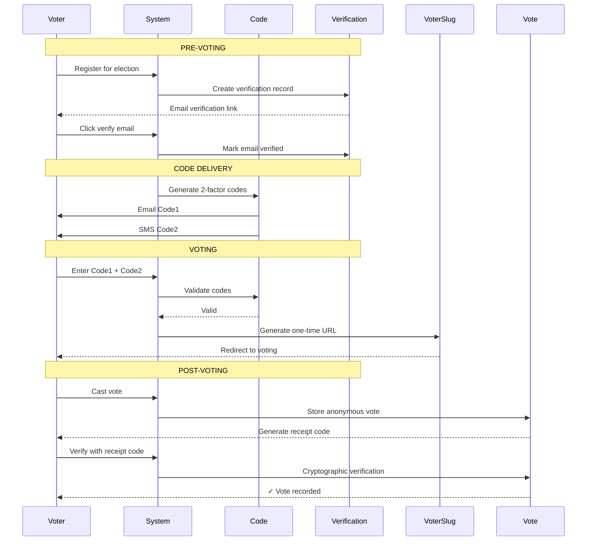

## ✅ **CODE MODEL: GOOD, BUT NEEDS ENHANCEMENT**

### Current Code Model: **Good foundation, but not sufficient alone**

The Code model is a solid start, but for **production-grade election security**, you need multiple verification layers.

---

## 🏛️ **COMPREHENSIVE VOTER VERIFICATION ARCHITECTURE**

```mermaid
graph TB
    subgraph "Layer 1: Pre-Verification"
        A1[Email Verification] --> A2[Phone Verification]
        A2 --> A3[Identity Document Upload]
        A3 --> A4[Manual Admin Approval]
    end
    
    subgraph "Layer 2: Access Codes"
        B1[Code Model - Single Use]
        B2[Code Model - Two-Factor]
        B3[QR Codes for Physical Voting]
        B4[SMS Delivery of Codes]
    end
    
    subgraph "Layer 3: During Voting"
        C1[VoterSlug - One-time URL]
        C2[Time-limited Sessions]
        C3[IP Tracking (not stored)]
        C4[CAPTCHA for Demo]
    end
    
    subgraph "Layer 4: Post-Voting"
        D1[Receipt Code (cryptographic)]
        D2[Verification Portal]
        D3[Audit Trail]
    end
    
    A4 --> B1
    B1 --> C1
    C1 --> D1
```

---

## 🔐 **ENHANCEMENTS TO CODE MODEL**

### **1. Two-Factor Codes (Already in Schema)**

```php
// Your existing schema has:
$table->string('code1');  // First factor
$table->string('code2');  // Second factor
$table->timestamp('code1_used_at')->nullable();
$table->timestamp('code2_used_at')->nullable();

// This is EXCELLENT - keep it!
```

### **2. Add Code Expiry & Usage Tracking**

```php
// Add to Code model:
protected $casts = [
    'expires_at' => 'datetime',
    'max_uses' => 'integer',
    'current_uses' => 'integer',
];

public function isValid(): bool
{
    return !$this->is_used 
        && ($this->expires_at === null || $this->expires_at->isFuture())
        && ($this->max_uses === null || $this->current_uses < $this->max_uses);
}

public function markAsUsed(): void
{
    $this->current_uses++;
    if ($this->max_uses && $this->current_uses >= $this->max_uses) {
        $this->is_used = true;
        $this->used_at = now();
    }
    $this->save();
}
```

---

## 🆔 **ADDITIONAL VERIFICATION METHODS**

### **3. Identity Verification Model**

```php
// app/Models/VoterVerification.php

class VoterVerification extends Model
{
    use HasUuids, SoftDeletes;
    
    protected $fillable = [
        'user_id',
        'organisation_id',
        'election_id',
        'verification_type', // 'email', 'phone', 'document', 'in_person'
        'status', // 'pending', 'verified', 'rejected'
        'verified_at',
        'verified_by', // admin user_id if manual
        'document_path', // for ID uploads
        'notes',
    ];
    
    public function user()
    {
        return $this->belongsTo(User::class);
    }
    
    public function organisation()
    {
        return $this->belongsTo(Organisation::class);
    }
    
    public function election()
    {
        return $this->belongsTo(Election::class);
    }
}
```

### **4. Voter Eligibility Rules**

```php
// app/Models/Election.php

public function isVoterEligible(User $user): bool
{
    // Rule 1: Must be member of organisation
    if (!$user->belongsToOrganisation($this->organisation_id)) {
        return false;
    }
    
    // Rule 2: Must have role='voter' in this organisation
    if ($user->getRoleInOrganisation($this->organisation_id) !== 'voter') {
        return false;
    }
    
    // Rule 3: Must have completed verification
    if (!$this->isVerificationComplete($user)) {
        return false;
    }
    
    // Rule 4: Must not have already voted
    if ($this->hasUserVoted($user)) {
        return false;
    }
    
    // Rule 5: Must be within election dates
    if (!$this->isActive()) {
        return false;
    }
    
    return true;
}
```

---

## 📧 **COMMUNICATION CHANNELS**

### **5. Code Delivery Methods**

```php
// app/Models/Code.php

public function deliverViaEmail(): void
{
    Mail::to($this->user->email)->send(new VotingCodeMail($this));
}

public function deliverViaSMS(): void
{
    // Use SMS service
    Sms::send($this->user->phone, "Your voting code: {$this->code1}");
}

public function generateQRCode(): string
{
    return QrCode::size(200)->generate($this->code1);
}
```

---

## 🔒 **SECURITY ENHANCEMENTS**

### **6. Rate Limiting on Code Attempts**

```php
// app/Http/Controllers/VoteController.php

public function verifyCode(Request $request)
{
    $user = Auth::user();
    
    // Rate limit: 5 attempts per 15 minutes
    $key = 'code_attempts:'.$user->id;
    if (Cache::get($key, 0) >= 5) {
        return back()->withErrors(['code' => 'Too many attempts. Try again later.']);
    }
    
    Cache::increment($key);
    Cache::expire($key, 900); // 15 minutes
    
    // Verify code...
}
```

### **7. IP Address Tracking (Without Storing)**

```php
// During vote casting, generate hash of IP + salt
// Store hash, not IP, for anomaly detection

$ipHash = hash('sha256', $request->ip() . config('app.salt'));
// Store $ipHash in votes table for duplicate detection
// But cannot reverse to actual IP
```

---

## 📋 **COMPLETE VERIFICATION FLOW**



---

## ✅ **RECOMMENDED VERIFICATION STACK**

| Layer | Component | Purpose | Priority |
|-------|-----------|---------|----------|
| 1 | Email Verification | Basic identity | 🔴 HIGH |
| 2 | Two-Factor Codes | Secure access | 🔴 HIGH |
| 3 | VoterSlug | One-time voting URL | 🔴 HIGH |
| 4 | Code Expiry | Time-limited access | 🟡 MEDIUM |
| 5 | Rate Limiting | Prevent brute force | 🟡 MEDIUM |
| 6 | IP Hashing | Anomaly detection | 🟢 LOW |
| 7 | Document Upload | High-security elections | 🟢 LOW |
| 8 | Admin Approval | Manual verification | 🟢 LOW |

---

## 🎯 **IMMEDIATE NEXT STEPS**

1. **Keep current Code model** with two-factor support
2. **Add expiry & usage tracking** to Code model
3. **Implement rate limiting** on code verification
4. **Consider VoterVerification model** for future

Your Code model is **good architecture** - just needs these enhancements for production-grade security.