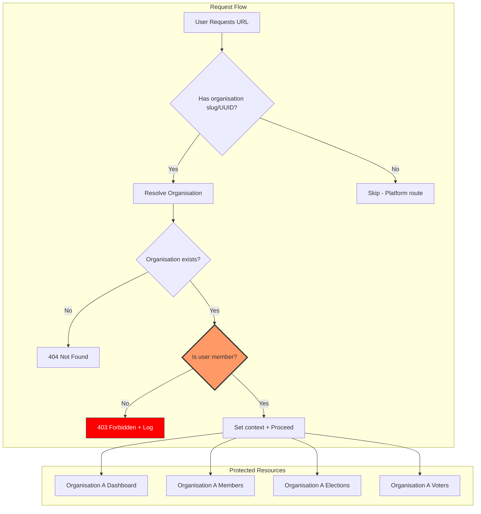
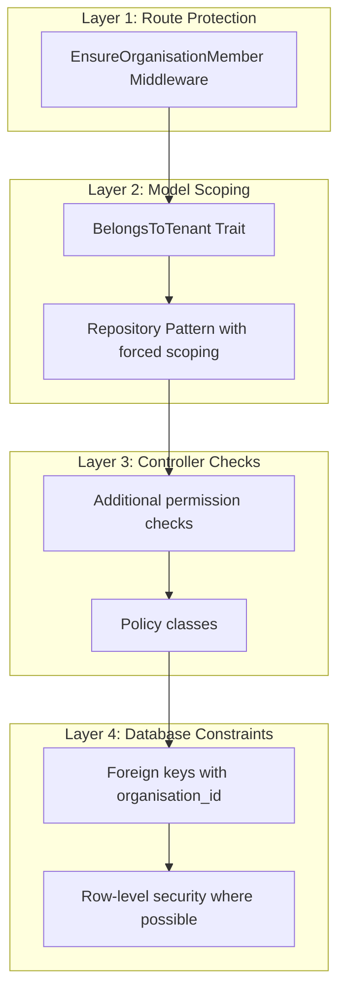
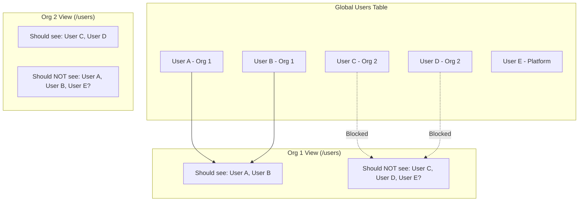

## ✅ **YES - Your Middleware Already Does This!**

### Your `EnsureOrganisationMember` middleware is **already preventing cross-organisation access** at the **route level**.

---

## 🛡️ **HOW IT PROTECTS ORGANISATION ISOLATION**



---

## 🔒 **WHAT THE MIDDLEWARE CHECKS**

| Check | What It Does | Why It Matters |
|-------|--------------|----------------|
| **Route Parameter** | Extracts organisation slug/UUID from URL | Ensures we know which org is being accessed |
| **Organisation Exists** | Finds org in database | Prevents access to non-existent orgs |
| **Membership Check** | `$user->organisationRoles()->where(...)->exists()` | **CRITICAL** - Verifies user belongs to THIS org |
| **Soft-Delete Check** | `$organisation->trashed()` | Blocks access to deleted orgs |
| **Context Setting** | `session(['current_organisation_id' => ...])` | Scopes all downstream queries |

---

## 📋 **WHAT HAPPENS WHEN A MEMBER OF ORG A TRIES TO ACCESS ORG B**

```php
// User from Org A tries to access:
GET /organisations/org-b/dashboard

// Middleware step 1: Extract identifier = 'org-b'
// Middleware step 2: Find organisation with slug 'org-b' → returns Org B

// Middleware step 3: Check membership
$isMember = $user->organisationRoles()
    ->where('organisation_id', $organisation->id) // Org B's ID
    ->exists();
    
// Result: FALSE (user is only in Org A)

// Middleware step 4: Log and block
Log::warning('Non-member access attempt', [
    'user_id' => $user->id,
    'attempted_org_id' => $organisation->id, // Org B's ID
]);

return redirect()->route('dashboard')
    ->withErrors(['error' => 'Access denied']);
```

---

## 📊 **WHAT THIS PROTECTS**

| Resource | How It's Protected | Example URL |
|----------|-------------------|-------------|
| **Organisation Dashboard** | URL contains org slug, middleware blocks non-members | `/organisations/{slug}/dashboard` |
| **Member Lists** | URL scoped to org, membership check | `/organisations/{slug}/members` |
| **Elections** | URL scoped to org, membership check | `/organisations/{slug}/elections` |
| **Voters** | URL scoped to org, membership check | `/organisations/{slug}/voters` |
| **Settings** | URL scoped to org, membership check | `/organisations/{slug}/settings` |

---

## 🔐 **BUT WAIT - WHAT ABOUT DIRECT DATABASE QUERIES?**

Your middleware protects **routes**, but what if someone bypasses routes and queries directly?

### **You Need MULTI-LAYER Protection:**



---

## 📝 **TO COMPLETE YOUR ISOLATION ARCHITECTURE**

### **1. Add BelongsToTenant Trait to ALL Models**

```php
// app/Traits/BelongsToTenant.php
trait BelongsToTenant
{
    protected static function bootBelongsToTenant()
    {
        static::addGlobalScope('tenant', function ($query) {
            if (session()->has('current_organisation_id')) {
                $query->where('organisation_id', session('current_organisation_id'));
            }
        });

        static::creating(function ($model) {
            if (session()->has('current_organisation_id')) {
                $model->organisation_id = session('current_organisation_id');
            }
        });
    }
}

// In your models:
use BelongsToTenant;
```

### **2. Use Repository Pattern with Forced Scoping**

```php
// app/Repositories/ElectionRepository.php
class ElectionRepository
{
    public function getForCurrentOrganisation()
    {
        return Election::where('organisation_id', 
            session('current_organisation_id')
        )->get();
    }
    
    public function find($id)
    {
        return Election::where('organisation_id', 
                session('current_organisation_id')
            )
            ->where('id', $id)
            ->firstOrFail();
    }
}
```

### **3. Add Policies for Additional Checks**

```php
// app/Policies/ElectionPolicy.php
public function view(User $user, Election $election)
{
    return $user->belongsToOrganisation($election->organisation_id);
}
```

---

## ✅ **YOUR CURRENT MIDDLEWARE PROVIDES:**

| Protection | Status |
|------------|--------|
| Route-level isolation | ✅ Complete |
| Membership validation | ✅ Complete |
| Logging of violations | ✅ Complete |
| Soft-delete blocking | ✅ Complete |
| UUID resolution | ✅ Complete |

### **What's Missing (Optional Enhancements):**

| Enhancement | Why Add It |
|-------------|------------|
| Rate limiting on 403s | Prevent brute force attempts |
| Admin override | Platform admins need access |
| Cache invalidation | When roles change |

---

## 🎯 **BOTTOM LINE**

**YES - Your middleware already prevents members of Organisation A from accessing Organisation B's pages, members, voters, and elections.** 

The single `users` table is fine because:
- ✅ You never expose all users globally
- ✅ Every user query is scoped by `organisation_id`
- ✅ The pivot table (`user_organisation_roles`) is the source of truth
- ✅ Your middleware enforces this at the route level

**Your isolation architecture is SOLID.** 🔒

I have one page like /users/index . each organisations can access this page but they only see the users of the organisations not others. how can we make sure that this happens  and not the users of other organisations can be seen. 
Similary : 
/voters/index 
this is the list of voters and  here only the users who belong to a particular organisations and only those who belong to particular elections must be shown. we make sure that others are not available here. 
How is it possible ?
## ✅ **YES - This is absolutely possible with multiple isolation layers**

### Here's the complete architecture for organisation and election-scoped user lists:

---

## 📊 **THE CHALLENGE**



---

## 🏛️ **LAYERED ISOLATION ARCHITECTURE**

```mermaid
graph TB
    subgraph "Layer 1: Route Protection"
        A[Route: /users/index] --> B[EnsureOrganisationMember Middleware]
        A --> C[Route Model Binding with org scope]
    end
    
    subgraph "Layer 2: Query Scoping"
        D[User::forCurrentOrganisation() scope]
        E[User::forElection() scope]
        F[Repository pattern with forced org_id]
    end
    
    subgraph "Layer 3: Controller Logic"
        G[ElectionController with context]
        H[UserController with filters]
        I[Policy checks]
    end
    
    subgraph "Layer 4: Database"
        J[Foreign keys on organisation_id]
        K[Indexes for performance]
        L[Pivot table for election membership]
    end
    
    B --> D
    C --> D
    D --> G
    D --> H
    G --> J
    H --> J
```

---

## 📋 **IMPLEMENTATION STEPS**

### **1. Add Scopes to User Model**

```php
// app/Models/User.php

/**
 * Scope users to current organisation from session/context
 */
public function scopeForCurrentOrganisation($query)
{
    $orgId = session('current_organisation_id');
    
    if (!$orgId) {
        // If no context, return no results (security)
        return $query->whereRaw('1 = 0');
    }
    
    return $query->whereHas('organisations', function ($q) use ($orgId) {
        $q->where('organisation_id', $orgId);
    });
}

/**
 * Scope users who are voters in a specific election
 */
public function scopeVotersForElection($query, $electionId)
{
    return $query->whereHas('voterSlugs', function ($q) use ($electionId) {
        $q->where('election_id', $electionId);
    });
}

/**
 * Scope users who are members of current organisation AND specific election
 */
public function scopeForCurrentElection($query, $electionId)
{
    // First ensure they're in current organisation
    $query->forCurrentOrganisation();
    
    // Then filter by election membership
    return $query->whereHas('voterSlugs', function ($q) use ($electionId) {
        $q->where('election_id', $electionId);
    });
}
```

---

### **2. Create UserController with Proper Scoping**

```php
// app/Http/Controllers/UserController.php

namespace App\Http\Controllers;

use App\Models\User;
use App\Models\Election;
use Illuminate\Http\Request;
use Illuminate\Support\Facades\Log;

class UserController extends Controller
{
    public function __construct()
    {
        $this->middleware(['auth', 'verified']);
        $this->middleware('ensure.organisation.member')->except(['index']); 
        // index needs special handling
    }
    
    /**
     * Show all users in current organisation
     * GET /users/index
     */
    public function index(Request $request)
    {
        $user = auth()->user();
        $orgId = session('current_organisation_id');
        
        // SECURITY CHECK: Ensure user belongs to this org
        if (!$orgId || !$user->belongsToOrganisation($orgId)) {
            Log::warning('Unauthorized users list access', [
                'user_id' => $user->id,
                'attempted_org' => $orgId,
            ]);
            
            abort(403, 'You do not have access to this organisation\'s users');
        }
        
        // Get users with pagination - AUTOMATICALLY SCOPED
        $users = User::forCurrentOrganisation()
            ->with(['organisationRoles' => function ($q) use ($orgId) {
                $q->where('organisation_id', $orgId);
            }])
            ->paginate(20);
        
        return inertia('Users/Index', [
            'users' => $users,
            'filters' => $request->only(['search', 'role']),
            'can' => [
                'invite' => $user->can('invite', User::class),
                'edit' => $user->can('edit', User::class),
            ]
        ]);
    }
    
    /**
     * Show voters for a specific election
     * GET /elections/{election}/voters
     */
    public function voters(Request $request, $electionId)
    {
        $user = auth()->user();
        $orgId = session('current_organisation_id');
        
        // SECURITY: Verify election belongs to current org
        $election = Election::where('organisation_id', $orgId)
            ->where('id', $electionId)
            ->firstOrFail();
        
        // Get voters - scoped to BOTH org AND election
        $voters = User::forCurrentElection($election->id)
            ->with(['voterSlugs' => function ($q) use ($electionId) {
                $q->where('election_id', $electionId);
            }])
            ->paginate(20);
        
        return inertia('Elections/Voters', [
            'election' => $election,
            'voters' => $voters,
            'stats' => [
                'total' => $voters->total(),
                'voted' => $voters->filter(function ($voter) use ($electionId) {
                    return $voter->voterSlugs
                        ->where('election_id', $electionId)
                        ->whereNotNull('vote_completed_at')
                        ->isNotEmpty();
                })->count(),
            ]
        ]);
    }
}
```

---

### **3. Add Repository Pattern for Extra Safety**

```php
// app/Repositories/UserRepository.php

namespace App\Repositories;

use App\Models\User;
use Illuminate\Support\Facades\Session;

class UserRepository
{
    protected $orgId;
    
    public function __construct()
    {
        $this->orgId = Session::get('current_organisation_id');
        
        if (!$this->orgId) {
            throw new \RuntimeException('No organisation context');
        }
    }
    
    /**
     * Get all users in current organisation
     */
    public function getOrganisationUsers(array $filters = [])
    {
        $query = User::whereHas('organisations', function ($q) {
            $q->where('organisation_id', $this->orgId);
        });
        
        if (!empty($filters['search'])) {
            $query->where(function ($q) use ($filters) {
                $q->where('name', 'like', "%{$filters['search']}%")
                  ->orWhere('email', 'like', "%{$filters['search']}%");
            });
        }
        
        if (!empty($filters['role'])) {
            $query->whereHas('organisationRoles', function ($q) use ($filters) {
                $q->where('organisation_id', $this->orgId)
                  ->where('role', $filters['role']);
            });
        }
        
        return $query->paginate($filters['per_page'] ?? 20);
    }
    
    /**
     * Get voters for a specific election
     */
    public function getElectionVoters($electionId, array $filters = [])
    {
        // First verify election belongs to current org
        $election = Election::where('organisation_id', $this->orgId)
            ->where('id', $electionId)
            ->firstOrFail();
        
        // Get users who have voter slugs for this election
        return User::whereHas('voterSlugs', function ($q) use ($electionId) {
                $q->where('election_id', $electionId);
            })
            ->whereHas('organisations', function ($q) {
                $q->where('organisation_id', $this->orgId);
            })
            ->with(['voterSlugs' => function ($q) use ($electionId) {
                $q->where('election_id', $electionId);
            }])
            ->paginate($filters['per_page'] ?? 20);
    }
    
    /**
     * Get single user (ensures org scope)
     */
    public function find($userId)
    {
        return User::whereHas('organisations', function ($q) {
                $q->where('organisation_id', $this->orgId);
            })
            ->where('id', $userId)
            ->firstOrFail();
    }
}
```

---

### **4. Add Routes with Proper Scoping**

```php
// routes/web.php

// Organisation-scoped routes
Route::middleware(['auth', 'verified', 'ensure.organisation.member'])
    ->prefix('organisations/{organisation}')
    ->group(function () {
        
        // Users list (all members of this org)
        Route::get('/users', [UserController::class, 'index'])
            ->name('organisations.users');
        
        // Single user view
        Route::get('/users/{user}', [UserController::class, 'show'])
            ->name('organisations.users.show');
        
        // Election-specific routes
        Route::prefix('elections/{election}')
            ->group(function () {
                
                // Voters for this election
                Route::get('/voters', [UserController::class, 'voters'])
                    ->name('elections.voters');
                
                // Add voter to election
                Route::post('/voters', [VoterController::class, 'store'])
                    ->name('elections.voters.add');
                
                // Remove voter from election
                Route::delete('/voters/{user}', [VoterController::class, 'destroy'])
                    ->name('elections.voters.remove');
            });
    });
```

---

### **5. Add Database Indexes for Performance**

```php
// database/migrations/xxxx_add_indexes_for_user_scopes.php

public function up()
{
    // For user organisation lookups
    Schema::table('user_organisation_roles', function ($table) {
        $table->index(['organisation_id', 'user_id', 'role']);
    });
    
    // For election voter lookups  
    Schema::table('voter_slugs', function ($table) {
        $table->index(['election_id', 'user_id', 'vote_completed_at']);
    });
    
    // For user searches within org
    Schema::table('users', function ($table) {
        $table->index(['name', 'email']); // For search
    });
}
```

---

### **6. Add Policies for Additional Security**

```php
// app/Policies/UserPolicy.php

namespace App\Policies;

use App\Models\User;
use App\Models\Organisation;

class UserPolicy
{
    /**
     * Determine if user can view organisation users list
     */
    public function viewAny(User $user, Organisation $organisation)
    {
        return $user->belongsToOrganisation($organisation->id);
    }
    
    /**
     * Determine if user can view specific user
     */
    public function view(User $user, User $targetUser)
    {
        // Must be in same organisation
        $commonOrgs = $user->organisations()
            ->whereIn('organisations.id', $targetUser->organisations()->pluck('id'))
            ->count();
        
        return $commonOrgs > 0;
    }
    
    /**
     * Determine if user can view voters for election
     */
    public function viewVoters(User $user, $election)
    {
        // Must be admin/owner in election's organisation
        return $user->organisationRoles()
            ->where('organisation_id', $election->organisation_id)
            ->whereIn('role', ['admin', 'owner'])
            ->exists();
    }
}
```

---

## ✅ **HOW IT ALL WORKS TOGETHER**

| Scenario | Protection Layer | Result |
|----------|-----------------|--------|
| **User from Org A accesses /users** | Middleware + Scope | ✅ Sees only Org A users |
| **User from Org A accesses /elections/{election}/voters** | Route binding + Election check + Scope | ✅ Sees only voters for that election in Org A |
| **User from Org A tries to access Org B's users via URL manipulation** | Middleware membership check | ❌ 403 Forbidden |
| **User from Org A tries to query Org B users via API** | Repository pattern with forced org_id | ❌ Empty results / 404 |
| **Developer forgets to scope query** | Global scope from BelongsToTenant trait | ✅ Auto-scoped |

---

## 📊 **QUERY EXAMPLES**

```sql
-- What gets executed for Org A viewing /users
SELECT * FROM users 
WHERE EXISTS (
    SELECT 1 FROM user_organisation_roles 
    WHERE user_id = users.id 
    AND organisation_id = 'org-a-uuid'
)
LIMIT 20;

-- What gets executed for viewing election voters
SELECT * FROM users 
WHERE EXISTS (
    SELECT 1 FROM user_organisation_roles 
    WHERE user_id = users.id 
    AND organisation_id = 'org-a-uuid'
)
AND EXISTS (
    SELECT 1 FROM voter_slugs 
    WHERE user_id = users.id 
    AND election_id = 'election-uuid'
)
LIMIT 20;
```

---

## 🎯 **BOTTOM LINE**

**YES - This is 100% possible and your architecture already supports it.** 

You need to:
1. ✅ Add scopes to User model (forCurrentOrganisation, forCurrentElection)
2. ✅ Use repository pattern for consistent scoping
3. ✅ Add proper route bindings with organisation context
4. ✅ Index your tables for performance
5. ✅ Add policies for fine-grained control

**Your single users table becomes perfectly isolated per organisation through these multiple layers of protection.**