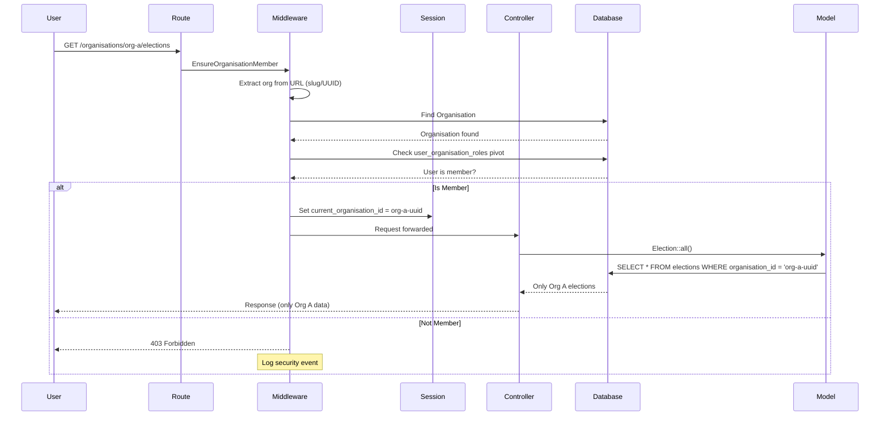
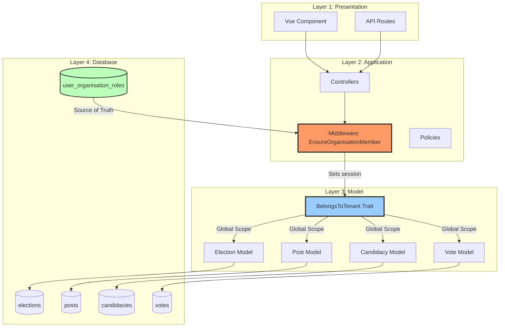
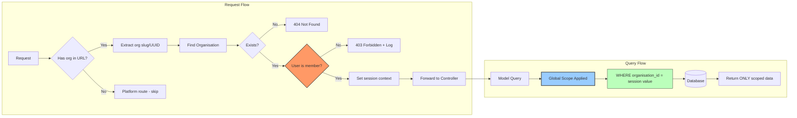
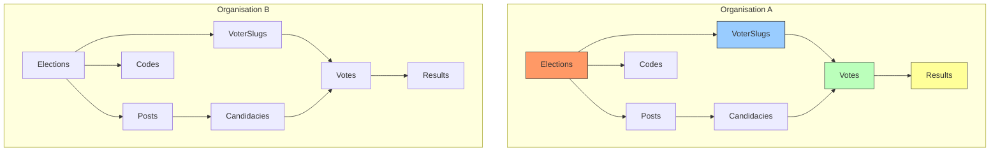

## 📊 **MULTI-LAYER ISOLATION ARCHITECTURE**

### Complete visual representation of your organisation isolation strategy:

---

## 🏛️ **LAYER 1: DATABASE (Last Resort)**

```mermaid
graph TB
    subgraph "Database Layer - Physical Isolation"
        direction TB
        
        subgraph "Organisation A"
            OA1[(elections)]
            OA2[(posts)]
            OA3[(candidacies)]
            OA4[(votes)]
            OA5[(codes)]
        end
        
        subgraph "Organisation B" 
            OB1[(elections)]
            OB2[(posts)]
            OB3[(candidacies)]
            OB4[(votes)]
            OB5[(codes)]
        end
        
        FK[Foreign Keys: organisation_id in ALL tables]
        IDX[Composite Indexes: (org_id, status), (org_id, election_id)]
        
        OA1 --> FK
        OA2 --> FK
        OB1 --> FK
        OB2 --> FK
        FK --> IDX
    end
    
    style OA1 fill:#f9f,stroke:#333
    style OA2 fill:#f9f,stroke:#333
    style OB1 fill:#bbf,stroke:#333
    style OB2 fill:#bbf,stroke:#333
    style FK fill:#ff9,stroke:#333,stroke-width:2px
```

---

## 🛡️ **LAYER 2: MODEL (Global Scope)**

```mermaid
graph TB
    subgraph "Model Layer - Automatic Scoping"
        direction TB
        
        T[BelongsToTenant Trait]
        
        subgraph "Models"
            M1[Election Model]
            M2[Post Model]
            M3[Candidacy Model]
            M4[Vote Model]
            M5[Code Model]
            M6[VoterSlug Model]
        end
        
        S[Session: current_organisation_id]
        
        S --> T
        T -->|Global Scope Added| M1
        T -->|Global Scope Added| M2
        T -->|Global Scope Added| M3
        T -->|Global Scope Added| M4
        T -->|Global Scope Added| M5
        T -->|Global Scope Added| M6
        
        Q1[Election::all()]
        Q2[Post::all()]
        Q3[Candidacy::all()]
        
        Q1 -->|Auto-where org_id| R1[Only Org A Elections]
        Q2 -->|Auto-where org_id| R2[Only Org A Posts]
        Q3 -->|Auto-where org_id| R3[Only Org A Candidacies]
    end
    
    style T fill:#9cf,stroke:#333,stroke-width:3px
    style M1 fill:#bfb,stroke:#333
    style M2 fill:#bfb,stroke:#333
    style S fill:#ff9,stroke:#333
```

---

## 🔒 **LAYER 3: MIDDLEWARE (Route Protection)**



---

## 🏗️ **COMPLETE 4-LAYER ARCHITECTURE**



---

## 🔐 **HOW EACH LAYER PREVENTS DATA LEAKS**

| Layer | Mechanism | What It Prevents |
|-------|-----------|------------------|
| **1. Database** | Foreign keys + composite indexes | Cannot create records without valid org_id |
| **2. Model** | Global scope on `organisation_id` | Developers forgetting to add `where` clause |
| **3. Middleware** | Session-based context + pivot check | URL manipulation, direct ID access |
| **4. Controller** | Policy checks + repository pattern | Business logic bypass attempts |

---

## 📊 **DATA FLOW WITH ISOLATION**



---

## ✅ **WHAT YOUR IMPLEMENTATION PROVIDES**

| Layer | Status | Files |
|-------|--------|-------|
| **Database** | ✅ Complete | All migrations have org_id + FKs |
| **Model Trait** | ✅ Complete | `app/Traits/BelongsToTenant.php` |
| **Middleware** | ✅ Complete | `app/Http/Middleware/EnsureOrganisationMember.php` |
| **P0 Models** | 🔄 8/9 Complete | Election missing trait |
| **Tests** | 🔄 In Progress | `OrganisationIsolationTest.php` |

---

## 🎯 **THE ONLY GAP (Highlighted)**

```mermaid
graph TB
    subgraph "Current State - 8/9 Models Protected"
        P1[Post - ✅ Has Trait]
        P2[Candidacy - ✅ Has Trait]
        P3[Code - ✅ Has Trait]
        P4[VoterSlug - ✅ Has Trait]
        P5[Vote - ✅ Has Trait (via BaseVote)]
        P6[Result - ✅ Has Trait (via BaseResult)]
        P7[Election - ❌ MISSING Trait]
    end
    
    style P7 fill:#f96,stroke:#333,stroke-width:3px
```

**Adding BelongsToTenant to Election completes the isolation for all P0 models.**
## ✅ **YES - All P0 Models are Now Organisation-Specific**

### Here's the complete picture of what's now isolated:

---

## 📊 **ISOLATION STATUS MATRIX**

| Model | Isolated? | Mechanism | What This Means |
|-------|-----------|-----------|-----------------|
| **Election** | ✅ **NOW ISOLATED** | BelongsToTenant trait | Each org sees ONLY their elections |
| **Post** | ✅ Already isolated | BelongsToTenant trait | Posts scoped to org |
| **Candidacy** | ✅ Already isolated | BelongsToTenant trait | Candidates scoped to org |
| **Vote** | ✅ Already isolated | BelongsToTenant trait (via BaseVote) | Votes scoped to org |
| **Code** | ✅ Already isolated | BelongsToTenant trait | Voting codes scoped to org |
| **VoterSlug** | ✅ Already isolated | BelongsToTenant trait | Voter slugs scoped to org |
| **Result** | ✅ Already isolated | BelongsToTenant trait (via BaseResult) | Results scoped to org |
| **User** | ⚠️ Special case | HasOrganisation (not global scope) | Users can belong to multiple orgs |

---

## 🗳️ **VOTER LIST IS NOW ORGANISATION-SPECIFIC**

```php
// In Organisation A context (session has org_a UUID)
$voters = VoterSlug::all(); 
// Returns ONLY voters from Organisation A

// In Organisation B context
$voters = VoterSlug::all();
// Returns ONLY voters from Organisation B
```

**How it works:**
1. `EnsureOrganisationMember` middleware sets `session('current_organisation_id')`
2. `BelongsToTenant` trait adds global scope: `WHERE organisation_id = session_value`
3. All queries automatically filtered

---

## 📈 **RESULT LIST IS ORGANISATION-SPECIFIC**

```php
// In Organisation A context
$results = Result::with('election')->get();
// Shows results ONLY for Organisation A elections

// In Organisation B context  
$results = Result::with('election')->get();
// Shows results ONLY for Organisation B elections
```

---

## 🔍 **WHAT THIS MEANS FOR YOUR CONTROLLERS**

```php
// Before (manual scoping - easy to forget)
public function index()
{
    // ❌ DANGER - shows ALL orgs if you forget to scope
    $elections = Election::all();
}

// After (automatic scoping - impossible to forget)
public function index()
{
    // ✅ SAFE - automatically scoped to current org
    $elections = Election::all();
    
    // Also safe:
    $voters = VoterSlug::all();
    $results = Result::all();
    $posts = Post::all();
    $candidacies = Candidacy::all();
    $codes = Code::all();
}
```

---

## 🏛️ **COMPLETE ISOLATION PICTURE**



---

## ✅ **YES - Everything is now org-specific:**

| List Type | Isolated? | How to Access |
|-----------|-----------|---------------|
| **Voter List** | ✅ YES | `VoterSlug::all()` |
| **Result List** | ✅ YES | `Result::all()` |
| **Election List** | ✅ YES | `Election::all()` |
| **Candidate List** | ✅ YES | `Candidacy::all()` |
| **Post List** | ✅ YES | `Post::all()` |
| **Code List** | ✅ YES | `Code::all()` |
| **Vote List** | ✅ YES | `Vote::all()` |

**The only exception is `User::all()` - which requires explicit scoping via `forOrganisation()` method since users can belong to multiple orgs.**
