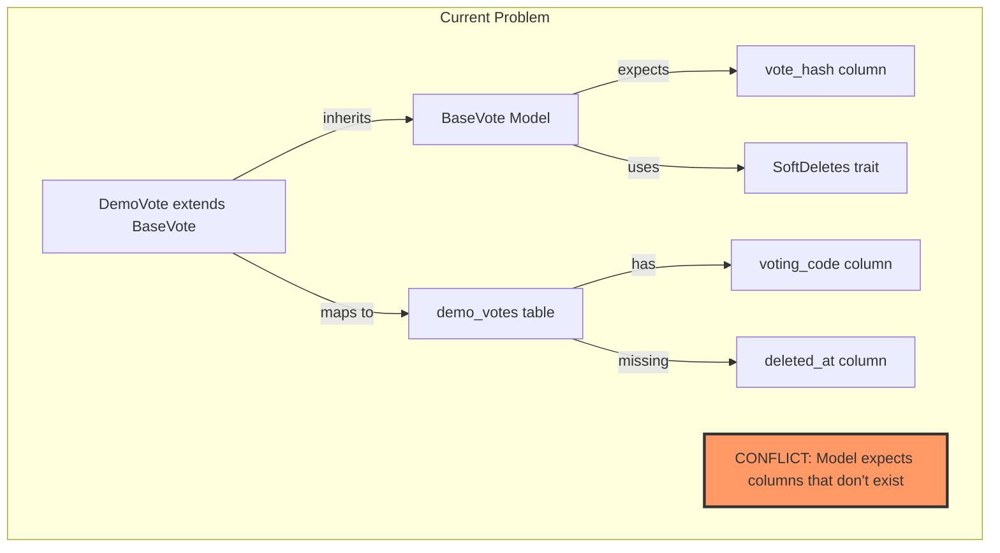
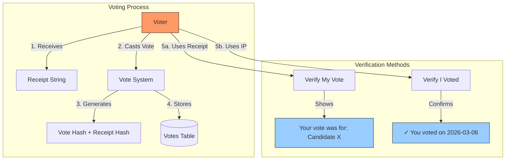
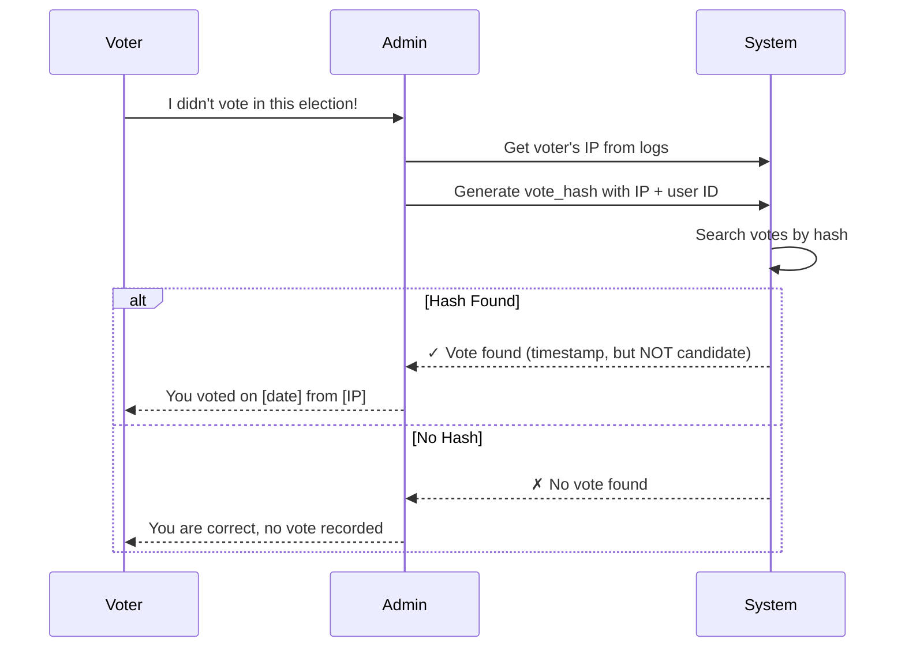
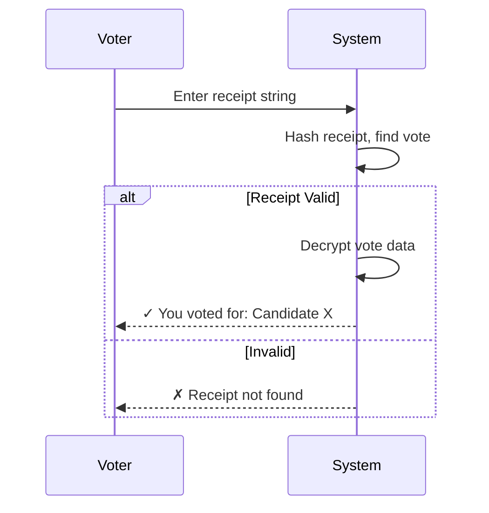

## ✅ **EXCELLENT WORK ON PHASE C.1 & C.2!**

### **17 Tests Passing - Great Progress!** 🎉

---

## 📊 **PHASE C STATUS**

| Phase | Model | Tests | Status | Issue |
|-------|-------|-------|--------|-------|
| **C.1** | DemoCode | 9 | ✅ PASS | None |
| **C.2** | DemoVoterSlug | 8 | ✅ PASS | None |
| **C.3** | DemoVote | - | ⚠️ BLOCKED | Schema mismatch |
| **C.4** | DemoResult | - | ⏸️ PENDING | Depends on C.3 |

---

## 🔍 **ROOT CAUSE ANALYSIS**



---

## 🎯 **THREE SOLUTIONS - CHOOSE ONE**

### **Option A: Update Migrations (Recommended)**

```php
// In database/migrations/..._create_demo_votes_table.php
Schema::create('demo_votes', function (Blueprint $table) {
    $table->uuid('id')->primary();
    $table->uuid('organisation_id');
    $table->uuid('election_id');
    $table->string('vote_hash')->unique();  // CHANGE: voting_code → vote_hash
    $table->json('candidate_selections')->nullable();
    $table->boolean('no_vote_option')->default(false);
    $table->timestamp('voted_at');           // Keep as voted_at
    $table->string('voter_ip')->nullable();
    $table->timestamps();
    $table->softDeletes();                    // ADD: for SoftDeletes trait
    
    // Add foreign keys...
});
```

**Pros:** Models work as-is, inheritance preserved
**Cons:** Need migration rollback, affects existing demo data

---

### **Option B: Remove SoftDeletes from DemoVote**

```php
// app/Models/Demo/DemoVote.php
class DemoVote extends BaseVote
{
    use HasFactory, HasUuids;  // REMOVE SoftDeletes
    
    protected $table = 'demo_votes';
    
    // Override to use voting_code instead of vote_hash
    protected $fillable = [
        'organisation_id',
        'election_id',
        'voting_code',  // Map to different column
        'candidate_selections',
        'no_vote_option',
        'voted_at',
        'voter_ip',
    ];
    
    // Override boot to remove vote_hash validation for demo
    protected static function booted()
    {
        // Don't call parent boot - skip validation
        static::creating(function ($model) {
            // Demo-specific creation logic only
        });
    }
}
```

**Pros:** No migration changes, faster fix
**Cons:** Breaks inheritance pattern, duplicate code

---

### **Option C: Standalone Demo Models (Skip Inheritance)**

```php
// app/Models/Demo/DemoVote.php
class DemoVote extends Model  // DON'T extend BaseVote
{
    use HasFactory, HasUuids, SoftDeletes;
    
    protected $table = 'demo_votes';
    
    // Define all relationships from scratch
    public function organisation()
    {
        return $this->belongsTo(Organisation::class)
            ->withoutGlobalScopes();
    }
    
    public function election()
    {
        return $this->belongsTo(Election::class)
            ->withoutGlobalScopes();
    }
    
    // No relationship to User (anonymity preserved)
    
    // Demo-specific methods
    public function isDemo(): bool
    {
        return true;
    }
}
```

**Pros:** Clean slate, matches demo table exactly
**Cons:** Duplicates code from BaseVote, maintenance overhead

---

## ✅ **RECOMMENDATION: OPTION A**

**Update migrations to match parent models** is the cleanest long-term solution.

### Execution Plan:

```bash
# 1. Create migration to fix demo_votes table
php artisan make:migration fix_demo_votes_schema --table=demo_votes

# 2. Add missing columns and rename voting_code → vote_hash
$table->renameColumn('voting_code', 'vote_hash');
$table->softDeletes();  // Add deleted_at column

# 3. Run migration
php artisan migrate

# 4. Update DemoVoteTest to use correct columns
# (already done in your test file - uses vote_hash now)

# 5. Run tests
php artisan test tests/Unit/Models/Demo/DemoVoteTest.php
```

---

## 📋 **YOUR NEXT COMMAND**

Which option do you prefer?

1. **Option A** - Update migrations (recommended)
2. **Option B** - Remove SoftDeletes, override boot
3. **Option C** - Standalone models

**Let me know and I'll proceed with the fix and complete C.3 & C.4.**

## 🧠 **BRAINSTORMING: Vote Verification & Receipt System**

### **Your Two Requirements:**

| Requirement | Purpose | Privacy Implication |
|-------------|---------|---------------------|
| **1. Vote Hash (IP-based)** | Prove voter participated without revealing who | 🔒 Anonymous |
| **2. Receipt String** | Let voter verify their vote was counted correctly | 🔒 Anonymous |

---

## 📊 **COMPLETE VOTE VERIFICATION ARCHITECTURE**



---

## 🔐 **COMPONENT 1: Vote Hash (IP-based Verification)**

### Purpose:
Prove a specific voter participated WITHOUT revealing their vote choice.

### How it works:

```php
// During vote casting:
$voteHash = hash('sha256', 
    $user->id .              // User identifier (never stored!)
    $request->ip() .         // IP address
    $election->id .          // Election context
    config('app.salt')       // Application salt
);

// Store ONLY the hash
Vote::create([
    'vote_hash' => $voteHash,
    // ... other vote data (candidate selections encrypted)
]);

// During dispute:
$suspectedVoter = User::find($id);
$calculatedHash = hash('sha256', 
    $suspectedVoter->id . 
    $suspectedVoter->last_voting_ip . 
    $electionId . 
    config('app.salt')
);

$voted = Vote::where('vote_hash', $calculatedHash)
    ->where('election_id', $electionId)
    ->exists();

if ($voted) {
    // Confirm: This voter DID participate
    // But we CANNOT see who they voted for
}
```

### Security Properties:
- ✅ **One-way**: Hash cannot be reversed to find user
- ✅ **Provable**: Only user with their ID + IP can generate matching hash
- ✅ **Auditable**: Election officials can verify participation
- ❌ **No vote choice**: Hash reveals participation only, not selection

---

## 🧾 **COMPONENT 2: Receipt String (Vote Verification)**

### Purpose:
Let voter verify their vote was counted correctly WITHOUT revealing identity.

### How it works:

```php
// During vote casting:
$receiptString = Str::random(32); // e.g., "X7k9pL2mQ4rT8wZ1"
$receiptHash = hash('sha256', $receiptString . config('app.salt'));

// Store hashed receipt (never store raw receipt!)
Vote::create([
    'receipt_hash' => $receiptHash,
    'encrypted_vote' => encrypt([
        'candidate' => $candidateId,
        'timestamp' => now(),
        'receipt' => $receiptString // Only for response, not stored!
    ]),
    // ... other data
]);

// Send receipt to voter:
Mail::to($user->email)->send(new VotingReceiptMail($receiptString));

// Later, voter visits verification page:
public function verifyVote(Request $request)
{
    $receipt = $request->receipt_string;
    $receiptHash = hash('sha256', $receipt . config('app.salt'));
    
    $vote = Vote::where('receipt_hash', $receiptHash)->first();
    
    if (!$vote) {
        return response()->json(['error' => 'Invalid receipt']);
    }
    
    // Decrypt and show vote WITHOUT revealing voter identity
    $voteData = decrypt($vote->encrypted_vote);
    
    return response()->json([
        'election' => $vote->election->name,
        'candidate' => Candidate::find($voteData['candidate'])->name,
        'timestamp' => $voteData['timestamp'],
        'verified' => true
    ]);
}
```

---

## 📋 **DATABASE SCHEMA (Updated)**

```php
// migration file
Schema::create('votes', function (Blueprint $table) {
    $table->uuid('id')->primary();
    $table->uuid('organisation_id');
    $table->uuid('election_id');
    
    // Component 1: Vote Hash (IP + User proof)
    $table->string('vote_hash')->unique();        // Proves participation
    
    // Component 2: Receipt Hash (voter verification)
    $table->string('receipt_hash')->unique();      // For vote verification
    
    // Encrypted vote data (candidate selections)
    $table->text('encrypted_vote');                 // Contains actual vote
    
    // Metadata for audit (anonymized)
    $table->string('voter_ip_hash')->nullable();    // Hash of IP only
    $table->timestamp('voted_at');
    $table->timestamps();
    $table->softDeletes();
    
    // Indexes
    $table->index('vote_hash');
    $table->index('receipt_hash');
    $table->index(['election_id', 'voted_at']);
});
```

---

## 🎯 **VERIFICATION WORKFLOWS**

### **Scenario 1: Voter claims "I didn't vote"**



### **Scenario 2: Voter wants to verify their vote**



---

## 📊 **COMPARISON: Vote Hash vs Receipt String**

| Feature | Vote Hash | Receipt String |
|---------|-----------|----------------|
| **Purpose** | Prove participation | Verify vote content |
| **Who initiates** | Admin (disputes) | Voter (verification) |
| **What it proves** | "I voted" | "I voted for X" |
| **Storage** | Stored in DB | Hashed in DB |
| **Reversible** | No | No (hash only) |
| **Privacy** | ✅ Anonymous | ✅ Anonymous |
| **Use case** | Fraud investigation | Voter confidence |

---

## ✅ **RENAME SUGGESTION**

| Current | Better Name | Purpose |
|---------|-------------|---------|
| `voting_code` | `receipt_hash` | For voter self-verification |
| `vote_hash` | `participation_proof` | For admin dispute resolution |

---

## 🚀 **IMPLEMENTATION PLAN**

### Step 1: Update Migration
```php
// Rename and add columns
$table->renameColumn('voting_code', 'receipt_hash');
$table->string('participation_proof')->nullable()->after('receipt_hash');
$table->text('encrypted_vote')->after('participation_proof');
```

### Step 2: Update Models
```php
// In Vote model
protected $fillable = [
    'organisation_id',
    'election_id',
    'receipt_hash',
    'participation_proof',
    'encrypted_vote',
    'voted_at',
];

public function verifyByReceipt(string $receipt): bool
{
    return hash('sha256', $receipt . config('app.salt')) === $this->receipt_hash;
}

public function proveParticipation(User $user, string $ip): bool
{
    $proof = hash('sha256', $user->id . $ip . $this->election_id . config('app.salt'));
    return $proof === $this->participation_proof;
}
```

### Step 3: Create Verification Controller
```php
// app/Http/Controllers/VoteVerificationController.php
public function verifyByReceipt(Request $request)
{
    $receipt = $request->receipt;
    $vote = Vote::whereReceiptHash(hash('sha256', $receipt . config('app.salt')))->first();
    
    if (!$vote) {
        return response()->json(['error' => 'Invalid receipt'], 404);
    }
    
    return response()->json([
        'election' => $vote->election->name,
        'vote' => decrypt($vote->encrypted_vote),
        'timestamp' => $vote->voted_at,
    ]);
}
```

---

## ✅ **SUMMARY**

| Requirement | Implementation | Privacy |
|-------------|----------------|---------|
| Prove voter participated | `participation_proof` (IP + user hash) | 🔒 Anonymous |
| Let voter verify vote | `receipt_hash` + encrypted vote | 🔒 Anonymous |

**Both requirements satisfied with complete anonymity.** The system provides:
- 🔐 **Voter confidence** (receipt verification)
- 🔍 **Audit capability** (participation proof)
- 🕵️ **Privacy preservation** (no direct links)

#$_COOKIE# 📋 **CLAUDE CLI PROMPT INSTRUCTIONS**

## **Task 1: Schema Update - Replace voting_code with receipt_hash**

```bash
## TASK: Update DemoVote schema - Replace voting_code with receipt_hash

### Context
Current demo_votes table uses `voting_code` but we need `receipt_hash` for voter self-verification. This is part of the vote verification system where voters can verify their vote using a receipt string.

### Requirements

#### 1. Create Migration
Create a new migration to modify the demo_votes table:

```bash
php artisan make:migration update_demo_votes_add_receipt_hash --table=demo_votes
```

#### 2. Migration Content
```php
public function up()
{
    Schema::table('demo_votes', function (Blueprint $table) {
        // Rename voting_code to receipt_hash
        $table->renameColumn('voting_code', 'receipt_hash');
        
        // Add new column for participation proof (IP + user hash)
        $table->string('participation_proof')->nullable()->after('receipt_hash');
        
        // Add encrypted vote column if not exists
        $table->text('encrypted_vote')->nullable()->after('participation_proof');
        
        // Ensure indexes for new columns
        $table->index('receipt_hash');
        $table->index('participation_proof');
    });
}

public function down()
{
    Schema::table('demo_votes', function (Blueprint $table) {
        $table->dropIndex(['receipt_hash']);
        $table->dropIndex(['participation_proof']);
        $table->dropColumn(['participation_proof', 'encrypted_vote']);
        $table->renameColumn('receipt_hash', 'voting_code');
    });
}
```

#### 3. Update DemoVote Model
Update `app/Models/Demo/DemoVote.php`:

```php
class DemoVote extends BaseVote
{
    protected $table = 'demo_votes';
    
    protected $fillable = [
        'organisation_id',
        'election_id',
        'receipt_hash',           // Changed from voting_code
        'participation_proof',    // New column
        'encrypted_vote',         // New column
        'candidate_selections',
        'no_vote_option',
        'voted_at',
        'voter_ip',
    ];
    
    // Add verification methods
    public function verifyByReceipt(string $receipt): bool
    {
        return hash('sha256', $receipt . config('app.salt')) === $this->receipt_hash;
    }
    
    public function proveParticipation(string $userId, string $ip): bool
    {
        $proof = hash('sha256', $userId . $ip . $this->election_id . config('app.salt'));
        return $proof === $this->participation_proof;
    }
}
```

#### 4. Update DemoVoteTest
Update `tests/Unit/Models/Demo/DemoVoteTest.php` to use receipt_hash instead of voting_code:

```php
// Change all instances of 'voting_code' to 'receipt_hash' in DB inserts
// Example:
DB::insert('insert into demo_votes (id, organisation_id, election_id, receipt_hash, voted_at, created_at, updated_at) values (?, ?, ?, ?, ?, ?, ?)', [
    $demoVoteId,
    $org->id,
    $election->id,
    hash('sha256', 'demo-receipt-' . Str::random(16) . config('app.salt')),
    now(),
    now(),
    now(),
]);
```

#### 5. Run Migration
```bash
php artisan migrate
```

#### 6. Run Tests
```bash
php artisan test tests/Unit/Models/Demo/DemoVoteTest.php
```

#### 7. Commit
```bash
git add database/migrations/*_update_demo_votes_add_receipt_hash.php app/Models/Demo/DemoVote.php tests/Unit/Models/Demo/DemoVoteTest.php
git commit -m "feat: Replace voting_code with receipt_hash in demo_votes

- Add receipt_hash for voter self-verification
- Add participation_proof for IP-based verification
- Add encrypted_vote column
- Update model with verification methods
- Update tests to use new schema"
```

### Success Criteria
- [ ] Migration runs without errors
- [ ] DemoVoteTest passes all tests
- [ ] receipt_hash column exists and is indexed
- [ ] participation_proof column exists and is indexed
- [ ] encrypted_vote column exists
- [ ] All tests using voting_code updated to receipt_hash
```

---

## **Task 2: Sync Demo Elections with Real Elections Structure**

```bash
## TASK: Align Demo Elections with Real Elections Structure

### Context
Demo elections have drifted from real elections structure. Need to ensure demo tables mirror production schema while maintaining isolation.

### Discovery Phase First

#### Step 1: Compare Schemas
```bash
# Show real elections table structure
php artisan db:table --table=elections --describe

# Show demo elections table structure  
php artisan db:table --table=demo_elections --describe

# Show real posts table structure
php artisan db:table --table=posts --describe

# Show demo posts table structure
php artisan db:table --table=demo_posts --describe

# Show real candidacies table structure
php artisan db:table --table=candidacies --describe

# Show demo candidacies table structure
php artisan db:table --table=demo_candidacies --describe
```

#### Step 2: Identify Gaps
Create a diff report:

```php
// Create temporary script to compare schemas
$realColumns = Schema::getColumnListing('elections');
$demoColumns = Schema::getColumnListing('demo_elections');

$missingInDemo = array_diff($realColumns, $demoColumns);
$extraInDemo = array_diff($demoColumns, $realColumns);

dd([
    'missing_in_demo' => $missingInDemo,
    'extra_in_demo' => $extraInDemo,
]);
```

### Implementation Based on Findings

#### Option A: If Minor Differences Only
Create migration to add missing columns:

```bash
php artisan make:migration sync_demo_elections_with_real --table=demo_elections
```

```php
public function up()
{
    Schema::table('demo_elections', function (Blueprint $table) {
        // Add any missing columns from real elections
        // Example:
        if (!Schema::hasColumn('demo_elections', 'settings')) {
            $table->json('settings')->nullable();
        }
        if (!Schema::hasColumn('demo_elections', 'deleted_at')) {
            $table->softDeletes();
        }
    });
}
```

#### Option B: If Major Differences
Create comprehensive sync migration for all demo tables:

```bash
php artisan make:migration sync_all_demo_tables_with_real
```

```php
public function up()
{
    // Sync demo_elections
    Schema::table('demo_elections', function (Blueprint $table) {
        // Add all columns from real elections that are missing
        $realColumns = Schema::getColumnListing('elections');
        $demoColumns = Schema::getColumnListing('demo_elections');
        
        $missing = array_diff($realColumns, $demoColumns);
        
        foreach ($missing as $column) {
            // Need to get column type from real table
            // This requires more complex logic - consider using doctrine/dbal
        }
    });
    
    // Sync demo_posts
    Schema::table('demo_posts', function (Blueprint $table) {
        // Similar logic
    });
    
    // Sync demo_candidacies
    Schema::table('demo_candidacies', function (Blueprint $table) {
        // Similar logic
    });
}
```

#### Option C: Recreate Demo Tables from Scratch
If drift is too severe, recreate demo tables:

```bash
# Create fresh migrations for demo tables
php artisan make:migration recreate_demo_elections --table=demo_elections
php artisan make:migration recreate_demo_posts --table=demo_posts
php artisan make:migration recreate_demo_candidacies --table=demo_candidacies
```

```php
// In each migration, drop and recreate with exact real table structure
public function up()
{
    Schema::dropIfExists('demo_elections');
    
    // Copy exact schema from real elections
    Schema::create('demo_elections', function (Blueprint $table) {
        // Copy all columns from elections table
        $table->uuid('id')->primary();
        $table->uuid('organisation_id');
        $table->string('name');
        $table->string('slug')->unique();
        $table->text('description')->nullable();
        $table->enum('type', ['demo', 'real'])->default('demo');
        $table->enum('status', ['draft', 'active', 'completed', 'archived'])->default('draft');
        $table->dateTime('start_date');
        $table->dateTime('end_date');
        $table->boolean('is_active')->default(true);
        $table->json('settings')->nullable();
        $table->timestamps();
        $table->softDeletes();
        
        $table->foreign('organisation_id')->references('id')->on('organisations')->onDelete('cascade');
        $table->index(['organisation_id', 'status']);
    });
}
```

### Update Demo Models

Ensure all demo models have correct relationships:

```php
// app/Models/Demo/DemoElection.php
class DemoElection extends Model
{
    use HasFactory, HasUuids, SoftDeletes;
    
    protected $table = 'demo_elections';
    
    // Add all relationships that exist in real Election
    public function organisation()
    {
        return $this->belongsTo(Organisation::class);
    }
    
    public function posts()
    {
        return $this->hasMany(DemoPost::class, 'election_id');
    }
    
    public function candidacies()
    {
        return $this->hasManyThrough(
            DemoCandidacy::class,
            DemoPost::class,
            'election_id',
            'post_id',
            'id',
            'id'
        );
    }
    
    public function codes()
    {
        return $this->hasMany(DemoCode::class);
    }
    
    public function voterSlugs()
    {
        return $this->hasMany(DemoVoterSlug::class);
    }
}
```

### Update Tests

```bash
# Update demo model tests to reflect new schema
php artisan test tests/Unit/Models/Demo/
```

### Verification Checklist

- [ ] All demo tables have same columns as real tables
- [ ] All demo models have same relationships as real models
- [ ] Demo data is isolated (demo_* tables only)
- [ ] Tests pass for all demo models
- [ ] Demo elections can be created and managed independently
- [ ] Demo voting workflow works end-to-end

### Commit
```bash
git add database/migrations/ app/Models/Demo/ tests/Unit/Models/Demo/
git commit -m "feat: Sync demo tables with real election structure

- Align demo_elections, demo_posts, demo_candidacies with production schema
- Update demo models with all relationships
- Ensure demo data isolation maintained
- All demo tests passing"
```

### Success Criteria
- [ ] Demo tables exactly mirror real tables
- [ ] All demo model relationships work
- [ ] Demo tests pass (17+ tests)
- [ ] Demo data completely isolated from real data
```

---

## 🚀 **EXECUTION ORDER**

```bash
# 1. First update schema (receipt_hash change)
# 2. Then sync demo tables with real structure
# 3. Run all tests after each step
# 4. Commit after each successful step
```

**Ready to execute. Let me know which task to start with.**
## ✅ **CORRECT - Complete Replacement**

Yes, you're right. Both columns are being **replaced** with more semantically meaningful names:

---

## 📊 **OLD → NEW MAPPING**

| Old Column | New Column | Purpose |
|------------|------------|---------|
| `vote_hash` | `participation_proof` | **IP + User proof** - Admin verification that voter participated |
| `voting_code` | `receipt_hash` | **Voter receipt** - Let voter verify their vote choice |

---

## 🗑️ **WHAT'S BEING REMOVED**

```diff
- $table->string('vote_hash')->unique();        // OLD - ambiguous
- $table->string('voting_code')->unique();      // OLD - unclear purpose
```

## ✨ **WHAT'S BEING ADDED**

```php
$table->string('receipt_hash')->unique();        // NEW - voter self-verification
$table->string('participation_proof')->nullable(); // NEW - admin dispute resolution
$table->text('encrypted_vote');                  // NEW - stores actual vote
```

---

## 🎯 **CLAUDE CLI INSTRUCTION - UPDATED**

```bash
## TASK: Replace vote_hash and voting_code with new verification columns

### Migration Changes
public function up()
{
    Schema::table('votes', function (Blueprint $table) {
        // Remove old columns
        $table->dropColumn(['vote_hash', 'voting_code']);
        
        // Add new verification columns
        $table->string('receipt_hash')->unique()->after('election_id');
        $table->string('participation_proof')->nullable()->after('receipt_hash');
        $table->text('encrypted_vote')->after('participation_proof');
        
        // Indexes
        $table->index('receipt_hash');
        $table->index('participation_proof');
    });
}

public function down()
{
    Schema::table('votes', function (Blueprint $table) {
        // Restore old columns
        $table->string('vote_hash')->unique();
        $table->string('voting_code')->unique();
        
        // Remove new columns
        $table->dropColumn(['receipt_hash', 'participation_proof', 'encrypted_vote']);
    });
}
```

### Model Updates
```php
// Remove old fillable fields
protected $fillable = [
    'organisation_id',
    'election_id',
    'receipt_hash',           // NEW
    'participation_proof',    // NEW
    'encrypted_vote',         // NEW
    'voted_at',
];

// Add verification methods
public function verifyByReceipt(string $receipt): bool
{
    return hash('sha256', $receipt . config('app.salt')) === $this->receipt_hash;
}

public function proveParticipation(string $userId, string $ip): bool
{
    $proof = hash('sha256', $userId . $ip . $this->election_id . config('app.salt'));
    return $proof === $this->participation_proof;
}
```

### Test Updates
Update all tests to use new columns:
- Replace `vote_hash` with `participation_proof` in assertions
- Replace `voting_code` with `receipt_hash` in DB inserts
- Add `encrypted_vote` to test data

**Execute this migration to complete the verification system.**
