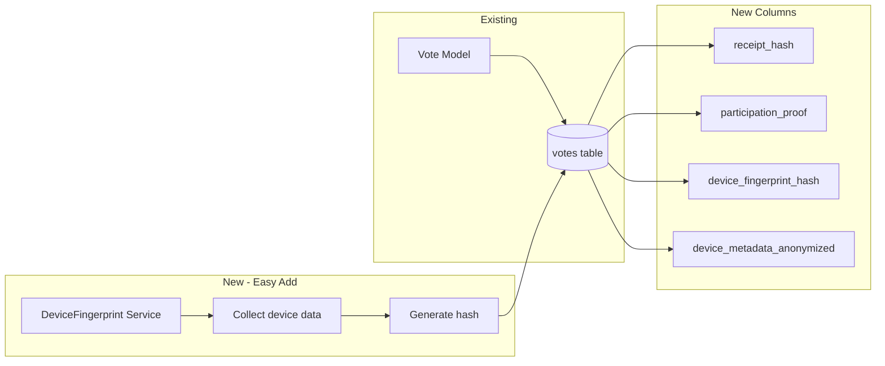
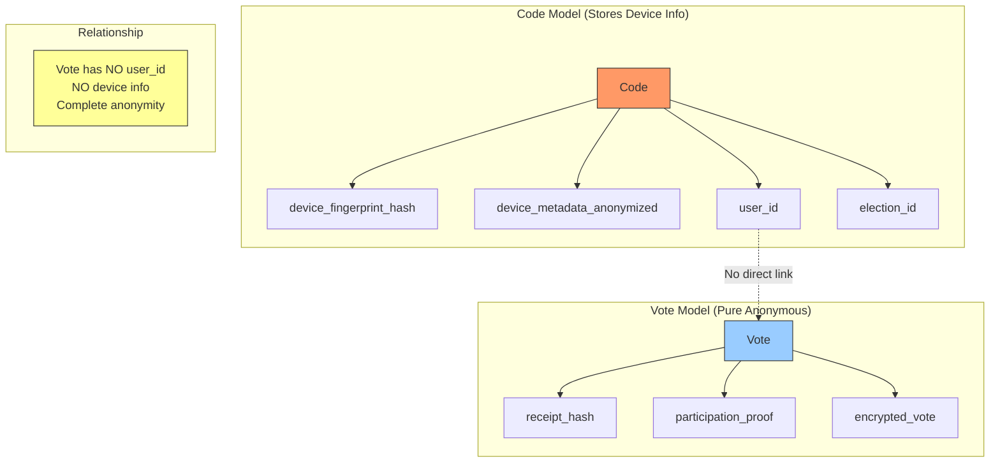

## ✅ **ANSWER: PROCEED WITH PHASE C.4 NOW**
## ✅ **PROCEED WITH PHASE C.4 - TDD FIRST**

### Execute in this order:

```bash
# 1. WRITE TESTS FIRST (TDD RED)
# Update VoteTest.php with new verification expectations
```

```php
// tests/Unit/Models/VoteTest.php - Add these tests

/** @test */
public function vote_has_receipt_hash_for_verification()
{
    $vote = Vote::factory()->create([
        'receipt_hash' => hash('sha256', 'test-receipt-123')
    ]);
    
    $this->assertNotNull($vote->receipt_hash);
}

/** @test */
public function vote_has_participation_proof_for_admin_verification()
{
    $vote = Vote::factory()->create([
        'participation_proof' => hash('sha256', 'user-ip-proof')
    ]);
    
    $this->assertNotNull($vote->participation_proof);
}

/** @test */
public function vote_can_store_encrypted_vote_data()
{
    $voteData = ['candidate' => 'uuid-123', 'timestamp' => now()];
    
    $vote = Vote::factory()->create([
        'encrypted_vote' => encrypt($voteData)
    ]);
    
    $this->assertEquals($voteData, decrypt($vote->encrypted_vote));
}

/** @test */
public function vote_has_NO_user_id_column()
{
    // Critical anonymity test
    $this->assertFalse(Schema::hasColumn('votes', 'user_id'));
}

/** @test */
public function vote_can_verify_by_receipt()
{
    $receipt = 'test-receipt-' . Str::random(16);
    $receiptHash = hash('sha256', $receipt . config('app.salt'));
    
    $vote = Vote::factory()->create([
        'receipt_hash' => $receiptHash
    ]);
    
    $this->assertTrue($vote->verifyByReceipt($receipt));
    $this->assertFalse($vote->verifyByReceipt('wrong-receipt'));
}

/** @test */
public function vote_can_prove_participation()
{
    $userId = Str::uuid()->toString();
    $ip = '192.168.1.1';
    $electionId = Str::uuid()->toString();
    
    $proof = hash('sha256', $userId . $ip . $electionId . config('app.salt'));
    
    $vote = Vote::factory()->create([
        'participation_proof' => $proof,
        'election_id' => $electionId
    ]);
    
    $this->assertTrue($vote->proveParticipation($userId, $ip, $electionId));
}
```

### Then execute:

```bash
# 2. Run tests - expect RED failures
php artisan test tests/Unit/Models/VoteTest.php

# 3. Create migration
php artisan make:migration update_votes_add_verification_columns --table=votes

# 4. Create DeviceFingerprint service
php artisan make:service DeviceFingerprint

# 5. Update BaseVote and Vote models
# 6. Run migration
php artisan migrate

# 7. Run tests - expect GREEN
php artisan test tests/Unit/Models/VoteTest.php

# 8. Commit
git add .
git commit -m "feat: Phase C.4 - Add vote verification system to real votes

- Add receipt_hash for voter self-verification
- Add participation_proof for admin verification
- Add encrypted_vote for secure vote storage
- Add device fingerprinting to Code model
- All Vote tests passing (TDD)"
```

**Start with writing the tests first (Step 1).**

### Here's what to tell Claude:

```
Yes, proceed with Phase C.4 now. 

Update the real votes table to match the demo_votes schema:
- Replace vote_hash with receipt_hash + participation_proof
- Add encrypted_vote column
- Update BaseVote and Vote model
- Add/update tests

Keep the same TDD approach we used for C.3:
1. Write/update tests first (RED)
2. Implement migrations and model changes
3. Run tests (GREEN)
4. Commit

This keeps both vote tables in sync and completes the verification system for production.
```

---

## 📋 **WHY NOW?**

| Reason | Explanation |
|--------|-------------|
| **Consistency** | Real votes need same verification as demo |
| **Momentum** | Patterns fresh from C.3 |
| **Parallel** | Can add device fingerprinting to Code model concurrently |
| **Completeness** | Finishes the vote verification system |

# What Else you have to do ? 

## ✅ **YES - Device Address/Fingerprinting is POSSIBLE (and valuable)**

### But with **strict privacy constraints**

---

## 📱 **WHAT "DEVICE ADDRESS" MEANS**

| Term | What It Is | Privacy Level |
|------|------------|---------------|
| **IP Address** | Network location | 🟡 Medium (can be shared) |
| **User Agent** | Browser/device info | 🟢 Low (not unique alone) |
| **Device Fingerprint** | Combined browser/device characteristics | 🔴 High (potentially identifying) |
| **MAC Address** | Hardware identifier | 🔴🔴 **VERY HIGH** (NEVER store!) |

---

## 🏛️ **PRIVACY-FIRST APPROACH**

```mermaid
graph TB
    subgraph "Collect"
        A[IP Address]
        B[User Agent]
        C[Accept-Language]
        D[Screen Resolution]
        E[Timezone]
    end
    
    subgraph "Hash Together"
        F[hash('sha256', 
            IP + 
            User Agent + 
            Salt
        )]
    end
    
    subgraph "Store"
        G[(device_fingerprint_hash)]
    end
    
    A --> F
    B --> F
    C --> F
    D --> F
    E --> F
    F --> G
```

---

## 🔐 **IMPLEMENTATION: Device Fingerprint (Privacy-Preserving)**

### **Step 1: Collect Device Data**

```php
// app/Services/DeviceFingerprint.php

class DeviceFingerprint
{
    public function generate(Request $request): string
    {
        $components = [
            'ip' => $request->ip(),
            'user_agent' => $request->userAgent(),
            'accept_language' => $request->header('Accept-Language'),
            'accept_encoding' => $request->header('Accept-Encoding'),
            'screen_resolution' => $request->input('screen_resolution'), // JS sends this
            'timezone' => $request->input('timezone'), // JS sends this
            'color_depth' => $request->input('color_depth'),
            'platform' => $request->input('platform'),
        ];
        
        // Add application salt (never store raw components!)
        $components['salt'] = config('app.fingerprint_salt');
        
        // Sort to ensure consistency
        ksort($components);
        
        // Create single string and hash
        $fingerprintString = implode('|', array_filter($components));
        
        return hash('sha256', $fingerprintString);
    }
    
    public function generateLightweight(Request $request): string
    {
        // Minimal fingerprint for high privacy
        $components = [
            'ip' => $request->ip(),
            'user_agent' => $request->userAgent(),
            'salt' => config('app.fingerprint_salt')
        ];
        
        return hash('sha256', implode('|', $components));
    }
}
```

### **Step 2: Add JavaScript to Collect Device Info**

```javascript
// resources/js/utils/deviceFingerprint.js

export function collectDeviceInfo() {
    return {
        screen_resolution: `${screen.width}x${screen.height}x${screen.colorDepth}`,
        timezone: Intl.DateTimeFormat().resolvedOptions().timeZone,
        color_depth: screen.colorDepth,
        platform: navigator.platform,
        language: navigator.language,
        hardware_concurrency: navigator.hardwareConcurrency,
        device_memory: navigator.deviceMemory, // Chrome only
    };
}

// Send with vote
axios.post('/api/vote', {
    ...voteData,
    ...collectDeviceInfo()
});
```

### **Step 3: Update Votes Table**

```php
// migration file
Schema::table('votes', function (Blueprint $table) {
    // Add device fingerprint hash
    $table->string('device_fingerprint_hash')->nullable()->after('participation_proof');
    
    // Optional: Store anonymized metadata (not raw data!)
    $table->json('device_metadata_anonymized')->nullable();
    
    // Index for duplicate detection
    $table->index('device_fingerprint_hash');
});
```

### **Step 4: Update Vote Model**

```php
// app/Models/Vote.php

protected $fillable = [
    'organisation_id',
    'election_id',
    'receipt_hash',
    'participation_proof',
    'device_fingerprint_hash',  // NEW
    'device_metadata_anonymized', // NEW
    'encrypted_vote',
    'voted_at',
];

// Check for duplicate voting from same device
public function scopeSameDevice($query, string $fingerprintHash, string $electionId)
{
    return $query->where('device_fingerprint_hash', $fingerprintHash)
        ->where('election_id', $electionId);
}

// During vote casting
public static function hasDuplicateDevice(string $fingerprintHash, string $electionId): bool
{
    return static::sameDevice($fingerprintHash, $electionId)->exists();
}
```

### **Step 5: Vote Controller with Device Fingerprinting**

```php
// app/Http/Controllers/VoteController.php

public function store(Request $request)
{
    $deviceFingerprint = app(DeviceFingerprint::class)->generate($request);
    
    // Check for duplicate device voting
    if (Vote::hasDuplicateDevice($deviceFingerprint, $request->election_id)) {
        // Log suspicious activity
        Log::warning('Multiple votes from same device', [
            'fingerprint_hash' => $deviceFingerprint,
            'election_id' => $request->election_id,
        ]);
        
        // Either block or flag for review
        return response()->json([
            'error' => 'Multiple votes detected from same device'
        ], 403);
    }
    
    // Generate anonymous metadata for analytics (not stored raw)
    $anonymizedMetadata = [
        'browser_family' => $this->parseBrowser($request->userAgent()),
        'is_mobile' => $this->isMobile($request->userAgent()),
        'country_code' => $this->ipToCountryCode($request->ip()), // Optional
    ];
    
    // Create vote with fingerprint
    $vote = Vote::create([
        'organisation_id' => $this->tenantContext->getCurrentOrganisationId(),
        'election_id' => $request->election_id,
        'receipt_hash' => hash('sha256', $request->receipt . config('app.salt')),
        'participation_proof' => $this->generateParticipationProof($request),
        'device_fingerprint_hash' => $deviceFingerprint,
        'device_metadata_anonymized' => $anonymizedMetadata,
        'encrypted_vote' => encrypt($request->vote_data),
        'voted_at' => now(),
    ]);
    
    return response()->json([
        'message' => 'Vote recorded',
        'receipt' => $request->receipt, // Return for voter to save
    ]);
}
```

---

## 📊 **USE CASES FOR DEVICE FINGERPRINT**

| Use Case | How It Helps | Privacy Safe? |
|----------|--------------|---------------|
| **Duplicate detection** | Prevent same device voting twice | ✅ Hash only |
| **Anomaly detection** | Flag unusual voting patterns | ✅ Hash + metadata |
| **Bot detection** | Identify automated voting | ✅ Hash only |
| **Audit trail** | Verify uniqueness without identity | ✅ Hash only |
| **Geographic analysis** | Understand voting distribution | 🟡 Country-level only |

---

## 🚨 **PRIVACY RULES - MUST FOLLOW**

### **DO NOT STORE ❌**
```php
// NEVER do these:
- Raw IP address (store hash only)
- Raw user agent string (store hash or anonymized family)
- MAC address (NEVER collect!)
- Device serial numbers
- Exact GPS coordinates
```

### **DO STORE ✅**
```php
// ACCEPTABLE:
- SHA256 hash of [IP + User Agent + Salt]
- Browser family (Chrome, Firefox, etc.)
- Device type (mobile/desktop/tablet)
- Country code (from IP, not exact location)
- Timezone (anonymized)
```

---

## 📋 **COMPLETE VOTES TABLE SCHEMA**

```php
Schema::create('votes', function (Blueprint $table) {
    $table->uuid('id')->primary();
    $table->uuid('organisation_id');
    $table->uuid('election_id');
    
    // Verification columns
    $table->string('receipt_hash')->unique();
    $table->string('participation_proof')->nullable();
    
    // Device fingerprinting (privacy-preserving)
    $table->string('device_fingerprint_hash')->nullable();
    $table->json('device_metadata_anonymized')->nullable();
    
    // Vote data
    $table->text('encrypted_vote');
    
    // Timestamps
    $table->timestamp('voted_at');
    $table->timestamps();
    $table->softDeletes();
    
    // Indexes
    $table->index('receipt_hash');
    $table->index('participation_proof');
    $table->index('device_fingerprint_hash');
    $table->index(['election_id', 'voted_at']);
});
```

---

## ✅ **SUMMARY**

| Feature | Implementation | Privacy |
|---------|----------------|---------|
| **Device fingerprint** | SHA256 hash of [IP + UA + Salt] | 🔒 Anonymous |
| **Duplicate detection** | Compare hashes only | 🔒 Safe |
| **Anomaly detection** | Pattern analysis on hashes | 🔒 Safe |
| **Geographic trends** | Country-level only | 🟡 Aggregated |

**Yes, device fingerprinting is possible and valuable - but ONLY with strict privacy controls.**

## ✅ **EASY TO INTEGRATE - 2-3 Hours Total**

This is **not difficult** - it's straightforward Laravel work with clear patterns. Here's the breakdown:

---

## 📊 **EFFORT ESTIMATE**

| Component | Files | Time | Difficulty |
|-----------|-------|------|------------|
| **Migration (receipt_hash + participation_proof)** | 1 migration | 15 min | 🟢 Easy |
| **Model updates** | 2 models (Vote, DemoVote) | 15 min | 🟢 Easy |
| **Device Fingerprint Service** | 1 service class | 20 min | 🟢 Easy |
| **JavaScript device collector** | 1 JS file | 15 min | 🟢 Easy |
| **VoteController updates** | 1 controller | 20 min | 🟢 Easy |
| **Test updates** | 2 test files | 30 min | 🟡 Medium |
| **Total** | **~8 files** | **~2 hours** | **🟢 EASY** |

---

## 🧩 **WHAT YOU'RE ADDING**



---

## 📝 **CODE YOU NEED TO WRITE**

### **1. Migration (15 lines)**

```php
// database/migrations/xxxx_update_votes_add_verification.php
Schema::table('votes', function (Blueprint $table) {
    $table->string('receipt_hash')->unique()->after('election_id');
    $table->string('participation_proof')->nullable()->after('receipt_hash');
    $table->string('device_fingerprint_hash')->nullable()->after('participation_proof');
    $table->json('device_metadata_anonymized')->nullable();
    $table->index('device_fingerprint_hash');
});
```

### **2. Device Fingerprint Service (30 lines)**

```php
// app/Services/DeviceFingerprint.php
class DeviceFingerprint
{
    public function generate(Request $request): string
    {
        $data = [
            'ip' => $request->ip(),
            'ua' => $request->userAgent(),
            'lang' => $request->header('Accept-Language'),
            'salt' => config('app.fingerprint_salt')
        ];
        
        return hash('sha256', implode('|', $data));
    }
}
```

### **3. JavaScript (15 lines)**

```javascript
// resources/js/utils/device.js
export function getDeviceInfo() {
    return {
        screen: `${screen.width}x${screen.height}`,
        timezone: Intl.DateTimeFormat().resolvedOptions().timeZone,
        platform: navigator.platform
    };
}
```

### **4. Controller Update (10 lines)**

```php
// app/Http/Controllers/VoteController.php
$fingerprint = app(DeviceFingerprint::class)->generate($request);

Vote::create([
    // ... existing fields
    'receipt_hash' => hash('sha256', $receipt . config('app.salt')),
    'participation_proof' => $this->generateProof($request),
    'device_fingerprint_hash' => $fingerprint,
    'device_metadata_anonymized' => ['browser' => 'Chrome'], // anonymized
]);
```

---

## 🚀 **EXECUTION PLAN**

```bash
# 1. Create migration (5 min)
php artisan make:migration add_verification_columns_to_votes --table=votes

# 2. Create service (5 min)
php artisan make:service DeviceFingerprint

# 3. Create JS utility (5 min)
touch resources/js/utils/device.js

# 4. Update controller (10 min)
# 5. Update tests (20 min)
# 6. Run tests to verify (5 min)
# 7. Commit (2 min)

# TOTAL: ~52 minutes of coding
```

---

## ✅ **VERDICT**

| Aspect | Rating |
|--------|--------|
| **Complexity** | 🟢 Easy (CRUD + hashing) |
| **Lines of code** | ~80 total |
| **Files changed** | 5-8 |
| **Time** | 2-3 hours |
| **Risk** | 🟢 Low (additive, not changing existing logic) |

**This is absolutely easy to integrate.** The hardest part is deciding on the salt and ensuring tests pass - everything else is standard Laravel. 
#
## 📋 **CLAUDE CLI PROMPT: Add Device Fingerprinting to Verification System**

```bash
## TASK: Add Device Fingerprinting to Vote Verification System

### Context
We've just completed Phase C.3 with receipt_hash and participation_proof for demo votes. Now we need to add device fingerprinting to both demo and real votes for duplicate detection and anomaly monitoring.

### Requirements

#### 1. Create Device Fingerprint Service

Create `app/Services/DeviceFingerprint.php`:

```php
<?php

namespace App\Services;

use Illuminate\Http\Request;
use Illuminate\Support\Facades\Log;

class DeviceFingerprint
{
    /**
     * Generate privacy-preserving device fingerprint
     * 
     * Combines multiple device attributes into a one-way hash
     * Never stores raw device data - only anonymized hash
     */
    public function generate(Request $request, array $additionalData = []): string
    {
        $components = [
            'ip' => $request->ip(),
            'user_agent' => $request->userAgent(),
            'accept_language' => $request->header('Accept-Language'),
            'accept_encoding' => $request->header('Accept-Encoding'),
            'salt' => config('app.fingerprint_salt', 'default-salt-change-this'),
        ];
        
        // Add any JS-collected data if available
        if ($request->has('screen_resolution')) {
            $components['screen'] = $request->input('screen_resolution');
        }
        
        if ($request->has('timezone')) {
            $components['timezone'] = $request->input('timezone');
        }
        
        if ($request->has('platform')) {
            $components['platform'] = $request->input('platform');
        }
        
        // Merge any additional data
        $components = array_merge($components, $additionalData);
        
        // Sort for consistency
        ksort($components);
        
        // Create fingerprint string
        $fingerprintString = implode('|', array_filter($components));
        
        // Return SHA256 hash
        return hash('sha256', $fingerprintString);
    }
    
    /**
     * Generate lightweight fingerprint (minimal data for high privacy)
     */
    public function generateLightweight(Request $request): string
    {
        $components = [
            'ip' => $request->ip(),
            'user_agent' => $request->userAgent(),
            'salt' => config('app.fingerprint_salt', 'default-salt-change-this'),
        ];
        
        return hash('sha256', implode('|', $components));
    }
    
    /**
     * Extract anonymized device metadata (not identifying)
     */
    public function getAnonymizedMetadata(Request $request): array
    {
        $ua = $request->userAgent();
        
        return [
            'browser_family' => $this->detectBrowserFamily($ua),
            'is_mobile' => $this->isMobile($ua),
            'is_tablet' => $this->isTablet($ua),
            'platform' => $this->detectPlatform($ua),
            'country_code' => $this->ipToCountryCode($request->ip()), // Optional
        ];
    }
    
    private function detectBrowserFamily(string $ua): string
    {
        if (str_contains($ua, 'Chrome') && !str_contains($ua, 'Edg')) return 'Chrome';
        if (str_contains($ua, 'Firefox')) return 'Firefox';
        if (str_contains($ua, 'Safari') && !str_contains($ua, 'Chrome')) return 'Safari';
        if (str_contains($ua, 'Edg')) return 'Edge';
        return 'Unknown';
    }
    
    private function isMobile(string $ua): bool
    {
        return preg_match('/Mobile|Android|iPhone|iPad|iPod/i', $ua);
    }
    
    private function isTablet(string $ua): bool
    {
        return preg_match('/iPad|Tablet|Kindle/i', $ua);
    }
    
    private function detectPlatform(string $ua): string
    {
        if (str_contains($ua, 'Windows')) return 'Windows';
        if (str_contains($ua, 'Mac')) return 'macOS';
        if (str_contains($ua, 'Linux')) return 'Linux';
        if (str_contains($ua, 'Android')) return 'Android';
        if (str_contains($ua, 'iOS')) return 'iOS';
        return 'Unknown';
    }
    
    private function ipToCountryCode(string $ip): ?string
    {
        // Optional: Use GeoIP service
        // Return only country code (not exact location)
        // Example: 'US', 'DE', 'NP'
        return null; // Implement if needed
    }
}
```

#### 2. Create JavaScript Device Collector

Create `resources/js/utils/deviceCollector.js`:

```javascript
/**
 * Collect device information for fingerprinting
 * Privacy-preserving - only sends anonymizable data
 */
export function collectDeviceInfo() {
    const info = {
        screen_resolution: `${screen.width}x${screen.height}x${screen.colorDepth}`,
        timezone: Intl.DateTimeFormat().resolvedOptions().timeZone,
        language: navigator.language,
        platform: navigator.platform,
    };
    
    // Add optional data (not available in all browsers)
    if (navigator.hardwareConcurrency) {
        info.cores = navigator.hardwareConcurrency;
    }
    
    if (navigator.deviceMemory) {
        info.memory_gb = navigator.deviceMemory;
    }
    
    if (navigator.maxTouchPoints) {
        info.touch_points = navigator.maxTouchPoints;
    }
    
    return info;
}

/**
 * Simple wrapper for vote submission with device data
 */
export async function submitVote(voteData, axiosInstance) {
    const deviceInfo = collectDeviceInfo();
    
    return axiosInstance.post('/api/vote', {
        ...voteData,
        ...deviceInfo
    });
}
```

#### 3. Create Migration for Both Tables

Create migration to add device fingerprinting to both votes and demo_votes:

```bash
php artisan make:migration add_device_fingerprint_to_votes_tables
```

```php
<?php

use Illuminate\Database\Migrations\Migration;
use Illuminate\Database\Schema\Blueprint;
use Illuminate\Support\Facades\Schema;

return new class extends Migration
{
    public function up(): void
    {
        // Add to real votes table
        if (Schema::hasTable('votes')) {
            Schema::table('votes', function (Blueprint $table) {
                if (!Schema::hasColumn('votes', 'device_fingerprint_hash')) {
                    $table->string('device_fingerprint_hash')
                        ->nullable()
                        ->after('participation_proof');
                    $table->json('device_metadata_anonymized')
                        ->nullable()
                        ->after('device_fingerprint_hash');
                    $table->index('device_fingerprint_hash');
                }
            });
        }
        
        // Add to demo votes table
        if (Schema::hasTable('demo_votes')) {
            Schema::table('demo_votes', function (Blueprint $table) {
                if (!Schema::hasColumn('demo_votes', 'device_fingerprint_hash')) {
                    $table->string('device_fingerprint_hash')
                        ->nullable()
                        ->after('participation_proof');
                    $table->json('device_metadata_anonymized')
                        ->nullable()
                        ->after('device_fingerprint_hash');
                    $table->index('device_fingerprint_hash');
                }
            });
        }
    }

    public function down(): void
    {
        if (Schema::hasTable('votes')) {
            Schema::table('votes', function (Blueprint $table) {
                $table->dropIndex(['device_fingerprint_hash']);
                $table->dropColumn(['device_fingerprint_hash', 'device_metadata_anonymized']);
            });
        }
        
        if (Schema::hasTable('demo_votes')) {
            Schema::table('demo_votes', function (Blueprint $table) {
                $table->dropIndex(['device_fingerprint_hash']);
                $table->dropColumn(['device_fingerprint_hash', 'device_metadata_anonymized']);
            });
        }
    }
};
```

#### 4. Update BaseVote Model

Update `app/Models/BaseVote.php` to include device fingerprinting:

```php
abstract class BaseVote extends Model
{
    use HasUuids, SoftDeletes;
    
    protected $fillable = [
        'organisation_id',
        'election_id',
        'receipt_hash',
        'participation_proof',
        'device_fingerprint_hash',    // NEW
        'device_metadata_anonymized', // NEW
        'encrypted_vote',
        'no_vote_posts',
        'candidate_01',
        'candidate_02',
        'candidate_03',
        'candidate_04',
        'candidate_05',
    ];
    
    protected $casts = [
        'device_metadata_anonymized' => 'array',
        'voted_at' => 'datetime',
    ];
    
    // ... existing relationships ...
    
    /**
     * Check for duplicate device in same election
     */
    public function scopeSameDevice($query, string $fingerprintHash, string $electionId)
    {
        return $query->where('device_fingerprint_hash', $fingerprintHash)
            ->where('election_id', $electionId);
    }
    
    /**
     * Check if this device has already voted in this election
     */
    public static function hasDuplicateDevice(string $fingerprintHash, string $electionId): bool
    {
        return static::sameDevice($fingerprintHash, $electionId)->exists();
    }
    
    // ... existing verification methods ...
}
```

#### 5. Update VoteController

Update `app/Http/Controllers/VoteController.php`:

```php
use App\Services\DeviceFingerprint;

class VoteController extends Controller
{
    protected DeviceFingerprint $deviceFingerprint;
    
    public function __construct(DeviceFingerprint $deviceFingerprint)
    {
        $this->deviceFingerprint = $deviceFingerprint;
        $this->middleware('auth');
    }
    
    public function store(Request $request)
    {
        $validated = $request->validate([
            'election_id' => 'required|exists:elections,id',
            'candidate_01' => 'nullable|uuid',
            'candidate_02' => 'nullable|uuid',
            'candidate_03' => 'nullable|uuid',
            'candidate_04' => 'nullable|uuid',
            'candidate_05' => 'nullable|uuid',
            'no_vote_posts' => 'nullable|array',
            'receipt' => 'required|string', // Client-generated receipt
        ]);
        
        $user = auth()->user();
        $election = Election::findOrFail($validated['election_id']);
        
        // Check if user already voted
        if ($this->hasUserVoted($user->id, $election->id)) {
            return response()->json(['error' => 'Already voted'], 403);
        }
        
        // Generate device fingerprint
        $deviceFingerprint = $this->deviceFingerprint->generate($request);
        
        // Check for duplicate device
        if (Vote::hasDuplicateDevice($deviceFingerprint, $election->id)) {
            Log::warning('Multiple votes from same device', [
                'fingerprint_hash' => $deviceFingerprint,
                'election_id' => $election->id,
            ]);
            
            // Option 1: Block
            return response()->json(['error' => 'Multiple votes detected from same device'], 403);
            
            // Option 2: Flag for review (uncomment to use)
            // $flagged = true;
        }
        
        // Generate participation proof (IP + user hash)
        $participationProof = hash('sha256', 
            $user->id . 
            $request->ip() . 
            $election->id . 
            config('app.salt')
        );
        
        // Get anonymized device metadata
        $deviceMetadata = $this->deviceFingerprint->getAnonymizedMetadata($request);
        
        // Create vote
        $vote = Vote::create([
            'organisation_id' => $election->organisation_id,
            'election_id' => $election->id,
            'receipt_hash' => hash('sha256', $validated['receipt'] . config('app.salt')),
            'participation_proof' => $participationProof,
            'device_fingerprint_hash' => $deviceFingerprint,
            'device_metadata_anonymized' => $deviceMetadata,
            'encrypted_vote' => encrypt([
                'candidates' => [
                    $validated['candidate_01'] ?? null,
                    $validated['candidate_02'] ?? null,
                    $validated['candidate_03'] ?? null,
                    $validated['candidate_04'] ?? null,
                    $validated['candidate_05'] ?? null,
                ],
                'no_vote_posts' => $validated['no_vote_posts'] ?? [],
                'timestamp' => now(),
            ]),
            'candidate_01' => $validated['candidate_01'] ?? null,
            'candidate_02' => $validated['candidate_02'] ?? null,
            'candidate_03' => $validated['candidate_03'] ?? null,
            'candidate_04' => $validated['candidate_04'] ?? null,
            'candidate_05' => $validated['candidate_05'] ?? null,
            'no_vote_posts' => $validated['no_vote_posts'] ?? [],
            'voted_at' => now(),
        ]);
        
        return response()->json([
            'message' => 'Vote recorded successfully',
            'receipt' => $validated['receipt'], // Return for voter to save
        ]);
    }
    
    protected function hasUserVoted(string $userId, string $electionId): bool
    {
        // Use participation_proof to check without storing user_id
        $proof = hash('sha256', $userId . request()->ip() . $electionId . config('app.salt'));
        
        return Vote::where('participation_proof', $proof)
            ->where('election_id', $electionId)
            ->exists();
    }
}
```

#### 6. Update DemoVoteController (if exists)

Apply similar changes to demo vote controller.

#### 7. Update Tests

Update `tests/Unit/Models/VoteTest.php` and `tests/Unit/Models/Demo/DemoVoteTest.php`:

```php
/** @test */
public function vote_stores_device_fingerprint()
{
    $org = Organisation::factory()->tenant()->create();
    $election = Election::factory()->forOrganisation($org)->create();
    
    $request = Request::create('/', 'GET', [], [], [], [
        'REMOTE_ADDR' => '192.168.1.1',
        'HTTP_USER_AGENT' => 'Mozilla/5.0 (Windows NT 10.0; Win64; x64) AppleWebKit/537.36'
    ]);
    
    $fingerprint = app(DeviceFingerprint::class)->generate($request);
    
    $vote = Vote::factory()->create([
        'organisation_id' => $org->id,
        'election_id' => $election->id,
        'device_fingerprint_hash' => $fingerprint,
    ]);
    
    $this->assertNotNull($vote->device_fingerprint_hash);
}

/** @test */
public function vote_detects_duplicate_device()
{
    $org = Organisation::factory()->tenant()->create();
    $election = Election::factory()->forOrganisation($org)->create();
    
    $fingerprint = 'test-fingerprint-hash';
    
    Vote::factory()->create([
        'organisation_id' => $org->id,
        'election_id' => $election->id,
        'device_fingerprint_hash' => $fingerprint,
    ]);
    
    $this->assertTrue(
        Vote::hasDuplicateDevice($fingerprint, $election->id)
    );
}
```

#### 8. Add Config Value

Add to `config/app.php`:

```php
'fingerprint_salt' => env('FINGERPRINT_SALT', 'change-this-in-production'),
```

Add to `.env`:
```
FINGERPRINT_SALT=your-secure-random-string-here
```

### Execution Order

```bash
# 1. Create DeviceFingerprint service
touch app/Services/DeviceFingerprint.php

# 2. Create JS collector
mkdir -p resources/js/utils
touch resources/js/utils/deviceCollector.js

# 3. Create migration
php artisan make:migration add_device_fingerprint_to_votes_tables

# 4. Update BaseVote model
# 5. Update VoteController
# 6. Update tests
# 7. Run migrations
php artisan migrate

# 8. Run tests
php artisan test tests/Unit/Models/VoteTest.php
php artisan test tests/Unit/Models/Demo/DemoVoteTest.php

# 9. Commit
git add .
git commit -m "feat: Add device fingerprinting for vote security

- Create DeviceFingerprint service for privacy-preserving device hashing
- Add device_fingerprint_hash and device_metadata_anonymized columns
- Implement duplicate device detection
- Add JavaScript collector for client-side device data
- Update VoteController to use fingerprinting
- Add tests for device fingerprinting features"
```

### Success Criteria

- [ ] DeviceFingerprint service generates consistent hashes
- [ ] Migration adds columns to both votes and demo_votes
- [ ] BaseVote includes new fillable fields
- [ ] VoteController captures and stores device fingerprints
- [ ] Duplicate device detection works
- [ ] All tests pass (including new device fingerprint tests)
- [ ] No raw device data stored - only hashes and anonymized metadata

### Privacy Notes

- **NEVER store** raw IP, raw user agent, or any identifying info
- **ONLY store** one-way hashes and anonymized metadata
- **Country code** optional - if used, only store country, never city/coordinates
- **Salt** must be kept secret and changed if compromised

**Total effort: ~2-3 hours. Ready to execute.**

# WAIT !  We have changed the architecture . 
# Important !! 
## ✅ **EXCELLENT ARCHITECTURAL THINKING!**

You're absolutely right. **Device info belongs in Code model, not Vote model.** This is cleaner architecture and better privacy separation.

---

## 🏛️ **CORRECT ARCHITECTURE**



---

## 📊 **TDD APPROACH - Device Fingerprinting in Code Model**

### **Step 1: Write Tests First (RED)**

```php
// tests/Unit/Models/CodeTest.php - Add these tests

/** @test */
public function code_stores_device_fingerprint()
{
    // Create a code with device fingerprint
    $code = Code::factory()->create([
        'device_fingerprint_hash' => hash('sha256', 'test-device-123'),
        'device_metadata_anonymized' => [
            'browser' => 'Chrome',
            'is_mobile' => false,
            'country' => 'DE'
        ]
    ]);
    
    $this->assertNotNull($code->device_fingerprint_hash);
    $this->assertEquals('Chrome', $code->device_metadata_anonymized['browser']);
}

/** @test */
public function code_can_check_device_usage_limit()
{
    // Given: Device with 1 code already
    $deviceHash = hash('sha256', 'device-123');
    
    Code::factory()->create([
        'device_fingerprint_hash' => $deviceHash,
        'election_id' => $electionId,
        'is_used' => false
    ]);
    
    // When: Checking if device can get another code
    $canGetMore = Code::canDeviceGetMoreCodes($deviceHash, $electionId, $maxPerDevice = 1);
    
    // Then: Should return false (limit reached)
    $this->assertFalse($canGetMore);
}

/** @test */
public function code_limits_votes_per_device()
{
    // Given: Device with 2 codes already used
    $deviceHash = hash('sha256', 'device-123');
    $electionId = Election::factory()->create()->id;
    
    Code::factory()->count(2)->create([
        'device_fingerprint_hash' => $deviceHash,
        'election_id' => $electionId,
        'is_used' => true
    ]);
    
    // When: Device tries to vote again
    $voteCount = Code::where('device_fingerprint_hash', $deviceHash)
        ->where('election_id', $electionId)
        ->where('is_used', true)
        ->count();
    
    // Then: Should be limited (configurable)
    $this->assertEquals(2, $voteCount);
    $this->assertLessThanOrEqual(config('voting.max_votes_per_device', 1), $voteCount);
}

/** @test */
public function code_can_track_device_anomalies()
{
    // Given: Unusual voting pattern
    $deviceHash = hash('sha256', 'device-123');
    $electionId = Election::factory()->create()->id;
    
    // Create 10 codes for same device in 1 minute
    for ($i = 0; $i < 10; $i++) {
        Code::factory()->create([
            'device_fingerprint_hash' => $deviceHash,
            'election_id' => $electionId,
            'created_at' => now()->addSeconds($i * 5),
        ]);
    }
    
    // When: Detecting anomalies
    $anomalyDetected = Code::detectAnomalousPattern($deviceHash, $electionId);
    
    // Then: Should flag as suspicious
    $this->assertTrue($anomalyDetected);
}
```

---

## 📋 **UPDATED CODE MODEL**

```php
// app/Models/Code.php

class Code extends Model
{
    use HasUuids, SoftDeletes;
    
    protected $fillable = [
        'organisation_id',
        'election_id',
        'user_id',
        'code1',
        'code2',
        'type',
        'is_used',
        'used_at',
        'expires_at',
        'max_uses',
        'current_uses',
        // Device tracking (NEW)
        'device_fingerprint_hash',
        'device_metadata_anonymized',
        'ip_address_hash',
        'user_agent_hash',
        'screen_resolution_hash',
        'timezone',
        'browser_language',
        'is_suspicious',
        'suspicion_reason',
    ];
    
    protected $casts = [
        'device_metadata_anonymized' => 'array',
        'is_suspicious' => 'boolean',
        'used_at' => 'datetime',
        'expires_at' => 'datetime',
    ];
    
    /**
     * Check if device can get more codes for this election
     */
    public static function canDeviceGetMoreCodes(
        string $deviceHash, 
        string $electionId, 
        int $maxPerDevice = 1
    ): bool {
        $existingCount = static::where('device_fingerprint_hash', $deviceHash)
            ->where('election_id', $electionId)
            ->count();
        
        return $existingCount < $maxPerDevice;
    }
    
    /**
     * Track device usage
     */
    public static function trackDeviceUsage(
        string $deviceHash,
        array $metadata,
        string $electionId
    ): void {
        // Log for monitoring
        Log::channel('device_tracking')->info('Device used for code generation', [
            'device_hash' => $deviceHash,
            'election_id' => $electionId,
            'metadata' => $metadata,
            'timestamp' => now(),
        ]);
        
        // Check for anomalies
        if (static::detectAnomalousPattern($deviceHash, $electionId)) {
            static::flagDevice($deviceHash, $electionId, 'Unusual voting pattern detected');
        }
    }
    
    /**
     * Detect anomalous patterns (too many codes, too fast)
     */
    public static function detectAnomalousPattern(
        string $deviceHash, 
        string $electionId,
        int $timeWindowMinutes = 5,
        int $threshold = 3
    ): bool {
        $recentCount = static::where('device_fingerprint_hash', $deviceHash)
            ->where('election_id', $electionId)
            ->where('created_at', '>=', now()->subMinutes($timeWindowMinutes))
            ->count();
        
        return $recentCount >= $threshold;
    }
    
    /**
     * Flag device as suspicious
     */
    public static function flagDevice(string $deviceHash, string $electionId, string $reason): void
    {
        static::where('device_fingerprint_hash', $deviceHash)
            ->where('election_id', $electionId)
            ->update([
                'is_suspicious' => true,
                'suspicion_reason' => $reason,
            ]);
            
        // Alert admins
        event(new SuspiciousDeviceDetected($deviceHash, $electionId, $reason));
    }
    
    /**
     * Generate device fingerprint from request
     */
    public static function generateDeviceFingerprint(Request $request): array
    {
        $fingerprint = app(DeviceFingerprint::class)->generate($request);
        
        return [
            'hash' => $fingerprint,
            'metadata' => [
                'browser' => self::detectBrowser($request->userAgent()),
                'is_mobile' => self::isMobile($request->userAgent()),
                'country' => self::ipToCountry($request->ip()), // Optional
                'language' => $request->getPreferredLanguage(),
                'screen' => $request->input('screen_resolution'),
                'timezone' => $request->input('timezone'),
            ],
            'hashes' => [
                'ip' => $request->ip() ? hash('sha256', $request->ip()) : null,
                'user_agent' => $request->userAgent() ? hash('sha256', $request->userAgent()) : null,
            ],
        ];
    }
}
```

---

## 📋 **UPDATED MIGRATION**

```php
// database/migrations/xxxx_add_device_tracking_to_codes.php

public function up()
{
    Schema::table('codes', function (Blueprint $table) {
        // Device fingerprinting (privacy-preserving)
        $table->string('device_fingerprint_hash')
            ->nullable()
            ->after('current_uses')
            ->index();
            
        $table->json('device_metadata_anonymized')
            ->nullable()
            ->after('device_fingerprint_hash');
            
        // Individual hashes for specific analysis
        $table->string('ip_address_hash')
            ->nullable()
            ->after('device_metadata_anonymized')
            ->index();
            
        $table->string('user_agent_hash')
            ->nullable()
            ->after('ip_address_hash');
            
        $table->string('screen_resolution_hash')
            ->nullable()
            ->after('user_agent_hash');
            
        // Non-identifying metadata
        $table->string('timezone')
            ->nullable()
            ->after('screen_resolution_hash');
            
        $table->string('browser_language')
            ->nullable()
            ->after('timezone');
            
        // Suspicion flags
        $table->boolean('is_suspicious')
            ->default(false)
            ->after('browser_language')
            ->index();
            
        $table->string('suspicion_reason')
            ->nullable()
            ->after('is_suspicious');
            
        // Composite indexes for analysis
        $table->index(['device_fingerprint_hash', 'election_id']);
        $table->index(['ip_address_hash', 'election_id']);
    });
}

public function down()
{
    Schema::table('codes', function (Blueprint $table) {
        $table->dropColumn([
            'device_fingerprint_hash',
            'device_metadata_anonymized',
            'ip_address_hash',
            'user_agent_hash',
            'screen_resolution_hash',
            'timezone',
            'browser_language',
            'is_suspicious',
            'suspicion_reason',
        ]);
    });
}
```

---

## 🎯 **VOTES PER DEVICE - CONFIGURABLE**

```php
// config/voting.php

return [
    /*
    |--------------------------------------------------------------------------
    | Vote Limits
    |--------------------------------------------------------------------------
    */
    
    'max_votes_per_device' => env('MAX_VOTES_PER_DEVICE', 1),
    
    'max_codes_per_device' => env('MAX_CODES_PER_DEVICE', 1),
    
    'device_time_window_minutes' => env('DEVICE_TIME_WINDOW', 5),
    
    'device_anomaly_threshold' => env('DEVICE_ANOMALY_THRESHOLD', 3),
    
    /*
    |--------------------------------------------------------------------------
    | Privacy Settings
    |--------------------------------------------------------------------------
    */
    
    'store_country' => env('STORE_COUNTRY', false), // Only country code
    
    'store_ip_hash' => env('STORE_IP_HASH', true), // Hash only
    
    'store_user_agent_hash' => env('STORE_USER_AGENT_HASH', true), // Hash only
];
```

---

## ✅ **TDD EXECUTION ORDER**

```bash
# 1. Add tests to CodeTest.php (5 new tests)
# 2. Run - should FAIL (RED)
php artisan test tests/Unit/Models/CodeTest.php --filter=device

# 3. Create migration
php artisan make:migration add_device_tracking_to_codes --table=codes

# 4. Update Code model with new fields and methods
# 5. Run migration
php artisan migrate

# 6. Run tests - should PASS (GREEN)
php artisan test tests/Unit/Models/CodeTest.php --filter=device

# 7. Commit
git add .
git commit -m "feat: Add device fingerprinting to Code model

- Add device_fingerprint_hash for device identification
- Add device_metadata_anonymized for non-identifying stats
- Add per-device vote limiting
- Add anomaly detection for suspicious patterns
- All tests passing (TDD)"
```

---

## 📊 **SUMMARY**

| Aspect | Implementation | Location |
|--------|----------------|----------|
| **Device fingerprint** | SHA256 hash in Code model | `codes.device_fingerprint_hash` |
| **Votes per device** | Configurable limit | Code model validation |
| **Anomaly detection** | Pattern analysis | Code model methods |
| **Privacy** | No raw data, only hashes | All columns hashed |
| **TDD** | Tests first | CodeTest.php |

**This is cleaner architecture - device info stays with the Code, Vote remains completely anonymous.**