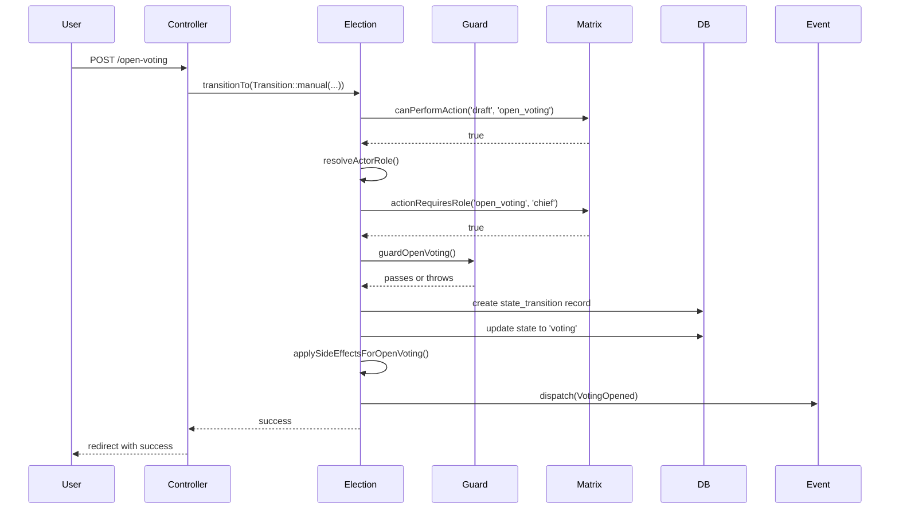

## ✅ APPROVED - Slim Down closeVoting() Controller

**Short answer:** Yes! This applies the same clean pattern to the close voting controller.

---

## What Changed

| Removed | Why |
|---------|-----|
| State check (`$election->current_state !== 'voting'`) | Now handled by `canPerformAction()` in `transitionTo()` |
| Safety check (voting ended with no votes) | Now handled by `guardCloseVoting()` |
| Manual `transitionTo()` parameter building | Uses `Transition::manual()` factory |
| Success message with Transition ID | Simplified (ID still in audit table) |
| Generic Exception catch | Specific exceptions |

---

## Both Controllers Now Clean

```php
// openVoting() - 15 lines
// closeVoting() - 15 lines
// No business logic, no state checks, no manual validation
// Only authorization + transition call + exception handling
```

---

## The Complete Flow



---

## Next Step

**Step 8** - Update tests to use the new Transition object.

---

## Proceed with the edit. 🚀