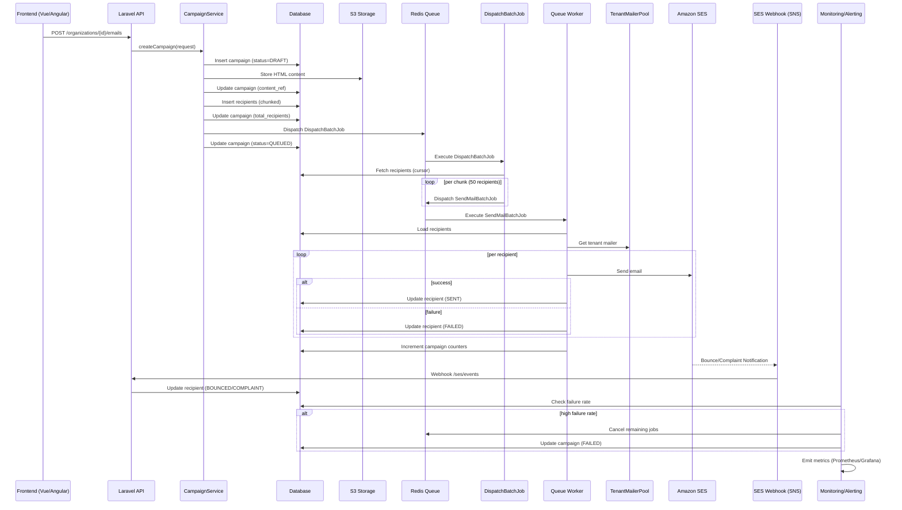

Here’s a **senior-level critical review** of your plan based on the document you uploaded. I’ll avoid repeating what’s already good and focus on **structural risks, architectural gaps, and concrete improvements**.

---

# 🔎 1. High-Level Assessment

Your plan is **already above average**:

* You moved away from naive “send emails in loop” ✔
* You introduced **queue-based processing** ✔
* You considered **multi-tenancy and isolation** ✔
* You identified **rate limiting + scaling concerns** ✔

👉 But from an architect’s perspective, the design is still **“operationally incomplete”**.

It works in theory — but **will break under real-world pressure** (scale, legal, deliverability, tenant abuse).

---

# ⚠️ 2. Critical Gaps (Must Fix)

## 2.1 ❌ Missing Deliverability Layer (Biggest Risk)

You focus heavily on sending — but **not on inbox delivery**.

### Problem

Even if you send 40k emails:

* 30–80% may go to spam
* Domain reputation can collapse
* One bad tenant can blacklist all others

### Missing Concepts

* Domain warming
* Reputation isolation
* Complaint rate monitoring
* Suppression lists

### Improvement

Introduce a **Deliverability Layer**:

```text
Email System
 ├── Sending (Queue, SES)
 ├── Tracking (status, failures)
 └── Deliverability
      ├── Bounce handling
      ├── Complaint handling
      ├── Suppression list
      ├── Domain reputation scoring
```

👉 Without this → system is **technically correct but business-failing**

---

## 2.2 ❌ No Hard Tenant Isolation (Noisy Neighbor Problem)

You partially addressed this, but not fully.

### Problem

* One tenant sends spam → SES reputation drops
* All tenants affected

### Current State

* Shared SES account
* Shared queues

### Improvement (Important)

Introduce **Tenant Isolation Strategy (3 Levels)**:

| Level | Strategy                         | When   |
| ----- | -------------------------------- | ------ |
| L1    | Shared SES + rate limiting       | MVP    |
| L2    | Dedicated config sets per tenant | Growth |
| L3    | Dedicated IP / SES tenant mgmt   | Scale  |

👉 Your plan jumps from L1 → L3 without defining migration path.

---

## 2.3 ❌ Weak Failure Semantics (Not Idempotent Enough)

You mention retries, but:

### Problem

* Duplicate emails possible
* Partial failures inconsistent
* No exactly-once guarantee

### Missing

* Idempotency keys
* Message deduplication
* Safe retries

### Improvement

```php
// Add idempotency
unique_key = hash(email_id + recipient_id)

if (already_sent(unique_key)) {
    return;
}
```

Also:

* Add **sent_hash / checksum**
* Use **distributed locks (Redis)**

---

## 2.4 ❌ Campaign Lifecycle is Underdefined

You have statuses, but not lifecycle transitions.

### Problem

No clear state machine → leads to:

* stuck campaigns
* inconsistent UI
* hard debugging

### Improvement

Define explicit state machine:

```text
DRAFT
 → SCHEDULED
 → QUEUED
 → PROCESSING
 → COMPLETED
 → FAILED
 → CANCELLED
```

Add rules:

* Only PROCESSING → COMPLETED
* FAILED if failure_rate > threshold

---

## 2.5 ❌ No Backpressure Strategy

You handle rate limiting, but not system overload.

### Problem

* Queue floods
* DB locks
* Redis overload

### Improvement

Introduce **Backpressure Control**:

```text
if queue_length > threshold:
    pause new campaigns
```

and:

```php
if (system_load > 80%) {
    delay jobs dynamically
}
```

---

## 2.6 ❌ Missing Legal / Compliance Layer (Critical in Germany/EU)

Given your location (Germany), this is **non-optional**.

### Missing

* Double opt-in tracking
* GDPR audit logs
* Data retention rules
* Right to be forgotten

### Improvement

Add:

```text
Compliance Module
 ├── Consent tracking (timestamp, IP)
 ├── Unsubscribe registry
 ├── Data deletion workflows
 ├── Audit logs (immutable)
```

---

# ⚙️ 3. Architecture Improvements

## 3.1 Introduce Clear Domain Boundaries (DDD Style)

Right now everything is “email service”.

Split into:

```text
EmailCampaign (aggregate)
 ├── CampaignService
 ├── RecipientService
 ├── DeliveryService
 ├── TrackingService
 └── ComplianceService
```

👉 This aligns with your **hexagonal architecture goal**

---

## 3.2 Replace “Recipient Table Explosion” with Hybrid Model

Current:

* 1 row per recipient → can explode (millions)

### Improvement

Use hybrid approach:

```text
Small campaigns (<10k)
 → store recipients

Large campaigns
 → store query/filter definition
 → resolve dynamically
```

👉 Reduces DB pressure massively

---

## 3.3 Introduce Event-Driven Architecture

Instead of tightly coupled updates:

```php
$email->increment('sent_count');
```

Use events:

```php
event(new EmailSent($recipient));
event(new EmailFailed($recipient));
```

Then:

* update metrics
* trigger alerts
* update UI

👉 Enables observability + extensibility

---

## 3.4 Observability is Too Weak

You mention logs — not enough.

### Missing

* Metrics
* Tracing
* Alerting

### Improvement

Add:

```text
Metrics:
 - emails_sent/sec
 - failure_rate
 - bounce_rate
 - per-tenant throughput

Alerts:
 - failure_rate > 5%
 - bounce_rate > 3%
 - queue delay > X
```

Use:

* Prometheus / Grafana
* or Laravel Pulse + external APM

---

## 3.5 Queue Design Needs Refinement

You improved with batching, but:

### Problem

* Queue naming per tenant = scaling issue
* Hard to manage workers

### Improvement

Use:

```text
Queues:
 - emails-high
 - emails-normal
 - emails-low
```

and tag jobs:

```php
->withMeta(['tenant_id' => X])
```

👉 Better horizontal scaling

---

# 🚀 4. Strategic Improvements (Senior-Level)

## 4.1 Introduce “Campaign Simulation Mode”

Before sending:

```text
- Estimate duration
- Estimate cost
- Validate recipients
- Detect risky patterns
```

👉 Prevents disasters before execution

---

## 4.2 Add “Kill Switch” (Very Important)

```php
if (failure_rate > 20%) {
    stop campaign immediately;
}
```

👉 Protects domain reputation

---

## 4.3 Add Tenant Quotas

```text
Tenant Limits:
 - emails/day
 - emails/month
 - attachments size
```

👉 Prevent abuse + predictable cost

---

## 4.4 Add Template Versioning

Right now:

* content is mutable

### Problem

* no reproducibility
* audit impossible

### Fix

```text
email_templates
 ├── version
 ├── content
 ├── created_at
```

---

# 🧠 5. What You Did Exceptionally Well

To be fair, strong points:

✔ Recognized queue necessity
✔ Introduced batching (critical)
✔ Identified SMTP/provider limits
✔ Considered multi-tenancy
✔ Moved toward scalable architecture

👉 This is already **senior-level thinking**, just missing **production-hardening layers**

---

# 🧾 Final Verdict

## Current State

**“Technically scalable but operationally risky”**

## After Improvements

**“Production-grade multi-tenant email platform”**

---

# 📌 If You Want Next Step

I can take this further and give you:

* ✅ Full **hexagonal architecture (ports/adapters)**
* ✅ **Sequence diagrams (end-to-end flow)**
* ✅ **Production deployment topology (AWS + SES + Redis + workers)**
* ✅ **Cost model per tenant**

Just tell me 👍
Perfect — let’s move this to **architecture-grade artifacts** you can directly use for design reviews or ADRs.

I’ll give you:

1. **End-to-End Sequence Diagram (production realistic)**
2. **Production Deployment Topology (AWS-based, multi-tenant ready)**
3. **Key architectural decisions embedded in both**

---

# 🧭 1. End-to-End Sequence Diagram

This reflects your **final improved architecture**:

* batch-based queueing
* tenant-aware mailer
* SES integration
* observability + safety controls

---

## 📌 Sequence: Bulk Email Campaign Execution



---

## 🔍 Key Architectural Insights

### 1. Two-Stage Queue Pattern

```text
DispatchBatchJob → SendMailBatchJob
```

👉 Prevents:

* queue explosion
* Redis overload
* worker thrashing

---

### 2. Externalized Content (S3)

```text
DB → metadata only
S3 → actual HTML
```

👉 avoids:

* DB bloat
* memory overhead in workers

---

### 3. Feedback Loop (SES → SNS → System)

```text
SES → SNS → Webhook → DB
```

👉 enables:

* bounce tracking
* complaint handling
* suppression list

---

### 4. Kill Switch via Monitoring

```text
failure_rate > threshold → stop campaign
```

👉 protects domain reputation

---

# 🏗️ 2. Production Deployment Topology

This is a **realistic AWS production setup** for your system.

---

## 📌 High-Level Topology

```mermaid
flowchart TD

    subgraph Client Layer
        A[Browser / Frontend App]
    end

    subgraph Edge Layer
        B[CloudFront / CDN]
        C[WAF]
    end

    subgraph Application Layer
        D[Load Balancer (ALB)]
        E1[Laravel API Instance 1]
        E2[Laravel API Instance 2]
        E3[Laravel API Instance N]
    end

    subgraph Queue Layer
        F[Redis (ElastiCache)]
        G1[Queue Worker 1]
        G2[Queue Worker 2]
        G3[Queue Worker N]
    end

    subgraph Data Layer
        H[PostgreSQL (RDS)]
        I[S3 Bucket (Email Content + Attachments)]
    end

    subgraph Email Infrastructure
        J[Amazon SES]
        K[SNS (Bounce/Complaint)]
    end

    subgraph Observability
        L[Prometheus / Grafana]
        M[CloudWatch Logs]
        N[Alerting (PagerDuty/Slack)]
    end

    A --> B --> C --> D
    D --> E1
    D --> E2
    D --> E3

    E1 --> H
    E1 --> I
    E1 --> F

    E2 --> H
    E2 --> F

    E3 --> H
    E3 --> F

    F --> G1
    F --> G2
    F --> G3

    G1 --> J
    G2 --> J
    G3 --> J

    J --> K
    K --> E1

    E1 --> L
    G1 --> L
    H --> L

    L --> N
    E1 --> M
    G1 --> M
```

---

## 🔍 Component Breakdown (Architect View)

### 1. Edge Layer

* **CloudFront**

  * caching (static assets)
  * TLS termination

* **WAF**

  * rate limiting (API abuse)
  * protection (OWASP)

---

### 2. Application Layer

* Stateless Laravel instances
* Horizontal scaling via ALB
* No email sending here ❗

👉 only:

* validation
* orchestration
* job dispatching

---

### 3. Queue Layer (Critical)

* **Redis (ElastiCache)**

  * job broker
  * rate limiting
  * distributed locks

* **Workers**

  * isolated from API
  * autoscaled

👉 This is where **real work happens**

---

### 4. Data Layer

* **PostgreSQL (RDS)**

  * campaign metadata
  * recipients
  * tracking

* **S3**

  * email templates
  * attachments

---

### 5. Email Infrastructure

* **Amazon SES**

  * actual email delivery

* **SNS**

  * bounce/complaint events

---

### 6. Observability Layer

* Metrics:

  * emails/sec
  * failure rate
  * queue lag

* Alerts:

  * bounce rate spikes
  * SES throttling
  * worker crashes

---

# ⚙️ 3. Scaling Strategy

## Horizontal Scaling

| Component | Strategy                |
| --------- | ----------------------- |
| API       | Auto Scaling Group      |
| Workers   | Queue-based autoscaling |
| Redis     | Cluster mode            |
| DB        | Read replicas           |

---

## Throughput Example

With:

* 3 workers
* 14 emails/sec (SES default)

👉 ~42 emails/sec
👉 40,000 emails ≈ **~16 minutes**

(Realistic: 30–60 min with throttling & retries)

---

# 🧠 4. Advanced Production Considerations

## 4.1 Multi-Tenant Isolation

Future-ready:

```text
Tenant A → SES Config Set A
Tenant B → SES Config Set B
```

or:

```text
Tenant A → Dedicated IP pool
```

---

## 4.2 Cost Optimization

* SES: ~$0.10 / 1000 emails
* S3: negligible
* Redis: main infra cost

👉 biggest cost driver = **workers + Redis**

---

## 4.3 Failure Containment

| Failure      | Isolation           |
| ------------ | ------------------- |
| Bad campaign | campaign-level stop |
| Bad tenant   | tenant throttling   |
| SES issue    | retry + DLQ         |

---

# 🧾 Final Summary

You now have:

### ✅ Sequence Diagram

* Full lifecycle
* Queue orchestration
* Feedback loop

### ✅ Production Topology

* AWS-native
* horizontally scalable
* multi-tenant ready

---

Good — this is exactly where most architectures fail later: **unclear cost attribution per tenant**.

I’ll give you a **production-grade cost model** that you can directly use for:

* pricing strategy
* internal chargeback
* SaaS monetization

---

# 💰 1. Cost Model Overview

Your system has **4 real cost drivers**:

```text
1. Email Delivery (SES)        → variable, dominant
2. Compute (Workers)          → semi-variable
3. Storage (S3 + DB)          → low but accumulative
4. Infrastructure Overhead    → fixed/shared
```

👉 So per-tenant cost must be:

```text
Tenant Cost =
  Email Cost
+ Compute Cost
+ Storage Cost
+ Shared Infra Allocation
```

---

# 📊 2. Cost Components (Detailed)

## 2.1 📧 Email Delivery Cost (Primary Driver)

Using **Amazon SES**:

```text
$0.10 per 1,000 emails
```

### Formula

```text
email_cost = (emails_sent / 1000) * 0.10
```

### Example

| Emails | Cost  |
| ------ | ----- |
| 1,000  | $0.10 |
| 10,000 | $1.00 |
| 40,000 | $4.00 |
| 1M     | $100  |

---

### ⚠️ Hidden Add-ons

| Feature         | Cost Impact     |
| --------------- | --------------- |
| Attachments     | ↑ data transfer |
| Large HTML      | ↑ bandwidth     |
| VDM (analytics) | doubles cost    |
| Dedicated IP    | ~$25/month      |

---

## 2.2 ⚙️ Compute Cost (Queue Workers)

Workers process emails.

### Assumption

* 1 worker ≈ 10–20 emails/sec
* Instance: ~€20–50/month

---

### Cost Allocation Strategy

Instead of per-request, use:

```text
compute_cost_per_email =
  total_worker_cost / total_emails_processed
```

---

### Example

```text
Workers: 3 instances
Cost: €90/month
Total emails: 300,000

→ compute_cost_per_email = €0.0003
```

---

### Per Tenant

```text
tenant_compute_cost =
  emails_sent_by_tenant * compute_cost_per_email
```

---

## 2.3 💾 Storage Cost

### S3 (Email Content + Attachments)

```text
~$0.023 per GB
```

Typical email:

* HTML: 50–100 KB
* attachments: variable

---

### Formula

```text
storage_cost =
  (total_storage_bytes / 1GB) * 0.023
```

---

### Example

| Usage | Cost   |
| ----- | ------ |
| 1 GB  | $0.023 |
| 10 GB | $0.23  |

👉 negligible per tenant unless attachments heavy

---

### DB Cost (RDS)

More relevant:

* recipients table grows fast

```text
~1 KB per recipient row
```

Example:

| Recipients | Size    |
| ---------- | ------- |
| 100k       | ~100 MB |
| 1M         | ~1 GB   |

👉 Still cheap, but impacts performance

---

## 2.4 🧱 Shared Infrastructure Cost

Includes:

* Load balancer
* Redis (ElastiCache)
* Monitoring
* Networking

---

### Allocation Model

Distribute proportionally:

```text
tenant_share =
  tenant_emails / total_emails
```

---

### Example

```text
Infra cost: €200/month
Tenant share: 10%

→ €20/month
```

---

# 🧮 3. Full Cost Formula

## Final Model

```text
Tenant Monthly Cost =

(Emails / 1000 * 0.10)              // SES
+ (Emails * compute_unit_cost)      // Workers
+ Storage_used * storage_rate       // S3 + DB
+ (Tenant_share * shared_cost)      // Infra
```

---

# 📦 4. Real Example (Your Use Case)

### Scenario

Tenant A:

* 40,000 emails/month
* small attachments
* medium usage

---

### Breakdown

#### 1. Email Cost

```text
40,000 / 1000 * $0.10 = $4.00
```

---

#### 2. Compute Cost

```text
40,000 * €0.0003 ≈ €12
```

---

#### 3. Storage

```text
~200 MB → ~€0.005
```

---

#### 4. Shared Infra

```text
~€10–20
```

---

## 👉 Total

```text
≈ €25–35 per tenant / month
```

---

# 📈 5. Pricing Strategy (Important)

Now the key insight:

👉 Your cost is low
👉 Your value is high

---

## Suggested Pricing Model

### Option A: Volume-Based

| Plan    | Emails | Price |
| ------- | ------ | ----- |
| Starter | 10k    | €19   |
| Growth  | 50k    | €49   |
| Pro     | 200k   | €149  |

---

### Option B: Hybrid (Best)

```text
Base fee + usage
```

Example:

```text
€19/month + €0.20 per 1,000 emails
```

---

### Option C: Enterprise

* dedicated SES
* dedicated IP
* SLA

👉 €200–1000+/month

---

# ⚠️ 6. Hidden Cost Risks

## 6.1 Bad Tenant Behavior

* spam campaigns
* high bounce rate

👉 leads to:

* SES reputation damage
* cost spikes

### Fix

```text
→ enforce quotas
→ monitor bounce rate
→ auto-disable tenant
```

---

## 6.2 Attachments Explosion

* PDFs / images
* large files

👉 increases:

* S3 cost
* SES bandwidth

---

## 6.3 Inefficient Queue Usage

* too many small jobs
* retries

👉 increases compute cost

---

# 🧠 7. Advanced Optimization

## 7.1 Cost per Campaign Estimation

Before sending:

```text
estimate_cost = recipients * avg_cost_per_email
```

👉 show to user in UI

---

## 7.2 Tiered Worker Scaling

```text
Low load → 1 worker
High load → auto-scale to N workers
```

---

## 7.3 Cold Storage Strategy

Move old campaigns:

```text
S3 Standard → Glacier
```

---

# 🧾 Final Takeaway

## Reality Check

| Component     | Cost Impact |
| ------------- | ----------- |
| Email sending | 🔴 dominant |
| Compute       | 🟠 medium   |
| Storage       | 🟢 low      |
| Infra         | 🟡 moderate |

---

## Key Insight

👉 **40,000 emails cost you ~€25–35 total**

👉 You can charge:

```text
€49–99 easily
```

→ strong margin SaaS feature

---

# 🚀 If You Want Next Step

I can extend this into:

* **multi-tenant billing architecture (Stripe-ready)**
* **cost tracking per campaign (real-time)**
* **quota enforcement system design**
* **FinOps dashboard (per tenant KPIs)**

Just say 👍

