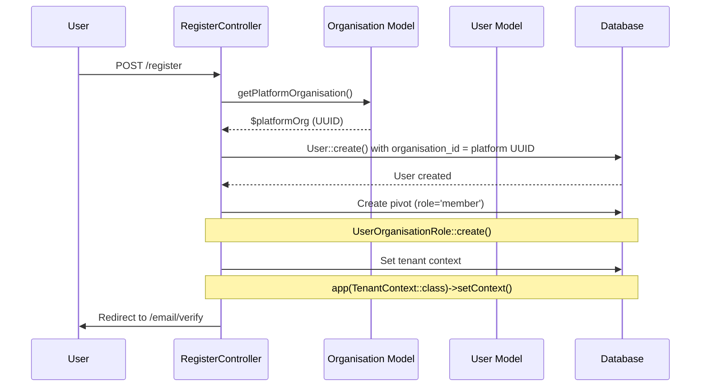

# 📚 **DEVELOPER GUIDE: UUID Multi-Tenancy Authentication & Routing**

## **Public Digit Voting Platform**

---

# 📑 TABLE OF CONTENTS

1. [System Overview](#system-overview)
2. [UUID Architecture Principles](#uuid-architecture-principles)
3. [Core Components](#core-components)
4. [The Priority System (UUID Edition)](#the-priority-system-uuid-edition)
5. [Database Schema (UUID)](#database-schema-uuid)
6. [Pivot Tables & Relationships](#pivot-tables--relationships)
7. [Registration Flow](#registration-flow)
8. [Login Flow & DashboardResolver](#login-flow--dashboardresolver)
9. [The 8 Priority Levels Explained](#the-8-priority-levels-explained)
10. [User Helper Methods](#user-helper-methods)
11. [Organisation Creation Flow](#organisation-creation-flow)
12. [Common Issues & Debugging](#common-issues--debugging)
13. [Debugging Toolkit](#debugging-toolkit)
14. [Quick Reference](#quick-reference)

---

# SYSTEM OVERVIEW

## **What We Built**

A **UUID-based multi-tenant voting platform** where:

- **Platform users** (type='platform', is_default=true) see welcome → create their own organisation
- **Organisation admins** go directly to their organisation dashboard
- **Voters** with active elections go to election dashboard
- **Users in voting** resume their session

## **Key Files**

| File | Purpose |
|------|---------|
| `app/Http/Controllers/Auth/LoginController.php` | Handles login, calls DashboardResolver |
| `app/Http/Controllers/Auth/RegisterController.php` | Creates users + pivot records |
| `app/Services/DashboardResolver.php` | **Heart of the system** - decides where users go |
| `app/Models/User.php` | User model with helper methods |
| `app/Models/Organisation.php` | Organisation model with platform resolver |
| `app/Http/Controllers/OrganisationController.php` | Organisation creation and switching |

---

# UUID ARCHITECTURE PRINCIPLES

## **1. NO Hardcoded IDs**

```php
// ❌ WRONG - Never do this
if ($user->organisation_id == 1) { ... }

// ✅ RIGHT - Always resolve platform UUID
$platformOrgId = app(Organisation::class)->getPlatformOrganisation()->id;
if ($user->organisation_id === $platformOrgId) { ... }
```

## **2. Foreign Key Constraints Enforce Integrity**

```php
// Migration ensures data integrity
$table->foreign('organisation_id')
      ->references('id')
      ->on('organisations')
      ->onDelete('restrict'); // Cannot delete org with users
```

## **3. No "Effective" Methods - Data is Always Valid**

```php
// ❌ REMOVED - We don't need this anymore
// public function getEffectiveOrganisationId() { ... }

// ✅ Just use organisation_id directly
$currentOrg = $user->organisation; // Guaranteed valid by FK
```

## **4. Cache Platform UUID, Not Redirects**

```php
// ✅ Cache platform UUID (infrequently changing)
Cache::remember('platform_org_id', 3600, function() {
    return Organisation::where('type', 'platform')
        ->where('is_default', true)
        ->value('id');
});

// ❌ Don't cache redirects (they're cheap to calculate)
```

---

# CORE COMPONENTS

## **1. LoginController - The Entry Point**

```php
// app/Http/Controllers/Auth/LoginController.php

namespace App\Http\Controllers\Auth;

use App\Http\Controllers\Controller;
use App\Services\DashboardResolver;
use Illuminate\Http\Request;
use Illuminate\Support\Facades\Auth;

class LoginController extends Controller
{
    public function __construct(
        private DashboardResolver $dashboardResolver
    ) {}

    public function store(Request $request)
    {
        $credentials = $request->validate([
            'email' => ['required', 'email'],
            'password' => ['required'],
        ]);

        if (!Auth::attempt($credentials, $request->boolean('remember'))) {
            return back()->withErrors([
                'email' => 'The provided credentials do not match our records.',
            ])->onlyInput('email');
        }

        $user = Auth::user();

        // Priority 1: Email verification
        if ($user->email_verified_at === null) {
            return redirect()->route('verification.notice');
        }

        // DELEGATE to DashboardResolver
        return $this->dashboardResolver->resolve($user);
    }
}
```

## **2. DashboardResolver - The Brain**

```php
// app/Services/DashboardResolver.php

namespace App\Services;

use App\Models\User;
use App\Models\Organisation;
use App\Models\Election;
use App\Models\VoterSlug;
use Illuminate\Http\RedirectResponse;
use Illuminate\Support\Facades\Cache;
use Illuminate\Support\Facades\Log;

class DashboardResolver
{
    private ?string $platformOrgId = null;

    public function resolve(User $user): RedirectResponse
    {
        Log::info('🚀 DASHBOARD RESOLVER START', [
            'user_id' => $user->id,
            'email_verified' => $user->email_verified_at ? 'YES' : 'NO',
            'organisation_id' => $user->organisation_id,
            'onboarded_at' => $user->onboarded_at,
        ]);

        // Priority 1: Already checked in LoginController, but double-check
        if ($user->email_verified_at === null) {
            return redirect()->route('verification.notice');
        }

        // Priority 2: Active voting session
        if ($redirect = $this->checkActiveVoting($user)) {
            return $redirect;
        }

        // Priority 3: Active election available
        if ($redirect = $this->checkActiveElection($user)) {
            return $redirect;
        }

        // Priority 4-5: Organisation context
        return $this->handleOrganisationContext($user);
    }

    private function getPlatformOrgId(): string
    {
        if ($this->platformOrgId) {
            return $this->platformOrgId;
        }

        $this->platformOrgId = Cache::remember('platform_org_id', 3600, function () {
            return Organisation::where('type', 'platform')
                ->where('is_default', true)
                ->value('id');
        });

        return $this->platformOrgId;
    }

    private function checkActiveVoting(User $user): ?RedirectResponse
    {
        $activeVoterSlug = VoterSlug::where('user_id', $user->id)
            ->where('is_active', true)
            ->where('expires_at', '>', now())
            ->whereNull('vote_completed_at')
            ->first();

        if ($activeVoterSlug) {
            Log::info('🗳️ PRIORITY 2: Active voting session', [
                'user_id' => $user->id,
                'voter_slug' => $activeVoterSlug->slug
            ]);
            return redirect()->route('voting.portal', $activeVoterSlug->slug);
        }

        return null;
    }

    private function checkActiveElection(User $user): ?RedirectResponse
    {
        // Get all organisations user belongs to (excluding platform)
        $userOrgs = $user->organisations()
            ->where('type', 'tenant')
            ->get();

        foreach ($userOrgs as $org) {
            $activeElection = Election::where('organisation_id', $org->id)
                ->where('status', 'active')
                ->where('start_date', '<=', now())
                ->where('end_date', '>=', now())
                ->first();

            if ($activeElection) {
                // Check if user hasn't already voted
                $hasVoted = VoterSlug::where('user_id', $user->id)
                    ->where('election_id', $activeElection->id)
                    ->whereNotNull('vote_completed_at')
                    ->exists();

                if (!$hasVoted) {
                    Log::info('🗳️ PRIORITY 3: Active election available', [
                        'user_id' => $user->id,
                        'organisation' => $org->name,
                        'election' => $activeElection->name
                    ]);
                    return redirect()->route('election.dashboard', [
                        'organisation' => $org->slug,
                        'election' => $activeElection->slug
                    ]);
                }
            }
        }

        return null;
    }

    private function handleOrganisationContext(User $user): RedirectResponse
    {
        $platformOrgId = $this->getPlatformOrgId();

        // User is in platform context
        if ($user->organisation_id === $platformOrgId) {
            if ($user->onboarded_at === null) {
                Log::info('📍 PRIORITY 4a: Platform user not onboarded → welcome', [
                    'user_id' => $user->id
                ]);
                return redirect()->route('dashboard.welcome');
            }

            Log::info('📍 PRIORITY 4b: Platform user onboarded → dashboard', [
                'user_id' => $user->id
            ]);
            return redirect()->route('dashboard');
        }

        // User is in tenant context
        $organisation = $user->organisation;

        Log::info('📍 PRIORITY 5: Tenant user → organisation dashboard', [
            'user_id' => $user->id,
            'organisation' => $organisation->name
        ]);

        return redirect()->route('organisations.show', $organisation->slug);
    }
}
```

---

# THE PRIORITY SYSTEM (UUID EDITION)

```
┌─────────────────────────────────────────────────────┐
│                    PRIORITY 1                        │
│              EMAIL VERIFICATION                       │
│  └── If not verified → /email/verify                  │
├─────────────────────────────────────────────────────┤
│                    PRIORITY 2                        │
│              ACTIVE VOTING SESSION                    │
│  └── If in middle of vote → /v/{voter_slug}          │
├─────────────────────────────────────────────────────┤
│                    PRIORITY 3                        │
│              ACTIVE ELECTION AVAILABLE                │
│  └── If can vote → /election/dashboard               │
├─────────────────────────────────────────────────────┤
│                    PRIORITY 4                        │
│              PLATFORM CONTEXT                         │
│  ├── Not onboarded → /dashboard/welcome              │
│  └── Onboarded → /dashboard                          │
├─────────────────────────────────────────────────────┤
│                    PRIORITY 5                        │
│              TENANT CONTEXT                           │
│  └── Organisation dashboard → /organisations/{slug}  │
└─────────────────────────────────────────────────────┘
```

---

# DATABASE SCHEMA (UUID)

## **Key Tables**

### **organisations table**
```sql
CREATE TABLE organisations (
    id UUID PRIMARY KEY,
    name VARCHAR(255) NOT NULL,
    slug VARCHAR(255) UNIQUE NOT NULL,
    type ENUM('platform', 'tenant') NOT NULL DEFAULT 'tenant',
    is_default BOOLEAN DEFAULT false,
    settings JSON NULL,
    created_at TIMESTAMP NULL,
    updated_at TIMESTAMP NULL,
    deleted_at TIMESTAMP NULL,
    
    INDEX idx_type (type),
    INDEX idx_is_default (is_default)
);
```

### **users table**
```sql
CREATE TABLE users (
    id UUID PRIMARY KEY,
    organisation_id UUID NOT NULL,
    name VARCHAR(255) NOT NULL,
    email VARCHAR(255) UNIQUE NOT NULL,
    email_verified_at TIMESTAMP NULL,
    password VARCHAR(255) NOT NULL,
    onboarded_at TIMESTAMP NULL,
    remember_token VARCHAR(100) NULL,
    created_at TIMESTAMP NULL,
    updated_at TIMESTAMP NULL,
    deleted_at TIMESTAMP NULL,
    
    FOREIGN KEY (organisation_id) REFERENCES organisations(id) ON DELETE RESTRICT,
    INDEX idx_organisation_id (organisation_id),
    INDEX idx_email_verified (email_verified_at)
);
```

### **user_organisation_roles (PIVOT TABLE)**
```sql
CREATE TABLE user_organisation_roles (
    id UUID PRIMARY KEY,
    user_id UUID NOT NULL,
    organisation_id UUID NOT NULL,
    role VARCHAR(50) NOT NULL, -- 'member', 'admin', 'owner', 'voter'
    permissions JSON NULL,
    created_at TIMESTAMP NULL,
    updated_at TIMESTAMP NULL,
    
    FOREIGN KEY (user_id) REFERENCES users(id) ON DELETE CASCADE,
    FOREIGN KEY (organisation_id) REFERENCES organisations(id) ON DELETE CASCADE,
    UNIQUE KEY unique_user_org (user_id, organisation_id),
    INDEX idx_user_id (user_id),
    INDEX idx_organisation_id (organisation_id),
    INDEX idx_role (role)
);
```

### **elections table** (example tenant table)
```sql
CREATE TABLE elections (
    id UUID PRIMARY KEY,
    organisation_id UUID NOT NULL,
    name VARCHAR(255) NOT NULL,
    slug VARCHAR(255) UNIQUE NOT NULL,
    status ENUM('draft', 'active', 'completed', 'archived') DEFAULT 'draft',
    start_date DATETIME NULL,
    end_date DATETIME NULL,
    created_at TIMESTAMP NULL,
    updated_at TIMESTAMP NULL,
    deleted_at TIMESTAMP NULL,
    
    FOREIGN KEY (organisation_id) REFERENCES organisations(id) ON DELETE CASCADE,
    INDEX idx_organisation_status (organisation_id, status),
    INDEX idx_dates (start_date, end_date)
);
```

**⚠️ CRITICAL:** The `user_organisation_roles` table is the source of truth for organisation membership. The `users.organisation_id` is just a cache of the current context.

---

# PIVOT TABLES & RELATIONSHIPS

## **Why Pivot Tables?**

The `user_organisation_roles` table is **CRITICAL**. It determines:
- ✅ If a user can access an organisation (no pivot = 403)
- ✅ What role they have in that organisation
- ✅ Which organisations they belong to

## **User Model Relationships**

```php
// app/Models/User.php

class User extends Authenticatable
{
    use HasUuids, SoftDeletes;

    // Current organisation context
    public function organisation()
    {
        return $this->belongsTo(Organisation::class, 'organisation_id');
    }

    // All organisations user belongs to (source of truth)
    public function organisations()
    {
        return $this->belongsToMany(
            Organisation::class,
            'user_organisation_roles',
            'user_id',
            'organisation_id'
        )
        ->withPivot('role', 'permissions')
        ->withTimestamps();
    }

    // Organisation roles pivot records
    public function organisationRoles()
    {
        return $this->hasMany(UserOrganisationRole::class);
    }

    // Check if user belongs to specific organisation
    public function belongsToOrganisation(string $organisationId): bool
    {
        return $this->organisationRoles()
            ->where('organisation_id', $organisationId)
            ->exists();
    }
}
```

## **The Single Source of Truth Principle**

```php
// ✅ CORRECT - Use pivot table for membership checks
if ($user->belongsToOrganisation($organisationId)) {
    // User has access
}

// ❌ WRONG - Don't rely on users.organisation_id for membership
if ($user->organisation_id === $organisationId) {
    // This might be stale!
}
```

---

# REGISTRATION FLOW



## **Implementation**

```php
// app/Http/Controllers/Auth/RegisterController.php

namespace App\Http\Controllers\Auth;

use App\Http\Controllers\Controller;
use App\Models\User;
use App\Models\Organisation;
use App\Models\UserOrganisationRole;
use App\Services\TenantContext;
use Illuminate\Http\Request;
use Illuminate\Support\Facades\Hash;
use Illuminate\Support\Facades\DB;
use Illuminate\Auth\Events\Registered;

class RegisterController extends Controller
{
    public function __construct(
        private TenantContext $tenantContext
    ) {}

    public function store(Request $request)
    {
        $request->validate([
            'name' => ['required', 'string', 'max:255'],
            'email' => ['required', 'string', 'email', 'max:255', 'unique:users'],
            'password' => ['required', 'confirmed', 'min:8'],
        ]);

        DB::transaction(function () use ($request) {
            // Get platform organisation (type='platform', is_default=true)
            $platformOrg = Organisation::getPlatformOrganisation();

            // Create user with platform as current organisation
            $user = User::create([
                'name' => $request->name,
                'email' => $request->email,
                'password' => Hash::make($request->password),
                'organisation_id' => $platformOrg->id,
            ]);

            // Create pivot - user is MEMBER of platform
            UserOrganisationRole::create([
                'user_id' => $user->id,
                'organisation_id' => $platformOrg->id,
                'role' => 'member',
            ]);

            // Set tenant context to platform
            $this->tenantContext->setContext($user, $platformOrg);

            // Fire registered event (sends verification email)
            event(new Registered($user));
        });

        return redirect()->route('verification.notice');
    }
}
```

## **Organisation Model Platform Resolver**

```php
// app/Models/Organisation.php

class Organisation extends Model
{
    use HasUuids, SoftDeletes;

    public static function getPlatformOrganisation(): self
    {
        return Cache::remember('platform_organisation', 3600, function () {
            return static::where('type', 'platform')
                ->where('is_default', true)
                ->firstOrFail();
        });
    }

    public function isPlatform(): bool
    {
        return $this->type === 'platform';
    }

    public function isTenant(): bool
    {
        return $this->type === 'tenant';
    }
}
```

---

# LOGIN FLOW & DASHBOARDRESOLVER

## **Complete Login Flow**

```php
// 1. User submits login form (LoginController)
// 2. Check email verification
// 3. Delegate to DashboardResolver
// 4. DashboardResolver checks priorities in order
// 5. User redirected to appropriate destination
```

## **DashboardResolver Priorities in Code**

```php
// app/Services/DashboardResolver.php (full implementation above)

public function resolve(User $user): RedirectResponse
{
    // Priority 1: Email verification
    if ($user->email_verified_at === null) {
        return redirect()->route('verification.notice');
    }
    
    // Priority 2: Active voting session
    if ($activeVoterSlug = $this->getActiveVoterSlug($user)) {
        return redirect()->route('voting.portal', $activeVoterSlug->slug);
    }
    
    // Priority 3: Active election available
    if ($activeElection = $this->getActiveElectionForUser($user)) {
        return redirect()->route('election.dashboard', [
            'organisation' => $activeElection->organisation->slug,
            'election' => $activeElection->slug
        ]);
    }
    
    // Priority 4-5: Organisation context
    return $this->handleOrganisationContext($user);
}
```

---

# THE 8 PRIORITY LEVELS EXPLAINED

## **PRIORITY 1: Email Verification**

**Purpose:** Security - unverified users cannot access any protected pages.

```php
if ($user->email_verified_at === null) {
    return redirect()->route('verification.notice');
}
```

**When it triggers:**
- User registered but hasn't clicked verification link
- User logged in before verifying

**Debug:** Check `email_verified_at` in database.

---

## **PRIORITY 2: Active Voting Session**

**Purpose:** Users in the middle of voting must resume where they left off.

```php
protected function getActiveVoterSlug(User $user): ?VoterSlug
{
    return VoterSlug::where('user_id', $user->id)
        ->where('is_active', true)
        ->where('expires_at', '>', now())
        ->whereNull('vote_completed_at')
        ->first();
}
```

**When it triggers:**
- User started voting but didn't finish
- Voting session still active (not expired)

**Debug:** Check `voter_slugs` table for active records.

---

## **PRIORITY 3: Active Election Available**

**Purpose:** Users who can vote should go to election dashboard.

```php
protected function getActiveElectionForUser(User $user): ?Election
{
    // Get all tenant organisations user belongs to
    $userOrgs = $user->organisations()
        ->where('type', 'tenant')
        ->get();
    
    foreach ($userOrgs as $org) {
        $activeElection = Election::where('organisation_id', $org->id)
            ->where('status', 'active')
            ->where('start_date', '<=', now())
            ->where('end_date', '>=', now())
            ->first();
        
        if ($activeElection) {
            // Check if user hasn't already voted
            $hasVoted = VoterSlug::where('user_id', $user->id)
                ->where('election_id', $activeElection->id)
                ->whereNotNull('vote_completed_at')
                ->exists();
            
            if (!$hasVoted) {
                return $activeElection;
            }
        }
    }
    
    return null;
}
```

**When it triggers:**
- User is member of organisation with active election
- User hasn't voted yet
- Current date within election window

---

## **PRIORITY 4: Platform Context**

**Purpose:** Users in platform context need appropriate routing based on onboarding status.

```php
protected function handlePlatformContext(User $user): RedirectResponse
{
    if ($user->onboarded_at === null) {
        // New user - show welcome page
        return redirect()->route('dashboard.welcome');
    }
    
    // Existing platform user - main dashboard
    return redirect()->route('dashboard');
}
```

**Two Subcases:**

| User Type | Condition | Destination |
|-----------|-----------|-------------|
| Not onboarded | `onboarded_at = null` | `/dashboard/welcome` |
| Onboarded | `onboarded_at !== null` | `/dashboard` |

---

## **PRIORITY 5: Tenant Context**

**Purpose:** Users in tenant context go to their organisation dashboard.

```php
protected function handleTenantContext(User $user): RedirectResponse
{
    $organisation = $user->organisation;
    
    return redirect()->route('organisations.show', [
        'organisation' => $organisation->slug
    ]);
}
```

**When it triggers:**
- User's current organisation is a tenant (type='tenant')
- No active election or voting session

---

# USER HELPER METHODS

## **Essential Methods for Business Logic**

```php
// app/Models/User.php

class User extends Authenticatable
{
    // ... relationships ...

    /**
     * Check if user belongs to a specific organisation
     */
    public function belongsToOrganisation(string $organisationId): bool
    {
        return $this->organisationRoles()
            ->where('organisation_id', $organisationId)
            ->exists();
    }

    /**
     * Check if user has any tenant organisations
     */
    public function hasTenantOrganisation(): bool
    {
        return $this->organisations()
            ->where('type', 'tenant')
            ->exists();
    }

    /**
     * Get the organisation where user is owner (their "real" org)
     */
    public function getOwnedOrganisation(): ?Organisation
    {
        return $this->organisations()
            ->wherePivot('role', 'owner')
            ->where('type', 'tenant')
            ->first();
    }

    /**
     * Switch user's current organisation context
     *
     * @throws \Exception if user doesn't belong to organisation
     */
    public function switchToOrganisation(Organisation $organisation): void
    {
        if (!$this->belongsToOrganisation($organisation->id)) {
            throw new \Exception("Cannot switch to organisation you don't belong to");
        }

        $this->update(['organisation_id' => $organisation->id]);
        app(TenantContext::class)->setContext($this, $organisation);
    }

    /**
     * Get role in specific organisation
     */
    public function getRoleInOrganisation(string $organisationId): ?string
    {
        $role = $this->organisationRoles()
            ->where('organisation_id', $organisationId)
            ->first();
        
        return $role?->role;
    }
}
```

---

# ORGANISATION CREATION FLOW

## **How Users Create Their Own Organisation**

```php
// app/Http/Controllers/OrganisationController.php

namespace App\Http\Controllers;

use App\Models\Organisation;
use App\Models\UserOrganisationRole;
use App\Services\TenantContext;
use Illuminate\Http\Request;
use Illuminate\Support\Facades\DB;

class OrganisationController extends Controller
{
    public function __construct(
        private TenantContext $tenantContext
    ) {
        $this->middleware('auth');
    }

    public function store(Request $request)
    {
        $request->validate([
            'name' => ['required', 'string', 'max:255'],
        ]);

        DB::transaction(function () use ($request) {
            $user = auth()->user();

            // 1. Create new tenant organisation
            $org = Organisation::create([
                'name' => $request->name,
                'slug' => Str::slug($request->name),
                'type' => 'tenant',
                'is_default' => false,
            ]);

            // 2. Add user as OWNER of new organisation
            UserOrganisationRole::create([
                'user_id' => $user->id,
                'organisation_id' => $org->id,
                'role' => 'owner',
            ]);

            // 3. Switch user to their new organisation
            $user->update(['organisation_id' => $org->id]);

            // 4. Update session context
            $this->tenantContext->setContext($user, $org);

            // User STILL retains platform membership (created at registration)
        });

        return redirect()->route('organisations.show', [
            'organisation' => Str::slug($request->name)
        ]);
    }

    public function switch(Organisation $organisation)
    {
        $user = auth()->user();
        
        $user->switchToOrganisation($organisation);
        
        return redirect()->route('organisations.show', [
            'organisation' => $organisation->slug
        ]);
    }
}
```

## **Routes**

```php
// routes/web.php

Route::middleware('auth')->group(function () {
    Route::post('/organisations', [OrganisationController::class, 'store'])
        ->name('organisations.store');
    
    Route::post('/organisations/{organisation}/switch', [OrganisationController::class, 'switch'])
        ->name('organisations.switch');
});
```

---

# COMMON ISSUES & DEBUGGING

## **Issue 1: 403 "Sie haben keinen Zugriff auf diese Organisation"**

**Symptoms:** User gets 403 when accessing organisation page.

**Root Cause:** Missing pivot record in `user_organisation_roles`.

**Debug Steps:**

```bash
# 1. Check if user has pivot
php artisan tinker
$user = User::find('user-uuid-here');
$user->organisations()->get();

# 2. If empty, check registration logs
tail -100 storage/logs/laravel.log | grep "RegisterController"

# 3. Add pivot if missing
use App\Models\UserOrganisationRole;
$platform = Organisation::getPlatformOrganisation();
UserOrganisationRole::create([
    'user_id' => $user->id,
    'organisation_id' => $platform->id,
    'role' => 'member',
]);
```

---

## **Issue 2: User Redirected to Wrong Organisation**

**Symptoms:** Platform user goes to organisation dashboard instead of welcome page.

**Root Cause:** User's `organisation_id` points to a tenant org, but they belong to platform.

**Debug Steps:**

```bash
# 1. Check user data
$user = User::find('user-uuid');
echo "Current org: " . $user->organisation_id;
echo "Belongs to: " . $user->organisations()->pluck('name');

# 2. If current org is tenant but user belongs to platform, reset it
$platform = Organisation::getPlatformOrganisation();
$user->update(['organisation_id' => $platform->id]);
```

---

## **Issue 3: New User Gets 403 Immediately After Registration**

**Symptoms:** User registers, verifies email, logs in, gets 403.

**Root Cause:** Pivot record not created during registration.

**Debug Steps:**

```bash
# 1. Check if pivot exists
$user = User::where('email', 'user@example.com')->first();
$user->organisations()->get();

# 2. If empty, check RegisterController logs
tail -100 storage/logs/laravel.log | grep "RegisterController"

# 3. Manual fix
$platform = Organisation::getPlatformOrganisation();
$user->organisations()->attach($platform->id, ['role' => 'member']);
```

---

## **Issue 4: User Stuck in Redirect Loop**

**Symptoms:** User keeps bouncing between pages.

**Root Cause:** Middleware conflict or incorrect priority logic.

**Debug Steps:**

```bash
# 1. Check DashboardResolver logs
tail -100 storage/logs/laravel.log | grep "PRIORITY"

# 2. Look for which priority is being hit
# PRIORITY 1 → email verification
# PRIORITY 2 → active voting
# PRIORITY 3 → active election
# PRIORITY 4-5 → organisation context

# 3. Check if user has active voter slug
VoterSlug::where('user_id', $user->id)
    ->where('is_active', true)
    ->get();
```

---

# DEBUGGING TOOLKIT

## **Quick Diagnostic Commands**

```bash
# Watch login flow in real-time
tail -f storage/logs/laravel.log | grep -E "LoginController|DashboardResolver|PRIORITY|📍|🗳️"

# Check specific user's data
php artisan tinker
$user = User::where('email', 'user@example.com')->first();
$user->email_verified_at;
$user->organisation_id;
$user->organisations()->get();
$user->organisationRoles()->get();

# Get platform organisation UUID
Organisation::getPlatformOrganisation();

# Check all users with missing platform pivots
$users = User::all();
foreach ($users as $user) {
    if (!$user->belongsToOrganisation(Organisation::getPlatformOrganisation()->id)) {
        echo "User {$user->email} missing platform pivot\n";
    }
}
```

## **DashboardResolver Debug Output**

Add this temporary debug to see exactly what's happening:

```php
// In DashboardResolver.php, at start of resolve()
Log::info('🔍 DASHBOARD RESOLVER DEBUG', [
    'user_id' => $user->id,
    'email_verified' => $user->email_verified_at ? 'YES' : 'NO',
    'organisation_id' => $user->organisation_id,
    'onboarded_at' => $user->onboarded_at,
    'platform_org_id' => $this->getPlatformOrgId(),
    'is_platform_context' => $user->organisation_id === $this->getPlatformOrgId(),
    'has_tenant_org' => $user->hasTenantOrganisation(),
    'all_organisations' => $user->organisations()->pluck('name', 'id')->toArray(),
]);
```

## **Quick Fix Script**

```php
// Save as fix_user.php and run with: php artisan tinker < fix_user.php
$email = 'user@example.com'; // Change to affected user email

$user = User::where('email', $email)->first();

if (!$user) {
    echo "User not found!\n";
    return;
}

echo "=== USER DATA ===\n";
echo "ID: {$user->id}\n";
echo "Email: {$user->email}\n";
echo "Verified: " . ($user->email_verified_at ? 'YES' : 'NO') . "\n";
echo "Current Org ID: {$user->organisation_id}\n";
echo "Onboarded: " . ($user->onboarded_at ?: 'NULL') . "\n";

echo "\n=== ORGANISATIONS ===\n";
$orgs = $user->organisations()->get();
if ($orgs->isEmpty()) {
    echo "⚠️  NO ORGANISATIONS FOUND\n";
    
    $platform = Organisation::getPlatformOrganisation();
    echo "Adding platform organisation...\n";
    
    $user->organisations()->attach($platform->id, ['role' => 'member']);
    $user->update(['organisation_id' => $platform->id]);
    
    echo "✅ Fixed: User now belongs to platform\n";
} else {
    foreach ($orgs as $org) {
        echo "Organisation: {$org->name} (role: {$org->pivot->role})\n";
    }
}

echo "\n=== CURRENT STATUS ===\n";
echo "Belongs to current org: " . 
    ($user->belongsToOrganisation($user->organisation_id) ? 'YES' : 'NO') . "\n";
```

---

# QUICK REFERENCE

## **Critical Log Markers**

| Marker | Meaning |
|--------|---------|
| `🚀 DASHBOARD RESOLVER START` | DashboardResolver starting |
| `🗳️ PRIORITY 2: Active voting session` | Active voting found |
| `🗳️ PRIORITY 3: Active election available` | Active election found |
| `📍 PRIORITY 4a: Platform user not onboarded` | Going to welcome page |
| `📍 PRIORITY 4b: Platform user onboarded` | Going to dashboard |
| `📍 PRIORITY 5: Tenant user` | Going to org dashboard |

## **Key Artisan Commands**

```bash
# Clear all caches
php artisan config:clear
php artisan cache:clear
php artisan route:clear
php artisan view:clear

# Clear platform org cache
php artisan cache:forget platform_organisation
php artisan cache:forget platform_org_id

# Run migrations
php artisan migrate:fresh --seed

# Run tests
php artisan test --filter=TenantIsolation
php artisan test --filter=RegistrationTest
php artisan test --filter=DashboardResolverTest
```

## **Important Model Methods**

| Method | Purpose |
|--------|---------|
| `Organisation::getPlatformOrganisation()` | Get platform org UUID |
| `$user->belongsToOrganisation($id)` | Check membership |
| `$user->hasTenantOrganisation()` | Check if user has tenant org |
| `$user->getOwnedOrganisation()` | Get org where user is owner |
| `$user->switchToOrganisation($org)` | Switch current context |
| `$user->getRoleInOrganisation($id)` | Get role in specific org |

---

# CONCLUSION

## **The Golden Rules**

1. **NO hardcoded IDs** - Always resolve platform organisation dynamically
2. **PIVOT TABLES** are the source of truth, not `users.organisation_id`
3. **FOREIGN KEY CONSTRAINTS** ensure data integrity - trust them
4. **NO "effective" methods** - Data should always be valid
5. **LOG EVERYTHING** - You'll thank yourself later
6. **CACHE platform UUID** - But don't cache redirects

## **If Something Breaks**

1. Check the logs with `grep -E "ERROR|WARNING|CRITICAL|PRIORITY"`
2. Find which priority is being hit
3. Check user's pivot records
4. Verify `email_verified_at` and `onboarded_at`
5. Run the quick fix script
6. If still broken, add more debug logs

---

**Last Updated:** March 5, 2026  
**Author:** Architecture Team  
**Version:** 2.0 (UUID Edition)