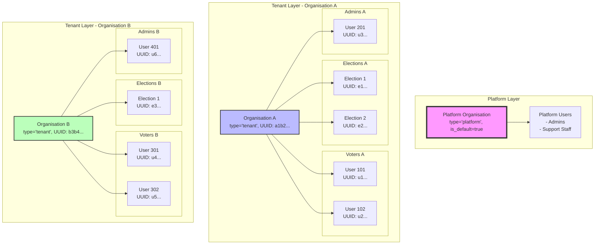
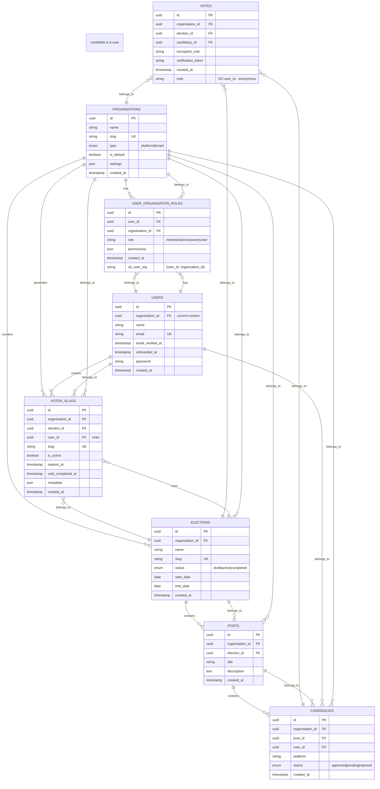
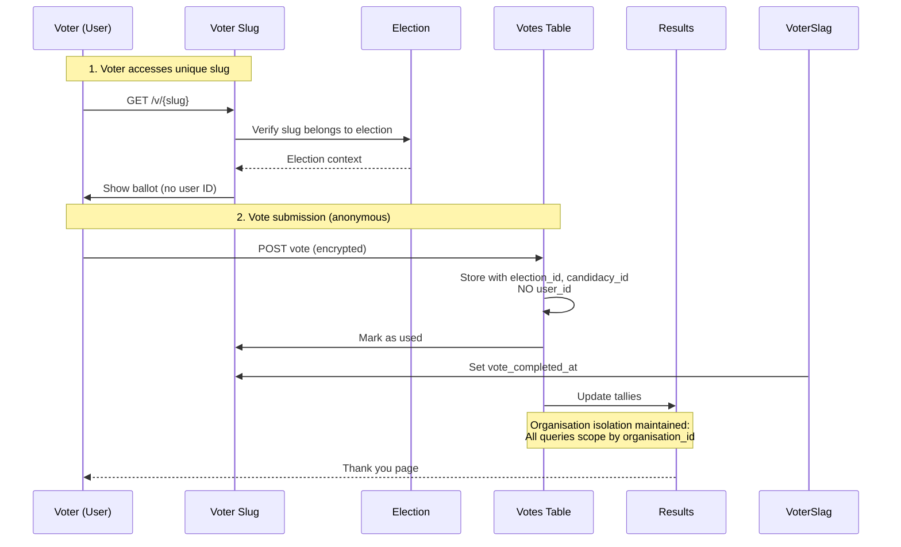

# 📊 **MERMAID DIAGRAMS: UUID Multi-Tenancy Architecture**

## **Complete Visual Guide to Organisation, Election & Voter Isolation**

---

## **1. HIGH-LEVEL ARCHITECTURE OVERVIEW**



---

## **2. DATABASE SCHEMA - COMPLETE ENTITY RELATIONSHIP**



---

## **3. ORGANISATION ISOLATION - PIVOT TABLE SOURCE OF TRUTH**

```mermaid
graph TD
    subgraph "Users Table (Global)"
        U1[User: alice@a.com<br/>UUID: u_a1b2]
        U2[User: bob@a.com<br/>UUID: u_b3c4]
        U3[User: carol@b.com<br/>UUID: u_c5d6]
        U4[User: dave@b.com<br/>UUID: u_d7e8]
        U5[User: platform@pd.com<br/>UUID: u_p9f0]
    end
    
    subgraph "Pivot Table - user_organisation_roles (Source of Truth)"
        P1[alice → Org A<br/>role: admin]
        P2[bob → Org A<br/>role: voter]
        P3[carol → Org B<br/>role: admin]
        P4[dave → Org B<br/>role: voter]
        P5[alice → Platform<br/>role: member]
        P6[bob → Platform<br/>role: member]
        P7[carol → Platform<br/>role: member]
        P8[dave → Platform<br/>role: member]
        P9[platform → Platform<br/>role: super-admin]
    end
    
    subgraph "Organisations"
        OrgA[Org A<br/>UUID: a1b2c3]
        OrgB[Org B<br/>UUID: b4c5d6]
        Platform[Platform<br/>UUID: p1l2a3]
    end
    
    subgraph "Current Context (users.organisation_id)"
        C1[alice → Org A]
        C2[bob → Org A]
        C3[carol → Org B]
        C4[dave → Org B]
        C5[platform → Platform]
    end
    
    U1 --> P1
    U1 --> P5
    U2 --> P2
    U2 --> P6
    U3 --> P3
    U3 --> P7
    U4 --> P4
    U4 --> P8
    U5 --> P9
    
    P1 --> OrgA
    P2 --> OrgA
    P3 --> OrgB
    P4 --> OrgB
    P5 --> Platform
    P6 --> Platform
    P7 --> Platform
    P8 --> Platform
    P9 --> Platform
    
    C1 --> OrgA
    C2 --> OrgA
    C3 --> OrgB
    C4 --> OrgB
    C5 --> Platform
    
    style P1 fill:#f96,stroke:#333
    style P2 fill:#f96,stroke:#333
    style P3 fill:#9cf,stroke:#333
    style P4 fill:#9cf,stroke:#333
    style P5 fill:#f9f,stroke:#333
    style P6 fill:#f9f,stroke:#333
    style P7 fill:#f9f,stroke:#333
    style P8 fill:#f9f,stroke:#333
    style P9 fill:#f9f,stroke:#333
```



---

## **4. ELECTION ISOLATION WITHIN ORGANISATIONS**

```mermaid
graph TB
    subgraph "Organisation A"
        direction TB
        OrgA[Organisation A<br/>UUID: a1b2c3]
        
        subgraph "Election A1 - 2024"
            ElecA1[Election ID: e1a2<br/>status: active]
            PostsA1[Posts<br/>- President<br/>- Secretary]
            CandsA1[Candidates<br/>- John (user_101)<br/>- Jane (user_102)]
        end
        
        subgraph "Election A2 - 2025"
            ElecA2[Election ID: e3b4<br/>status: draft]
            PostsA2[Posts<br/>- Treasurer]
            CandsA2[Candidates<br/>- Bob (user_103)]
        end
    end
    
    subgraph "Organisation B"
        direction TB
        OrgB[Organisation B<br/>UUID: b4c5d6]
        
        subgraph "Election B1 - 2024"
            ElecB1[Election ID: e5c6<br/>status: active]
            PostsB1[Posts<br/>- Chairperson]
            CandsB1[Candidates<br/>- Carol (user_201)<br/>- Dave (user_202)]
        end
    end
    
    subgraph "Global Users"
        U101[User 101<br/>UUID: u101]
        U102[User 102<br/>UUID: u102]
        U103[User 103<br/>UUID: u103]
        U201[User 201<br/>UUID: u201]
        U202[User 202<br/>UUID: u202]
    end
    
    U101 --> CandsA1
    U102 --> CandsA1
    U103 --> CandsA2
    U201 --> CandsB1
    U202 --> CandsB1
    
    ElecA1 --> PostsA1
    PostsA1 --> CandsA1
    
    ElecA2 --> PostsA2
    PostsA2 --> CandsA2
    
    ElecB1 --> PostsB1
    PostsB1 --> CandsB1
    
    OrgA --> ElecA1
    OrgA --> ElecA2
    OrgB --> ElecB1
    
    style ElecA1 fill:#f96,stroke:#333
    style ElecA2 fill:#ff9,stroke:#333
    style ElecB1 fill:#9cf,stroke:#333
    style OrgA fill:#bbf,stroke:#333
    style OrgB fill:#bfb,stroke:#333
```

---

## **5. VOTER ISOLATION - SINGLE USER TABLE WITH PIVOT MEMBERSHIP**

```mermaid
graph TB
    subgraph "Single Source of Truth: Users Table"
        U1[User: alice@orga.com<br/>UUID: u_a1b2]
        U2[User: bob@orga.com<br/>UUID: u_b3c4]
        U3[User: carol@orgb.com<br/>UUID: u_c5d6]
        U4[User: dave@orgb.com<br/>UUID: u_d7e8]
        U5[User: eve@both.com<br/>UUID: u_e9f0]
    end
    
    subgraph "Organisation A"
        OrgA[Organisation A<br/>UUID: a1b2c3]
        VotersA[Voters in A<br/>- alice (voter)<br/>- bob (voter)<br/>- eve (admin)]
        
        subgraph "Election A1 - Active"
            SlugA1[Voter Slug A1<br/>for alice]
            SlugA2[Voter Slug A2<br/>for bob]
            SlugA3[Voter Slug A3<br/>for eve]
        end
    end
    
    subgraph "Organisation B"
        OrgB[Organisation B<br/>UUID: b4c5d6]
        VotersB[Voters in B<br/>- carol (voter)<br/>- dave (voter)<br/>- eve (voter)]
        
        subgraph "Election B1 - Active"
            SlugB1[Voter Slug B1<br/>for carol]
            SlugB2[Voter Slug B2<br/>for dave]
            SlugB3[Voter Slug B3<br/>for eve]
        end
    end
    
    subgraph "Pivot Table - user_organisation_roles"
        P1[alice → Org A<br/>role: voter]
        P2[bob → Org A<br/>role: voter]
        P3[carol → Org B<br/>role: voter]
        P4[dave → Org B<br/>role: voter]
        P5[eve → Org A<br/>role: admin]
        P6[eve → Org B<br/>role: voter]
        P7[All → Platform<br/>role: member]
    end
    
    U1 --> P1
    U2 --> P2
    U3 --> P3
    U4 --> P4
    U5 --> P5
    U5 --> P6
    
    P1 --> OrgA
    P2 --> OrgA
    P5 --> OrgA
    P3 --> OrgB
    P4 --> OrgB
    P6 --> OrgB
    
    OrgA --> VotersA
    OrgB --> VotersB
    
    VotersA --> SlugA1
    VotersA --> SlugA2
    VotersA --> SlugA3
    
    VotersB --> SlugB1
    VotersB --> SlugB2
    VotersB --> SlugB3
    
    style U1 fill:#f96,stroke:#333
    style U2 fill:#f96,stroke:#333
    style U3 fill:#9cf,stroke:#333
    style U4 fill:#9cf,stroke:#333
    style U5 fill:#f9f,stroke:#333
    style P1 fill:#f96,stroke:#333
    style P2 fill:#f96,stroke:#333
    style P3 fill:#9cf,stroke:#333
    style P4 fill:#9cf,stroke:#333
    style P5 fill:#f9f,stroke:#333
    style P6 fill:#f9f,stroke:#333
```

---

## **6. VOTING FLOW - ANONYMOUS VOTES WITH ORGANISATION ISOLATION**



---

## **7. DATA ISOLATION - QUERY SCOPING VISUALIZATION**

```mermaid
graph LR
    subgraph "Database"
        direction TB
        AllOrgs[All Organisations]
        
        subgraph "Org A Data"
            OrgA_Users[Users in A<br/>via pivot]
            OrgA_Elections[Elections<br/>org_id = A]
            OrgA_Votes[Votes<br/>org_id = A]
            OrgA_Slugs[Voter Slugs<br/>org_id = A]
        end
        
        subgraph "Org B Data"
            OrgB_Users[Users in B<br/>via pivot]
            OrgB_Elections[Elections<br/>org_id = B]
            OrgB_Votes[Votes<br/>org_id = B]
            OrgB_Slugs[Voter Slugs<br/>org_id = B]
        end
    end
    
    subgraph "Application Layer"
        TenantContext[TenantContext<br/>Current: Org A]
        
        subgraph "Org A Request"
            QueryA1[Election::where('org_id', context.id)]
            QueryA2[Vote::where('org_id', context.id)]
            QueryA3[User::find()->belongsToOrganisation()]
        end
        
        subgraph "Org B Request - BLOCKED"
            QueryB1[Election::where('org_id', B)] 
            QueryB2[403 Forbidden]
        end
    end
    
    UserA[User from Org A] --> TenantContext
    TenantContext --> QueryA1
    TenantContext --> QueryA2
    TenantContext --> QueryA3
    
    QueryA1 -.-> OrgA_Elections
    QueryA2 -.-> OrgA_Votes
    QueryA3 -.-> OrgA_Users
    
    UserB[User from Org B] -.-x QueryB1
    QueryB1 -.-> QueryB2
    
    style OrgA_Users fill:#f96,stroke:#333
    style OrgA_Elections fill:#f96,stroke:#333
    style OrgA_Votes fill:#f96,stroke:#333
    style OrgB_Users fill:#9cf,stroke:#333
    style OrgB_Elections fill:#9cf,stroke:#333
    style OrgB_Votes fill:#9cf,stroke:#333
    style QueryB2 fill:#f00,stroke:#333,color:#fff
```

---

## **8. COMPLETE AUTHENTICATION & AUTHORIZATION FLOW**

```mermaid
graph TD
    Start[User Login] --> Auth{Authenticated?}
    Auth -->|No| Login[Login Form]
    Auth -->|Yes| Verified{Email Verified?}
    
    Verified -->|No| Verify[Send to /verify-email]
    Verified -->|Yes| DashboardResolver[DashboardResolver]
    
    DashboardResolver --> Priority1{Active Voting?}
    Priority1 -->|Yes| Voting[Voting Portal]
    Priority1 -->|No| Priority2{Active Election?}
    
    Priority2 -->|Yes| Election[Election Dashboard]
    Priority2 -->|No| PlatformCheck{In Platform?}
    
    PlatformCheck -->|Yes| Onboarded{Onboarded?}
    Onboarded -->|No| Welcome[/dashboard/welcome]
    Onboarded -->|Yes| MainDash[/dashboard]
    
    PlatformCheck -->|No| OrgDash[Organisation Dashboard]
    
    OrgDash --> Middleware[EnsureOrganisationMember Middleware]
    Middleware --> PivotCheck{Pivot exists?}
    PivotCheck -->|No| Forbidden[403 Forbidden]
    PivotCheck -->|Yes| Access[Grant Access]
    
    style DashboardResolver fill:#f9f,stroke:#333,stroke-width:2px
    style Forbidden fill:#f00,stroke:#333,color:#fff
    style Middleware fill:#bbf,stroke:#333
```

---

## **9. USER JOURNEY: FROM REGISTRATION TO OWN ORGANISATION**

```mermaid
graph LR
    subgraph "Phase 1: Registration"
        A[Register] --> B[Create User<br/>org_id = platform UUID]
        B --> C[Create Pivot<br/>platform, role=member]
        C --> D[Set TenantContext<br/>to platform]
        D --> E[Send to /verify-email]
    end
    
    subgraph "Phase 2: Demo Mode"
        E --> F[Verify Email]
        F --> G[Login → DashboardResolver]
        G --> H[Priority 4a: Not Onboarded]
        H --> I[Welcome Page /dashboard/welcome]
        I --> J[Set onboarded_at = now()]
    end
    
    subgraph "Phase 3: Create Organisation"
        J --> K[Click "Create Organisation"]
        K --> L[POST /organisations]
        L --> M[Create tenant org<br/>type='tenant']
        M --> N[Create pivot<br/>new org, role=owner]
        N --> O[Switch current org<br/>user.org_id = new org UUID]
        O --> P[Update TenantContext]
    end
    
    subgraph "Phase 4: Own Organisation"
        P --> Q[Organisation Dashboard]
        Q --> R[Create Elections]
        R --> S[Add Voters via pivot]
        S --> T[Run Elections]
    end
    
    style A fill:#f96,stroke:#333
    style M fill:#9cf,stroke:#333
    style N fill:#9cf,stroke:#333
    style O fill:#9cf,stroke:#333
    style Q fill:#bfb,stroke:#333
```

---

## **10. SECURITY BOUNDARIES - ISOLATION LAYERS**

```mermaid
graph TB
    subgraph "Layer 1: Database Constraints"
        FK1[Foreign Key: users.org_id → orgs.id]
        FK2[Foreign Key: all tables.org_id → orgs.id]
        Unique1[UNIQUE(user_id, org_id) in pivot]
        Constraint[Restrict delete if users exist]
    end
    
    subgraph "Layer 2: Model Scoping"
        Scope1[Election::where('org_id', context)]
        Scope2[Vote::where('org_id', context)]
        Scope3[User::organisations() relationship]
    end
    
    subgraph "Layer 3: Middleware"
        MW1[TenantMiddleware - sets context]
        MW2[EnsureOrganisationMember - checks pivot]
        MW3[403 if no pivot]
    end
    
    subgraph "Layer 4: Application Logic"
        Logic1[belongsToOrganisation() checks]
        Logic2[DashboardResolver priorities]
        Logic3[TenantContext service]
    end
    
    subgraph "Layer 5: Route Parameters"
        Route1[Routes bound to organisation slug]
        Route2[Route model binding with UUID]
    end
    
    User[User Request] --> MW1
    MW1 --> MW2
    MW2 --> Logic1
    Logic1 --> Scope1
    Scope1 --> FK1
    
    style FK1 fill:#f9f,stroke:#333
    style MW2 fill:#f96,stroke:#333
    style Logic1 fill:#9cf,stroke:#333
```

---

## **📋 KEY TAKEAWAYS FROM DIAGRAMS**

| Isolation Layer | Mechanism | Diagram Reference |
|-----------------|-----------|-------------------|
| **Database** | Foreign keys + UUIDs | #2, #10 |
| **Pivot Table** | `user_organisation_roles` as source of truth | #3 |
| **Query Scoping** | All queries include `organisation_id = ?` | #7 |
| **Middleware** | `EnsureOrganisationMember` checks pivot | #8 |
| **Application** | `belongsToOrganisation()` helper | #5 |
| **Voter Isolation** | Single user table, pivots determine access | #5 |
| **Election Isolation** | All election data scoped by org_id | #4 |
| **Vote Anonymity** | No user_id in votes table | #6 |

---

## **🔑 CRITICAL DESIGN PRINCIPLES VISUALIZED**

1. **Single User Table** - All users in one table, access controlled by pivots (Diagram #5)
2. **Pivot as Source of Truth** - `user_organisation_roles` determines membership (Diagram #3)
3. **UUID Foreign Keys** - All relationships use UUIDs, no integer assumptions (Diagram #2)
4. **Explicit Context** - TenantContext service passes org_id explicitly (Diagram #7)
5. **Multiple Memberships** - Users can belong to multiple orgs (Diagram #3, #5)
6. **Platform Fallback** - Every user has platform membership (Diagram #3)
7. **Anonymous Voting** - Votes stored without user_id (Diagram #6)
8. **Query Scoping** - Every query filtered by organisation_id (Diagram #7)