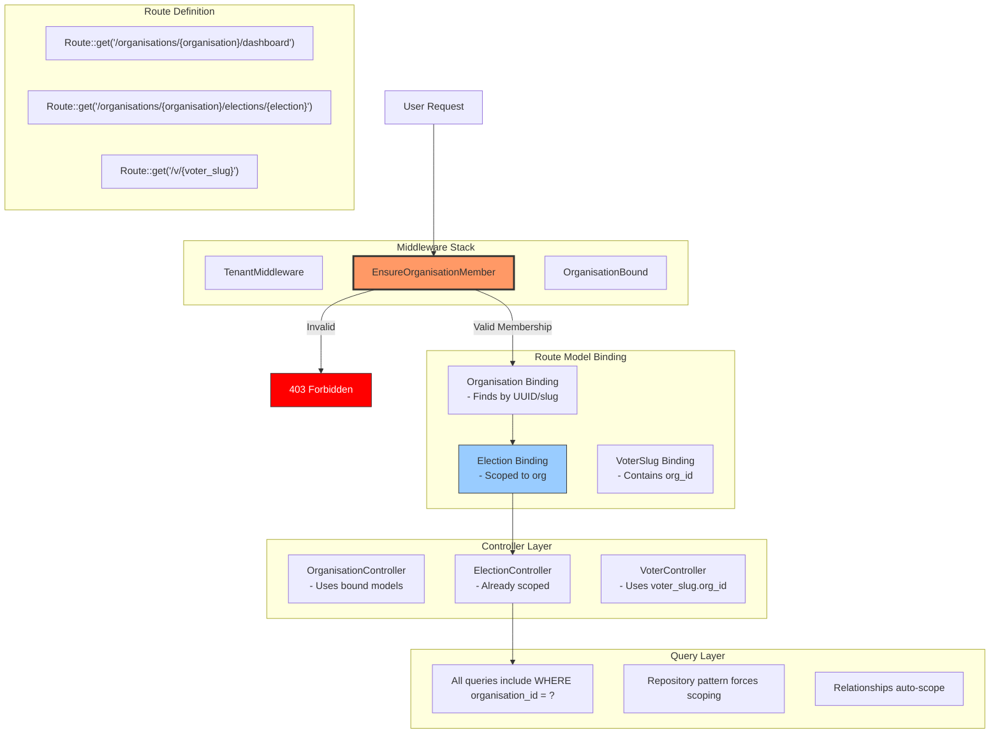

## ✅ **YES - Middleware is the CORRECT Layer for Page/Election Isolation**

### **The Responsibility Chain:**

| Layer | Responsibility | Who/What |
|-------|----------------|----------|
| **Database** | Data integrity (FKs, constraints) | Migrations |
| **Model** | Query scoping (repository pattern) | Eloquent scopes |
| **Middleware** | **Page/Route Access Control** | `EnsureOrganisationMember` |
| **Controller** | Business logic within org context | Controllers + TenantContext |
| **View** | UI rendering within org context | Blade/Inertia + org data |

---

## **🔒 THE THREE GUARDIANS OF ISOLATION**

```mermaid
graph TB
    subgraph "Guardian 1: Database Layer"
        DB1[Foreign Keys: org_id in EVERY table]
        DB2[UUID references prevent cross-org FK]
        DB3[Pivot table enforces membership]
    end
    
    subgraph "Guardian 2: Model Layer"
        M1[Global scopes where('org_id', context)]
        M2[Repository pattern with forced scoping]
        M3[Relationships always include org_id]
    end
    
    subgraph "Guardian 3: Middleware Layer"
        MW1[TenantMiddleware - sets context]
        MW2[EnsureOrganisationMember - CHECKS PIVOT]
        MW3[OrganisationBound - verifies route param]
    end
    
    Request[User Request] --> MW2
    MW2 -->|Pass| Controller[Controller]
    MW2 -->|Fail| 403[403 Forbidden]
    
    Controller --> M2
    M2 --> DB1
    
    style MW2 fill:#f96,stroke:#333,stroke-width:3px
    style 403 fill:#f00,stroke:#333,color:#fff
```

---

## **🛡️ MIDDLEWARE: The Gatekeeper for Page Access**

### **1. The Core Isolation Middleware**

```php
// app/Http/Middleware/EnsureOrganisationMember.php

namespace App\Http\Middleware;

use App\Models\Organisation;
use App\Services\TenantContext;
use Closure;
use Illuminate\Http\Request;
use Illuminate\Support\Facades\Auth;
use Illuminate\Support\Facades\Log;

class EnsureOrganisationMember
{
    public function __construct(
        private TenantContext $tenantContext
    ) {}

    public function handle(Request $request, Closure $next)
    {
        $user = Auth::user();
        
        if (!$user) {
            return redirect()->route('login');
        }

        // Extract organisation from route
        $organisation = $this->getOrganisationFromRoute($request);
        
        if (!$organisation) {
            // No organisation in route - probably platform page
            return $next($request);
        }

        // CRITICAL CHECK: Does user belong to this organisation?
        if (!$user->belongsToOrganisation($organisation->id)) {
            Log::warning('🚫 CROSS-ORG ACCESS ATTEMPT', [
                'user_id' => $user->id,
                'user_email' => $user->email,
                'attempted_org' => $organisation->name,
                'attempted_org_id' => $organisation->id,
                'user_orgs' => $user->organisations()->pluck('name')->toArray(),
                'url' => $request->fullUrl(),
                'ip' => $request->ip()
            ]);
            
            abort(403, 'You do not have access to this organisation');
        }

        // Set the organisation in context for this request
        $this->tenantContext->setContext($user, $organisation);
        
        // Also set in request for later use
        $request->merge(['current_organisation' => $organisation]);

        return $next($request);
    }

    private function getOrganisationFromRoute(Request $request): ?Organisation
    {
        // Check route parameters in priority order
        $route = $request->route();
        
        if (!$route) {
            return null;
        }

        // Try different parameter names
        $candidates = [
            $route->parameter('organisation'),
            $route->parameter('organisation_slug'),
            $route->parameter('org'),
            $route->parameter('slug')
        ];

        foreach ($candidates as $candidate) {
            if ($candidate instanceof Organisation) {
                return $candidate;
            }
            
            if (is_string($candidate)) {
                $org = Organisation::where('slug', $candidate)->first();
                if ($org) {
                    return $org;
                }
            }
        }

        return null;
    }
}
```

---

### **2. Route Binding with UUIDs**

```php
// app/Providers/RouteServiceProvider.php

public function boot(): void
{
    parent::boot();

    // Explicit route model binding with UUID
    Route::bind('organisation', function ($value) {
        return Organisation::where('id', $value)
            ->orWhere('slug', $value)
            ->firstOrFail();
    });

    Route::bind('election', function ($value, $route) {
        // Get organisation from route
        $organisation = $route->parameter('organisation');
        
        if (!$organisation) {
            abort(404);
        }

        // SCOPE ELECTION TO ORGANISATION
        return Election::where('organisation_id', $organisation->id)
            ->where(function($query) use ($value) {
                $query->where('id', $value)
                      ->orWhere('slug', $value);
            })
            ->firstOrFail();
    });

    Route::bind('voter_slug', function ($value) {
        return VoterSlug::where('slug', $value)
            ->where('expires_at', '>', now())
            ->firstOrFail();
    });
}
```

---

## **📋 COMPLETE ISOLATION ARCHITECTURE**



---

## **🔐 MIDDLEWARE FOR DIFFERENT PAGE TYPES**

### **1. Organisation-Protected Routes**

```php
// routes/web.php - Organisation-scoped routes
Route::prefix('organisations/{organisation}')
    ->middleware(['auth', 'ensure.organisation.member'])
    ->group(function () {
        
        // Dashboard
        Route::get('/dashboard', [OrganisationController::class, 'dashboard'])
            ->name('organisations.dashboard');
        
        // Elections
        Route::get('/elections', [ElectionController::class, 'index'])
            ->name('elections.index');
        
        Route::get('/elections/{election}', [ElectionController::class, 'show'])
            ->name('elections.show');
        
        // Posts
        Route::get('/posts', [PostController::class, 'index'])
            ->name('posts.index');
        
        // Voters
        Route::get('/voters', [VoterController::class, 'index'])
            ->name('voters.index');
    });
```

### **2. Public Voting Routes (Special Case)**

```php
// Public voting routes - uses voter_slug for isolation
Route::get('/v/{voter_slug}', [VotingController::class, 'portal'])
    ->name('voting.portal')
    ->middleware(['ensure.voter.slug.valid']);

// Custom middleware for voter slugs
class EnsureValidVoterSlug
{
    public function handle($request, $next)
    {
        $voterSlug = $request->route('voter_slug');
        
        // Check if slug belongs to an active election
        $election = Election::whereHas('voterSlugs', function($q) use ($voterSlug) {
            $q->where('slug', $voterSlug)
              ->where('expires_at', '>', now())
              ->whereNull('vote_completed_at');
        })->first();
        
        if (!$election) {
            abort(404);
        }
        
        // Set context for this request
        $request->merge([
            'current_election' => $election,
            'current_organisation' => $election->organisation
        ]);
        
        return $next($request);
    }
}
```

### **3. Platform Routes (No Organisation)**

```php
// Platform routes - no organisation in URL
Route::middleware(['auth'])->group(function () {
    Route::get('/dashboard', [DashboardController::class, 'index'])
        ->name('dashboard');
    
    Route::get('/dashboard/welcome', [WelcomeController::class, 'index'])
        ->name('dashboard.welcome');
});
```

---

## **🛡️ COMPREHENSIVE MIDDLEWARE SOLUTION**

```php
// app/Http/Kernel.php (Laravel 10) or bootstrap/app.php (Laravel 11)

// Register middleware aliases
'middleware' => [
    'ensure.organisation.member' => \App\Http\Middleware\EnsureOrganisationMember::class,
    'ensure.voter.slug.valid' => \App\Http\Middleware\EnsureValidVoterSlug::class,
    'tenant.context' => \App\Http\Middleware\TenantMiddleware::class,
    'election.access' => \App\Http\Middleware\EnsureElectionAccess::class,
];

// Or in Laravel 11 bootstrap/app.php:
->withMiddleware(function (Middleware $middleware) {
    $middleware->alias([
        'ensure.organisation.member' => EnsureOrganisationMember::class,
        'ensure.voter.slug.valid' => EnsureValidVoterSlug::class,
        'tenant.context' => TenantMiddleware::class,
        'election.access' => EnsureElectionAccess::class,
    ]);
})
```

---

## **📊 ISOLATION CHECKLIST**

| Page Type | Route Pattern | Middleware | What It Checks |
|-----------|---------------|------------|----------------|
| **Organisation Dashboard** | `/organisations/{organisation}/dashboard` | `ensure.organisation.member` | User has pivot for this org |
| **Election Page** | `/organisations/{organisation}/elections/{election}` | `ensure.organisation.member` + route binding | Election belongs to org + user has org access |
| **Post Page** | `/organisations/{organisation}/posts/{post}` | `ensure.organisation.member` + route binding | Post belongs to org |
| **Voter Management** | `/organisations/{organisation}/voters` | `ensure.organisation.member` | User is admin in this org |
| **Voting Portal** | `/v/{voter_slug}` | `ensure.voter.slug.valid` | Slug exists, not expired, not used |
| **Platform Pages** | `/dashboard` | `auth` | User authenticated (any) |
| **Welcome Page** | `/dashboard/welcome` | `auth` | User is in platform context |

---

## **🔍 TESTING ISOLATION**

```php
// tests/Feature/OrganisationIsolationTest.php

/** @test */
public function user_cannot_access_other_organisations_elections()
{
    // Given: Two organisations with elections
    $orgA = Organisation::factory()->tenant()->create();
    $orgB = Organisation::factory()->tenant()->create();
    
    $electionInB = Election::factory()->forOrganisation($orgB)->create();
    
    // And: A user who only belongs to orgA
    $user = User::factory()->forOrganisation($orgA)->create();
    $user->organisations()->attach($orgA->id, ['role' => 'member']);
    
    // When: User tries to access orgB's election
    $response = $this->actingAs($user)
        ->get(route('elections.show', [
            'organisation' => $orgB->slug,
            'election' => $electionInB->slug
        ]));
    
    // Then: They should be forbidden
    $response->assertStatus(403);
    
    // And: Log should show the attempt
    Log::shouldHaveReceived('warning')
        ->withArgs(fn($message) => str_contains($message, 'CROSS-ORG ACCESS ATTEMPT'));
}

/** @test */
public function user_can_access_own_organisations_elections()
{
    // Given: Organisation with election
    $org = Organisation::factory()->tenant()->create();
    $election = Election::factory()->forOrganisation($org)->create();
    
    // And: User who belongs to this org
    $user = User::factory()->forOrganisation($org)->create();
    $user->organisations()->attach($org->id, ['role' => 'member']);
    
    // When: User accesses their org's election
    $response = $this->actingAs($user)
        ->get(route('elections.show', [
            'organisation' => $org->slug,
            'election' => $election->slug
        ]));
    
    // Then: They should be allowed
    $response->assertStatus(200);
}

/** @test */
public function voter_slug_is_scoped_to_correct_organisation()
{
    // Given: Two organisations with active elections
    $orgA = Organisation::factory()->tenant()->create();
    $orgB = Organisation::factory()->tenant()->create();
    
    $electionA = Election::factory()->forOrganisation($orgA)
        ->active()->create();
    $electionB = Election::factory()->forOrganisation($orgB)
        ->active()->create();
    
    $voterSlugA = VoterSlug::factory()->forElection($electionA)
        ->create(['slug' => 'slug-for-org-a']);
    
    $voterSlugB = VoterSlug::factory()->forElection($electionB)
        ->create(['slug' => 'slug-for-org-b']);
    
    // When: Accessing voter slug from orgA
    $response = $this->get(route('voting.portal', $voterSlugA->slug));
    
    // Then: Should see orgA's election context
    $response->assertViewHas('election', function($viewElection) use ($electionA) {
        return $viewElection->id === $electionA->id;
    });
    
    // And: Should not have access to orgB's data
    $this->assertDatabaseMissing('votes', [
        'election_id' => $electionB->id,
        'voter_slug_id' => $voterSlugA->id
    ]);
}
```

---

## **✅ SUMMARY: WHO IS RESPONSIBLE FOR WHAT**

| Responsibility | Primary Owner | Secondary | Implementation |
|----------------|---------------|-----------|----------------|
| **Page/Route Access** | **Middleware** | Route Binding | `EnsureOrganisationMember` checks pivot |
| **Data Query Scoping** | **Repositories/Models** | Database | All queries include `org_id = ?` |
| **URL Parameter Isolation** | **Route Model Binding** | Middleware | Bindings scope to org context |
| **Cross-Org Prevention** | **Middleware + FK** | Logging | 403 + audit log |
| **Voter Slug Isolation** | **Custom Middleware** | Route Binding | Validate slug belongs to active election |
| **Election Access** | **Route Binding** | Middleware | Election binding scoped to org |
| **Anonymous Voting** | **Database Design** | Controller | No user_id in votes table |
| **Audit Trail** | **Middleware** | Logging | Log all cross-org attempts |

---

## **🔑 THE GOLDEN RULE**

**Every request that includes an organisation identifier MUST pass through middleware that checks the user's pivot record for that organisation.**

```php
// In EnsureOrganisationMember.php - THE CRITICAL CHECK
if (!$user->belongsToOrganisation($organisation->id)) {
    abort(403); // STOP! User doesn't belong here
}
```

This one line, applied consistently, guarantees complete organisation isolation across all pages, elections, and data.