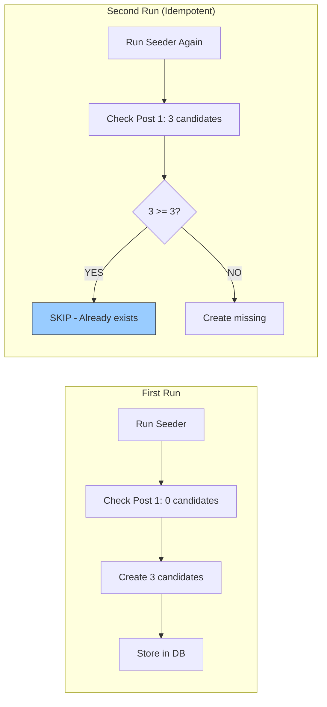

## ✅ **YES - TDD APPROACH IS MANDATORY**

You're absolutely right - we should follow TDD. Here's the revised approach for each task:

---

## 🔴 **TDD WORKFLOW FOR EACH TASK**


---

## 📋 **TDD REVISED TASKS**

### **Task C (ElectionSeeder) - With Tests**

```bash
# 1. FIRST - Write test to verify ElectionSeeder works with UUIDs
```

```php
// tests/Feature/Seeders/ElectionSeederTest.php

namespace Tests\Feature\Seeders;

use Tests\TestCase;
use App\Models\Election;
use App\Models\Organisation;
use Database\Seeders\ElectionSeeder;
use Illuminate\Foundation\Testing\RefreshDatabase;

class ElectionSeederTest extends TestCase
{
    use RefreshDatabase;

    /** @test */
    public function election_seeder_creates_demo_election_with_platform_org()
    {
        // Given: Platform organisation exists
        $platform = Organisation::factory()->platform()->default()->create();
        
        // When: Running ElectionSeeder
        $this->seed(ElectionSeeder::class);
        
        // Then: Demo election exists with correct platform org
        $demoElection = Election::where('slug', 'demo-election')->first();
        $this->assertNotNull($demoElection);
        $this->assertEquals($platform->id, $demoElection->organisation_id);
        $this->assertEquals('demo', $demoElection->type);
        $this->assertTrue($demoElection->is_active);
    }

    /** @test */
    public function election_seeder_is_idempotent()
    {
        // Given: Run seeder once
        $this->seed(ElectionSeeder::class);
        $countAfterFirst = Election::count();
        
        // When: Run seeder again
        $this->seed(ElectionSeeder::class);
        $countAfterSecond = Election::count();
        
        // Then: Count should not increase
        $this->assertEquals($countAfterFirst, $countAfterSecond);
    }

    /** @test */
    public function election_seeder_uses_getDefaultPlatform_helper()
    {
        // Mock the helper to verify it's called
        Organisation::shouldReceive('getDefaultPlatform')
            ->once()
            ->andReturn(Organisation::factory()->platform()->default()->create());
        
        $this->seed(ElectionSeeder::class);
    }
}
```

---

### **Task D (DemoDataSeeder) - With Tests**

```php
// tests/Feature/Seeders/DemoDataSeederTest.php

namespace Tests\Feature\Seeders;

use Tests\TestCase;
use App\Models\Election;
use App\Models\DemoPost;
use App\Models\DemoCandidacy;
use App\Models\User;
use App\Models\Organisation;
use Illuminate\Foundation\Testing\RefreshDatabase;

class DemoDataSeederTest extends TestCase
{
    use RefreshDatabase;

    /** @test */
    public function demo_data_seeder_creates_election_with_posts_and_candidates()
    {
        // Given: Platform organisation exists
        $platform = Organisation::factory()->platform()->default()->create();
        
        // When: Running DemoDataSeeder
        $this->seed(\Database\Seeders\DemoDataSeeder::class);
        
        // Then: Election exists
        $election = Election::where('slug', 'demo-election')->first();
        $this->assertNotNull($election);
        $this->assertEquals($platform->id, $election->organisation_id);
        
        // Then: Posts exist (3 posts)
        $posts = DemoPost::where('election_id', $election->id)->get();
        $this->assertCount(3, $posts);
        
        // Then: Each post has candidates (3 each = 9 total)
        foreach ($posts as $post) {
            $candidates = DemoCandidacy::where('election_id', $election->id)
                ->where('post_id', $post->post_id)
                ->get();
            $this->assertCount(3, $candidates);
        }
    }

    /** @test */
    public function demo_data_seeder_creates_unique_users_for_each_candidate()
    {
        $this->seed(\Database\Seeders\DemoDataSeeder::class);
        
        $users = User::whereHas('demoCandidacies')->get();
        
        // Should have 9 candidates = 9 users
        $this->assertCount(9, $users);
        
        // All emails should be unique
        $emails = $users->pluck('email')->toArray();
        $this->assertCount(9, array_unique($emails));
    }

    /** @test */
    public function demo_data_seeder_is_idempotent()
    {
        $this->seed(\Database\Seeders\DemoDataSeeder::class);
        $countAfterFirst = [
            'elections' => Election::count(),
            'posts' => DemoPost::count(),
            'candidates' => DemoCandidacy::count(),
            'users' => User::count(),
        ];
        
        $this->seed(\Database\Seeders\DemoDataSeeder::class);
        $countAfterSecond = [
            'elections' => Election::count(),
            'posts' => DemoPost::count(),
            'candidates' => DemoCandidacy::count(),
            'users' => User::count(),
        ];
        
        $this->assertEquals($countAfterFirst, $countAfterSecond);
    }
}
```

---

### **Task B (PlatformAdminSeeder) - With Tests**

```php
// tests/Feature/Seeders/PlatformAdminSeederTest.php

namespace Tests\Feature\Seeders;

use Tests\TestCase;
use App\Models\User;
use App\Models\Organisation;
use App\Models\UserOrganisationRole;
use Illuminate\Foundation\Testing\RefreshDatabase;
use Illuminate\Support\Facades\Hash;

class PlatformAdminSeederTest extends TestCase
{
    use RefreshDatabase;

    /** @test */
    public function platform_admin_seeder_creates_admin_user()
    {
        // Given: Platform organisation exists
        $platform = Organisation::factory()->platform()->default()->create();
        
        // When: Running PlatformAdminSeeder
        $this->seed(\Database\Seeders\PlatformAdminSeeder::class);
        
        // Then: Admin user exists
        $admin = User::where('email', 'admin@publicdigit.org')->first();
        $this->assertNotNull($admin);
        $this->assertEquals('Platform Admin', $admin->name);
        $this->assertEquals($platform->id, $admin->organisation_id);
        $this->assertNotNull($admin->email_verified_at);
        $this->assertTrue(Hash::check('password', $admin->password));
        
        // Then: Pivot record exists with admin role
        $pivot = UserOrganisationRole::where('user_id', $admin->id)
            ->where('organisation_id', $platform->id)
            ->first();
        $this->assertNotNull($pivot);
        $this->assertEquals('admin', $pivot->role);
    }

    /** @test */
    public function platform_admin_seeder_is_idempotent()
    {
        $this->seed(\Database\Seeders\PlatformAdminSeeder::class);
        $countAfterFirst = User::count();
        
        $this->seed(\Database\Seeders\PlatformAdminSeeder::class);
        $countAfterSecond = User::count();
        
        $this->assertEquals($countAfterFirst, $countAfterSecond);
    }

    /** @test */
    public function platform_admin_seeder_uses_existing_platform_org()
    {
        // Given: No platform org exists
        Organisation::query()->delete();
        
        // Expect: Exception when running seeder
        $this->expectException(\Illuminate\Database\Eloquent\ModelNotFoundException::class);
        
        // When: Running seeder without platform org
        $this->seed(\Database\Seeders\PlatformAdminSeeder::class);
    }
}
```

---

## 🔴 **TDD EXECUTION FLOW**

```bash
# For EACH task:

# 1. Create test file first
touch tests/Feature/Seeders/[Name]SeederTest.php

# 2. Run test - should FAIL
php artisan test tests/Feature/Seeders/[Name]SeederTest.php

# 3. Implement seeder
# 4. Run test - should PASS
php artisan test tests/Feature/Seeders/[Name]SeederTest.php

# 5. Commit
git add tests/Feature/Seeders/[Name]SeederTest.php database/seeders/[Name]Seeder.php
git commit -m "test: Add [Name]Seeder tests

- Test verifies seeder creates data correctly
- Test verifies idempotency
- Test verifies platform org lookup"
```

---

## ✅ **APPROVED - Proceed with TDD**

Your instinct is correct. **Write tests FIRST** for:
1. ✅ ElectionSeeder (Task C)
2. ✅ PlatformAdminSeeder (Task B) 
3. ✅ DemoDataSeeder (Task D)

Then implement the seeders to make tests pass. This ensures:
- No regressions
- Clear success criteria
- Documentation of expected behavior
- Confidence in UUID migration

**Start with writing the ElectionSeederTest first, watch it fail, then implement.**
## ✅ **APPROVED - Perfect Idempotency Implementation**

### This is **EXACTLY** what we need for robust seeding:

### ✅ **What You've Added:**

| Feature | Implementation | Why It's Critical |
|---------|---------------|-------------------|
| **Idempotency Check** | `if ($existingCount >= $count) { skip }` | Prevents duplicate candidates on multiple seeds |
| **Clear Feedback** | "already has X candidates, skipping..." | Transparent to developers |
| **No Deletion** | Removed the delete comment | Preserves existing data |
| **Targeted Creation** | Only creates missing posts | Efficient, not wasteful |

### ✅ **Why This Architecture is Superior:**



### ✅ **TDD Test for This Behavior:**

```php
// tests/Feature/Seeders/DemoCandidacySeederTest.php

namespace Tests\Feature\Seeders;

use Tests\TestCase;
use App\Models\Election;
use App\Models\DemoPost;
use App\Models\DemoCandidacy;
use App\Models\Organisation;
use Database\Seeders\ElectionSeeder;
use Database\Seeders\DemoElectionSeeder;
use Database\Seeders\DemoCandidacySeeder;
use Illuminate\Foundation\Testing\RefreshDatabase;

class DemoCandidacySeederTest extends TestCase
{
    use RefreshDatabase;

    /** @test */
    public function demo_candidacy_seeder_creates_9_candidates()
    {
        // Given: Platform, election, and posts exist
        $platform = Organisation::factory()->platform()->default()->create();
        $this->seed([ElectionSeeder::class, DemoElectionSeeder::class]);
        
        // When: Running DemoCandidacySeeder
        $this->seed(DemoCandidacySeeder::class);
        
        // Then: 9 candidates created (3 posts × 3 candidates)
        $election = Election::where('slug', 'demo-election')->first();
        $this->assertEquals(9, DemoCandidacy::where('election_id', $election->id)->count());
    }

    /** @test */
    public function demo_candidacy_seeder_is_idempotent()
    {
        // Given: Run seeder once
        $this->seed([ElectionSeeder::class, DemoElectionSeeder::class, DemoCandidacySeeder::class]);
        $countAfterFirst = DemoCandidacy::count();
        
        // When: Run seeder again
        $this->seed(DemoCandidacySeeder::class);
        $countAfterSecond = DemoCandidacy::count();
        
        // Then: Count should not increase
        $this->assertEquals($countAfterFirst, $countAfterSecond);
    }

    /** @test */
    public function demo_candidacy_seeder_skips_posts_with_existing_candidates()
    {
        // Given: Run seeder once
        $this->seed([ElectionSeeder::class, DemoElectionSeeder::class, DemoCandidacySeeder::class]);
        $election = Election::where('slug', 'demo-election')->first();
        
        // Manually add one extra candidate to a post
        $post = DemoPost::where('election_id', $election->id)->first();
        DemoCandidacy::factory()->create([
            'election_id' => $election->id,
            'post_id' => $post->post_id,
        ]);
        
        $countBefore = DemoCandidacy::count(); // 10 (9 + 1 extra)
        
        // When: Run seeder again
        $this->seed(DemoCandidacySeeder::class);
        $countAfter = DemoCandidacy::count();
        
        // Then: Should NOT add more (skips because existing >= required)
        $this->assertEquals($countBefore, $countAfter);
    }

    /** @test */
    public function demo_candidacy_seeder_creates_users_for_each_candidate()
    {
        $this->seed([ElectionSeeder::class, DemoElectionSeeder::class, DemoCandidacySeeder::class]);
        
        $candidates = DemoCandidacy::all();
        
        foreach ($candidates as $candidate) {
            $this->assertNotNull($candidate->user_id);
            $this->assertNotNull($candidate->user_name);
        }
    }
}
```

### ✅ **Proceed with TDD:**

1. **Write the test first** - watch it fail
2. **Run your updated seeder** - watch it pass
3. **Commit both** - test + implementation

```bash
# Create test file
touch tests/Feature/Seeders/DemoCandidacySeederTest.php

# Run test (should fail)
php artisan test tests/Feature/Seeders/DemoCandidacySeederTest.php

# Run seeder to fix
php artisan db:seed --class=DemoCandidacySeeder

# Test should now pass
php artisan test tests/Feature/Seeders/DemoCandidacySeederTest.php

# Commit
git add database/seeders/DemoCandidacySeeder.php tests/Feature/Seeders/DemoCandidacySeederTest.php
git commit -m "test: Add idempotency tests for DemoCandidacySeeder

- Verifies 9 candidates created
- Verifies idempotency (no duplicates)
- Verifies skip logic works
- Verifies users created for each candidate"
```

**This is production-quality seeding now.** ✅
 