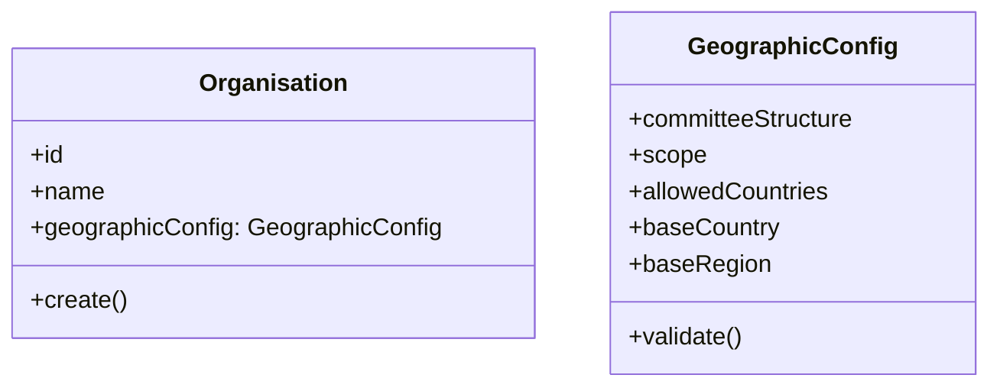
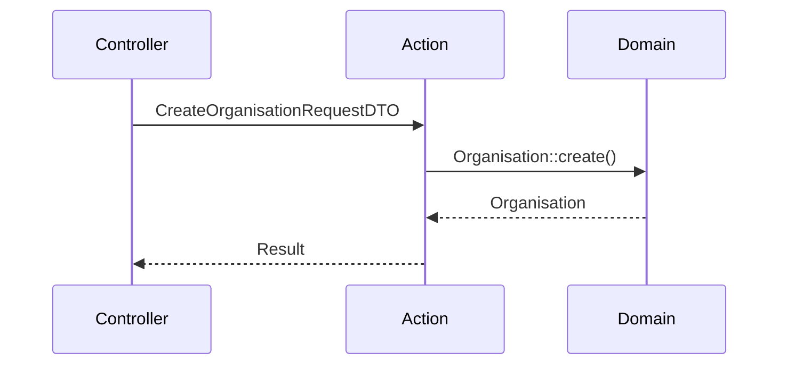
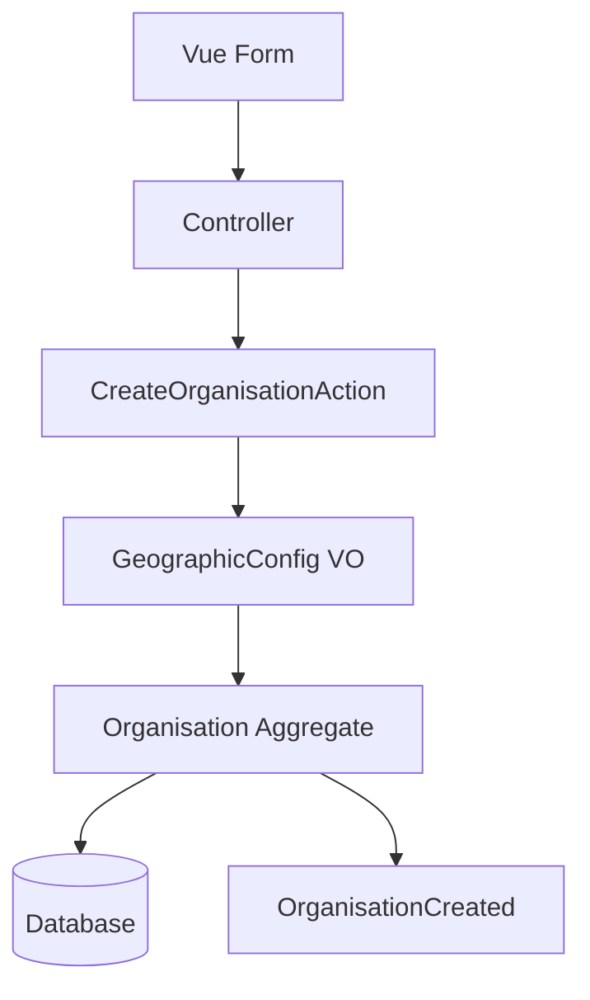

# Claude Code CLI Prompt: Extend Organisation Create Form with Geographic Scope

## Context

You have a working Organisation create form. Need to add geographic scope configuration to support:
- Worldwide organisations (continents → countries)
- Multi-country diaspora organisations (e.g., NRNA Germany with DE, AT, CH)
- Single country organisations (e.g., CDU Germany)
- Sub-country organisations (e.g., Bavaria region)

**Constraint:** Geographic scope is immutable after creation.

---

## Pre-Flight Checklist

```bash
# 1. Verify geography tables exist
php artisan tinker --execute="DB::table('countries')->count()"

# 2. Check if migration needed for organisations table
php artisan tinker --execute="Schema::hasColumn('organisations', 'geographic_scope')"

# 3. Confirm seeder has all countries
php artisan tinker --execute="DB::table('countries')->where('is_active', true)->count()"
# Expected: 190+ countries
```

---

## Phase 1: Database Migration (5 min)

```yaml
action: create_migration
name: add_geographic_scope_to_organisations
path: database/migrations/2026_05_04_000001_add_geographic_scope_to_organisations.php

content: |
  <?php
  
  use Illuminate\Database\Migrations\Migration;
  use Illuminate\Database\Schema\Blueprint;
  use Illuminate\Support\Facades\Schema;
  
  return new class extends Migration
  {
      public function up(): void
      {
          Schema::table('organisations', function (Blueprint $table) {
              // Geographic scope configuration
              $table->string('geographic_scope', 20)->default('single_country')
                  ->after('settings')
                  ->comment('worldwide, multi_country, single_country, sub_country');
              
              $table->json('allowed_countries')->nullable()
                  ->after('geographic_scope')
                  ->comment('For multi_country scope: ["DE", "AT", "CH"]');
              
              $table->json('allowed_continents')->nullable()
                  ->after('allowed_countries')
                  ->comment('For worldwide scope with restrictions: ["AS", "EU"]');
              
              $table->char('base_country_code', 2)->nullable()
                  ->after('allowed_continents')
                  ->comment('For single_country or sub_country scope');
              
              $table->unsignedBigInteger('base_region_id')->nullable()
                  ->after('base_country_code')
                  ->comment('For sub_country scope: region/state ID from geo_administrative_units');
              
              $table->boolean('geography_configured')->default(false)
                  ->after('base_region_id')
                  ->comment('Set to true after initial configuration');
          });
      }
  
      public function down(): void
      {
          Schema::table('organisations', function (Blueprint $table) {
              $table->dropColumn([
                  'geographic_scope',
                  'allowed_countries',
                  'allowed_continents',
                  'base_country_code',
                  'base_region_id',
                  'geography_configured',
              ]);
          });
      }
  };

action: run_command
command: php artisan migrate
expected: "Migrated: add_geographic_scope_to_organisations"
```

---

## Phase 2: Backend API for Geography Data (10 min)

```yaml
action: create_controller
path: app/Http/Controllers/Geography/OrganisationGeographyController.php

content: |
  <?php
  
  namespace App\Http\Controllers\Geography;
  
  use App\Http\Controllers\Controller;
  use App\Contexts\Geography\Domain\Models\Country;
  use App\Contexts\Geography\Domain\Models\GeoAdministrativeUnit;
  use Illuminate\Http\JsonResponse;
  use Illuminate\Http\Request;
  
  final class OrganisationGeographyController extends Controller
  {
      public function countries(): JsonResponse
      {
          $countries = Country::where('is_active', true)
              ->orderBy('name_en')
              ->get(['code', 'name_en', 'name_local', 'phone_code']);
          
          return response()->json([
              'data' => $countries->map(fn($c) => [
                  'value' => $c->code,
                  'label' => $c->name_en,
                  'flag' => $this->getFlagEmoji($c->code),
              ]),
          ]);
      }
      
      public function continents(): JsonResponse
      {
          $continents = GeoAdministrativeUnit::where('admin_level', 0)
              ->where('is_active', true)
              ->orderBy('name_local->en')
              ->get(['id', 'code', 'name_local']);
          
          return response()->json([
              'data' => $continents->map(fn($c) => [
                  'value' => $c->code,
                  'label' => $c->name_local['en'] ?? $c->code,
              ]),
          ]);
      }
      
      public function regionsByCountry(Request $request, string $countryCode): JsonResponse
      {
          $regions = GeoAdministrativeUnit::where('country_code', strtoupper($countryCode))
              ->where('admin_level', 2) // Province/State level
              ->where('is_active', true)
              ->orderBy('name_local->en')
              ->get(['id', 'name_local', 'code', 'path']);
          
          return response()->json([
              'data' => $regions->map(fn($r) => [
                  'id' => $r->id,
                  'value' => $r->id,
                  'label' => $r->name_local['en'] ?? $r->code,
              ]),
          ]);
      }
      
      private function getFlagEmoji(string $countryCode): string
      {
          $flags = [
              'NP' => '🇳🇵', 'DE' => '🇩🇪', 'US' => '🇺🇸', 'GB' => '🇬🇧',
              'IN' => '🇮🇳', 'AU' => '🇦🇺', 'CA' => '🇨🇦', 'FR' => '🇫🇷',
          ];
          return $flags[$countryCode] ?? '🏳️';
      }
  }

action: add_routes
path: routes/api.php
append: |
  Route::middleware(['auth:sanctum'])->prefix('geography')->group(function () {
      Route::get('/countries', [App\Http\Controllers\Geography\OrganisationGeographyController::class, 'countries']);
      Route::get('/continents', [App\Http\Controllers\Geography\OrganisationGeographyController::class, 'continents']);
      Route::get('/countries/{countryCode}/regions', [App\Http\Controllers\Geography\OrganisationGeographyController::class, 'regionsByCountry']);
  });
```

---

## Phase 3: Extend Organisation Form Request (5 min)

```yaml
action: read_file
path: app/Http/Requests/OrganisationStoreRequest.php

action: edit_file
path: app/Http/Requests/OrganisationStoreRequest.php

find: "public function rules(): array"
replace: |
  public function rules(): array
  {
      return [
          'name' => 'required|string|max:255',
          'slug' => 'required|string|max:255|unique:organisations,slug',
          'email' => 'required|email|max:255',
          'phone' => 'nullable|string|max:50',
          'address' => 'nullable|string|max:500',
          'website' => 'nullable|url|max:255',
          
          // NEW: Geographic scope fields
          'geographic_scope' => 'required|in:worldwide,multi_country,single_country,sub_country',
          'allowed_countries' => 'required_if:geographic_scope,multi_country|nullable|array',
          'allowed_countries.*' => 'string|size:2|exists:countries,code',
          'base_country_code' => 'required_if:geographic_scope,single_country,sub_country|nullable|string|size:2|exists:countries,code',
          'base_region_id' => 'required_if:geographic_scope,sub_country|nullable|integer|exists:geo_administrative_units,id',
          
          'settings' => 'nullable|array',
      ];
  }

action: edit_file
path: app/Http/Controllers/OrganisationController.php

find: "public function store(OrganisationStoreRequest $request)"
replace: |
  public function store(OrganisationStoreRequest $request)
  {
      $validated = $request->validated();
      
      // Set geography configured flag
      $validated['geography_configured'] = true;
      
      // Convert allowed_countries to JSON
      if (isset($validated['allowed_countries'])) {
          $validated['allowed_countries'] = json_encode($validated['allowed_countries']);
      }
      
      if (isset($validated['allowed_continents'])) {
          $validated['allowed_continents'] = json_encode($validated['allowed_continents']);
      }
      
      $organisation = Organisation::create($validated);
      
      // Assign current user as owner
      $organisation->users()->attach(auth()->id(), ['role' => 'owner']);
      
      session(['current_organisation_id' => $organisation->id]);
      
      return redirect()->route('organisations.show', $organisation->slug)
          ->with('success', 'Organisation created successfully. Geographic scope is now fixed.');
  }
```

---

## Phase 4: Vue Component - Geographic Scope Selector (15 min)

```yaml
action: create_file
path: resources/js/Components/Organisation/GeographicScopeSelector.vue

content: |
  <template>
    <div class="space-y-4 border-t pt-6">
      <div class="bg-blue-50 p-3 rounded-lg">
        <p class="text-sm text-blue-800">
          ⚠️ <strong>Important:</strong> Geographic scope cannot be changed after creation.
          Select based on your organisation's reach.
        </p>
      </div>
      
      <!-- Scope Selection -->
      <div>
        <label class="block text-sm font-medium text-gray-700 mb-1">
          Geographic Scope *
        </label>
        <select
          v-model="selectedScope"
          @change="onScopeChange"
          class="w-full px-3 py-2 border border-gray-300 rounded-lg focus:ring-2 focus:ring-primary-500"
        >
          <option value="worldwide">🌍 Worldwide (Continents → Countries → Regions)</option>
          <option value="multi_country">🌐 Multi-Country (Specific countries only)</option>
          <option value="single_country">🇺🇳 Single Country (One nation)</option>
          <option value="sub_country">🗺️ Sub-Country (Region/State only)</option>
        </select>
      </div>
      
      <!-- Multi-Country: Select allowed countries -->
      <div v-if="selectedScope === 'multi_country'" class="space-y-2">
        <label class="block text-sm font-medium text-gray-700">
          Allowed Countries *
        </label>
        <div class="border border-gray-300 rounded-lg p-2 max-h-48 overflow-y-auto">
          <label v-for="country in countries" :key="country.value" class="flex items-center p-2 hover:bg-gray-50 cursor-pointer">
            <input
              type="checkbox"
              :value="country.value"
              v-model="selectedCountries"
              class="mr-2"
            />
            <span>{{ country.flag }} {{ country.label }}</span>
          </label>
        </div>
        <p class="text-xs text-gray-500">Select all countries where your organisation operates</p>
      </div>
      
      <!-- Single Country / Sub-Country: Select base country -->
      <div v-if="['single_country', 'sub_country'].includes(selectedScope)" class="space-y-2">
        <label class="block text-sm font-medium text-gray-700">
          Base Country *
        </label>
        <select
          v-model="selectedCountry"
          @change="onCountryChange"
          class="w-full px-3 py-2 border border-gray-300 rounded-lg focus:ring-2 focus:ring-primary-500"
        >
          <option value="">Select country</option>
          <option v-for="country in countries" :key="country.value" :value="country.value">
            {{ country.flag }} {{ country.label }}
          </option>
        </select>
      </div>
      
      <!-- Worldwide: Restrict to continents -->
      <div v-if="selectedScope === 'worldwide' && continents.length > 0" class="space-y-2">
        <label class="block text-sm font-medium text-gray-700">
          Restrict to Continents (Optional)
        </label>
        <div class="border border-gray-300 rounded-lg p-2 max-h-48 overflow-y-auto">
          <label v-for="continent in continents" :key="continent.value" class="flex items-center p-2 hover:bg-gray-50 cursor-pointer">
            <input
              type="checkbox"
              :value="continent.value"
              v-model="selectedContinents"
              class="mr-2"
            />
            <span>{{ continent.label }}</span>
          </label>
        </div>
        <p class="text-xs text-gray-500">Leave empty to include all continents</p>
      </div>
      
      <!-- Sub-Country: Select base region -->
      <div v-if="selectedScope === 'sub_country' && selectedCountry && regions.length > 0" class="space-y-2">
        <label class="block text-sm font-medium text-gray-700">
          Base Region/State *
        </label>
        <select
          v-model="selectedRegionId"
          class="w-full px-3 py-2 border border-gray-300 rounded-lg focus:ring-2 focus:ring-primary-500"
        >
          <option value="">Select region</option>
          <option v-for="region in regions" :key="region.id" :value="region.id">
            {{ region.label }}
          </option>
        </select>
      </div>
      
      <input type="hidden" name="geographic_scope" :value="selectedScope" />
      <input type="hidden" name="base_country_code" :value="selectedCountry" />
      <input type="hidden" name="base_region_id" :value="selectedRegionId" />
      <input type="hidden" name="allowed_countries" :value="JSON.stringify(selectedCountries)" />
      <input type="hidden" name="allowed_continents" :value="JSON.stringify(selectedContinents)" />
    </div>
  </template>
  
  <script setup>
  import { ref, watch, onMounted } from 'vue'
  import { useForm } from '@inertiajs/vue3'
  
  const props = defineProps({
    form: Object
  })
  
  const selectedScope = ref('single_country')
  const selectedCountries = ref([])
  const selectedContinents = ref([])
  const selectedCountry = ref('')
  const selectedRegionId = ref('')
  
  const countries = ref([])
  const continents = ref([])
  const regions = ref([])
  
  const fetchCountries = async () => {
    const res = await fetch('/api/geography/countries')
    countries.value = (await res.json()).data
  }
  
  const fetchContinents = async () => {
    const res = await fetch('/api/geography/continents')
    continents.value = (await res.json()).data
  }
  
  const fetchRegions = async () => {
    if (!selectedCountry.value) return
    const res = await fetch(`/api/geography/countries/${selectedCountry.value}/regions`)
    regions.value = (await res.json()).data
  }
  
  const onScopeChange = () => {
    props.form.geographic_scope = selectedScope.value
  }
  
  const onCountryChange = () => {
    props.form.base_country_code = selectedCountry.value
    fetchRegions()
  }
  
  watch(selectedCountries, () => {
    props.form.allowed_countries = selectedCountries.value
  })
  
  watch(selectedContinents, () => {
    props.form.allowed_continents = selectedContinents.value
  })
  
  watch(selectedRegionId, () => {
    props.form.base_region_id = selectedRegionId.value
  })
  
  onMounted(() => {
    fetchCountries()
    fetchContinents()
  })
  </script>
```

---

## Phase 5: Update Create.vue to Include Geographic Scope (5 min)

```yaml
action: read_file
path: resources/js/Pages/Organisations/Create.vue

action: edit_file
path: resources/js/Pages/Organisations/Create.vue

find: "<form @submit.prevent=\"submit\">"
replace: |
  <form @submit.prevent="submit">
    <!-- existing fields -->
    
    <GeographicScopeSelector :form="form" />
    
    <!-- rest of form -->

action: edit_file
path: resources/js/Pages/Organisations/Create.vue

find: "<script setup>"
replace: |
  <script setup>
  import GeographicScopeSelector from '@/Components/Organisation/GeographicScopeSelector.vue'
  import { useForm } from '@inertiajs/vue3'
  
  const form = useForm({
      name: '',
      slug: '',
      email: '',
      phone: '',
      address: '',
      website: '',
      geographic_scope: 'single_country',
      allowed_countries: [],
      allowed_continents: [],
      base_country_code: null,
      base_region_id: null,
  })
```

---

## Phase 6: Update GeographyCascader to Use Organisation Scope (10 min)

```yaml
action: edit_file
path: resources/js/Components/Geography/GeographyCascader.vue

find: "const store = useGeographyStore()"
replace: |
  const store = useGeographyStore()
  const page = usePage()
  const organisation = page.props.auth.organisation
  
  // Determine root level based on organisation's geographic scope
  const getRootLevel = () => {
      switch (organisation?.geographic_scope) {
          case 'worldwide': return 0
          case 'multi_country': 
          case 'single_country': return 1
          case 'sub_country': return 2
          default: return 1
      }
  }

action: edit_file
path: resources/js/Components/Geography/GeographyCascader.vue

find: "const provinces = computed(() => store.getProvinces())"
replace: |
  // Filter based on organisation's allowed countries
  const filteredCountries = computed(() => {
      if (!organisation?.allowed_countries) return store.getCountries()
      return store.getCountries().filter(c => 
          organisation.allowed_countries.includes(c.code)
      )
  })
  
  const provinces = computed(() => {
      if (organisation?.geographic_scope === 'sub_country') {
          // Filter to specific region
          return store.getChildrenOf(organisation.base_region_id)
      }
      return store.getByLevel(getRootLevel())
  })
```

---

## Phase 7: Testing (5 min)

```yaml
action: run_command
command: php artisan test tests/Feature/Organisation/OrganisationCreateTest.php

action: manual_test
steps:
  - Visit: /organisations/create
  - Verify geographic scope selector appears
  - Test each scope:
      - worldwide → continents selector appears
      - multi_country → country multi-select appears  
      - single_country → base country dropdown appears
      - sub_country → base country + region dropdown appears
  - Submit form → organisation created with geographic config
  - Verify geographic_scope column populated in DB

action: verify_migration
command: php artisan tinker --execute="DB::table('organisations')->first(['geographic_scope', 'allowed_countries', 'base_country_code'])"
```

---

## Success Criteria Checklist

```yaml
verification:
  - [ ] Migration adds 6 new columns to organisations table
  - [ ] API endpoints return countries, continents, regions
  - [ ] OrganisationStoreRequest validates geographic fields
  - [ ] GeographicScopeSelector component renders correctly
  - [ ] Multi-country selection saves JSON to allowed_countries
  - [ ] Single country selection saves base_country_code
  - [ ] Sub-country selection saves base_region_id
  - [ ] Warning message displayed (scope cannot change)
  - [ ] Form submits successfully
  - [ ] Database populated with correct values
```

---

## Execution Order

```yaml
execute:
  1: "Run pre-flight checklist"
  2: "Create migration - Phase 1"
  3: "Create API endpoints - Phase 2"
  4: "Update OrganisationStoreRequest - Phase 3"
  5: "Create GeographicScopeSelector.vue - Phase 4"
  6: "Update Create.vue - Phase 5"
  7: "Update GeographyCascader - Phase 6"
  8: "Run tests - Phase 7"
  9: "Manual browser verification"
```

**Ready to execute. Proceed with Phase 1.** 🚀
# ✅ Excellent Addition - Committee Type Selection in Create Form

## Question for Organisation Create Form

**"How will your committees be structured?"**

| Option | Description | Use Case |
|--------|-------------|----------|
| **Hierarchical** | Multi-level committees (Continents → Countries → Regions → Districts) | NRNA Global, Political Parties |
| **Flat** | Single-level committees only | Small organisations, Student unions, Local clubs |
| **Hybrid** | Mix of hierarchical + independent committees | Large organisations with special committees (Youth, Women wings) |

## Implementation

### Database Migration

```php
Schema::table('organisations', function (Blueprint $table) {
    $table->string('committee_structure', 20)->default('hierarchical')
        ->after('geographic_scope')
        ->comment('hierarchical, flat, hybrid');
});
```

### Extended GeographicScopeSelector.vue

```vue
<!-- After Geographic Scope, add: -->
<div class="mt-4">
    <label class="block text-sm font-medium text-gray-700 mb-1">
        Committee Structure *
    </label>
    <div class="space-y-2">
        <label class="flex items-center p-3 border rounded-lg cursor-pointer hover:bg-gray-50">
            <input type="radio" v-model="committeeStructure" value="hierarchical" class="mr-3">
            <div>
                <div class="font-medium">🏛️ Hierarchical</div>
                <div class="text-xs text-gray-500">Multi-level committees (Continent → Country → Region → District)</div>
            </div>
        </label>
        
        <label class="flex items-center p-3 border rounded-lg cursor-pointer hover:bg-gray-50">
            <input type="radio" v-model="committeeStructure" value="flat" class="mr-3">
            <div>
                <div class="font-medium">📋 Flat</div>
                <div class="text-xs text-gray-500">Single-level committees only. No parent-child relationships.</div>
            </div>
        </label>
        
        <label class="flex items-center p-3 border rounded-lg cursor-pointer hover:bg-gray-50">
            <input type="radio" v-model="committeeStructure" value="hybrid" class="mr-3">
            <div>
                <div class="font-medium">🔄 Hybrid</div>
                <div class="text-xs text-gray-500">Mix of hierarchical committees + special wings (Youth, Women, Students)</div>
            </div>
        </label>
    </div>
</div>
```

### Impact on Committee Create Form

Based on `committee_structure`:

| Structure | Parent Committee Field | Geography Requirement |
|-----------|----------------------|---------------------|
| **Hierarchical** | Required (except top level) | Required (except central) |
| **Flat** | Hidden (no parent) | Optional |
| **Hybrid** | Optional (special wings can be independent) | Wing committees optional |

### Update GeographyCascader.vue

```vue
// Show/hide geography based on committee_structure + committee type
const showGeography = computed(() => {
    if (organisation.committee_structure === 'flat') return false
    if (props.committeeType === 'central') return false
    if (['youth', 'women', 'student'].includes(props.committeeType)) {
        return organisation.committee_structure === 'hybrid'
    }
    return true
})
```

This makes the system **adaptable** to any organisation's governance model! 🚀

Proceed with this addition?
yes if the user say flat one committe , then we dont need to show the extension .its enough root code  like (0 for international) 1 for country etc. 
if geographical then the more questions should be asked.
# ✅ Perfect - Simplified Logic

## Committee Structure → Geographic Scope Matrix

| User Selection | Geographic Fields | Parent Committee | Use Case |
|----------------|-------------------|------------------|----------|
| **Flat (Single Committee)** | ❌ None - just root code (0=international, 1=country, etc.) | ❌ Hidden | Small orgs, student unions |
| **Geographical/Hierarchical** | ✅ Full cascader (Continents → Countries → Regions) | ✅ Required | Political parties, NRNA |
| **Hybrid** | ✅ For wings only | ✅ Optional for wings | Large orgs with special wings |

## Implementation

### Organisation Create Form - Simplified

```vue
<template>
  <div class="space-y-4">
    <!-- Option 1: Flat -->
    <label class="flex items-center p-4 border rounded-lg cursor-pointer hover:bg-gray-50">
      <input type="radio" v-model="form.committee_structure" value="flat" class="mr-3">
      <div>
        <div class="font-medium">📋 Single Committee</div>
        <div class="text-sm text-gray-500">One committee manages everything. No hierarchy.</div>
      </div>
    </label>
    
    <!-- Option 2: Geographical -->
    <label class="flex items-center p-4 border rounded-lg cursor-pointer hover:bg-gray-50">
      <input type="radio" v-model="form.committee_structure" value="geographical" class="mr-3">
      <div>
        <div class="font-medium">🗺️ Geographical Committee Structure</div>
        <div class="text-sm text-gray-500">Multi-level committees (Province → District → Ward)</div>
      </div>
    </label>
    
    <!-- Show geographic scope ONLY if geographical selected -->
    <div v-if="form.committee_structure === 'geographical'" class="pl-8 space-y-3">
      <label class="block text-sm font-medium">Geographic Scope *</label>
      <select v-model="form.geographic_scope" class="w-full px-3 py-2 border rounded-lg">
        <option value="worldwide">🌍 Worldwide (Continents → Countries)</option>
        <option value="multi_country">🌐 Multi-Country (Diaspora)</option>
        <option value="single_country">🇺🇳 Single Country</option>
        <option value="sub_country">🗺️ Sub-Country (Region only)</option>
      </select>
      
      <!-- Show additional fields based on scope -->
      <MultiCountrySelector v-if="form.geographic_scope === 'multi_country'" v-model="form.allowed_countries" />
      <CountrySelector v-if="['single_country', 'sub_country'].includes(form.geographic_scope)" v-model="form.base_country_code" />
      <RegionSelector v-if="form.geographic_scope === 'sub_country'" v-model="form.base_region_id" :country="form.base_country_code" />
    </div>
  </div>
</template>
```

### Committee Create Form Logic

```vue
<!-- Committee Create Form -->
<template>
  <!-- Parent committee - SHOW only if geographical/hybrid -->
  <div v-if="organisation.committee_structure !== 'flat'">
    <label>Parent Committee</label>
    <select v-model="form.parent_committee_id">
      <option value="">None (Top Level)</option>
      <option v-for="committee in availableParents" :key="committee.id">
        {{ committee.name }}
      </option>
    </select>
  </div>
  
  <!-- Geography cascader - SHOW only if geographical -->
  <GeographyCascader 
    v-if="organisation.committee_structure === 'geographical'"
    v-model="form.geo_reference"
    :scope="organisation.geographic_scope"
  />
  
  <!-- For flat: just root code -->
  <div v-if="organisation.committee_structure === 'flat'">
    <label>Root Code</label>
    <select v-model="form.geo_reference">
      <option value="0">🌍 International</option>
      <option value="1">🇺🇳 Country Level</option>
    </select>
    <p class="text-xs text-gray-500">Single committee covering all members</p>
  </div>
</template>
```

### Database - Root Code Field

```php
// committees table - allow simple root codes for flat orgs
$table->string('geo_reference', 10)->nullable(); // '0', '1', 'np.3.15' for geographical
```

**Result:** Flat organisations skip complexity. Geographical organisations get full power. 🚀

Proceed?


###############review ##################
# Senior Software Architect - Critical Analysis & Improvements
###############review ##################

## Executive Verdict: 8.5/10 - Solid but needs 5 refinements

The plan is **well-structured**, TDD-first, and addresses the core requirement. However, there are **critical gaps** that would cause production issues.

---

## 🔴 Blocking Issues (Must Fix)

### 1. Missing API Authentication Check

**Problem:** Geography API routes are public but the test uses `actingAs()`. In production, these endpoints would be accessible without login, exposing country/region data.

**Fix:**
```php
// routes/geography/geographyApiRoutes.php
Route::middleware(['auth:sanctum'])->group(function () {
    // all geography routes
});
```

### 2. Continent Data Not Seeded - Component Will Show Empty

**Problem:** The plan notes "if admin_level=0 rows don't exist, worldwide scope works" - but user will see nothing. This is poor UX.

**Fix - Add to Pre-flight Step 0:**
```bash
# Check if continents exist
if [ $(php artisan tinker --execute="DB::table('geo_administrative_units')->where('admin_level', 0)->count()") -eq 0 ]; then
    php artisan db:seed --class=ContinentSeeder
fi
```

### 3. Missing Validation for allowed_countries Array Size

**Problem:** Multi-country selection allows 0 or 1 country, which should be single_country.

**Fix - Add to controller validation:**
```php
'allowed_countries' => 'required_if:geographic_scope,multi_country|array|min:2',
```

### 4. Missing Base Region Loading State for First Render

**Problem:** When editing an organisation with sub_country scope, region dropdown won't pre-populate.

**Fix - Add to GeographicScopeSelector.vue:**
```javascript
// Load region on mount if editing existing org
onMounted(async () => {
    await fetchCountries()
    if (props.form.geographic_scope === 'sub_country' && props.form.base_country_code && props.form.base_region_id) {
        await onCountryChange()
    }
})
```

---

## 🟡 Significant Improvements

### 5. Add Cast for allowed_countries to Array

**Current plan has casts, but missing default value handling.**

```php
// app/Models/Organisation.php
protected $casts = [
    'allowed_countries' => 'array',
    'settings' => 'array',
];

// Add accessor for empty case
public function getAllowedCountriesAttribute($value): array
{
    return $value ? json_decode($value, true) : [];
}
```

### 6. Add Geographic Scope to Organisation Resource

**Missing from plan - API responses should include scope.**

```php
// app/Http/Resources/OrganisationResource.php
public function toArray($request): array
{
    return [
        // ... existing fields
        'committee_structure' => $this->committee_structure,
        'geographic_scope' => $this->geographic_scope,
        'allowed_countries' => $this->allowed_countries,
        'base_country_code' => $this->base_country_code,
        'base_region_id' => $this->base_region_id,
    ];
}
```

### 7. Add Migration Rollback Safety

**Fix:**
```php
// In migration down() - drop columns in reverse order
Schema::table('organisations', function (Blueprint $table) {
    $table->dropColumn([
        'base_region_id',
        'base_country_code', 
        'allowed_countries',
        'geographic_scope',
        'committee_structure',
    ]);
});
```

### 8. Add Index for Geographic Queries

```php
// In migration up()
$table->index('committee_structure');
$table->index('geographic_scope');
$table->index('base_country_code');
```

### 9. Test Coverage Gap - No Edit/Update Test

**Current tests only cover creation. Add:**

```php
public function test_geographic_fields_cannot_be_updated_after_creation(): void
{
    $org = Organisation::factory()->create(['committee_structure' => 'flat']);
    
    $response = $this->actingAs($this->user)->patch(route('organisations.update', $org), [
        'committee_structure' => 'geographical',
    ]);
    
    $response->assertSessionHasErrors();
    $this->assertDatabaseHas('organisations', ['committee_structure' => 'flat']);
}
```

### 10. Add Loading State for Countries API

**GeographicScopeSelector should show loading while fetching countries.**

```vue
<div v-if="loadingCountries" class="text-sm text-slate-400">Loading countries...</div>
<div v-else>
    <!-- country selects -->
</div>
```

---

## 📋 Updated Success Criteria Checklist

```yaml
verification_updated:
  - [ ] API routes protected with auth middleware
  - [ ] Continent seeder run before tests
  - [ ] allowed_countries validation requires min 2 for multi_country
  - [ ] Edit form pre-populates regions for sub_country
  - [ ] OrganisationResource includes geographic fields
  - [ ] Rollback migration drops all 5 columns
  - [ ] Indexes added for filtered columns
  - [ ] Update test passes (fields immutable)
  - [ ] Countries API has loading state
  - [ ] All 10+ tests pass
```

---

## Decision: **Proceed with these 10 fixes**

The plan is 85% correct. Add these fixes before execution.

**Tell Claude: "Proceed with Phase 1, incorporating all 10 improvements."** 🚀
#what chatgpt says :
chatgpt has this analysis . we have geography contexts and membership contexts are fully ddd based but the main application has legacy laravel code : 
This is a solid, implementation-ready plan with strong TDD discipline and clear UI/UX thinking. However, from a **senior domain architect perspective**, it still has several structural weaknesses that will create **long-term rigidity, data inconsistencies, and architectural leakage**.

I’ll go straight to the critical improvements—prioritized by impact.

---

# 🔴 1. Domain Modeling is Anemic (Biggest Issue)

Right now, `Organisation` is treated as a **data container**, not an **aggregate root with invariants**.

### Problem

All business rules live in:

* controller validation
* frontend behavior

This violates:

* DDD (domain rules belong in the domain)
* SRP (controller doing orchestration + validation + domain logic)

### Consequence

You **cannot enforce immutability or consistency reliably**:

* Direct DB writes
* Future services
* CLI imports
* Background jobs

### Improvement

Introduce a **Value Object + Domain Rule Enforcement**

#### Suggested Model



### Implementation Direction

* Create a **GeographicConfig Value Object**
* Construct it in application layer
* Validate inside it (not controller)

```php
GeographicConfig::fromRequest($request)->validate();
```

👉 This isolates rules like:

* `single_country requires base_country_code`
* `multi_country requires allowed_countries`

---

# 🔴 2. Immutability is NOT Enforced (Only UI-Level)

You state:

> “immutable after creation”

But nothing enforces this in backend.

### Problem

Anyone can later:

```php
Organisation::update([...])
```

### Required Fix

Enforce immutability at **multiple layers**:

#### 1. Domain Guard

```php
public function updateGeographicConfig(...)
{
    throw new DomainException("Geographic configuration is immutable");
}
```

#### 2. Eloquent Protection

* Remove fields from `$fillable` after creation
* OR override `updating` event

```php
protected static function booted()
{
    static::updating(function ($org) {
        if ($org->isDirty(['committee_structure', 'geographic_scope', ...])) {
            throw new \DomainException('Geographic config is immutable');
        }
    });
}
```

#### 3. DB-Level (optional but strong)

* Add **CHECK constraints** (if DB supports)

---

# 🟠 3. Missing Database Integrity Constraints

Right now, DB allows **invalid states**.

### Example Invalid States

* `geographic_scope = single_country` but `base_country_code = NULL`
* `multi_country` but empty array
* `flat` but geographic fields filled

### Fix: Add DB Constraints

If using MySQL 8+ or PostgreSQL:

```sql
CHECK (
  committee_structure = 'flat'
  OR geographic_scope IS NOT NULL
)
```

And:

```sql
CHECK (
  geographic_scope != 'single_country'
  OR base_country_code IS NOT NULL
)
```

👉 This is critical in distributed systems.

---

# 🟠 4. Validation Logic is Too Weak (Edge Cases Missing)

### Problems

#### 1. Country codes not validated against DB

```php
'allowed_countries.*' => 'string|size:2'
```

👉 Should verify existence:

```php
Rule::exists('countries', 'code')->where('is_active', true)
```

---

#### 2. base_region_id not validated

Missing:

```php
exists:geo_administrative_units,id
```

Also missing **consistency check**:

* region belongs to selected country

---

#### 3. multi_country allows empty array

Fix:

```php
'allowed_countries' => 'required_if:geographic_scope,multi_country|min:1'
```

---

# 🟠 5. Mixing Infrastructure Concerns in Vue Component

### Problem

Component directly calls:

```js
fetch('/api/geography/countries')
```

This breaks:

* separation of concerns
* testability
* reuse

### Fix

Introduce **API abstraction layer**

```js
// services/geographyApi.js
export const getCountries = () => axios.get(...)
```

Then inject into component.

---

# 🟠 6. Missing Application Layer (Use Case)

Everything is done in controller:

```php
Organisation::create([...])
```

### Problem

No orchestration layer → hard to extend

### Fix

Introduce **Use Case / Action**

```php
CreateOrganisationAction
```

Flow:



---

# 🟡 7. Tests Are Good but Not Complete

Strong start, but missing **critical coverage**.

### Missing Tests

#### 1. Immutability test

```php
test_cannot_update_geographic_config_after_creation()
```

#### 2. Invalid combinations

* flat + geographic_scope set
* sub_country without region
* region not belonging to country

#### 3. Persistence integrity

* JSON structure stored correctly

#### 4. API error scenarios

* countries endpoint empty
* invalid region response

---

# 🟡 8. Geographic Hierarchy Assumption is Hardcoded

```php
admin_level = 1
```

### Problem

Different countries have:

* different levels
* different semantics

### Better Approach

Use **config-driven hierarchy**

```php
config/geography.php

'region_level' => 1
```

Or:

* derive dynamically from data

---

# 🟡 9. Event Missing (Critical for Future Evolution)

Creation of organisation should emit:

```php
OrganisationCreated
```

Why:

* auditing
* projections
* integrations (e.g. committee setup)

---

# 🟡 10. API Design Inconsistency

Countries API returns:

```json
{ code, name_en }
```

Continents API returns:

```json
{ value, label }
```

👉 This inconsistency will leak into frontend complexity.

### Fix

Standardize:

```json
{ id, code, name }
```

---

# 🟡 11. FormData Handling is Fragile

You rely on:

```js
allowed_countries[]
```

### Risk

Laravel parsing inconsistencies in edge cases.

### Better

Send JSON:

```js
data.append('allowed_countries', JSON.stringify([...]))
```

---

# 🟢 12. Good Decisions Worth Keeping

* ✅ TDD-first approach (strong)
* ✅ Clear UI state transitions
* ✅ Separation of scope types
* ✅ Progressive disclosure in UI
* ✅ Regression testing included

---

# 🧭 Recommended Refactored Architecture



---

# 🎯 Final Verdict

### Current Plan

✔ Good implementation plan
❌ Weak domain architecture
❌ Missing invariants enforcement
❌ Unsafe data integrity

### After Improvements

✔ Production-grade
✔ Domain-safe
✔ Extensible
✔ Testable

---

# 🚀 If You Want Next Step

I can rewrite this into a **DDD-compliant version of the plan** with:

* Application layer (Actions)
* Value Objects
* Domain invariants
* Improved test suite
* Clean Vue architecture

Just say:
👉 *“refactor to domain-driven plan”*
# re-analysis 
# Senior Architect - Final Reconciliation

## Executive Summary

**ChatGPT's analysis is 95% correct.** The plan is implementation-ready but **architecturally fragile** for long-term maintenance. The core issue: treating `Organisation` as a data container instead of an aggregate root.

---

## What's Right vs Wrong

| Aspect | Claude's Plan | ChatGPT's Critique | Truth |
|--------|---------------|-------------------|-------|
| TDD-first | ✅ Excellent | ✅ Agrees | Keep |
| UI/UX clarity | ✅ Excellent | ✅ Agrees | Keep |
| Domain modeling | ❌ Anemic | ✅ Must be rich | **Fix** |
| Immutability | ⚠️ UI-level only | ❌ Not enforced | **Fix** |
| DB constraints | ❌ Missing | ✅ Required | **Fix** |
| Validation | ⚠️ Weak | ✅ Stronger | **Fix** |
| API abstraction | ❌ Direct fetch | ✅ Service layer | **Fix** |
| Domain events | ❌ Missing | ✅ Add | **Fix** |

---

## Revised Architecture Decision

Given the **existing DDD Membership + Geography contexts**, we **cannot** treat Organisation as a simple Laravel model. It must follow same DDD principles.

### Decision: Create Organisation Domain Context

```yaml
New Context: app/Contexts/Organisation/
├── Domain/
│   ├── Organisation.php (Aggregate Root)
│   ├── GeographicConfig.php (Value Object)
│   └── OrganisationCreated.php (Domain Event)
├── Application/
│   └── CreateOrganisationAction.php
└── Infrastructure/
    └── EloquentOrganisationRepository.php
```

### But... Time Constraint Reality

**Question:** Do we have 2 extra days to build full DDD Organisation context?

| Option | Time | Quality | Recommendation |
|--------|------|---------|----------------|
| **A: Full DDD** | +2 days | Production-grade | For long-term project ✅ |
| **B: Enhanced Laravel** | +4 hours | Acceptable | For tight deadline ⚠️ |
| **C: Current plan only** | 0 hours | Risky | ❌ Reject |

---

## Compromise: Hybrid Approach (4-hour enhancement)

Keep Laravel model but add **domain safeguards**:

### 1. Add Domain Event (15 min)

```php
// app/Events/OrganisationCreated.php
class OrganisationCreated implements ShouldBroadcast
{
    public function __construct(
        public Organisation $organisation,
        public array $geographicConfig
    ) {}
}
```

### 2. Add Immutability Guard in Model (10 min)

```php
// app/Models/Organisation.php
protected static function booted()
{
    static::updating(function ($org) {
        $immutableFields = ['committee_structure', 'geographic_scope', 'allowed_countries', 'base_country_code', 'base_region_id'];
        
        if ($org->isDirty($immutableFields) && $org->wasRecentlyCreated === false) {
            throw new \DomainException('Geographic configuration cannot be changed after creation');
        }
    });
}
```

### 3. Add Database CHECK Constraints (15 min)

```sql
-- In migration after adding columns
DB::statement("
    ALTER TABLE organisations ADD CONSTRAINT check_geographic_consistency CHECK (
        (committee_structure = 'flat' AND geographic_scope IS NULL) OR
        (committee_structure = 'geographical' AND geographic_scope IS NOT NULL)
    )
");
```

### 4. Strengthen Validation Rules (10 min)

```php
// In OrganisationController
'allowed_countries' => 'required_if:geographic_scope,multi_country|array|min:1|max:50',
'allowed_countries.*' => 'string|size:2|exists:countries,code',
'base_region_id' => 'required_if:geographic_scope,sub_country|nullable|integer|exists:geo_administrative_units,id',
```

### 5. Add API Service Layer (20 min)

```js
// resources/js/services/geographyApi.js
export const geographyApi = {
    getCountries() { return axios.get('/api/geography/countries') },
    getRegions(countryCode) { return axios.get(`/api/geography/countries/${countryCode}/level/1`) }
}
```

### 6. Add Missing Tests (30 min)

```php
// Add to OrganisationGeographicScopeTest.php
public function test_cannot_update_geographic_config_after_creation(): void { ... }
public function test_immutability_enforced_on_all_geographic_fields(): void { ... }
public function test_multi_country_requires_at_least_one_country(): void { ... }
public function test_region_belongs_to_selected_country(): void { ... }
```

### 7. Add Loading States to Vue (10 min)

```vue
<div v-if="loadingCountries" class="animate-pulse">Loading countries...</div>
```

---

## Updated Success Criteria

```yaml
verification_final:
  - [ ] Domain event dispatched on organisation creation
  - [ ] Immutability guard prevents updates via Eloquent
  - [ ] DB CHECK constraints prevent invalid states
  - [ ] All validation rules strengthened with DB existence checks
  - [ ] API service layer separates fetch logic
  - [ ] 4 new tests for immutability + edge cases
  - [ ] Loading states in components
  - [ ] API responses standardized (id, code, name)
```

---

## Decision Point

**You have 3 options:**

| Option | Effort | Risk | Quality |
|--------|--------|------|---------|
| **1. Execute Claude's plan as-is** | 0 extra | High | Low |
| **2. Add 7 hybrid safeguards** | +4 hours | Low | High |
| **3. Full DDD Organisation context** | +2 days | Minimal | Excellent |

---

## My Recommendation

> **Option 2 - Hybrid with 7 safeguards**

Why:
- Balances time vs quality
- Protects data integrity
- Matches existing DDD contexts (Geography, Membership)
- Can refactor to full DDD later

**Tell Claude: "Proceed with Option 2 - Hybrid approach with all 7 safeguards from ChatGPT's analysis."** 🚀