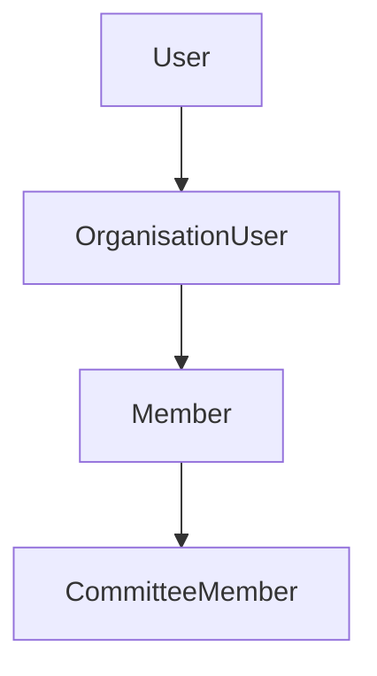

Yes — based on your architecture, you absolutely need a separate `organisation_users` table (or equivalent boundary), and from your earlier system descriptions it already conceptually exists.

But the important part is understanding:

> `OrganisationUser` is NOT redundant with `User`
> and NOT redundant with `Member`

It is a **tenant-bound identity bridge**.

---

# 🧠 WHY `OrganisationUser` EXISTS

Your system is multi-tenant.

That means:

```text id="m1"
One User may belong to multiple Organisations
```

Example:

| User    | Organisation       | Role            |
| ------- | ------------------ | --------------- |
| Nab Raj | Namaste Nepal GmbH | Member          |
| Nab Raj | NRNA ICC           | Committee Admin |
| Nab Raj | Global Federation  | Auditor         |

A plain `users` table cannot model this correctly.

---

# 🧬 CORRECT IDENTITY MODEL



---

# 🧱 RESPONSIBILITY OF EACH LAYER

| Entity           | Responsibility                 |
| ---------------- | ------------------------------ |
| User             | global authentication identity |
| OrganisationUser | tenant/org membership identity |
| Member           | governance/business identity   |
| CommitteeMember  | governance relationship        |

---

# 🔥 IMPORTANT DISTINCTION

---

# 1. User = Authentication Identity

Represents:

* email
* password
* login credentials
* MFA
* global account

Should NOT contain:

* governance state
* committee roles
* tenant-scoped business rules

---

# 2. OrganisationUser = Tenant Boundary Identity

Represents:

* which organisations user belongs to
* organisation-scoped permissions
* onboarding status
* tenant activation
* invitation acceptance
* organisation-specific role mappings

This is the:

> identity bridge between auth and domain

---

# 3. Member = Canonical Governance Aggregate

Represents:

* constitutional membership
* lifecycle state
* eligibility
* governance participation
* member events
* projections

---

# 🧠 WHY YOU CANNOT SKIP OrganisationUser

Without it:

```text id="x1"
User directly linked to Member
```

creates huge problems:

* no multi-org support
* impossible tenant isolation
* mixed auth + governance concerns
* role explosion
* broken onboarding lifecycle

---

# 🧱 RECOMMENDED TABLE STRUCTURE

## users

```sql id="t1"
users
------
id
email
password
global_status
```

---

## organisation_users

```sql id="t2"
organisation_users
-------------------
id
user_id
organisation_id

status
joined_at
invited_by
last_active_at

role
permissions

created_at
updated_at
```

---

## members

```sql id="t3"
members
--------
id
organisation_user_id
membership_type_id

status
registered_at
```

---

# 🚨 IMPORTANT ARCHITECTURAL RULE

## Member MUST belong to OrganisationUser

NOT directly to User.

Because Member is:

* tenant-bound
* governance-bound
* organisation-specific

---

# 🧠 CURRENT PROBLEM IN YOUR SYSTEM

You currently likely have:

```text id="p1"
CommitteeMember → organisation_user_id
```

instead of:

```text id="p2"
CommitteeMember → member_id
```

That’s why:

* committee users exist
* but Member aggregate may not exist

---

# 🔥 SHOULD ORGANISATION USERS BE A SEPARATE TABLE?

## YES. DEFINITELY.

Because it is a separate bounded concept.

---

# ❌ BAD DESIGN

```text id="bad1"
users.organisation_id
```

This breaks:

* multi-org support
* future federation
* governance portability

---

# ✅ GOOD DESIGN

```text id="good1"
users ← organisation_users ← members
```

This is scalable and DDD-correct.

---

# 🧭 DOMAIN INTERPRETATION

Think of it this way:

| Layer            | Meaning                                     |
| ---------------- | ------------------------------------------- |
| User             | “Who are you globally?”                     |
| OrganisationUser | “What organisation context are you in?”     |
| Member           | “What governance identity do you hold?”     |
| CommitteeMember  | “What governance relationship do you have?” |

---

# 🏗 RECOMMENDED HARDENING

---

# 1. Enforce Unique Constraint

```sql id="u1"
UNIQUE(user_id, organisation_id)
```

prevents duplicate org identities.

---

# 2. Member Must Require OrganisationUser

```text id="u2"
Member cannot exist without OrganisationUser
```

---

# 3. CommitteeMembership Must Require Member

```text id="u3"
CommitteeMember cannot exist without Member
```

---

# 🧠 FUTURE BENEFIT

This model later supports:

* federation
* SSO
* guest accounts
* cross-org governance
* organisation switching
* delegated governance
* constitutional voting
* multi-country governance

without redesign.

---

# 🏁 FINAL ANSWER

## Yes — `organisation_users` should absolutely be a separate table.

It is the:

> tenant-bound identity bridge between authentication and governance.

Your correct chain is:

```text id="final1"
User
  → OrganisationUser
      → Member
          → CommitteeMember
```

And your current inconsistency problems are happening because:

* some flows bypass `Member`
* committee logic still partially references `OrganisationUser` directly
* invariants are not yet fully enforced.
