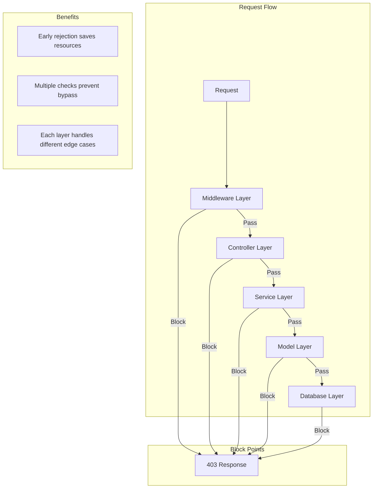

## ✅ **RESPONSIBILITY LAYERS: Device Limit Checks**

### **Answer: Multiple Layers - Each with Specific Role**

The device limit check should be implemented at **multiple layers** for complete protection:

---

## 🏛️ **RESPONSIBILITY MATRIX**

| Layer | Responsibility | Implementation | When |
|-------|----------------|----------------|------|
| **Middleware** | Gatekeeping - First line of defense | Check before controller | 🔴 HIGH |
| **Controller** | Business logic - Apply rules | Validate and enforce | 🔴 HIGH |
| **Model/Service** | Core logic - Reusable check | Shared service class | 🔴 HIGH |
| **Database** | Final safeguard - Constraints | Unique indexes | 🟡 MEDIUM |

---

## 📋 **COMPLETE IMPLEMENTATION**

### **1. Service Layer (Core Logic) - Single Source of Truth**

```php
// app/Services/DeviceFingerprint.php

class DeviceFingerprint
{
    /**
     * Check if device can vote - CORE BUSINESS LOGIC
     * Used by ALL layers (middleware, controller, commands)
     */
    public function canVote(
        string $deviceHash, 
        string $electionId,
        ?Organisation $organisation = null
    ): array {
        $maxVotes = $this->getMaxVotesPerDevice($organisation);
        
        $existingCount = Code::where('device_fingerprint_hash', $deviceHash)
            ->where('election_id', $electionId)
            ->count();
        
        $remaining = max(0, $maxVotes - $existingCount);
        
        return [
            'allowed' => $existingCount < $maxVotes,
            'used' => $existingCount,
            'max' => $maxVotes,
            'remaining' => $remaining,
            'message' => $this->getLimitMessage($organisation, $remaining),
        ];
    }
}
```

---

### **2. Middleware (Gatekeeper) - First Line of Defense**

```php
// app/Http/Middleware/CheckDeviceVoteLimit.php

namespace App\Http\Middleware;

use App\Services\DeviceFingerprint;
use Closure;
use Illuminate\Http\Request;

class CheckDeviceVoteLimit
{
    protected DeviceFingerprint $deviceFingerprint;
    
    public function __construct(DeviceFingerprint $deviceFingerprint)
    {
        $this->deviceFingerprint = $deviceFingerprint;
    }
    
    /**
     * FIRST LINE OF DEFENSE
     * Checks device limit BEFORE hitting controller
     * Saves resources by rejecting early
     */
    public function handle(Request $request, Closure $next)
    {
        // Only check for vote-related routes
        if (!$this->isVoteRoute($request)) {
            return $next($request);
        }
        
        $deviceHash = $this->deviceFingerprint->generate($request);
        $electionId = $request->route('election_id') ?? $request->input('election_id');
        
        if (!$electionId) {
            return $next($request);
        }
        
        $limitCheck = $this->deviceFingerprint->canVote($deviceHash, $electionId);
        
        if (!$limitCheck['allowed']) {
            // Log for monitoring
            \Log::warning('Device vote limit reached - middleware block', [
                'device_hash' => $deviceHash,
                'election_id' => $electionId,
                'used' => $limitCheck['used'],
                'max' => $limitCheck['max'],
                'path' => $request->path(),
            ]);
            
            // Return early response
            if ($request->expectsJson()) {
                return response()->json([
                    'error' => 'device_limit_reached',
                    'message' => $limitCheck['message'],
                    'limit_info' => $limitCheck,
                ], 403);
            }
            
            return redirect()->back()
                ->with('error', $limitCheck['message']);
        }
        
        // Store in request for controller to use
        $request->attributes->set('device_limit_check', $limitCheck);
        
        return $next($request);
    }
    
    protected function isVoteRoute(Request $request): bool
    {
        return $request->routeIs('vote.*') || 
               $request->is('api/vote*') ||
               str_contains($request->path(), 'vote');
    }
}
```

**Register middleware:**

```php
// app/Http/Kernel.php

protected $routeMiddleware = [
    // ... other middleware
    'check.device.limit' => \App\Http\Middleware\CheckDeviceVoteLimit::class,
];

// Or in route groups:
protected $middlewareGroups = [
    'api' => [
        // ... other middleware
        \App\Http\Middleware\CheckDeviceVoteLimit::class,
    ],
];
```

**Apply to routes:**

```php
// routes/api.php

Route::middleware(['auth:sanctum', 'check.device.limit'])->group(function () {
    Route::post('/vote', [VoteController::class, 'store']);
    Route::post('/vote/code', [CodeController::class, 'generate']);
});
```

---

### **3. Controller (Business Logic) - Second Line of Defense**

```php
// app/Http/Controllers/VoteController.php

use App\Services\DeviceFingerprint;

class VoteController extends Controller
{
    protected DeviceFingerprint $deviceFingerprint;
    
    public function __construct(DeviceFingerprint $deviceFingerprint)
    {
        $this->deviceFingerprint = $deviceFingerprint;
    }
    
    /**
     * SECOND LINE OF DEFENSE
     * Double-checks even if middleware passed
     * Handles edge cases and provides detailed responses
     */
    public function store(Request $request)
    {
        // 1. Validate request
        $validated = $request->validate([
            'election_id' => 'required|exists:elections,id',
            'code' => 'required|string',
            // ... other validation
        ]);
        
        // 2. Get device fingerprint
        $deviceHash = $this->deviceFingerprint->generate($request);
        
        // 3. Check device limit again (defense in depth)
        $election = Election::findOrFail($validated['election_id']);
        $limitCheck = $this->deviceFingerprint->canVote(
            $deviceHash, 
            $election->id,
            $election->organisation
        );
        
        if (!$limitCheck['allowed']) {
            // Log for audit
            \Log::info('Vote blocked - device limit reached', [
                'user_id' => auth()->id(),
                'device_hash' => $deviceHash,
                'election_id' => $election->id,
                'used' => $limitCheck['used'],
                'max' => $limitCheck['max'],
            ]);
            
            return response()->json([
                'error' => 'device_limit_reached',
                'message' => $limitCheck['message'],
                'limit_info' => $limitCheck,
            ], 403);
        }
        
        // 4. Check for anomalies (warn but don't block)
        $anomaly = $this->deviceFingerprint->detectAnomaly($deviceHash, $election->id);
        if ($anomaly['detected']) {
            // Trigger event for monitoring
            event(new SuspiciousVotingPattern(auth()->user(), $deviceHash, $election));
            
            // Still allow vote, but flag for review
            $this->flagForReview($deviceHash, $election);
        }
        
        // 5. Proceed with vote
        $vote = $this->createVote($validated, $deviceHash);
        
        // 6. Return success with remaining info
        return response()->json([
            'success' => true,
            'message' => 'Vote recorded',
            'remaining_votes' => $limitCheck['remaining'] - 1,
            'limit_info' => [
                'used' => $limitCheck['used'] + 1,
                'max' => $limitCheck['max'],
                'remaining' => $limitCheck['remaining'] - 1,
            ],
        ]);
    }
}
```

---

### **4. Model/Repository (Data Layer) - Third Line of Defense**

```php
// app/Models/Code.php

class Code extends Model
{
    /**
     * THIRD LINE OF DEFENSE
     * Database-level checks and constraints
     */
    public static function boot()
    {
        parent::boot();
        
        // Check limit before creating new code
        static::creating(function ($code) {
            if (!$code->device_fingerprint_hash) {
                return true;
            }
            
            $service = app(DeviceFingerprint::class);
            $limitCheck = $service->canVote(
                $code->device_fingerprint_hash,
                $code->election_id
            );
            
            if (!$limitCheck['allowed']) {
                throw new \Exception('Device vote limit reached');
            }
            
            return true;
        });
    }
    
    /**
     * Scope to check existing votes
     */
    public function scopeFromDevice($query, string $deviceHash, string $electionId)
    {
        return $query->where('device_fingerprint_hash', $deviceHash)
            ->where('election_id', $electionId);
    }
    
    /**
     * Get count of votes from device
     */
    public static function countFromDevice(string $deviceHash, string $electionId): int
    {
        return static::fromDevice($deviceHash, $electionId)->count();
    }
}
```

---

### **5. Database (Last Resort) - Final Safeguard**

```php
// database/migrations/xxxx_add_device_limit_constraint.php

public function up()
{
    // Option 1: Composite unique index (strict one vote per device)
    Schema::table('codes', function (Blueprint $table) {
        $table->unique(['device_fingerprint_hash', 'election_id'], 'device_election_unique');
    });
    
    // Option 2: Check constraint (configurable limit)
    // Note: MySQL doesn't support CHECK constraints well, use application logic
}
```

---

## 📊 **LAYERED DEFENSE FLOW**



---

## ✅ **WHY MULTIPLE LAYERS?**

| Layer | Why It's Needed |
|-------|-----------------|
| **Middleware** | Fast, early rejection - saves controller processing |
| **Controller** | Business context, detailed responses, anomaly detection |
| **Service** | Single source of truth - reusable logic |
| **Model** | Final check before database write |
| **Database** | Ultimate constraint (if possible) |

---

## 📝 **IMPLEMENTATION ORDER**

```bash
# 1. Create Service first (core logic)
php artisan make:service DeviceFingerprint

# 2. Write tests for service
touch tests/Unit/Services/DeviceFingerprintTest.php

# 3. Create Middleware
php artisan make:middleware CheckDeviceVoteLimit

# 4. Update Controller to use service
# 5. Add model checks
# 6. Register middleware
# 7. Run tests
```

---

## 🎯 **ANSWER SUMMARY**

> "who is responsible to implement maximum device?"

**All layers, but with different responsibilities:**

- **Middleware** = Fast gatekeeper (first to block)
- **Controller** = Business logic enforcer (detailed checks)
- **Service** = Core logic provider (reusable)
- **Model** = Data integrity guard (final check)
- **Database** = Ultimate constraint (last resort)

**This defense-in-depth approach ensures no single point of failure.**
