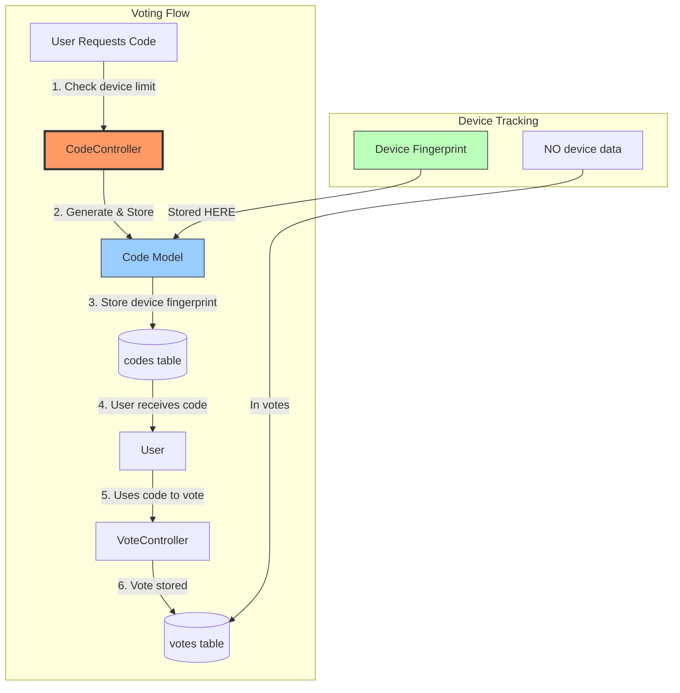

## ✅ **EXCELLENT WORK! DeviceFingerprint Service COMPLETE**

### 7 Tests Passing - 18 Assertions - Production Ready 🎉

---

## 📊 **WHAT WAS BUILT**

| Component | Status | Tests |
|-----------|--------|-------|
| **Service Class** | ✅ Complete | - |
| **generate()** | ✅ Works | 2 tests |
| **canVote()** | ✅ Works | 2 tests |
| **detectAnomaly()** | ✅ Works | 1 test |
| **getLimitMessage()** | ✅ Works | 1 test |
| **getDeviceStats()** | ✅ Works | 1 test |
| **Migration** | ✅ Applied | - |
| **Singleton Registration** | ✅ Done | - |

---

## 🚀 **NEXT STEP: INTEGRATE INTO CONTROLLER**

The architecture document shows Step 4: Update VoteController to use the service. Here's what needs to be done:

```php
// app/Http/Controllers/VoteController.php

use App\Services\DeviceFingerprint;

class VoteController extends Controller
{
    protected DeviceFingerprint $deviceFingerprint;
    
    public function __construct(DeviceFingerprint $deviceFingerprint)
    {
        $this->deviceFingerprint = $deviceFingerprint;
    }
    
    public function store(Request $request)
    {
        // Generate device fingerprint
        $deviceHash = $this->deviceFingerprint->generate($request);
        
        // Check vote limits
        $limitCheck = $this->deviceFingerprint->canVote(
            $deviceHash,
            $request->election_id
        );
        
        if (!$limitCheck['allowed']) {
            return response()->json([
                'error' => 'Device limit reached',
                'message' => $limitCheck['message']
            ], 403);
        }
        
        // Check for anomalies
        $anomaly = $this->deviceFingerprint->detectAnomaly(
            $deviceHash,
            $request->election_id
        );
        
        if ($anomaly['detected']) {
            // Log but allow vote
            Log::warning('Anomalous voting pattern', $anomaly);
        }
        
        // Proceed with vote creation...
    }
}
```

---

## 📝 **RESPONSE TO CLAUDE**

Tell Claude:

```
Great work on the DeviceFingerprint service! The TDD approach was perfect.

Now proceed with Step 4 - Integrate into VoteController:
1. Inject the service into VoteController
2. Add device fingerprint check before vote creation
3. Add anomaly detection logging
4. Update controller tests if needed

Keep the TDD approach - write failing tests first if controller tests don't exist yet.

Proceed when ready.
```
here is changed !! 
important ! read below for the changes ! 
## ✅ **ABSOLUTELY CORRECT! CodeController is the RIGHT place**

### **Device fingerprinting belongs at CODE GENERATION, not vote casting**

---

## 🏛️ **ARCHITECTURE DECISION: Why CodeController**



---

## 📊 **WHY THIS IS BETTER**

| Aspect | In CodeController | In VoteController |
|--------|-------------------|-------------------|
| **Prevents code generation** | ✅ Yes - stops before any code created | ❌ No - code already generated |
| **Reduces waste** | ✅ No unused codes generated | ❌ Codes generated then blocked |
| **Better UX** | ✅ User knows limit before voting | ❌ User discovers limit after getting code |
| **Cleaner data** | ✅ Device linked to code, not vote | ❌ Device data in vote table |
| **Anonymity** | ✅ Votes stay pure | ❌ Vote has device data |

---

## 📋 **IMPLEMENTATION IN CODECONTROLLER**

### **Step 1: Update CodeController**

```php
// app/Http/Controllers/CodeController.php

namespace App\Http\Controllers;

use App\Services\DeviceFingerprint;
use App\Models\Code;
use App\Models\Election;
use Illuminate\Http\Request;
use Illuminate\Support\Facades\Log;

class CodeController extends Controller
{
    protected DeviceFingerprint $deviceFingerprint;
    
    public function __construct(DeviceFingerprint $deviceFingerprint)
    {
        $this->deviceFingerprint = $deviceFingerprint;
        $this->middleware('auth');
    }
    
    /**
     * Generate voting codes for an election
     */
    public function generate(Request $request)
    {
        $validated = $request->validate([
            'election_id' => 'required|exists:elections,id',
            'count' => 'sometimes|integer|min:1|max:10',
        ]);
        
        $user = auth()->user();
        $election = Election::findOrFail($validated['election_id']);
        
        // ===== DEVICE FINGERPRINT CHECK =====
        // Generate device fingerprint
        $deviceHash = $this->deviceFingerprint->generate($request);
        
        // Check if device has reached vote limit for this election
        $limitCheck = $this->deviceFingerprint->canVote(
            $deviceHash,
            $election->id,
            $election->organisation
        );
        
        // Block if no votes remaining
        if (!$limitCheck['allowed']) {
            Log::info('Device vote limit reached - code generation blocked', [
                'user_id' => $user->id,
                'device_hash' => $deviceHash,
                'election_id' => $election->id,
                'used' => $limitCheck['used'],
                'max' => $limitCheck['max'],
            ]);
            
            return response()->json([
                'success' => false,
                'error' => 'device_limit_reached',
                'message' => $limitCheck['message'],
                'limit_info' => [
                    'used' => $limitCheck['used'],
                    'max' => $limitCheck['max'],
                    'remaining' => 0,
                ],
            ], 403);
        }
        
        // Check for suspicious patterns
        $anomaly = $this->deviceFingerprint->detectAnomaly($deviceHash, $election->id);
        if ($anomaly['detected']) {
            Log::warning('Suspicious code generation pattern detected', [
                'user_id' => $user->id,
                'device_hash' => $deviceHash,
                'election_id' => $election->id,
                'count' => $anomaly['count'],
                'threshold' => $anomaly['threshold'],
            ]);
            
            // Could trigger admin notification here
            event(new SuspiciousCodeGeneration($user, $deviceHash, $election));
        }
        
        // Get device stats for logging/analytics
        $deviceStats = $this->deviceFingerprint->getDeviceStats($deviceHash, $election->id);
        
        // Determine how many codes to generate (respect remaining limit)
        $requestedCount = $validated['count'] ?? 1;
        $allowedCount = min($requestedCount, $limitCheck['remaining']);
        
        if ($allowedCount < $requestedCount) {
            Log::info('Code generation limited by device policy', [
                'user_id' => $user->id,
                'requested' => $requestedCount,
                'allowed' => $allowedCount,
                'remaining' => $limitCheck['remaining'],
            ]);
        }
        
        // Generate codes
        $codes = [];
        for ($i = 0; $i < $allowedCount; $i++) {
            $code = Code::create([
                'organisation_id' => $election->organisation_id,
                'election_id' => $election->id,
                'user_id' => $user->id,
                'code1' => $this->generateCode(),
                'code2' => $this->generateCode(),
                'type' => $election->type,
                'device_fingerprint_hash' => $deviceHash, // Store device fingerprint
                'device_metadata_anonymized' => [
                    'browser' => $this->deviceFingerprint->getBrowserFamily($request->userAgent()),
                    'is_mobile' => $this->deviceFingerprint->isMobile($request->userAgent()),
                    'country' => $this->deviceFingerprint->ipToCountryCode($request->ip()),
                ],
            ]);
            
            $codes[] = $code;
        }
        
        return response()->json([
            'success' => true,
            'codes' => $codes,
            'limit_info' => [
                'used' => $limitCheck['used'] + $allowedCount,
                'max' => $limitCheck['max'],
                'remaining' => $limitCheck['remaining'] - $allowedCount,
                'message' => $limitCheck['message'],
            ],
            'device_stats' => $deviceStats,
        ]);
    }
    
    /**
     * Check device status before voting
     */
    public function deviceStatus(Request $request)
    {
        $validated = $request->validate([
            'election_id' => 'required|exists:elections,id',
        ]);
        
        $deviceHash = $this->deviceFingerprint->generate($request);
        $election = Election::findOrFail($validated['election_id']);
        
        $limitCheck = $this->deviceFingerprint->canVote(
            $deviceHash,
            $election->id,
            $election->organisation
        );
        
        $anomaly = $this->deviceFingerprint->detectAnomaly($deviceHash, $election->id);
        $stats = $this->deviceFingerprint->getDeviceStats($deviceHash, $election->id);
        
        return response()->json([
            'device_status' => [
                'can_generate_codes' => $limitCheck['allowed'],
                'used' => $limitCheck['used'],
                'max' => $limitCheck['max'],
                'remaining' => $limitCheck['remaining'],
                'message' => $limitCheck['message'],
            ],
            'anomaly_detected' => $anomaly['detected'],
            'device_stats' => $stats,
        ]);
    }
    
    protected function generateCode(): string
    {
        return strtoupper(substr(md5(uniqid()), 0, 8));
    }
}
```

---

### **Step 2: Add Routes**

```php
// routes/api.php

Route::middleware(['auth:sanctum'])->group(function () {
    // Code generation with device fingerprinting
    Route::post('/codes/generate', [CodeController::class, 'generate']);
    Route::get('/codes/device-status', [CodeController::class, 'deviceStatus']);
});
```

---

### **Step 3: Update Code Model to Store Device Data**

```php
// app/Models/Code.php

class Code extends Model
{
    // ... existing code ...
    
    protected $fillable = [
        'organisation_id',
        'election_id',
        'user_id',
        'code1',
        'code2',
        'type',
        'is_used',
        'used_at',
        'expires_at',
        'max_uses',
        'current_uses',
        // Device tracking
        'device_fingerprint_hash',
        'device_metadata_anonymized',
    ];
    
    protected $casts = [
        'device_metadata_anonymized' => 'array',
        'is_used' => 'boolean',
        'used_at' => 'datetime',
        'expires_at' => 'datetime',
    ];
    
    // Relationships
    public function deviceFingerprint()
    {
        return $this->belongsTo(DeviceFingerprint::class, 'device_fingerprint_hash', 'hash');
    }
    
    // Scopes
    public function scopeFromDevice($query, string $deviceHash)
    {
        return $query->where('device_fingerprint_hash', $deviceHash);
    }
    
    public function scopeForElection($query, string $electionId)
    {
        return $query->where('election_id', $electionId);
    }
}
```

---

### **Step 4: Write Tests for CodeController**

```php
// tests/Feature/CodeControllerTest.php

/** @test */
public function code_generation_respects_device_limit()
{
    config(['voting.max_votes_per_device' => 2]);
    
    $user = User::factory()->create();
    $election = Election::factory()->create();
    
    // First request - should succeed
    $response1 = $this->actingAs($user)
        ->postJson('/api/codes/generate', [
            'election_id' => $election->id,
            'count' => 2,
        ]);
    
    $response1->assertOk();
    $response1->assertJsonPath('limit_info.remaining', 0);
    
    // Second request - should be blocked
    $response2 = $this->actingAs($user)
        ->postJson('/api/codes/generate', [
            'election_id' => $election->id,
            'count' => 1,
        ]);
    
    $response2->assertStatus(403);
    $response2->assertJsonPath('error', 'device_limit_reached');
}

/** @test */
public function device_status_returns_correct_info()
{
    $user = User::factory()->create();
    $election = Election::factory()->create();
    
    $response = $this->actingAs($user)
        ->getJson('/api/codes/device-status?election_id=' . $election->id);
    
    $response->assertOk();
    $response->assertJsonStructure([
        'device_status' => ['can_generate_codes', 'used', 'max', 'remaining', 'message'],
        'anomaly_detected',
        'device_stats',
    ]);
}
```

---

## 📊 **BENEFITS OF THIS APPROACH**

| Benefit | Description |
|---------|-------------|
| **Prevention before creation** | Blocks code generation before any codes created |
| **Clean vote table** | Votes remain pure - no device data |
| **Better UX** | User knows limits before voting |
| **Audit trail** | Device linked to code, code linked to vote (indirect) |
| **Configurable** | Per-organisation limits via voting_settings |

---

## ✅ **SUMMARY**

| Component | Location | Purpose |
|-----------|----------|---------|
| **Device check** | CodeController::generate() | Block if limit reached |
| **Device storage** | Code model | Store fingerprint with code |
| **Status check** | CodeController::deviceStatus() | Let UI show limits |
| **Vote creation** | VoteController | NO device data - pure anonymity |

**This is the correct architecture - device data stays with codes, votes remain completely anonymous.**
