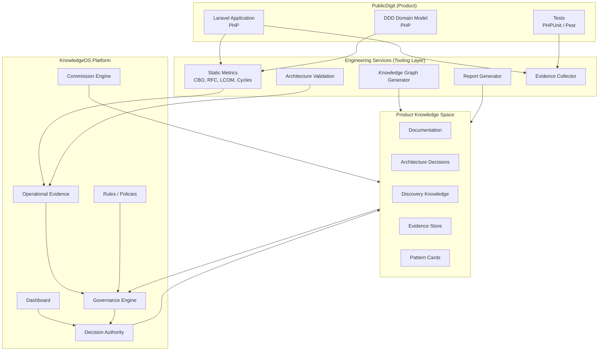
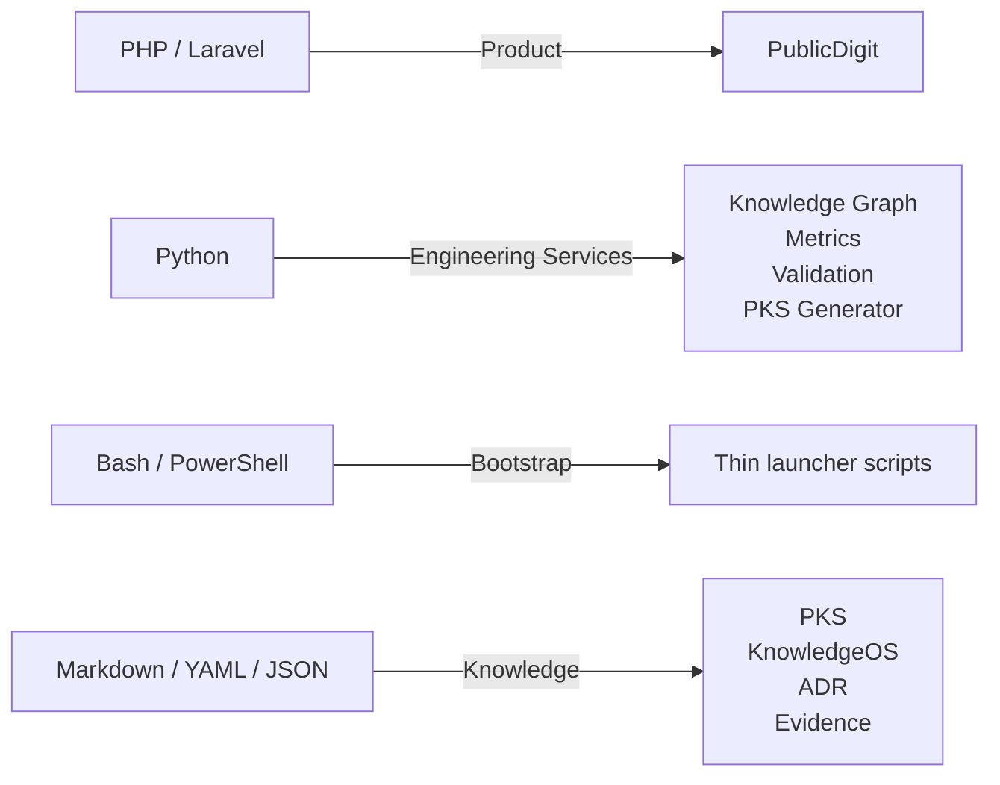
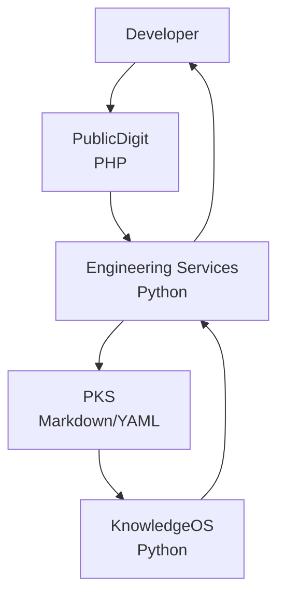
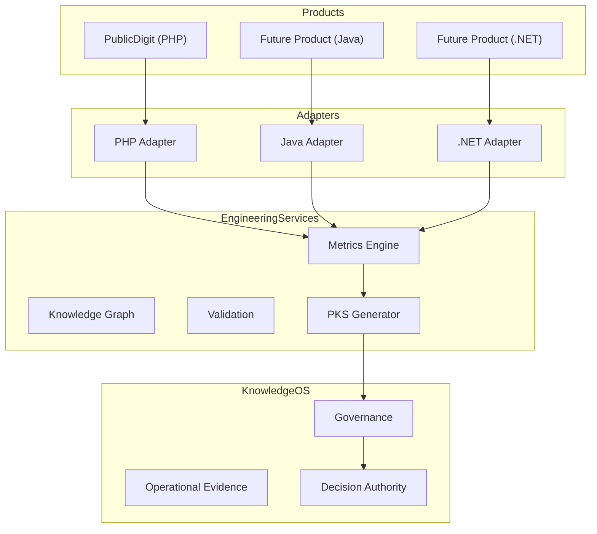

Based on everything you've built over the last months, I think the architecture has naturally converged into **four layers**, each with a different responsibility. The mistake would be to think of it as one application. It is actually an **engineering ecosystem**.

Here is how I would model it.



---

# Where each language belongs

This is where I think your implementation naturally settles.



---

# Layer-by-layer

| Layer                    | Purpose                                      | Recommended Language       |
| ------------------------ | -------------------------------------------- | -------------------------- |
| **PublicDigit**          | Business product                             | **PHP (Laravel)**          |
| **Engineering Services** | Tooling, analysis, metrics, graph generation | **Python**                 |
| **KnowledgeOS**          | Governance, rules, commissions, evidence     | **Python**                 |
| **PKS**                  | Knowledge artifacts                          | **Markdown + YAML + JSON** |

---

# Why Python fits KnowledgeOS

Notice that KnowledgeOS is **not** a web application.

It mostly performs:

* reading Markdown
* reading YAML
* reading JSON
* parsing source code
* generating reports
* building graphs
* validating rules
* computing metrics
* orchestrating scripts

Those are exactly the kinds of tasks where Python has an exceptionally strong ecosystem.

For example:

```text
KnowledgeOS
        │
        ├── markdown parsing
        ├── yaml
        ├── json
        ├── graph algorithms
        ├── AST parsing
        ├── metrics
        ├── report generation
        ├── automation
        └── AI orchestration
```

Python has mature libraries for every one of these.

---

# Where Bash should remain

I would **not** eliminate Bash completely.

Instead:

```text
bash
    │
    ├── bootstrap
    ├── git hooks
    ├── CI entrypoints
    └── launch python
```

So Bash becomes the operating-system integration layer.

---

# Where PHP remains

PHP should stay focused on one thing:

```text
PublicDigit
    │
    ├── Domain
    ├── Application
    ├── Infrastructure
    ├── API
    └── UI
```

KnowledgeOS should **never** become a Laravel package.

---

# The architecture I would recommend



The feedback loop becomes:

1. Developer writes PHP code.
2. Python engineering services analyze it (metrics, validation, knowledge graph, reports).
3. Results are written into the PKS.
4. KnowledgeOS consumes the PKS and applies governance rules.
5. KnowledgeOS produces guidance, evidence, or decisions.
6. Engineering services present that feedback to the developer.

---

## My recommendation

I would **not** migrate PublicDigit to Python.

Instead, I would introduce a new **Engineering Services** layer implemented in Python.

That gives you a clean separation of concerns:

* **PHP** → business product (PublicDigit)
* **Python** → engineering platform (KnowledgeOS, PKS generation, metrics, validation, knowledge graph, future CBO/RFC/LCOM analysis)
* **Markdown/YAML/JSON** → canonical knowledge representation
* **Bash/PowerShell** → thin bootstrap and CI entry points

From a DDD perspective, this is a stronger decomposition because the **product domain remains independent of the engineering domain**. KnowledgeOS governs engineering; it does not become part of the business application.


This is actually **the most important architectural question you've asked today.**

It changes the discussion completely.

If you plan to build **multiple products in different languages (PHP today, Java tomorrow, maybe .NET or Go later)**, then **KnowledgeOS must never become language-dependent.**

This reinforces the direction you have been discovering over the last few months.

---

# Think of KnowledgeOS as an Operating System

Not this:

```text
KnowledgeOS
        │
        └── PHP
```

But this:

```text
                KnowledgeOS

                     ▲
                     │

         Engineering Services (Python)

      ▲              ▲              ▲

Laravel/PHP      Spring Boot     .NET

     Product A      Product B     Product C
```

Notice something:

KnowledgeOS never touches PHP.

KnowledgeOS never touches Java.

KnowledgeOS doesn't even know what language the product is written in.

---

# The missing architectural layer

I actually think your architecture becomes cleaner if you explicitly introduce a **Language Adapter Layer**.



Now the architecture is **language-independent**.

---

# Why Python becomes interesting

Python is no longer replacing PHP.

Python becomes the **engineering platform**.

For example:

```
knowledgeos/
    metrics/
        php/
        java/
        dotnet/

    adapters/
        php/
        java/
        dotnet/

    pks/

    governance/

    evidence/

    graph/

    reports/
```

Now imagine tomorrow you build

```
Spring Boot

↓

Java Adapter

↓

KnowledgeOS
```

Nothing changes.

---

# Even better...

I wouldn't even think in terms of PHP Adapter.

I'd think in terms of **Observation Providers**.

```
PHP Provider

↓

Observations

Java Provider

↓

Observations

.NET Provider

↓

Observations
```

KnowledgeOS consumes observations.

It doesn't consume PHP.

---

# Example

Today

```
Laravel

↓

CBO = 18
RFC = 42

↓

KnowledgeOS
```

Tomorrow

```
Spring Boot

↓

CBO = 17
RFC = 39

↓

KnowledgeOS
```

KnowledgeOS sees

```
Observation

Class X

Metric

CBO = 17
```

It doesn't care whether that class came from

* Laravel
* Spring
* .NET
* Go

Exactly like a database doesn't care whether data came from a web form or an API.

---

# This is actually DDD

DDD would say

The Core Domain is

```
Engineering Knowledge
```

NOT

```
PHP Engineering
```

Language becomes infrastructure.

Exactly the same way databases are infrastructure.

---

# This is how I would evolve the architecture

```
                    KnowledgeOS
                 (language neutral)

                       ▲

             Engineering Services
                  (Python)

        ▲            ▲            ▲

 PHP Provider   Java Provider   .NET Provider

        ▲            ▲            ▲

 PublicDigit     Future ERP      Future CRM
```

Notice what has happened.

KnowledgeOS is no longer tied to any product.

It is no longer tied to any language.

It governs engineering.

---

# One more discovery

I actually think we can refine the terminology.

Instead of calling them

```
PHP Adapter

Java Adapter
```

I'd call them

```
Engineering Observers

or

Language Observers

or

Observation Providers
```

because their job isn't adaptation.

Their job is

```
Observe

↓

Normalize

↓

Publish observations
```

KnowledgeOS never needs to know whether those observations came from PHP or Java.

---

## My recommendation

If you believe you'll build products in multiple languages—which seems likely given your background—then I would **intentionally design KnowledgeOS as language-agnostic from the beginning**.

That means:

* **PublicDigit** remains a PHP/Laravel application.
* **Future Java products** remain Java applications.
* **KnowledgeOS** stays language-neutral.
* **Engineering Services** (implemented in Python) provide shared capabilities such as metrics, knowledge graph generation, PKS generation, evidence collection, and governance.
* Each language contributes a small **provider/observer** that extracts engineering observations into a common format.

This is a stronger DDD architecture because the ubiquitous language of KnowledgeOS is about **engineering knowledge**, not about any particular implementation technology.
