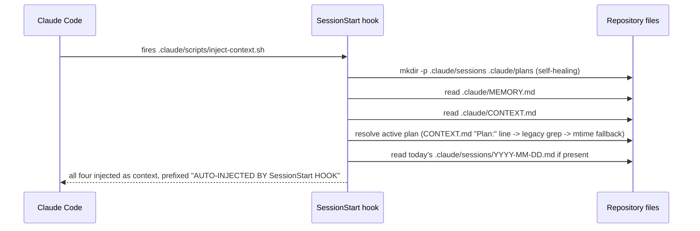
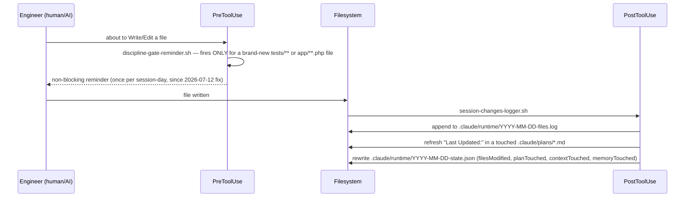
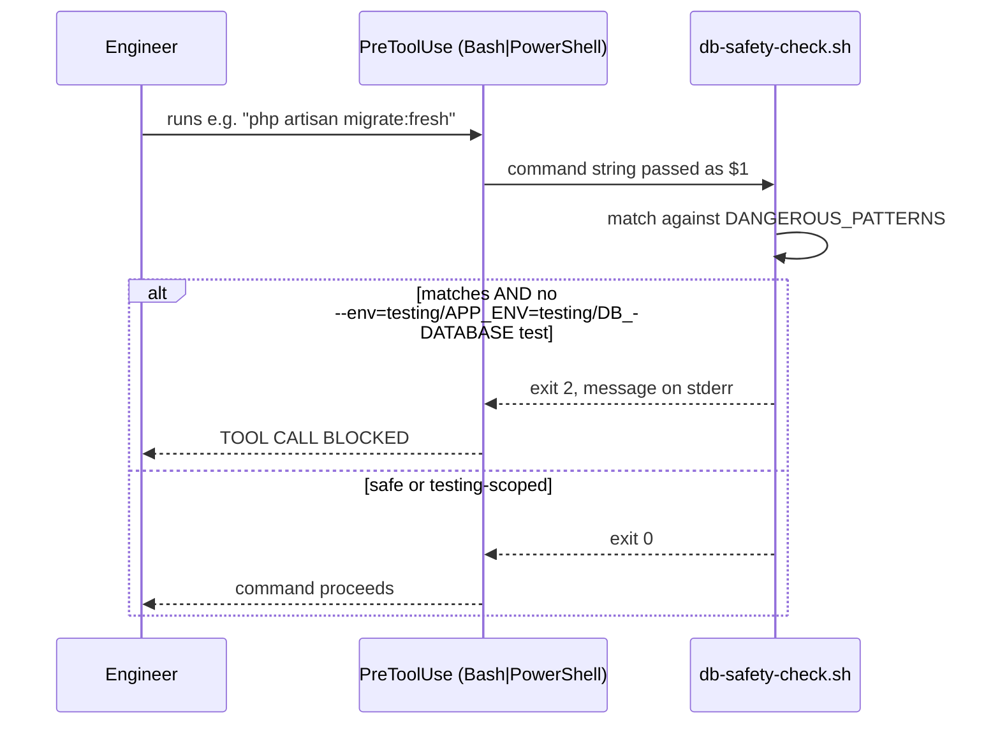
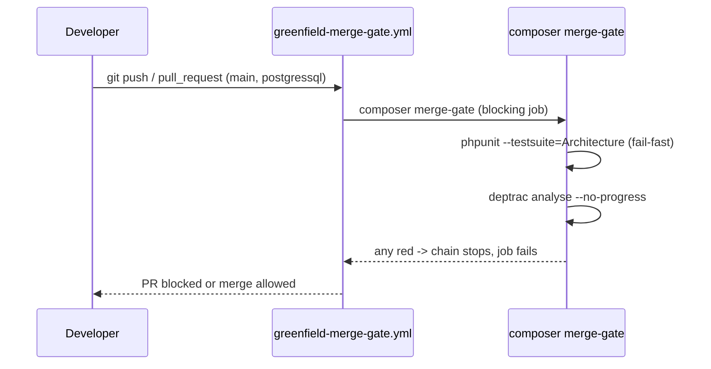

# 03 — Runtime Mechanics: How the Platform Actually Executes

## Purpose

Guides 00–02 explain the platform's *architecture and process*. This guide closes the one piece they deliberately leave out: **the concrete, file-level mechanics of how a session, a write, a dangerous command, and a merge actually run** — reconstructed from the current repository, not designed. Every diagram below traces to a named file; where a step is not machine-enforced, that is stated, not implied.

**Status:** fills the slot reserved in `00_index.md` since Iteration 1 ("03 — reserved, written with slice C3"). Written 2026-07-12 from operational evidence gathered during the Execution Verification Report (`engineering/verification/reports/2026-07-12-execution-verification-report.md`) and the same-day hook fixes — not from a design exercise. If C3 (cold-boot qualification) later reveals a discrepancy, this guide is corrected, not the runtime.

## Where it fits

- **Layer:** Runtime Platform (`.claude/` — see guide 00's inversion diagram: this guide documents the bottom of the stack, "Provider Binding" and below).
- **Authority:** the files themselves are authoritative; this guide is a traced description, never a second source of truth (rules-live-once).
- **Companion:** `engineering/architecture/c4/AI_Engineering_Platform_Views.md` — the conceptual/strategic views (bounded contexts, domain model). This guide is the mechanistic counterpart: not "what the platform means," but "what literally happens."

## 1. Session start


**Evidence:** `.claude/scripts/inject-context.sh` (read in full 2026-07-12); wired via `.claude/settings.json` `SessionStart` block with `statusMessage: "Loading project context (.claude/CONTEXT.md)"`.

## 2. Development flow (Write/Edit)


**Evidence:** `.claude/scripts/discipline-gate-reminder.sh` and `.claude/scripts/session-changes-logger.sh`, both read and (the former) modified 2026-07-12. **Not machine-enforced:** the reminder cannot verify a test was RED before the implementation existed — confirmed by the documented TDD breach in `.claude/sessions/2026-07-08.md` (production written before the failing test, caught by review, not by this hook).

## 3. Destructive database command


**Evidence:** `.claude/scripts/db-safety-check.sh`. **Fixed 2026-07-12:** this gate previously used `exit 1` on the blocked branch — confirmed via Claude Code's own hook documentation that only `exit 2` blocks a PreToolUse call; `exit 1` is non-blocking. The gate had been printing "BLOCKED" while the destructive command ran anyway. Verified post-fix with four manual test cases (dangerous / dangerous-with-testing-flag / safe / empty input) — all four now behave correctly.

## 4. Merge gate


**Evidence:** `.github/workflows/greenfield-merge-gate.yml` (confirmed: triggers on `pull_request` + `push` to `main`/`postgressql`, job "composer merge-gate (blocking)"); `composer.json` `merge-gate`/`quality-gate` scripts; `deptrac.yaml` ruleset (e.g. `ContestationDomain: ~` — Domain depends on nothing); `tests/Architecture/GreenfieldCoreArchitectureTest.php` assertions. Session log confirms an actual run: `"PB-007 7A — Deptrac report mode: 0 violations (2026-07-10)"` — not merely configured, exercised.

## 5. Architecture governance flow

```mermaid
sequenceDiagram
    participant Eng as Engineer
    participant ARB as Decision Authority
    Eng->>ARB: EP-03 Readiness Review (derive business/DDD/architecture answers)
    ARB-->>Eng: gaps only, asked back
    Eng->>ARB: EP-01 plan (or EP-01-Light)
    ARB->>ARB: approves the PLAN, not the task
    Eng->>Eng: implementation (approved plan only; invalidation -> STOP, re-plan)
    Eng->>ARB: EP-02 Completion Review
    ARB-->>Eng: conformance confirmed, or findings recorded
```
**Evidence:** `docs/implementation/Implementation_Process_v1.1_Draft.md` §EP; `.claude/CLAUDE.md` §"Engineering Process — EP-01 Plan First". This is the one flow in this guide with **no automation** — it is Architecture Governance in the terms of `2026-07-12-execution-verification-report.md`, and its enforcement is human/AI judgment, not a hook.

## What this guide deliberately does not claim

Per the same discipline as the Execution Verification Report: **nothing above is bypass-proof at the point of writing.** Sections 2 and 3 show real-time guidance/blocking; sections 4 and 5 show where violations are actually caught (merge gate, ARB review) when real-time mechanisms cannot or do not stop them. This guide describes what was found, not what was designed to sound complete.

## Traceability

Origin: evidence-reconstruction commission (ARB, 2026-07-12) after the placement litmus (ES-005.3) failed for a proposed new `docs/architecture/ai-architecture/` tree — see the reconstruction report, `engineering/verification/reports/2026-07-12-ai-architecture-reconstruction-report.md`, for the full discovery. Fills `00_index.md` row 03. Grounded in: `.claude/scripts/*.sh` (read 2026-07-12) · `.claude/settings.json` · `composer.json` · `deptrac.yaml` · `.github/workflows/greenfield-merge-gate.yml` · `2026-07-12-execution-verification-report.md`. On any conflict between this guide and the files it describes, the files win.
