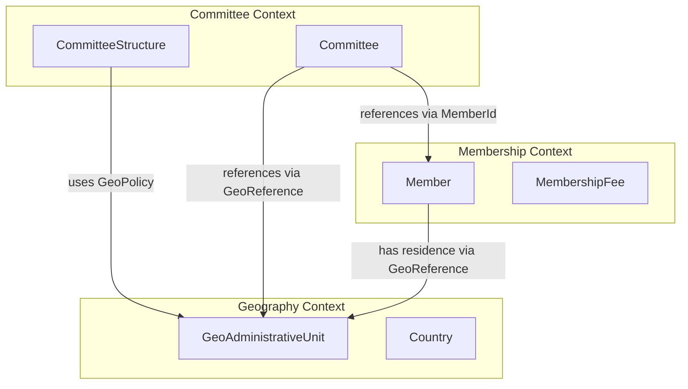

# Comprehensive Developer Tutorial: Integrating Committee, Membership & Geography Contexts

## Table of Contents

1. [Architecture Overview](#1-architecture-overview)
2. [Core Concepts](#2-core-concepts)
3. [Database Schema](#3-database-schema)
4. [Domain Layer Implementation](#4-domain-layer-implementation)
5. [Application Layer Implementation](#5-application-layer-implementation)
6. [Infrastructure Layer Implementation](#6-infrastructure-layer-implementation)
7. [HTTP Layer Implementation](#7-http-layer-implementation)
8. [Frontend Vue Components](#8-frontend-vue-components)
9. [Testing Strategy](#9-testing-strategy)
10. [Common Pitfalls & Solutions](#10-common-pitfalls--solutions)

---

## 1. Architecture Overview

### 1.1 Bounded Contexts

```yaml
Geography Context:
  Purpose: Manage geographic units (countries, provinces, districts, wards)
  Aggregates: GeoAdministrativeUnit, Country
  Value Objects: GeoReference, GeoPath, GeoScope
  Repository: GeoUnitRepositoryInterface

Membership Context:
  Purpose: Manage members, their profiles, and memberships
  Aggregates: Member, MembershipFee, MembershipApplication
  Value Objects: MemberId, MembershipTypeId, GeoReference (legacy)
  Repository: MemberRepositoryInterface

Committee Context:
  Purpose: Manage committee structures and committee instances
  Aggregates: CommitteeStructure, Committee
  Value Objects: CommitteeId, LevelId, GeoPolicy, GeoScope
  Repository: CommitteeStructureRepositoryInterface, CommitteeRepositoryInterface
```

### 1.2 Context Map



---

## 2. Core Concepts

### 2.1 GeoReference - The Bridge Between Contexts

```php
// app/Contexts/Geography/Domain/ValueObjects/GeoReference.php

namespace App\Contexts\Geography\Domain\ValueObjects;

/**
 * Canonical GeoReference - The ONLY way to reference geography
 * from other contexts.
 * 
 * Formats:
 * - Legacy: "np.3.15.234" (country.level1.level2.level3)
 * - Composite: "region:europe.country:DE.geo:3.15"
 */
final readonly class GeoReference
{
    private function __construct(
        public readonly ?string $region,      // For worldwide orgs
        public readonly ?string $country,     // ISO country code
        public readonly GeoPath $geoPath,    // Array of unit IDs
        private readonly bool $isLegacy,      // True if old format
    ) {}

    public static function fromString(string $value): self
    {
        if (str_contains($value, ':')) {
            return self::parseComposite($value);
        }
        return self::parseLegacy($value);
    }

    public function toString(): string
    {
        if ($this->isLegacy && $this->country) {
            return strtolower($this->country) . '.' . $this->geoPath->toString();
        }

        $parts = [];
        if ($this->region) $parts[] = "region:{$this->region}";
        if ($this->country) $parts[] = "country:" . strtolower($this->country);
        if (!$this->geoPath->isEmpty()) $parts[] = "geo:" . $this->geoPath->toString();
        
        return implode('.', $parts);
    }

    public function getCountryCode(): ?string
    {
        return $this->country;
    }

    public function isLegacy(): bool
    {
        return $this->isLegacy;
    }

    private static function parseLegacy(string $value): self
    {
        $parts = explode('.', strtolower($value));
        $country = strtoupper(array_shift($parts));
        $geoPath = GeoPath::fromArray($parts);
        return new self(null, $country, $geoPath, true);
    }

    private static function parseComposite(string $value): self
    {
        $region = null;
        $country = null;
        $geoParts = [];

        foreach (explode('.', $value) as $segment) {
            [$type, $val] = explode(':', $segment, 2);
            match ($type) {
                'region' => $region = $val,
                'country' => $country = strtoupper($val),
                'geo' => $geoParts = array_merge($geoParts, explode('.', $val)),
                default => null,
            };
        }

        return new self($region, $country, GeoPath::fromArray($geoParts), false);
    }
}
```

### 2.2 GeoPath - Value Object for Unit Hierarchy

```php
// app/Contexts/Geography/Domain/ValueObjects/GeoPath.php

namespace App\Contexts\Geography\Domain\ValueObjects;

final readonly class GeoPath
{
    private array $units;

    private function __construct(array $units)
    {
        foreach ($units as $unit) {
            if (!is_int($unit) || $unit <= 0) {
                throw new \InvalidArgumentException('GeoPath units must be positive integers');
            }
        }
        $this->units = $units;
    }

    public static function fromArray(array $raw): self
    {
        $filtered = array_filter(array_map('intval', $raw), fn($u) => $u > 0);
        return new self(array_values($filtered));
    }

    public static function empty(): self
    {
        return new self([]);
    }

    public function depth(): int
    {
        return count($this->units);
    }

    public function isEmpty(): bool
    {
        return empty($this->units);
    }

    public function toArray(): array
    {
        return $this->units;
    }

    public function toString(): string
    {
        return implode('.', $this->units);
    }
}
```

### 2.3 GeoPolicy - Geographic Requirement Per Level

```php
// app/Contexts/Committee/Domain/ValueObjects/GeoPolicy.php

namespace App\Contexts\Committee\Domain\ValueObjects;

enum GeoPolicy: string
{
    case NONE = 'none';
    case REQUIRED = 'required';
    case OPTIONAL = 'optional';

    public function requiresGeo(): bool
    {
        return $this === self::REQUIRED;
    }

    public function validate(?GeoScope $geoScope): void
    {
        if ($this === self::REQUIRED && $geoScope === null) {
            throw new \DomainException('GeoPolicy::REQUIRED requires a GeoScope');
        }
    }
}
```

### 2.4 GeoScope - Type of Geographic Unit

```php
// app/Contexts/Committee/Domain/ValueObjects/GeoScope.php

namespace App\Contexts\Committee\Domain\ValueObjects;

final readonly class GeoScope
{
    private function __construct(private string $code) {}

    public static function fromString(string $code): self
    {
        if (empty($code)) {
            throw new \InvalidArgumentException('GeoScope code cannot be empty');
        }
        return new self($code);
    }

    public function code(): string
    {
        return $this->code;
    }
}
```

---

## 3. Database Schema

### 3.1 Geography Tables (Landlord Connection)

```sql
-- Countries (ISO 3166-1)
CREATE TABLE countries (
    code CHAR(2) PRIMARY KEY,
    code_alpha3 CHAR(3) UNIQUE NOT NULL,
    name_en VARCHAR(100) NOT NULL,
    name_local JSON NOT NULL,
    admin_levels JSON NOT NULL,
    is_active BOOLEAN DEFAULT true,
    created_at TIMESTAMP,
    updated_at TIMESTAMP
);

-- Administrative Units (Polyglot hierarchy)
CREATE TABLE geo_administrative_units (
    id BIGSERIAL PRIMARY KEY,
    country_code CHAR(2) NOT NULL,
    admin_level SMALLINT NOT NULL,
    admin_type VARCHAR(50) NOT NULL,
    parent_id BIGINT REFERENCES geo_administrative_units(id),
    path VARCHAR(768),
    code VARCHAR(50) NOT NULL,
    name_local JSON NOT NULL,
    is_active BOOLEAN DEFAULT true,
    created_at TIMESTAMP,
    updated_at TIMESTAMP,
    FOREIGN KEY (country_code) REFERENCES countries(code)
);

-- Regions (Business-defined groupings for worldwide orgs)
CREATE TABLE regions (
    id BIGSERIAL PRIMARY KEY,
    code VARCHAR(20) UNIQUE NOT NULL,
    name VARCHAR(100) NOT NULL,
    name_local JSON,
    display_order INT DEFAULT 0,
    is_active BOOLEAN DEFAULT true
);

-- Region-Country mapping (normalized)
CREATE TABLE region_country (
    region_id BIGINT REFERENCES regions(id),
    country_code CHAR(2) REFERENCES countries(code),
    PRIMARY KEY (region_id, country_code)
);
```

### 3.2 Committee Tables (Tenant Connection)

```sql
-- Committee Structures (Governance configuration)
CREATE TABLE committee_structures (
    id CHAR(26) PRIMARY KEY,  -- ULID
    organisation_id UUID NOT NULL,
    name VARCHAR(255) NOT NULL,
    status VARCHAR(20) DEFAULT 'draft',  -- draft, active, deprecated
    version INT DEFAULT 1,
    parent_structure_id CHAR(26) NULL,
    activated_by UUID NULL,
    activated_at TIMESTAMP NULL,
    activation_reason TEXT NULL,
    activation_metadata JSON NULL,
    created_at TIMESTAMP,
    updated_at TIMESTAMP,
    FOREIGN KEY (organisation_id) REFERENCES organisations(id),
    FOREIGN KEY (parent_structure_id) REFERENCES committee_structures(id),
    UNIQUE(organisation_id, version),
    UNIQUE(parent_structure_id) WHERE status = 'draft'
);

-- Committee Structure Levels
CREATE TABLE committee_structure_levels (
    id BIGSERIAL PRIMARY KEY,
    committee_structure_id CHAR(26) NOT NULL,
    level_index SMALLINT NOT NULL,
    code VARCHAR(50) NULL,
    name VARCHAR(255) NOT NULL,
    geo_policy VARCHAR(20) NOT NULL,  -- none, required, optional
    geo_scope VARCHAR(50) NULL,
    role_limits JSON NULL,
    min_membership_years SMALLINT DEFAULT 0,
    age_range_min SMALLINT NULL,
    age_range_max SMALLINT NULL,
    gender_requirement VARCHAR(20) NULL,
    created_at TIMESTAMP,
    updated_at TIMESTAMP,
    FOREIGN KEY (committee_structure_id) REFERENCES committee_structures(id),
    UNIQUE(committee_structure_id, level_index)
);

-- Committees (Instances created from structure)
CREATE TABLE committees (
    id CHAR(26) PRIMARY KEY,
    organisation_id UUID NOT NULL,
    structure_id CHAR(26) NULL,
    level_index SMALLINT NULL,
    level_name VARCHAR(255) NULL,
    geo_policy VARCHAR(20) NULL,
    geo_scope VARCHAR(50) NULL,
    geo_reference VARCHAR(255) NULL,
    name VARCHAR(255) NOT NULL,
    code VARCHAR(100) NOT NULL,
    status VARCHAR(20) DEFAULT 'active',
    region_code VARCHAR(50) NULL,
    country_code CHAR(2) NULL,
    created_at TIMESTAMP,
    updated_at TIMESTAMP,
    deleted_at TIMESTAMP NULL,
    FOREIGN KEY (organisation_id) REFERENCES organisations(id),
    FOREIGN KEY (structure_id) REFERENCES committee_structures(id),
    FOREIGN KEY (country_code) REFERENCES countries(code)
);
```

### 3.3 Migration Example

```php
// database/migrations/landlord/2026_01_01_000001_create_countries_table.php

<?php

use Illuminate\Database\Migrations\Migration;
use Illuminate\Database\Schema\Blueprint;
use Illuminate\Support\Facades\Schema;

return new class extends Migration
{
    public function up(): void
    {
        Schema::connection('landlord')->create('countries', function (Blueprint $table) {
            $table->char('code', 2)->primary();
            $table->char('code_alpha3', 3)->unique();
            $table->char('code_numeric', 3)->unique();
            $table->string('name_en', 100);
            $table->json('name_local');
            $table->json('admin_levels');
            $table->boolean('is_active')->default(true);
            $table->timestamps();
        });
    }

    public function down(): void
    {
        Schema::connection('landlord')->dropIfExists('countries');
    }
};
```

---

## 4. Domain Layer Implementation

### 4.1 Committee Aggregate Root

```php
// app/Contexts/Committee/Domain/Committee.php

namespace App\Contexts\Committee\Domain;

use App\Contexts\Committee\Domain\ValueObjects\CommitteeId;
use App\Contexts\Committee\Domain\ValueObjects\CommitteeName;
use App\Contexts\Committee\Domain\ValueObjects\CommitteeStatus;
use App\Contexts\Committee\Domain\ValueObjects\LevelId;
use App\Contexts\Geography\Domain\ValueObjects\GeoReference;
use App\Contexts\Membership\Domain\ValueObjects\MemberId;
use App\Contexts\Shared\Domain\TenantAggregateRoot;
use App\Contexts\Shared\Domain\ValueObjects\TenantId;
use DateTimeImmutable;
use DomainException;

final class Committee extends TenantAggregateRoot
{
    private CommitteeId $id;
    private CommitteeName $name;
    private string $code;
    private CommitteeStatus $status;
    
    // Snapshot from governance structure (immutable after creation)
    private CommitteeStructureId $createdFromStructureId;
    private int $structureVersion;
    private int $levelIndex;
    private string $levelName;
    private GeoPolicy $geoPolicy;
    private ?GeoScope $geoScope;
    private ?GeoReference $operationalGeoReference;
    
    /** @var CommitteeAssignment[] */
    private array $assignments = [];

    private function __construct(TenantId $tenantId)
    {
        $this->tenantId = $tenantId;
    }

    public static function create(
        CommitteeId $id,
        TenantId $tenantId,
        CommitteeStructureId $createdFromStructureId,
        int $structureVersion,
        int $levelIndex,
        string $levelName,
        GeoPolicy $geoPolicy,
        ?GeoScope $geoScope,
        CommitteeName $name,
        string $code,
        ?GeoReference $operationalGeoReference = null,
    ): self {
        $committee = new self($tenantId);
        $committee->id = $id;
        $committee->name = $name;
        $committee->code = $code;
        $committee->status = CommitteeStatus::active();
        $committee->createdFromStructureId = $createdFromStructureId;
        $committee->structureVersion = $structureVersion;
        $committee->levelIndex = $levelIndex;
        $committee->levelName = $levelName;
        $committee->geoPolicy = $geoPolicy;
        $committee->geoScope = $geoScope;
        $committee->operationalGeoReference = $operationalGeoReference;

        $committee->recordEvent(new CommitteeCreated(
            committeeId: $id,
            tenantId: $tenantId,
            name: $name->value(),
            structureId: $createdFromStructureId,
            structureVersion: $structureVersion,
            levelIndex: $levelIndex,
            geoReference: $operationalGeoReference?->toString(),
        ));

        return $committee;
    }

    public function assignMember(
        MemberId $memberId,
        RolePath $rolePath,
        NominationType $nominationType,
        ?GeoReference $memberGeography = null,
        ?DateTimeImmutable $electionDate = null,
        ?DateTimeImmutable $termEndDate = null,
        ?TenantUserId $appointedByUserId = null,
        ?string $notes = null,
        array $metadata = []
    ): CommitteeAssignment {
        // Validate geography if required by this committee's level
        if ($this->geoPolicy->requiresGeo() && $memberGeography === null) {
            throw new DomainException(
                "Committee level '{$this->levelName}' requires geographic reference"
            );
        }

        // Additional validation logic...
        
        $assignment = CommitteeAssignment::assign(
            // ... assignment creation
        );
        
        $this->assignments[] = $assignment;
        
        return $assignment;
    }

    // Getters...
    public function getId(): CommitteeId { return $this->id; }
    public function getLevelName(): string { return $this->levelName; }
    public function getGeoPolicy(): GeoPolicy { return $this->geoPolicy; }
    public function getGeoScope(): ?GeoScope { return $this->geoScope; }
    public function getOperationalGeoReference(): ?GeoReference { return $this->operationalGeoReference; }
    public function getCreatedFromStructureId(): CommitteeStructureId { return $this->createdFromStructureId; }
    public function getStructureVersion(): int { return $this->structureVersion; }
}
```

### 4.2 CommitteeStructure Aggregate (Governance)

```php
// app/Contexts/Committee/Domain/CommitteeStructure.php

namespace App\Contexts\Committee\Domain;

use App\Contexts\Committee\Domain\ValueObjects\CommitteeStructureId;
use App\Contexts\Committee\Domain\Exceptions\CannotEvolveNonActiveStructure;
use App\Contexts\Shared\Domain\TenantAggregateRoot;
use App\Contexts\Shared\Domain\ValueObjects\TenantId;
use DateTimeImmutable;
use DomainException;

final class CommitteeStructure extends TenantAggregateRoot
{
    private CommitteeStructureId $id;
    private string $name;
    private int $version = 1;
    private StructureStatus $status = StructureStatus::DRAFT;
    private ?CommitteeStructureId $parentStructureId = null;
    private ?string $activatedBy = null;
    private ?DateTimeImmutable $activatedAt = null;
    private ?string $activationReason = null;
    private ?array $activationMetadata = null;
    private ?DateTimeImmutable $effectiveFrom = null;
    private ?DateTimeImmutable $effectiveUntil = null;
    
    /** @var CommitteeLevel[] */
    private array $levels = [];

    public static function define(
        CommitteeStructureId $id,
        TenantId $tenantId,
        string $name,
        array $levels,
    ): self {
        if (empty($levels)) {
            throw new DomainException('Structure must have at least one level');
        }

        // Validate contiguity, uniqueness, etc.
        self::validateLevels($levels);

        $structure = new self($tenantId);
        $structure->id = $id;
        $structure->name = $name;
        $structure->version = 1;
        $structure->status = StructureStatus::DRAFT;
        
        foreach ($levels as $level) {
            $structure->levels[$level->index] = $level;
        }

        return $structure;
    }

    public function activate(string $activatedBy, ?string $reason = null, array $metadata = []): void
    {
        if ($this->status !== StructureStatus::DRAFT) {
            throw new DomainException('Only DRAFT structures can be activated');
        }
        
        if (empty($this->levels)) {
            throw new DomainException('Cannot activate structure without levels');
        }
        
        $this->status = StructureStatus::ACTIVE;
        $this->activatedBy = $activatedBy;
        $this->activatedAt = new DateTimeImmutable();
        $this->activationReason = $reason;
        $this->activationMetadata = !empty($metadata) ? $metadata : null;
    }

    public function evolve(array $newLevels): self
    {
        if (!$this->isActive()) {
            throw CannotEvolveNonActiveStructure::becauseNotActive($this->id, $this->status);
        }
        
        self::validateLevels($newLevels);
        
        $evolved = new self($this->tenantId);
        $evolved->id = CommitteeStructureId::generate();
        $evolved->parentStructureId = $this->id;
        $evolved->version = $this->version + 1;
        $evolved->name = $this->name;
        $evolved->status = StructureStatus::DRAFT;
        
        foreach ($newLevels as $level) {
            $evolved->levels[$level->index] = $level;
        }
        
        $this->deprecate();
        
        return $evolved;
    }

    public function getLevel(int $index): CommitteeLevel
    {
        if (!isset($this->levels[$index])) {
            throw new DomainException("Level index {$index} not found");
        }
        return $this->levels[$index];
    }

    public function isActive(): bool
    {
        return $this->status === StructureStatus::ACTIVE;
    }

    public function isEffectiveAt(DateTimeImmutable $instant): bool
    {
        if ($this->effectiveFrom !== null && $instant < $this->effectiveFrom) {
            return false;
        }
        if ($this->effectiveUntil !== null && $instant > $this->effectiveUntil) {
            return false;
        }
        return true;
    }

    // Getters...
    public function getId(): CommitteeStructureId { return $this->id; }
    public function getName(): string { return $this->name; }
    public function getVersion(): int { return $this->version; }
    public function getStatus(): StructureStatus { return $this->status; }
    public function getLevels(): array { return $this->levels; }
    public function getActivatedBy(): ?string { return $this->activatedBy; }
    public function getActivatedAt(): ?DateTimeImmutable { return $this->activatedAt; }
}
```

### 4.3 CommitteeLevel Value Object

```php
// app/Contexts/Committee/Domain/CommitteeLevel.php

namespace App\Contexts\Committee\Domain;

use App\Contexts\Committee\Domain\ValueObjects\GeoPolicy;
use App\Contexts\Committee\Domain\ValueObjects\GeoScope;
use InvalidArgumentException;

final readonly class CommitteeLevel
{
    private function __construct(
        public int $index,
        public ?string $code,
        public string $name,
        public GeoPolicy $geoPolicy,
        public ?GeoScope $geoScope,
        public array $roleLimits,
        public int $minMembershipYears,
        public ?array $ageRange,
        public ?string $genderRequirement,
    ) {}

    public static function create(
        int $index,
        ?string $code,
        string $name,
        GeoPolicy $geoPolicy,
        ?GeoScope $geoScope,
        array $roleLimits,
        int $minMembershipYears,
        ?array $ageRange,
        ?string $genderRequirement,
    ): self {
        if ($index < 1 || $index > 10) {
            throw new InvalidArgumentException('Level index must be between 1 and 10');
        }
        
        $geoPolicy->validate($geoScope);
        
        return new self(
            index: $index,
            code: $code,
            name: $name,
            geoPolicy: $geoPolicy,
            geoScope: $geoScope,
            roleLimits: $roleLimits,
            minMembershipYears: $minMembershipYears,
            ageRange: $ageRange,
            genderRequirement: $genderRequirement,
        );
    }

    public function toArray(): array
    {
        return [
            'index' => $this->index,
            'code' => $this->code,
            'name' => $this->name,
            'geo_policy' => $this->geoPolicy->value,
            'geo_scope' => $this->geoScope?->code(),
            'role_limits' => $this->roleLimits,
            'min_membership_years' => $this->minMembershipYears,
            'age_range' => $this->ageRange,
            'gender_requirement' => $this->genderRequirement,
        ];
    }
}
```

---

## 5. Application Layer Implementation

### 5.1 CreateCommittee Use Case (Transactional)

```php
// app/Contexts/Committee/Application/Committee/CreateCommitteeUseCase.php

namespace App\Contexts\Committee\Application\Committee;

use App\Contexts\Committee\Domain\Committee;
use App\Contexts\Committee\Domain\CommitteeId;
use App\Contexts\Committee\Domain\Repositories\CommitteeRepositoryInterface;
use App\Contexts\Committee\Domain\Repositories\CommitteeStructureRepositoryInterface;
use App\Contexts\Committee\Domain\Services\CommitteeCreationPolicy;
use App\Contexts\Committee\Domain\ValueObjects\CommitteeName;
use App\Contexts\Geography\Domain\ValueObjects\GeoReference;
use App\Contexts\Shared\Domain\ValueObjects\TenantId;
use DomainException;

interface CreateCommitteeUseCase
{
    public function execute(array $command): Committee;
}

final class InternalCreateCommittee implements CreateCommitteeUseCase
{
    public function __construct(
        private CommitteeStructureRepositoryInterface $structureRepo,
        private CommitteeRepositoryInterface $committeeRepo,
        private CommitteeCreationPolicy $policy,
        private GovernanceAccessPolicyInterface $accessPolicy,
    ) {}

    public function execute(array $command): Committee
    {
        $tenantId = TenantId::fromString($command['tenantId']);
        
        // Governance access check
        $this->accessPolicy->assertCanCreateCommittee($tenantId);
        
        // CRITICAL: Lock the active structure - called INSIDE transaction
        $structure = $this->structureRepo->findActiveByTenantForUpdate($tenantId);
        
        if ($structure === null) {
            throw new DomainException('No active committee structure for this organisation');
        }
        
        $level = $structure->getLevel($command['levelIndex']);
        
        $geoReference = isset($command['operationalGeoReference'])
            ? GeoReference::fromString($command['operationalGeoReference'])
            : null;
        
        $this->policy->assertCanCreate(
            structure: $structure,
            levelIndex: $level->index,
            geoReference: $geoReference,
        );
        
        $committee = Committee::create(
            id: CommitteeId::generate(),
            tenantId: $tenantId,
            createdFromStructureId: $structure->getId(),
            structureVersion: $structure->getVersion(),
            levelIndex: $level->index,
            levelName: $level->name,
            geoPolicy: $level->geoPolicy,
            geoScope: $level->geoScope,
            name: CommitteeName::fromString($command['name']),
            code: $command['code'],
            operationalGeoReference: $geoReference,
        );
        
        $this->committeeRepo->persist($committee);
        
        return $committee;
    }
}
```

### 5.2 Transactional Decorator

```php
// app/Contexts/Committee/Infrastructure/Application/TransactionalCreateCommittee.php

namespace App\Contexts\Committee\Infrastructure\Application;

use App\Contexts\Committee\Application\Committee\CreateCommitteeUseCase;
use App\Contexts\Committee\Domain\Committee;
use Illuminate\Support\Facades\DB;

final class TransactionalCreateCommittee implements CreateCommitteeUseCase
{
    public function __construct(
        private CreateCommitteeUseCase $inner,
    ) {}

    public function execute(array $command): Committee
    {
        return DB::transaction(function () use ($command) {
            return $this->inner->execute($command);
        }, attempts: 3);
    }
}
```

### 5.3 Service Provider Binding

```php
// app/Contexts/Committee/Infrastructure/Providers/CommitteeServiceProvider.php

namespace App\Contexts\Committee\Infrastructure\Providers;

use Illuminate\Support\ServiceProvider;
use App\Contexts\Committee\Application\Committee\CreateCommitteeUseCase;
use App\Contexts\Committee\Infrastructure\Application\TransactionalCreateCommittee;
use App\Contexts\Committee\Application\Committee\InternalCreateCommittee;
use App\Contexts\Committee\Domain\Repositories\CommitteeStructureRepositoryInterface;
use App\Contexts\Committee\Domain\Repositories\CommitteeRepositoryInterface;
use App\Contexts\Committee\Domain\Services\CommitteeCreationPolicy;
use App\Contexts\Committee\Application\Committee\Policies\GovernanceAccessPolicyInterface;
use App\Contexts\Committee\Application\Committee\Policies\PermissiveGovernanceAccessPolicy;

class CommitteeServiceProvider extends ServiceProvider
{
    public function register(): void
    {
        // Bind the interface to the transactional decorator
        $this->app->bind(CreateCommitteeUseCase::class, function ($app) {
            $core = new InternalCreateCommittee(
                $app->make(CommitteeStructureRepositoryInterface::class),
                $app->make(CommitteeRepositoryInterface::class),
                $app->make(CommitteeCreationPolicy::class),
                $app->make(GovernanceAccessPolicyInterface::class),
            );
            return new TransactionalCreateCommittee($core);
        });
        
        // Permissive default for Phase C
        $this->app->bind(GovernanceAccessPolicyInterface::class, PermissiveGovernanceAccessPolicy::class);
    }
}
```

---

## 6. Infrastructure Layer Implementation

### 6.1 Anti-Corruption Layer - GeoContextPort

```php
// app/Contexts/Committee/Domain/Ports/GeoContextPort.php

namespace App\Contexts\Committee\Domain\Ports;

use App\Contexts\Committee\Domain\ValueObjects\GeoScope;
use App\Contexts\Geography\Domain\ValueObjects\GeoReference;

interface GeoContextPort
{
    public function validateGeoReference(GeoScope $scope, GeoReference $reference): void;
    public function isScopeValid(GeoScope $scope): bool;
    public function getValidScopes(): array;
}
```

### 6.2 Adapter Implementation

```php
// app/Contexts/Committee/Infrastructure/Adapters/GeoContextAdapter.php

namespace App\Contexts\Committee\Infrastructure\Adapters;

use App\Contexts\Committee\Domain\Ports\GeoContextPort;
use App\Contexts\Committee\Domain\ValueObjects\GeoScope;
use App\Contexts\Geography\Application\Services\GeoReferenceParser;
use App\Contexts\Geography\Domain\ValueObjects\GeoReference as CanonicalGeoReference;
use DomainException;

final class GeoContextAdapter implements GeoContextPort
{
    public function __construct(
        private readonly GeoReferenceParser $parser,
    ) {}

    public function validateGeoReference(GeoScope $scope, CanonicalGeoReference $reference): void
    {
        try {
            // Delegate to Geography context for validation
            // This may involve checking that the reference's depth matches the scope
            if ($reference->geoPath->depth() === 0 && $scope->code() !== 'none') {
                throw new DomainException("Geo reference does not contain required level for scope: {$scope->code()}");
            }
        } catch (\Exception $e) {
            throw new DomainException("Invalid geo reference for scope {$scope->code()}: " . $e->getMessage());
        }
    }

    public function isScopeValid(GeoScope $scope): bool
    {
        return in_array($scope->code(), $this->getValidScopes(), true);
    }

    public function getValidScopes(): array
    {
        return ['continent', 'region', 'country', 'state', 'province', 'district', 'municipality', 'ward', 'city'];
    }
}
```

### 6.3 Eloquent Committee Repository

```php
// app/Contexts/Committee/Infrastructure/Persistence/Repositories/EloquentCommitteeRepository.php

namespace App\Contexts\Committee\Infrastructure\Persistence\Repositories;

use App\Contexts\Committee\Domain\Committee;
use App\Contexts\Committee\Domain\CommitteeId;
use App\Contexts\Committee\Domain\Repositories\CommitteeRepositoryInterface;
use App\Contexts\Committee\Infrastructure\Persistence\Models\CommitteeModel;
use App\Contexts\Committee\Infrastructure\Persistence\Models\CommitteeStructureModel;
use App\Contexts\Shared\Domain\ValueObjects\TenantId;

final class EloquentCommitteeRepository implements CommitteeRepositoryInterface
{
    public function persist(Committee $committee): void
    {
        $model = CommitteeModel::updateOrCreate(
            ['id' => $committee->getId()->value()],
            [
                'organisation_id' => $committee->getTenantId()->value(),
                'structure_id' => $committee->getCreatedFromStructureId()->value(),
                'level_index' => $committee->getLevelIndex(),
                'level_name' => $committee->getLevelName(),
                'geo_policy' => $committee->getGeoPolicy()->value,
                'geo_scope' => $committee->getGeoScope()?->code(),
                'geo_reference' => $committee->getOperationalGeoReference()?->toString(),
                'name' => $committee->getName()->value(),
                'code' => $committee->getCode(),
                'status' => $committee->getStatus()->value,
            ]
        );
    }

    public function findById(CommitteeId $id): ?Committee
    {
        $model = CommitteeModel::with('assignments')->find($id->value());
        return $model ? $this->reconstitute($model) : null;
    }

    public function findByTenant(TenantId $tenantId): array
    {
        $models = CommitteeModel::where('organisation_id', $tenantId->value())->get();
        return $models->map(fn($m) => $this->reconstitute($m))->all();
    }

    private function reconstitute(CommitteeModel $model): Committee
    {
        // Reconstruct the aggregate from persistence
        return Committee::reconstruct(
            id: CommitteeId::fromString($model->id),
            tenantId: TenantId::fromString($model->organisation_id),
            name: CommitteeName::fromString($model->name),
            code: $model->code,
            status: CommitteeStatus::from($model->status),
            createdFromStructureId: CommitteeStructureId::fromString($model->structure_id),
            structureVersion: $model->structure_version ?? 1,
            levelIndex: $model->level_index,
            levelName: $model->level_name,
            geoPolicy: GeoPolicy::from($model->geo_policy),
            geoScope: $model->geo_scope ? GeoScope::fromString($model->geo_scope) : null,
            operationalGeoReference: $model->geo_reference ? GeoReference::fromString($model->geo_reference) : null,
            assignments: [], // Load from relations
        );
    }
}
```

---

## 7. HTTP Layer Implementation

### 7.1 Committee Controller

```php
// app/Http/Controllers/Committee/CommitteeController.php

namespace App\Http\Controllers\Committee;

use App\Http\Controllers\Controller;
use App\Contexts\Committee\Application\Committee\CreateCommitteeUseCase;
use App\Contexts\Committee\Domain\CommitteeId;
use App\Models\Organisation;
use Illuminate\Http\Request;
use Inertia\Inertia;

final class CommitteeController extends Controller
{
    public function __construct(
        private CreateCommitteeUseCase $createCommittee,
    ) {}

    public function create(Organisation $organisation)
    {
        $this->authorize('manageCommittee', $organisation);
        
        return Inertia::render('Committee/Create', [
            'organisation' => $organisation,
            'levels' => $this->getAvailableLevels($organisation),
        ]);
    }

    public function store(Request $request, Organisation $organisation)
    {
        $this->authorize('manageCommittee', $organisation);
        
        $validated = $request->validate([
            'levelIndex' => 'required|integer|min:1|max:10',
            'name' => 'required|string|max:255',
            'code' => 'required|string|max:100|unique:committees,code',
            'geo_selections' => 'nullable|array',
            'geo_selections.region' => 'nullable|string',
            'geo_selections.country' => 'nullable|string|size:2',
            'geo_selections.geo' => 'nullable|array',
        ]);
        
        $committee = $this->createCommittee->execute([
            'tenantId' => $organisation->id,
            'levelIndex' => $validated['levelIndex'],
            'name' => $validated['name'],
            'code' => $validated['code'],
            'operationalGeoReference' => $this->buildGeoReference($validated['geo_selections'] ?? null),
        ]);
        
        return redirect()->route('committee.dashboard', [
            'organisation' => $organisation,
            'committee' => $committee->getId()->value(),
        ])->with('success', 'Committee created successfully.');
    }

    private function buildGeoReference(?array $selections): ?string
    {
        if (!$selections) {
            return null;
        }
        
        $parts = [];
        if ($selections['region'] ?? false) {
            $parts[] = "region:{$selections['region']}";
        }
        if ($selections['country'] ?? false) {
            $parts[] = "country:" . strtolower($selections['country']);
        }
        if ($selections['geo'] ?? false) {
            $parts[] = "geo:" . implode('.', $selections['geo']);
        }
        
        return !empty($parts) ? implode('.', $parts) : null;
    }

    private function getAvailableLevels(Organisation $organisation): array
    {
        $structure = app(CommitteeStructureRepositoryInterface::class)
            ->findActiveByTenant(TenantId::fromString($organisation->id));
        
        if (!$structure) {
            return [];
        }
        
        return array_map(fn($level) => [
            'index' => $level->index,
            'name' => $level->name,
            'geoPolicy' => $level->geoPolicy->value,
            'geoScope' => $level->geoScope?->code(),
        ], $structure->getLevels());
    }
}
```

---

## 8. Frontend Vue Components

### 8.1 Geography Cascader Component

```vue
<!-- resources/js/Components/Geography/GeographyCascader.vue -->

<template>
  <div class="space-y-3">
    <!-- Region Level (for worldwide orgs) -->
    <div v-if="hasRegionLevel">
      <label class="block text-sm font-medium text-gray-700 mb-1">Region</label>
      <select
        v-model="selectedRegion"
        @change="onRegionChange"
        class="w-full px-3 py-2 border rounded-md"
      >
        <option value="">-- Select Region --</option>
        <option v-for="region in regions" :key="region.code" :value="region.code">
          {{ region.name }}
        </option>
      </select>
    </div>

    <!-- Country Level -->
    <div v-if="hasCountryLevel">
      <label class="block text-sm font-medium text-gray-700 mb-1">Country</label>
      <select
        v-model="selectedCountry"
        @change="onCountryChange"
        class="w-full px-3 py-2 border rounded-md"
        :disabled="hasRegionLevel && !selectedRegion"
      >
        <option value="">-- Select Country --</option>
        <option
          v-for="country in countriesForSelectedRegion"
          :key="country.code"
          :value="country.code"
        >
          {{ country.name }}
        </option>
      </select>
    </div>

    <!-- Geo Unit Levels (Province/District/Ward) -->
    <div v-for="(level, idx) in geoUnitLevels" :key="level.index">
      <label class="block text-sm font-medium text-gray-700 mb-1">
        {{ level.label }}
      </label>
      <select
        v-model="selectedGeoUnits[level.index]"
        @change="onGeoUnitChange(level.index, idx)"
        class="w-full px-3 py-2 border rounded-md"
        :disabled="!canSelectGeoUnit(idx)"
      >
        <option value="">-- Select {{ level.label }} --</option>
        <option
          v-for="unit in getGeoUnitOptions(level.index, idx)"
          :key="unit.id"
          :value="unit.id"
        >
          {{ unit.name_local?.en || unit.name_local }}
        </option>
      </select>
    </div>

    <div v-if="loading" class="text-center text-gray-500">
      Loading geography data...
    </div>
    <div v-if="error" class="text-red-500 text-sm">
      {{ error }}
      <button @click="retry" class="underline ml-2">Retry</button>
    </div>
  </div>
</template>

<script setup>
import { ref, computed, onMounted, watch } from 'vue'
import { useGeographyStore } from '@/stores/geographyStore'

const props = defineProps({
  organisationSlug: { type: String, required: true },
  modelValue: { type: Object, default: null },
})

const emit = defineEmits(['update:modelValue'])

const store = useGeographyStore()
const config = ref(null)

const regions = computed(() => store.regions)
const countriesByRegion = computed(() => store.countriesByRegion)

const selectedRegion = ref(null)
const selectedCountry = ref(null)
const selectedGeoUnits = ref({})

const loading = ref(false)
const error = ref(null)

const hasRegionLevel = computed(() => 
  config.value?.levels?.some(l => l.type === 'region')
)

const hasCountryLevel = computed(() => 
  config.value?.levels?.some(l => l.type === 'country')
)

const geoUnitLevels = computed(() => 
  config.value?.levels?.filter(l => l.type === 'geo_unit') ?? []
)

const countriesForSelectedRegion = computed(() => {
  if (!selectedRegion.value) return []
  return countriesByRegion.value[selectedRegion.value] || []
})

const canSelectGeoUnit = (idx) => {
  if (idx === 0) return !!selectedCountry.value
  return !!selectedGeoUnits.value[geoUnitLevels.value[idx - 1]?.index]
}

const onRegionChange = async () => {
  selectedCountry.value = null
  selectedGeoUnits.value = {}
  
  if (selectedRegion.value) {
    await store.loadCountriesForRegion(selectedRegion.value)
  }
  emitValue()
}

const onCountryChange = async () => {
  selectedGeoUnits.value = {}
  if (selectedCountry.value) {
    loading.value = true
    await store.fetchFlat(selectedCountry.value)
    loading.value = false
  }
  emitValue()
}

const onGeoUnitChange = (levelIndex, idx) => {
  // Clear deeper selections
  for (let i = idx + 1; i < geoUnitLevels.value.length; i++) {
    delete selectedGeoUnits.value[geoUnitLevels.value[i].index]
  }
  emitValue()
}

const getGeoUnitOptions = (levelIndex, idx) => {
  if (idx === 0) {
    return store.levelMap.get(levelIndex) || []
  }
  const parentId = selectedGeoUnits.value[geoUnitLevels.value[idx - 1]?.index]
  return parentId ? store.getChildrenOf(parentId) : []
}

const emitValue = () => {
  const geoArray = geoUnitLevels.value
    .map(l => selectedGeoUnits.value[l.index])
    .filter(v => v)
  
  emit('update:modelValue', {
    region: selectedRegion.value,
    country: selectedCountry.value,
    geo: geoArray,
  })
}

const loadConfig = async () => {
  const response = await fetch(`/organisations/${props.organisationSlug}/geography/config`)
  config.value = await response.json()
  
  if (hasRegionLevel.value) {
    await store.loadRegions()
  }
}

const retry = () => {
  loadConfig()
}

onMounted(async () => {
  await loadConfig()
})

watch(() => props.modelValue, (newVal) => {
  if (newVal) {
    selectedRegion.value = newVal.region || null
    selectedCountry.value = newVal.country || null
    selectedGeoUnits.value = {}
    if (newVal.geo) {
      geoUnitLevels.value.forEach((level, idx) => {
        if (newVal.geo[idx]) {
          selectedGeoUnits.value[level.index] = newVal.geo[idx]
        }
      })
    }
  }
}, { immediate: true })
</script>
```

### 8.2 Committee Create Form

```vue
<!-- resources/js/Pages/Committee/Create.vue -->

<template>
  <form @submit.prevent="submit">
    <!-- Committee Name -->
    <div class="mb-4">
      <label class="block text-sm font-medium mb-1">Committee Name *</label>
      <input
        v-model="form.name"
        type="text"
        class="w-full px-3 py-2 border rounded-md"
        required
      />
    </div>

    <!-- Committee Code -->
    <div class="mb-4">
      <label class="block text-sm font-medium mb-1">Committee Code *</label>
      <input
        v-model="form.code"
        type="text"
        class="w-full px-3 py-2 border rounded-md font-mono"
        required
      />
    </div>

    <!-- Level Selection -->
    <div class="mb-4">
      <label class="block text-sm font-medium mb-1">Committee Level *</label>
      <select v-model="form.levelIndex" class="w-full px-3 py-2 border rounded-md">
        <option value="">-- Select Level --</option>
        <option v-for="level in levels" :key="level.index" :value="level.index">
          {{ level.name }}
          <span v-if="level.geoPolicy === 'required'" class="text-blue-500 ml-2">
            (Requires location)
          </span>
        </option>
      </select>
    </div>

    <!-- Geographic Reference (conditional) -->
    <div v-if="selectedLevel?.geoPolicy !== 'none'" class="mb-4">
      <GeographyCascader
        v-model="form.geo_selections"
        :organisation-slug="organisation.slug"
      />
    </div>

    <button
      type="submit"
      :disabled="submitting"
      class="w-full px-4 py-2 bg-blue-600 text-white rounded-md hover:bg-blue-700"
    >
      {{ submitting ? 'Creating...' : 'Create Committee' }}
    </button>
  </form>
</template>

<script setup>
import { ref, computed } from 'vue'
import { router } from '@inertiajs/vue3'
import GeographyCascader from '@/Components/Geography/GeographyCascader.vue'

const props = defineProps({
  organisation: Object,
  levels: Array,
})

const form = ref({
  name: '',
  code: '',
  levelIndex: '',
  geo_selections: null,
})

const submitting = ref(false)

const selectedLevel = computed(() =>
  props.levels.find(l => l.index === form.value.levelIndex)
)

const submit = () => {
  submitting.value = true
  
  router.post(route('committees.store', { organisation: props.organisation.slug }), form.value, {
    onSuccess: () => {
      submitting.value = false
    },
    onError: (errors) => {
      submitting.value = false
      // Handle errors
    },
  })
}
</script>
```

---

## 9. Testing Strategy

### 9.1 Unit Tests for Domain

```php
// tests/Unit/Committee/Domain/CommitteeTest.php

namespace Tests\Unit\Committee\Domain;

use Tests\TestCase;
use App\Contexts\Committee\Domain\Committee;
use App\Contexts\Committee\Domain\ValueObjects\CommitteeId;
use App\Contexts\Shared\Domain\ValueObjects\TenantId;
use App\Contexts\Committee\Domain\ValueObjects\CommitteeName;
use App\Contexts\Committee\Domain\ValueObjects\GeoPolicy;
use App\Contexts\Committee\Domain\ValueObjects\GeoScope;
use App\Contexts\Committee\Domain\ValueObjects\CommitteeStructureId;
use DomainException;

class CommitteeTest extends TestCase
{
    public function test_committee_created_with_correct_snapshot(): void
    {
        $committee = Committee::create(
            id: CommitteeId::generate(),
            tenantId: TenantId::fromString('org-123'),
            createdFromStructureId: CommitteeStructureId::generate(),
            structureVersion: 2,
            levelIndex: 1,
            levelName: 'Province Committee',
            geoPolicy: GeoPolicy::REQUIRED,
            geoScope: GeoScope::fromString('province'),
            name: CommitteeName::fromString('Bagmati Province Committee'),
            code: 'BAG-001',
            operationalGeoReference: null,
        );
        
        $this->assertEquals('Province Committee', $committee->getLevelName());
        $this->assertEquals(2, $committee->getStructureVersion());
        $this->assertEquals(GeoPolicy::REQUIRED, $committee->getGeoPolicy());
        $this->assertNotNull($committee->getGeoScope());
        $this->assertEquals('province', $committee->getGeoScope()->code());
    }
    
    public function test_committee_requires_geo_when_geo_policy_required(): void
    {
        $committee = Committee::create(
            id: CommitteeId::generate(),
            tenantId: TenantId::fromString('org-123'),
            createdFromStructureId: CommitteeStructureId::generate(),
            structureVersion: 1,
            levelIndex: 1,
            levelName: 'District Committee',
            geoPolicy: GeoPolicy::REQUIRED,
            geoScope: GeoScope::fromString('district'),
            name: CommitteeName::fromString('Test'),
            code: 'TEST',
            operationalGeoReference: null,
        );
        
        $memberId = MemberId::fromString('TEST-MEMBER-001');
        $rolePath = RolePath::fromString('1.1');
        
        $this->expectException(DomainException::class);
        $this->expectExceptionMessage('requires geographic reference');
        
        $committee->assignMember($memberId, $rolePath, NominationType::appointed());
    }
}
```

### 9.2 Integration Test for Committee Creation

```php
// tests/Feature/Committee/CommitteeCreationTest.php

namespace Tests\Feature\Committee;

use Tests\TestCase;
use Illuminate\Foundation\Testing\RefreshDatabase;
use App\Models\Organisation;
use App\Models\User;

class CommitteeCreationTest extends TestCase
{
    use RefreshDatabase;
    
    public function test_admin_can_create_committee_with_geo_reference(): void
    {
        $organisation = Organisation::factory()->create();
        $admin = User::factory()->create();
        $admin->organisations()->attach($organisation->id, ['role' => 'admin']);
        
        // Create active structure first
        $this->createActiveStructure($organisation->id);
        
        $response = $this->actingAs($admin)
            ->post(route('committees.store', ['organisation' => $organisation]), [
                'name' => 'Kathmandu District Committee',
                'code' => 'KTM-DIST-001',
                'levelIndex' => 2,
                'geo_selections' => [
                    'region' => null,
                    'country' => 'NP',
                    'geo' => [3, 15], // Bagmati → Kathmandu
                ],
            ]);
        
        $response->assertRedirect();
        $response->assertSessionHas('success');
        
        $this->assertDatabaseHas('committees', [
            'name' => 'Kathmandu District Committee',
            'code' => 'KTM-DIST-001',
            'level_name' => 'District Committee',
            'country_code' => 'NP',
        ]);
    }
    
    private function createActiveStructure(string $organisationId): void
    {
        // Implementation to create a committee structure
    }
}
```

---

## 10. Common Pitfalls & Solutions

### 10.1 Pitfall: GeoReference Format Mismatch

**Problem:** Legacy committees use "np.3.15.234" format, new committees use composite format.

**Solution:** Implement backward-compatible parsing in `GeoReference::fromString()`.

```php
public static function fromString(string $value): self
{
    if (str_contains($value, ':')) {
        return self::parseComposite($value);
    }
    return self::parseLegacy($value);
}
```

### 10.2 Pitfall: FOR UPDATE Lock Outside Transaction

**Problem:** `findActiveByTenantForUpdate()` called outside `DB::transaction()` - lock immediately released.

**Solution:** Enforce via decorator pattern.

```php
// ❌ WRONG
$structure = $this->repo->findActiveByTenantForUpdate($tenantId);

// ✅ CORRECT
DB::transaction(function () use ($tenantId) {
    $structure = $this->repo->findActiveByTenantForUpdate($tenantId);
    // ...
});
```

### 10.3 Pitfall: Snapshot Incompleteness

**Problem:** Committee missing `geo_policy` or `geo_scope` snapshot fields.

**Solution:** Always store ALL governance-relevant data.

```php
Committee::create(
    // ... other fields
    geoPolicy: $level->geoPolicy,     // ← CRITICAL
    geoScope: $level->geoScope,       // ← CRITICAL
);
```

### 10.4 Pitfall: Tenant Isolation Bypass

**Problem:** Query without `organisation_id` filter.

**Solution:** Always use scoped repository methods.

```php
// ❌ WRONG
CommitteeModel::find($id);

// ✅ CORRECT
CommitteeModel::where('organisation_id', $tenantId)->find($id);
```

---

## Summary

This tutorial covered the complete integration of Committee, Membership, and Geography contexts:

1. **Architecture Overview** - Bounded contexts and context map
2. **Core Concepts** - GeoReference, GeoPath, GeoPolicy, GeoScope
3. **Database Schema** - All tables with proper relationships
4. **Domain Layer** - Aggregates, value objects, invariants
5. **Application Layer** - Use cases, transactional decorators
6. **Infrastructure** - Repositories, anti-corruption layer
7. **HTTP Layer** - Controllers with Inertia
8. **Frontend** - Vue components for cascading geography selector
9. **Testing** - Unit and integration tests
10. **Pitfalls** - Common mistakes and solutions

The key architectural principle: **Committees snapshot governance data at creation time and never depend on mutable structures after creation**. This ensures temporal consistency and enables governance archaeology.