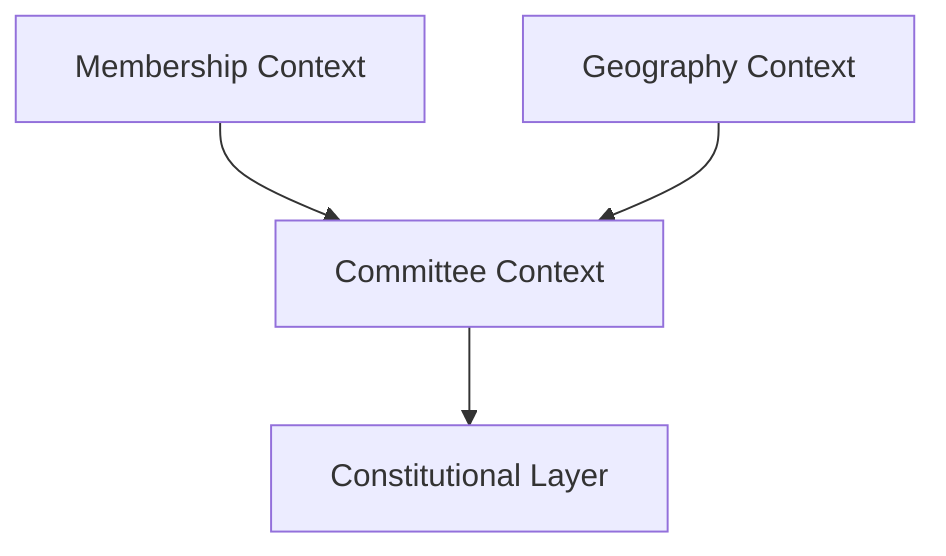
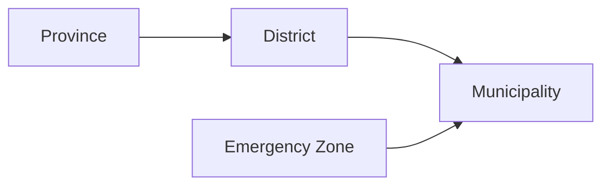
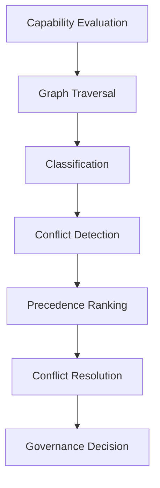
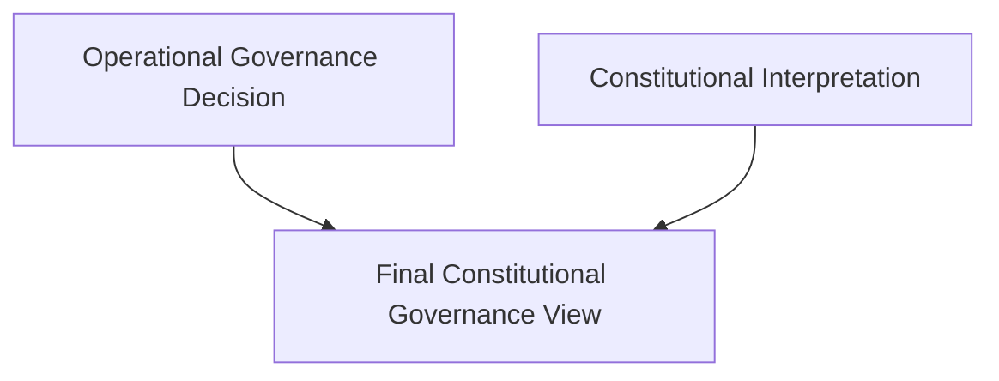

# Membership, Geography & Committee Contexts — Developer Architecture Guide

## Purpose of This Guide

This document is the authoritative architectural and developer guide for the Membership, Geography, and Committee contexts.

It explains:

* Domain boundaries
* Bounded contexts
* Relationships between contexts
* Core aggregates and value objects
* Governance engine architecture
* Temporal governance model
* Constitutional legitimacy model
* How authority resolution works
* How to safely modify the system
* Architectural constraints
* Testing strategy
* Extension strategy
* Replay and auditability principles

This guide is intended for:

* Domain architects
* Senior backend engineers
* Governance engine developers
* Integration developers
* Future maintainers

---

# 1. Architectural Vision

The system evolved from a simple committee-management application into a:

> Temporal Constitutional Governance Platform

The architecture now supports:

* Membership structures
* Geographic governance hierarchies
* Authority delegation
* Temporal governance
* Constitutional legitimacy
* Deterministic authority resolution
* Governance replay
* Audit-safe governance decisions
* Institutional archaeology

The architecture is intentionally designed for:

* High auditability
* Legal traceability
* Deterministic decision replay
* Temporal consistency
* Institutional evolution
* Long-term governance history

---

# 2. High-Level Bounded Contexts

The platform is separated into multiple bounded contexts.

## 2.1 Membership Context

Responsible for:

* Members
* Organizational structures
* Structure versions
* Membership hierarchy
* Committee ownership
* Temporal structure snapshots

This context owns:

* Organizational identity
* Institutional continuity
* Committee lifecycle

---

## 2.2 Geography Context

Responsible for:

* Jurisdiction hierarchy
* Geo authority graph
* Delegation edges
* Authority propagation
* Geographic authority resolution
* Conflict detection
* Deterministic authority precedence

This context owns:

* Geographic authority
* Territorial governance
* Delegated jurisdiction logic

---

## 2.3 Committee Context

Responsible for:

* Committees
* Governance decisions
* Governance events
* Constitutional legitimacy
* Temporal governance evaluation
* Governance replay

This context orchestrates:

* Governance decisions
* Arbitration
* Constitutional interpretation

---

# 3. Context Relationships

## Core Relationship Model



---

# 4. Membership Context Deep Dive

# 4.1 Core Purpose

The Membership context models:

* institutional membership,
* structure evolution,
* committee placement,
* temporal structure identity.

It is NOT responsible for geographic authority.

That separation is critical.

---

# 4.2 Important Architectural Principle

Membership structure and governance authority are NOT the same thing.

Example:

A committee may belong to:

* Organization A

while its authority is governed by:

* District B
* Emergency Override C
* Constitutional Rule D

This separation enables:

* federated governance,
* delegated authority,
* constitutional overlays.

---

# 4.3 Structure Versioning

One of the most important capabilities already implemented.

The system supports:

```text
Temporal institutional reconstruction
```

Meaning:

A committee can always be reconstructed against:

* the exact organizational structure,
* version,
* timestamp,
* governance context

that existed when it was created.

---

# 4.4 Temporal Snapshots

Implemented capabilities:

* immutable committee snapshots
* structure version identity
* temporal archaeology
* replay-safe reconstruction

Key principle:

```text
Historical governance must never depend on current organizational state.
```

---

# 4.5 Membership Context Editing Rules

## SAFE TO MODIFY

* New member attributes
* New structure metadata
* Additional committee metadata
* New read models
* Additional projections
* New events

---

## DANGEROUS TO MODIFY

Never directly modify:

* structure version identity semantics
* temporal snapshot reconstruction logic
* committee historical identity
* immutable snapshot contracts

without replay validation.

---

# 5. Geography Context Deep Dive

# 5.1 Core Purpose

The Geography context models:

```text
Territorial authority propagation.
```

NOT organizational ownership.

It answers:

* Who has authority?
* Through which path?
* At what precedence?
* Under what delegation?
* During which time?

---

# 5.2 Core Components

## JurisdictionNode

Represents a territorial authority node.

Examples:

* Country
* Province
* District
* Municipality
* Ward
* Special zone
* Emergency region

Capabilities:

* active/inactive state
* exception zones
* authority participation

---

## DelegationEdge

Represents delegated authority between nodes.

Examples:

* Province delegates to district
* Emergency authority overrides municipality
* Federal override delegation

Contains:

* source node
* target node
* delegation type
* temporal validity
* activation state

---

## GeoAuthorityGraph

Central traversal engine.

Responsibilities:

* graph traversal
* reachable authority detection
* delegation propagation
* cycle protection
* temporal filtering

---

# 5.3 Graph Traversal Model



Traversal rules:

* inactive edges ignored
* expired edges ignored
* future edges ignored
* inactive target nodes ignored
* cycles safely terminated

---

# 5.4 Authority Classification Layer (GEO-2.2)

Raw graph traversal is NOT directly consumed.

Traversal output is classified into semantic authority buckets.

## AuthorityClassification

Contains:

* direct authority
* delegated authority
* override authority
* exception authority

This separation was one of the most important architectural milestones.

---

# 5.5 Conflict Detection Engine

Purpose:

```text
Detect conflicts WITHOUT resolving them.
```

Critical principle:

```text
Detection and resolution are separate responsibilities.
```

Examples:

* direct vs delegated
* override vs direct
* multiple exception authorities

---

# 5.6 Authority Precedence Policy

Provides deterministic ranking.

Examples:

| Authority Type | Score |
| -------------- | ----- |
| Exception      | 100   |
| Override       | 80    |
| Direct         | 60    |
| Delegated      | 40    |

This policy is injected.

Important architectural principle:

```text
Precedence is policy-driven, not hardcoded into traversal.
```

---

# 5.7 Deterministic Conflict Resolution (GEO-2.3)

The system evolved from:

```text
Conflict Detection
```

into:

```text
Deterministic Governance Resolution
```

---

## FinalAuthorityDecision

Produces:

* winning node
* resolution type
* resolution reason

---

## Resolution Order

Current default:

1. Exception
2. Override
3. Direct
4. Delegated
5. None

---

# 5.8 Stable Selection Policy

Important enterprise capability.

When multiple valid authorities exist:

```text
Selection must always be deterministic.
```

Current implementation:

* lexicographic stable ordering

This guarantees:

* replay safety
* auditability
* deterministic history

---

# 5.9 Governance Decision Kernel

The orchestration center.

Pipeline:



The kernel is intentionally:

* pure domain
* deterministic
* replay-safe
* side-effect free

---

# 5.10 GovernanceDecision

Represents:

```text
Operational governance outcome.
```

Contains:

* GovernanceDecisionId
* decidedAt
* evaluation
* classification
* detected conflicts
* precedence ranking
* final decision
* produced event

---

# 5.11 GovernanceDecisionId

Purpose:

* replay identity
* audit traceability
* governance referencing
* persistence identity

Generated through:

```text
GovernanceDecisionIdGenerator
```

Important:

The generator is injectable.

This allows:

* replay IDs
* deterministic simulation IDs
* testing IDs
* migration IDs

---

# 5.12 GovernanceDecisionProduced Event

Domain event attached to decisions.

Contains:

* decision ID
* tenant ID
* capability type
* resolution type
* winning authority ID

Important principle:

```text
Domain creates events.
Application dispatches events.
```

Kernel NEVER dispatches.

---

# 6. Constitutional Layer (GEO-3.0)

# 6.1 Purpose

The constitutional layer introduces:

```text
Temporal legitimacy.
```

The system no longer asks:

```text
Who has authority?
```

Instead it asks:

```text
Who was constitutionally legitimate at a specific moment?
```

This is a major domain evolution.

---

# 6.2 TemporalAuthorityWindow

Represents:

* validFrom
* validUntil

Rules:

* open-ended windows allowed
* boundary dates are inclusive
* invalid ranges forbidden

Architectural invariant:

```text
validUntil must never be earlier than validFrom.
```

---

# 6.3 GovernanceLegitimacy

Current states:

| State      | Meaning                |
| ---------- | ---------------------- |
| LEGITIMATE | Constitutionally valid |
| EXPIRED    | Authority ended        |
| PENDING    | Authority not started  |
| SUSPENDED  | Temporarily disabled   |
| EMERGENCY  | Emergency authority    |
| CARETAKER  | Interim authority      |
| REVOKED    | Authority removed      |

---

# 6.4 Legitimacy Evaluation

Current GEO-3.0 evaluator derives:

* LEGITIMATE
* EXPIRED
* PENDING

from pure temporal windows.

Future GEO-3.1+ states:

* EMERGENCY
* SUSPENDED
* REVOKED
* CARETAKER

require broader constitutional context.

---

# 6.5 Constitutional Architecture Principle

Constitutional legitimacy overlays operational governance.

It does NOT replace it.

Correct layering:



This separation is critical.

---

# 7. Architectural Constraints

# 7.1 Domain Purity

Domain layer rules:

* no Laravel facades
* no Eloquent
* no infrastructure services
* no database access
* no HTTP logic

Allowed:

* PHP language features
* immutable VOs
* domain events
* interfaces

---

# 7.2 Immutability

All domain value objects must be:

```php
final readonly class
```

Why:

* replay safety
* deterministic behavior
* temporal consistency
* auditability

---

# 7.3 Replay Immutability Rule

Critical architectural rule:

```text
Historical governance replay must NEVER depend on current infrastructure state.
```

Replay must use:

* stored snapshots
* stored legitimacy state
* stored governance metadata
* stored authority history

Never:

* current graph
* current doctrine
* current structure

---

# 7.4 Temporal Logic Centralization

All temporal evaluation must go through:

```text
LegitimacyPolicy / LegitimacyEvaluator
```

Never scatter:

```php
if ($now > $validUntil)
```

throughout the codebase.

---

# 8. Testing Strategy

# 8.1 TDD Is Mandatory

All governance engine work follows:

```text
RED → GREEN → REFACTOR
```

---

# 8.2 Why TDD Is Critical Here

The system contains:

* temporal rules
* precedence rules
* replay rules
* constitutional rules
* graph traversal
* deterministic resolution

These are high-risk logic systems.

TDD is non-negotiable.

---

# 8.3 Test Categories

## Unit Tests

Pure domain behavior.

Examples:

* graph traversal
* legitimacy evaluation
* conflict detection
* temporal windows
* stable selection

---

## Integration Tests

Cross-context orchestration.

Examples:

* committee + geography
* governance decision + replay
* constitutional arbitration

---

## Replay Tests

Critical future category.

Ensures:

```text
Same historical input always produces same historical output.
```

---

# 9. How To Safely Modify the System

# 9.1 Adding New Governance Rules

SAFE APPROACH:

1. Add new policy interface
2. Add isolated implementation
3. Add tests first
4. Inject policy
5. Preserve existing behavior

Never:

* modify graph traversal directly
* hardcode precedence into kernel
* bypass classification layer

---

# 9.2 Adding New Legitimacy Types

SAFE APPROACH:

1. Add enum case
2. Add legitimacy policy support
3. Add replay tests
4. Add constitutional reasoning
5. Add temporal semantics

Never:

* inject legitimacy logic directly into graph traversal

---

# 9.3 Adding New Authority Types

Must update:

* AuthorityClassification
* ConflictDetectionEngine
* PrecedencePolicy
* ConflictResolutionPolicy
* StableSelectionPolicy tests
* Replay tests

---

# 9.4 Adding New Geographic Levels

Examples:

* federal district
* special administrative region
* tribal authority
* emergency governance zone

SAFE because graph is generic.

Usually only requires:

* new node metadata
* optional precedence rules

NOT traversal changes.

---

# 9.5 Adding Persistence

Domain objects must NEVER be serialized directly.

Use:

* snapshots
* DTOs
* persistence mappers
* immutable records

Avoid:

```php
serialize($domainObject)
```

---

# 10. Governance Replay Architecture

# 10.1 Why Replay Exists

Replay supports:

* legal audits
* election disputes
* governance archaeology
* institutional history
* constitutional review
* debugging

---

# 10.2 Replay Requirements

Replay must reconstruct:

* graph state
* temporal legitimacy
* precedence rules
* winning authority
* constitutional interpretation

exactly as originally evaluated.

---

# 10.3 Replay Safety Principles

## Determinism

Same input → same output.

---

## Historical Isolation

Historical replay cannot depend on current state.

---

## Immutable Decisions

Past decisions never mutate.

---

# 11. Future GEO-3.x Evolution

# GEO-3.1

Constitutional arbitration.

Will introduce:

* ConstitutionalDecision
* ConstitutionalReason
* arbitration policies
* doctrine overlays

---

# GEO-3.2

Replay engine.

Will introduce:

* governance persistence
* replay services
* historical reconstruction

---

# GEO-3.3

Governance timelines.

Will introduce:

* historical views
* institutional archaeology UI
* governance history visualization

---

# GEO-3.4

Constitutional article engine.

Will introduce:

* doctrine registries
* legal references
* constitutional article resolution

---

# 12. Anti-Patterns To Avoid

# NEVER Couple Graph Logic To Constitutional Logic

Wrong:

```php
if ($node->isEmergency())
```

inside traversal.

Correct:

* traversal resolves candidates
* constitutional layer interprets legitimacy

---

# NEVER Use Current Time Directly

Wrong:

```php
new DateTimeImmutable()
```

inside domain logic.

Correct:

Inject time.

---

# NEVER Make Replay Depend On Current Graph

Historical replay must use stored historical snapshots only.

---

# NEVER Scatter Temporal Logic

All legitimacy evaluation must remain centralized.

---

# NEVER Bypass Stable Selection

Without deterministic selection:

* replay breaks
* audit trails fail
* governance becomes nondeterministic

---

# 13. Current System Status

Implemented and passing:

| Phase                                       | Status   |
| ------------------------------------------- | -------- |
| GEO-2.1 Authority Graph                     | Complete |
| GEO-2.2 Classification & Conflict Detection | Complete |
| GEO-2.3 Deterministic Resolution            | Complete |
| GEO-2.3 Consolidation (IDs + Events)        | Complete |
| GEO-3.0 Temporal Legitimacy Foundation      | Complete |

Current verified state:

* 98 passing tests
* 255 assertions
* deterministic governance resolution
* temporal legitimacy foundation
* replay-ready decision identity
* governance event emission
* immutable governance decisions

---

# 14. Final Architectural Philosophy

This platform should be understood as:

```text
A temporal constitutional governance engine.
```

NOT merely:

* a committee system,
* a membership platform,
* a geo hierarchy service.

The architecture now supports:

* institutional continuity,
* constitutional legitimacy,
* deterministic authority,
* temporal replay,
* governance archaeology,
* future constitutional doctrine engines.

The most important architectural priorities going forward are:

1. Determinism
2. Replay safety
3. Temporal consistency
4. Domain purity
5. Constitutional traceability
6. Auditability
7. Policy isolation
8. Immutable governance history
