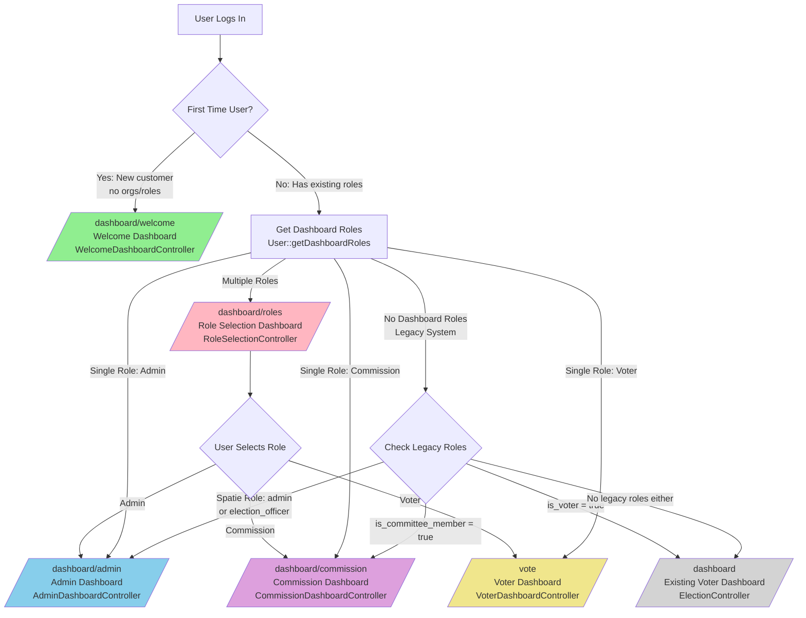

# Three-Role Dashboard System - Architecture

## System Architecture Diagram



## Data Flow: Role Detection

```
User Login
    ↓
LoginResponse::toResponse()
    ↓
1. Check if First-Time User?
   ├─ No organisations
   ├─ No commission memberships
   ├─ Not a voter (legacy)
   ├─ No admin/election_officer roles
   └─ Account created within 7 days
    ↓ YES → Redirect to /dashboard/welcome
    ↓ NO
    ↓
2. Get Dashboard Roles
   User::getDashboardRoles()
   ├─ DB::table('user_organization_roles')
   │  └─ Returns: admin, commission
   ├─ Cache with 60-minute TTL
   └─ Merge with legacy Spatie roles
    ↓
3. Route Based on Count
   ├─ 0 roles → Check legacy
   ├─ 1 role → Direct to dashboard
   └─ 2+ roles → Role selection
    ↓
4. Legacy Fallback
   ├─ hasRole('admin') → admin.dashboard
   ├─ hasRole('election_officer') → admin.dashboard
   ├─ is_voter → dashboard (existing)
   ├─ is_committee_member → commission.dashboard
   └─ None → dashboard (existing)
```

## Role Sources & Priority

### New System (Priority)

**Source 1: user_organization_roles table**
```sql
-- Structure
id | user_id | organisation_id | role | created_at | updated_at

-- Example
1 | 5 | 1 | admin | 2026-02-07 | 2026-02-07
2 | 5 | 2 | commission | 2026-02-07 | 2026-02-07
3 | 6 | 1 | voter | 2026-02-07 | 2026-02-07
```

**Source 2: election_commission_members table**
```sql
-- Structure
id | user_id | election_id | role | created_at | updated_at

-- Example
1 | 7 | 1 | commission_member | 2026-02-07 | 2026-02-07
```

### Legacy System (Fallback)

**Source 3: Spatie Roles**
```php
$user->hasRole('admin')             // From role_user pivot
$user->hasRole('election_officer')  // From role_user pivot
```

**Source 4: Boolean Flags**
```php
$user->is_voter        // Boolean column in users table
$user->is_committee_member  // Boolean column in users table
```

## Middleware Architecture

### CheckUserRole Middleware

**File:** `app/Http/Middleware/CheckUserRole.php`

**Flow:**
```
HTTP Request
    ↓
Is user authenticated?
    ├─ No → Redirect to login
    └─ Yes ↓
Does user have required role?
    ├─ No → Redirect to role.selection
    └─ Yes ↓
Store current_role in $request
    ↓
Next middleware
```

**Usage in routes:**
```php
Route::middleware(['auth', 'role:admin'])->group(function () {
    // Only users with 'admin' role can access
});

Route::middleware(['auth', 'role:commission'])->group(function () {
    // Only users with 'commission' role can access
});

Route::middleware(['auth', 'role:voter'])->group(function () {
    // Only users with 'voter' role can access
});
```

## Database Schema

### users table (Extended)

```sql
CREATE TABLE users (
    id BIGINT UNSIGNED PRIMARY KEY,
    name VARCHAR(255),
    email VARCHAR(255) UNIQUE,
    email_verified_at TIMESTAMP NULL,
    password VARCHAR(255),

    -- Legacy columns (for backward compatibility)
    is_voter BOOLEAN DEFAULT FALSE,
    is_committee_member BOOLEAN DEFAULT FALSE,

    created_at TIMESTAMP,
    updated_at TIMESTAMP
);
```

### organisations table (NEW)

```sql
CREATE TABLE organisations (
    id BIGINT UNSIGNED PRIMARY KEY,
    name VARCHAR(255),
    slug VARCHAR(255) UNIQUE,
    description TEXT NULL,
    languages JSON DEFAULT '["en", "de", "np"]',

    created_at TIMESTAMP,
    updated_at TIMESTAMP,

    INDEX idx_slug (slug)
);
```

### user_organization_roles table (NEW)

```sql
CREATE TABLE user_organization_roles (
    id BIGINT UNSIGNED PRIMARY KEY,
    user_id BIGINT UNSIGNED NOT NULL,
    organisation_id BIGINT UNSIGNED NOT NULL,
    role VARCHAR(255),  -- 'admin', 'commission', 'voter'

    created_at TIMESTAMP,
    updated_at TIMESTAMP,

    FOREIGN KEY (user_id) REFERENCES users(id),
    FOREIGN KEY (organisation_id) REFERENCES organisations(id),
    UNIQUE KEY unique_user_org_role (user_id, organisation_id, role),
    INDEX idx_user (user_id),
    INDEX idx_org (organisation_id)
);
```

### election_commission_members table (NEW)

```sql
CREATE TABLE election_commission_members (
    id BIGINT UNSIGNED PRIMARY KEY,
    user_id BIGINT UNSIGNED NOT NULL,
    election_id BIGINT UNSIGNED NOT NULL,
    role VARCHAR(255) DEFAULT 'commission_member',

    created_at TIMESTAMP,
    updated_at TIMESTAMP,

    FOREIGN KEY (user_id) REFERENCES users(id),
    FOREIGN KEY (election_id) REFERENCES elections(id),
    UNIQUE KEY unique_user_election (user_id, election_id),
    INDEX idx_user (user_id),
    INDEX idx_election (election_id)
);
```

### elections table (Extended)

```sql
ALTER TABLE elections ADD COLUMN organisation_id BIGINT UNSIGNED;
ALTER TABLE elections ADD FOREIGN KEY (organisation_id)
    REFERENCES organisations(id);
```

## Controller Responsibilities

### LoginResponse (Post-Login Router)

**Responsibility:** Determine correct dashboard after login

**Logic:**
1. Check if first-time user
2. Get dashboard roles
3. Route based on role count
4. Fallback to legacy system

**Return:** Redirect to appropriate dashboard

### RoleSelectionController

**Responsibility:** Display and handle multi-role selection

**Methods:**
- `index()` - Show role selection UI with stats
- `switchRole($role)` - Store selected role in session

**Session Usage:**
```php
$request->session()->put('current_role', 'admin');
```

### Dashboard Controllers (Admin, Commission, Voter)

**Responsibility:** Display role-specific dashboard

**Methods:**
- `index()` - Show dashboard with appropriate data

**Middleware:**
```php
Route::middleware(['auth', 'role:admin'])->group(...)
```

## Welcome Dashboard (First-Time User)

### Purpose

Guide new users through organisation setup and feature introduction

### Content Sections

1. **Welcome Greeting** - Personalized with user's name
2. **GDPR Compliance Notice** - German privacy assurance
3. **Action Buttons** (Primary & Secondary)
   - Create organisation (PRIMARY)
   - Join organisation (secondary)
   - Explore Platform (secondary)
4. **Use Case Examples** - German orgs & diaspora
5. **Social Proof** - 50+ organisations, 8 languages, 100% GDPR
6. **Key Features** - Transparency, security, multilingual
7. **Quick Tips** - Getting started hints

### Design Principles

✅ Match marketing site quality
✅ Clear visual hierarchy
✅ Show value of creating organisation
✅ Build confidence with metrics
✅ Multi-language support (EN/DE/NP)

## Caching Strategy

### Dashboard Roles Cache

```php
Cache::remember(
    "user_{$userId}_dashboard_roles",
    3600,  // 60 minutes
    function () {
        return DB::table('user_organization_roles')
            ->where('user_id', $userId)
            ->pluck('role')
            ->toArray();
    }
);
```

### Cache Invalidation

When user's roles change, clear cache:

```php
// In RoleAssignment or UserController
Cache::forget("user_{$userId}_dashboard_roles");

// Or bulk clear
Cache::flush();
```

## Security Considerations

### Authentication

✅ All routes require `auth` middleware
✅ Session-based (Laravel default)
✅ CSRF tokens on forms
✅ Role-based access control at middleware level

### Authorization

✅ Role verification before data access
✅ organisation ownership checks
✅ Election-specific commission checks
✅ Voter eligibility validation

### Data Privacy

✅ German servers only
✅ End-to-end encryption for sensitive data
✅ GDPR-compliant data handling
✅ Audit trails for elections

## Extension Points

### Adding a New Dashboard

1. Create controller: `app/Http/Controllers/{Role}DashboardController.php`
2. Create Vue component: `resources/js/Pages/{Role}/Dashboard.vue`
3. Create translations: `resources/js/locales/pages/{Role}/`
4. Add routes in `routes/web.php`
5. Update `LoginResponse.php` routing logic
6. Add new role type to `user_organization_roles.role` ENUM

### Adding a New Role Type

1. Decide: organisation-level or election-level role?
2. Add to appropriate table: `user_organization_roles` or `election_commission_members`
3. Update `User::getDashboardRoles()` logic
4. Create dashboard controller and views
5. Add translations for the new role
6. Update middleware for role validation

## Performance Notes

- Dashboard roles cached for 60 minutes
- Queries optimized with indexes
- Middleware runs before controller instantiation
- Role selection UI loads stats asynchronously
- Translation files loaded per-locale

## Testing Scenarios

See `TESTING.md` for comprehensive test cases covering:
- First-time user flow
- Multi-role user flow
- Legacy user migration
- Role switching
- Access control
- Edge cases
