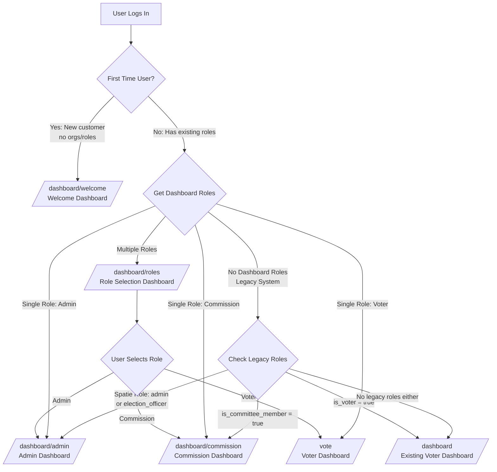

## **DASHBOARD MAPPING TABLE:**

| User Type | Dashboard | Purpose | URL |
|-----------|-----------|---------|-----|
| **New Customer** | Welcome Dashboard | Onboarding, organization setup | `/dashboard/welcome` |
| **Multi-Role User** | Role Selection | Choose which dashboard to use | `/dashboard/roles` |
| **Organization Admin** | Admin Dashboard | Manage orgs, elections, users | `/dashboard/admin` |
| **Election Commission** | Commission Dashboard | Monitor elections, audit votes | `/dashboard/commission` |
| **Registered Voter** | Voter Dashboard | Vote, view ballot, history | `/vote` |
| **Legacy Voter** | Existing Dashboard | Backward compatibility | `/dashboard` |
| **Fallback User** | Existing Dashboard | Default for all others | `/dashboard` |

## **ROLE SOURCES:**

1. **New System (Dashboard Roles):**
   - `admin` → From `user_organization_roles` table (organization admin)
   - `commission` → From `election_commission_members` table
   - `voter` → From `is_voter` flag + organization membership

2. **Legacy System (Backward Compatible):**
   - `Spatie admin/election_officer` roles
   - `is_committee_member` flag
   - `is_voter` flag

## **USER JOURNEY EXAMPLES:**

**Example 1: New Customer**
```
Sign Up → Login → Welcome Dashboard → Create Org → Become Admin → 
Logout → Login → Admin Dashboard
```

**Example 2: Existing Admin + Voter**
```
Login → Role Selection → Choose Admin → Admin Dashboard
                    OR → Choose Voter → Voter Dashboard
```

**Example 3: Legacy Committee Member**
```
Login → Commission Dashboard (auto-redirect)
```

## **KEY LOGIC IN LoginResponse.php:**

```php
// Priority Order:
1. First-time users → /dashboard/welcome
2. Multi-role users → /dashboard/roles  
3. Single-role users → Direct to specific dashboard
4. Legacy role users → Backward compatible redirects
5. Everyone else → /dashboard (existing system)
```

This ensures:
- **New customers** get proper onboarding
- **Multi-role users** can choose context
- **Legacy users** continue working
- **No one gets stuck** without a dashboard