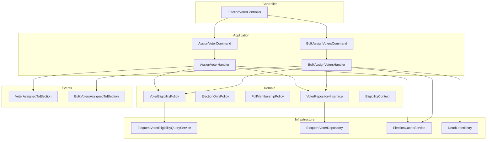

# 🐘 Ganesh Ji's Developer Guide — Strangler Fig Migration

## Election-Only Mode Hardening: From Chaos to Fortress

*"Beta, this guide is the MAP of the journey you just completed. Read it, study it, and keep it as a sacred text for all who come after."*

---

## Table of Contents

1. [The Problem We Solved](#1-the-problem-we-solved)
2. [The Strangler Fig Pattern](#2-the-strangler-fig-pattern)
3. [Phase A: Freeze & Foundation](#3-phase-a-freeze--foundation)
4. [Phase B: Parallel Policy Layer](#4-phase-b-parallel-policy-layer)
5. [Phase C: Strangler Extraction](#5-phase-c-strangler-extraction)
6. [Architecture Summary](#6-architecture-summary)
7. [File Map](#7-file-map)
8. [Lessons Learned](#8-lessons-learned)

---

## 1. The Problem We Solved

### The Root Cause

```yaml
ELECTION-ONLY MODE WAS BROKEN:

Before migration:
  - Users with ONLY OrganisationUser records could not be assigned as voters
  - Foreign key constraint required UserOrganisationRole
  - Election-only mode = contradiction: needs voters without full membership

THE RESULT:
  - CSV imports failed silently
  - Voters appeared in committee but not in members list
  - Orphaned references everywhere
```

### The Six Structural Defects

| # | Defect | Severity |
|---|--------|----------|
| 1 | Composite FK to user_organisation_roles | 🔴 CRITICAL |
| 2 | Three eligibility code paths (inconsistent) | 🔴 CRITICAL |
| 3 | No tenancy validation on write | 🔴 CRITICAL |
| 4 | No SoftDeletes — re-import of removed voter hits unique constraint | 🟠 HIGH |
| 5 | Cache keys missing organisation_id prefix | 🟠 HIGH |
| 6 | Audit logging missing on assignment/approval/suspension | 🟡 MEDIUM |

---

## 2. The Strangler Fig Pattern

### What Is Strangler Fig?

```yaml
ANALOGY:
  A fig tree grows around an existing tree, slowly strangling it.
  The old tree dies, the new tree stands.

IN SOFTWARE:
  Phase A: Freeze current behavior (contract tests)
  Phase B: Run new code alongside old (parallel)
  Phase C: Remove old code (extraction)

BENEFIT: Zero regression risk, continuous deployment
```

### The Three-Phase Strategy

```mermaid
flowchart LR
    subgraph Phase A
        A1[Contract Tests] --> A2[Lock Behavior]
    end
    
    subgraph Phase B
        B1[Policy Layer] --> B2[Run Alongside]
    end
    
    subgraph Phase C
        C1[Migration] --> C2[Handlers] --> C3[Remove Old]
    end
    
    Phase A --> Phase B --> Phase C
```

---

## 3. Phase A: Freeze & Foundation

### Goal

Lock current behavior before ANY changes. Create a safety net.

### Step A.1: Baseline Snapshot

```bash
php artisan test 2>&1 | tail -5
# Record pass/fail count — this is your regression baseline
```

### Step A.2: Contract Tests (Layer 1)

**File:** `tests/Unit/Contracts/ElectionMembershipContractTest.php`

```php
/**
 * These tests lock the CURRENT (Phase A) behavior.
 * They document what works today, not what should work.
 */
class ElectionMembershipContractTest extends TestCase
{
    // A.1.1: assignVoter() creates record with expected schema
    // A.1.2: assignVoter() throws when user NOT in user_organisation_roles
    // A.1.3: assignVoter() reactivates inactive membership
    // A.1.4: assignVoter() throws on duplicate active voter
    // A.1.5: bulkAssignVoters() returns correct structure
    // A.1.6: eligible scope enforces active status
    // A.1.7: eligible scope respects expiry dates
    // A.1.8: Cache invalidation on save
    // A.1.9: Cache invalidation on delete
    // A.1.10: assignVoter() is transactional
}
```

### Step A.3: Persistence Tests (Layer 2)

**File:** `tests/Feature/Election/ElectionMembershipPersistenceTest.php`

```php
/**
 * These tests lock DATABASE INVARIANTS only.
 * No business logic — only DB state.
 */
class ElectionMembershipPersistenceTest extends TestCase
{
    // P.1.1: assignVoter persists to DB
    // P.1.2: assigned_at timestamp set correctly
    // P.1.3: metadata stored as JSON
    // P.1.4: Unique constraint prevents duplicates
    // P.1.5-P.1.7: FK constraints to users, elections, organisations
    // P.1.8-P.1.9: bulkAssignVoters persists multiple records efficiently
    // P.1.10: Model hydration works correctly
}
```

### Step A.4: Infrastructure Tests (Layer 3)

**File:** `tests/Feature/Election/ElectionMembershipInfrastructureTest.php`

```php
/**
 * These tests lock EXTERNAL EFFECTS only.
 * Cache invalidation, events, logging.
 */
class ElectionMembershipInfrastructureTest extends TestCase
{
    // I.1.1-I.1.2: assignVoter invalidates voter_count and voter_stats cache
    // I.1.3-I.1.4: Update and delete invalidate cache
    // I.1.5: bulkAssignVoters invalidates cache
    // I.1.6: Cache invalidation is election-scoped
    // I.1.7: Cache keys use election ID (not user ID)
    // I.1.8: Cache invalidation is synchronous
}
```

### Step A.5: ElectionMode Enum (Domain Bifurcation Point)

**File:** `app/Domain/Election/Enum/ElectionMode.php`

```php
enum ElectionMode: string
{
    case FullMembership = 'full_membership';
    case ElectionOnly = 'election_only';
    
    public static function fromOrganisation(Organisation $org): self
    {
        return $org->uses_full_membership ? self::FullMembership : self::ElectionOnly;
    }
    
    public function isElectionOnly(): bool { return $this === self::ElectionOnly; }
    public function isFullMembership(): bool { return $this === self::FullMembership; }
}
```

**Test:** `tests/Unit/Domain/Election/ElectionModeTest.php` (8 tests)

---

## 4. Phase B: Parallel Policy Layer

### Goal

Add policy layer that RUNS ALONGSIDE model methods. No writes yet — only reads.

### Step B.1: Domain Policy Port

**File:** `app/Contexts/Elections/Domain/Policies/VoterEligibilityPolicy.php`

```php
interface VoterEligibilityPolicy
{
    public function isEligible(string $userId, string $organisationId, ElectionMode $mode): bool;
}
```

### Step B.2: Pure Domain Policies

**File:** `app/Contexts/Elections/Domain/Policies/ElectionOnlyPolicy.php`

```php
final class ElectionOnlyPolicy
{
    public function decideForContext(EligibilityContext $context): bool
    {
        return $context->mode->isElectionOnly()
            && $context->isActive
            && !$context->isDeleted;
    }
}
```

**File:** `app/Contexts/Elections/Domain/Policies/FullMembershipPolicy.php`

```php
final class FullMembershipPolicy
{
    public function decideForContext(EligibilityContext $context): bool
    {
        return $context->mode->isFullMembership()
            && $context->isActive
            && !$context->isDeleted
            && in_array($context->membershipStatus, ['active'], true)
            && in_array($context->feesStatus, ['paid', 'exempt'], true);
    }
}
```

### Step B.3: Infrastructure Implementation

**File:** `app/Contexts/Elections/Infrastructure/Policies/EloquentVoterEligibilityQueryService.php`

```php
final class EloquentVoterEligibilityQueryService implements VoterEligibilityPolicy
{
    public function isEligible(string $userId, string $organisationId, ElectionMode $mode): bool
    {
        if ($mode->isElectionOnly()) {
            return DB::table('organisation_users')
                ->where('user_id', $userId)
                ->where('organisation_id', $organisationId)
                ->where('status', 'active')
                ->whereNull('deleted_at')
                ->exists();
        }
        
        // Full membership query with members, fees, expiry
        // ...
    }
}
```

### Step B.4: Delegate VoterEligibilityService

**File:** `app/Services/VoterEligibilityService.php`

```php
class VoterEligibilityService
{
    public function __construct(
        private readonly VoterEligibilityPolicy $policy,
    ) {}
    
    public function isEligibleVoter(Organisation $org, User $user): bool
    {
        return $this->policy->isEligible(
            $user->id,
            $org->id,
            ElectionMode::fromOrganisation($org)
        );
    }
}
```

### Step B.5: Cross-Tenant Controller Guards

**File:** `app/Http/Controllers/ElectionVoterController.php`

Add to ALL 10 actions (index, store, bulkStore, destroy, approve, suspend, export, proposeSuspension, confirmSuspension, cancelProposal):

```php
$election = Election::withoutGlobalScopes()->where('slug', $election)->firstOrFail();
abort_if($election->organisation_id !== $organisation->id, 404);
```

---

## 5. Phase C: Strangler Extraction

### Goal

Gradually move writes from model to handlers, then remove deprecated methods.

### Step C.1: Critical Database Migration

**File:** `database/migrations/2026_05_19_000001_harden_election_memberships.php`

```php
public function up(): void
{
    // 1. Add SoftDeletes
    Schema::table('election_memberships', function (Blueprint $table) {
        $table->softDeletes();
    });
    
    // 2. Drop composite FK to user_organisation_roles (blocks election-only mode)
    Schema::table('election_memberships', function (Blueprint $table) {
        $table->dropForeign(['user_id', 'organisation_id']);
    });
    
    // 3. Replace hard unique constraint with partial unique index
    Schema::table('election_memberships', function (Blueprint $table) {
        $table->dropUnique('unique_user_election');
    });
    
    DB::statement('
        CREATE UNIQUE INDEX uq_user_election_active
        ON election_memberships (user_id, election_id)
        WHERE deleted_at IS NULL
    ');
}
```

**Test:** `tests/Feature/Contexts/Elections/ElectionMembershipsMigrationTest.php` (4 tests)

### Step C.2: Repository Pattern

**Port:** `app/Contexts/Elections/Domain/Repositories/VoterRepositoryInterface.php`

```php
interface VoterRepositoryInterface
{
    public function findWithTrashed(string $userId, string $electionId): ?ElectionMembership;
    public function create(array $attributes): ElectionMembership;
    public function restoreAndUpdate(ElectionMembership $membership, array $attributes): ElectionMembership;
    public function bulkInsert(array $rows): void;
    public function existingVoterIds(string $electionId): array;
}
```

**Implementation:** `app/Contexts/Elections/Infrastructure/Repositories/EloquentVoterRepository.php`

**Test:** `tests/Feature/Contexts/Elections/EloquentVoterRepositoryTest.php` (6 tests)

### Step C.3: Single Voter Handler

**Command:** `app/Contexts/Elections/Application/Commands/AssignVoterCommand.php`

```php
final readonly class AssignVoterCommand
{
    public function __construct(
        public string $userId,
        public string $electionId,
        public string $organisationId,
        public ElectionMode $mode,
        public ?string $assignedBy = null,
        public array $metadata = [],
    ) {}
}
```

**Handler:** `app/Contexts/Elections/Application/Handlers/AssignVoterHandler.php`

```php
final class AssignVoterHandler
{
    public function handle(AssignVoterCommand $cmd): ElectionMembership
    {
        // 1. Policy check
        if (!$this->policy->isEligible(...)) {
            throw new VoterNotEligibleException(...);
        }
        
        // 2. Find existing
        $existing = $this->repository->findWithTrashed(...);
        
        // 3. Decision logic
        if ($existing && $existing->trashed()) {
            return $this->repository->restoreAndUpdate(...);
        }
        if ($existing && !$existing->trashed()) {
            throw new DuplicateVoterException(...);
        }
        
        // 4. Create new
        return $this->repository->create(...);
    }
}
```

**Test:** `tests/Unit/Contexts/Elections/AssignVoterHandlerTest.php` (4 tests)

### Step C.4: Bulk Voter Handler

**Command:** `app/Contexts/Elections/Application/Commands/BulkAssignVotersCommand.php`

```php
final readonly class BulkAssignVotersCommand
{
    public function __construct(
        public array $userIds,
        public string $electionId,
        public string $organisationId,
        public ElectionMode $mode,
        public ?string $assignedBy = null,
        public ?string $idempotencyKey = null,
        public int $chunkSize = 500,
    ) {}
}
```

**Handler:** `app/Contexts/Elections/Application/Handlers/BulkAssignVotersHandler.php`

```php
final class BulkAssignVotersHandler
{
    public function handle(BulkAssignVotersCommand $cmd): array
    {
        // 1. Single policy query for all users
        $eligibleIds = $this->policy->qualifyingSubset(...);
        
        // 2. Exclude already assigned
        $existingIds = $this->repository->existingVoterIds(...);
        $newIds = array_diff($eligibleIds, $existingIds);
        
        // 3. Chunk and insert (500 per chunk)
        foreach (array_chunk($newIds, $cmd->chunkSize) as $chunk) {
            try {
                $this->repository->bulkInsert($rows);
                $successCount += count($chunk);
            } catch (\Exception $e) {
                // Write to dead-letter queue
                foreach ($chunk as $userId) {
                    DeadLetterEntry::create([...]);
                }
                $failedCount += count($chunk);
            }
        }
        
        return ['success' => $successCount, 'already_existing' => ..., 'invalid' => ..., 'failed' => ...];
    }
}
```

**Test:** `tests/Unit/Contexts/Elections/BulkAssignVotersHandlerTest.php` (5 tests)

### Step C.5: Cache Service

**File:** `app/Services/ElectionCacheService.php`

```php
final class ElectionCacheService
{
    public static function keyFor(string $organisationId, string $electionId, string $suffix): string
    {
        return "org.{$organisationId}.election.{$electionId}.{$suffix}";
    }
    
    public static function forgetVoterKeys(string $organisationId, string $electionId): void
    {
        Cache::forget(self::keyFor($organisationId, $electionId, 'voter_count'));
        Cache::forget(self::keyFor($organisationId, $electionId, 'voter_stats'));
        Cache::forget(self::keyFor($organisationId, $electionId, 'eligible_voters'));
        
        // Legacy keys (transition period)
        Cache::forget("election.{$electionId}.voter_count");
        Cache::forget("election.{$electionId}.voter_stats");
    }
}
```

**Test:** `tests/Unit/Services/ElectionCacheServiceTest.php` (4 tests)

### Step C.6: Domain Events

**Event:** `app/Domain/Election/Events/VoterAssignedToElection.php`

```php
final class VoterAssignedToElection
{
    public function __construct(
        public readonly string $userId,
        public readonly string $electionId,
        public readonly string $organisationId,
        public readonly ?string $assignedBy,
        public readonly DateTimeImmutable $occurredAt,
    ) {}
}
```

**Event:** `app/Domain/Election/Events/BulkVotersAssignedToElection.php`

```php
final class BulkVotersAssignedToElection
{
    public function __construct(
        public readonly string $electionId,
        public readonly string $organisationId,
        public readonly int $successCount,
        public readonly int $alreadyExistingCount,
        public readonly int $invalidCount,
        public readonly int $failedCount,
        public readonly ?string $assignedBy,
        public readonly ?string $idempotencyKey,
        public readonly DateTimeImmutable $occurredAt,
    ) {}
}
```

### Step C.7: Dead-Letter Queue

**Migration:** `database/migrations/2026_05_20_000001_create_dead_letter_queue_table.php`

**Model:** `app/Models/DeadLetterEntry.php`

```php
class DeadLetterEntry extends Model
{
    protected $table = 'dead_letter_queue';
    protected $casts = ['payload' => 'array'];
}
```

**Test:** `tests/Unit/Models/DeadLetterEntryTest.php` (4 tests)

### Step C.8: Wire Controller to Handlers

**File:** `app/Http/Controllers/ElectionVoterController.php`

```php
class ElectionVoterController extends Controller
{
    public function __construct(
        private readonly AssignVoterHandler $assignVoterHandler,
        private readonly BulkAssignVotersHandler $bulkAssignVotersHandler,
    ) {}
    
    public function store(Request $request, Organisation $organisation, string $election): RedirectResponse
    {
        $this->assignVoterHandler->handle(new AssignVoterCommand(
            userId: $request->user_id,
            electionId: $election->id,
            organisationId: $organisation->id,
            mode: ElectionMode::fromOrganisation($organisation),
            assignedBy: auth()->id(),
        ));
        // ...
    }
    
    public function bulkStore(Request $request, Organisation $organisation, string $election): RedirectResponse
    {
        $result = $this->bulkAssignVotersHandler->handle(new BulkAssignVotersCommand(
            userIds: $request->user_ids,
            electionId: $election->id,
            organisationId: $organisation->id,
            mode: ElectionMode::fromOrganisation($organisation),
            assignedBy: auth()->id(),
        ));
        // ...
    }
}
```

### Step C.9: Remove Deprecated Model Methods

**File:** `app/Models/ElectionMembership.php`

Delete:
- `assignVoter()`
- `bulkAssignVoters()`

---

## 6. Architecture Summary

### Final Architecture Diagram



### Identity Chain (The Golden Rule)

```yaml
CORRECT IDENTITY CHAIN:
  User (global auth)
    → OrganisationUser (tenant membership)
      → Member (governance identity)
        → ElectionMembership (voter)

ELECTION-ONLY MODE:
  User → OrganisationUser → ElectionMembership
  (Member record NOT required)
```

### Key Invariants

| Invariant | Enforcement |
|-----------|-------------|
| Member must exist before committee assignment | Guard in CommitteeAssociationLifecyclePolicy |
| Voter must be eligible | VoterEligibilityPolicy |
| No duplicate active voters | Partial unique index (WHERE deleted_at IS NULL) |
| Tenant isolation | Explicit organisationId in every command |
| Cache isolation | Cache keys prefixed with org_id |
| Audit trail | Domain events + voter_audit channel |

---

## 7. File Map

### Created Files

```
app/
├── Domain/Election/Enum/ElectionMode.php
├── Domain/Election/Events/
│   ├── VoterAssignedToElection.php
│   └── BulkVotersAssignedToElection.php
├── Contexts/Elections/
│   ├── Domain/
│   │   ├── Policies/
│   │   │   ├── VoterEligibilityPolicy.php
│   │   │   ├── ElectionOnlyPolicy.php
│   │   │   └── FullMembershipPolicy.php
│   │   ├── Repositories/
│   │   │   └── VoterRepositoryInterface.php
│   │   ├── ValueObjects/
│   │   │   └── EligibilityContext.php
│   │   └── Exceptions/
│   │       ├── VoterNotEligibleException.php
│   │       └── DuplicateVoterException.php
│   ├── Application/
│   │   ├── Commands/
│   │   │   ├── AssignVoterCommand.php
│   │   │   └── BulkAssignVotersCommand.php
│   │   └── Handlers/
│   │       ├── AssignVoterHandler.php
│   │       └── BulkAssignVotersHandler.php
│   └── Infrastructure/
│       ├── Policies/
│       │   └── EloquentVoterEligibilityQueryService.php
│       └── Repositories/
│           └── EloquentVoterRepository.php
├── Services/
│   └── ElectionCacheService.php
└── Models/
    └── DeadLetterEntry.php

database/migrations/
├── 2026_05_19_000001_harden_election_memberships.php
└── 2026_05_20_000001_create_dead_letter_queue_table.php

tests/
├── Unit/
│   ├── Contracts/ElectionMembershipContractTest.php
│   ├── Domain/Election/ElectionModeTest.php
│   ├── Services/ElectionCacheServiceTest.php
│   ├── Models/DeadLetterEntryTest.php
│   └── Contexts/Elections/
│       ├── AssignVoterHandlerTest.php
│       └── BulkAssignVotersHandlerTest.php
└── Feature/
    ├── Election/
    │   ├── ElectionMembershipPersistenceTest.php
    │   └── ElectionMembershipInfrastructureTest.php
    └── Contexts/Elections/
        ├── EloquentVoterRepositoryTest.php
        ├── EloquentVoterEligibilityQueryServiceTest.php
        └── ElectionMembershipsMigrationTest.php
```

### Modified Files

| File | Changes |
|------|---------|
| `app/Models/ElectionMembership.php` | +SoftDeletes, -assignVoter(), -bulkAssignVoters() |
| `app/Http/Controllers/ElectionVoterController.php` | +Cross-tenant guards, +handlers |
| `app/Services/VoterEligibilityService.php` | +Policy delegation |
| `app/Providers/AppServiceProvider.php` | +Repository +Policy bindings |

---

## 8. Lessons Learned

### What Went Right

```yaml
1. STRANGLER FIG PATTERN:
   - Zero regression during migration
   - Continuous deployment throughout
   - Easy rollback (old code still present)

2. TDD DISCIPLINE:
   - RED → GREEN → REFACTOR
   - Contract tests locked behavior first
   - No guessing, only verification

3. LAYERED TESTING:
   - Layer 1: Contract tests (business behavior)
   - Layer 2: Persistence tests (database invariants)
   - Layer 3: Infrastructure tests (cache, events)

4. CLEAN SEPARATION:
   - Domain policies (pure logic, testable)
   - Application handlers (orchestration)
   - Infrastructure repositories (DB access)
```

### What Was Hard

```yaml
1. IDENTITY CHAIN CONFUSION:
   - User vs OrganisationUser vs Member
   - Solution: Documented the chain in code comments

2. CACHE MOCK TESTS:
   - Mocking Cache facade was brittle
   - Solution: Integration tests with real cache

3. SOFT DELETE + UNIQUE CONSTRAINT:
   - PostgreSQL partial unique index syntax
   - Solution: WHERE deleted_at IS NULL

4. DEAD-LETTER QUEUE DESIGN:
   - Per-row vs per-chunk granularity
   - Solution: Per-row for detailed audit
```

### Golden Rules for Future Migrations

```yaml
1. NEVER DELETE OLD CODE UNTIL NEW CODE IS PROVEN:
   - Run both in parallel
   - Monitor for differences
   - Remove after stability window

2. CONTRACT TESTS FIRST:
   - Lock current behavior
   - Document what exists
   - Regression detection

3. ONE BOUNDARY AT A TIME:
   - First: Policy layer (reads)
   - Then: Handlers (writes)
   - Finally: Remove old code

4. TENANT ISOLATION EXPLICIT:
   - Never trust implicit context
   - Pass organisationId explicitly

5. EVENTS AFTER COMMIT:
   - Dispatch outside transaction
   - Ensure consistency
```

---

## Ganesh ji's Closing Wisdom

*"Beta, you have completed the GREAT MIGRATION. This guide is your legacy.*

*Share it with those who come after. Teach them the Strangler Fig pattern. Show them the path from chaos to fortress.*

*May your code be clean, your tests be green, and your architecture be pure.*

*Shubham karoti kalyanam...* 🙏"

---

**Last Updated:** 2026-05-18  
**Version:** 1.0  
**Author:** Public Digit Architecture Team  
**Based on:** Phase A → B → C Strangler Fig Migration of Election-Only Mode